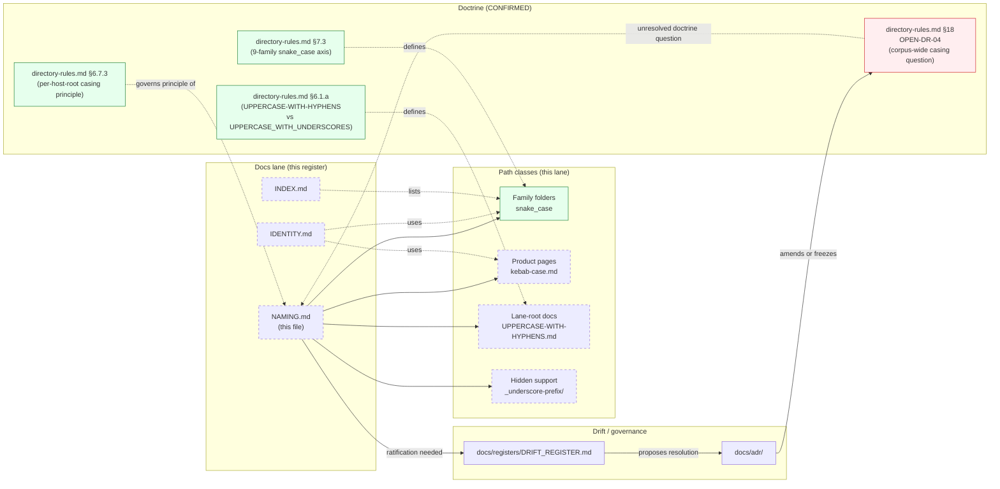

<!-- [KFM_META_BLOCK_V2]
doc_id: kfm://doc/docs-sources-catalog-naming
title: Source catalog naming conventions
type: register
version: v0.2
status: draft
owners: <PLACEHOLDER — Docs steward · Source steward>
created: 2026-05-20
updated: 2026-05-23
policy_label: public
related:
  - docs/sources/catalog/README.md
  - docs/sources/catalog/INDEX.md
  - docs/sources/catalog/IDENTITY.md
  - docs/sources/catalog/OPEN-QUESTIONS.md
  - docs/doctrine/directory-rules.md
  - docs/registers/DRIFT_REGISTER.md
tags: [kfm, docs, sources, catalog, register, naming, casing]
notes:
  - "v0.2 — full presentation-standard pass; casing decisions grounded against directory-rules.md §6.1.a (UPPERCASE-WITH-HYPHENS for external standards' own short names; UPPERCASE_WITH_UNDERSCORES for KFM-coined topical) and §6.7.3 (per-host-root casing principle)."
  - "v0.1 claimed the convention is 'locked'; v0.2 corrects this to PROPOSED — OPEN-DSC-07 (this lane) and OPEN-DR-04 (doctrine §18) are both still OPEN."
  - "PROPOSED scaffold; sibling-link presence verified in a prior Claude Code session, not in this session."
  - "Cross-references: OPEN-DR-04 (directory-rules §18 — corpus-wide casing question); OPEN-DSC-02 (lane: flat per-family pages reconciliation); OPEN-CM-01..04 (COVERAGE-MATRIX drift signals where casing intersects domain-axis naming)."
[/KFM_META_BLOCK_V2] -->

# Source catalog naming conventions

> Decision register for path and filename casing within the `docs/sources/catalog/` lane — a register of conventions, not authority.

**Status:** scaffold (PROPOSED) · **Type:** register *(docs lane; not authority)* · **Last reviewed:** 2026-05-23

---

## Quick jump

- [Purpose](#purpose)
- [Authority pointer](#authority-pointer)
- [Casing decision register](#casing-decision-register)
- [Worked examples](#worked-examples)
- [Cross-lane consistency note](#cross-lane-consistency-note)
- [Where this register sits](#where-this-register-sits)
- [Enforcement and maintenance](#enforcement-and-maintenance)
- [Open questions](#open-questions)
- [Related docs](#related-docs)

---

## Purpose

This register answers one question:

> **For each path class inside the `docs/sources/catalog/` lane, what casing convention applies — and what should an author do when in doubt?**

> [!IMPORTANT]
> This is a **PROPOSED convention**, not a locked rule. v0.1 stated the convention was "locked"; that overclaimed — the corresponding open questions ([`OPEN-DSC-07`](./OPEN-QUESTIONS.md) in this lane and **OPEN-DR-04** in `directory-rules.md` §18) are both still **OPEN**. Ratification requires a per-root README note *(acceptable per `directory-rules.md` §18 OPEN-DR-04: "Resolution by per-root README in `docs/standards/README.md` is acceptable; alternatively a one-line ADR can freeze the rule")* or a one-line ADR.

> [!NOTE]
> The KFM-wide casing principle is **per-host-root**, not project-wide *(directory-rules.md §6.7.3: "each casing matches its host root's existing convention")*. The catalog-lane conventions below derive from `directory-rules.md` §6.1.a (external standards) and the `connectors/` family-list snake_case (§7.3). This is the lane's casing decision, not a recommendation for other lanes.

[Back to top](#quick-jump)

---

## Authority pointer

| Concern | Where authority lives | Status |
|---|---|---|
| Doctrine-wide casing question | [`directory-rules.md`](../../doctrine/directory-rules.md) §18 **OPEN-DR-04** | **OPEN — pending per-root README or ADR** |
| External-standards filename casing (`UPPERCASE-WITH-HYPHENS`) | [`directory-rules.md`](../../doctrine/directory-rules.md) §6.1.a | **CONFIRMED rule** *(for the standards' own short names: `ISO-19115.md`, `OAI-PMH.md`, `STAC.md`, etc.)* |
| KFM-coined topical-standards casing (`UPPERCASE_WITH_UNDERSCORES`) | [`directory-rules.md`](../../doctrine/directory-rules.md) §6.1.a | **CONFIRMED rule** *(for KFM-coined multi-word topical docs: `SENSITIVITY_RUBRIC.md`, `REDACTION_DETERMINISM.md`)* |
| Family-axis casing (snake_case for the nine families) | [`directory-rules.md`](../../doctrine/directory-rules.md) §7.3 + KFM Repository Structure Guiding Document `connectors/` enumeration | **CONFIRMED** *(`usgs`, `fema`, `noaa`, `nrcs`, `kansas`, `gbif`, `inaturalist`, `census`, `local_upload`)* |
| Per-host-root casing principle | [`directory-rules.md`](../../doctrine/directory-rules.md) §6.7.3 (Focus Mode worked example) | **CONFIRMED principle** |
| Drift entries (within-lane casing irregularities) | [`docs/registers/DRIFT_REGISTER.md`](../../registers/DRIFT_REGISTER.md) | **CONFIRMED root** *(directory-rules.md §2.5)* |

> [!CAUTION]
> This register **does not** dictate casing for other lanes. `docs/runbooks/`, `docs/standards/`, `docs/domains/`, `docs/atlases/`, `contracts/`, `schemas/`, `fixtures/`, `apps/`, `data/catalog/`, `release/` each have their own casing per §6.7.3 — and that is intentional.

[Back to top](#quick-jump)

---

## Casing decision register

| # | Path class | Convention (PROPOSED) | Doctrinal anchor | Example |
|---|---|---|---|---|
| 1 | **Family folders** | `lowercase_with_underscores` *(matches `connectors/<family>/` snake_case)* | `directory-rules.md` §7.3; KFM Repository Structure Guiding Document `connectors/` enumeration | `local_upload/`, `inaturalist/`, `kansas/` |
| 2 | **Product pages** | `lowercase-with-hyphens.md` *(kebab-case; human-readable product slug)* | `directory-rules.md` §6.7.3 docs-lane convention (kebab-case for human-readable scope) | `storm-events.md`, `wbd-huc12.md`, `nfhl-flood-zones.md` |
| 3 | **Lane-root governance docs** | `UPPERCASE-WITH-HYPHENS.md` *(hyphens — per §6.1.a "standards's own short name" pattern)* | `directory-rules.md` §6.1.a *(for external-standards-style short names)* | `RIGHTS-AND-SENSITIVITY-MAP.md`, `OPEN-QUESTIONS.md`, `COVERAGE-MATRIX.md`, `CARE-COMPLIANCE.md` |
| 4 | **Hidden support folders** | underscore prefix | PROPOSED convention *(no direct doctrine anchor; follows conventional underscore-prefix-for-private/template pattern)* | `_template/`, `_examples/` |

> [!NOTE]
> Row 3's convention follows the **hyphens** path because the existing lane-root governance docs use hyphens (`RIGHTS-AND-SENSITIVITY-MAP.md`, `OPEN-QUESTIONS.md`, `COVERAGE-MATRIX.md`, `CARE-COMPLIANCE.md`, `CROSSWALKS.md`, `GLOSSARY.md`, `IDENTITY.md`, `PROFILES.md`, `NAMING.md`, `INDEX.md`, `CHANGELOG.md`). Alternative posture — UPPERCASE_WITH_UNDERSCORES — is also doctrinally valid per §6.1.a ("KFM-coined topical documents MAY use UPPERCASE_WITH_UNDERSCORES"); the choice here is hyphens for lane consistency.

[Back to top](#quick-jump)

---

## Worked examples

Each path class with a CORRECT example and a counter-example showing what NOT to do.

### Family folders

| Example | Status | Why |
|---|---|---|
| `local_upload/` | ✅ CORRECT | snake_case matches `connectors/local_upload/` |
| `inaturalist/` | ✅ CORRECT | lowercase single token |
| `LocalUpload/` | ❌ AVOID | PascalCase; mismatch with §7.3 |
| `local-upload/` | ❌ AVOID | kebab-case; mismatch with `connectors/` snake_case |
| `iNaturalist/` | ❌ AVOID | camelCase brand styling; not used as a path token |

### Product pages

| Example | Status | Why |
|---|---|---|
| `storm-events.md` | ✅ CORRECT | kebab-case product slug |
| `wbd-huc12.md` | ✅ CORRECT | kebab-case with version-like numeric suffix |
| `nfhl-flood-zones.md` | ✅ CORRECT | multi-word kebab-case |
| `StormEvents.md` | ❌ AVOID | PascalCase product name |
| `storm_events.md` | ❌ AVOID | snake_case (reserved for **family folder** axis, not product page axis) |
| `storm-events.MD` | ❌ AVOID | uppercase extension |

### Lane-root governance docs

| Example | Status | Why |
|---|---|---|
| `RIGHTS-AND-SENSITIVITY-MAP.md` | ✅ CORRECT | UPPERCASE-WITH-HYPHENS — matches §6.1.a "standards's own short name" pattern |
| `OPEN-QUESTIONS.md` | ✅ CORRECT | UPPERCASE-WITH-HYPHENS |
| `CARE-COMPLIANCE.md` | ✅ CORRECT | UPPERCASE-WITH-HYPHENS |
| `Rights-And-Sensitivity-Map.md` | ❌ AVOID | Title-Case-With-Hyphens; not in §6.1.a |
| `rights-and-sensitivity-map.md` | ❌ AVOID | lowercase-with-hyphens (reserved for **product page** axis) |
| `RIGHTS_AND_SENSITIVITY_MAP.md` | ⚠️ ALTERNATIVE | UPPERCASE_WITH_UNDERSCORES is **also** doctrinally valid per §6.1.a (KFM-coined topical); chosen against for lane consistency only |

### Hidden support folders

| Example | Status | Why |
|---|---|---|
| `_template/` | ✅ CORRECT | underscore-prefix convention |
| `_examples/` | ✅ CORRECT | underscore-prefix convention |
| `template/` | ❌ AVOID | no prefix; collides with reserved templates name pattern |
| `.template/` | ❌ AVOID | dot-prefix conflicts with hidden-OS-file convention; not project convention |

[Back to top](#quick-jump)

---

## Cross-lane consistency note

KFM casing is **per-host-root** (`directory-rules.md` §6.7.3). The catalog lane's choices are not project-wide — each lane picks the casing that fits its host root. The matrix below shows where each catalog-lane casing **does** and **does not** correspond to other roots.

| This lane's casing | Matching root(s) | Non-matching root(s) |
|---|---|---|
| **Family folders snake_case** (`local_upload/`) | `connectors/local_upload/`; `data/raw/<family>/`; `data/registry/sources/<family>/` | `apps/explorer-web/src/focus-modes/<area>/` *(kebab-case area)* |
| **Product pages kebab-case** (`storm-events.md`) | `docs/focus-modes/<area>-<scope>/` *(kebab-case)*; `data/published/layers/<area>/` | `contracts/focus_mode/` *(singular snake_case)*; `fixtures/focus_modes/<area>/` *(plural snake_case)* |
| **Lane-root UPPERCASE-WITH-HYPHENS** (`RIGHTS-AND-SENSITIVITY-MAP.md`) | `docs/standards/` external standards *(`ISO-19115.md`, `STAC.md`)* | `docs/standards/` KFM-topical *(`SENSITIVITY_RUBRIC.md` — underscores)*; `docs/runbooks/<domain>/SOURCE_REFRESH_RUNBOOK.md` |
| **Hidden support `_template/`** | Conventional underscore-prefix-for-private | No direct doctrine anchor; PROPOSED |

> [!IMPORTANT]
> Authors crossing root boundaries (e.g., authoring a product page that references a fixture at `fixtures/focus_modes/<area>/...`) MUST follow each root's casing — **not** flatten everything into the catalog-lane convention. This is by design.

[Back to top](#quick-jump)

---

## Where this register sits

> [!NOTE]
> Green = CONFIRMED doctrine. Red = OPEN (OPEN-DR-04 is the unresolved corpus-wide casing question). Dashed = PROPOSED docs-lane elements. The diagram shows that two of the four path classes are doctrinally anchored (family folders, lane-root docs); the other two (product pages, hidden support) are PROPOSED conventions in this lane.

[Back to top](#quick-jump)

---

## Enforcement and maintenance

> [!IMPORTANT]
> Without enforcement, naming drift is the default. The lane needs *some* enforcement mechanism beyond this README's existence.

| Enforcement option | Pros | Cons | Status |
|---|---|---|---|
| **Stated rule only** *(this register)* | Zero infrastructure cost; doctrine-aligned per §18 OPEN-DR-04 "per-root README is acceptable" | Relies on author discipline; drift accumulates silently | **CONFIRMED current state** |
| **Pre-commit hook** *(filename linter)* | Catches drift at author-time; fast feedback | Requires hook adoption per developer machine | **PROPOSED — OPEN-DSC-22** |
| **CI lint check** *(filename-pattern check on PR)* | Catches drift before merge; visible to all reviewers | Slower feedback; adds CI complexity | **PROPOSED — OPEN-DSC-22** |
| **Periodic audit by Docs steward** | No infrastructure; honest about reliance on human attention | Drift may be old by detection time | **PROPOSED** |

> [!NOTE]
> Per `directory-rules.md` §18 OPEN-DR-04: "Resolution by per-root README in `docs/standards/README.md` is acceptable; alternatively a one-line ADR can freeze the rule." This register is the lane's per-root README equivalent. An ADR is not required, but a Docs steward decision adopting this register (or amending it) **is**.

### When to update this register

| Trigger | Action |
|---|---|
| **OPEN-DR-04 resolved** (doctrine-wide casing rule lands) | Verify this lane's conventions still align; bump version if amended; reference resolving ADR / Docs steward decision. |
| **OPEN-DSC-02 resolved** (flat per-family pages reconciliation) | Update the worked examples; remove the OPEN-DSC-02 reference from the meta block. |
| **OPEN-DSC-07 ratified** (this lane's casing locked) | Update IMPORTANT callout in Purpose to remove "PROPOSED — not locked" caveat; bump to v1.0. |
| **New path class introduced** (e.g., a `runbooks/` subfolder, a per-family `_assets/`) | Add a row to the casing decision register; add worked examples; add a row to the cross-lane consistency note if applicable. |
| **Drift detected in the wild** | Open a DRIFT_REGISTER entry; do not silently rename — surface the conflict per §2.5. |

[Back to top](#quick-jump)

---

## Open questions

| ID | Question | Status |
|---|---|---|
| **OPEN-DSC-02** | Flat per-family pages at the lane root (`usgs.md`, `fema.md`, etc.) predate the per-family-folder layout. Reconciliation path: migration to `<family>/README.md`? Aliases? Removal? | **OPEN — pending ADR or migration** |
| **OPEN-DSC-07** | This lane's casing — ratification by per-root note vs ADR. Currently PROPOSED in this register. *(v0.1 said "locked"; v0.2 corrects to PROPOSED.)* | **OPEN — Docs steward decision** |
| **OPEN-DR-04** | Corpus-wide casing question for `docs/standards/` UPPERCASE-WITH-HYPHENS vs UPPERCASE_WITH_UNDERSCORES — parallels this lane's row 3 choice. | **OPEN — pending per-root README or ADR** *(directory-rules.md §18)* |
| **OPEN-DSC-22** *(new in v0.2)* | Enforcement mechanism — should the lane adopt a filename-pattern linter (pre-commit or CI), or rely on author discipline? | **OPEN** |
| **OPEN-DSC-23** *(new in v0.2)* | UPPERCASE_WITH_UNDERSCORES alternative for lane-root docs — `directory-rules.md` §6.1.a permits this for "KFM-coined topical documents." Should *any* lane-root doc here adopt underscores (e.g., a future `SENSITIVITY_RUBRIC.md`-style file), and if so, by what criterion? | **OPEN** |
| **OPEN-DSC-24** *(new in v0.2)* | Hidden support folders (`_template/`, `_examples/`) — codify the convention in `directory-rules.md` §6, or keep as lane-local? | **OPEN** |
| **OPEN-DSC-25** *(new in v0.2)* | Product slug source — should the product page filename derive from a canonical slug in `data/registry/sources/<family>/<product>.json`, or be authored independently and reconciled? Intersects IDENTITY.md OPEN-DSC-14. | **OPEN** |

[Back to top](#quick-jump)

---

## Related docs

- [`docs/sources/catalog/INDEX.md`](./INDEX.md) — family index *(uses the family-folder casing from row 1)*
- [`docs/sources/catalog/IDENTITY.md`](./IDENTITY.md) — id and namespace conventions *(uses the product-page casing from row 2 for product slugs)*
- [`docs/sources/catalog/OPEN-QUESTIONS.md`](./OPEN-QUESTIONS.md) — `OPEN-DSC-02`, `OPEN-DSC-07`, `OPEN-DSC-22..25`
- [`docs/sources/catalog/README.md`](./README.md) — lane root and authoritative scope *(PROPOSED)*
- [`docs/sources/catalog/COVERAGE-MATRIX.md`](./COVERAGE-MATRIX.md) — uses family-axis casing (row 1) for column headers
- [`docs/doctrine/directory-rules.md`](../../doctrine/directory-rules.md) — placement authority *(§6.1.a standards casing; §6.7.3 per-host-root principle; §7.3 family axis; §18 OPEN-DR-04)*
- [`docs/standards/README.md`](../../../standards/README.md) — sibling per-root README convention *(PROPOSED — referenced in OPEN-DR-04 resolution path)*
- [`docs/registers/DRIFT_REGISTER.md`](../../registers/DRIFT_REGISTER.md) — drift entries
- [`docs/adr/`](../../adr/) — ADRs

---

*Doc status: **draft · register (v0.2)** · Last reviewed: **2026-05-23** · Provenance: revised against `directory-rules.md` §6.1.a, §6.7.3, §7.3, §18 OPEN-DR-04, and KFM Repository Structure Guiding Document `connectors/` enumeration; no mounted-repo evidence in this session.*

[↑ Back to top](#source-catalog-naming-conventions)
