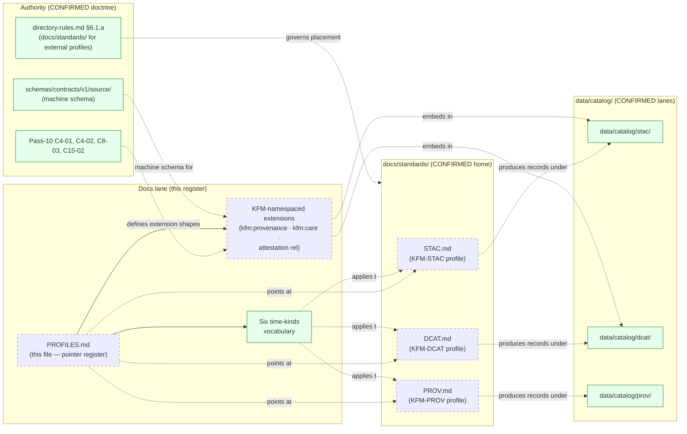

<!-- [KFM_META_BLOCK_V2]
doc_id: kfm://doc/docs-sources-catalog-profiles
title: Source catalog profiles register
type: register
version: v0.2
status: draft
owners: <PLACEHOLDER — Docs steward · Source steward · Catalog profile owner>
created: 2026-05-20
updated: 2026-05-23
policy_label: public
related:
  - docs/sources/catalog/README.md
  - docs/sources/catalog/CROSSWALKS.md
  - docs/sources/catalog/IDENTITY.md
  - docs/sources/catalog/GLOSSARY.md
  - docs/sources/catalog/OPEN-QUESTIONS.md
  - docs/standards/STAC.md
  - docs/standards/DCAT.md
  - docs/standards/PROV.md
  - docs/doctrine/directory-rules.md
  - schemas/contracts/v1/source/
tags: [kfm, docs, sources, catalog, register, profiles, stac, dcat, prov]
notes:
  - "v0.2 — doctrinal correction: type changed from `profile` to `register`. Per `directory-rules.md` §6.1.a, external-standards profile content lives in `docs/standards/`, not in `docs/sources/catalog/`. This file is reframed as a pointer register identifying the three external profiles the catalog lane relies on, plus the KFM-namespaced extensions (kfm:provenance, kfm:care, KFM attestation rel) that ARE this lane's legitimate scope."
  - "v0.2 corrects ADR-0014 reference (cited in v0.1 for temporal vocabulary) — not located in the doctrine corpus this session. The six time-kinds (source, observed, valid, retrieval, release, correction) ARE CONFIRMED doctrine; the ADR-0014 specific identifier is NEEDS VERIFICATION. Doctrine synthesis ADR backlog uses ADR-S-NN identifiers."
  - "v0.2 strengthens the kfm:provenance field set per Pass-10 C4-01 (spec_hash, evidence_bundle_ref, run_record_ref, audit_ref, policy_digest; per-asset file:checksum) and adds the KFM `attestation` link rel per KFM-P7-PROG-0001."
  - "PROPOSED scaffold; sibling-link presence verified in a prior Claude Code session, not in this session."
  - "Atlas anchors: KFM-P31-PROG-0004 (KFM-STAC profile contract files — STAC 1.1 version pinning, conformance, extension set, collection IDs, item identity, asset roles, MIME types); KFM-P14-IDEA-0002 (STAC/DCAT/PROV distribution contract as harvest surface); KFM-P14-PROG-0008 (STAC → DCAT JSON-LD emitter); KFM-P7-PROG-0001 (STAC attestation hook); KFM-P10-PROG-0003 (PROV-O → Neo4j lineage); Pass-10 C4-01..05, C8-03, C15-02."
[/KFM_META_BLOCK_V2] -->

# Source catalog profiles register

> Pointer register identifying the external metadata-standard profiles the source-catalog lane relies on (STAC, DCAT, PROV-O) — a register, not the profiles themselves.

**Status:** scaffold (PROPOSED) · **Type:** register *(docs lane; not authority)* · **Last reviewed:** 2026-05-23

---

## Quick jump

- [Purpose](#purpose)
- [Authority pointer](#authority-pointer)
- [Profiles register](#profiles-register)
- [KFM-namespaced extensions](#kfm-namespaced-extensions)
- [Temporal vocabulary (six time-kinds)](#temporal-vocabulary-six-time-kinds)
- [Where this register sits](#where-this-register-sits)
- [Maintenance rules](#maintenance-rules)
- [Open questions](#open-questions)
- [Related docs](#related-docs)

---

## Purpose

This register answers one question:

> **For each external metadata standard the source-catalog lane relies on, where is the authoritative KFM profile, and what KFM-namespaced extensions sit on top of that base profile?**

> [!IMPORTANT]
> The v0.1 of this file was declared `type: profile`. **That was a doctrine error.** Per `directory-rules.md` §6.1.a: *"`docs/standards/` is the canonical home for external standards profiles that KFM conforms to or crosswalks against — never for KFM's own object meaning (which lives in `contracts/`), shape (which lives in `schemas/`), or admissibility decisions (which live in `policy/`)."* The v0.2 corrects this: this file is a **pointer register** in the catalog lane; the authoritative profile *content* lives under `docs/standards/`. This change is the same doctrinal posture used by [`CROSSWALKS.md`](./CROSSWALKS.md) v0.2 and tracked by **OPEN-DSC-06**.

> [!NOTE]
> What this file legitimately covers: (a) pointers to the three external-standards profiles; (b) the **KFM-namespaced extensions** (`kfm:provenance`, `kfm:care`, KFM `attestation` link rel) that sit on top of those profiles and are catalog-lane concerns; (c) the **six time-kinds temporal vocabulary** that applies across all three profiles.

[Back to top](#quick-jump)

---

## Authority pointer

| Concern | Where authority lives | Status |
|---|---|---|
| External-standards profile content (STAC, DCAT, PROV-O) | [`docs/standards/<STANDARD>.md`](../../../standards/) | **CONFIRMED root** *(directory-rules.md §6.1.a)* |
| KFM-STAC profile contract files (machine-readable) | `docs/standards/STAC.md` + *(PROPOSED home)* `schemas/contracts/v1/catalog/` or under the STAC profile folder | **PROPOSED** — Pass-10 C4-01 / KFM-P31-PROG-0004 |
| `kfm:provenance` field set | Pass-10 C4-01 *(CONFIRMED — `spec_hash`, `evidence_bundle_ref`, `run_record_ref`, `audit_ref`, `policy_digest`; per-asset `file:checksum`)* | **CONFIRMED doctrine** |
| `kfm:care` extension fields | Pass-10 C15-01 / C15-02 *(CARE namespace surfacing CARE fields in catalog vocabularies)* | **CONFIRMED doctrine** |
| KFM `attestation` link rel | KFM-P7-PROG-0001 *(STAC attestation hook → EvidenceBundle)* | **CONFIRMED doctrine** *(rel registration NEEDS VERIFICATION)* |
| Six time-kinds temporal vocabulary | Atlas v1.1 per-domain dossiers §C/E *(CONFIRMED across every domain — Hydrology, Soil, Habitat, Fauna, Flora, Archaeology, People/DNA/Land, etc.)* | **CONFIRMED doctrine** |
| Source-descriptor schema home | [`schemas/contracts/v1/source/`](../../../../schemas/contracts/v1/source/) | **CONFIRMED — ADR-0001** *(per directory-rules.md §7.4)* |
| Placement question (this lane vs `docs/standards/`) | [`OPEN-DSC-06`](./OPEN-QUESTIONS.md) | **OPEN — cross-cutting** |

> [!CAUTION]
> The v0.1 cited `ADR-0014` as the authority for the temporal-vocabulary "six time-kinds". The specific identifier `ADR-0014` was **not located** in the doctrine corpus this session. Only `ADR-0001` is confirmed. The doctrine synthesis ADR backlog uses `ADR-S-NN` identifiers (`ADR-S-01..15`). The **six time-kinds vocabulary itself** is CONFIRMED across the Atlas; only the specific ADR identifier is NEEDS VERIFICATION. Reconcile against the active ADR ledger.

[Back to top](#quick-jump)

---

## Profiles register

The catalog lane relies on three external standards. For each, the **authoritative profile content** lives under `docs/standards/`. This table summarizes what each profile must cover and where the canonical doc is.

### 1 · KFM-STAC profile

| Field | Value (CONFIRMED unless noted) | Authority |
|---|---|---|
| Base standard | **STAC** | external — [stacspec.org](https://stacspec.org) |
| Version pin | **STAC 1.1** *(PROPOSED `1.1.x` per v0.1; NEEDS VERIFICATION against mounted KFM-STAC profile contract files)* | KFM-P31-PROG-0004 *(Pass-10 C4-01)* |
| Conformance classes | NEEDS VERIFICATION — enumerate in [`docs/standards/STAC.md`](../../../standards/STAC.md) | KFM-P31-FEAT-0004 *(STAC Conformance Inspector — must display conformance classes, extension use, item identity rules, MIME types, collection-contract completeness)* |
| Required extensions | `projection`, `processing`, `file` *(per Pass-10 C4-01 example shape)* | Pass-10 C4-01 |
| KFM extension | `kfm:provenance` block — see [KFM-namespaced extensions](#kfm-namespaced-extensions) | Pass-10 C4-01 |
| Collection-id convention | `kfm-<org>-<product>` | Pass-10 C4-02; [`IDENTITY.md`](./IDENTITY.md) |
| Item identity | Deterministic — `f(source identity, spec_hash)`; spec_hash = `jcs:sha256:<hex>` | Pass-10 C1-02; [`IDENTITY.md`](./IDENTITY.md) |
| Asset roles | Include `data` (canonical), `thumbnail`, `metadata`; KFM-specific roles for `pmtiles`, `cog`, `mvt`, `geoparquet` | ML-062-008 / ML-062-030 *(Master MapLibre v2.1)*; PROPOSED enumeration in `docs/standards/STAC.md` |
| MIME types | `application/json` (Item), `application/vnd.pmtiles` (PMTiles asset), `image/tiff; application=geotiff; profile=cloud-optimized` (COG), `application/vnd.mapbox-vector-tile` (MVT), `application/vnd.apache.parquet` (GeoParquet) — PROPOSED enumeration | PROPOSED in `docs/standards/STAC.md`; NEEDS VERIFICATION |
| Catalog lane | [`data/catalog/stac/`](../../../../data/catalog/stac/) | CONFIRMED root *(KFM Repository Structure Guiding Document)* |
| Authoritative profile doc | [`docs/standards/STAC.md`](../../../standards/STAC.md) *(PROPOSED — informally `STAC_KFM_PROFILE.md` per Pass-10 C4-01 expansion direction)* | `directory-rules.md` §6.1.a |

### 2 · KFM-DCAT profile

| Field | Value (CONFIRMED unless noted) | Authority |
|---|---|---|
| Base standard | **DCAT** | external — [W3C DCAT](https://www.w3.org/TR/vocab-dcat-3/) |
| Version pin | DCAT 3 *(PROPOSED; NEEDS VERIFICATION against mounted profile)* | Pass-10 C4-05 |
| Distribution model | Dataset → Distribution(s), each Distribution carrying checksums, `byteSize`, `mediaType`, table-schema conformity, versions, PROV links | KFM-P14-IDEA-0002 *(STAC/DCAT/PROV distribution contract as harvest surface)*; KFM-P14-PROG-0008 *(STAC → DCAT JSON-LD emitter)* |
| KFM extension | `kfm:care` block attaches at **Dataset** level; `kfm:provenance` may attach at **Distribution** level — NEEDS VERIFICATION | Pass-10 C15-02 |
| Required fields | DOI, harvest date, dataset version, license, `rightsHolder`, `datasetID`, EvidenceBundle references | KFM-P26-PROG-0025 *(catalog closure writers)* |
| Catalog lane | [`data/catalog/dcat/`](../../../../data/catalog/dcat/) | CONFIRMED root |
| Authoritative profile doc | [`docs/standards/DCAT.md`](../../../standards/DCAT.md) *(PROPOSED)* | `directory-rules.md` §6.1.a |

### 3 · KFM-PROV profile

| Field | Value (CONFIRMED unless noted) | Authority |
|---|---|---|
| Base standard | **W3C PROV-O** + PAV *(Provenance, Authoring, Versioning)* | external — [W3C PROV-O](https://www.w3.org/TR/prov-o/); PAV |
| Version pin | PROV-O 1.0 *(PROPOSED; NEEDS VERIFICATION against mounted profile)* | Pass-10 C8-03 |
| Core mapping | `RunReceipt` → PROV-O `Activity`; `EvidenceBundle` → PROV-O `Entity`; tooling/operator → PROV-O `Agent`; relationships: `USED`, `GENERATED`, `WAS_ASSOCIATED_WITH`, `WAS_ATTRIBUTED_TO` | KFM-P10-PROG-0003 *(PROV-O → Neo4j lineage mapping)*; Pass-10 C8-03 |
| Serialization | JSON-LD; canonicalization via JCS *(default)* or URDNA2015 *(reserved for RDF semantic equivalence)* | Pass-10 C8-05 |
| KFM extension | `kfm:provenance` fields embedded in STAC properties resolve to PROV-O via the round-trip `prov:wasGeneratedBy` edge | Pass-10 C8-03; C4-01 |
| Temporal vocabulary | **Six time-kinds** — see [Temporal vocabulary (six time-kinds)](#temporal-vocabulary-six-time-kinds) | Atlas v1.1 per-domain dossiers *(CONFIRMED across every domain)* |
| Catalog lane | [`data/catalog/prov/`](../../../../data/catalog/prov/) | CONFIRMED root |
| Authoritative profile doc | [`docs/standards/PROV.md`](../../../standards/PROV.md) *(see OPEN-DR-01 re. `PROV.md` vs `PROVENANCE.md`; ADR-S-06 in doctrine synthesis backlog)* | `directory-rules.md` §6.1.a |

> [!NOTE]
> The three profile docs in `docs/standards/` are **PROPOSED authored** per Andy's prior-session work. Their existence is NEEDS VERIFICATION this session. If `docs/standards/STAC.md` / `DCAT.md` / `PROV.md` do not exist as expected, the open authoring tasks remain.

[Back to top](#quick-jump)

---

## KFM-namespaced extensions

The KFM-specific extension blocks that sit on top of the three base profiles are catalog-lane concerns and ARE covered authoritatively here (since they are not "external standards" content per §6.1.a — they are KFM-specific).

### `kfm:provenance` block *(STAC properties; embedded in STAC Item)*

**Required fields** (CONFIRMED — Pass-10 C4-01):

| Field | Type | Meaning |
|---|---|---|
| `spec_hash` | `jcs:sha256:<hex>` | Content identity of the Item via RFC 8785 JCS + SHA-256 |
| `evidence_bundle_ref` | URI | Resolves to a content-addressed `EvidenceBundle` (typically `kfm://evidence/<digest>`) |
| `run_record_ref` | URI | Resolves to a `RunReceipt` for the pipeline run that produced this Item |
| `audit_ref` | URI | Resolves to SLSA/OPA attestations (DSSE bundle) |
| `policy_digest` | `sha256:<hex>` | Records the OPA policy bundle used at promotion |

**Per-asset integrity:** `file:checksum` from the STAC `file` extension (CONFIRMED — Pass-10 C4-01).

### `kfm:care` block *(STAC properties + DCAT Dataset)*

**Required fields** when `authority_to_control` is non-empty (CONFIRMED — Pass-10 C15-01 + C15-02):

| Field | Meaning |
|---|---|
| `steward_org` | Indigenous nation, community, or named cultural steward |
| `authority_to_control` | Asserted authority; non-empty triggers **default-deny on publication** (C15-03) |
| `consent` | Reference to the `ConsentSidecar` *(implementation NEEDS VERIFICATION)* |
| `obligations` | Steward-imposed obligations |
| `benefit_commitments` | Benefit-sharing commitments |

See [`CARE-COMPLIANCE.md`](./CARE-COMPLIANCE.md) for full surfacing rules and the default-deny posture.

### KFM `attestation` link rel *(STAC `links` array)*

A STAC link with `rel: "attestation"` (under a KFM-namespaced rel until upstream registration) pointing at the `EvidenceBundle` whose `spec_hash` certifies the Item (CONFIRMED — KFM-P7-PROG-0001).

> [!NOTE]
> `attestation` is **not yet a standard STAC link relation**. KFM uses either a registered rel via the STAC extension process *(future work)* or a custom rel under the `kfm:` namespace *(current PROPOSED posture)*. Affected by **OPEN-DSC-03** *(namespace pin)*.

### Namespace pin (`kfm:` vs `ks-kfm:`)

All three extension blocks above use the `kfm:` provisional prefix; the pin is **UNRESOLVED** per **OPEN-DSC-03** *(Pass-10 C4-01 Open Question)*. Adoption of the final pin requires a sweep of every product page, Collection summary, JSON-LD context, and STAC linter rule.

[Back to top](#quick-jump)

---

## Temporal vocabulary (six time-kinds)

**CONFIRMED doctrine** — applies across all three profiles. Every per-domain dossier in Atlas v1.1 includes the line: *"CONFIRMED source, observed, valid, retrieval, release, and correction times stay distinct where material."*

| # | Time-kind | What it pins | Example |
|---|---|---|---|
| 1 | **`source` time** | When the source publisher recorded the data | Storm event report filed at NOAA NCEI |
| 2 | **`observed` time** | When the underlying real-world event occurred / was sensed | Storm formed on the ground |
| 3 | **`valid` time** | The interval during which the asserted fact holds | A regulatory zone effective 2020-01-01 to 2025-12-31 |
| 4 | **`retrieval` time** | When KFM fetched the source artifact | `fetch_time` in the run receipt |
| 5 | **`release` time** | When KFM published the derived artifact | `release_time` in the ReleaseManifest |
| 6 | **`correction` time** | When a correction notice was issued | `CorrectionNotice.time` |

> [!IMPORTANT]
> These six are **not collapsible**. Treating any pair as the same is a doctrinal violation *(Atlas §24.1.2 anti-collapse failure modes)*. KFM-PROV serializes the relevant subset as PROV-O `time:` properties on the corresponding entities and activities; KFM-STAC carries them in `properties` as `datetime`, `start_datetime`, `end_datetime`, plus `kfm:provenance.run_record_ref.fetch_time` and the `release_time` in the linked ReleaseManifest.

The v0.1's "six time-kinds tracked per ADR-0014" is **partially correct**: the six time-kinds ARE confirmed doctrine; the specific `ADR-0014` identifier is **NEEDS VERIFICATION** — see [Authority pointer](#authority-pointer) CAUTION callout.

[Back to top](#quick-jump)

---

## Where this register sits

> [!NOTE]
> Solid green = CONFIRMED doctrine. Dashed = PROPOSED (the standards profiles are PROPOSED-authored; this register and the extension catalogs are PROPOSED scaffolds). The diagram shows that this register **points at** the authoritative profiles in `docs/standards/` and **owns** the KFM-namespaced extension content + temporal vocabulary.

[Back to top](#quick-jump)

---

## Maintenance rules

> [!IMPORTANT]
> Docs are part of the working system. This register MUST update when version pins advance, when KFM-namespaced extensions change, or when the placement question (OPEN-DSC-06) is resolved.

| Trigger | Action |
|---|---|
| **External standard version advances** (STAC 1.1 → 1.2, DCAT 3 → 4, PROV-O update) | Bump the version-pin row; cross-reference to the updated `docs/standards/<STANDARD>.md`; raise as a `DRIFT-PROF-NN` entry if the change is breaking. |
| **`kfm:provenance` field added/removed** | Update the [KFM-namespaced extensions](#kfm-namespaced-extensions) table; bump version; reference the resolving ADR; coordinate sweep with all product pages. |
| **`kfm:care` extension surface changes** | Coordinate update with [`CARE-COMPLIANCE.md`](./CARE-COMPLIANCE.md). |
| **OPEN-DSC-03 (namespace pin) resolved** | Sweep all `kfm:` references; bump version; reference the resolving ADR. |
| **OPEN-DSC-06 (catalog-lane vs `docs/standards/` placement) resolved** | If `docs/standards/` is confirmed canonical, ensure all profile content has migrated; this file remains as the pointer register. If a different posture is chosen, bump version and document. |
| **`docs/standards/STAC.md` / `DCAT.md` / `PROV.md` authoring lands** | Update the Status column for each row in [Profiles register](#profiles-register) from PROPOSED to CONFIRMED. |
| **`ADR-0014` (or successor) for temporal vocabulary lands** | Replace the NEEDS VERIFICATION annotation under [Temporal vocabulary](#temporal-vocabulary-six-time-kinds) with the resolving ADR identifier. |
| **STAC `attestation` rel registered upstream** | Update [KFM `attestation` link rel](#kfm-attestation-link-rel-stac-links-array) note; remove "until upstream registration" qualifier. |

**Versioning.** KFM Meta Block v2 semver-lite: `v0.x` while OPEN-DSC-03 and OPEN-DSC-06 are open; `v1.x` once both close and the three `docs/standards/` profile docs are authored at `status: published`.

[Back to top](#quick-jump)

---

## Open questions

This register references existing `OPEN-DSC-*` entries in [`OPEN-QUESTIONS.md`](./OPEN-QUESTIONS.md). The numbering canonical authority lives there *(per the numbering rule established in OPEN-QUESTIONS.md v0.2)*. The questions below either reference existing entries or are PROPOSED ALLOCATIONS that need canonical confirmation in `OPEN-QUESTIONS.md` v0.3.

| ID | Question | Status |
|---|---|---|
| **OPEN-DSC-03** | Namespace pin — `kfm:` (KFM-global) vs `ks-kfm:` (Kansas-scoped). Affects every extension block listed in [KFM-namespaced extensions](#kfm-namespaced-extensions). | **OPEN — corpus-wide** |
| **OPEN-DSC-05** | STAC vs DCAT disposition for spatiotemporal datasets that could go either way. | **NEEDS VERIFICATION** |
| **OPEN-DSC-06** | Canonical placement for this kind of pointer content — `docs/sources/catalog/` (current) vs `docs/standards/<STANDARD>/`. Candidate resolution: this pointer register stays here, profile content stays in `docs/standards/`. | **OPEN — pending ADR** |
| **OPEN-DSC-12-NV** | `ADR-0014` for temporal vocabulary — not located in corpus this session; reconcile against active ADR ledger. *(Same flavor as OPEN-DSC-12-NV for ADR-0010, which OPEN-QUESTIONS.md v0.2 flagged.)* | **NEEDS VERIFICATION** |
| **OPEN-DSC-29** *(PROPOSED ALLOCATION — needs OPEN-QUESTIONS.md v0.3 canonical assignment)* | STAC version-pin lifecycle — when STAC 1.1 → 1.2 lands, what is the migration discipline? Coordinated bump across all product pages, or per-Collection? | **PROPOSED** |
| **OPEN-DSC-30** *(PROPOSED ALLOCATION)* | Asset-role and MIME-type enumeration — should the canonical list live in `docs/standards/STAC.md` only, or also be mirrored as a machine artifact under `schemas/contracts/v1/catalog/`? | **PROPOSED** |
| **OPEN-DSC-31** *(PROPOSED ALLOCATION)* | KFM `attestation` rel — pursue STAC extension-registry submission, or keep KFM-local indefinitely? *(Pass-10 C4 also flags `kfm:care` as a candidate for upstream submission — Pass-10 §C.3 "Low Priority" item: "Pilot the kfm:care namespace as a STAC extension submission".)* | **PROPOSED** |
| **OPEN-DSC-32** *(PROPOSED ALLOCATION)* | PROV-O ↔ CIDOC E13 demarcation — the corpus explicitly flags this boundary as unsettled *(Pass-10 C8-03)*. Resolve before STAC × PROV-O and STAC × CIDOC-CRM crosswalks both promote *(intersects [`CROSSWALKS.md`](./CROSSWALKS.md) OPEN-DSC-09)*. | **PROPOSED** |

> [!NOTE]
> OPEN-DSC-29..32 are **PROPOSED ALLOCATIONS**, not yet entered into the canonical register. They MUST be confirmed in `OPEN-QUESTIONS.md` v0.3 before being referenced from other docs. Per the numbering reconciliation already in flight (OPEN-QUESTIONS.md v0.2 reserves 16..28 for collision reconciliation), OPEN-DSC-29 is the next free identifier — but coordinate with the canonical register before allocating.

[Back to top](#quick-jump)

---

## Related docs

- [`docs/sources/catalog/README.md`](./README.md) — lane root *(PROPOSED)*
- [`docs/sources/catalog/CROSSWALKS.md`](./CROSSWALKS.md) — cross-format mappings register *(same OPEN-DSC-06 placement posture)*
- [`docs/sources/catalog/IDENTITY.md`](./IDENTITY.md) — Collection-id / item-id / namespace / `promoteId` conventions
- [`docs/sources/catalog/GLOSSARY.md`](./GLOSSARY.md) — term definitions including `EvidenceBundle`, `RunReceipt`, `spec_hash`, `kfm:provenance`, `kfm:care`
- [`docs/sources/catalog/CARE-COMPLIANCE.md`](./CARE-COMPLIANCE.md) — full CARE field surfacing rules
- [`docs/sources/catalog/OPEN-QUESTIONS.md`](./OPEN-QUESTIONS.md) — canonical numbering authority for `OPEN-DSC-*`
- [`docs/standards/STAC.md`](../../../standards/STAC.md) — **authoritative KFM-STAC profile** *(PROPOSED authored)*
- [`docs/standards/DCAT.md`](../../../standards/DCAT.md) — **authoritative KFM-DCAT profile** *(PROPOSED authored)*
- [`docs/standards/PROV.md`](../../../standards/PROV.md) — **authoritative KFM-PROV profile** *(see OPEN-DR-01 re. PROV.md vs PROVENANCE.md; ADR-S-06 in doctrine synthesis backlog)*
- [`docs/standards/ISO-19115.md`](../../../standards/ISO-19115.md) — ISO 19115 profile *(adjacent — crosswalk target)*
- [`docs/standards/OGC-API-TILES.md`](../../../standards/OGC-API-TILES.md) — OGC API Tiles profile *(adjacent)*
- [`docs/standards/PMTILES.md`](../../../standards/PMTILES.md) — PMTiles governance profile *(adjacent — asset-role consumer)*
- [`schemas/contracts/v1/source/`](../../../../schemas/contracts/v1/source/) — machine shapes *(per ADR-0001)*
- [`docs/doctrine/directory-rules.md`](../../doctrine/directory-rules.md) — placement authority *(§6.1.a `docs/standards/` placement; §6.4 schema home; §8.3 compatibility roots)*
- [`docs/registers/DRIFT_REGISTER.md`](../../registers/DRIFT_REGISTER.md) — drift entries
- [`docs/adr/`](../../adr/) — ADRs *(active ledger needed to resolve ADR-0014 / ADR-S-06 references)*

---

*Doc status: **draft · register (v0.2)** · Last reviewed: **2026-05-23** · Provenance: revised against `directory-rules.md` §6.1.a; Pass-10 C4-01 / C4-02 / C4-05 / C8-03 / C8-05 / C15-01 / C15-02; KFM-P31-PROG-0004 (KFM-STAC profile contract files); KFM-P7-PROG-0001 (STAC attestation hook); KFM-P10-PROG-0003 (PROV-O lineage); Atlas v1.1 per-domain dossiers for the six time-kinds vocabulary; no mounted-repo evidence in this session.*

[↑ Back to top](#source-catalog-profiles-register)
