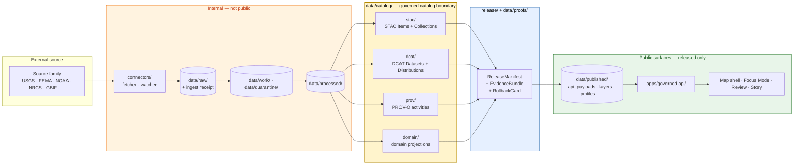

<!-- [KFM_META_BLOCK_V2]
doc_id: kfm://doc/docs-sources-catalog-readme
title: docs/sources/catalog/ — Source-to-Catalog Documentation Lane
type: readme
version: v0.4
status: draft
owners: <PLACEHOLDER — Docs steward + Source steward (CODEOWNERS NEEDS VERIFICATION)>
created: 2026-05-20
updated: 2026-06-11
supersedes: v0.3 (2026-05-23)
policy_label: public
related:
  - docs/sources/README.md
  - docs/sources/source-roles.md
  - docs/sources/catalog/INDEX.md
  - docs/sources/catalog/OPEN-QUESTIONS.md
  - docs/sources/catalog/IDENTITY.md
  - docs/sources/catalog/NAMING.md
  - docs/sources/catalog/PROFILES.md
  - docs/sources/catalog/CROSSWALKS.md
  - docs/sources/catalog/CARE-COMPLIANCE.md
  - docs/sources/catalog/RIGHTS-AND-SENSITIVITY-MAP.md
  - docs/sources/catalog/GLOSSARY.md
  - docs/sources/catalog/COVERAGE-MATRIX.md
  - docs/standards/README.md
  - docs/standards/STAC.md
  - docs/standards/DCAT.md
  - docs/standards/PROV.md
  - docs/doctrine/directory-rules.md
  - docs/doctrine/trust-membrane.md
  - docs/doctrine/lifecycle-law.md
  - data/catalog/README.md
  - data/registry/sources/README.md
  - connectors/README.md
  - control_plane/source_authority_register.yaml
tags: [kfm, docs, sources, catalog, stac, dcat, prov, trust-membrane, source-roles]
notes:
  - "v0.4 polish pass: tightened purpose, authority split, source-role linkage, trust-membrane warnings, validation table, and OPEN-DSC numbering language without changing the v0.3 governance decisions."
  - "PROPOSED path: docs/sources/catalog/ remains a docs-side companion lane beneath docs/sources/; confirm by per-root README note or ADR."
  - "Canonical numbering authority for OPEN-DSC-* remains OPEN-QUESTIONS.md. Sibling docs MUST allocate new IDs there first."
  - "No mounted repository was inspected in this polishing pass; repo implementation maturity remains UNKNOWN unless explicitly sourced elsewhere."
[/KFM_META_BLOCK_V2] -->

# `docs/sources/catalog/`

> Human-facing documentation for **how KFM source families become catalog entries** — the explanatory lane between `connectors/`, `data/registry/sources/`, and `data/catalog/{stac,dcat,prov,domain}/`.

[](#5-status)
[](#22-changelog)
[](#4-authority-level)
[](../../doctrine/truth-posture.md)
[](../../doctrine/lifecycle-law.md)
[](../../doctrine/trust-membrane.md)
[](./OPEN-QUESTIONS.md)
[](#last-reviewed)
<!-- TODO: replace CI badge with a working Shields.io endpoint once docs lint is wired. -->
[](#15-validation)

**Status:** draft · **Edition:** v0.4 · **Owners:** `<PLACEHOLDER — Docs steward + Source steward>` · **Last reviewed:** 2026-06-11

---

## Contents <a id="contents"></a>

- [1. Scope and path](#1-scope-and-path)
- [2. Repo fit](#2-repo-fit)
- [3. Purpose](#3-purpose)
- [4. Authority level](#4-authority-level)
- [5. Status](#5-status)
- [6. What belongs here](#6-what-belongs-here)
- [7. What does not belong here](#7-what-does-not-belong-here)
- [8. Directory tree](#8-directory-tree)
- [9. Flow — source → catalog → published](#9-flow--source--catalog--published)
- [10. Source families indexed here](#10-source-families-indexed-here)
- [11. Catalog profiles and identity conventions](#11-catalog-profiles-and-identity-conventions)
- [12. Trust membrane discipline](#12-trust-membrane-discipline)
- [13. Inputs](#13-inputs)
- [14. Outputs](#14-outputs)
- [15. Validation](#15-validation)
- [16. Review burden](#16-review-burden)
- [17. Authoring guide for a per-family page](#17-authoring-guide-for-a-per-family-page)
- [18. Authoring status](#18-authoring-status)
- [19. Related folders and docs](#19-related-folders-and-docs)
- [20. ADRs](#20-adrs)
- [21. Open questions and numbering discipline](#21-open-questions-and-numbering-discipline)
- [22. Changelog](#22-changelog)
- [23. FAQ](#23-faq)
- [24. Appendix — minimal STAC `kfm:provenance` shape](#24-appendix--minimal-stac-kfmprovenance-shape)
- [Last reviewed](#last-reviewed)

---

## 1. Scope and path

This folder is the **human-readable, source-oriented view of catalog closure**. For each source family KFM ingests — USGS, FEMA, NOAA, NRCS, Kansas, GBIF, iNaturalist, Census, `local_upload`, and others — this lane explains:

- which catalog profiles the family lands in: STAC, DCAT, PROV-O, or a domain projection in `data/catalog/domain/`;
- which identity, namespace, and provenance conventions apply to that family's entries;
- which source roles, rights, sensitivity, and CARE considerations gate publication;
- where to find the machine-readable contracts, schemas, validators, source registry records, and policy gates that this documentation only narrates.

> [!IMPORTANT]
> **PROPOSED path.** `docs/sources/` is listed in Directory Rules as the home for source-descriptor standards and source families. A `catalog/` subfolder under it is not explicitly enumerated. This README treats `docs/sources/catalog/` as the docs-side companion to `data/catalog/{stac,dcat,prov,domain}/`. Confirm this by a per-root note in `docs/sources/README.md`, by the path-validation checklist, or by ADR. See [`OPEN-DSC-01`](./OPEN-QUESTIONS.md).

### 1.1 Working interpretation

| Interpretation | What this folder holds | Status |
|---|---|---|
| **A. Source-perspective catalog companion** *(adopted)* | Per-family pages explaining how each source family lands in `data/catalog/{stac,dcat,prov,domain}/`, with identity, provenance, source-role, rights, and sensitivity notes. | PROPOSED |
| **B. Catalog-of-source-families index** | A flat index of all source families KFM consumes, cross-linked to connectors and registries. | PROPOSED — alternative |

Interpretation A fills the gap between `docs/sources/README.md` (source-lane orientation), `connectors/README.md` (fetch/admission), and `data/catalog/README.md` (artifact-side layout). Interpretation B can still be satisfied through [`INDEX.md`](./INDEX.md).

[↑ Back to top](#contents)

---

## 2. Repo fit

```text
repo root
└── docs/
    ├── README.md
    ├── doctrine/
    │   ├── directory-rules.md           # placement authority
    │   ├── trust-membrane.md            # public-path discipline
    │   └── lifecycle-law.md             # RAW → … → PUBLISHED
    ├── standards/                       # STAC, DCAT, PROV, PMTILES, OGC API Tiles, …
    │   ├── README.md
    │   └── …
    └── sources/                         # source-descriptor standards and source families
        ├── README.md                    # orientation for the sources lane
        ├── source-roles.md              # source-role vocabulary and anti-collapse rules
        └── catalog/                     # THIS FOLDER (PROPOSED)
            ├── README.md                # this file
            └── <source-family>/         # per-family catalog notes (PROPOSED)
```

**Upstream docs:** `docs/sources/README.md`, `docs/sources/source-roles.md`, `docs/standards/`, and `docs/doctrine/`.

**Downstream artifacts:** `data/catalog/{stac,dcat,prov,domain}/`, `data/registry/sources/`, `release/`, `data/published/`, and governed API/UI surfaces.

[↑ Back to top](#contents)

---

## 3. Purpose

A reader who lands here should be able to:

1. Find the per-family page for a source family such as USGS, GBIF, NRCS, or Kansas.
2. Learn which catalog profile or profiles that family uses.
3. See the identity and namespace conventions for catalog entries, including `kfm:provenance`, `kfm:trust_class`, `kfm:source_role`, collection IDs, asset roles, and `file:checksum` placement.
4. Understand the source-role boundary for the family without collapsing observations, regulatory context, administrative records, legal authority, models, aggregations, or generated material into one authority type.
5. Find the rights, sensitivity, CARE, and policy references that govern publication.
6. Click through to contracts, schemas, validators, ADRs, and source registry entries that enforce what this documentation describes.

This README is **documentation, not authority**. It does not decide whether a source is admissible, what a source's rights state is, or which profile is canonical for a given artifact type. Those decisions live in `contracts/`, `schemas/`, `policy/`, `release/`, `data/registry/sources/`, and accepted ADRs.

[↑ Back to top](#contents)

---

## 4. Authority level

**Authority level:** `docs-companion` — explanatory only.

`docs/sources/catalog/` does not own placement, contracts, schemas, source identity, release decisions, or policy. It narrates and indexes what those layers decide.

| Concern | Canonical owner |
|---|---|
| Source identity, rights, sensitivity | `data/registry/sources/`, `policy/sensitivity/` |
| Source-role vocabulary | `docs/sources/source-roles.md` plus machine fields in source descriptors |
| Object-family meaning | `contracts/` |
| Field-level shape | `schemas/contracts/v1/...` by default per ADR-0001 |
| Allow / deny / restrict / abstain decisions | `policy/` and `release/` |
| Catalog artifact layout | `data/catalog/` |
| External standard profiles | `docs/standards/` |
| Public-path discipline | `docs/doctrine/trust-membrane.md`, `apps/governed-api/` |
| Canonical `OPEN-DSC-*` numbering for this lane | [`OPEN-QUESTIONS.md`](./OPEN-QUESTIONS.md) |
| This folder | Source-family explanation and cross-linking |

[↑ Back to top](#contents)

---

## 5. Status

**Status:** PROPOSED / draft.

| Aspect | Label | Basis |
|---|---|---|
| `docs/sources/catalog/` path | PROPOSED | Subfolder not explicitly enumerated; see `OPEN-DSC-01`. |
| Per-family page convention | PROPOSED | Pattern in [§17](#17-authoring-guide-for-a-per-family-page) is illustrative until adopted. |
| Source-family inventory | CONFIRMED in doctrine corpus / repo presence NEEDS VERIFICATION | Source families and connectors require mounted-repo verification. |
| `data/catalog/{stac,dcat,prov,domain}/` catalog lanes | CONFIRMED in doctrine corpus / implementation NEEDS VERIFICATION | Catalog artifacts remain separate from this docs lane. |
| `kfm:provenance`, `kfm:trust_class`, `kfm:source_role`, `kfm:run_receipt_ref`, `kfm:proof_ref` | CONFIRMED in doctrine corpus / implementation NEEDS VERIFICATION | See [§11](#11-catalog-profiles-and-identity-conventions). |
| Cross-cutting sibling docs in this lane | draft | `INDEX.md`, `GLOSSARY.md`, `CROSSWALKS.md`, `IDENTITY.md`, `NAMING.md`, `OPEN-QUESTIONS.md`, `PROFILES.md`, `RIGHTS-AND-SENSITIVITY-MAP.md`, `CARE-COMPLIANCE.md`, `COVERAGE-MATRIX.md`. |
| Mounted-repo implementation maturity | UNKNOWN | No mounted repo was inspected in this polishing pass. |

> [!CAUTION]
> ADR identifiers beyond ADR-0001 are **NEEDS VERIFICATION** unless confirmed in a mounted repo or accepted ADR index. References to ADR-0003, ADR-0010, and ADR-0014 remain useful lineage, but their live repository presence and exact status must be checked before treating them as current authority.

[↑ Back to top](#contents)

---

## 6. What belongs here

- Per-source-family catalog documentation: one Markdown page per family, or a folder when the family has multiple catalog products.
- Source-role notes that link to `docs/sources/source-roles.md` and identify how the family can and cannot support claims.
- Profile crosswalk summaries between native source vocabularies and KFM catalog envelopes, with authoritative profile content kept in `docs/standards/`.
- Identity-convention notes: collection IDs, item IDs, asset roles, `kfm:provenance`, `kfm:trust_class`, `kfm:source_role`, and checksum placement.
- Rights and sensitivity narrative that links to the actual policy gates instead of restating them.
- CARE field surfacing notes that link to [`CARE-COMPLIANCE.md`](./CARE-COMPLIANCE.md).
- Catalog-closure checklists that link to validators without duplicating validator logic.
- Cross-links to `connectors/<family>/`, `data/registry/sources/<family>/`, `pipeline_specs/<domain>/`, `docs/standards/`, and related ADRs.

[↑ Back to top](#contents)

---

## 7. What does not belong here

> [!WARNING]
> This folder must not become a parallel authority. If a fact is machine-enforceable, release-significant, or policy-significant, it belongs in the owning root and is only linked from here.

| Anti-pattern | Correct home |
|---|---|
| SourceDescriptor records | `data/registry/sources/<domain>/` |
| Field-level schema | `schemas/contracts/v1/source/` |
| Object-family contracts | `contracts/` |
| Rights and sensitivity rules | `policy/sensitivity/`, `policy/sources/` |
| Connector code, fetchers, watchers | `connectors/<family>/`, `pipelines/watchers/` |
| Catalog artifacts: STAC items, DCAT distributions, PROV graphs | `data/catalog/{stac,dcat,prov,domain}/` |
| External-spec definitions | `docs/standards/` |
| Operational runbooks | `docs/runbooks/<domain>/` |
| Release decisions and manifests | `release/` |
| Validator logic | `tools/validators/` |
| Cited per-place truth claims | EvidenceBundle-backed catalog/release artifacts, not narrative docs |
| New `OPEN-DSC-NN` allocation | [`OPEN-QUESTIONS.md`](./OPEN-QUESTIONS.md) first, then sibling references |

A page here that begins to dictate behavior is drift. Open a `docs/registers/DRIFT_REGISTER.md` entry and propose either deletion, migration, or ADR-backed promotion.

[↑ Back to top](#contents)

---

## 8. Directory tree

> [!NOTE]
> The tree below reflects the proposed / reported lane shape from the supplied draft. Live repository presence remains **NEEDS VERIFICATION** in this polishing pass.

```text
docs/sources/catalog/
├── README.md
├── INDEX.md
├── GLOSSARY.md
├── CROSSWALKS.md
├── PROFILES.md
├── IDENTITY.md
├── NAMING.md
├── RIGHTS-AND-SENSITIVITY-MAP.md
├── CARE-COMPLIANCE.md
├── COVERAGE-MATRIX.md
├── OPEN-QUESTIONS.md
├── CHANGELOG.md
├── _template/
├── _examples/
│
├── usgs/
├── fema/
├── noaa/
├── nrcs/
├── kansas/
├── gbif/
├── inaturalist/
├── census/
├── local_upload/
│
├── ahgp/
├── blm/
├── ebird/
├── eddmaps/
├── epa/
├── familysearch/
├── ftdna/
├── idigbio/
├── loc/
├── manual_curation/
├── natureserve/
├── newspapers/
├── openstreetmap/
├── usfws_ecos/
│
└── nasa/  usda/  usdot/  openaq/  hifld/  isric/  drought_monitor/  landfire/
```

Nine families mirror the core connector inventory in the doctrine corpus. The additional families require ADR or register ratification before they are treated as first-class source families with complete `connectors/`, `data/registry/sources/`, and catalog companions. Track those decisions in [`OPEN-QUESTIONS.md`](./OPEN-QUESTIONS.md), especially `OPEN-DSC-09` through `OPEN-DSC-14`.

[↑ Back to top](#contents)

---

## 9. Flow — source → catalog → published

This docs lane explains the catalog closure path; it does not execute it. Promotion is a governed state transition, not a file move. Connectors fetch/admit; they do not publish.



`docs/sources/catalog/` is the documentation lens onto the yellow catalog boundary. The orange band is internal-only. The green band is public. The transition into the green band requires release-state, policy, provenance, and rollback support.

[↑ Back to top](#contents)

---

## 10. Source families indexed here

The table below is an orientation map. Treat the catalog profile column as **PROPOSED** until confirmed by each family page and the machine registry.

| Source family | Typical domains | Likely catalog profiles | Notes |
|---|---|---|---|
| `usgs/` | hydrology, geology, hazards | STAC · DCAT · PROV · domain | NWIS, NHDPlus, earthquakes, geology context. |
| `fema/` | hazards | DCAT · PROV · domain | OpenFEMA, NFHL/MSC; rights and current terms NEEDS VERIFICATION. |
| `noaa/` | atmosphere, hazards | STAC · DCAT · PROV | Storm Events, NWS alerts, HMS Fire and Smoke. |
| `nrcs/` | soil, agriculture | DCAT · PROV · domain | SSURGO, gSSURGO, gNATSGO, SCAN. |
| `kansas/` | many state-scoped lanes | STAC · DCAT · PROV · domain | Kansas Mesonet, KGS, KHRI, KSHS, KU NHM, FHSU Sternberg. |
| `gbif/` | fauna, flora | STAC × Darwin Core hybrid · DCAT · PROV | Aggregated species occurrence data; sensitivity and source-role gates required. |
| `inaturalist/` | fauna, flora | STAC × Darwin Core hybrid · DCAT · PROV | Citizen-science observations; observer, license, and geoprivacy constraints required. |
| `census/` | settlements, people-DNA-land | DCAT · PROV · domain | Aggregate-cell discipline; no reverse path from aggregates to single-person claims. |
| `local_upload/` | any | DCAT · PROV · domain | Curated uploads admitted through trust membrane; rights review mandatory. |

### 10.1 Additional families beyond the core list

The lane also tracks additional candidate or connector-derived family folders. Promotion to full source-family status requires source registry entries, policy review, connector or admission path, catalog closure rules, and ADR/register ratification.

| Folder(s) | Source group | Deferral tracked in |
|---|---|---|
| `blm/`, `epa/` | Federal agencies | `OPEN-DSC-09` |
| `loc/`, `familysearch/`, `ahgp/`, `newspapers/` | Archival and genealogy sources | `OPEN-DSC-10` |
| `ebird/`, `eddmaps/` | Citizen-science and monitoring networks | `OPEN-DSC-11` |
| `idigbio/`, `natureserve/`, `usfws_ecos/`, `ftdna/` | Biodiversity collections, conservation status, genomic-adjacent sources | `OPEN-DSC-12` |
| `openstreetmap/`, `manual_curation/` | Community and manual curation | `OPEN-DSC-13` |
| `nasa/`, `usda/`, `usdot/`, `openaq/`, `hifld/`, `isric/`, `drought_monitor/`, `landfire/` | Connector-derived second wave | `OPEN-DSC-14` |

[↑ Back to top](#contents)

---

## 11. Catalog profiles and identity conventions

These conventions are doctrine-grounded but implementation remains **NEEDS VERIFICATION** until checked against the mounted repo. The enforceable definitions belong in `contracts/`, `schemas/`, `policy/`, validators, and accepted ADRs.

> [!NOTE]
> [`PROFILES.md`](./PROFILES.md) is a pointer register. External standard profile content belongs in `docs/standards/`, not inside this lane.

| Profile lane | Primary use | Identity / namespace pattern | Key KFM fields |
|---|---|---|---|
| `data/catalog/stac/` | Spatiotemporal assets: rasters, vectors, scenes, tile artifacts | STAC 1.1 Item / Collection; collection ID pattern `kfm-<org>-<product>` *(PROPOSED)* | `properties.kfm:provenance`, `kfm:run_receipt_ref`, `kfm:proof_ref`, `kfm:trust_class`, `kfm:source_role`, asset `file:checksum`. |
| `data/catalog/dcat/` | Non-spatial datasets, distributions, evidence-bundle distributions | DCAT Dataset + Distribution; `conformsTo` points to KFM profile | `dcat:Distribution`, `kfm:id`, `kfm:spec_hash`, `kfm:trust_class`, `kfm:source_role`. |
| `data/catalog/prov/` | Provenance graphs | PROV-O entities, activities, agents | `wasDerivedFrom`, `wasGeneratedBy`, `wasAssociatedWith`, `kfm:run_receipt_ref`. |
| `data/catalog/domain/` | Domain-specific projections | `<domain>/` segment under catalog | Domain object families per domain contracts. |

### 11.1 KFM catalog extension fields

| Field | Purpose | Expected examples |
|---|---|---|
| `kfm:run_receipt_ref` | Links to the `RunReceipt` that produced the artifact. | `kfm://receipt/<receipt-id>` |
| `kfm:proof_ref` | Links to a DSSE proof or proof-envelope reference when one exists. | `kfm://proof/<proof-id>` |
| `kfm:trust_class` | Lets catalog consumers distinguish process memory, proof, catalog closure, and publication. | `receipt`, `proof`, `catalog`, `publication` |
| `kfm:source_role` | Declares the source role used at admission and carried into catalog closure. | `observed`, `regulatory`, `modeled`, `aggregate`, `administrative`, `candidate`, `synthetic` |

Per-family pages MUST link to `docs/sources/source-roles.md` and the relevant source descriptor instead of redefining the source-role vocabulary locally.

### 11.2 `spec_hash` canonicalization

`spec_hash` values referenced in `kfm:provenance` use canonical JSON plus SHA-256 by default, recorded as `jcs:sha256:<hex>` unless a specific profile requires a different canonicalization. RDF-semantic equivalence needs a separate profile decision, not an inline exception.

Per-family pages SHOULD NOT re-derive hashes. They should link to the hashing package, schema, validator, or signing profile once those are present.

### 11.3 Biodiversity hybrid: STAC × Darwin Core

For occurrence and event records under `gbif/`, `inaturalist/`, and Kansas natural-history sources, KFM uses a STAC × Darwin Core hybrid pattern:

- Darwin Core terms live under `properties.taxon` or the adopted biodiversity profile.
- Redaction profile and sensitivity fields sit beside occurrence evidence.
- Source-role and aggregation status remain visible.
- Exact locations, rare species, nests/dens/roosts/hibernacula/spawning sites, and culturally sensitive records fail closed unless policy explicitly allows a generalized or restricted release.

### 11.4 CARE-bound metadata

When a source descriptor declares a non-empty `authority_to_control` or an equivalent governance field, the `kfm:care` namespace surfaces consent, steward contact, locality restrictions, and review expiry. Publication defaults to deny until consent, authority, policy, and release state support exposure.

Per-family pages MUST link to [`CARE-COMPLIANCE.md`](./CARE-COMPLIANCE.md) and the actual `policy/sensitivity/` rules. Do not restate the policy as prose.

### 11.5 STAC 1.1 profile contract

The KFM STAC profile pins the STAC version, conformance set, allowed extension set, collection-ID pattern, item identity, asset roles, MIME types, and KFM extension fields. The profile content belongs in `docs/standards/STAC.md`; this folder points to it and explains family-specific usage.

[↑ Back to top](#contents)

---

## 12. Trust membrane discipline

> [!CAUTION]
> Public surfaces consume only released, governed artifacts. Map shells, Focus Mode, Story players, Review consoles, exports, and AI surfaces MUST NOT read from `data/raw/`, `data/work/`, `data/quarantine/`, unpublished candidates, or direct source-system side effects.

Catalog records are **governed artifacts**, not automatic public artifacts. A STAC, DCAT, PROV, or domain catalog entry becomes public only after release decision, policy checks, EvidenceBundle closure, and rollback support.

Per-family pages MUST follow these rules:

- Link to internal lifecycle paths only when the reader is clearly in repo documentation, not as a public access path.
- Avoid documenting internal retrieval shortcuts that could be mistaken for public API behavior.
- Surface `kfm:trust_class` in examples.
- Mark examples below `publication` class as **not released**.
- Link sensitive-family pages to policy and rights docs, including deny-by-default posture.
- Preserve the distinction between source material, normalized artifact, catalog entry, EvidenceBundle, release manifest, published layer, and generated summary.

[↑ Back to top](#contents)

---

## 13. Inputs

This documentation is derived from, and subordinate to:

- `contracts/` — object meaning, including `SourceDescriptor`, `EvidenceBundle`, `RunReceipt`, `PolicyDecision`, `PromotionDecision`, `ReleaseManifest`, and `RollbackCard`.
- `schemas/contracts/v1/source/` — source and catalog machine shapes.
- `policy/sources/`, `policy/sensitivity/` — admissibility, sensitivity, and release gates.
- `data/registry/sources/<domain>/` — source registry records.
- `control_plane/source_authority_register.yaml` — proposed machine-readable source authority ledger.
- `docs/standards/` — STAC, DCAT, PROV-O, PMTiles, OGC API Tiles, ISO 19115, OAI-PMH, and related profiles.
- KFM atlases, domain dossiers, and source-role doctrine.

[↑ Back to top](#contents)

---

## 14. Outputs

This folder outputs only human-readable documentation:

- per-family Markdown pages;
- optional per-product Markdown pages;
- cross-links to machine homes;
- authoring templates and examples;
- open-question, coverage, and navigation indexes.

This folder does **not** emit JSON, YAML, schemas, manifests, catalog records, release records, or validators. Machine outputs belong in `data/`, `control_plane/`, `contracts/`, `schemas/`, `policy/`, `tools/`, `pipelines/`, or `release/`.

[↑ Back to top](#contents)

---

## 15. Validation

| Check | Tool / location | Status |
|---|---|---|
| Markdown lint: heading order, anchors, dead links | `<PLACEHOLDER — docs lint workflow>` | NEEDS VERIFICATION |
| Per-root README contract presence | `tools/validators/<docs-readme-validator>` *(PROPOSED)* | PROPOSED |
| Link integrity across `connectors/`, `data/registry/sources/`, `data/catalog/`, `docs/standards/`, and `docs/sources/source-roles.md` | Repo-wide link checker | NEEDS VERIFICATION |
| No policy restatement in narrative docs | Manual review plus drift sweep | PROPOSED |
| Per-family page conforms to `_template/SOURCE_FAMILY_TEMPLATE.md` | PR review | PROPOSED |
| STAC Projection lint | `tools/validators/catalog/` *(PROPOSED)* | PROPOSED |
| Catalog QA surface: license, providers, `stac_extensions`, links, JSON validity | `tools/validators/catalog/` *(PROPOSED)* | PROPOSED |
| `OPEN-DSC-NN` numbering integrity: no collisions, no orphan references | Manual review now; automation PROPOSED | PROPOSED |
| Source-role carry-through: source descriptor → catalog field → EvidenceBundle → release surface | Validator needed | PROPOSED |

> [!CAUTION]
> Validators must exercise DENY, ABSTAIN, ERROR, quarantine, stale-state, missing-evidence, and rights-failure paths. A validator suite that only tests successful publication is incomplete.

[↑ Back to top](#contents)

---

## 16. Review burden

| Change type | Required reviewers (PROPOSED) |
|---|---|
| New per-family page | Docs steward + Source steward for that family |
| Source-role language | Docs steward + Source steward + Evidence steward |
| Rights, sensitivity, consent, or CARE narrative | Docs steward + Sensitivity reviewer + Rights/steward representative where applicable |
| STAC / DCAT / PROV identity conventions | Docs steward + `data/catalog/` or contract owner |
| `kfm:trust_class`, `kfm:source_role`, `kfm:run_receipt_ref`, `kfm:proof_ref` narrative | Docs steward + catalog-extension contract owner |
| `OPEN-DSC-NN` allocation or reference | Docs steward; allocation must begin in `OPEN-QUESTIONS.md` |
| Path moves under this folder | Docs steward; drift entry if convention shifts |
| Promotion of a PROPOSED convention here to a binding rule | Not done here; open an ADR |

CODEOWNERS for `docs/sources/catalog/`: `<PLACEHOLDER — confirm against repo .github/CODEOWNERS>`.

[↑ Back to top](#contents)

---

## 17. Authoring guide for a per-family page

Each per-family page SHOULD follow this order. The template is expected at `_template/SOURCE_FAMILY_TEMPLATE.md` once authored.

```text
# <family-name>

## Overview
## Source authority
## Source roles and anti-collapse notes
## Catalog profiles
## Identity and namespaces
## Rights, sensitivity, and CARE
## Validation
## Related contracts and schemas
## Related connectors and pipelines
## Open questions
```

Truth labels are mandatory where confidence materially matters. Use `CONFIRMED`, `PROPOSED`, `UNKNOWN`, and `NEEDS VERIFICATION` rather than persuasive prose.

[↑ Back to top](#contents)

---

## 18. Authoring status

The table below tracks the core family pages. Live file presence and CODEOWNERS remain **NEEDS VERIFICATION** in this pass.

| Family | Page path | Status | Owner |
|---|---|---|---|
| USGS | `docs/sources/catalog/usgs/README.md` | draft | `<PLACEHOLDER>` |
| FEMA | `docs/sources/catalog/fema/README.md` | draft | `<PLACEHOLDER>` |
| NOAA | `docs/sources/catalog/noaa/README.md` | draft | `<PLACEHOLDER>` |
| NRCS | `docs/sources/catalog/nrcs/README.md` | draft | `<PLACEHOLDER>` |
| Kansas | `docs/sources/catalog/kansas/README.md` | draft | `<PLACEHOLDER>` |
| GBIF | `docs/sources/catalog/gbif/README.md` | draft | `<PLACEHOLDER>` |
| iNaturalist | `docs/sources/catalog/inaturalist/README.md` | draft | `<PLACEHOLDER>` |
| Census | `docs/sources/catalog/census/README.md` | draft | `<PLACEHOLDER>` |
| `local_upload` | `docs/sources/catalog/local_upload/README.md` | draft | `<PLACEHOLDER>` |

Suggested lifecycle for page status: `not started → draft → review → accepted → published`. A family page that references a connector, registry entry, validator, or policy file that does not exist must mark that dependency `NEEDS VERIFICATION` or `PROPOSED`.

### 18.1 Cross-cutting governance doc status

| Doc | Version | Status | Notes |
|---|---|---|---|
| `INDEX.md` | v0.2 | draft | Family-axis index; tracks core and additional family folders. |
| `GLOSSARY.md` | v0.2 | draft | Term definitions and truth-label anchors. |
| `CROSSWALKS.md` | v0.2 | draft | Cross-format mappings register; profile content belongs in `docs/standards/`. |
| `IDENTITY.md` | v0.2 | draft | Collection IDs, item IDs, namespaces, `promoteId`, `spec_hash`. |
| `NAMING.md` | v0.2 | draft | Path and filename conventions. |
| `OPEN-QUESTIONS.md` | v0.2 | draft | Canonical numbering authority for `OPEN-DSC-*`. |
| `PROFILES.md` | v0.2 | draft | Pointer register to `docs/standards/` profiles. |
| `RIGHTS-AND-SENSITIVITY-MAP.md` | v0.2 | draft | Tier scheme and cross-cutting deny lanes. |
| `CARE-COMPLIANCE.md` | v0.2 | draft | CARE field surfacing and default-deny posture. |
| `COVERAGE-MATRIX.md` | v0.2 | draft | Family × domain documentation coverage. |
| `CHANGELOG.md` | — | not started | Lane change history. |

[↑ Back to top](#contents)

---

## 19. Related folders and docs

- [`docs/sources/README.md`](../README.md) — parent source-lane orientation.
- [`docs/sources/source-roles.md`](../source-roles.md) — source-role vocabulary and anti-collapse rules.
- [`OPEN-QUESTIONS.md`](./OPEN-QUESTIONS.md) — canonical `OPEN-DSC-*` numbering authority.
- [`INDEX.md`](./INDEX.md) — family navigation index.
- [`IDENTITY.md`](./IDENTITY.md) — identity and namespace conventions.
- [`NAMING.md`](./NAMING.md) — path and filename conventions.
- [`PROFILES.md`](./PROFILES.md) — pointer register to `docs/standards/` profiles.
- [`CROSSWALKS.md`](./CROSSWALKS.md) — cross-format mappings.
- [`CARE-COMPLIANCE.md`](./CARE-COMPLIANCE.md) — CARE field surfacing.
- [`RIGHTS-AND-SENSITIVITY-MAP.md`](./RIGHTS-AND-SENSITIVITY-MAP.md) — rights and sensitivity orientation.
- [`GLOSSARY.md`](./GLOSSARY.md) — term definitions.
- [`COVERAGE-MATRIX.md`](./COVERAGE-MATRIX.md) — family × domain coverage.
- [`docs/standards/README.md`](../../standards/README.md) — external standards index.
- [`docs/standards/STAC.md`](../../standards/STAC.md) — KFM STAC profile *(PROPOSED / NEEDS VERIFICATION)*.
- [`docs/standards/DCAT.md`](../../standards/DCAT.md) — DCAT profile *(PROPOSED / NEEDS VERIFICATION)*.
- [`docs/standards/PROV.md`](../../standards/PROV.md) — PROV-O / PAV profile *(NEEDS VERIFICATION)*.
- [`docs/doctrine/directory-rules.md`](../../doctrine/directory-rules.md) — placement authority.
- [`docs/doctrine/lifecycle-law.md`](../../doctrine/lifecycle-law.md) — lifecycle invariant.
- [`docs/doctrine/trust-membrane.md`](../../doctrine/trust-membrane.md) — governed API and public-path discipline.
- [`data/catalog/README.md`](../../../data/catalog/README.md) — artifact-side companion *(verify presence)*.
- [`data/registry/sources/`](../../../data/registry/sources/) — machine-readable source descriptors.
- [`connectors/README.md`](../../../connectors/README.md) — fetch/admission/watcher layer.
- [`control_plane/source_authority_register.yaml`](../../../control_plane/source_authority_register.yaml) — proposed source authority ledger.

[↑ Back to top](#contents)

---

## 20. ADRs

| ADR | Relevance | Status |
|---|---|---|
| ADR-0001 — schema home | Sets `schemas/contracts/v1/` as default schema home. | CONFIRMED in doctrine corpus; repo presence NEEDS VERIFICATION. |
| ADR-0003 — canonical `policy/` singular | Per-family pages link to `policy/`, not `policies/`. | NEEDS VERIFICATION this session. |
| ADR-0010 — deny-by-default / sensitivity rule | Cited by sibling docs; exact ADR identifier needs confirmation. | NEEDS VERIFICATION. |
| ADR-0014 — temporal vocabulary | Cited by sibling docs; exact ADR identifier needs confirmation. | NEEDS VERIFICATION. |
| PROPOSED ADR — adopt `docs/sources/catalog/` | Resolves lane existence and placement. | Not opened. |
| PROPOSED ADR — pin KFM provenance namespace | Resolves `kfm:` vs `ks-kfm:`. | Not opened; tracked as `OPEN-DSC-03`. |
| PROPOSED ADR — pin KFM STAC 1.1 profile | Freezes conformance, extension set, IDs, asset roles, and MIME types. | Not opened. |

Where lane-local questions map to the broader `ADR-S-NN` backlog, record that mapping in [`OPEN-QUESTIONS.md`](./OPEN-QUESTIONS.md) rather than only in this README.

[↑ Back to top](#contents)

---

## 21. Open questions and numbering discipline

> [!IMPORTANT]
> The canonical numbering authority for `OPEN-DSC-*` in this lane is [`OPEN-QUESTIONS.md`](./OPEN-QUESTIONS.md). Sibling docs MUST allocate new identifiers there first and reference them afterward.

### 21.1 Canonical register summary

| ID | Topic | Status |
|---|---|---|
| OPEN-DSC-01 | Lane existence | PROPOSED |
| OPEN-DSC-02 | Per-family page layout | PARTIALLY RESOLVED |
| OPEN-DSC-03 | Provenance namespace pin | UNKNOWN |
| OPEN-DSC-04 | `kfm:promotion_state` summary field | PROPOSED |
| OPEN-DSC-05 | STAC vs DCAT disposition | NEEDS VERIFICATION |
| OPEN-DSC-06 | `kfm:care` registry home and crosswalks placement | UNKNOWN |
| OPEN-DSC-07 | Filename casing | PROPOSED |
| OPEN-DSC-08 | Repository implementation maturity | PARTIALLY RESOLVED |
| OPEN-DSC-09 | Candidate families: federal agencies | DEFERRED |
| OPEN-DSC-10 | Candidate families: archival and genealogy | DEFERRED |
| OPEN-DSC-11 | Candidate families: citizen-science and sensors | DEFERRED |
| OPEN-DSC-12 | Candidate families: biodiversity collections and genomic-adjacent sources | DEFERRED |
| OPEN-DSC-13 | Folders without clear family classification | OPEN |
| OPEN-DSC-14 | Connector-derived families | DEFERRED |
| OPEN-DSC-15 | `_template/SOURCE_FAMILY_TEMPLATE.md` field-order deviation | PROPOSED |

### 21.2 Reconciliation carried from v0.3

README v0.3 identified three v0.2 inline IDs that collided with the canonical register. Preserve the semantics, but do not use the collided IDs going forward.

| README v0.2 ID | Collision | Preserved meaning | Reconciliation |
|---|---|---|---|
| `OPEN-DSC-08` | Canonical `OPEN-DSC-08` = repository implementation maturity | Should `kfm:trust_class` appear in DCAT distributions as well as STAC items? | Proposed allocation `OPEN-DSC-37` pending canonical entry. |
| `OPEN-DSC-09` | Canonical `OPEN-DSC-09` = candidate federal families | Does the STAC profile live at `STAC.md` or `STAC_KFM_PROFILE.md`? | Proposed allocation `OPEN-DSC-38` pending canonical entry. |
| `OPEN-DSC-10` | Canonical `OPEN-DSC-10` = archival/genealogy families | Repository implementation maturity for this README. | Fold into canonical `OPEN-DSC-08`. |

### 21.3 Rule going forward

- Allocate new `OPEN-DSC-NN` IDs in `OPEN-QUESTIONS.md` first.
- Cite the canonical register's current high-water mark.
- Add sibling-doc references only after the canonical entry exists.
- Record collisions as `DRIFT-OQ-NN` entries in `docs/registers/DRIFT_REGISTER.md`.
- Surface unresolved items in `docs/registers/VERIFICATION_BACKLOG.md`.

[↑ Back to top](#contents)

---

## 22. Changelog

| Edition | Date | Change | Evidence / basis |
|---|---|---|---|
| v0.4 | 2026-06-11 | Polished and tightened the README while preserving v0.3 decisions. Added explicit link to `docs/sources/source-roles.md`; clarified docs-companion authority; simplified status, tree, and validation language; strengthened trust-membrane and source-role anti-collapse wording; kept OPEN-DSC numbering reconciliation intact. | User-provided v0.3 draft; Directory Rules doctrine; KFM source-role documentation created in prior pass. |
| v0.3 | 2026-05-23 | Reconciled §21 against canonical `OPEN-QUESTIONS.md`; added sibling-doc v0.2 status, ADR verification caution, numbering-integrity validation row, ADR-S backlog cross-reference, and FAQ on numbering integrity. | `OPEN-QUESTIONS.md` v0.2 and sibling-doc v0.2 baseline. |
| v0.2 | 2026-05-20 | Added trust membrane discipline, KFM catalog extension fields, `spec_hash` note, STAC profile contract reference, catalog QA validator rows, per-family authoring tracker, ADR table, changelog, and appendix expansion. | Pass-10 / Pass-32 doctrine and Directory Rules. |
| v0.1 | 2026-05-20 | Initial draft. | First authoring session for this lane. |

Removal of v0.4 is reversible: revert the metadata update, source-role link additions, tightened sections, and v0.4 changelog row to recover v0.3.

[↑ Back to top](#contents)

---

## 23. FAQ

<details>
<summary><b>Why isn't this inside <code>data/catalog/</code>?</b></summary>

`data/catalog/` holds governed catalog artifacts. Narrative documentation belongs under `docs/`. This folder is the human-facing source-family lens on those artifacts.

</details>

<details>
<summary><b>Why organize by source family instead of domain?</b></summary>

Domain views live under `docs/domains/<domain>/` and `data/catalog/domain/<domain>/`. Source-family pages answer a different question: how a family such as NRCS, USGS, GBIF, or Kansas flows through KFM catalog closure across domains.

</details>

<details>
<summary><b>Can I include a SourceDescriptor JSON example here?</b></summary>

Yes, if it is short, illustrative, and clearly labeled. The authoritative descriptor and schema remain in `data/registry/sources/` and `schemas/contracts/v1/source/`.

</details>

<details>
<summary><b>What if a source family does not fit STAC, DCAT, or PROV?</b></summary>

Document the gap, label it `UNKNOWN` or `NEEDS VERIFICATION`, and open an `OPEN-DSC-*` question. Do not create a new profile or authority lane from this folder.

</details>

<details>
<summary><b>How should a page show the trust class of an artifact?</b></summary>

Use `kfm:trust_class`: `receipt`, `proof`, `catalog`, or `publication`. Do not present screenshots or public examples from below `publication` class without a visible "not released" callout.

</details>

<details>
<summary><b>Is this folder canonical for anything?</b></summary>

No. It is `docs-companion` authority only. Binding rules live in `contracts/`, `schemas/`, `policy/`, `release/`, accepted ADRs, or machine registry files.

</details>

<details>
<summary><b>What if I need a new <code>OPEN-DSC-NN</code> identifier?</b></summary>

Allocate it in [`OPEN-QUESTIONS.md`](./OPEN-QUESTIONS.md) first. Then reference it from sibling docs. If you discover a collision, open a drift entry and add a reconciliation table to the canonical register.

</details>

[↑ Back to top](#contents)

---

## 24. Appendix — minimal STAC `kfm:provenance` shape

The JSON below is illustrative and **NEEDS VERIFICATION** against the mounted-repo schema and STAC profile. It shows how KFM provenance, source role, and trust class should be visible on a catalog artifact.

```json
{
  "stac_version": "1.1.0",
  "id": "kfm-noaa-storm-events-2024-04-12",
  "type": "Feature",
  "collection": "kfm-noaa-storm-events",
  "stac_extensions": [
    "https://stac-extensions.github.io/file/v2.1.0/schema.json",
    "https://stac-extensions.github.io/projection/v1.1.0/schema.json",
    "kfm://stac-extensions/kfm-provenance/v0.1/schema.json"
  ],
  "properties": {
    "datetime": "2024-04-12T17:42:00Z",
    "kfm:provenance": {
      "spec_hash": "jcs:sha256:<canonical-payload-hash>",
      "evidence_bundle_ref": "kfm://evidence/<bundle-digest>",
      "run_record_ref": "kfm://run/<run-id>",
      "audit_ref": "kfm://audit/<attestation-id>",
      "policy_digest": "sha256:<policy-bundle-digest>"
    },
    "kfm:run_receipt_ref": "kfm://receipt/<receipt-id>",
    "kfm:proof_ref": "kfm://proof/<dsse-envelope-id>",
    "kfm:trust_class": "publication",
    "kfm:source_role": "observed"
  },
  "assets": {
    "data": {
      "href": "s3://kfm-cataloged/.../events.parquet",
      "type": "application/vnd.apache.parquet",
      "file:checksum": "sha256:<asset-digest>",
      "roles": ["data"]
    }
  },
  "links": [
    { "rel": "collection", "href": "../collection.json" },
    { "rel": "attestation", "href": "kfm://evidence/<bundle-digest>" }
  ]
}
```

Notes:

- `kfm:provenance` and `file:checksum` are doctrine-grounded but schema implementation remains NEEDS VERIFICATION.
- `kfm:run_receipt_ref`, `kfm:proof_ref`, `kfm:trust_class`, and `kfm:source_role` are KFM catalog-extension fields that should remain visible through catalog closure.
- `kfm:source_role` must align with `docs/sources/source-roles.md` and the source descriptor.
- The `attestation` link relation is PROPOSED unless adopted by the KFM STAC profile.
- The namespace prefix `kfm:` remains subject to `OPEN-DSC-03` until formally pinned.

[↑ Back to top](#contents)

---

## Last reviewed <a id="last-reviewed"></a>

**2026-06-11** — v0.4 polish pass. No mounted repo was inspected in this session; implementation maturity remains UNKNOWN.

Re-review triggers:

- `docs/sources/` or `docs/sources/catalog/` reorganization;
- ADR resolving `OPEN-DSC-01`;
- addition of a new connector family;
- changes to STAC, DCAT, PROV, source-role, CARE, or sensitivity profiles;
- resolution of the v0.3 numbering reconciliation in `OPEN-QUESTIONS.md`;
- ADR ledger reconciliation for ADR-0003, ADR-0010, ADR-0014, or mapped `ADR-S-NN` entries.

[↑ Back to top](#contents)
