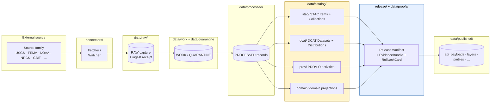

<!-- [KFM_META_BLOCK_V2]
doc_id: kfm://doc/docs-sources-catalog-readme
title: docs/sources/catalog/ — Source-to-Catalog Documentation Lane
type: readme
version: v0.1
status: draft
owners: <PLACEHOLDER — Docs steward + Source steward (CODEOWNERS NEEDS VERIFICATION)>
created: 2026-05-20
updated: 2026-05-20
policy_label: public
related:
  - docs/sources/README.md
  - docs/standards/README.md
  - docs/doctrine/directory-rules.md
  - data/catalog/README.md
  - data/registry/sources/README.md
  - connectors/README.md
  - control_plane/source_authority_register.yaml
tags: [kfm, docs, sources, catalog, stac, dcat, prov]
notes:
  - "PROPOSED path: docs/sources/catalog/ is not enumerated in directory-rules.md §6.1; see §1.1 below."
  - "Source-family inventory drawn from connectors/ §7.3 and per-domain Key source families tables in the Consolidated Atlas."
[/KFM_META_BLOCK_V2] -->

# `docs/sources/catalog/`

> Human-facing documentation for **how KFM source families become catalog entries** — the explanatory lane between `connectors/`, `data/registry/sources/`, and `data/catalog/{stac,dcat,prov,domain}/`.

[](#status)
[](#authority-level)
[](../../doctrine/truth-posture.md)
[](../../doctrine/lifecycle-law.md)
[](#last-reviewed)
<!-- TODO: replace CI badge with a working Shields.io endpoint once the docs lint workflow is wired -->
[](#validation)

**Status:** draft &nbsp;·&nbsp; **Owners:** `<PLACEHOLDER — Docs steward + Source steward>` &nbsp;·&nbsp; **Last reviewed:** 2026-05-20

---

## Contents <a id="contents"></a>

- [1. Scope and path](#1-scope-and-path)
- [2. Repo fit](#2-repo-fit)
- [3. Purpose](#3-purpose)
- [4. Authority level](#4-authority-level)
- [5. Status](#5-status)
- [6. What belongs here](#6-what-belongs-here)
- [7. What does NOT belong here](#7-what-does-not-belong-here)
- [8. Directory tree (PROPOSED)](#8-directory-tree-proposed)
- [9. Flow — source → catalog → published](#9-flow--source--catalog--published)
- [10. Source families indexed here](#10-source-families-indexed-here)
- [11. Catalog profiles and identity conventions](#11-catalog-profiles-and-identity-conventions)
- [12. Inputs](#12-inputs)
- [13. Outputs](#13-outputs)
- [14. Validation](#14-validation)
- [15. Review burden](#15-review-burden)
- [16. Authoring guide for a per-family page](#16-authoring-guide-for-a-per-family-page)
- [17. Related folders and docs](#17-related-folders-and-docs)
- [18. ADRs](#18-adrs)
- [19. Open questions](#19-open-questions)
- [20. FAQ](#20-faq)
- [21. Appendix — minimal STAC `kfm:provenance` shape](#21-appendix--minimal-stac-kfmprovenance-shape)
- [Last reviewed](#last-reviewed)

---

## 1. Scope and path

This folder is the **human-readable, source-oriented view of catalog closure**. For each source family KFM ingests — USGS, FEMA, NOAA, NRCS, Kansas, GBIF, iNaturalist, Census, `local_upload`, and others — this lane explains:

- which **catalog profiles** the family lands in (STAC, DCAT, PROV-O, or the domain projection in `data/catalog/domain/`);
- what the **identity, namespace, and provenance** conventions are for that family's entries;
- which **policy, rights, and sensitivity** considerations gate publication;
- where to find the **machine-readable contracts and schemas** that the documentation here only narrates.

> [!IMPORTANT]
> **PROPOSED path.** `docs/sources/` is enumerated in `directory-rules.md` §6.1 as *"source-descriptor standards, source families."* A `catalog/` subfolder beneath it is **not** explicitly listed there. This README assumes the subfolder is the natural docs-side companion to `data/catalog/`'s `stac/ · dcat/ · prov/ · domain/` lanes. **Confirmation required** in a per-root note in `docs/sources/README.md` or via the path-validation checklist (`directory-rules.md` §16). See [§19 Open questions](#19-open-questions).

### 1.1 Two interpretations on the table

| Interpretation | What this folder would hold | Status |
|---|---|---|
| **A. Source-perspective catalog companion** *(adopted in this README)* | Per-family pages explaining how each source family lands in `data/catalog/{stac,dcat,prov,domain}/`, with identity, provenance, and rights notes. | PROPOSED |
| **B. Catalog-of-source-families index** | A flat index of all source families KFM consumes, with cross-links to connectors and registries. | PROPOSED — alternative |

Interpretation A is adopted because it is the gap not already filled by `docs/sources/README.md` (orientation), `connectors/README.md` (fetch/admission), or `data/catalog/README.md` (artifact-side layout). The two interpretations may also merge if §19 is resolved in that direction.

[↑ Back to top](#contents)

---

## 2. Repo fit

```
repo root
└── docs/
    ├── README.md
    ├── doctrine/
    │   └── directory-rules.md           ← placement authority
    ├── standards/                       ← STAC/DCAT/PROV external profiles
    │   ├── README.md
    │   └── …
    └── sources/                         ← parent: source-descriptor standards, source families
        ├── README.md                    ← orientation for the sources lane
        └── catalog/                     ← THIS FOLDER (PROPOSED)
            ├── README.md                ← this file
            └── <source-family>/         ← per-family catalog notes (PROPOSED)
```

**Upstream:** `docs/sources/README.md` (orientation), `docs/standards/` (external spec profiles), `docs/doctrine/directory-rules.md` (placement).
**Downstream:** `data/catalog/{stac,dcat,prov,domain}/` (the artifacts these docs describe), `data/registry/sources/` (machine-readable source descriptors).

[↑ Back to top](#contents)

---

## 3. Purpose

A reader who lands here should be able to:

1. Find the **per-family page** for the source they care about (e.g. USGS, GBIF).
2. Learn which **catalog profile(s)** that family uses (STAC, DCAT, PROV-O, domain projection).
3. See the **identity and namespace conventions** (`kfm:provenance` block, Collection-id pattern, asset roles, `file:checksum`).
4. Read the **rights / sensitivity disposition** for that family and where the corresponding policy gates live.
5. Click through to the **contracts, schemas, validators, and ADRs** that machine-enforce what the docs here narrate.

This README is **documentation, not authority**. It does not decide whether a source is admissible, what its rights state is, or which profile is canonical for a given artifact type — those decisions live in `contracts/`, `policy/`, `data/registry/sources/`, and the ADR index.

[↑ Back to top](#contents)

---

## 4. Authority level

**Authority level:** `docs-companion` — explanatory only.

`docs/sources/catalog/` does not own placement, contracts, schemas, or policy. It narrates and indexes what those layers decide. Per `directory-rules.md` §2.3, this folder is **out of scope** for object-family meaning, field shape, admissibility, or source identity decisions.

| Concern | Owner (canonical) |
|---|---|
| Source identity, rights, sensitivity | `data/registry/sources/`, `policy/sensitivity/` |
| Object-family meaning | `contracts/` |
| Field-level shape | `schemas/` |
| Allow / deny / restrict / abstain | `policy/` |
| Catalog artifact layout | `data/catalog/` |
| External standard profiles (STAC, DCAT, PROV) | `docs/standards/` |
| **This folder** | **Source-family explanation and cross-linking** |

[↑ Back to top](#contents)

---

## 5. Status

**Status:** PROPOSED.

| Aspect | Label | Basis |
|---|---|---|
| The `docs/sources/catalog/` path | PROPOSED | Not enumerated in `directory-rules.md` §6.1; see [§19](#19-open-questions). |
| Per-family page convention | PROPOSED | Pattern in [§16](#16-authoring-guide-for-a-per-family-page) is illustrative until adopted. |
| Connector inventory (USGS, FEMA, NOAA, NRCS, Kansas, GBIF, iNaturalist, Census, `local_upload`) | CONFIRMED (in doctrine corpus) | `directory-rules.md` §7.3; mounted-repo presence NEEDS VERIFICATION. |
| `data/catalog/{stac,dcat,prov,domain}/` lanes | CONFIRMED (in doctrine corpus) | `directory-rules.md` §6.5, lifecycle phase rules. |
| STAC `kfm:provenance` namespace contents | CONFIRMED (doctrine) | Pass-10 idea index, C4-01. |
| Repository implementation maturity (this lane) | UNKNOWN | No mounted repo inspected in this authoring session. |

[↑ Back to top](#contents)

---

## 6. What belongs here

- **Per-source-family pages** (one Markdown file per family, or one folder per family if the family has many catalog products) describing how that family lands in `data/catalog/`.
- **Profile crosswalks** between the source's native vocabulary (e.g. DwC for biodiversity, GTFS for transit) and KFM's STAC/DCAT/PROV envelopes.
- **Identity-convention notes** — Collection-id patterns, asset-role conventions, `kfm:provenance` field expectations, `file:checksum` placement.
- **Rights and sensitivity narrative** that points at the actual `policy/sensitivity/` rules, never restates them.
- **Catalog-closure checklists** for the family (links into validators in `tools/validators/`, never duplicating their logic).
- **Cross-links** to `connectors/<family>/`, `data/registry/sources/<family>/`, `pipeline_specs/<domain>/`, and any related ADRs.

[↑ Back to top](#contents)

---

## 7. What does NOT belong here

> [!WARNING]
> Documentation in this lane MUST NOT become a parallel authority for any of the following. If a contributor's instinct is to put a fact here that is enforceable elsewhere, the fact belongs there with a link from here.

| Anti-pattern | Goes here instead |
|---|---|
| Source descriptors themselves (`SourceDescriptor` records) | `data/registry/sources/<domain>/` |
| Field-level schema (JSON Schema, Pydantic) | `schemas/contracts/v1/source/` (per ADR-0001, schema home) |
| Object-family contracts | `contracts/` |
| Rights and sensitivity rules (machine-enforceable) | `policy/sensitivity/`, `policy/sources/` |
| Connector code, fetchers, watchers | `connectors/<family>/`, `pipelines/watchers/` |
| Catalog artifacts (`*.json`, STAC items, DCAT distributions, PROV-O graphs) | `data/catalog/{stac,dcat,prov,domain}/` |
| External-spec definitions (STAC 1.1, DCAT-AP, PROV-O syntax) | `docs/standards/` |
| Operational runbooks (refresh, rollback drills) | `docs/runbooks/<domain>/` |
| Release decisions / manifests | `release/` |
| Validator logic | `tools/validators/` |
| Cited per-place truth claims | Catalog entries with EvidenceBundle, not narrative docs |

A page here that begins to dictate behavior is **drift**. Open a `docs/registers/DRIFT_REGISTER.md` entry and propose either deletion or migration.

[↑ Back to top](#contents)

---

## 8. Directory tree (PROPOSED)

> [!NOTE]
> This tree is **illustrative**. No file existence is asserted. Per-family pages are added only when the family has materialized in `connectors/` and `data/registry/sources/`.

```text
docs/sources/catalog/
├── README.md                              # this file
├── _template/
│   └── SOURCE_FAMILY_TEMPLATE.md          # PROPOSED — see §16
├── usgs/                                  # PROPOSED per family
│   ├── README.md                          # family overview
│   ├── earthquake-catalog.md              # PROPOSED — example product page
│   └── nwis-water.md                      # PROPOSED — example product page
├── fema/
│   └── README.md
├── noaa/
│   ├── README.md
│   ├── storm-events.md                    # PROPOSED
│   └── nws-alerts.md                      # PROPOSED
├── nrcs/
│   ├── README.md
│   ├── ssurgo.md                          # PROPOSED
│   └── gnatsgo.md                         # PROPOSED
├── kansas/                                # Kansas-state sources (e.g. Mesonet, KGS)
│   └── README.md
├── gbif/
│   └── README.md
├── inaturalist/
│   └── README.md
├── census/
│   └── README.md
└── local_upload/                          # curated uploads admitted through the trust membrane
    └── README.md
```

The family list mirrors `connectors/` per `directory-rules.md` §7.3 (CONFIRMED in doctrine corpus; mounted-repo presence NEEDS VERIFICATION). New families MUST appear here only after a `connectors/<family>/` and `data/registry/sources/<family>/` companion exists.

[↑ Back to top](#contents)

---

## 9. Flow — source → catalog → published

The diagram below shows where this docs lane sits relative to the lifecycle. **Promotion is a governed state transition, not a file move** (`directory-rules.md` §3, lifecycle invariant).



`docs/sources/catalog/` (highlighted) is **the documentation lens onto the `data/catalog/` artifacts** — produced by pipelines, never written by connectors. Connectors land bytes in `data/raw/...` and emit ingest receipts; they MUST NOT write into `data/catalog/`, `data/processed/`, or `data/published/` (`directory-rules.md` §7.3 — *connectors do not publish*).

[↑ Back to top](#contents)

---

## 10. Source families indexed here

The table below mirrors the connector inventory from `directory-rules.md` §7.3 (CONFIRMED in doctrine corpus). The "Catalog profiles" column is PROPOSED — confirm against the family's per-page documentation when authored.

| Source family | Typical domains | Catalog profiles likely used | Notes |
|---|---|---|---|
| `usgs/` | hydrology, geology, hazards | STAC · DCAT · PROV · domain | Earthquake catalog, NWIS water, NHDPlus context. |
| `fema/` | hazards | DCAT · PROV · domain | OpenFEMA, NFHL/MSC; rights / current terms **NEEDS VERIFICATION**. |
| `noaa/` | atmosphere, hazards | STAC · DCAT · PROV | Storm Events, NWS alerts, HMS Fire-and-Smoke. |
| `nrcs/` | soil, agriculture | DCAT · PROV · domain | SSURGO, gSSURGO, gNATSGO, SCAN. |
| `kansas/` | many (state-scoped) | STAC · DCAT · PROV · domain | Kansas Mesonet, KGS Geoportal, KHRI, KSHS Kansas Memory. |
| `gbif/` | fauna, flora | **STAC × Darwin Core hybrid** · DCAT | DwC terms under `properties.taxon`; redaction + sensitivity gates required. |
| `inaturalist/` | fauna, flora | STAC × DwC · DCAT | Citizen-science cadence; provenance trail to observer. |
| `census/` | settlements, people-DNA-land | DCAT · PROV · domain | Aggregate-cell discipline (no join from aggregate to single record). |
| `local_upload/` | any | DCAT · PROV (typically) | Curated uploads admitted via the trust membrane; rights review mandatory. |

For per-family rights, freshness, and sensitivity treatment, see the domain dossiers' *Key source families* sections in the Consolidated Atlas and the `data/registry/sources/` records when present.

[↑ Back to top](#contents)

---

## 11. Catalog profiles and identity conventions

These conventions are **doctrine-grounded** (Pass-10 idea index, category C4) but their **implementation in any mounted repository is NEEDS VERIFICATION**. The narrative below is documentation; the enforceable form lives in `contracts/`, `schemas/`, and the validators in `tools/validators/`.

| Profile lane | Primary use | Identity / namespace pattern | Key fields (PROPOSED) |
|---|---|---|---|
| `data/catalog/stac/` | Spatiotemporal assets (rasters, vectors, scenes) | STAC Item / Collection; collection id `kfm-<org>-<product>` *(PROPOSED convention)* | `properties.kfm:provenance` with `spec_hash`, `evidence_bundle_ref`, `run_record_ref`, `audit_ref`, `policy_digest`; `file:checksum` per asset. |
| `data/catalog/dcat/` | Non-spatial datasets, evidence-bundle distributions | DCAT Dataset + Distribution; `conformsTo` points at KFM evidence-bundle profile | `dcat:Distribution` with `mediaType: application/ld+json` for evidence bundles; `kfm:id`, `kfm:spec_hash` at Dataset level. |
| `data/catalog/prov/` | Provenance graphs | PROV-O activities, agents, entities | `wasDerivedFrom` links to RAW capture; `wasGeneratedBy` to pipeline run; ties to `RunReceipt`. |
| `data/catalog/domain/` | Domain-specific projections | Per-domain segment under `<domain>/` | Domain object families (Hydrology, Soil, Fauna, …) per Encyclopedia §7. |

### 11.1 Biodiversity hybrid (STAC × Darwin Core)

For occurrence and event records under `gbif/`, `inaturalist/`, and Kansas natural-history sources, doctrine adopts the **STAC × DwC hybrid** (Pass-10 C4-03): DwC terms (`scientific_name`, `common_name`, `kbs_id`, `kdwp_status`, `sensitivity_rank`) live inside `properties.taxon`, with a sibling `redaction_profile` and `evidence` block. Per-family pages MUST cross-link to the DwC profile and the sensitivity rubric.

### 11.2 CARE-bound metadata (`kfm:care`)

When a source's `SourceDescriptor` declares a non-empty `authority_to_control` (Pass-10 C15-02), the `kfm:care` extension namespace surfaces consent, steward contact, locality restrictions, and review expiry in STAC properties / DCAT distributions. Default-deny on publication applies (Pass-10 C15-03). Per-family pages MUST link to the actual `policy/sensitivity/` rules — never restate them.

[↑ Back to top](#contents)

---

## 12. Inputs

The documentation here is **derived from** (not authoritative over):

- `contracts/` — `SourceDescriptor`, `EvidenceBundle`, `RunReceipt`, `PolicyDecision`, `PromotionDecision`, `ReleaseManifest`, `RollbackCard`.
- `schemas/contracts/v1/source/` — machine shape (per ADR-0001 schema-home rule).
- `policy/sources/`, `policy/sensitivity/` — admissibility and release gates.
- `data/registry/sources/<domain>/` — per-source registry entries with rights, cadence, authority.
- `control_plane/source_authority_register.yaml` *(PROPOSED canonical home)* — machine-readable source authority ledger.
- `docs/standards/` — STAC, DCAT, PROV-O, PMTILES, OGC-API-TILES, ISO-19115, OAI-PMH profile documents.
- Pass-23 / Pass-32 Consolidated Atlas — *Key source families* tables per domain.

[↑ Back to top](#contents)

---

## 13. Outputs

- **Per-family Markdown pages** (and optional sub-pages per product) consumed by humans reading the repo on GitHub.
- **Cross-links** that make the trust membrane visible from a source's point of view.
- **No machine artifacts.** This folder does not emit JSON, YAML, schemas, manifests, or validators. If a contributor needs a machine output, the work belongs in `tools/`, `pipelines/`, `contracts/`, `schemas/`, or `data/`.

[↑ Back to top](#contents)

---

## 14. Validation

How this folder is checked:

| Check | Tool / location | Status |
|---|---|---|
| Markdown lint (heading levels, dead links) | `<PLACEHOLDER — docs lint workflow>` in `.github/workflows/` | NEEDS VERIFICATION |
| Per-root README contract presence | `tools/validators/<docs-readme-validator>` *(PROPOSED)* | PROPOSED |
| Link integrity against `connectors/`, `data/registry/sources/`, `data/catalog/`, `docs/standards/` | Repo-wide link checker | NEEDS VERIFICATION |
| No restatement of `policy/` rules in narrative form | Manual review; periodic drift sweep into `docs/registers/DRIFT_REGISTER.md` | PROPOSED |
| Per-family page conforms to the `_template/SOURCE_FAMILY_TEMPLATE.md` shape | Manual review at PR time | PROPOSED |

> [!CAUTION]
> Validators MUST exercise **DENY / ABSTAIN / ERROR** paths, not only the happy path (`directory-rules.md` §7.5.a, negative-state rule). A docs-lint that only reports successes is incomplete.

[↑ Back to top](#contents)

---

## 15. Review burden

| Change type | Required reviewers (PROPOSED) |
|---|---|
| New per-family page | Docs steward + Source steward for that family. |
| Edits that touch rights, sensitivity, or consent narrative | Docs steward + Sensitivity reviewer + (where applicable) Rights-holder representative. |
| Edits that touch STAC / DCAT / PROV identity conventions | Docs steward + at least one subsystem owner (`data/catalog/` or `contracts/`). |
| Path moves under this folder | Docs steward; raise drift entry if convention shifts. |
| Promotion of a PROPOSED convention here to a binding rule | **Not done in this folder.** Open an ADR (`directory-rules.md` §2.4). |

CODEOWNERS for `docs/sources/catalog/` — `<PLACEHOLDER — confirm against repo `.github/CODEOWNERS`>`.

[↑ Back to top](#contents)

---

## 16. Authoring guide for a per-family page

Each per-family page SHOULD use the section order below. The template lives at `_template/SOURCE_FAMILY_TEMPLATE.md` *(PROPOSED — not yet authored)*.

```text
# <family-name>

## Overview          — what the family is, who runs it, why KFM uses it
## Source authority  — link to data/registry/sources/<family>/; never restate
## Catalog profiles  — STAC, DCAT, PROV, domain — what this family lands in
## Identity & namespaces — Collection-id pattern, asset roles, kfm:provenance fields
## Rights & sensitivity — link to policy/sensitivity/; never restate
## Validation         — link to tools/validators/; never restate
## Related contracts & schemas — links into contracts/, schemas/
## Related connectors & pipelines — links into connectors/<family>/, pipelines/, pipeline_specs/
## Open questions     — anything UNKNOWN or NEEDS VERIFICATION
```

> [!TIP]
> Truth labels (`CONFIRMED`, `INFERRED`, `PROPOSED`, `UNKNOWN`, `NEEDS VERIFICATION`) are mandatory where confidence materially matters. Don't upgrade uncertainty through tone.

[↑ Back to top](#contents)

---

## 17. Related folders and docs

- [`docs/sources/README.md`](../README.md) — parent: source-descriptor standards, source families orientation.
- [`docs/standards/README.md`](../../standards/README.md) — external standards (STAC, DCAT, PROV, PMTILES, OGC-API-TILES, ISO-19115, OAI-PMH).
- [`docs/doctrine/directory-rules.md`](../../doctrine/directory-rules.md) — placement authority (esp. §6.1, §6.5, §7.3, §15).
- [`docs/doctrine/lifecycle-law.md`](../../doctrine/lifecycle-law.md) — RAW → WORK / QUARANTINE → PROCESSED → CATALOG / TRIPLET → PUBLISHED.
- [`docs/doctrine/trust-membrane.md`](../../doctrine/trust-membrane.md) — governed-API as the public path; raw/work/quarantine are not.
- [`docs/runbooks/`](../../runbooks/) — operational procedures including refresh and rollback drills.
- [`data/catalog/README.md`](../../../data/catalog/README.md) *(PROPOSED — verify presence)* — artifact-side companion.
- [`data/registry/sources/`](../../../data/registry/sources/) — machine-readable source descriptors.
- [`connectors/README.md`](../../../connectors/README.md) — fetch / admission / watcher layer.
- [`control_plane/source_authority_register.yaml`](../../../control_plane/source_authority_register.yaml) *(PROPOSED canonical)*.

[↑ Back to top](#contents)

---

## 18. ADRs

| ADR | Relevance | Status |
|---|---|---|
| ADR-0001 (schema home) | Sets `schemas/contracts/v1/` as default schema home; per-family pages link there. | CONFIRMED in doctrine corpus; repo presence NEEDS VERIFICATION. |
| **PROPOSED ADR** — *Adopt `docs/sources/catalog/` as a documentation lane under `docs/sources/`.* | Would resolve [§19 OPEN-DSC-01](#19-open-questions). | Not yet opened. |
| **PROPOSED ADR** — *Pin the KFM provenance namespace to `kfm:` (vs. `ks-kfm:`).* | Pass-10 C4-01 flags this as an open question affecting every STAC item KFM publishes. | Not yet opened. |

[↑ Back to top](#contents)

---

## 19. Open questions

<details>
<summary><b>Click to expand — verification backlog for this folder</b></summary>

- **OPEN-DSC-01.** Should `docs/sources/catalog/` exist as a docs subfolder, or should source-catalog narrative live inside `docs/sources/<family>/` directly with no intermediate `catalog/` segment? *Status: PROPOSED; resolution by per-root note in `docs/sources/README.md` or by ADR.*
- **OPEN-DSC-02.** Does the per-family page list live here, or in `docs/sources/README.md` as a flat index? (Interpretation A vs. B in [§1.1](#11-two-interpretations-on-the-table).) *Status: PROPOSED.*
- **OPEN-DSC-03.** Is the KFM provenance namespace `kfm:` (KFM-global) or `ks-kfm:` (Kansas-scoped)? (Pass-10 C4-01.) *Status: UNKNOWN.*
- **OPEN-DSC-04.** Should STAC Collections carry a `kfm:promotion_state` summary field? (Pass-10 C4-02.) *Status: PROPOSED.*
- **OPEN-DSC-05.** Canonical disposition between STAC and DCAT for spatiotemporal datasets that *could* go either way. (Pass-10 C4-05.) *Status: NEEDS VERIFICATION.*
- **OPEN-DSC-06.** Should `kfm:care` be proposed upstream to the STAC-extensions registry or kept KFM-local? (Pass-10 C15-02.) *Status: UNKNOWN.*
- **OPEN-DSC-07.** Filename casing convention for per-family pages — hyphens (mirroring `docs/standards/` external-spec convention) or underscores (mirroring KFM-coined topical docs)? See `directory-rules.md` §18 OPEN-DR-04. *Status: PROPOSED.*
- **OPEN-DSC-08.** Repository implementation maturity for everything in this README. *Status: UNKNOWN; no mounted repo inspected in this authoring session.*

</details>

Open items SHOULD be tracked in `docs/registers/VERIFICATION_BACKLOG.md` and surfaced in the Friday material-change report.

[↑ Back to top](#contents)

---

## 20. FAQ

<details>
<summary><b>Why isn't this just inside <code>data/catalog/</code>?</b></summary>

`data/catalog/` holds **artifacts** (STAC items, DCAT distributions, PROV-O graphs, domain projections). It is governed by lifecycle law and policy gates. Narrative documentation does not belong alongside lifecycle data — it belongs under `docs/`. This folder is the human-facing lens on those artifacts, organized by source family.

</details>

<details>
<summary><b>Why source family, not by domain?</b></summary>

Domain views already exist under `docs/domains/<domain>/` and `data/catalog/domain/<domain>/`. Source-family organization here serves a different need: a reader investigating how *NRCS SSURGO* flows through KFM wants one page, not five hops through soil, agriculture, and habitat domain docs. Cross-links to domain pages are mandatory.

</details>

<details>
<summary><b>Can I put a SourceDescriptor JSON example here?</b></summary>

Short, **illustrative** examples are fine. The **authoritative** descriptor and its schema live in `data/registry/sources/` and `schemas/contracts/v1/source/`. An example in this folder MUST link to the authoritative location and MUST be labeled illustrative.

</details>

<details>
<summary><b>What if a source family doesn't fit STAC, DCAT, or PROV?</b></summary>

Then the per-family page documents that gap. The corpus is explicit that STAC / DCAT / PROV cover most cases (Pass-10 §6.4) but not all — e.g. some prosopography and genealogy records share the catalog envelope under C4.e but require additional care. Flag it as an open question and route to ADR if a new profile is genuinely needed (`directory-rules.md` §2.4 — parallel-authority rule).

</details>

<details>
<summary><b>Is this folder canonical for anything?</b></summary>

**No.** It is `docs-companion` authority only. Any contributor who finds themselves treating a page here as a binding rule should open a drift entry. Binding rules live in `contracts/`, `schemas/`, `policy/`, `release/`, or ADRs.

</details>

[↑ Back to top](#contents)

---

## 21. Appendix — minimal STAC `kfm:provenance` shape

The shape below is **illustrative** (derived from Pass-10 C4-01) and **NEEDS VERIFICATION** against the mounted-repo schema in `schemas/contracts/v1/source/` (per ADR-0001).

```json
{
  "stac_version": "1.1.0",
  "id": "kfm-noaa-storm-events-2024-04-12",
  "type": "Feature",
  "collection": "kfm-noaa-storm-events",
  "properties": {
    "datetime": "2024-04-12T17:42:00Z",
    "kfm:provenance": {
      "spec_hash": "sha256:<...>",
      "evidence_bundle_ref": "kfm://evidence/<bundle-digest>",
      "run_record_ref": "kfm://run/<run-id>",
      "audit_ref": "kfm://audit/<attestation-id>",
      "policy_digest": "sha256:<policy-bundle-digest>"
    }
  },
  "assets": {
    "data": {
      "href": "s3://kfm-cataloged/.../events.parquet",
      "type": "application/vnd.apache.parquet",
      "file:checksum": "sha256:<...>",
      "roles": ["data"]
    }
  },
  "links": [
    { "rel": "collection", "href": "../collection.json" },
    { "rel": "attestation", "href": "kfm://evidence/<bundle-digest>" }
  ]
}
```

Notes:

- `kfm:provenance` fields and `file:checksum` are doctrine-grounded (Pass-10 C4-01 CONFIRMED).
- The `attestation` link relation is **PROPOSED** — not a registered STAC link rel today (`KFM-P7-PROG-0001`); upstream submission to the STAC-extensions registry is an open expansion.
- The namespace prefix shown here is `kfm:` — this is **UNKNOWN** until [OPEN-DSC-03](#19-open-questions) is resolved.

[↑ Back to top](#contents)

---

## Related docs

- [`docs/sources/README.md`](../README.md) — parent orientation.
- [`docs/standards/README.md`](../../standards/README.md) — external standard profiles.
- [`docs/doctrine/directory-rules.md`](../../doctrine/directory-rules.md) — placement authority.
- [`data/catalog/README.md`](../../../data/catalog/README.md) — artifact-side companion *(verify presence)*.
- [`docs/registers/VERIFICATION_BACKLOG.md`](../../registers/VERIFICATION_BACKLOG.md) — backlog including the open questions listed above.

## Last reviewed <a id="last-reviewed"></a>

**2026-05-20** *(authoring session, docs-only — no mounted repo inspected)*.
Re-review trigger: any of (a) `docs/sources/` reorganization, (b) ADR resolving [§19 OPEN-DSC-01](#19-open-questions), (c) addition of a new connector family in `connectors/`, (d) change to STAC / DCAT / PROV profile choice in `docs/standards/`.

[↑ Back to top](#contents)
