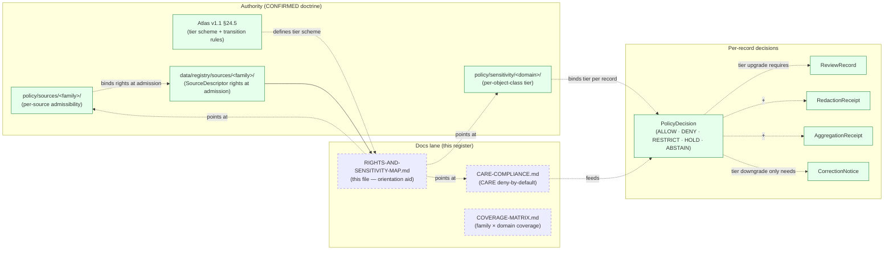

<!-- [KFM_META_BLOCK_V2]
doc_id: kfm://doc/docs-sources-catalog-rights-and-sensitivity-map
title: Source catalog rights and sensitivity map
type: register
version: v0.2
status: draft
owners: <PLACEHOLDER — Docs steward · Source steward · Policy steward · Per-family stewards>
created: 2026-05-20
updated: 2026-05-23
policy_label: public
related:
  - docs/sources/catalog/README.md
  - docs/sources/catalog/CARE-COMPLIANCE.md
  - docs/sources/catalog/INDEX.md
  - docs/sources/catalog/OPEN-QUESTIONS.md
  - docs/doctrine/directory-rules.md
  - policy/sensitivity/
  - policy/sources/
  - data/registry/sources/
tags: [kfm, docs, sources, catalog, register, rights, sensitivity, tiers]
notes:
  - "v0.2 — full presentation-standard pass; grounded the tier scheme T0..T4 against Atlas v1.1 §24.5 (Master Sensitivity / Rights Tier Reference) and KFM Unified Doctrine Synthesis §15; added cross-cutting deny-by-default lanes from per-domain dossiers; strengthened per-family rows with PROPOSED typical guidance (still NEEDS VERIFICATION per row)."
  - "v0.2 corrects ADR-0010 reference (cited in v0.1 for deny-by-default rule) — not located in the doctrine corpus this session. The deny-by-default rule itself is CONFIRMED doctrine (Atlas §24.5.1, per-domain dossiers); the specific ADR-0010 identifier is NEEDS VERIFICATION. Doctrine synthesis ADR backlog uses ADR-S-NN identifiers; ADR-S-05 (Sensitivity tier scheme) is the likely correspondent."
  - "PROPOSED scaffold; sibling-link presence verified in a prior Claude Code session, not in this session."
  - "Doctrinal posture preserved from v0.1: this map DOES NOT decide rights or sensitivity. Authority lives in policy/sensitivity/ and policy/sources/. Per-family rows remain NEEDS VERIFICATION pending policy-record confirmation and per-source license terms."
  - "Atlas anchors: §24.5.1 (Tier scheme T0..T4 PROPOSED but CONFIRMED across per-domain dossiers); §24.5.2 (Per-domain tier matrix); §24.5.3 (Tier transitions — upgrade needs transform+review; downgrade needs CorrectionNotice only); per-domain dossiers §D (Key source families) and §I (Sensitivity, rights, and publication posture)."
[/KFM_META_BLOCK_V2] -->

# Source catalog rights and sensitivity map

> Per-family summary of typical rights, sensitivity tier, and publication posture — explanatory only. Authority lives in `policy/`.

**Status:** scaffold (PROPOSED) · **Type:** register *(docs lane; not authority)* · **Last reviewed:** 2026-05-23

---

## Quick jump

- [Purpose](#purpose)
- [Authority pointer](#authority-pointer)
- [Tier scheme (T0..T4)](#tier-scheme-t0t4)
- [Cross-cutting deny-by-default lanes](#cross-cutting-deny-by-default-lanes)
- [Per-family typical posture](#per-family-typical-posture)
- [Tier-transition discipline](#tier-transition-discipline)
- [Where this register sits](#where-this-register-sits)
- [Maintenance rules](#maintenance-rules)
- [Open questions](#open-questions)
- [Related docs](#related-docs)

---

## Purpose

This register answers one navigation question:

> **For each source family, what is the typical rights posture and what is the default sensitivity tier — as an orientation aid, before per-product policy lookup?**

> [!IMPORTANT]
> This map **does not decide** rights or sensitivity. Authority lives in [`policy/sensitivity/`](../../../../policy/sensitivity/) and [`policy/sources/`](../../../../policy/sources/). Every per-family row below is **NEEDS VERIFICATION** at the per-row level — typical-posture text is PROPOSED guidance, pending confirmation against policy records, per-source license terms, and per-object-class sensitivity defaults in Atlas v1.1 §24.5.2.

> [!NOTE]
> The per-family framing is a **partial view**. Doctrinally, sensitivity is per **domain × object class** (Atlas §24.5.2): the same source family can carry T0 records (public layers) AND T4 records (sensitive species occurrences) at the same time. The family-axis posture here describes the **most common** record class for the family, not the only class. Always look up the per-object-class tier in `policy/sensitivity/<domain>/` before publishing.

[Back to top](#quick-jump)

---

## Authority pointer

| Concern | Where authority lives | Status |
|---|---|---|
| Per-source admissibility (rights, role, cadence) | [`policy/sources/`](../../../../policy/sources/) | **CONFIRMED root** *(directory-rules.md §9.1)* |
| Per-domain × per-object-class sensitivity tier | [`policy/sensitivity/<domain>/`](../../../../policy/sensitivity/) | **CONFIRMED root** *(directory-rules.md §9.1)* |
| Source rights at admission (license, terms) | [`data/registry/sources/<family>/`](../../../../data/registry/sources/) + `SourceDescriptor` fields | **CONFIRMED — at admission** |
| Tier scheme T0..T4 | Atlas v1.1 §24.5.1; KFM Unified Doctrine Synthesis §15; ADR-S-05 *(PROPOSED ADR identifier — doctrine synthesis backlog)* | **CONFIRMED scheme** *(ADR identifier NEEDS VERIFICATION)* |
| Per-domain tier matrix | Atlas v1.1 §24.5.2; per-domain dossiers §I | **CONFIRMED doctrine** |
| Tier-transition rules | Atlas v1.1 §24.5.3 | **CONFIRMED doctrine** |
| CARE deny-by-default rule | Pass-10 C15-03; [`CARE-COMPLIANCE.md`](./CARE-COMPLIANCE.md) | **CONFIRMED rule** |

> [!CAUTION]
> The v0.1 cited `ADR-0010` as the authority for "Deny-by-default applies to DNA, rare-species, archaeology, and infrastructure data." The **deny-by-default rule itself is CONFIRMED doctrine** (Atlas §24.5.2 per-domain tier matrix; Pass-10 C15-03 OPA default-deny on CARE-tagged assets; per-domain dossiers §I). The **specific identifier `ADR-0010`** was **not located** in the doctrine corpus this session. Only `ADR-0001` is confirmed. The doctrine synthesis ADR backlog uses `ADR-S-NN` identifiers; `ADR-S-05` (Sensitivity tier scheme) is the likely correspondent. Reconcile against the active ADR ledger.

[Back to top](#quick-jump)

---

## Tier scheme (T0..T4)

**CONFIRMED doctrine** — Atlas v1.1 §24.5.1; consistent across per-domain dossiers.

| Tier | Name | Definition | Default audience |
|---|---|---|---|
| **T0** | Open | Public-safe with no transformations required; no rights, sensitivity, or steward gating beyond standard release. | Any public client via governed API. |
| **T1** | Generalized | Public-safe only after generalization, fuzzing, aggregation, or redaction; transform is reviewed and recorded. | Any public client via governed API. |
| **T2** | Reviewer | Released only to authenticated reviewers or domain stewards; policy-bounded; correction path active. | Stewards, reviewers, named research collaborators. |
| **T3** | Restricted | Released only under named agreement (rights, sovereignty, or consent) and recorded. | Named authorized parties only. |
| **T4** | Denied | Not released to any audience; the existence of a record may be released only as steward review permits. | — |

> [!IMPORTANT]
> Tier is assigned **per record** (or per object class within a record), not per family. A single `kfm-noaa-storm-events` Collection might publish T0 historical event aggregates AND withhold T4 location-specific records that intersect sensitive infrastructure. The family-axis posture below describes the **most common** record class.

[Back to top](#quick-jump)

---

## Cross-cutting deny-by-default lanes

**CONFIRMED doctrine** — these deny lanes apply across **every** family that touches the listed object classes. Documented in Atlas v1.1 §24.5.2 and per-domain dossiers §I.

| Deny lane | Default tier | Why | Citation |
|---|---|---|---|
| **DNA / raw genomic segment data** | **T4** | No transform releases this to a public tier; T3 only under explicit research agreement | `[DOM-PEOPLE]`; Pass-10 C9-03 |
| **Living-person identifiers** | **T4** | No transform releases living-person identity to public; aggregation by tract/county → T1 only with `AggregationReceipt` | `[DOM-PEOPLE]`; Pass-10 C15-01 |
| **Rare / sensitive species precise occurrence** | **T4** | Geoprivacy generalization + `RedactionReceipt` → T1 only | `[DOM-FAUNA]`, `[DOM-FLORA]` |
| **Archaeological exact site coordinates** | **T4** | Steward + cultural review + generalized geometry → T2 or T1 only | `[DOM-ARCH]` |
| **Human remains / sacred sites** | **T4** | No transform releases this to T0; T3 only under explicit named authorization; sovereignty review required | `[DOM-ARCH]` |
| **Critical infrastructure precise locations** | **T4** | Generalized facility footprint + suppressed dependency → T1 only | `[DOM-SETTLE]` |
| **Infrastructure condition / vulnerability** | **T4** | T3 to named authorities only; never T0 / T1 | `[DOM-SETTLE]` |
| **KFM as alert authority (hazards)** | **T4 forever** | No transform permits KFM to act as an emergency-alert authority — the boundary holds | `[DOM-HAZ]` |
| **Candidate records (not yet promoted)** | **T4** | DENY at trust membrane; route to QUARANTINE; no PUBLISHED edge to WORK / QUARANTINE | `[ENCY]`, `[DIRRULES]`; Atlas §24.1.2 |
| **Synthetic content presented as observed reality** | **T4** | DENY publication; HOLD for steward review; ABSTAIN at AI; Representation Receipt required | `[MAP-MASTER]`, `[UIAI]`, `[DOM-ARCH]`, `[DOM-HAB]` |
| **AI text treated as evidence** | **T4** | DENY publication; ABSTAIN at Focus Mode; AIReceipt mandatory | `[GAI]`, `[ENCY]`, `[UIAI]` |
| **CARE — non-empty `authority_to_control`** | **T4 until consent** | OPA default-deny on CARE-tagged assets; release only with valid + unrevoked consent grant | Pass-10 C15-03; [`CARE-COMPLIANCE.md`](./CARE-COMPLIANCE.md) |

> [!CAUTION]
> These lanes do not depend on which source family the record came from. A USGS dataset that contains rare-species occurrence records inherits the T4 default for those records regardless of USGS's overall public-domain posture.

[Back to top](#quick-jump)

---

## Per-family typical posture

Every cell below is **NEEDS VERIFICATION** at the per-row level. The "typical" guidance is **PROPOSED orientation only** — confirm against `policy/sensitivity/`, `policy/sources/`, and the per-source `SourceDescriptor` before publishing any record.

| Family | Typical rights (PROPOSED) | Default tier (PROPOSED) | Publication posture (PROPOSED) | Policy link |
|---|---|---|---|---|
| **`usgs`** | US federal — public domain (CC0 default for federal works) — **NEEDS VERIFICATION per product** | **T0** for WBD/HUC, NHDPlus, 3DEP, NWIS, public layers; **T4** for any rare-species or archaeological intersection records | Standard Gates A–G; sensitive-object-class records demoted per `policy/sensitivity/<domain>/` | [`policy/sensitivity/`](../../../../policy/sensitivity/) · [`policy/sources/usgs/`](../../../../policy/sources/) |
| **`fema`** | US federal — public domain — **NEEDS VERIFICATION** | **T0** for NFHL regulatory channel, OpenFEMA disaster declarations; **T2/T4** for critical-infrastructure detail; **T4 forever** for KFM as alert authority | Standard Gates A–G; NFHL is regulatory-channel only, not observed-event evidence | [`policy/sensitivity/`](../../../../policy/sensitivity/) · [`policy/sources/fema/`](../../../../policy/sources/) |
| **`noaa`** | US federal — public domain — **NEEDS VERIFICATION** | **T0** for historical Storm Events, USCRN, HMS Fire/Smoke; **T4 forever** for KFM as alert authority *(NWS alerts NEVER republished as KFM alerts)* | Standard Gates A–G; stale-state badge for operational disclaimer; NWS alert republication denied | [`policy/sensitivity/`](../../../../policy/sensitivity/) · [`policy/sources/noaa/`](../../../../policy/sources/) |
| **`nrcs`** | US federal — public domain — **NEEDS VERIFICATION** | **T0** for SSURGO / gSSURGO / gNATSGO / SCAN public layers | Standard Gates A–G; soil time caveats surfaced in product pages | [`policy/sensitivity/`](../../../../policy/sensitivity/) · [`policy/sources/nrcs/`](../../../../policy/sources/) |
| **`kansas`** | **Varies per authority** — KSHS, KGS, KDWP, KSU, KHRI each carry their own terms — **NEEDS VERIFICATION per source** | **T0** for most KGS, KSU public layers; **T2/T4** for KDWP SINC sensitive-species lane; **T2/T4** for KHRI archaeological coordinates | Per-authority Kansas-First Domain Authorities review *(Pass-10 C7-10)*; SINC redaction policy CONFIRMED *(KDWP)* | [`policy/sensitivity/`](../../../../policy/sensitivity/) · [`policy/sources/kansas/`](../../../../policy/sources/) |
| **`gbif`** | Per-record license declared in DwC — typically **CC0** / **CC-BY 4.0** / **CC-BY-NC 4.0** — **NEEDS VERIFICATION per record** *(Pass-10 C10-12 GBIF licensing)* | **T0** for non-sensitive aggregates; **T4** for sensitive-species occurrence records *(geoprivacy generalization → T1 only via `RedactionReceipt`)* | Per-record `dwc:license` preserved through STAC × DwC hybrid; sensitive joins fail closed | [`policy/sensitivity/`](../../../../policy/sensitivity/) · [`policy/sources/gbif/`](../../../../policy/sources/) |
| **`inaturalist`** | Per-observation observer-controlled — **CC0** / **CC-BY** / **CC-BY-NC** / **all rights reserved** — **NEEDS VERIFICATION per observation** | **T0** for non-sensitive research-grade aggregates; **T4** for sensitive-species, hidden geoprivacy records | Per-observation license honored; obscured-by-observer geometry NEVER de-obscured; sensitive joins fail closed | [`policy/sensitivity/`](../../../../policy/sensitivity/) · [`policy/sources/inaturalist/`](../../../../policy/sources/) |
| **`census`** | US federal — public domain — **NEEDS VERIFICATION** | **T0** for TIGER admin geographies, aggregated ACS / Decennial tables; **T2/T4** for granular living-person fields *(de-identification thresholds apply)* | Aggregation per Census tract / block group; private-join denial for living-person identifiers | [`policy/sensitivity/`](../../../../policy/sensitivity/) · [`policy/sources/census/`](../../../../policy/sources/) |
| **`local_upload`** | **Operator-declared at admission** — license, rights, terms MUST be set in the SourceDescriptor — **NEEDS VERIFICATION per upload** | **T4 default until cleared** *(deny-by-default until rights and sensitivity are explicitly set)* | Source steward + policy steward review at admission; no implicit license | [`policy/sensitivity/`](../../../../policy/sensitivity/) · [`policy/sources/local_upload/`](../../../../policy/sources/) |

> [!NOTE]
> Across **every** family in the doctrine corpus, the per-domain dossier §D table notes: *"rights and current terms NEEDS VERIFICATION; sensitive joins fail closed; source-vintage or cadence specific."* The PROPOSED typical guidance above is best-effort orientation; it does not exempt any product from per-source verification.

[Back to top](#quick-jump)

---

## Tier-transition discipline

**CONFIRMED doctrine** — Atlas v1.1 §24.5.3.

### Tier upgrade (toward more public) — requires BOTH transform receipt AND review record

| From → To | Required artifact | Required reviewer |
|---|---|---|
| **T4 → T3** | `PolicyDecision` + `ReviewRecord` + named agreement | Steward + rights-holder where applicable |
| **T4 → T2** | `PolicyDecision` + `ReviewRecord` | Steward |
| **T4 → T1** | `RedactionReceipt` + `ReviewRecord` | Steward |
| **T3 → T2** | `PolicyDecision` + `ReviewRecord` | Steward |
| **T2 → T1** | `RedactionReceipt` + `ReviewRecord` | Steward |
| **T1 → T0** | `ReleaseManifest` + `ReviewRecord` | Steward + release authority |

### Tier downgrade (toward less public) — requires CorrectionNotice only

| From → To | Required artifact |
|---|---|
| **Any tier → T4 (downgrade)** | `CorrectionNotice` + `ReviewRecord` |

> [!IMPORTANT]
> **Reading note** (CONFIRMED — Atlas §24.5.3): *"A tier upgrade (toward more public) always needs both a transform receipt and a review record; a tier downgrade (toward less public) never needs both — correction alone is sufficient to remove or restrict."* This asymmetry is doctrinal: the cost of mistakenly publishing must exceed the cost of mistakenly restricting.

**Reversibility.** Every transition is **reversible** (Atlas §24.5.3): agreement revocation returns T3 to T4 with `CorrectionNotice`; review revocation returns T2 to T4; redaction can be re-evaluated; T1 publication is rollback-supported via `RollbackCard`.

[Back to top](#quick-jump)

---

## Where this register sits

> [!NOTE]
> Solid green = CONFIRMED doctrine. Dashed = PROPOSED docs-lane elements. The diagram shows that this register **points at** the policy authorities but does not produce per-record decisions; those flow through `PolicyDecision` with the receipts required for the relevant tier transition.

[Back to top](#quick-jump)

---

## Maintenance rules

> [!IMPORTANT]
> Docs are part of the working system. This register MUST update when the tier scheme changes, when per-family rights are confirmed, or when a new deny-by-default lane is documented.

| Trigger | Action |
|---|---|
| **Per-family rights confirmed** *(license, terms verified against source publisher)* | Flip the "Typical rights" cell from PROPOSED → CONFIRMED with the specific license string; cite the policy record. |
| **Per-family default tier confirmed** *(per `policy/sensitivity/<domain>/`)* | Flip the "Default tier" cell; cite the specific policy bundle. |
| **New cross-cutting deny-by-default lane documented** *(per-domain dossier §I update)* | Add a row to [Cross-cutting deny-by-default lanes](#cross-cutting-deny-by-default-lanes); cite the resolving doctrine. |
| **ADR-S-05 (Sensitivity tier scheme) ratified** | Update the IMPORTANT callout in [Authority pointer](#authority-pointer); promote the tier scheme from PROPOSED → CONFIRMED-with-ADR. |
| **CARE-applicable family identified** *(steward asserts authority over a source family or its records)* | Add a `CARE — non-empty authority_to_control` reference; coordinate with [`CARE-COMPLIANCE.md`](./CARE-COMPLIANCE.md). |
| **Family added to `directory-rules.md` §7.3** | Add the new row to the per-family table; bump version. |
| **Family removed** *(via ADR migration)* | Remove the row; reference the resolving ADR. |
| **Tier-transition rule changes** *(via Atlas update or ADR)* | Update [Tier-transition discipline](#tier-transition-discipline); bump version. |

**Versioning.** KFM Meta Block v2 semver-lite: `v0.x` while per-family rights remain NEEDS VERIFICATION; `v1.x` once all nine §7.3 family rights are confirmed against policy records.

[Back to top](#quick-jump)

---

## Open questions

This register references existing `OPEN-DSC-*` entries in [`OPEN-QUESTIONS.md`](./OPEN-QUESTIONS.md). New allocations require canonical confirmation per the numbering rule established in `OPEN-QUESTIONS.md` v0.2.

| ID | Question | Status |
|---|---|---|
| **OPEN-DSC-08** | Repository implementation maturity — including whether `policy/sensitivity/<domain>/` and `policy/sources/<family>/` actually exist in the mounted repo. | **PARTIALLY RESOLVED** *(2026-05-20 inspection confirmed `policy/` root)* |
| **OPEN-DSC-11** | Citizen-science families (eBird, iNaturalist sensitive-species redaction policy) — promotion to §7.3 gated on sensitive-species redaction policy. | **DEFERRED** |
| **OPEN-DSC-12** | Genomic and rare-species families — promotion gated on deny-by-default ADR. | **DEFERRED** |
| **OPEN-DSC-12-NV** | `ADR-0010` cited in v0.1 for deny-by-default rule — not located in corpus; likely correspondent `ADR-S-05`. | **NEEDS VERIFICATION** |
| **OPEN-DSC-33** *(PROPOSED ALLOCATION — needs OPEN-QUESTIONS.md v0.3 canonical assignment)* | Per-family rights confirmation cadence — what triggers a per-family rights review? Annual? On source-publisher terms change? | **PROPOSED** |
| **OPEN-DSC-34** *(PROPOSED ALLOCATION)* | The per-family framing in this register is a partial view of doctrine §24.5.2 (which is per domain × object class). Should this register be **superseded** by a per-domain × per-object-class register at `docs/sources/catalog/SENSITIVITY-MATRIX.md`, or **kept as orientation aid** with cross-references? | **PROPOSED** |
| **OPEN-DSC-35** *(PROPOSED ALLOCATION)* | License-string canonicalization — should "typical rights" use SPDX identifiers (`CC0-1.0`, `CC-BY-4.0`, etc.) per Pass-10 C1-01's `rights_spdx` field? Mirror the receipt convention. | **PROPOSED** |
| **OPEN-DSC-36** *(PROPOSED ALLOCATION)* | `local_upload` rights workflow — formal admission-time rights review procedure; deny-by-default-until-cleared posture needs an operational runbook. | **PROPOSED** |

> [!NOTE]
> OPEN-DSC-33..36 are **PROPOSED ALLOCATIONS**, not yet entered into the canonical register. The numbering high-water mark in `OPEN-QUESTIONS.md` v0.2 reserves 16..28 for collision reconciliation and 29..32 for PROFILES.md PROPOSED ALLOCATIONS, so OPEN-DSC-33 is the next free identifier — but coordinate with the canonical register before allocating.

[Back to top](#quick-jump)

---

## Related docs

- [`docs/sources/catalog/CARE-COMPLIANCE.md`](./CARE-COMPLIANCE.md) — CARE governance fields *(authoritative for the `authority_to_control` → DENY rule)*
- [`docs/sources/catalog/INDEX.md`](./INDEX.md) — family index *(31 family folders observed; 9 in §7.3 + 22 additional pending ADR)*
- [`docs/sources/catalog/COVERAGE-MATRIX.md`](./COVERAGE-MATRIX.md) — family × domain documentation coverage
- [`docs/sources/catalog/OPEN-QUESTIONS.md`](./OPEN-QUESTIONS.md) — canonical numbering authority for `OPEN-DSC-*`
- [`docs/sources/catalog/GLOSSARY.md`](./GLOSSARY.md) — defines `EvidenceBundle`, `RedactionReceipt`, `AggregationReceipt`, `PolicyDecision`, `ReviewRecord`, `CorrectionNotice`, `RollbackCard`, `Trust membrane`
- [`policy/sensitivity/`](../../../../policy/sensitivity/) — **authoritative sensitivity rules** *(by domain × object class)*
- [`policy/sources/`](../../../../policy/sources/) — **authoritative source admissibility rules** *(by family)*
- [`policy/release/hazards/`](../../../../policy/release/hazards/) — Hazards-specific release policy *(KFM-not-alert-authority lane)*
- [`policy/consent/people/`](../../../../policy/consent/people/) — Consent policy *(People/DNA/Land sensitive lane)*
- [`data/registry/sources/`](../../../../data/registry/sources/) — SourceDescriptors with rights at admission
- [`docs/doctrine/directory-rules.md`](../../doctrine/directory-rules.md) — placement authority *(§7.3 family list; §9.1 policy root)*
- KFM Domains Atlas v1.1 §24.5 — **Master Sensitivity / Rights Tier Reference**
- [`docs/registers/DRIFT_REGISTER.md`](../../registers/DRIFT_REGISTER.md) — drift entries
- [`docs/adr/`](../../adr/) — ADRs *(active ledger needed to resolve OPEN-DSC-12-NV)*

---

*Doc status: **draft · register (v0.2)** · Last reviewed: **2026-05-23** · Provenance: revised against KFM Domains Atlas v1.1 §24.5.1 (tier scheme), §24.5.2 (per-domain tier matrix), §24.5.3 (tier transitions); per-domain dossiers §D (Key source families) and §I (Sensitivity, rights, and publication posture); KFM Unified Doctrine Synthesis §15 + §16; Pass-10 C6-01 (Sensitivity Rubric), C9-03 (DTC raw-genomic), C10-12 (GBIF licensing), C15-01..03 (CARE); no mounted-repo evidence in this session.*

[↑ Back to top](#source-catalog-rights-and-sensitivity-map)
