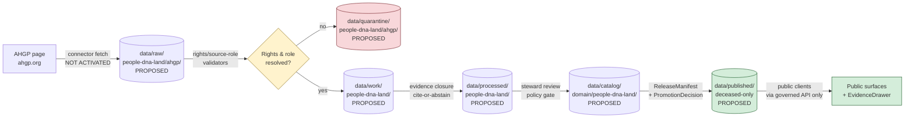

<!-- [KFM_META_BLOCK_V2]
doc_id: kfm://doc/source-catalog-ahgp
title: AHGP — American History and Genealogy Project (source catalog entry)
type: standard
version: v0.1
status: draft
owners: People, Genealogy, DNA, and Land Ownership domain steward; Sources steward
created: 2026-05-13
updated: 2026-05-13
policy_label: restricted-pending-review
related:
  - docs/sources/SOURCE_DESCRIPTOR_STANDARD.md
  - docs/sources/README.md
  - docs/domains/people-dna-land/README.md
  - docs/doctrine/directory-rules.md
  - docs/doctrine/truth-posture.md
  - docs/doctrine/trust-membrane.md
  - docs/architecture/contract-schema-policy-split.md
  - schemas/contracts/v1/source/source-descriptor.schema.json
tags: [kfm, sources, source-catalog, people-dna-land, genealogy, aggregator]
notes:
  - "PROPOSED path: docs/sources/catalog/ subdirectory not explicitly enumerated in Directory Rules §6.1; verify against repo or accept ADR."
  - "Rights posture NEEDS VERIFICATION before any connector activation."
  - "Source role: aggregate / administrative — never observation."
  - "Living-person and DNA surfaces DENY by default; this source does not lift that posture."
[/KFM_META_BLOCK_V2] -->

# AHGP — American History and Genealogy Project

> Source catalog entry for an unincorporated volunteer transcription network of historical and genealogical material. Doctrine status only — **not activated, not admitted, not publishable.**


| Field | Value |
|---|---|
| **Document type** | Standard doc — source catalog entry |
| **Source ID (PROPOSED)** | `SRC-AHGP` |
| **Domain home (PROPOSED)** | People, Genealogy, DNA, and Land Ownership |
| **Source role (PROPOSED)** | `aggregate` *or* `administrative` (per record class; never `observed`) |
| **Activation state** | **Not activated.** No `SourceActivationDecision` issued. |
| **Release class (PROPOSED)** | Deceased-person, public-record-derived material only, after evidence closure and steward review |
| **Authority of this doc** | CONFIRMED doctrine framing / PROPOSED specifics — none of the descriptor fields below are admissible until issued via the canonical `SourceDescriptor` schema |
| **Owners** | People, Genealogy, DNA, and Land Ownership domain steward; Sources steward |
| **Last updated** | 2026-05-13 |

---

## Quick jump

- [1. One-line purpose](#1-one-line-purpose)
- [2. What AHGP is (external grounding)](#2-what-ahgp-is-external-grounding)
- [3. Why a catalog entry exists before activation](#3-why-a-catalog-entry-exists-before-activation)
- [4. Source role — anti-collapse register](#4-source-role--anti-collapse-register)
- [5. Proposed `SourceDescriptor` surface](#5-proposed-sourcedescriptor-surface)
- [6. Rights, attribution, and license posture](#6-rights-attribution-and-license-posture)
- [7. Sensitivity tier and policy hooks](#7-sensitivity-tier-and-policy-hooks)
- [8. Lifecycle and admission flow](#8-lifecycle-and-admission-flow)
- [9. Object-family mapping](#9-object-family-mapping)
- [10. Activation prerequisites](#10-activation-prerequisites)
- [11. Governed-AI posture](#11-governed-ai-posture)
- [12. Verification backlog](#12-verification-backlog)
- [13. Related docs](#13-related-docs)
- [Appendix A — Anti-pattern register for this source](#appendix-a--anti-pattern-register-for-this-source)
- [Appendix B — External grounding details](#appendix-b--external-grounding-details)

---

## 1. One-line purpose

Describe AHGP as a candidate KFM source for historical, public-record-derived, deceased-person material in the People, Genealogy, DNA, and Land Ownership domain — and pin the governance posture, source-role classification, rights questions, and admission gates that **MUST** be settled before any AHGP-derived bytes touch a public KFM surface.

---

## 2. What AHGP is (external grounding)

> [!NOTE]
> The factual description of AHGP below is **EXTERNAL** — drawn from AHGP's own public site and a third-party directory listing. It informs the *external identity* of the source only. It does **not** establish KFM-side claims about admission, rights interpretation, or implementation maturity. Those remain governed by §5–§10 below.

CONFIRMED (external): The American History and Genealogy Project is an unincorporated network of independent websites devoted to history and genealogy across North American countries and territories, organized by state and county and run by volunteer coordinators. It is "an unincorporated network of independent Web Sites devoted to History and Genealogy and covering North American Countries and Territories." 

CONFIRMED (external): The project began circa 2000 as a community effort and the current site has been "revitalized" into a single consolidated domain to reduce volunteer dependence. "This initiative, which began as a community project in 2000, has faced challenges over the years"  and the consolidated site exists because volunteer activity has aged out and shifted to social media.

CONFIRMED (external): AHGP content surfaces include cemetery transcriptions, photos and inscriptions, town/county histories, transcribed church and newspaper records, historical books predating 1927, census transcriptions, military records, historical maps, and historical gazetteers. "Books prior to 1927 can be transcribes, census records, military records, these can be found at many sites on the internet." 

CONFIRMED (external): AHGP maintains state-level project pages, including a Kansas project, accessible from the project state index. The state index lists "Kansas" alongside all other U.S. states and includes Canada AHGP. 

INFERRED: AHGP is therefore best characterized as a **community-curated compilation/aggregator** layered over largely **public-domain underlying records** (federal/state government records, pre-1927 publications, cemetery inscriptions). It is **not** an authoritative records office and **not** an observed-event source.

---

## 3. Why a catalog entry exists before activation

> [!IMPORTANT]
> Per the KFM source-registry doctrine, the source registry is **an admission and authority-control surface, not a bibliography.** A catalog entry exists to record source identity, role, rights posture, access method, cadence, steward, sensitivity, freshness expectations, attribution requirements, and public-release class **before** a connector, watcher, or pipeline references the source.

This document therefore exists to:

1. Pin AHGP's identity and source-role classification before any code reaches for `ahgp.org` content.
2. Surface the rights/license questions that **MUST** be resolved before admission.
3. Record the policy and validator obligations that **MUST** be in place before any AHGP-derived claim crosses the trust membrane.
4. Carry an explicit `not-activated` marker so reviewers can see — at a glance — that this source has not yet earned a `SourceActivationDecision`.

> [!WARNING]
> No `connectors/ahgp/`, pipeline reference, fixture, or release manifest is authorized to consume AHGP content on the basis of this document alone. Activation requires the gate list in [§10](#10-activation-prerequisites).

---

## 4. Source role — anti-collapse register

KFM's source-role anti-collapse rule (CONFIRMED doctrine) forbids treating a compilation as an observation. AHGP records **MUST** carry their role tag through every promotion gate, and `PersonAssertion`, `LifeEvent`, and `LandOwnershipAssertion` records derived from AHGP transcriptions **MUST NOT** be promoted as `observed` material.

| Underlying record class (as transcribed by AHGP) | Proposed `source_role` | Required descriptor fields | Notes |
|---|---|---|---|
| Cemetery inscription transcriptions | `aggregate` | `role_aggregation_unit = cemetery` | The compiled list is an aggregate; the inscription itself is the underlying observation, which AHGP did not author. |
| Transcribed pre-1927 county/town histories | `administrative` | `role_authority = original publication imprint` | Historical compilation; cite original publication, not the AHGP page. |
| Census transcriptions | `aggregate` | `role_aggregation_unit = enumeration district / county` | Underlying source is U.S. Census; AHGP is a derived copy. Census descriptor (separate `SourceDescriptor`) is authoritative. |
| Military record transcriptions | `administrative` | `role_authority = issuing service / agency` | Cite original instrument. |
| Newspaper obituary transcriptions | `aggregate` | `role_aggregation_unit = newspaper title + issue date` | Underlying paper is authoritative; AHGP is convenience copy. |
| Historical gazetteers / maps | `administrative` | `role_authority = original publication imprint` | Same as histories. |
| Volunteer-contributed family trees | `candidate` | `role_candidate_disposition = pending` | Tree assertions are **hypotheses**, never observation. `PUBLISHED` edge forbidden until reviewed. |

> [!CAUTION]
> **DENY**: any AHGP record cited as an observed event on a KFM public surface. AHGP supplies **transcribed copies of underlying records**, not first-party observation. The original instrument (census schedule, deed, headstone, newspaper) is the authoritative source; AHGP is a convenience aggregator. Citations on public surfaces **MUST** resolve to the original record where possible.

---

## 5. Proposed `SourceDescriptor` surface

PROPOSED — illustrative, not authoritative. The canonical schema home is `schemas/contracts/v1/source/source-descriptor.schema.json` per Directory Rules §7.4 / ADR-0001 (NEEDS VERIFICATION against the mounted repo).

```yaml
# PROPOSED — illustrative SourceDescriptor for AHGP.
# Field names follow the SourceDescriptor schema convention but
# specific field presence/typing NEEDS VERIFICATION against the
# canonical schema in schemas/contracts/v1/source/source-descriptor.schema.json.

source_id: SRC-AHGP
title: American History and Genealogy Project
url: https://ahgp.org/
description: >
  Unincorporated volunteer network compiling transcriptions of
  largely public-domain U.S. historical and genealogical records,
  organized by state and county.
domain_home: people-dna-land             # PROPOSED
source_role: aggregate                    # default; overridden per record class — see §4
role_authority: AHGP volunteer coordinators (per-page)
role_aggregation_unit: state | county | cemetery | enumeration district
rights:
  status: NEEDS_VERIFICATION              # site asserts site-level copyright; underlying records often public domain
  underlying_record_class: public-domain-likely
  compilation_copyright: asserted-by-site
  attribution_required: NEEDS_VERIFICATION
  commercial_use: NEEDS_VERIFICATION
sensitivity:
  tier: deceased-only                     # living-person surfaces DENY
  geoprivacy_required: false              # historical records; revisit per-county if living kin implicated
  dna_surface: DENY                       # not applicable, but explicitly denied
cadence:
  expected: irregular                     # volunteer-driven, declining contribution rate
  freshness_class: source-vintage
  watcher_eligible: false                 # connector-only, no event subscriptions
access:
  method: http_html_scrape                # PROPOSED — no documented API
  api_available: false
  rate_limit_class: courteous             # treat as small donor-supported site
  authentication: none
steward:
  internal: People, Genealogy, DNA, and Land Ownership domain steward
  external: AHGP coordinators (per state/county)
release_class:
  default: restricted-pending-review
  permitted_after_gates:
    - deceased-only-evidence-closure
    - underlying-record-citation-resolved
    - rights-review-complete
    - steward-approval
activation_decision:
  outcome: not-activated
  reason: rights posture and underlying-record citation policy unresolved
```

> [!NOTE]
> This YAML is doctrine-shaped and intended to be ported into the canonical `SourceDescriptor` JSON Schema once the schema home is verified. It is **not** a substitute for the descriptor itself; nothing in this file is admissible until a real descriptor is issued and validated.

---

## 6. Rights, attribution, and license posture

> [!WARNING]
> **NEEDS VERIFICATION** — AHGP's overall rights posture is **not** a clean public-domain story. The site asserts a compilation copyright. The site footer states "Copyright August © 2011-2025 AHGP The American History and Genealogy Project."  Underlying records vary: U.S. federal government records and pre-1927 publications are typically public domain; volunteer-authored prose (introductions, summaries, organizing copy) and transcribed material assembled with original selection/arrangement may carry compilation-level protection or attribution expectations.

PROPOSED admission-gate rights review **MUST** answer:

1. Does AHGP publish explicit reuse terms (e.g., a license page or terms of use page) at the time of activation? Capture the literal license text, the retrieval URL, and an integrity digest.
2. For each record class in [§4](#4-source-role--anti-collapse-register), what is the original source's rights status independent of AHGP's compilation?
3. Is attribution to AHGP required, sufficient, or insufficient for KFM's release class?
4. Does AHGP have any guidance on bulk download or programmatic access? (None located in this session.)
5. Where AHGP is the **convenience copy** of an authoritative record, does KFM's citation policy require citing the original instead, with AHGP as `via` provenance?

Until those questions resolve in writing, the rights status is `NEEDS VERIFICATION`, the activation decision is `not-activated`, and any AHGP-derived bytes that arrive belong in `data/quarantine/people-dna-land/ahgp/`.

---

## 7. Sensitivity tier and policy hooks

The People, Genealogy, DNA, and Land Ownership domain operates under strong default denial for living-person and DNA/genomic surfaces (CONFIRMED doctrine). AHGP does **not** reduce that posture; it inherits it.

| Policy hook | Outcome | Reason |
|---|---|---|
| Living-person inference | **DENY** | Domain-wide invariant; AHGP cannot lift it. |
| DNA / genomic linkage | **DENY** | Out of scope for this source; denied regardless. |
| Assessor/parcel ↔ title equivalence | **DENY** | KFM doctrine forbids equating parcels with title truth; AHGP transcriptions of deeds do not change this. |
| Volunteer family tree cited as truth | **DENY** publication; **ABSTAIN** at Focus Mode | Trees are hypotheses; `RelationshipHypothesis` only. |
| Deceased-person residence on public-safe story map | **ALLOW after evidence closure** | Permitted only after `EvidenceBundle` resolution and steward review. |
| Cited AHGP record without resolvable original | **ABSTAIN** at AI / **HOLD** at release | Cite-or-abstain; require original instrument link. |
| Bulk import without rights review | **DENY** at trust membrane; route to `data/quarantine/` | Admission gate failure. |

> [!IMPORTANT]
> Policy enforcement is the responsibility of `policy/domains/people-dna-land/` (PROPOSED path) and the validators in `tools/validators/`. This source catalog page **declares** the posture; it does **not** enforce it. Enforcement evidence (tests, fixtures, policy gate receipts) NEEDS VERIFICATION.

---

## 8. Lifecycle and admission flow

The lifecycle invariant is **RAW → WORK / QUARANTINE → PROCESSED → CATALOG / TRIPLET → PUBLISHED**, and **promotion is a governed state transition, not a file move** (CONFIRMED doctrine).



> [!NOTE]
> The diagram is structurally PROPOSED — exact paths under `data/` and `release/` follow Directory Rules §7 conventions but specific subdirectory presence NEEDS VERIFICATION against the mounted repo. The shape (RAW → WORK/QUARANTINE → PROCESSED → CATALOG → PUBLISHED) is CONFIRMED doctrine and applies regardless.

Admission posture:

- **No public client** reads from AHGP-derived `raw/`, `work/`, `quarantine/`, `processed/`, or unpromoted `catalog/` rows. Public reads go through `apps/governed-api/` against released payloads only (CONFIRMED doctrine / PROPOSED implementation).
- **No watcher** publishes AHGP-derived material. Connectors emit to `raw/` or `quarantine/`; promotion runs through validated pipelines.
- **No AI surface** synthesizes AHGP-derived language without a resolvable `EvidenceBundle` and an `AIReceipt` (CONFIRMED doctrine).

---

## 9. Object-family mapping

The People, Genealogy, DNA, and Land Ownership domain owns the object families that AHGP material **could** populate after activation and evidence closure. AHGP does **not** introduce new object families.

| AHGP record class (as transcribed) | Candidate KFM object family | Promotion-blocking condition |
|---|---|---|
| Cemetery inscription | `LifeEvent` (death) for deceased person; `PersonAssertion` | Original headstone/cemetery record cited; deceased-only |
| Transcribed obituary | `LifeEvent` (death); `PersonAssertion`; possible `FamilyGroup` hypotheses | Newspaper title + issue date cited; living kin redacted |
| Census transcription | `PersonAssertion`; `ResidenceEvent` | U.S. Census source descriptor authoritative; AHGP as `via` provenance |
| Deed / land patent transcription | `LandOwnershipAssertion`; `DeedInstrument` | Original instrument cited; parcel ≠ title; ownership interval bounded |
| County / town history excerpt | `PersonAssertion` (low confidence); `ChronologyAssertion` | Treated as administrative compilation, not observation |
| Volunteer-contributed family tree | `RelationshipHypothesis` only | Never `GenealogyRelationship` without independent evidence; `PUBLISHED` edge forbidden |
| Historical map / gazetteer reference | `Settlements/Infrastructure` cross-domain hand-off | Out of scope here; route to `docs/sources/catalog/<gazetteer>.md` |

> [!CAUTION]
> Volunteer-contributed family trees are the highest-risk AHGP surface. They **MUST** be admitted as `RelationshipHypothesis` candidates with `role_candidate_disposition: pending`, never as confirmed relationships. Promotion to `GenealogyRelationship` requires independent evidence and steward review.

---

## 10. Activation prerequisites

A `SourceActivationDecision` for `SRC-AHGP` **MUST NOT** be issued until every item below is satisfied. Items are listed in the order a reviewing steward should expect to verify them.

- [ ] **Rights review complete** — license/terms text captured, integrity digest recorded, attribution requirements written into `policy/sources/ahgp/` (PROPOSED path).
- [ ] **Per-record-class source-role mapping recorded** — §4 table accepted by domain steward and reflected in the canonical `SourceDescriptor`.
- [ ] **Citation policy decided** — whether AHGP page URL is sufficient citation, or whether KFM must resolve to the original underlying record and carry AHGP as `via` provenance.
- [ ] **Connector design reviewed** — `connectors/ahgp/` (PROPOSED) output flows to `data/raw/people-dna-land/ahgp/` only; no direct write to `processed/`, `catalog/`, `published/` (Directory Rules §7.3).
- [ ] **Valid + invalid fixtures created** in `fixtures/domains/people-dna-land/ahgp/` (PROPOSED) for every record class admitted.
- [ ] **Policy gates** — DENY tests for living-person, DNA, parcel-equals-title, candidate-publication, and uncited-AI-claim — exist and pass closed.
- [ ] **Validators** — schema, source-descriptor, rights, sensitivity, evidence closure, temporal validity, citation validation — wired into the pipeline.
- [ ] **EvidenceBundle resolver path** confirmed: every promotable claim resolves `EvidenceRef → EvidenceBundle` or abstains.
- [ ] **Release class** declared (`deceased-only-evidence-closed`) and matched against `ReleaseManifest` and `LayerManifest` schemas.
- [ ] **CorrectionNotice and rollback path** documented — both for AHGP-side upstream corrections and KFM-side post-publication corrections.
- [ ] **`SourceActivationDecision`** issued by Sources steward with separation-of-duties from connector author.

Until all of the above hold, the activation state remains `not-activated`. Partial admission for QA-only exploration **MAY** occur under `data/quarantine/` with a documented exit ticket; no public path **MAY** read from quarantine.

---

## 11. Governed-AI posture

CONFIRMED doctrine — AI is interpretive, not the root truth source. For AHGP-derived material specifically:

| AI behavior | Rule for AHGP |
|---|---|
| **ANSWER** | Permitted only when the claim resolves to a released `EvidenceBundle` that includes the original underlying record (not just an AHGP page), with valid citations and a passing `CitationValidationReport`. |
| **ABSTAIN** | Required when AHGP is the sole citation, when the underlying record cannot be located, when the AHGP page is a volunteer family-tree assertion, or when source role conflicts with the question. |
| **DENY** | Required for living-person inference, DNA/genomic linkage, sensitive-location exposure, uncited claims, or any synthesis presenting AHGP transcription as an observed event. |
| **AIReceipt** | Mandatory for every AHGP-touching Focus Mode response — outcome, evidence refs, citation report, policy decisions, runtime, model identity. |

> [!IMPORTANT]
> Focus Mode templates that touch the People, Genealogy, DNA, and Land Ownership domain **MUST NOT** rewrite AHGP volunteer prose as authoritative historical fact. AI text never replaces evidence; AHGP volunteer text never replaces a cited original record.

---

## 12. Verification backlog

| Item | Evidence that would settle it | Status |
|---|---|---|
| `docs/sources/catalog/` subdirectory placement vs. flat `docs/sources/ahgp.md` | Per-root README in `docs/sources/`, ADR, or mounted-repo convention | **NEEDS VERIFICATION** |
| Canonical `SourceDescriptor` schema path and field names | Mounted file at `schemas/contracts/v1/source/source-descriptor.schema.json` and ADR-0001 | **NEEDS VERIFICATION** |
| AHGP licensing terms at the time of activation | Captured terms-of-use text, integrity digest, retrieval receipt | **NEEDS VERIFICATION** |
| AHGP rate-limit posture and `robots.txt` | Captured `robots.txt` + fetch-policy review | **NEEDS VERIFICATION** |
| Per-state coordinator stewardship for Kansas pages | Direct correspondence or documented coordinator contact | **NEEDS VERIFICATION** |
| Whether AHGP exposes any structured download (GEDCOM, CSV, sitemap, RSS, atom) | Site inspection at activation; current evidence suggests HTML only | **PROPOSED: HTML only** |
| Connector path under `connectors/ahgp/` | Mounted repo inspection | **UNKNOWN** |
| Quarantine path under `data/quarantine/people-dna-land/ahgp/` | Mounted repo inspection | **UNKNOWN** |
| Domain home naming: `people-dna-land/` (Directory Rules §6.1) vs. `people-genealogy-dna-and-land-ownership/` (encyclopedia) | ADR or per-root README resolution | **NEEDS VERIFICATION — drift candidate** |

---

## 13. Related docs

- [`docs/sources/SOURCE_DESCRIPTOR_STANDARD.md`](../SOURCE_DESCRIPTOR_STANDARD.md) — descriptor field standard *(PROPOSED — verify existence)*
- [`docs/sources/README.md`](../README.md) — sources root README *(PROPOSED — verify existence)*
- [`docs/domains/people-dna-land/README.md`](../../domains/people-dna-land/README.md) — domain home *(PROPOSED — verify path)*
- [`docs/doctrine/directory-rules.md`](../../doctrine/directory-rules.md) — placement law
- [`docs/doctrine/truth-posture.md`](../../doctrine/truth-posture.md) — cite-or-abstain
- [`docs/doctrine/trust-membrane.md`](../../doctrine/trust-membrane.md) — public-surface boundary
- [`docs/doctrine/lifecycle-law.md`](../../doctrine/lifecycle-law.md) — RAW → PUBLISHED governance
- [`docs/architecture/governed-api.md`](../../architecture/governed-api.md) — public read path *(PROPOSED — verify path)*
- [`docs/architecture/contract-schema-policy-split.md`](../../architecture/contract-schema-policy-split.md) — contracts vs schemas vs policy

[↑ Back to top](#ahgp--american-history-and-genealogy-project)

---

## Appendix A — Anti-pattern register for this source

<details>
<summary><b>Open the AHGP-specific anti-pattern register</b></summary>

| Anti-pattern | Symptom | Fix |
|---|---|---|
| **AHGP cited as observation** | A `LifeEvent` carries an AHGP page URL as its sole observational source. | Resolve and cite the original record (headstone, newspaper issue, deed book). AHGP becomes `via` provenance, not the observation. |
| **Volunteer tree promoted to relationship** | A `GenealogyRelationship` is created from an AHGP family-tree page. | Demote to `RelationshipHypothesis` with `role_candidate_disposition: pending`; no `PUBLISHED` edge until independently corroborated and reviewed. |
| **Living-person inference** | AHGP transcription is used to infer or display a living person's residence, relationships, or vital data. | DENY at trust membrane regardless of upstream rights; living-person policy outranks source admission. |
| **Bulk scrape without rights review** | A connector pulls AHGP pages at scale before the rights review completes. | Route output to `data/quarantine/`; no promotion until rights review and `SourceActivationDecision`. |
| **Convenience-copy authority laundering** | AHGP is cited because the underlying record is hard to fetch, and the underlying record is omitted. | Block promotion; require original record fetch or explicit `ABSTAIN`. |
| **Stale-state masking** | An AHGP page is fetched once and treated as fresh indefinitely; volunteer corrections upstream never propagate. | Record retrieval time on every fetch; surface stale-state in the EvidenceDrawer; re-fetch on cadence or on user-reported correction. |
| **Site copyright treated as public-domain** | Transcribed prose is republished without attribution because "the underlying record is public domain." | Distinguish underlying record (public domain) from compilation/prose (compilation copyright asserted). Attribution and selective republication NEEDS VERIFICATION per record class. |
| **Geometry inferred from prose** | A residence place name in an AHGP biography is geocoded and presented as a precise location. | Generalize geometry to county/township; record uncertainty class; do not present text-derived points as observed coordinates. |

</details>

[↑ Back to top](#ahgp--american-history-and-genealogy-project)

---

## Appendix B — External grounding details

<details>
<summary><b>Sources consulted for AHGP identity and operational status (EXTERNAL only)</b></summary>

External grounding was used **only** to fix the external identity of the source. No KFM-side claim about repo state, paths, schemas, contracts, policies, or implementation maturity rests on external research.

- **AHGP — Home page** — Identity, scope, and unincorporated-network character. "…an unincorporated network of independent Web Sites devoted to History and Genealogy and covering North American Countries and Territories." 
- **AHGP — Revitalized site landing** — Project age, volunteer aging, consolidation. Began as a community project in 2000; the consolidated site exists "to be less dependent on volunteers." 
- **AHGP — Volunteer projects page** — Content surface inventory (cemetery, photos, transcripts, pre-1927 books, census, military). "Books prior to 1927 can be transcribes, census records, military records, these can be found at many sites on the internet." 
- **Cyndi's List — AHGP directory entry** — Confirms state-by-state organization including Kansas. Lists "Kansas" alongside all other U.S. states under the AHGP volunteer-projects directory. 
- **AHGP — Historical Gazetteers page footer** — Site-level copyright assertion. "Copyright August © 2011-2025 AHGP The American History and Genealogy Project." 

What the external sources do **not** establish:

- Any KFM-internal path, schema, contract, policy, validator, fixture, test, route, manifest, connector, or branch state.
- The specific rights status of any individual AHGP-hosted page or record class. Compilation copyright is asserted at the site level; per-record-class status NEEDS VERIFICATION at activation.
- Any guarantee of programmatic access, sitemap, or stable URL scheme suitable for connector design.

</details>

[↑ Back to top](#ahgp--american-history-and-genealogy-project)

---

**Related docs:** [Source descriptor standard](../SOURCE_DESCRIPTOR_STANDARD.md) · [People, Genealogy, DNA, and Land Ownership domain](../../domains/people-dna-land/README.md) · [Directory Rules](../../doctrine/directory-rules.md) · [Truth posture](../../doctrine/truth-posture.md)
**Last updated:** 2026-05-13 · **Status:** draft · **Activation:** not-activated
[↑ Back to top](#ahgp--american-history-and-genealogy-project)
