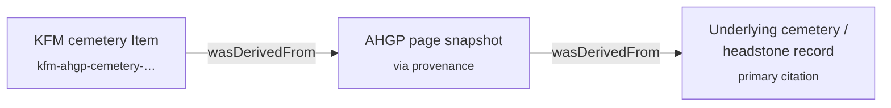

<!-- [KFM_META_BLOCK_V2]
doc_id: kfm://doc/docs-sources-catalog-ahgp-cemetery-transcriptions
title: AHGP Cemetery Transcriptions
type: product-page
version: v0.3
status: draft
owners: <PLACEHOLDER — Docs steward + Source steward for ahgp>
created: 2026-05-20
updated: 2026-05-20
policy_label: public
related:
  - docs/sources/catalog/ahgp/README.md
  - docs/sources/catalog/ahgp/IDENTITY.md
  - docs/sources/catalog/ahgp/RIGHTS-AND-SENSITIVITY-MAP.md
  - docs/sources/catalog/ahgp/NAMING.md
  - docs/sources/catalog/ahgp/OPEN-QUESTIONS.md
  - docs/sources/catalog/README.md
  - docs/doctrine/directory-rules.md
  - docs/domains/people-dna-land/README.md
tags: [kfm, docs, sources, catalog, ahgp, cemetery, people-dna-land, genealogy]
notes:
  - "v0.3 — presentation pass applied to the v0.2 product overlay (mini-TOC, badge row, Mermaid PROV diagram, collapsibles, footer)."
  - "v0.2 — product overlay applied to the SOURCE_PRODUCT_TEMPLATE scaffold."
  - "Sibling-link presence verified in the Phase 0 Claude Code session that emitted the family README and stubs."
  - "AHGP source-role and rights claims grounded in the prior AHGP family catalog session (2026-05-13); KFM-internal implementation paths remain PROPOSED or NEEDS VERIFICATION until a mounted-repo run confirms them."
  - "Not an activation document. SourceActivationDecision for SRC-AHGP remains gated on the family-level prerequisites list."
[/KFM_META_BLOCK_V2] -->

# AHGP Cemetery Transcriptions

> Volunteer-compiled cemetery inscription transcriptions, photos, and headstone records hosted by the American History and Genealogy Project (AHGP). KFM treats this product as a **compilation/aggregator** over an underlying observation (the headstone), **not** as an observed-event source.

**Status:** PROPOSED — product overlay, activation gated · **Family:** [`ahgp`](./README.md) · **Domain:** People, Genealogy, DNA, and Land Ownership · **Last reviewed:** 2026-05-20 · **Owners:** `<PLACEHOLDER — Docs steward + Source steward for ahgp>`


---

### Quick jump

[Overview](#overview) · [Source authority](#source-authority) · [Catalog profiles](#catalog-profiles-used) · [Collection identity](#collection-identity) · [Provenance fields](#provenance-fields) · [Temporal handling](#temporal-handling) · [Geometry & projection](#geometry-and-projection) · [Rights & sensitivity](#rights-and-sensitivity) · [Validation](#validation-and-catalog-closure) · [Contracts & schemas](#related-contracts-and-schemas) · [Connectors & pipelines](#related-connectors-and-pipelines) · [Examples](#examples) · [Open questions](#open-questions) · [Related docs](#related-docs)

---

## Overview

CONFIRMED (external, prior session): AHGP is an unincorporated volunteer network of independent state-and-county history/genealogy sites; cemetery transcriptions are one of its listed volunteer-content surfaces (cemetery inscriptions, photos, headstone records). State-level pages — including a Kansas project — are organized through the consolidated AHGP domain.

PROPOSED (KFM-internal): This product page captures the **per-product overlay** that the AHGP family scaffold defers to individual product pages — source role, role aggregation unit, candidate object families, geometry/temporal handling, and cemetery-specific open questions. **Activation is not in scope here**; the gate list lives in the family README under "Activation prerequisites" and in `policy/sources/ahgp/` *(PROPOSED path, NEEDS VERIFICATION)*.

INFERRED: Within the AHGP record-class taxonomy, cemetery transcriptions are the **lowest-residual-risk** surface for KFM admission because inscriptions reference deceased persons by construction. They are **not** the lowest-effort surface, because the underlying observation (the physical headstone) was not authored by AHGP and citation discipline must resolve through AHGP to the cemetery/headstone, with AHGP carried as `via` provenance.

> [!IMPORTANT]
> No `connectors/ahgp/` reader, pipeline reference, fixture, or release manifest is authorized to consume AHGP cemetery content on the basis of this product page alone. Activation runs at the family level; this page records the product-specific overlay only.

---

## Source authority

See [`data/registry/sources/ahgp/`](../../../../data/registry/sources/ahgp/) for the authoritative `SourceDescriptor`. **Do not duplicate** descriptor fields here.

**Product-specific descriptor overlay (PROPOSED, anchored in prior AHGP family work):**

| Field | PROPOSED value | Basis |
|---|---|---|
| `source_role` | `aggregate` | KFM source-role anti-collapse rule: the compiled list is an aggregate; the inscription itself is the underlying observation. |
| `role_aggregation_unit` | `cemetery` | Cemetery is the natural compilation boundary for AHGP cemetery pages. |
| `underlying_record_class` | headstone / cemetery inscription | Physical artifact, typically pre-date-of-creation public-domain by age; AHGP did not author. |
| `via_provenance_required` | `true` | AHGP page URL is **via** provenance; primary citation resolves to the cemetery/headstone record. |
| `observation_origin` | not authored by AHGP | AHGP transcribes; the observation is the headstone. |

> [!NOTE]
> All five overlay fields are PROPOSED and require sign-off against the canonical descriptor schema at `schemas/contracts/v1/source/` *(NEEDS VERIFICATION)* and ADR-0001 before they are written into a `SourceDescriptor`.

---

## Catalog profiles used

| Profile | Lane | Used by this product? | Notes |
|---|---|---|---|
| STAC | `data/catalog/stac/` | PROPOSED — Yes | Cemetery-level Item/Collection scope (NEEDS VERIFICATION — see Open questions). |
| DCAT | `data/catalog/dcat/` | PROPOSED — Yes | Dataset-level rights and distribution. |
| PROV-O | `data/catalog/prov/` | PROPOSED — Yes | `wasDerivedFrom` chain MUST carry AHGP page → underlying cemetery/headstone record. |
| Domain projection | `data/catalog/domain/people-dna-land/` | PROPOSED — Yes | Domain folder name has a known drift candidate (`people-dna-land/` per Directory Rules §6.1 vs. `people-genealogy-dna-and-land-ownership/` per encyclopedia); NEEDS VERIFICATION. |

[↑ Back to top](#ahgp-cemetery-transcriptions)

---

## Collection identity

- PROPOSED Collection id: `kfm-ahgp-cemetery-transcriptions` (see [`IDENTITY.md`](./IDENTITY.md)).
- PROPOSED namespace: `kfm:` *(see family-level OPEN-DSC-03)*.
- PROPOSED asset roles (NEEDS VERIFICATION against `schemas/contracts/v1/source/`):

| Asset role | Purpose | Notes |
|---|---|---|
| `inscription-text` | Transcribed inscription string and structured fields where parseable. | Primary textual surface. |
| `headstone-photo` | Volunteer-contributed photograph, where present. | **May carry photographer rights distinct from inscription text** — see [Rights & sensitivity](#rights-and-sensitivity). |
| `cemetery-metadata` | Cemetery name, location, county, steward notes. | Cemetery-level scope; not per-grave. |
| `ahgp-page-snapshot` | Captured AHGP page bytes + integrity digest for provenance closure. | Required for `via` PROV chain. |

> [!NOTE]
> Per-cemetery vs. per-state vs. per-county STAC Collection scope is unresolved — see [`OPEN-AHGP-CEM-01`](#open-questions).

---

## Provenance fields

STAC `properties.kfm:provenance` block (PROPOSED — Pass-10 C4-01):

- `spec_hash` — sha256 of the canonical record.
- `evidence_bundle_ref` — `kfm://evidence/<digest>`.
- `run_record_ref` — `kfm://run/<run-id>`.
- `audit_ref` — `kfm://audit/<attestation-id>`.
- `policy_digest` — sha256 of the policy bundle.

Per-asset integrity: `file:checksum`.

**Cemetery-specific PROV-O obligation (PROPOSED).** Every Item MUST express a two-link `wasDerivedFrom` chain — AHGP is `via` provenance, never the primary citation:



If the underlying cemetery/headstone record cannot be identified at promotion time, the candidate Item MUST be routed to `data/quarantine/` with reason `unresolved-underlying-record`. AI surfaces over such candidates MUST **ABSTAIN** (cite-or-abstain).

[↑ Back to top](#ahgp-cemetery-transcriptions)

---

## Temporal handling

PROPOSED — keep these times distinct where material:

| Time | Meaning for this product | Notes |
|---|---|---|
| **source time** | AHGP page retrieval timestamp | NOT equal to date of death. |
| **observed time** | Date of death from inscription, where readable | The underlying observation. Often partial (year only); record uncertainty class. |
| **valid time** | Same as observed time unless an interval is bounded otherwise | E.g., `"d. 1887"` → year-precision interval. |
| **retrieval time** | When KFM fetched the AHGP page | Bound to `RunReceipt`. |
| **release time** | When this record entered `PUBLISHED` | Per `ReleaseManifest`. |
| **correction time** | When a `CorrectionNotice` supersedes | Per correction discipline. |

> [!WARNING]
> Stale-state anti-pattern guard. A single AHGP fetch MUST NOT be treated as fresh indefinitely. Re-fetch on cadence or on user-reported correction; surface stale-state in the EvidenceDrawer. Cadence threshold lives at the family level (see [`OPEN-AHGP-CEM-06`](#open-questions)).

---

## Geometry and projection

PROPOSED handling for this product:

- **Cemetery centroid or polygon** — acceptable public geometry. Cemeteries are public places; cemetery-level location is not sensitive by KFM doctrine.
- **Per-inscription / per-grave geometry** — **NOT exposed**. Grave-level coordinates, where known, are generalized to the cemetery boundary at publication.
- **Place names in inscription prose** (e.g., `"born in Saline County"`) — **NOT geocoded to points**. Route to county or township aggregation; record uncertainty class.

  > [!CAUTION]
  > Anti-pattern: presenting a text-derived place name as an observed coordinate.

- **CRS** — `EPSG:4326` lat/lon at source/catalog level; display projection per catalog convention (NEEDS VERIFICATION — confirm against `data/catalog/` artifacts).
- **Generalization rules** — codify in `policy/sensitivity/` *(PROPOSED path, NEEDS VERIFICATION)*; do not restate here.

---

## Rights and sensitivity

NEEDS VERIFICATION — see [`policy/sensitivity/`](../../../../policy/sensitivity/) and [`RIGHTS-AND-SENSITIVITY-MAP.md`](./RIGHTS-AND-SENSITIVITY-MAP.md). **Do not restate policy here.**

**Product-specific posture (PROPOSED, summary only — canonical rules live in policy):**

| Surface | Posture | Note |
|---|---|---|
| Compilation copyright vs. underlying record | AHGP asserts site-level compilation copyright; underlying inscription typically public-domain by age. | Attribution & selective republication NEEDS VERIFICATION per record class. |
| Volunteer-contributed headstone photos | Treat headstone-photo assets as separately-rights-bound until per-photo provenance captured. | Photographer rights may be distinct from inscription text. NEEDS VERIFICATION at activation. |
| Deceased-only-by-construction | Necessary but not sufficient. Inscriptions reference deceased persons. | Kinship phrases (e.g., `"wife of John Smith"`, `"infant son of…"`) may name living kin → redaction review path required before publication. |
| Cultural sensitivity | Indigenous burial grounds, mass graves, infant/child cemeteries may require steward consultation and elevated review. | Default to quarantine when sensitivity is unclear. |

[↑ Back to top](#ahgp-cemetery-transcriptions)

---

## Validation and catalog closure

- Catalog closure required before public release (Pass-10 / KFM-P1-IDEA-0020).
- STAC Projection lint (KFM-P27-FEAT-0003) — PROPOSED.
- STAC checksum closure against the ReleaseManifest digest (KFM-P22-PROG-0037) — PROPOSED.

**Cemetery-specific gates (PROPOSED):**

- `role_aggregation_unit: cemetery` MUST propagate through `processed/` → `catalog/` → `published/` without collapse.
- Citation closure: AHGP page URL is `via`; primary citation MUST resolve to the underlying cemetery/headstone record. If unresolvable, **ABSTAIN** at AI surfaces and **quarantine** at catalog.
- Living-kin name detection MUST run before publication; matches route to a redaction review queue.
- Stale-state freshness check: records older than the cadence threshold surface a stale flag in the EvidenceDrawer.

---

## Related contracts and schemas

| Surface | Reference | Status |
|---|---|---|
| Object family — `PersonAssertion` | `contracts/` | NEEDS VERIFICATION against mounted contracts. |
| Object family — `LifeEvent` (death-event subtype) | `contracts/` | NEEDS VERIFICATION against mounted contracts. |
| Source descriptor schema home | `schemas/contracts/v1/source/` | Per ADR-0001 (schema home). |

**Candidate object-family mapping (from prior AHGP family work):**

| AHGP record class | Candidate KFM object family | Promotion-blocking condition |
|---|---|---|
| Cemetery inscription | `LifeEvent` (death) for deceased person; `PersonAssertion` | Original headstone/cemetery record cited; deceased-only; living-kin name redaction reviewed. |

> [!IMPORTANT]
> This product MUST NOT introduce new object families. Mappings above are admissions of existing People-DNA-Land families, not new contract proposals.

---

## Related connectors and pipelines

- [`connectors/ahgp/`](../../../../connectors/ahgp/) — PROPOSED. NEEDS VERIFICATION (presence not confirmed against mounted repo).
- [`pipelines/ingest/`](../../../../pipelines/ingest/) · [`normalize/`](../../../../pipelines/normalize/) · [`validate/`](../../../../pipelines/validate/) · [`catalog/`](../../../../pipelines/catalog/) — standard lifecycle phases.
- `pipeline_specs/people-dna-land/` — PROPOSED domain spec home; NEEDS VERIFICATION on exact domain folder name (drift candidate flagged in the family README).

> [!NOTE]
> Watcher-as-non-publisher invariant applies. Any AHGP watcher emits to `data/raw/` or `data/quarantine/`; promotion runs through validated pipelines and never via a watcher.

[↑ Back to top](#ahgp-cemetery-transcriptions)

---

## Examples

*(Illustrative only — do not treat as authoritative.)*

See [`_examples/stac-item-example.json`](../_examples/stac-item-example.json) for the minimal STAC + `kfm:provenance` shape used across the AHGP family.

<details>
<summary><b>Cemetery Item — illustrative STAC shape (PROPOSED, NEEDS VERIFICATION against actual schema)</b></summary>

```jsonc
{
  "id": "kfm-ahgp-cemetery-<cemetery-id>-<inscription-id>",
  "geometry": "<cemetery centroid or polygon — not per-grave>",
  "properties": {
    "kfm:role": "aggregate",
    "kfm:role_aggregation_unit": "cemetery",
    "kfm:via_source_id": "SRC-AHGP",
    "kfm:underlying_record_class": "headstone",
    "kfm:provenance": {
      "spec_hash": "sha256:<…>",
      "evidence_bundle_ref": "kfm://evidence/<digest>",
      "run_record_ref": "kfm://run/<run-id>",
      "audit_ref": "kfm://audit/<attestation-id>",
      "policy_digest": "sha256:<…>"
    }
  },
  "assets": {
    "inscription-text":   { "type": "text/plain",      "roles": ["data"] },
    "headstone-photo":    { "type": "image/jpeg",      "roles": ["thumbnail"], "kfm:rights_separate": true },
    "cemetery-metadata":  { "type": "application/json","roles": ["metadata"] },
    "ahgp-page-snapshot": { "type": "text/html",       "roles": ["provenance"] }
  }
}
```

</details>

---

## Open questions

Family-level open questions (e.g., `OPEN-DSC-03` namespace pin) are tracked in [`OPEN-QUESTIONS.md`](./OPEN-QUESTIONS.md). Cemetery-specific items below MUST NOT renumber family-level questions.

<details>
<summary><b>Cemetery-specific open questions (7)</b></summary>

| ID | Question | Blocks |
|---|---|---|
| **OPEN-AHGP-CEM-01** | STAC Collection scope: per-cemetery, per-county, per-state, or single product-wide Collection? | Asset roles, partitioning, tile output. |
| **OPEN-AHGP-CEM-02** | Photographer rights on volunteer-contributed headstone photos: per-asset rights digest or family-level rights review? | Activation; per-photo provenance. |
| **OPEN-AHGP-CEM-03** | Living-kin name detection: canonical detector, quarantine-vs-redaction threshold, receipt location? | Pre-publication gate. |
| **OPEN-AHGP-CEM-04** | Cemetery-name normalization: gazetteer crosswalk join, or AHGP-supplied names canonical at ingest? | Catalog identity stability. |
| **OPEN-AHGP-CEM-05** | Prose-derived place-name generalization rule: county centroid, township centroid, or cemetery-only? | Geometry policy; codify in `policy/sensitivity/` (PROPOSED path). |
| **OPEN-AHGP-CEM-06** | Stale-state cadence threshold for AHGP cemetery pages: weeks, months, or volunteer-correction triggered only? | Freshness check; EvidenceDrawer surfacing. |
| **OPEN-AHGP-CEM-07** | Carry-forward of `OPEN-DSC-03` (namespace `kfm:` vs `ks-kfm:`): pinned by family ADR; this product page inherits, does not decide. | Inherited. |

</details>

[↑ Back to top](#ahgp-cemetery-transcriptions)

---

## Related docs

- [`docs/sources/catalog/ahgp/README.md`](./README.md) — AHGP family README (activation prerequisites live here).
- [`docs/sources/catalog/ahgp/IDENTITY.md`](./IDENTITY.md) — Collection id patterns and namespace pins.
- [`docs/sources/catalog/ahgp/RIGHTS-AND-SENSITIVITY-MAP.md`](./RIGHTS-AND-SENSITIVITY-MAP.md) — Rights/sensitivity map (canonical).
- [`docs/sources/catalog/ahgp/NAMING.md`](./NAMING.md) — Naming conventions.
- [`docs/sources/catalog/ahgp/OPEN-QUESTIONS.md`](./OPEN-QUESTIONS.md) — Family-level open questions register.
- [`docs/sources/catalog/README.md`](../README.md) — Source catalog landing.
- [`docs/doctrine/directory-rules.md`](../../../doctrine/directory-rules.md) — Placement law.
- [`docs/domains/people-dna-land/README.md`](../../../domains/people-dna-land/README.md) — Domain README *(NEEDS VERIFICATION — exact folder name)*.

---

**Last reviewed:** 2026-05-20 *(v0.3 — presentation pass applied to the v0.2 product overlay; sibling-link presence verified in the Phase 0 Claude Code session that emitted the family README and stubs).*

[↑ Back to top](#ahgp-cemetery-transcriptions)
