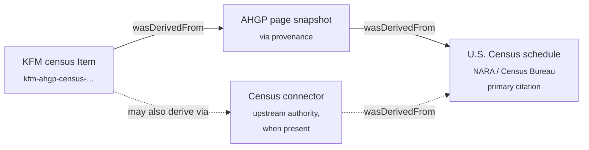

<!-- [KFM_META_BLOCK_V2]
doc_id: kfm://doc/docs-sources-catalog-ahgp-census-transcriptions
title: AHGP Census Transcriptions
type: product-page
version: v0.3
status: draft
owners: <PLACEHOLDER — Docs steward + Source steward for ahgp>
created: 2026-05-20
updated: 2026-05-20
policy_label: public
related:
  - docs/sources/catalog/ahgp/README.md
  - docs/sources/catalog/ahgp/IDENTITY.md
  - docs/sources/catalog/ahgp/RIGHTS-AND-SENSITIVITY-MAP.md
  - docs/sources/catalog/ahgp/NAMING.md
  - docs/sources/catalog/ahgp/OPEN-QUESTIONS.md
  - docs/sources/catalog/ahgp/cemetery-transcriptions.md
  - docs/sources/catalog/README.md
  - docs/doctrine/directory-rules.md
  - docs/domains/people-dna-land/README.md
tags: [kfm, docs, sources, catalog, ahgp, census, people-dna-land, genealogy, 72-year-rule]
notes:
  - "v0.3 — presentation pass applied to a product overlay specialized for census transcriptions."
  - "Sibling-link presence verified in the Phase 0 Claude Code session that emitted the family README and stubs."
  - "AHGP source-role and rights claims grounded in the prior AHGP family catalog session (2026-05-13); KFM-internal implementation paths remain PROPOSED or NEEDS VERIFICATION until a mounted-repo run confirms them."
  - "Not an activation document. SourceActivationDecision for SRC-AHGP remains gated on the family-level prerequisites list."
  - "72-year rule is treated as CONFIRMED KFM doctrine for census admission (anchor: 'Census 1790 through 72-year-rule released years; public for 72-year-rule-released years; later years restricted' — People-DNA-Land domain source-family note)."
[/KFM_META_BLOCK_V2] -->

# AHGP Census Transcriptions

> Volunteer transcriptions of U.S. Census schedules hosted by the American History and Genealogy Project (AHGP). KFM treats this product as a **convenience copy** (`via` provenance) over an underlying federal observation that is separately authoritative through `connectors/census/`.

**Status:** PROPOSED — product overlay, activation gated, 72-year rule enforced · **Family:** [`ahgp`](./README.md) · **Domain:** People, Genealogy, DNA, and Land Ownership · **Last reviewed:** 2026-05-20 · **Owners:** `<PLACEHOLDER — Docs steward + Source steward for ahgp>`


---

### Quick jump

[Overview](#overview) · [Source authority](#source-authority) · [Catalog profiles](#catalog-profiles-used) · [Collection identity](#collection-identity) · [Provenance fields](#provenance-fields) · [Temporal handling](#temporal-handling) · [Geometry & projection](#geometry-and-projection) · [Rights & sensitivity](#rights-and-sensitivity) · [Validation](#validation-and-catalog-closure) · [Contracts & schemas](#related-contracts-and-schemas) · [Connectors & pipelines](#related-connectors-and-pipelines) · [Examples](#examples) · [Open questions](#open-questions) · [Related docs](#related-docs)

---

## Overview

CONFIRMED (external, prior session): AHGP is an unincorporated volunteer network of independent state-and-county history/genealogy sites; census transcriptions are a listed AHGP content surface alongside vital records, military records, and pre-1927 books. State-level pages, including a Kansas project, organize transcribed enumerations at county and township scope.

CONFIRMED (KFM doctrine): U.S. Census schedules are publicly released on a **72-year delay**; earlier years are public domain, later years are restricted. The People-DNA-Land domain source-family note treats "Census 1790 through 72-year-rule released years" as public, and "later years restricted." AHGP transcriptions inherit this rule — **AHGP cannot promote within-window census content past it**.

PROPOSED (KFM-internal): This product page captures the **per-product overlay** that the AHGP family scaffold defers to individual product pages — source role, role aggregation unit, candidate object families, geometry/temporal handling, **72-year-rule enforcement**, and census-specific open questions. **Activation is not in scope here**; the gate list lives in the family README under "Activation prerequisites" and in `policy/sources/ahgp/` *(PROPOSED path, NEEDS VERIFICATION)*.

INFERRED: Within the AHGP record-class taxonomy, census transcriptions are a **higher-risk, lower-authority** surface than cemetery transcriptions. Risk is higher because each schedule line enumerates a whole household — including persons enumerated as children who may still be living. Authority is lower because a separately-authoritative path to the same observation exists via `connectors/census/` (against NARA-released schedules) — AHGP transcription should defer to or cross-check that connector, not compete with it.

> [!IMPORTANT]
> No `connectors/ahgp/` reader, pipeline reference, fixture, or release manifest is authorized to consume AHGP census content on the basis of this product page alone. Activation runs at the family level; this page records the product-specific overlay only. The 72-year rule applies independently of family activation.

---

## Source authority

See [`data/registry/sources/ahgp/`](../../../../data/registry/sources/ahgp/) for the authoritative `SourceDescriptor`. **Do not duplicate** descriptor fields here.

**Product-specific descriptor overlay (PROPOSED, anchored in prior AHGP family work):**

| Field | PROPOSED value | Basis |
|---|---|---|
| `source_role` | `aggregate` | KFM source-role anti-collapse rule: the AHGP transcription is an aggregate; the schedule itself is the underlying observation. |
| `role_aggregation_unit` | `enumeration district / county` | Census schedules are organized by enumeration district within county; AHGP pages typically reflect that structure. |
| `underlying_record_class` | U.S. Census schedule (population, slave, mortality, agriculture, manufactures, Indian census rolls) | Federal record; authoritative authority is U.S. Census Bureau / NARA. |
| `via_provenance_required` | `true` | AHGP page URL is **via** provenance; primary citation resolves to the underlying census schedule (NARA/Census Bureau). |
| `upstream_source_descriptor` | separate `SRC-USCENSUS-*` *(PROPOSED, NEEDS VERIFICATION against `connectors/census/`)* | When the Census connector covers the same year, it is the authoritative path; AHGP is convenience copy. |
| `release_window_rule` | `72-year-rule` (deny within-window admission) | CONFIRMED doctrine — see [Rights and sensitivity](#rights-and-sensitivity). |
| `observation_origin` | not authored by AHGP; volunteer transcription of federal record | AHGP transcribes; the observation is the schedule. |

> [!NOTE]
> All overlay fields are PROPOSED and require sign-off against the canonical descriptor schema at `schemas/contracts/v1/source/` *(NEEDS VERIFICATION)* and ADR-0001 before they are written into a `SourceDescriptor`.

---

## Catalog profiles used

| Profile | Lane | Used by this product? | Notes |
|---|---|---|---|
| STAC | `data/catalog/stac/` | PROPOSED — Yes | Per-county or per-enumeration-district Item scope (NEEDS VERIFICATION — see Open questions). |
| DCAT | `data/catalog/dcat/` | PROPOSED — Yes | Dataset-level rights and distribution; carry the 72-year-rule release line in DCAT metadata. |
| PROV-O | `data/catalog/prov/` | PROPOSED — Yes | `wasDerivedFrom` chain MUST carry AHGP page → underlying census schedule; Census-connector path noted when present. |
| Domain projection | `data/catalog/domain/people-dna-land/` | PROPOSED — Yes | Domain folder name has a known drift candidate (`people-dna-land/` per Directory Rules §6.1 vs. `people-genealogy-dna-and-land-ownership/` per encyclopedia); NEEDS VERIFICATION. |

[↑ Back to top](#ahgp-census-transcriptions)

---

## Collection identity

- PROPOSED Collection id: `kfm-ahgp-census-transcriptions` (see [`IDENTITY.md`](./IDENTITY.md)).
- PROPOSED namespace: `kfm:` *(see family-level OPEN-DSC-03)*.
- PROPOSED asset roles (NEEDS VERIFICATION against `schemas/contracts/v1/source/`):

| Asset role | Purpose | Notes |
|---|---|---|
| `schedule-transcription` | Transcribed enumeration rows (name, age, sex, household relation, place of birth, occupation, etc.). | Primary textual surface. |
| `schedule-type` | Schedule classification (population / slave / mortality / agriculture / manufactures / Indian) | Drives sensitivity routing (see [Rights & sensitivity](#rights-and-sensitivity)). |
| `enumeration-district-metadata` | ED id, county, township, enumerator name, enumeration dates. | Cemetery-style aggregation unit. |
| `soundex-miracode-index` | Soundex / Miracode index entries (where AHGP transcribes them). | Separate handling — see [`OPEN-AHGP-CEN-06`](#open-questions). |
| `ahgp-page-snapshot` | Captured AHGP page bytes + integrity digest for provenance closure. | Required for `via` PROV chain. |

> [!NOTE]
> Per-county vs. per-enumeration-district vs. per-state STAC Collection scope is unresolved — see [`OPEN-AHGP-CEN-01`](#open-questions).

---

## Provenance fields

STAC `properties.kfm:provenance` block (PROPOSED — Pass-10 C4-01):

- `spec_hash` — sha256 of the canonical record.
- `evidence_bundle_ref` — `kfm://evidence/<digest>`.
- `run_record_ref` — `kfm://run/<run-id>`.
- `audit_ref` — `kfm://audit/<attestation-id>`.
- `policy_digest` — sha256 of the policy bundle (MUST include 72-year-rule policy state).

Per-asset integrity: `file:checksum`.

**Census-specific PROV-O obligation (PROPOSED).** Every Item MUST express the AHGP-as-`via` chain. When `connectors/census/` covers the same census year, the Census-connector path MUST also be expressed; AHGP and the connector are two paths to the same primary citation, not competing observations:



If the underlying census schedule cannot be resolved (year, ED, page) at promotion time, the candidate Item MUST be routed to `data/quarantine/` with reason `unresolved-underlying-record`. AI surfaces over such candidates MUST **ABSTAIN** (cite-or-abstain).

[↑ Back to top](#ahgp-census-transcriptions)

---

## Temporal handling

PROPOSED — keep these times distinct where material:

| Time | Meaning for this product | Notes |
|---|---|---|
| **source time** | AHGP page retrieval timestamp | NOT equal to enumeration date. |
| **observed time** | Census enumeration date (e.g., `1880-06-01`, `1900-06-01`, `1950-04-01`) | Point-in-time household observation. Use the official census-day date; transcriber-reported enumeration ranges go into `enumeration-district-metadata`. |
| **valid time** | Household composition as of enumeration date | The schedule is a point-in-time snapshot; do not extrapolate residence beyond the enumeration window. |
| **retrieval time** | When KFM fetched the AHGP page | Bound to `RunReceipt`. |
| **release time (NARA)** | Public-release date under the 72-year rule | E.g., 1950 census released 2022. **Records whose NARA release date has not yet passed MUST NOT be admitted.** |
| **release time (KFM)** | When this record entered `PUBLISHED` | Per `ReleaseManifest`. |
| **correction time** | When a `CorrectionNotice` supersedes | Per correction discipline. |

> [!WARNING]
> Stale-state anti-pattern guard. A single AHGP fetch MUST NOT be treated as fresh indefinitely — volunteer-corrected typos and new transcribed ED pages appear over time. Re-fetch on cadence or on user-reported correction; surface stale-state in the EvidenceDrawer.

---

## Geometry and projection

PROPOSED handling for this product:

- **Enumeration district / township / county polygons** — acceptable public geometry, when joinable against the Settlements/Infrastructure domain's Census/TIGER geography lane.
- **Per-household / per-line geometry** — **NOT exposed**. Household street addresses on later schedules (e.g., 1900+) are generalized to enumeration district or township at publication.
- **Place-of-birth strings** (e.g., `"b. Ohio"`, `"b. Germany"`) — **NOT geocoded to points**. Carry as administrative-name strings; route to state/country aggregation only.

  > [!CAUTION]
  > Anti-pattern: geocoding `"Smith Township, Saline County"` or a household street address to a precise point. ED-level generalization is the maximum precision for census-derived person placement.

- **CRS** — `EPSG:4326` lat/lon at source/catalog level; display projection per catalog convention (NEEDS VERIFICATION — confirm against `data/catalog/` artifacts).
- **Generalization rules** — codify in `policy/sensitivity/` *(PROPOSED path, NEEDS VERIFICATION)*; do not restate here.

[↑ Back to top](#ahgp-census-transcriptions)

---

## Rights and sensitivity

NEEDS VERIFICATION — see [`policy/sensitivity/`](../../../../policy/sensitivity/) and [`RIGHTS-AND-SENSITIVITY-MAP.md`](./RIGHTS-AND-SENSITIVITY-MAP.md). **Do not restate policy here.**

> [!WARNING]
> **72-year rule (CONFIRMED KFM doctrine).** U.S. Census schedules are publicly released by NARA on a 72-year delay. AHGP transcriptions of within-window census years (i.e., NARA release date has not yet passed) **MUST be denied at admission** regardless of how the volunteer obtained or transcribed them. This gate sits **above** family activation and **above** rights review.

**Product-specific posture (PROPOSED, summary only — canonical rules live in policy):**

| Surface | Posture | Note |
|---|---|---|
| 72-year-rule admission gate | DENY on within-window census years. | CONFIRMED KFM doctrine. Independent of AHGP rights review. |
| Compilation copyright vs. underlying federal record | Underlying federal schedule is public-domain (federal work); AHGP-asserted site-level compilation copyright applies to the volunteer transcription/prose layer. | Attribution and selective republication NEEDS VERIFICATION per record class. |
| Living-person exposure | Even within released years, persons enumerated as children may still be living. | Kinship/household redaction review MUST run before publication. Living-person joins DENY at the trust membrane. |
| Slave schedules (1850, 1860) | Elevated review. Sensitive content; descendant-community considerations. | NEEDS VERIFICATION — see [`OPEN-AHGP-CEN-03`](#open-questions). |
| Indian census rolls | Elevated review. Tribal sovereignty and CARE applicability. | NEEDS VERIFICATION — tribal consultation requirement; see [`OPEN-AHGP-CEN-04`](#open-questions). |
| Mortality schedules | Cross with vital-record privacy windows. | Joins LifeEvent (death-event subtype); see [`OPEN-AHGP-CEN-05`](#open-questions). |
| Transcription-error risk | Materially higher than cemetery (handwritten enumerator forms; volunteer interpretation). | Drives the AHGP-vs-Census-connector cross-check gate; see [`OPEN-AHGP-CEN-07`](#open-questions). |

[↑ Back to top](#ahgp-census-transcriptions)

---

## Validation and catalog closure

- Catalog closure required before public release (Pass-10 / KFM-P1-IDEA-0020).
- STAC Projection lint (KFM-P27-FEAT-0003) — PROPOSED.
- STAC checksum closure against the ReleaseManifest digest (KFM-P22-PROG-0037) — PROPOSED.

**Census-specific gates (PROPOSED):**

- **72-year-rule gate** MUST run first at admission. Within-window records DENY; route to `data/quarantine/` with reason `seventy-two-year-rule`.
- `role_aggregation_unit: enumeration district / county` MUST propagate through `processed/` → `catalog/` → `published/` without collapse.
- **Citation closure**: AHGP page URL is `via`; primary citation MUST resolve to the underlying census schedule (year + schedule type + ED + page). If unresolvable, **ABSTAIN** at AI surfaces and **quarantine** at catalog.
- **Living-person redaction review** MUST run before publication on any record whose enumerated persons could still be living (PROPOSED birth-year heuristic: enumerated age such that current age ≤ 110 ⇒ review required). NEEDS VERIFICATION on threshold.
- **Negative-evidence penalty** (KFM-P17-PROG-0015): contradictory enumerations in a different county across consecutive censuses subtract identity-resolution confidence. The transcription itself must still be admitted as the observation; only downstream identity inference takes the penalty.
- **AHGP vs Census-connector cross-check** (PROPOSED): where `connectors/census/` covers the same year/ED, the two transcriptions MUST be diffed; mismatches above a threshold route to quarantine. Threshold NEEDS VERIFICATION — see [`OPEN-AHGP-CEN-07`](#open-questions).

---

## Related contracts and schemas

| Surface | Reference | Status |
|---|---|---|
| Object family — `PersonAssertion` | `contracts/` | NEEDS VERIFICATION against mounted contracts. |
| Object family — `ResidenceEvent` (`Residence Event`) | `contracts/` | NEEDS VERIFICATION; family name conflict (`Residence Event` vs `ResidenceEvent`) flagged for the encyclopedia/Directory Rules drift register. |
| Cross-domain — Census/TIGER geography | Settlements/Infrastructure domain | This product **references**, does not own. |
| Source descriptor schema home | `schemas/contracts/v1/source/` | Per ADR-0001 (schema home). |

**Candidate object-family mapping (from prior AHGP family work):**

| AHGP record class | Candidate KFM object family | Promotion-blocking condition |
|---|---|---|
| Census transcription | `PersonAssertion`; `ResidenceEvent` | U.S. Census source descriptor authoritative; AHGP as `via` provenance; 72-year rule passed; living-person redaction reviewed. |
| Mortality schedule line | `PersonAssertion`; `LifeEvent` (death) | Joins death-event subtype; vital-record privacy window applies. |
| Slave schedule line | `PersonAssertion` (constrained) | Elevated review; descendant-community consultation per policy. |
| Indian census roll line | `PersonAssertion` (constrained) | Tribal consultation; CARE applicability. |

> [!IMPORTANT]
> This product MUST NOT introduce new object families. Mappings above are admissions of existing People-DNA-Land families, not new contract proposals.

[↑ Back to top](#ahgp-census-transcriptions)

---

## Related connectors and pipelines

- [`connectors/ahgp/`](../../../../connectors/ahgp/) — PROPOSED. NEEDS VERIFICATION (presence not confirmed against mounted repo).
- [`connectors/census/`](../../../../connectors/census/) — PROPOSED in the repository structure guiding document; **this is the authoritative upstream path** when it covers the relevant census year. AHGP transcription defers to or cross-checks against it.
- [`pipelines/ingest/`](../../../../pipelines/ingest/) · [`normalize/`](../../../../pipelines/normalize/) · [`validate/`](../../../../pipelines/validate/) · [`catalog/`](../../../../pipelines/catalog/) — standard lifecycle phases.
- [`pipeline_specs/people-dna-land/`](../../../../pipeline_specs/people-dna-land/) — PROPOSED domain spec home (the repository structure guiding document lists this folder); NEEDS VERIFICATION on exact domain folder name (drift candidate flagged in the family README).

> [!NOTE]
> Watcher-as-non-publisher invariant applies. Any AHGP watcher emits to `data/raw/` or `data/quarantine/`; promotion runs through validated pipelines and never via a watcher. The 72-year-rule gate runs inside `pipelines/validate/`, not at the connector layer.

---

## Examples

*(Illustrative only — do not treat as authoritative.)*

See [`_examples/stac-item-example.json`](../_examples/stac-item-example.json) for the minimal STAC + `kfm:provenance` shape used across the AHGP family.

<details>
<summary><b>Census Item — illustrative STAC shape (PROPOSED, NEEDS VERIFICATION against actual schema)</b></summary>

```jsonc
{
  "id": "kfm-ahgp-census-<year>-<state>-<county>-<ed>-<page>",
  "geometry": "<enumeration district or township polygon — not per-household>",
  "properties": {
    "kfm:role": "aggregate",
    "kfm:role_aggregation_unit": "enumeration district / county",
    "kfm:via_source_id": "SRC-AHGP",
    "kfm:upstream_source_id": "SRC-USCENSUS-<year>",     // when connectors/census/ covers the year
    "kfm:underlying_record_class": "us-census-schedule",
    "kfm:schedule_type": "population | slave | mortality | agriculture | manufactures | indian",
    "kfm:census_year": 1880,
    "kfm:enumeration_date": "1880-06-01",
    "kfm:nara_release_date": "1952-04-01",
    "kfm:seventy_two_year_rule_passed": true,
    "kfm:provenance": {
      "spec_hash": "sha256:<…>",
      "evidence_bundle_ref": "kfm://evidence/<digest>",
      "run_record_ref": "kfm://run/<run-id>",
      "audit_ref": "kfm://audit/<attestation-id>",
      "policy_digest": "sha256:<…>"
    }
  },
  "assets": {
    "schedule-transcription":          { "type": "text/plain",       "roles": ["data"] },
    "schedule-type":                   { "type": "application/json", "roles": ["metadata"] },
    "enumeration-district-metadata":   { "type": "application/json", "roles": ["metadata"] },
    "soundex-miracode-index":          { "type": "application/json", "roles": ["index"] },
    "ahgp-page-snapshot":              { "type": "text/html",        "roles": ["provenance"] }
  }
}
```

</details>

---

## Open questions

Family-level open questions (e.g., `OPEN-DSC-03` namespace pin) are tracked in [`OPEN-QUESTIONS.md`](./OPEN-QUESTIONS.md). Census-specific items below MUST NOT renumber family-level questions.

<details>
<summary><b>Census-specific open questions (8)</b></summary>

| ID | Question | Blocks |
|---|---|---|
| **OPEN-AHGP-CEN-01** | STAC Collection scope: per-county, per-enumeration-district, per-state, or single product-wide Collection? | Asset roles, partitioning, tile output. |
| **OPEN-AHGP-CEN-02** | When `connectors/census/` covers the same census year, what is AHGP's residual role: deprecated, transcription-error detector, or sparse-coverage gap-fill? | Cross-source authority; deduplication strategy. |
| **OPEN-AHGP-CEN-03** | Slave schedules (1850, 1860): elevated-review workflow, descendant-community consultation, attribution requirements? | Sensitivity policy; admission gate. |
| **OPEN-AHGP-CEN-04** | Indian census rolls: tribal consultation requirement, CARE applicability, sovereignty considerations? | Sensitivity policy; admission gate. |
| **OPEN-AHGP-CEN-05** | Mortality schedules: cross-domain handling — joins `LifeEvent` death-event subtype but originates as census enumeration. Which domain validates? | Object-family routing. |
| **OPEN-AHGP-CEN-06** | Soundex / Miracode indexes: separate asset role and Item, or carried as an index sub-asset of the schedule transcription? | Asset roles; identity-resolution surface. |
| **OPEN-AHGP-CEN-07** | AHGP-vs-Census-connector cross-check threshold for transcription-error quarantine routing: what diff rate triggers route-to-quarantine? | Validation gate; QA pipeline. |
| **OPEN-AHGP-CEN-08** | Living-person redaction birth-year heuristic threshold (`enumerated_age` such that current age ≤ N implies review). Default N = 110, NEEDS VERIFICATION. | Pre-publication gate. |

</details>

[↑ Back to top](#ahgp-census-transcriptions)

---

## Related docs

- [`docs/sources/catalog/ahgp/README.md`](./README.md) — AHGP family README (activation prerequisites live here).
- [`docs/sources/catalog/ahgp/IDENTITY.md`](./IDENTITY.md) — Collection id patterns and namespace pins.
- [`docs/sources/catalog/ahgp/RIGHTS-AND-SENSITIVITY-MAP.md`](./RIGHTS-AND-SENSITIVITY-MAP.md) — Rights/sensitivity map (canonical).
- [`docs/sources/catalog/ahgp/NAMING.md`](./NAMING.md) — Naming conventions.
- [`docs/sources/catalog/ahgp/OPEN-QUESTIONS.md`](./OPEN-QUESTIONS.md) — Family-level open questions register.
- [`docs/sources/catalog/ahgp/cemetery-transcriptions.md`](./cemetery-transcriptions.md) — Sibling product page (cemetery surface).
- [`docs/sources/catalog/README.md`](../README.md) — Source catalog landing.
- [`docs/doctrine/directory-rules.md`](../../../doctrine/directory-rules.md) — Placement law.
- [`docs/domains/people-dna-land/README.md`](../../../domains/people-dna-land/README.md) — Domain README *(NEEDS VERIFICATION — exact folder name)*.

---

**Last reviewed:** 2026-05-20 *(v0.3 — presentation pass applied to a product overlay specialized for census transcriptions; sibling-link presence verified in the Phase 0 Claude Code session that emitted the family README and stubs).*

[↑ Back to top](#ahgp-census-transcriptions)
