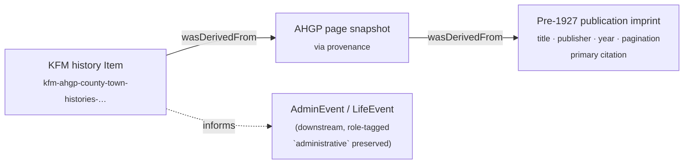
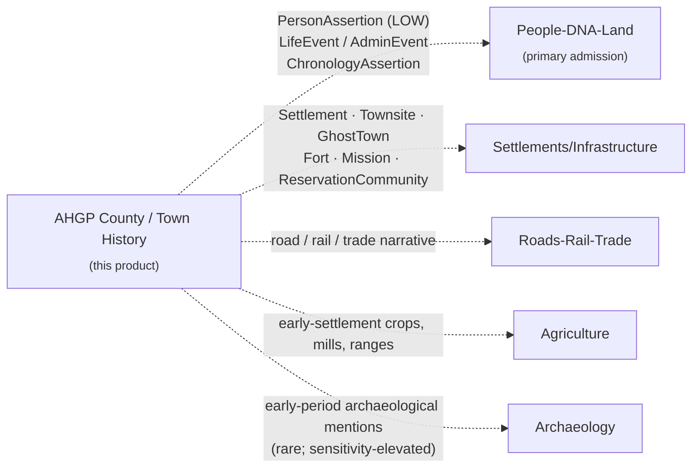

<!-- [KFM_META_BLOCK_V2]
doc_id: kfm://doc/docs-sources-catalog-ahgp-county-town-histories
title: AHGP County and Town Histories
type: product-page
version: v0.3
status: draft
owners: <PLACEHOLDER — Docs steward + Source steward for ahgp>
created: 2026-05-20
updated: 2026-05-20
policy_label: public
related:
  - docs/sources/catalog/ahgp/README.md
  - docs/sources/catalog/ahgp/IDENTITY.md
  - docs/sources/catalog/ahgp/RIGHTS-AND-SENSITIVITY-MAP.md
  - docs/sources/catalog/ahgp/NAMING.md
  - docs/sources/catalog/ahgp/OPEN-QUESTIONS.md
  - docs/sources/catalog/ahgp/cemetery-transcriptions.md
  - docs/sources/catalog/ahgp/census-transcriptions.md
  - docs/sources/catalog/README.md
  - docs/doctrine/directory-rules.md
  - docs/domains/people-dna-land/README.md
  - docs/domains/settlements-infrastructure/README.md
tags: [kfm, docs, sources, catalog, ahgp, county-history, town-history, people-dna-land, settlements-infrastructure, anti-collapse]
notes:
  - "v0.3 — presentation pass applied to a product overlay specialized for county and town histories."
  - "Sibling-link presence verified in the Phase 0 Claude Code session that emitted the family README and stubs."
  - "AHGP source-role and rights claims grounded in the prior AHGP family catalog session (2026-05-13); KFM-internal implementation paths remain PROPOSED or NEEDS VERIFICATION until a mounted-repo run confirms them."
  - "Not an activation document. SourceActivationDecision for SRC-AHGP remains gated on the family-level prerequisites list."
  - "Anti-collapse posture is CONFIRMED KFM doctrine: §24.1.2 Master Source-Role Anti-Collapse Register lists 'Administrative compilation cited as observation' as a DENY-publication failure mode in the People/Land, Settlements, and Roads domains."
  - "Source-role enum fit (`administrative`) is PROPOSED — see OPEN-AHGP-CTH-02 (private 19th-century publishers vs. agency-produced records, pending ADR-S-04)."
[/KFM_META_BLOCK_V2] -->

# AHGP County and Town Histories

> Volunteer transcriptions of pre-1927 county and town history compilations hosted by the American History and Genealogy Project (AHGP). KFM treats this product as an **administrative-context** surface — biographical sketches, town narratives, and chronologies are cited as context, **never as observed event timelines**.

**Status:** PROPOSED — product overlay, activation gated, administrative-context only · **Family:** [`ahgp`](./README.md) · **Domain:** People, Genealogy, DNA, and Land Ownership *(with Settlements/Infrastructure cross-domain references)* · **Last reviewed:** 2026-05-20 · **Owners:** `<PLACEHOLDER — Docs steward + Source steward for ahgp>`


-red)


---

### Quick jump

[Overview](#overview) · [Source authority](#source-authority) · [Catalog profiles](#catalog-profiles-used) · [Collection identity](#collection-identity) · [Provenance fields](#provenance-fields) · [Temporal handling](#temporal-handling) · [Geometry & projection](#geometry-and-projection) · [Rights & sensitivity](#rights-and-sensitivity) · [Validation](#validation-and-catalog-closure) · [Contracts & schemas](#related-contracts-and-schemas) · [Cross-domain routing](#cross-domain-routing) · [Connectors & pipelines](#related-connectors-and-pipelines) · [Examples](#examples) · [Open questions](#open-questions) · [Related docs](#related-docs)

---

## Overview

CONFIRMED (external, prior session): Pre-1927 transcribed county and town histories are an enumerated AHGP volunteer-content surface, alongside books, censuses, military records, cemetery transcriptions, newspapers, gazetteers, and maps. They are typically third-party publications by 19th-century commercial publishers, often subscription-funded ("mug books").

CONFIRMED (KFM doctrine, §24.1 Master Source-Role Anti-Collapse Register): The `administrative` source role is for *compiled records produced for administration, registration, or accounting* — explicitly distinct from `observed` evidence. §24.1.2 names **"Administrative compilation cited as observation"** as a DENY-publication failure mode in the People/Land, Settlements, and Roads domains; the required guardrail is *"Source-role tag preserved; named LifeEvent / AdminEvent types."*

PROPOSED (KFM-internal): This product page captures the **per-product overlay** that the AHGP family scaffold defers to individual product pages — source role, role authority, cross-domain routing, candidate object families, geometry/temporal handling, low-confidence PersonAssertion treatment, mug-book editorial-bias mitigations, and county-history-specific open questions. **Activation is not in scope here**; the gate list lives in the family README under "Activation prerequisites" and in `policy/sources/ahgp/` *(PROPOSED path, NEEDS VERIFICATION)*.

INFERRED: Within the AHGP record-class taxonomy, county and town histories are the **lowest-confidence, broadest-touching** surface. Confidence is low because:

1. **Editorial bias** — 19th-century county histories were commonly subscription publications; inclusion was often paid-for, skewing coverage toward landowners and "prominent citizens."
2. **Authorship distance** — compilers usually never met their subjects; biographical sketches were drafted from family-submitted forms and recollection.
3. **Not an observation** — these are *narrative compilations of prior reports*, not first-hand evidentiary records.

> [!CAUTION]
> Anti-collapse hot wire (CONFIRMED §24.1.2). A pre-1927 county or town history MUST NEVER be admitted, promoted, or surfaced as if it were an observed event timeline. The `administrative` tag MUST be preserved end-to-end. Use named `LifeEvent` / `AdminEvent` types so the downstream consumer can distinguish "the history says X happened in 1873" from "X happened in 1873."

---

## Source authority

See [`data/registry/sources/ahgp/`](../../../../data/registry/sources/ahgp/) for the authoritative `SourceDescriptor`. **Do not duplicate** descriptor fields here.

**Product-specific descriptor overlay (PROPOSED, anchored in §24.1.1–§24.1.3 doctrine and prior AHGP family work):**

| Field | PROPOSED value | Basis |
|---|---|---|
| `source_role` | `administrative` | §24.1.1 (CONFIRMED doctrine) — compiled record, not an observation. Canonical-fit caveat: §24.1.1 examples are agency-produced; this product applies the same enum to private 19th-century publishers — see [`OPEN-AHGP-CTH-02`](#open-questions) and ADR-S-04 backlog. |
| `role_authority` | original publication imprint *(publisher · compiler · place · year)* | §24.1.3 — `role_authority` is REQUIRED for `aggregate` and recommended for `administrative` to disambiguate downstream cite text. AHGP is `via`; the imprint is primary authority. |
| `underlying_record_class` | pre-1927 printed county/town history compilation | Physical artifact; not authored by AHGP. |
| `via_provenance_required` | `true` | AHGP page URL is **via** provenance; primary citation resolves to the original imprint (book title, publisher, year, pagination). |
| `observation_origin` | not authored by AHGP and not an observation per §24.1.1 | Editorial narrative, not first-hand reading. |
| `evidence_weight_floor` | LOW (context) | Editorial / mug-book bias and authorship distance — see [Rights & sensitivity](#rights-and-sensitivity). |

> [!NOTE]
> All overlay fields are PROPOSED and require sign-off against the canonical descriptor schema at `schemas/contracts/v1/source/` *(NEEDS VERIFICATION)* and ADR-0001 before they are written into a `SourceDescriptor`. Source-role enum fit (`administrative` for private publishers) is tracked under ADR-S-04 (source-role vocabulary v1).

[↑ Back to top](#ahgp-county-and-town-histories)

---

## Catalog profiles used

| Profile | Lane | Used by this product? | Notes |
|---|---|---|---|
| STAC | `data/catalog/stac/` | PROPOSED — Yes | Per-publication or per-county Item scope (NEEDS VERIFICATION — see Open questions). |
| DCAT | `data/catalog/dcat/` | PROPOSED — Yes | Dataset-level rights and distribution; carry per-imprint public-domain confirmation. |
| PROV-O | `data/catalog/prov/` | PROPOSED — Yes | `wasDerivedFrom` chain MUST carry AHGP page → original publication imprint. |
| Domain projection — primary | `data/catalog/domain/people-dna-land/` | PROPOSED — Yes | PersonAssertion / chronology candidates from biographical sketches. Domain folder drift candidate (NEEDS VERIFICATION). |
| Domain projection — cross-references | `data/catalog/domain/settlements-infrastructure/`, `data/catalog/domain/roads-rail-trade/`, `data/catalog/domain/agriculture/`, `data/catalog/domain/archaeology/` | PROPOSED — see [Cross-domain routing](#cross-domain-routing) | Town/county histories narrate settlements, infrastructure, transport, agriculture, and (occasionally) archaeology. References, not duplicates. |

---

## Collection identity

- PROPOSED Collection id: `kfm-ahgp-county-town-histories` (see [`IDENTITY.md`](./IDENTITY.md)).
- PROPOSED namespace: `kfm:` *(see family-level OPEN-DSC-03)*.
- PROPOSED asset roles (NEEDS VERIFICATION against `schemas/contracts/v1/source/`):

| Asset role | Purpose | Notes |
|---|---|---|
| `narrative-transcription` | Transcribed prose chapters, biographical sketches, township narratives. | Primary textual surface. |
| `publication-imprint-metadata` | Title, compiler, publisher, place, year, pagination. | Primary citation anchor. |
| `biographical-sketch-index` | Per-person entries extracted from biographical sections, with confidence floor. | Drives `PersonAssertion` candidates (LOW). |
| `chronology-extract` | Date-and-event pairs extracted from prose. | Drives `ChronologyAssertion` *(PROPOSED — see [`OPEN-AHGP-CTH-08`](#open-questions))*. |
| `cross-domain-reference` | Settlements, infrastructure, transport, agriculture, archaeology mentions. | Reference handles only; cross-domain objects live in their owning domains. |
| `ahgp-page-snapshot` | Captured AHGP page bytes + integrity digest for provenance closure. | Required for `via` PROV chain. |

> [!NOTE]
> Per-publication vs. per-county vs. per-state STAC Collection scope is unresolved — see [`OPEN-AHGP-CTH-01`](#open-questions).

---

## Provenance fields

STAC `properties.kfm:provenance` block (PROPOSED — Pass-10 C4-01):

- `spec_hash` — sha256 of the canonical record.
- `evidence_bundle_ref` — `kfm://evidence/<digest>`.
- `run_record_ref` — `kfm://run/<run-id>`.
- `audit_ref` — `kfm://audit/<attestation-id>`.
- `policy_digest` — sha256 of the policy bundle.

Per-asset integrity: `file:checksum`.

**County/town-history-specific PROV-O obligation (PROPOSED).** Every Item MUST express a two-link `wasDerivedFrom` chain. The primary citation is the **original publication imprint**, not the AHGP page:



If the original publication imprint cannot be identified (title, publisher, year, pagination) at promotion time, the candidate Item MUST be routed to `data/quarantine/` with reason `unresolved-underlying-record`. AI surfaces over such candidates MUST **ABSTAIN** (cite-or-abstain). Downstream `LifeEvent` / `AdminEvent` records derived from this product MUST retain the `administrative` source-role tag (§24.1.2 guardrail).

[↑ Back to top](#ahgp-county-and-town-histories)

---

## Temporal handling

PROPOSED — keep these times distinct where material:

| Time | Meaning for this product | Notes |
|---|---|---|
| **source time** | AHGP page retrieval timestamp | NOT equal to publication date. |
| **publication date** | Imprint year of the underlying book (e.g., `1883`) | Anchors the "what was known when the history was written" frame. Not an observed event date. |
| **narrated period** | Historical span the publication describes (often `1850s–1880s`) | Span, not point. Used for the chronology fabric only — never as observed time. |
| **observed time** | **NOT APPLICABLE** for this product | This is an `administrative` role. Per §24.1.1 it does not produce observations. |
| **valid time** | **NOT APPLICABLE** as event-validity | Validity applies to the publication, not to narrated events. |
| **retrieval time** | When KFM fetched the AHGP page | Bound to `RunReceipt`. |
| **release time** | When this record entered `PUBLISHED` | Per `ReleaseManifest`. |
| **correction time** | When a `CorrectionNotice` supersedes | Per correction discipline. |

> [!WARNING]
> Stale-state anti-pattern guard. Volunteer transcribers continue to correct OCR errors and add missing pages over time. Re-fetch on cadence or on user-reported correction; surface stale-state in the EvidenceDrawer. Cadence threshold lives at the family level — see [`OPEN-AHGP-CTH-06`](#open-questions).

---

## Geometry and projection

PROPOSED handling for this product:

- **County and township polygons** — acceptable public geometry when joined against the Settlements/Infrastructure domain's Census/TIGER or PLSS lanes; this product **references**, does not own.
- **Town and townsite footprints** — acceptable as `Townsite` / `GhostTown` cross-references, owned by Settlements/Infrastructure, not by this product.
- **Per-farm / per-business / per-school geometry mentioned in prose** — **NOT geocoded to points**. Generalize to township or county; record uncertainty class.

  > [!CAUTION]
  > Anti-pattern: geocoding `"the Smith farm, two miles west of Hutchinson"` or `"the Liberty School on Section 14"` to a precise coordinate. Township is the maximum precision when the source is narrative prose.

- **CRS** — `EPSG:4326` lat/lon at source/catalog level; display projection per catalog convention (NEEDS VERIFICATION — confirm against `data/catalog/` artifacts).
- **Generalization rules** — codify in `policy/sensitivity/` *(PROPOSED path, NEEDS VERIFICATION)*; do not restate here.

[↑ Back to top](#ahgp-county-and-town-histories)

---

## Rights and sensitivity

NEEDS VERIFICATION — see [`policy/sensitivity/`](../../../../policy/sensitivity/) and [`RIGHTS-AND-SENSITIVITY-MAP.md`](./RIGHTS-AND-SENSITIVITY-MAP.md). **Do not restate policy here.**

**Product-specific posture (PROPOSED, summary only — canonical rules live in policy):**

| Surface | Posture | Note |
|---|---|---|
| Pre-1927 underlying publication | PROPOSED: public-domain by age (current U.S. rule places pre-1929 published works in PD as of 2025). | NEEDS VERIFICATION per imprint — works renewed, foreign-origin works, or unpublished manuscripts MAY have residual rights. See [`OPEN-AHGP-CTH-07`](#open-questions). |
| AHGP compilation copyright | Applies to the AHGP transcription/prose layer (typography, OCR cleanup, layout), not to the underlying public-domain text. | Attribution and selective republication NEEDS VERIFICATION per record class. |
| Editorial / "mug book" bias | Subscription/payment for inclusion was common in 19th-century county histories. Coverage skews toward landowners, "prominent citizens." | Confidence floor LOW. Bias acknowledgment MUST appear in EvidenceDrawer when a sketch is surfaced. See [`OPEN-AHGP-CTH-03`](#open-questions). |
| Living-person exposure | Minimal — subjects are typically born in the 19th century. Descendants may be living. | Standard kinship-phrase redaction review applies; deceased-only-by-construction is **not** a guarantee here. |
| Indigenous / contested historical narrative | Pre-1927 county histories often contain settler-colonial language, slurs, or one-sided accounts of Indigenous displacement, land cession, and frontier conflict. | Elevated review. CARE applicability NEEDS VERIFICATION. See [`OPEN-AHGP-CTH-10`](#open-questions). |
| Defamatory / disparaging passages | 19th-century histories occasionally contain libelous prose about then-living individuals. | Living-descendant complaint path must be honored via `CorrectionNotice`; do not republish verbatim defamation without context. |

[↑ Back to top](#ahgp-county-and-town-histories)

---

## Validation and catalog closure

- Catalog closure required before public release (Pass-10 / KFM-P1-IDEA-0020).
- STAC Projection lint (KFM-P27-FEAT-0003) — PROPOSED.
- STAC checksum closure against the ReleaseManifest digest (KFM-P22-PROG-0037) — PROPOSED.

**County/town-history-specific gates (PROPOSED):**

- **Anti-collapse gate (CONFIRMED §24.1.2 guardrail)** — the `administrative` source-role tag MUST propagate through `processed/` → `catalog/` → `published/` without collapse into `observed`. Any `LifeEvent` or `AdminEvent` derived from this product MUST retain the tag and a `via` link back to the imprint.
- **Citation closure**: AHGP page URL is `via`; primary citation MUST resolve to the original imprint (title, publisher, year, pagination). If unresolvable, **ABSTAIN** at AI surfaces and **quarantine** at catalog.
- **PersonAssertion confidence floor**: assertions from biographical sketches admitted at LOW confidence by default. Threshold floor NEEDS VERIFICATION — see [`OPEN-AHGP-CTH-05`](#open-questions).
- **Editorial-bias acknowledgment**: where the underlying imprint is a known subscription-funded publication, the EvidenceDrawer MUST surface a "mug-book bias" badge before display.
- **Cross-domain routing gate**: town/county-history mentions that name settlements, infrastructure, transport, agriculture, or archaeology MUST be emitted as **references**, not duplicates. The owning domain validates the cross-reference.
- **Living-descendant complaint path**: defamatory passages flagged by a descendant route through `CorrectionNotice` with a redaction/context option.

---

## Related contracts and schemas

| Surface | Reference | Status |
|---|---|---|
| Object family — `PersonAssertion` (LOW confidence) | `contracts/` | NEEDS VERIFICATION against mounted contracts. |
| Object family — `LifeEvent` / `AdminEvent` (role-tagged `administrative`) | `contracts/` | NEEDS VERIFICATION. §24.1.2 names these as the guardrail target types. |
| Object family — `ChronologyAssertion` | `contracts/` | PROPOSED — used by the prior AHGP family work; not directly traced to canonical doctrine. See [`OPEN-AHGP-CTH-08`](#open-questions). |
| Cross-domain — `Townsite`, `GhostTown`, `Settlement`, `Fort`, `Mission` | Settlements/Infrastructure domain | This product **references**, does not own. |
| Cross-domain — `InfrastructureAsset`, road segments, rail lines | Settlements/Infrastructure, Roads/Rail/Trade | Reference handles only. |
| Source descriptor schema home | `schemas/contracts/v1/source/` | Per ADR-0001 (schema home). |

**Candidate object-family mapping (from prior AHGP family work):**

| AHGP record class | Candidate KFM object family | Promotion-blocking condition |
|---|---|---|
| County / town history excerpt | `PersonAssertion` (LOW confidence); `ChronologyAssertion` *(PROPOSED)* | Treated as administrative compilation, not observation; original publication imprint cited; mug-book bias acknowledged. |

> [!IMPORTANT]
> This product MUST NOT introduce new object families. Mappings above are admissions of existing families (or canonically PROPOSED ones), not new contract proposals.

[↑ Back to top](#ahgp-county-and-town-histories)

---

## Cross-domain routing

Town and county histories are unusual within AHGP because their narrative content **touches more than one KFM domain**. The product page records the routing posture; the actual cross-domain objects live in their owning domains.



> [!IMPORTANT]
> The history is **never** the primary record for a settlement, an infrastructure asset, a transport route, an agricultural feature, or an archaeological site. It is a context reference. Cross-domain objects are owned and validated in their domains; this product emits reference handles only.

---

## Related connectors and pipelines

- [`connectors/ahgp/`](../../../../connectors/ahgp/) — PROPOSED. NEEDS VERIFICATION (presence not confirmed against mounted repo).
- [`pipelines/ingest/`](../../../../pipelines/ingest/) · [`normalize/`](../../../../pipelines/normalize/) · [`validate/`](../../../../pipelines/validate/) · [`catalog/`](../../../../pipelines/catalog/) — standard lifecycle phases.
- [`pipeline_specs/people-dna-land/`](../../../../pipeline_specs/people-dna-land/) — PROPOSED primary domain spec home; NEEDS VERIFICATION on exact domain folder name (drift candidate flagged in the family README).
- Cross-domain spec homes (`pipeline_specs/settlements-infrastructure/`, `pipeline_specs/roads-rail-trade/`, `pipeline_specs/agriculture/`, `pipeline_specs/archaeology/`) — referenced for cross-domain emission only; this product does not write into them.

> [!NOTE]
> Watcher-as-non-publisher invariant applies. Any AHGP watcher emits to `data/raw/` or `data/quarantine/`; promotion runs through validated pipelines and never via a watcher. The anti-collapse gate runs inside `pipelines/validate/`.

[↑ Back to top](#ahgp-county-and-town-histories)

---

## Examples

*(Illustrative only — do not treat as authoritative.)*

See [`_examples/stac-item-example.json`](../_examples/stac-item-example.json) for the minimal STAC + `kfm:provenance` shape used across the AHGP family.

<details>
<summary><b>County/Town History Item — illustrative STAC shape (PROPOSED, NEEDS VERIFICATION against actual schema)</b></summary>

```jsonc
{
  "id": "kfm-ahgp-county-town-histories-<imprint-id>-<chapter>-<entry>",
  "geometry": "<county or township polygon — not per-farm/per-business>",
  "properties": {
    "kfm:role": "administrative",
    "kfm:role_authority": "Andreas, A. T. · History of the State of Kansas · Chicago · 1883",
    "kfm:via_source_id": "SRC-AHGP",
    "kfm:underlying_record_class": "pre-1927-county-town-history",
    "kfm:publication_date": "1883",
    "kfm:narrated_period_start": "1854",
    "kfm:narrated_period_end": "1883",
    "kfm:evidence_weight_floor": "low",
    "kfm:mug_book_bias_acknowledged": true,
    "kfm:public_domain_basis": "pre-1929-publication",
    "kfm:provenance": {
      "spec_hash": "sha256:<…>",
      "evidence_bundle_ref": "kfm://evidence/<digest>",
      "run_record_ref": "kfm://run/<run-id>",
      "audit_ref": "kfm://audit/<attestation-id>",
      "policy_digest": "sha256:<…>"
    }
  },
  "assets": {
    "narrative-transcription":       { "type": "text/plain",       "roles": ["data"] },
    "publication-imprint-metadata":  { "type": "application/json", "roles": ["citation"] },
    "biographical-sketch-index":     { "type": "application/json", "roles": ["index"] },
    "chronology-extract":            { "type": "application/json", "roles": ["index"] },
    "cross-domain-reference":        { "type": "application/json", "roles": ["reference"] },
    "ahgp-page-snapshot":            { "type": "text/html",        "roles": ["provenance"] }
  }
}
```

</details>

---

## Open questions

Family-level open questions (e.g., `OPEN-DSC-03` namespace pin) are tracked in [`OPEN-QUESTIONS.md`](./OPEN-QUESTIONS.md). County/town-history-specific items below MUST NOT renumber family-level questions.

<details>
<summary><b>County/town-history-specific open questions (10)</b></summary>

| ID | Question | Blocks |
|---|---|---|
| **OPEN-AHGP-CTH-01** | STAC Collection scope: per-publication, per-county, per-state, or single product-wide Collection? | Asset roles, partitioning, tile output. |
| **OPEN-AHGP-CTH-02** | Source-role enum fit: `administrative` (CONFIRMED doctrine) covers private 19th-century publishers, but §24.1.1 canonical examples are agency-produced. Extend enum (e.g., `editorial-compilation`) or keep `administrative` with a documented widening note? Pending ADR-S-04. | Source-role vocabulary. |
| **OPEN-AHGP-CTH-03** | "Mug book" editorial-bias scoring policy: per-imprint flag, per-county heuristic, or per-sketch confidence reduction? How surfaced in the EvidenceDrawer? | PersonAssertion confidence; UI badge. |
| **OPEN-AHGP-CTH-04** | Per-imprint `SourceDescriptor`: does each cited publication get its own descriptor (e.g., `SRC-ANDREAS-1883`), or are they rolled up under `SRC-AHGP`? | Descriptor registry; citation discipline. |
| **OPEN-AHGP-CTH-05** | `PersonAssertion` default confidence floor for sketch-derived assertions: numeric threshold? | Identity-resolution gating. |
| **OPEN-AHGP-CTH-06** | Stale-state cadence threshold for AHGP county/town-history pages: weeks, months, or volunteer-correction triggered only? | Freshness check. |
| **OPEN-AHGP-CTH-07** | Per-imprint public-domain confirmation: pre-1929 is a current-U.S.-rule heuristic; foreign imprints, renewed works, and unpublished manuscripts may carry residual rights. Process for confirming PD per imprint? | Rights gate. |
| **OPEN-AHGP-CTH-08** | `ChronologyAssertion` object family: is this a defined family in `contracts/` or a PROPOSED extension? | Object-family inventory; contract surface. |
| **OPEN-AHGP-CTH-09** | Cross-domain emission discipline: when a history page mentions Settlements/Roads/Agriculture/Archaeology objects, does the AHGP pipeline emit reference handles only, or does it shadow-emit candidate objects that the owning domain then validates? | Cross-domain validation gate. |
| **OPEN-AHGP-CTH-10** | Indigenous / contested-narrative handling: CARE applicability, framing-context overlay, redaction-vs-context policy for settler-colonial language and one-sided accounts of displacement? | Sensitivity policy; tribal consultation. |

</details>

[↑ Back to top](#ahgp-county-and-town-histories)

---

## Related docs

- [`docs/sources/catalog/ahgp/README.md`](./README.md) — AHGP family README (activation prerequisites live here).
- [`docs/sources/catalog/ahgp/IDENTITY.md`](./IDENTITY.md) — Collection id patterns and namespace pins.
- [`docs/sources/catalog/ahgp/RIGHTS-AND-SENSITIVITY-MAP.md`](./RIGHTS-AND-SENSITIVITY-MAP.md) — Rights/sensitivity map (canonical).
- [`docs/sources/catalog/ahgp/NAMING.md`](./NAMING.md) — Naming conventions.
- [`docs/sources/catalog/ahgp/OPEN-QUESTIONS.md`](./OPEN-QUESTIONS.md) — Family-level open questions register.
- [`docs/sources/catalog/ahgp/cemetery-transcriptions.md`](./cemetery-transcriptions.md) — Sibling product (cemetery surface, `aggregate`).
- [`docs/sources/catalog/ahgp/census-transcriptions.md`](./census-transcriptions.md) — Sibling product (census surface, `aggregate`, 72-year-rule gate).
- [`docs/sources/catalog/README.md`](../README.md) — Source catalog landing.
- [`docs/doctrine/directory-rules.md`](../../../doctrine/directory-rules.md) — Placement law.
- [`docs/domains/people-dna-land/README.md`](../../../domains/people-dna-land/README.md) — Primary domain README *(NEEDS VERIFICATION — exact folder name)*.
- [`docs/domains/settlements-infrastructure/README.md`](../../../domains/settlements-infrastructure/README.md) — Cross-domain reference *(NEEDS VERIFICATION)*.

---

**Last reviewed:** 2026-05-20 *(v0.3 — presentation pass applied to a product overlay specialized for county and town histories; sibling-link presence verified in the Phase 0 Claude Code session that emitted the family README and stubs).*

[↑ Back to top](#ahgp-county-and-town-histories)
