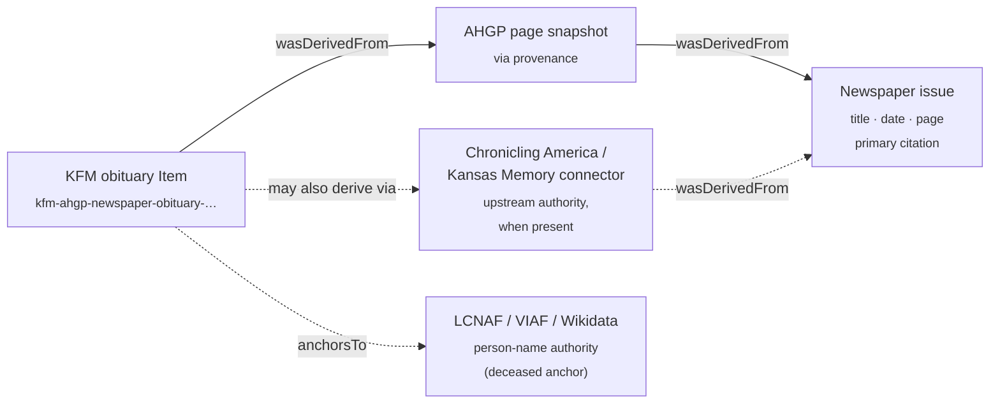

<!-- [KFM_META_BLOCK_V2]
doc_id: kfm://doc/docs-sources-catalog-ahgp-newspaper-obituary-transcriptions
title: AHGP Newspaper Obituary Transcriptions
type: product-page
version: v0.3
status: draft
owners: <PLACEHOLDER — Docs steward + Source steward for ahgp>
created: 2026-05-20
updated: 2026-05-20
policy_label: public
related:
  - docs/sources/catalog/ahgp/README.md
  - docs/sources/catalog/ahgp/IDENTITY.md
  - docs/sources/catalog/ahgp/RIGHTS-AND-SENSITIVITY-MAP.md
  - docs/sources/catalog/ahgp/NAMING.md
  - docs/sources/catalog/ahgp/OPEN-QUESTIONS.md
  - docs/sources/catalog/ahgp/cemetery-transcriptions.md
  - docs/sources/catalog/ahgp/census-transcriptions.md
  - docs/sources/catalog/ahgp/county-town-histories.md
  - docs/sources/catalog/ahgp/family-trees.md
  - docs/sources/catalog/README.md
  - docs/doctrine/directory-rules.md
  - docs/domains/people-dna-land/README.md
tags: [kfm, docs, sources, catalog, ahgp, newspaper, obituary, people-dna-land, genealogy, life-event]
notes:
  - "v0.3 — presentation pass applied to a product overlay specialized for newspaper obituary transcriptions."
  - "Sibling-link presence verified in the Phase 0 Claude Code session that emitted the family README and stubs."
  - "AHGP source-role and rights claims grounded in the prior AHGP family catalog session (2026-05-13); KFM-internal implementation paths remain PROPOSED or NEEDS VERIFICATION until a mounted-repo run confirms them."
  - "Not an activation document. SourceActivationDecision for SRC-AHGP remains gated on the family-level prerequisites list."
  - "Cross-source authority is anchored in KFM-P17-IDEA-0004 (PROPOSED): historical claims separate Kansas Memory (primary layer), HathiTrust (context), and Chronicling America (recall) — newspapers are a *distinct evidence role*, not an undifferentiated citation bucket."
  - "Chronicling America admission for OCR/IIIF/NER is anchored in KFM-P15-PROG-0033 (PROPOSED) and KFM-P17-PROG-0042 (PROPOSED)."
  - "LCNAF / VIAF anchoring for the deceased's name is anchored in KFM-P17-PROG-0042 (PROPOSED)."
[/KFM_META_BLOCK_V2] -->

# AHGP Newspaper Obituary Transcriptions

> Volunteer transcriptions of newspaper obituaries hosted by the American History and Genealogy Project (AHGP), keyed to **newspaper title + issue date + page**. KFM treats this product as a **convenience copy** (`via` provenance) over an underlying newspaper observation that is separately authoritative through dedicated newspaper-archive connectors (Chronicling America, Kansas Memory) when they cover the issue.

**Status:** PROPOSED — product overlay, activation gated, living-kin redaction required · **Family:** [`ahgp`](./README.md) · **Domain:** People, Genealogy, DNA, and Land Ownership · **Last reviewed:** 2026-05-20 · **Owners:** `<PLACEHOLDER — Docs steward + Source steward for ahgp>`


-orange)


---

### Quick jump

[Overview](#overview) · [Source authority](#source-authority) · [Catalog profiles](#catalog-profiles-used) · [Collection identity](#collection-identity) · [Provenance fields](#provenance-fields) · [Temporal handling](#temporal-handling) · [Geometry & projection](#geometry-and-projection) · [Rights & sensitivity](#rights-and-sensitivity) · [Validation](#validation-and-catalog-closure) · [Contracts & schemas](#related-contracts-and-schemas) · [Connectors & pipelines](#related-connectors-and-pipelines) · [Examples](#examples) · [Open questions](#open-questions) · [Related docs](#related-docs)

---

## Overview

CONFIRMED (external, prior session): AHGP hosts volunteer transcriptions of newspaper obituaries as a listed content surface, alongside cemetery transcriptions, census transcriptions, county/town histories, family trees, and other genealogy materials.

CONFIRMED (KFM doctrine, KFM-P17-IDEA-0004 PROPOSED, with CONFIRMED detailed explanation): Historical person and place claims separate **Kansas Memory as the primary layer**, **HathiTrust as the context layer**, and **Chronicling America as the recall layer**. The doctrine explicitly prevents *"monographs, newspapers, and archival items from collapsing into one undifferentiated citation bucket."* Newspapers are a **distinct evidence role**.

CONFIRMED (KFM doctrine, KFM-P15-PROG-0033 / KFM-P17-PROG-0042 PROPOSED): Chronicling America and LOC services are admitted as OCR/image/IIIF/visual-metadata sources for NER-to-event extraction; LCNAF/VIAF/Wikidata are recognized authority connectors for person-name anchoring.

PROPOSED (KFM-internal): This product page captures the **per-product overlay** that the AHGP family scaffold defers to individual product pages — `aggregate` role with `newspaper title + issue date` aggregation unit, `LifeEvent` (death) and `PersonAssertion` candidate object families, `FamilyGroup` *hypothesis* admission for survivor lists, multi-newspaper deduplication, living-kin redaction, per-imprint rights review, and cross-source authority deference to dedicated newspaper-archive connectors. **Activation is not in scope here**; the gate list lives in the family README under "Activation prerequisites" and in `policy/sources/ahgp/` *(PROPOSED path, NEEDS VERIFICATION)*.

INFERRED: Among the AHGP siblings, newspaper obituaries occupy a **middle-risk** position:

1. **Lower-risk than family trees** — there is an underlying observation (the printed obituary), and a separately authoritative path exists via newspaper archives.
2. **Higher-risk than cemetery transcriptions** — obituaries explicitly name living survivors ("survived by…"), and the family-supplied content is editorial.
3. **Comparable to census** in needing cross-source authority handoff to a federal/library-grade upstream connector when the issue is covered.

> [!IMPORTANT]
> Living-kin redaction is the dominant publication gate. Obituaries are death-of-the-deceased records, but they are **family-portrait records of the survivors**. Promotion to PUBLISHED requires that named living kin be redacted or consent-captured. The prior AHGP family work pinned this as the promotion-blocking condition: *"Newspaper title + issue date cited; living kin redacted."*

---

## Source authority

See [`data/registry/sources/ahgp/`](../../../../data/registry/sources/ahgp/) for the authoritative `SourceDescriptor`. **Do not duplicate** descriptor fields here.

**Product-specific descriptor overlay (PROPOSED, anchored in §24.1 doctrine and prior AHGP family work):**

| Field | PROPOSED value | Basis |
|---|---|---|
| `source_role` | `aggregate` | §24.1.1 (CONFIRMED doctrine) — published summary over a compilation unit; underlying observation is the printed obituary. |
| `role_aggregation_unit` | `newspaper title + issue date` | Prior AHGP family work (2026-05-13). The compilation boundary is the newspaper issue, not the cemetery or enumeration district. |
| `underlying_record_class` | printed newspaper obituary (with newspaper title, issue date, page) | Physical/imaged artifact; not authored by AHGP. |
| `via_provenance_required` | `true` | AHGP page URL is **via** provenance; primary citation resolves to *newspaper title + issue date + page*. |
| `upstream_source_descriptor` | separate `SRC-CHRONICLING-AMERICA-*` / `SRC-KANSAS-MEMORY-*` *(PROPOSED, NEEDS VERIFICATION against `connectors/`)* | KFM-P17-IDEA-0004 PROPOSED + KFM-P15-PROG-0033 PROPOSED — newspaper-archive connectors are the upstream authority for the same observation when present. |
| `person_authority_anchor` | LCNAF / VIAF / Wikidata for the deceased | KFM-P17-PROG-0042 PROPOSED — authority-connector set. |
| `observation_origin` | not authored by AHGP; family-supplied text printed by the newspaper | The obituary is family-supplied editorial, printed under the paper's masthead. |

> [!NOTE]
> All overlay fields are PROPOSED and require sign-off against the canonical descriptor schema at `schemas/contracts/v1/source/` *(NEEDS VERIFICATION)* and ADR-0001 before they are written into a `SourceDescriptor`.

[↑ Back to top](#ahgp-newspaper-obituary-transcriptions)

---

## Catalog profiles used

| Profile | Lane | Used by this product? | Notes |
|---|---|---|---|
| STAC | `data/catalog/stac/` | PROPOSED — Yes | Per-issue or per-newspaper Item scope (NEEDS VERIFICATION — see Open questions). |
| DCAT | `data/catalog/dcat/` | PROPOSED — Yes | Dataset-level rights and distribution; carry per-imprint rights status. |
| PROV-O | `data/catalog/prov/` | PROPOSED — Yes | `wasDerivedFrom` chain MUST carry AHGP page → newspaper issue; newspaper-archive connector path noted when present. |
| Domain projection | `data/catalog/domain/people-dna-land/` | PROPOSED — Yes | Domain folder drift candidate (NEEDS VERIFICATION). |

---

## Collection identity

- PROPOSED Collection id: `kfm-ahgp-newspaper-obituary-transcriptions` (see [`IDENTITY.md`](./IDENTITY.md)).
- PROPOSED namespace: `kfm:` *(see family-level OPEN-DSC-03)*.
- PROPOSED asset roles (NEEDS VERIFICATION against `schemas/contracts/v1/source/`):

| Asset role | Purpose | Notes |
|---|---|---|
| `obituary-text` | Transcribed obituary prose. | Primary textual surface. |
| `newspaper-imprint-metadata` | Newspaper title (and historical title variants), issue date, page, masthead. | Primary citation anchor. |
| `decedent-record` | Structured fields extracted from obituary: name, DOB, DOD, place of birth, place of death, burial. | Drives `LifeEvent` (death) + `PersonAssertion`. |
| `survivor-list` | Named surviving relatives with kinship phrases. | **Living-kin redaction gate input.** Drives `FamilyGroup` *hypotheses* only. |
| `person-authority-anchor` | LCNAF / VIAF / Wikidata IRI for the deceased, where resolvable. | Per KFM-P17-PROG-0042 PROPOSED. |
| `ahgp-page-snapshot` | Captured AHGP page bytes + integrity digest for provenance closure. | Required for `via` PROV chain. |

> [!NOTE]
> Per-newspaper vs. per-county vs. per-issue-date-range vs. single product-wide STAC Collection scope is unresolved — see [`OPEN-AHGP-OBT-01`](#open-questions).

---

## Provenance fields

STAC `properties.kfm:provenance` block (PROPOSED — Pass-10 C4-01):

- `spec_hash` — sha256 of the canonical record.
- `evidence_bundle_ref` — `kfm://evidence/<digest>`.
- `run_record_ref` — `kfm://run/<run-id>`.
- `audit_ref` — `kfm://audit/<attestation-id>`.
- `policy_digest` — sha256 of the policy bundle (MUST include living-kin redaction state).

Per-asset integrity: `file:checksum`.

**Newspaper-obituary-specific PROV-O obligation (PROPOSED).** Every Item MUST express the AHGP-as-`via` chain. When a dedicated newspaper-archive connector (Chronicling America, Kansas Memory) covers the same newspaper/issue, the connector path MUST also be expressed; AHGP and the connector are two paths to the **same printed obituary**, not competing observations:



If the newspaper issue cannot be resolved (title, date, page) at promotion time, the candidate Item MUST be routed to `data/quarantine/` with reason `unresolved-underlying-record`. AI surfaces over such candidates MUST **ABSTAIN** (cite-or-abstain).

[↑ Back to top](#ahgp-newspaper-obituary-transcriptions)

---

## Temporal handling

PROPOSED — keep these times distinct where material. Obituaries make the source/observed split especially sharp: the **issue date is not the death date**.

| Time | Meaning for this product | Notes |
|---|---|---|
| **source time** | AHGP page retrieval timestamp | NOT equal to issue date or death date. |
| **publication date** | Newspaper issue date as printed on the masthead | The compilation-unit time. |
| **observed time** | Date of death from the obituary text | The principal observation. Often within days of the issue date but distinct. Record uncertainty class when only "died this week" is given. |
| **service / burial time** | Funeral / interment dates from the obituary | Distinct from death date. |
| **valid time** | Same as observed time (a death is a point-in-time event) | Year-precision intervals where the obituary is vague. |
| **retrieval time** | When KFM fetched the AHGP page | Bound to `RunReceipt`. |
| **release time** | When this record entered `PUBLISHED` | Per `ReleaseManifest`. |
| **correction time** | When a `CorrectionNotice` supersedes | Per correction discipline; especially relevant for cross-newspaper deduplication. |

> [!WARNING]
> Stale-state anti-pattern guard. Volunteer transcribers continue to correct typos, add missing obituaries from the same issue, and link obituaries to corrections published in subsequent issues. Re-fetch on cadence or on user-reported correction; surface stale-state in the EvidenceDrawer.

---

## Geometry and projection

PROPOSED handling for this product. Obituaries name multiple places: birthplace, last residence, place of death, place of burial, places mentioned in life-events. Apply the same generalization rules as census transcriptions:

- **Town, township, or county polygons** — acceptable as the maximum precision for any place named in the obituary; route to the Settlements/Infrastructure domain for the polygons themselves.
- **Cemetery name + cemetery polygon** — acceptable as cross-reference to the cemetery-transcriptions sibling product when the burial location resolves to a known cemetery.
- **Per-residence / per-business / per-farm geometry mentioned in prose** — **NOT geocoded to points**. Generalize to township or county; record uncertainty class.

  > [!CAUTION]
  > Anti-pattern: geocoding `"died at his residence on Elm Street, Hutchinson"` or `"buried near the family farm"` to a precise coordinate. Township is the maximum precision when the source is narrative prose.

- **Place-of-birth strings** (e.g., `"b. Ireland"`, `"b. Posey County, Indiana"`) — anchor to GNIS / TGN at the named-place level per C9-01 / KFM-P15-PROG-0033 patterns; NOT geocoded to points.
- **CRS** — `EPSG:4326` lat/lon at source/catalog level; display projection per catalog convention (NEEDS VERIFICATION — confirm against `data/catalog/` artifacts).
- **Generalization rules** — codify in `policy/sensitivity/` *(PROPOSED path, NEEDS VERIFICATION)*; do not restate here.

[↑ Back to top](#ahgp-newspaper-obituary-transcriptions)

---

## Rights and sensitivity

NEEDS VERIFICATION — see [`policy/sensitivity/`](../../../../policy/sensitivity/) and [`RIGHTS-AND-SENSITIVITY-MAP.md`](./RIGHTS-AND-SENSITIVITY-MAP.md). **Do not restate policy here.**

> [!WARNING]
> **Living-kin redaction gate (CONFIRMED prior-session promotion-blocking condition).** Obituaries explicitly name surviving relatives ("survived by his wife Mary, sons John and Robert, …"). These survivors may still be living, including grandchildren and great-grandchildren of the deceased even when the deceased died decades ago. Living-kin name extraction MUST run at admission; matches route to a redaction review queue and the candidate MUST NOT promote to PUBLISHED with living-kin names exposed.

**Product-specific posture (PROPOSED, summary only — canonical rules live in policy):**

| Surface | Posture | Note |
|---|---|---|
| Living-kin exposure in survivor lists | DENY by default for living-named persons. | The dominant publication gate. Kinship-phrase parsing required. |
| Pre-1929 newspaper imprint | PROPOSED: public-domain by age (current U.S. rule places pre-1929 published works in PD as of 2025). | NEEDS VERIFICATION per imprint — renewed works, foreign-origin papers, and trade-press papers may have residual rights. See [`OPEN-AHGP-OBT-02`](#open-questions). |
| Post-1929 newspaper imprint | DENY of verbatim republication by default; transcription may operate under fair-use/quotation in some jurisdictions but commercial republication is not assumed. | Per-imprint review REQUIRED. |
| AHGP compilation copyright | Applies to the AHGP transcription layer (typography, OCR cleanup, layout). | Attribution and selective republication NEEDS VERIFICATION per record class. |
| Cause-of-death sensitivity | Historical obituaries vary widely in candor (suicide, foul play, contagious disease, mental illness, stillbirth). Modern descendants may be living. | Elevated review. See [`OPEN-AHGP-OBT-08`](#open-questions). |
| Family-supplied editorial bias | Obituaries are family-submitted; can be hagiographic, omit context (estrangement, illegitimate children, prior marriages), or contain inaccuracies. | Confidence floor reduced relative to vital records; bias not redacted but flagged. |
| Defamatory / disparaging language | Rare in obituaries, more common in death notices that double as community-event coverage. | Living-descendant complaint path via `CorrectionNotice`. |
| Indigenous / contested narrative | Frontier-era obituaries occasionally use slurs or one-sided framing for Indigenous decedents or for settlers killed in frontier conflict. | Elevated review; CARE applicability NEEDS VERIFICATION. |

[↑ Back to top](#ahgp-newspaper-obituary-transcriptions)

---

## Validation and catalog closure

- Catalog closure required before public release (Pass-10 / KFM-P1-IDEA-0020).
- STAC Projection lint (KFM-P27-FEAT-0003) — PROPOSED.
- STAC checksum closure against the ReleaseManifest digest (KFM-P22-PROG-0037) — PROPOSED.

**Newspaper-obituary-specific gates (PROPOSED):**

- **Living-kin redaction gate (CONFIRMED prior-session)** MUST run at admission. Living-named persons in the survivor list route to redaction review; `RedactionReceipt` REQUIRED before publication.
- `role_aggregation_unit: newspaper title + issue date` MUST propagate through `processed/` → `catalog/` → `published/` without collapse.
- **Citation closure**: AHGP page URL is `via`; primary citation MUST resolve to *newspaper title + issue date + page*. If unresolvable, **ABSTAIN** at AI surfaces and **quarantine** at catalog.
- **Per-imprint rights gate**: every Item carries a per-imprint rights status (PD-by-age / fair-use-quotation / licensed / DENY); pre-1929 heuristic may auto-pass, post-1929 requires explicit review.
- **Cross-source authority gate**: when a dedicated newspaper-archive connector (Chronicling America, Kansas Memory) covers the same issue, AHGP transcription defers; mismatches route to a transcription-error queue with the connector text taken as authority.
- **Cross-newspaper deduplication gate**: the same obituary frequently appears in 3–10 papers (local + regional + family-hometown). A canonical-event key (decedent identity + death date) groups duplicates; each newspaper printing is preserved as evidence but a single `LifeEvent` is emitted. See [`OPEN-AHGP-OBT-05`](#open-questions).
- **Person-authority-anchor gate**: where the deceased resolves to an LCNAF / VIAF / Wikidata IRI (KFM-P17-PROG-0042 PROPOSED), anchor the `PersonAssertion`; absence is logged, not blocking.
- **FamilyGroup hypothesis floor**: survivor lists generate `FamilyGroup` candidates with `role_candidate_disposition: pending` (consistent with the family-trees sibling product). Promotion to `FamilyGroup` requires independent corroboration.

---

## Related contracts and schemas

| Surface | Reference | Status |
|---|---|---|
| Object family — `PersonAssertion` (deceased) | `contracts/` | NEEDS VERIFICATION against mounted contracts. |
| Object family — `LifeEvent` (death-event subtype) | `contracts/` | The principal admission target. NEEDS VERIFICATION. |
| Object family — `ResidenceEvent` (last residence, place of death) | `contracts/` | Secondary admission target. NEEDS VERIFICATION. |
| Object family — `FamilyGroup` (hypothesis only) | `contracts/` | Survivor lists generate `pending` hypotheses; never published as confirmed `FamilyGroup`. |
| Cross-domain — cemetery cross-reference | `docs/sources/catalog/ahgp/cemetery-transcriptions.md` | Burial-location resolution. |
| Receipt — `RedactionReceipt` | `schemas/contracts/v1/receipts/` | §24.2.1 — REQUIRED for living-kin redactions. |
| Source descriptor schema home | `schemas/contracts/v1/source/` | Per ADR-0001 (schema home). |

**Candidate object-family mapping (from prior AHGP family work):**

| AHGP record class | Candidate KFM object family | Promotion-blocking condition |
|---|---|---|
| Newspaper obituary transcription | `LifeEvent` (death); `PersonAssertion`; possible `FamilyGroup` *hypotheses* | Newspaper title + issue date cited; living kin redacted; per-imprint rights confirmed. |

> [!IMPORTANT]
> This product MUST NOT introduce new object families. The `FamilyGroup` candidates from survivor lists MUST carry `role_candidate_disposition: pending` and follow the family-trees sibling's promotion discipline (independent corroboration + steward review).

[↑ Back to top](#ahgp-newspaper-obituary-transcriptions)

---

## Related connectors and pipelines

- [`connectors/ahgp/`](../../../../connectors/ahgp/) — PROPOSED. NEEDS VERIFICATION (presence not confirmed against mounted repo).
- [`connectors/chronicling-america/`](../../../../connectors/chronicling-america/) — PROPOSED upstream authority per KFM-P15-PROG-0033 / KFM-P17-PROG-0042. NEEDS VERIFICATION.
- [`connectors/kansas-memory/`](../../../../connectors/kansas-memory/) — PROPOSED primary layer per KFM-P17-IDEA-0004. NEEDS VERIFICATION.
- [`pipelines/ingest/`](../../../../pipelines/ingest/) · [`normalize/`](../../../../pipelines/normalize/) · [`validate/`](../../../../pipelines/validate/) · [`catalog/`](../../../../pipelines/catalog/) — standard lifecycle phases.
- [`pipeline_specs/people-dna-land/`](../../../../pipeline_specs/people-dna-land/) — PROPOSED primary domain spec home; NEEDS VERIFICATION on exact domain folder name (drift candidate flagged in the family README).

> [!NOTE]
> Watcher-as-non-publisher invariant applies. AHGP watchers emit to `data/raw/` or `data/quarantine/`; promotion runs through validated pipelines and never via a watcher. The living-kin redaction gate runs inside `pipelines/validate/`, not at the connector layer.

---

## Examples

*(Illustrative only — do not treat as authoritative.)*

See [`_examples/stac-item-example.json`](../_examples/stac-item-example.json) for the minimal STAC + `kfm:provenance` shape used across the AHGP family.

<details>
<summary><b>Obituary Item — illustrative STAC shape (PROPOSED, NEEDS VERIFICATION against actual schema)</b></summary>

```jsonc
{
  "id": "kfm-ahgp-newspaper-obituary-<paper-id>-<issue-date>-<page>-<entry>",
  "geometry": "<town or county polygon — not per-residence/per-burial>",
  "properties": {
    "kfm:role": "aggregate",
    "kfm:role_aggregation_unit": "newspaper title + issue date",
    "kfm:via_source_id": "SRC-AHGP",
    "kfm:upstream_source_id": "SRC-CHRONICLING-AMERICA-<lccn>",   // when connector covers the issue
    "kfm:underlying_record_class": "newspaper-obituary",
    "kfm:newspaper_title": "The Hutchinson News",
    "kfm:newspaper_lccn": "sn82014635",
    "kfm:issue_date": "1903-04-17",
    "kfm:page": 3,
    "kfm:date_of_death": "1903-04-15",
    "kfm:living_kin_redaction_passed": true,
    "kfm:imprint_rights_status": "pd-by-age",
    "kfm:person_authority_anchor": {
      "lcnaf": "<IRI or null>",
      "viaf":  "<IRI or null>",
      "wikidata": "<QID or null>"
    },
    "kfm:provenance": {
      "spec_hash": "sha256:<…>",
      "evidence_bundle_ref": "kfm://evidence/<digest>",
      "run_record_ref": "kfm://run/<run-id>",
      "audit_ref": "kfm://audit/<attestation-id>",
      "policy_digest": "sha256:<…>"
    }
  },
  "assets": {
    "obituary-text":              { "type": "text/plain",       "roles": ["data"] },
    "newspaper-imprint-metadata": { "type": "application/json", "roles": ["citation"] },
    "decedent-record":            { "type": "application/json", "roles": ["data"] },
    "survivor-list":              { "type": "application/json", "roles": ["data"], "kfm:requires_redaction_review": true },
    "person-authority-anchor":    { "type": "application/json", "roles": ["authority"] },
    "ahgp-page-snapshot":         { "type": "text/html",        "roles": ["provenance"] }
  }
}
```

</details>

---

## Open questions

Family-level open questions (e.g., `OPEN-DSC-03` namespace pin) are tracked in [`OPEN-QUESTIONS.md`](./OPEN-QUESTIONS.md). Newspaper-obituary-specific items below MUST NOT renumber family-level questions.

<details>
<summary><b>Newspaper-obituary-specific open questions (11)</b></summary>

| ID | Question | Blocks |
|---|---|---|
| **OPEN-AHGP-OBT-01** | STAC Collection scope: per-newspaper, per-county, per-state, per-issue-date-range, or single product-wide Collection? | Asset roles, partitioning, tile output. |
| **OPEN-AHGP-OBT-02** | Per-imprint rights status: pre-1929 PD heuristic vs per-newspaper rights research (foreign-origin papers, renewed works, trade press). Process for confirming PD per imprint? | Rights gate. |
| **OPEN-AHGP-OBT-03** | Living-kin detection: canonical detector for kinship phrases ("survived by", "wife of", "son of"), quarantine-vs-redaction threshold, receipt location. | Pre-publication gate. |
| **OPEN-AHGP-OBT-04** | Newspaper-name normalization: many newspapers change titles, merge, or split. Crosswalk to LCCN (LOC Library of Congress Control Number) for stable identity? | Catalog identity stability. |
| **OPEN-AHGP-OBT-05** | Cross-newspaper deduplication: a single obituary appears in 3–10 papers. Canonical-event keying (decedent + death date) vs preserve-all-printings policy? | Catalog dedup; identity-resolution surface. |
| **OPEN-AHGP-OBT-06** | When `connectors/chronicling-america/` or `connectors/kansas-memory/` covers the same issue, AHGP transcription residual role: deprecated, transcription-error detector, or sparse-coverage gap-fill? | Cross-source authority; KFM-P17-IDEA-0004 implementation. |
| **OPEN-AHGP-OBT-07** | `FamilyGroup` hypothesis vs assertion: survivor lists generate weak family-group candidates. What threshold (independent corroboration count) promotes them past `pending`? | Object-family promotion gate. |
| **OPEN-AHGP-OBT-08** | Cause-of-death sensitivity: historical obituaries vary in candor (suicide, contagious disease, foul play, stillbirth). Redact, contextualize, or surface as-is with a sensitivity badge? | Sensitivity policy. |
| **OPEN-AHGP-OBT-09** | LCNAF / VIAF / Wikidata person-anchor invocation: at what point in the pipeline is the deceased anchored (admission, normalize, validate)? Block on absence or log-and-proceed? | Person authority; KFM-P17-PROG-0042 implementation. |
| **OPEN-AHGP-OBT-10** | Stale-state cadence threshold for AHGP newspaper-obituary pages: weeks, months, or volunteer-correction triggered only? | Freshness. |
| **OPEN-AHGP-OBT-11** | Modern-imprint quotation policy: post-1929 obituaries — verbatim transcription DENY, structured-field extraction permitted, or per-jurisdiction fair-use determination? | Rights gate. |

</details>

[↑ Back to top](#ahgp-newspaper-obituary-transcriptions)

---

## Related docs

- [`docs/sources/catalog/ahgp/README.md`](./README.md) — AHGP family README (activation prerequisites live here).
- [`docs/sources/catalog/ahgp/IDENTITY.md`](./IDENTITY.md) — Collection id patterns and namespace pins.
- [`docs/sources/catalog/ahgp/RIGHTS-AND-SENSITIVITY-MAP.md`](./RIGHTS-AND-SENSITIVITY-MAP.md) — Rights/sensitivity map (canonical).
- [`docs/sources/catalog/ahgp/NAMING.md`](./NAMING.md) — Naming conventions.
- [`docs/sources/catalog/ahgp/OPEN-QUESTIONS.md`](./OPEN-QUESTIONS.md) — Family-level open questions register.
- [`docs/sources/catalog/ahgp/cemetery-transcriptions.md`](./cemetery-transcriptions.md) — Sibling product (cemetery surface, `aggregate`) — burial-location cross-reference.
- [`docs/sources/catalog/ahgp/census-transcriptions.md`](./census-transcriptions.md) — Sibling product (census surface, `aggregate`, 72-year-rule gate).
- [`docs/sources/catalog/ahgp/county-town-histories.md`](./county-town-histories.md) — Sibling product (history surface, `administrative`).
- [`docs/sources/catalog/ahgp/family-trees.md`](./family-trees.md) — Sibling product (family-tree surface, `candidate`, PUBLISHED edge forbidden) — `FamilyGroup`-hypothesis discipline aligns with this product.
- [`docs/sources/catalog/README.md`](../README.md) — Source catalog landing.
- [`docs/doctrine/directory-rules.md`](../../../doctrine/directory-rules.md) — Placement law.
- [`docs/domains/people-dna-land/README.md`](../../../domains/people-dna-land/README.md) — Primary domain README *(NEEDS VERIFICATION — exact folder name)*.

---

**Last reviewed:** 2026-05-20 *(v0.3 — presentation pass applied to a product overlay specialized for newspaper obituary transcriptions; sibling-link presence verified in the Phase 0 Claude Code session that emitted the family README and stubs).*

[↑ Back to top](#ahgp-newspaper-obituary-transcriptions)
