```mermaid
flowchart LR
    subgraph EXT["EXTERNAL — BLM authoritative surfaces"]
        GLO["GLO Records<br/>(patents · plats · field notes)"]
        PLSS["PLSS / CadNSDI<br/>(cadastral reference)"]
        HUB["BLM Geospatial<br/>Business Platform Hub"]
    end

    subgraph ADMIT["KFM admission — governed by SourceDescriptor + SourceActivationDecision"]
        SD["SourceDescriptor<br/>(identity · role · rights · cadence · sensitivity)"]
        SAR["control_plane/<br/>source_authority_register"]
        SAD["SourceActivationDecision<br/>(allowed · restricted · denied · needs-review)"]
    end

    subgraph LIFE["KFM lifecycle"]
        direction LR
        RAW["RAW<br/>data/raw/&lt;domain&gt;/blm/&lt;run_id&gt;/"]
        WORK["WORK / QUARANTINE"]
        PROC["PROCESSED"]
        CAT["CATALOG / TRIPLET"]
        PUB["PUBLISHED<br/>(public-safe only)"]
        RAW --> WORK --> PROC --> CAT --> PUB
    end

    GLO -. fetch via connector .-> SD
    PLSS -. fetch via connector .-> SD
    HUB -. fetch via connector .-> SD
    SD --> SAR --> SAD
    SAD -- "allowed/restricted" --> RAW
    SAD -- "denied/needs-review" --> X["NOT ADMITTED"]

    classDef ext fill:#eef,stroke:#557,color:#113;
    classDef admit fill:#fef6e0,stroke:#aa8,color:#322;
    classDef life fill:#eef9ee,stroke:#585,color:#142;
    classDef stop fill:#fde,stroke:#a33,color:#311;
    class GLO,PLSS,HUB ext;
    class SD,SAR,SAD admit;
    class RAW,WORK,PROC,CAT,PUB life;
    class X stop;
```

<!-- [KFM_META_BLOCK_V2]
doc_id: kfm://doc/sources-catalog-blm
title: Source Catalog Entry — Bureau of Land Management (BLM)
type: standard
version: v1
status: draft
owners: TODO — Sources steward (confirm); secondary: People/DNA/Land steward, Frontier Matrix steward
created: 2026-05-13
updated: 2026-05-13
policy_label: public
related:
  - docs/doctrine/directory-rules.md
  - docs/sources/README.md            # PROPOSED — verify presence
  - docs/standards/                    # external-standards anchors
  - docs/domains/people-dna-land/README.md
  - docs/domains/frontier-matrix/README.md   # PROPOSED — verify lane folder name
  - control_plane/source_authority_register.yaml
  - schemas/contracts/v1/source/source-descriptor.json   # PROPOSED — per ADR-0001
tags: [kfm, sources, federal, land, blm, glo, plss, public-domain]
notes:
  - All KFM-specific repo paths PROPOSED until verified against mounted repo.
  - BLM technical surfaces sourced externally; see "External sources" in review notes.
[/KFM_META_BLOCK_V2] -->

# Source Catalog Entry — Bureau of Land Management (BLM)

> Human-facing entry that describes the BLM source family, its admission posture in KFM, and the governance constraints any pipeline, connector, or domain MUST respect before consuming BLM data.


| Field | Value |
|---|---|
| **Status** | `PROPOSED` — catalog entry only; not an activation decision |
| **Owners** | Sources steward (primary); People/DNA/Land + Frontier Matrix stewards (consumers) — `TODO` confirm names |
| **Last updated** | 2026-05-13 |
| **Activation state** | `NEEDS VERIFICATION` — no `SourceActivationDecision` verified in this session |
| **Authority of this entry** | Catalog documentation, not policy. Admission decisions live in `policy/`, `control_plane/`, and `data/registry/`. |

---

## 📑 Quick Jump

- [1. Scope](#1-scope)
- [2. Repo fit](#2-repo-fit)
- [3. Why BLM matters to KFM](#3-why-blm-matters-to-kfm)
- [4. BLM source families considered for admission](#4-blm-source-families-considered-for-admission)
- [5. Source flow through the KFM trust spine](#5-source-flow-through-the-kfm-trust-spine)
- [6. Source-role analysis (KFM doctrine applied)](#6-source-role-analysis-kfm-doctrine-applied)
- [7. Rights and sensitivity posture](#7-rights-and-sensitivity-posture)
- [8. KFM domain consumers](#8-kfm-domain-consumers)
- [9. Lifecycle map — RAW → PUBLISHED](#9-lifecycle-map--raw--published)
- [10. Admission gate checklist](#10-admission-gate-checklist)
- [11. Anti-patterns specific to BLM data](#11-anti-patterns-specific-to-blm-data)
- [12. Cross-source relations](#12-cross-source-relations)
- [13. Verification backlog](#13-verification-backlog)
- [14. Appendix](#14-appendix)
- [15. Related docs](#15-related-docs)

---

## 1. Scope

This entry describes the **Bureau of Land Management (BLM)** as a candidate **source family** for KFM. It explains:

- which BLM datasets KFM would consider admitting,
- which **`source_role`** each one carries under KFM doctrine,
- which KFM domains consume them,
- which gates, receipts, and sensitivity controls apply,
- and what remains unverified.

> [!IMPORTANT]
> This entry is **catalog documentation**, not an admission decision. A `SourceDescriptor` and a `SourceActivationDecision` are required before any BLM bytes enter `data/raw/...`. Nothing here authorizes a fetch, a publish, or a public-facing claim.

This entry is **not**:

| It is not | The actual home is |
|---|---|
| A `SourceDescriptor` schema record | `schemas/contracts/v1/source/source-descriptor.json` *(PROPOSED per ADR-0001 schema-home)* |
| A `SourceActivationDecision` | `control_plane/source_authority_register.yaml` + governed flow |
| A connector | `connectors/blm/` *(PROPOSED; verify before creating)* |
| A pipeline spec | `pipeline_specs/.../blm/` *(PROPOSED; verify before creating)* |
| A policy rule | `policy/sources/...` or `policy/sensitivity/...` |

---

## 2. Repo fit

**Proposed path:** `docs/sources/catalog/blm.md`

**Directory Rules basis:** `docs/sources/` is the CONFIRMED home for "source-descriptor standards, source families" under `docs/`, the human-facing control plane (Directory Rules §6.1). A `catalog/` subdirectory under `docs/sources/` is `PROPOSED` and `NEEDS VERIFICATION`: it is not explicitly named in Directory Rules, but follows the doctrine principle that `docs/` *explains* while `control_plane/`, `contracts/`, `schemas/`, and `policy/` carry machine and decision authority. If a different convention is in force (e.g., `docs/sources/families/`, or per-source files directly under `docs/sources/`), this file should be moved and a `DRIFT_REGISTER.md` entry opened.

```text
docs/
└── sources/
    ├── README.md                 # PROPOSED — landing/index for source documentation
    ├── catalog/                  # PROPOSED — per-source-family human entries
    │   ├── blm.md                # <-- this file
    │   ├── usgs.md               # PROPOSED — sibling entries
    │   ├── census.md             # PROPOSED — sibling entries
    │   ├── noaa.md               # PROPOSED — sibling entries
    │   └── ...
    └── standards/                # OR docs/standards/  — verify before placing
```

**Upstream of this file (governance):**

- `docs/doctrine/directory-rules.md` — placement law
- `docs/doctrine/truth-posture.md`, `docs/doctrine/trust-membrane.md` — admission discipline
- ADR-0001 (schema home) — affects where the `SourceDescriptor` schema lives

**Downstream of this file (operational):**

- `control_plane/source_authority_register.yaml` — the machine-readable register that records the BLM `SourceActivationDecision` if and when it is issued
- `data/registry/sources/...` — append-only source records once admission begins
- `connectors/blm/` — fetch/admit code (PROPOSED; not authorized by this doc)
- `policy/sources/...` and `policy/sensitivity/...` — rule files that gate BLM-derived content

> [!NOTE]
> If `docs/sources/README.md` does not yet exist, create it before adding sibling entries so the catalog has a single human-readable index. The README should declare scope, naming convention, and authority class.

---

## 3. Why BLM matters to KFM

[Back to top](#-quick-jump)

KFM doctrine explicitly names **land patents** and **land office / public land records** among the canonical source families for two domains:

- **People, Genealogy, DNA, and Land Ownership** — land patents are listed in the domain's source-family catalog (CONFIRMED doctrine; KFM Encyclopedia §7.14).
- **Frontier Demography, Economy, Settlement, Land, and Time Matrix** — "land office/public land records" appear in the source-family catalog (CONFIRMED doctrine; KFM Encyclopedia §7.15).

Additionally, the **Master MapLibre dossier** carries idea entries that explicitly name **GLO plats** and **PLSS georeferencing** as map-context source material (e.g., GLO plat georeferencing requires RMS and control-point receipts; sensitive feature counts for LiDAR/GLO belong in governance telemetry — CONFIRMED source evidence, implementation PROPOSED).

The Bureau of Land Management is the **federal authority** for these record families:

- **GLO Records** — the federal land conveyance corpus for the 30 Public Land States, including Kansas. Image access to land patents, survey plats, and field notes from the early 19th century forward. *(EXTERNAL — `glorecords.blm.gov`.)*
- **PLSS / CadNSDI** — the GIS publication of the Public Land Survey System (townships, sections, special surveys, meandered water, corners, conflicted areas), per FGDC Cadastral Publication standards. *(EXTERNAL — BLM National Operations Center.)*

> [!TIP]
> **The frontier story Kansas tells is, in large part, a public-land story.** Most 19th-century settlement events in Kansas are recorded against PLSS township/range/section coordinates and concluded with a federal land patent. BLM is therefore one of the most consequential candidate sources for KFM — and one of the most likely to be **misused** if its source-role is collapsed (see §6 and §11).

---

## 4. BLM source families considered for admission

[Back to top](#-quick-jump)

> [!NOTE]
> The table below lists candidates. Inclusion here is `PROPOSED`. Admission requires a `SourceDescriptor`, rights/role/sensitivity/cadence review, and a `SourceActivationDecision`.

| BLM dataset (candidate) | Brief description | Proposed `source_role` | Primary KFM consumer(s) | Rights *(EXTERNAL)* | Status |
|---|---|---|---|---|---|
| **GLO land patents** | Federal land title records for Public Land States, 1820–present *(EXTERNAL)* | `administrative` | People/DNA/Land; Frontier Matrix | US federal government work; public-domain factual content. Use terms: `NEEDS VERIFICATION`. | `PROPOSED` |
| **GLO survey plats** | Cadastral survey plats, ~1810–present *(EXTERNAL)* | `administrative` (cadastral record); may be `context` for map display | People/DNA/Land; Frontier Matrix; Planetary/3D (georeferenced raster) | US federal. Use terms: `NEEDS VERIFICATION`. | `PROPOSED` |
| **GLO field notes** | Narrative cadastral survey records *(EXTERNAL)* | `administrative` | People/DNA/Land; Frontier Matrix; Settlements | US federal. Use terms: `NEEDS VERIFICATION`. | `PROPOSED` |
| **PLSS / CadNSDI** | GIS Public Land Survey System — townships, sections, special surveys, etc. *(EXTERNAL)* | `administrative` (cadastral reference); `context` for joins | All spatial domains as base geography | US federal; FGDC publication standard. Use terms: `NEEDS VERIFICATION`. | `PROPOSED` |
| **BLM Geospatial Business Platform Hub** | Centralized BLM geospatial access *(EXTERNAL — replaced Navigator/LADP, 2022)* | varies per layer | varies | Per-dataset; `NEEDS VERIFICATION`. | `PROPOSED` access path |
| **PAD-US (BLM portion)** | Federal lands portion of the Protected Areas Database *(USGS-led; BLM contributes)* | `administrative` | Fauna/Habitat (PADUS context already referenced in doctrine) | US federal. Use terms: `NEEDS VERIFICATION`. | `PROPOSED` |
| **Tract books (Western States)** | Geographic indexes to land entry papers — *Kansas tract books held by NARA, not BLM* | `administrative` (out-of-scope for BLM admission; admit via NARA) | People/DNA/Land; Frontier Matrix | `NEEDS VERIFICATION` | `PROPOSED` — admit through NARA channel, not BLM |

> [!CAUTION]
> **Kansas tract books are held by NARA, not by BLM** *(EXTERNAL — National Archives "Land Entry Case Files and Related Records")*. Don't conflate "BLM Eastern States Office" patent images with NARA-held tract books for Western Public Land States. Each is a distinct admission with its own descriptor.

---

## 5. Source flow through the KFM trust spine

[Back to top](#-quick-jump)



> [!NOTE]
> The diagram above is the **expected** governed shape per KFM doctrine. Specific path names (`data/raw/<domain>/blm/<run_id>/`, `connectors/blm/`, register filenames) are `PROPOSED` and require mounted-repo verification.

---

## 6. Source-role analysis (KFM doctrine applied)

[Back to top](#-quick-jump)

KFM defines a closed enum for `source_role`:
`observed | regulatory | modeled | aggregate | administrative | candidate | synthetic`
*(PROPOSED descriptor surface; NEEDS VERIFICATION against mounted schema.)*

For BLM, the dominant role is **`administrative`** — these are **legal/administrative records of public-land conveyance and survey reference**, not field observations of place, regulation in force, modeled outputs, or aggregate roll-ups.

| BLM artifact | KFM `source_role` | Why this role (not another) |
|---|---|---|
| Land patent | `administrative` | A patent records a legal conveyance event. It is not an *observation* of who lived on the land, not a *regulation* in force today, and not an *aggregate*. |
| Survey plat / field notes | `administrative` *(or `context` when used as a map carrier)* | Records the cadastral survey act. Treat the **georeferenced raster** as `context` only when admission includes a representation receipt. |
| PLSS CadNSDI polygons | `administrative` (cadastral reference) *(or `context` for joins)* | This is the cadastral reference frame, not an observation of present land use. |
| PAD-US polygons (BLM portion) | `administrative` | Records federal land status; not an ecological observation. |

> [!WARNING]
> **Source-role anti-collapse.** Doctrine forbids treating an *administrative compilation as observation* (KFM Domains Atlas §24.1 — DENY pattern). A BLM patent is evidence of a **federal conveyance event**, not of **residence**, **occupation**, **agricultural use**, or **continuous ownership**. A KFM `LifeEvent` or `ResidenceEvent` MUST NOT be synthesized from a patent alone; it requires independent evidence (census, vital records, deed instruments, etc.). The patent supports a `LandOwnershipAssertion` keyed to the patent date and the PLSS aliquot, with `source_role = administrative` preserved.

---

## 7. Rights and sensitivity posture

[Back to top](#-quick-jump)

### 7.1 Rights *(EXTERNAL — `NEEDS VERIFICATION` for current terms of use)*

US federal-government works are generally free of US copyright. BLM/GLO records and PLSS CadNSDI publications are produced by federal authorities for public access. KFM still requires:

- a **rights review** before any public derivative is released,
- **attribution** preserved in the `EvidenceBundle` and downstream `LayerManifest`,
- recording **terms-of-use language** from the source as observed at admission time,
- recording **redistribution stance** — copying public-domain data is permitted; KFM does not implicitly extend that to **mixed derivatives** that include sensitive joins.

### 7.2 Sensitivity *(mostly low — but joins matter)*

KFM's deny-by-default register (Encyclopedia §13) places **living-person**, **DNA**, **rare species**, **archaeology**, **sacred places**, **critical infrastructure**, and **private landowner-sensitive data** under restricted or denied public release. BLM data **itself** is low-sensitivity for historical patents and base cadastral geometry. **The risk is in the join.**

| Sensitivity vector | Default outcome | Required control |
|---|---|---|
| Historic land patent (deceased patentee, 19th–early-20th c.) | `ALLOW` for public surfaces | Standard `SourceDescriptor` + `EvidenceBundle` |
| **Patent → present-day occupant** | `DENY` by default | Living-person policy; redaction; `ABSTAIN` at AI |
| **Patent or PLSS → present-day parcel ownership claim** | `DENY` as title truth | Parcel geometry ≠ title; assessor ≠ title (CONFIRMED doctrine, Encyclopedia §7.14) |
| PLSS → private landowner field boundaries | `RESTRICT/DENY` | Aggregation; rights review |
| Cadastral overlay near Tribal/sovereignty boundaries | `HOLD` for steward review | Sovereignty/CARE-aligned consultation; sensitivity transform receipt |
| GLO field notes mentioning still-living descendants | `RESTRICT` | Living-person review; redaction receipt |

> [!IMPORTANT]
> **`AssessorRecord ≠ TitleInstrument`** and **`ParcelGeometry ≠ TitleBoundary`** are CONFIRMED doctrine (KFM Encyclopedia §7.14). Any KFM surface that joins BLM-administered cadastral references to **present-day ownership claims** MUST preserve the distinction in field naming, badges, and the Evidence Drawer.

---

## 8. KFM domain consumers

[Back to top](#-quick-jump)

| KFM domain | BLM use | Doctrine reference | Consumer status |
|---|---|---|---|
| **People, Genealogy, DNA, and Land Ownership** | Land patents as `administrative` evidence supporting `LandOwnershipAssertion`; PLSS aliquots to align historic claims | Encyclopedia §7.14 | `PROPOSED` consumer |
| **Frontier Demography, Economy, Settlement, Land, and Time Matrix** | "Land office/public land records" as `administrative` inputs to county-year panels; `LandOfficeRecord`, `PublicLandRecord` objects | Encyclopedia §7.15 | `PROPOSED` consumer |
| **Settlements, Cities, and Infrastructure** | Historic settlement context via land-entry patterns; PLSS as base reference | Encyclopedia §7.x | `PROPOSED` (advisory) |
| **Roads, Rail, and Trade Routes** | Federal land grants to railroads as `administrative` evidence | Encyclopedia §7.x | `PROPOSED` (advisory) |
| **Agriculture** | PLSS as base; **NOT** as a producer/owner-identity source for any current operation | Domain doctrine — privacy gating | `RESTRICTED` consumer |
| **Fauna / Habitat** | PAD-US (BLM portion) as `context` overlay for stewardship-zone framing | Encyclopedia source families (PADUS context layer) | `PROPOSED` (advisory) |
| **Archaeology** | PLSS and plats as cadastral context only; **never** site-coordinate carrier | Encyclopedia §13 (archaeology denied by default for exact location) | `RESTRICTED` consumer |
| **Planetary, 3D, Digital Twin** | Georeferenced GLO plat rasters under representation-receipt regime | ML-064-103 (RMS + control-point receipts) | `RESTRICTED` consumer; receipts required |

---

## 9. Lifecycle map — RAW → PUBLISHED

[Back to top](#-quick-jump)

KFM lifecycle: **RAW → WORK / QUARANTINE → PROCESSED → CATALOG / TRIPLET → PUBLISHED**. *Promotion is a governed state transition, not a file move.* The mapping below is `PROPOSED` — actual lifecycle slots and gates `NEED VERIFICATION` against mounted-repo evidence.

| Stage | What BLM material looks like at this stage | Gate to advance |
|---|---|---|
| **RAW** | Immutable BLM source payload (patent image, plat raster, CadNSDI geodatabase) + checksum + `SourceDescriptor` reference | `SourceDescriptor` exists; `SourceActivationDecision = allowed/restricted` |
| **WORK / QUARANTINE** | Normalized candidate `LandOwnershipAssertion`, `LandOfficeRecord`, PLSS feature; sensitive joins or rights-unclear cases held in quarantine | Validation + policy gate pass; or quarantine reason recorded |
| **PROCESSED** | Validated normalized objects + `TransformReceipt`s (reprojection, generalization) + `RedactionReceipt` if any; `EvidenceRef`s minted | `ValidationReport` clean; digest closure |
| **CATALOG / TRIPLET** | `CatalogRecord`, `EvidenceBundle`, graph/triplet projection (e.g., `Patent → grants → PLSS aliquot @ date`) | Catalog/proof closure |
| **PUBLISHED** | Public-safe layer manifest + tiles/COGs/GeoParquet; `ReleaseManifest`; correction path; rollback target | `ReleaseManifest`; release authority sign-off; rights/sensitivity re-check |

> [!WARNING]
> **No public surface MAY read from RAW, WORK, QUARANTINE, or PROCESSED.** Public clients consume PUBLISHED artifacts via governed APIs only (CONFIRMED invariant — Directory Rules §5 / Trust Membrane doctrine).

---

## 10. Admission gate checklist

[Back to top](#-quick-jump)

Before any BLM byte enters `data/raw/...`, this list MUST be satisfied. Items marked `EXTERNAL` are facts about BLM that must be re-checked at admission time; items unmarked are KFM-side.

- [ ] **Source identity** — exact endpoint and dataset version recorded *(EXTERNAL · `NEEDS VERIFICATION`)*
- [ ] **`source_role` declared** and authority recorded — for BLM, default `administrative` (see §6)
- [ ] **Rights review** — current terms of use captured; redistribution stance recorded *(EXTERNAL · `NEEDS VERIFICATION`)*
- [ ] **Attribution string** — drafted and pinned in the `SourceDescriptor`
- [ ] **Sensitivity review** — joins-with-living-person and joins-with-present-ownership explicitly addressed (see §7.2)
- [ ] **Cadence** — declared and aligned with BLM publication cadence *(EXTERNAL — CadNSDI is annual per FGDC standards; GLO is continuous accession; verify)*
- [ ] **Access method** — fetch protocol (REST/MapServer, ArcGIS Hub, bulk download) and rate posture documented *(EXTERNAL)*
- [ ] **Public-release class** — declared *before* any pipeline ingests
- [ ] **Connector plan** — a `connectors/blm/` plan, in PROPOSED form, with output going **only** to `data/raw/...` or `data/quarantine/...`
- [ ] **No connector-publishes shortcut** — connector MUST NOT write to `data/processed/`, `data/catalog/`, `data/published/`
- [ ] **`SourceActivationDecision`** issued and recorded in `control_plane/source_authority_register.yaml`
- [ ] **Fixtures, validators, policy gates** exist before any live fetch is scheduled

---

## 11. Anti-patterns specific to BLM data

[Back to top](#-quick-jump)

> [!CAUTION]
> Each pattern below is a known way to misuse BLM material. KFM doctrine flags each as `DENY` at the trust membrane or `ABSTAIN` at governed AI.

| Pattern | Why it fails | Required posture |
|---|---|---|
| Treating a **patent as a residence event** | Administrative-compilation-as-observation (DENY) | Patent ⇒ `LandOwnershipAssertion`. Residence needs independent evidence. |
| Treating **PLSS township coordinates as a present-day parcel boundary** | Parcel geometry ≠ title truth (CONFIRMED doctrine) | Render as `administrative` cadastral reference with a parcel/title distinction badge. |
| **Georeferencing a GLO plat raster** without an RMS + control-point receipt | ML-064-103 (CONFIRMED source evidence) | Emit a `TransformReceipt` (representation/georeference) with RMS tolerance and control-point completeness; reject below threshold. |
| **Joining patentee names to living-person sources** without policy review | Living-person denied by default (Encyclopedia §13) | Living-person policy gate; redaction; staged access. |
| Treating **PAD-US polygons as ecological observation** | Administrative ≠ observed | Use as `context` only; pair with stewardship-aware Fauna/Habitat sources. |
| Publishing **field-notes excerpts that name still-living descendants** verbatim | Living-person + rights | `RedactionReceipt`; steward review. |
| Letting **Focus Mode/AI** narrate a patent → ownership chain to today | Administrative → observation collapse via AI | `AIReceipt`; cite-or-abstain; `ABSTAIN` if chain-of-title gap. |
| **Publishing the renderer's depiction as truth** (a MapLibre vector tile of plats becomes "the survey") | Renderer-as-truth (Trust Law) | The PUBLISHED manifest and its source bundle are truth; the tile is a carrier. |

---

## 12. Cross-source relations

[Back to top](#-quick-jump)

BLM data rarely stands alone in a KFM claim. The table below names common cross-source pairings and the constraint each pairing implies.

| Pair | Use | Constraint |
|---|---|---|
| **BLM PLSS × Census TIGER** | Align historic cadastral frame with administrative geography | Geography-version pinning; crosswalk receipts; do not equate township to census block |
| **BLM GLO patent × NARA tract book × NARA land-entry case file** | Reconstruct a single land-entry record | Three distinct `SourceDescriptor`s; one `EvidenceBundle` per assertion |
| **BLM PLSS × USGS NHD / WBD** | Place hydrography against the cadastral frame | Reprojection receipts; meandered-water feature handling |
| **BLM PAD-US × USGS / KDWP stewardship sources** | Frame habitat/fauna stewardship zones | PAD-US is administrative; observation belongs to KDWP/USFWS/etc. |
| **BLM GLO plats × LiDAR / 3DEP** | 3D admission of historic plats over current terrain | Representation receipt; reality-boundary note; sensitive-feature-count telemetry (per ML-064-103/104) |
| **BLM × County assessor data** | Tempting but dangerous | `AssessorRecord` ≠ `TitleInstrument`; deny title-truth claims; keep present-day owner data behind privacy gates |

---

## 13. Verification backlog

[Back to top](#-quick-jump)

The following items are tracked here until they can be resolved against mounted-repo evidence and a confirmed `SourceActivationDecision`.

- [ ] `NEEDS VERIFICATION` — Does `docs/sources/` exist in the mounted repo? What is its README's declared scope?
- [ ] `NEEDS VERIFICATION` — Is `catalog/` the correct subdirectory, or should this file move (e.g., `docs/sources/families/blm.md`)?
- [ ] `NEEDS VERIFICATION` — `SourceDescriptor` schema home and field shape *(PROPOSED `schemas/contracts/v1/source/source-descriptor.json` per ADR-0001 default; not asserted as present).*
- [ ] `NEEDS VERIFICATION` — `source_role` enum values as implemented *(PROPOSED enum: `observed | regulatory | modeled | aggregate | administrative | candidate | synthetic`).*
- [ ] `NEEDS VERIFICATION` — Sensitivity tier scheme (T0–T4) adoption status per ADR-S-05.
- [ ] `NEEDS VERIFICATION` — Whether `connectors/blm/` already exists; if so, what its current output paths are.
- [ ] `NEEDS VERIFICATION` *(EXTERNAL)* — Current terms of use for `glorecords.blm.gov`, BLM ArcGIS REST services, and the BLM Geospatial Business Platform Hub.
- [ ] `NEEDS VERIFICATION` *(EXTERNAL)* — Current CadNSDI publication cadence and the Kansas data steward of record.
- [ ] `NEEDS VERIFICATION` — Owner names for the `KFM_META_BLOCK_V2` `owners:` field.
- [ ] `NEEDS VERIFICATION` — Whether `docs/domains/frontier-matrix/` is the correct domain folder name or whether a different convention is in force.

---

## 14. Appendix

[Back to top](#-quick-jump)

<details>
<summary><strong>14.1 Glossary used in this entry</strong></summary>

| Term | Definition (KFM-internal) |
|---|---|
| **`SourceDescriptor`** | The admission record that anchors every downstream receipt: source identity, role, rights, sensitivity, cadence, ingest hash, time, citation. *(KFM doctrine, Encyclopedia / Atlas §24.2.)* |
| **`SourceActivationDecision`** | Governed decision declaring a source `allowed`, `restricted`, `denied`, or `needs-review`. Issued **before** connectors/watchers go live. *(KFM Unified Build Manual §11.)* |
| **`source_role`** | Closed enum: `observed | regulatory | modeled | aggregate | administrative | candidate | synthetic`. Source role cannot be inferred from convenience. *(PROPOSED enum; NEEDS VERIFICATION.)* |
| **`EvidenceRef` / `EvidenceBundle`** | Stable reference and resolved bundle (sources, excerpts, provenance, policy/review/release state). EvidenceBundle outranks generated text. |
| **`LandOwnershipAssertion`** | The KFM object family that carries a land-ownership claim with full evidence chain. *(People/DNA/Land canonical object family.)* |
| **`LandOfficeRecord` / `PublicLandRecord`** | Frontier Matrix canonical object families capturing land-office / public-land lineage. |
| **`ParcelVersion`** | Parcel geometry as a *version*, not as title proof. |
| **PLSS** | Public Land Survey System: township/range/section grid that organizes the public domain. |
| **CadNSDI** | Cadastral component of the National Spatial Data Infrastructure — the FGDC publication standard under which BLM-stewarded PLSS data is published. *(EXTERNAL.)* |
| **GLO** | General Land Office — the historical agency whose records BLM now stewards. *(EXTERNAL.)* |

</details>

<details>
<summary><strong>14.2 External BLM surfaces consulted (EXTERNAL — verify at admission time)</strong></summary>

> External references are provided for orientation only. They do **not** establish KFM repo state, and they do **not** authorize ingestion. Verify current URLs, terms, and cadences at admission.

- `glorecords.blm.gov` — BLM General Land Office Records search portal *(EXTERNAL; BLM)*
- `www.blm.gov/services/land-records` — BLM Land Records services page *(EXTERNAL; BLM)*
- `gis.blm.gov/arcgis/rest/services/Cadastral/BLM_Natl_PLSS_CadNSDI/MapServer` — National PLSS CadNSDI map service *(EXTERNAL; BLM National Operations Center)*
- BLM Geospatial Business Platform Hub *(EXTERNAL; BLM; launched 2022, replacing Navigator and LADP)*
- `www.archives.gov/research/land/land-records` — NARA Land Records guide; relevant for Kansas tract books and case files *(EXTERNAL; NARA — distinct admission channel)*
- FGDC Cadastral Subcommittee — CadNSDI publication standard *(EXTERNAL; FGDC)*

</details>

<details>
<summary><strong>14.3 Suggested example <code>SourceDescriptor</code> seed (PROPOSED, illustrative)</strong></summary>

```yaml
# PROPOSED illustrative SourceDescriptor seed.
# NOT a schema specification. Field names follow the PROPOSED enum/surface
# documented in KFM Domains Atlas §24.1.3 and require verification against
# the mounted schema (default home: schemas/contracts/v1/source/source-descriptor.json
# per ADR-0001).
source_id: "src-blm-glo-patents"            # PROPOSED naming
authority: "Bureau of Land Management, U.S. Department of the Interior"
source_role: "administrative"
role_authority: "Bureau of Land Management"
access:
  endpoint: "https://glorecords.blm.gov/"   # EXTERNAL, NEEDS VERIFICATION at admission
  method: "web/portal + image retrieval"    # NEEDS VERIFICATION
rights:
  status: "us-federal-public-domain"        # EXTERNAL, NEEDS VERIFICATION
  attribution: "Bureau of Land Management, General Land Office Records"
  redistribution: "needs-verification"
sensitivity:
  default_tier: "low"                       # historical patents
  joins_living_person: "deny-by-default"
  joins_present_ownership: "deny-by-default"
cadence:
  publication: "continuous-accession"       # NEEDS VERIFICATION
  ingest_target: "TBD"
domains_consuming:
  - "people-dna-land"
  - "frontier-matrix"
public_release_class: "needs-decision"      # awaits SourceActivationDecision
notes: |
  Administrative source. NEVER treat a patent as a residence or occupation event.
  Patent supports LandOwnershipAssertion only.
```

</details>

---

## 15. Related docs

[Back to top](#-quick-jump)

- [`docs/doctrine/directory-rules.md`](../../../doctrine/directory-rules.md) — placement law
- [`docs/doctrine/truth-posture.md`](../../../doctrine/truth-posture.md) — `TODO` confirm path
- [`docs/doctrine/trust-membrane.md`](../../../doctrine/trust-membrane.md) — `TODO` confirm path
- [`docs/sources/README.md`](../../README.md) — `TODO` create if missing
- [`docs/standards/`](../../../standards/) — STAC, DCAT, PROV anchors
- [`docs/domains/people-dna-land/README.md`](../../../domains/people-dna-land/README.md) — consumer domain
- [`docs/domains/frontier-matrix/README.md`](../../../domains/frontier-matrix/) — consumer domain (`TODO` verify folder name)
- [`docs/adr/ADR-0001-schema-home.md`](../../../adr/ADR-0001-schema-home.md) — schema-home convention
- `control_plane/source_authority_register.yaml` — machine-readable register

---

> _Last updated: 2026-05-13 · Status: PROPOSED · Owners: TODO confirm_

[Back to top](#-quick-jump)
