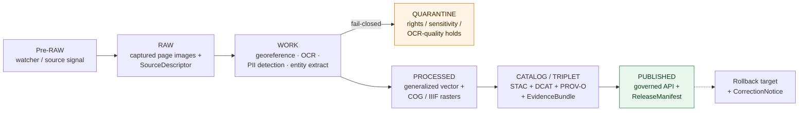

<!-- [KFM_META_BLOCK_V2]
doc_id: kfm://doc/docs-sources-catalog-blm-glo-field-notes
title: BLM GLO Field Notes
type: product-page
version: v0.2
status: draft
owners: <PLACEHOLDER — Docs steward + Source steward for blm>
created: 2026-05-20
updated: 2026-05-20
policy_label: public
related:
  - docs/sources/catalog/blm/README.md
  - docs/sources/catalog/README.md
  - docs/sources/catalog/blm/IDENTITY.md
  - docs/sources/catalog/blm/RIGHTS-AND-SENSITIVITY-MAP.md
  - docs/sources/catalog/_examples/stac-item-example.json
  - docs/doctrine/directory-rules.md
tags: [kfm, docs, sources, catalog, blm, glo, plss, cadastral, historical]
notes:
  - "PROPOSED product-page scaffold; sibling-link presence verified in Claude Code session."
  - "PROPOSED content sourced from Pass 23/32 atlas (KFM-P2-IDEA-0016, KFM-P2-PROG-0011) and Pass 10 (C4-01); descriptor fields intentionally not restated here."
[/KFM_META_BLOCK_V2] -->

# BLM GLO Field Notes

> Narrative cadastral survey records that accompany the original General Land Office (GLO) plats — treated in KFM as a 19th-century **historical layer** beside the present-day BLM CadNSDI cadastre.

**Status:** PROPOSED — scaffold only · **Family:** [`blm`](./README.md) · **Owners:** _PLACEHOLDER — Docs steward + Source steward for `blm`_ · **Last reviewed:** 2026-05-20

> [!IMPORTANT]
> This is a **scaffold product page**. It points readers at the authoritative homes for source identity, rights, sensitivity, and contract shape; it **does not restate** them. The authoritative `SourceDescriptor` lives in [`data/registry/sources/`](../../../../data/registry/sources/). PROPOSED.

---

## Quick jump

- [Overview](#overview)
- [Source authority](#source-authority)
- [Pipeline shape (KFM lifecycle)](#pipeline-shape-kfm-lifecycle)
- [Catalog profiles used](#catalog-profiles-used)
- [Collection identity](#collection-identity)
- [Provenance fields](#provenance-fields)
- [Temporal handling](#temporal-handling)
- [Geometry and projection](#geometry-and-projection)
- [Rights and sensitivity](#rights-and-sensitivity)
- [Validation and catalog closure](#validation-and-catalog-closure)
- [Related contracts and schemas](#related-contracts-and-schemas)
- [Related connectors and pipelines](#related-connectors-and-pipelines)
- [Examples](#examples)
- [Open questions](#open-questions)
- [Atlas-card references (collapsible)](#atlas-card-references)
- [Related docs](#related-docs)

---

## Overview

PROPOSED. The BLM **General Land Office (GLO) Field Notes** are the surveyor's narrative record taken alongside the GLO plats during the original 19th-century cadastral surveys of the public domain. KFM treats them as a **historical** layer, distinct from but join-keyable to the present-day **BLM CadNSDI** cadastre, on township / range / section keys where possible. CONFIRMED doctrine (KFM-P2-IDEA-0016): *"PLSS data is sourced from BLM's Cadastral National Spatial Data Infrastructure (CadNSDI) for the canonical present-day cadastre. GLO (General Land Office) historical survey plats are ingested separately as a historical layer."*

PROPOSED (KFM-P2-PROG-0011): Field notes are **OCR'd**, then run through **PII detection** to redact incidental personal names, after which structured semantic entities (soil, vegetation, feature types such as *"wagon trail"*, *"stone mound"*, *"dwelling"*) are extracted. Raster originals are retained; vector outputs feed the PLSS control plane.

> [!NOTE]
> NEEDS VERIFICATION: cadence, geographic coverage of the Kansas subset, current endpoint URL(s), license terms, OCR/PII toolchain selection, and historical-feature taxonomy normalization. Resolution belongs in the authoritative `SourceDescriptor` and in an ADR-class decision per Directory Rules §2.4.

[Back to top](#top)

---

## Source authority

See [`data/registry/sources/`](../../../../data/registry/sources/) for the authoritative `SourceDescriptor`. **Do not duplicate descriptor fields here.** PROPOSED placement per Directory Rules §6 (responsibility roots) and KFM-P1-PROG-0007 (every admitted source carries a descriptor recording identity, role, rights posture, update cadence, authority scope, and verification obligations).

| Authority surface | Where it lives | What it owns | Restated here? |
|---|---|---|---|
| `SourceDescriptor` | [`data/registry/sources/`](../../../../data/registry/sources/) | Identity, role, rights, cadence, sensitivity | **No** — pointer only |
| Family overview & sibling links | [`./README.md`](./README.md) | Family-level orientation for `blm` | **No** — see family README |
| Collection identity rules | [`./IDENTITY.md`](./IDENTITY.md) | `kfm-<org>-<product>` pattern, namespace | **No** — see IDENTITY |
| Rights & sensitivity mapping | [`./RIGHTS-AND-SENSITIVITY-MAP.md`](./RIGHTS-AND-SENSITIVITY-MAP.md) | Tiering and release class | **No** — see map |
| Contract shape | `schemas/contracts/v1/source/` | JSON-schema for the descriptor object | **No** — per ADR-0001 |

[Back to top](#top)

---

## Pipeline shape (KFM lifecycle)

CONFIRMED doctrine / PROPOSED lane application: BLM GLO Field Notes follow the canonical lifecycle invariant **RAW → WORK/QUARANTINE → PROCESSED → CATALOG/TRIPLET → PUBLISHED**, where each transition is a governed state change — not a file move (Directory Rules §3, Connected-Dots Architecture Brief §4).

PROPOSED — diagram reflects KFM doctrine; specific gate names, validators, and connector boundaries for this product **NEED VERIFICATION** against `pipeline_specs/` and `pipelines/` once the repo is mounted.

[Back to top](#top)

---

## Catalog profiles used

PROPOSED. The catalog projection set this product participates in. Lanes follow Directory Rules §6 and Pass-10 C4 (Catalogs and Metadata Profiles). Update per-row once verified against `data/catalog/` artifacts.

| Profile | Lane | Used by this product? |
|---|---|---|
| STAC | `data/catalog/stac/` | PROPOSED — Yes / No (NEEDS VERIFICATION) |
| DCAT | `data/catalog/dcat/` | PROPOSED — Yes / No (NEEDS VERIFICATION) |
| PROV-O | `data/catalog/prov/` | PROPOSED — Yes / No (NEEDS VERIFICATION) |
| Domain projection | `data/catalog/domain/<domain>/` | PROPOSED — Yes / No (NEEDS VERIFICATION) |

[Back to top](#top)

---

## Collection identity

- PROPOSED Collection id pattern: `kfm-<org>-<product>` — see [`IDENTITY.md`](./IDENTITY.md) for the canonical rule.
- PROPOSED namespace: `kfm:` — *see [OPEN-DSC-03](#open-questions); Pass-10 C4-01 records the `kfm:` vs `ks-kfm:` choice as an unresolved namespace question.*
- Asset roles (cover, page-image, vector-extract, ocr-text, entity-extract, etc.): NEEDS VERIFICATION — confirm against `schemas/contracts/v1/source/`.

[Back to top](#top)

---

## Provenance fields

CONFIRMED doctrine (Pass-10 C4-01): STAC Items carry an `item.properties.kfm:provenance` block. The fields below are the doctrinal set; **per-product values** are PROPOSED until verified against emitted artifacts in `data/catalog/stac/`.

| Field | Type / form | Role |
|---|---|---|
| `spec_hash` | `sha256` of canonical record (JCS+SHA-256) | Identity anchor; the spec-hash gate is fail-closed at promotion |
| `evidence_bundle_ref` | `kfm://evidence/<digest>` | Resolves to the `EvidenceBundle` carrying receipts, validations, sources |
| `run_record_ref` | `kfm://run/<run-id>` | Pointer to the immutable `RunReceipt` for the producing run |
| `audit_ref` | `kfm://audit/<attestation-id>` | SLSA / OPA attestation reference |
| `policy_digest` | `sha256` of the policy bundle | Records the policy set in force at promotion (C5-03 parity) |

Per-asset integrity: `file:checksum` on each STAC asset. PROPOSED — confirm exact key names against the STAC linter once available.

[Back to top](#top)

---

## Temporal handling

CONFIRMED doctrine / PROPOSED per-product: KFM keeps **source / observed / valid / retrieval / release / correction** times distinct wherever material (Domain Atlas, operating-law invariant 1).

| Time facet | What it means for GLO Field Notes | Status |
|---|---|---|
| Source time | Date the surveyor took the original note (often 19th C.) | PROPOSED |
| Observed time | Event the note describes (may match source time) | PROPOSED |
| Valid time | Period the recorded condition was true on the ground | NEEDS VERIFICATION |
| Retrieval time | When KFM fetched / scanned the page image | PROPOSED |
| Release time | When the catalog entry was promoted to PUBLISHED | PROPOSED |
| Correction time | When a `CorrectionNotice` or `RollbackCard` superseded a prior release | PROPOSED |

[Back to top](#top)

---

## Geometry and projection

PROPOSED. Per KFM-P2-PROG-0011, GLO outputs are dual-shape:

- **Vector** — extracted PLSS control geometry feeds the PLSS control plane (corners, township / section lines).
- **Raster** — page images delivered as **Cloud-Optimized GeoTIFFs (COGs)** with WMTS/XYZ or **IIIF** deep-zoom, originals retained in archive.

NEEDS VERIFICATION — confirm CRS choice (`EPSG:5070` is doctrine for PLSS-overlay SQL per KFM-P26-PROG-0027), generalization rules, and scale-support profile against `data/catalog/` artifacts and `packages/geo/`. The corpus also flags **T/R/S key ambiguity** in fractional sections, irregular townships, and resurvey areas — the watcher is to **fail-closed** on key ambiguity and preserve original strings for audit (KFM-P2-IDEA-0016, tensions).

[Back to top](#top)

---

## Rights and sensitivity

NEEDS VERIFICATION — see [`policy/sensitivity/`](../../../../policy/sensitivity/) and [`RIGHTS-AND-SENSITIVITY-MAP.md`](./RIGHTS-AND-SENSITIVITY-MAP.md). **Do not restate policy here.**

> [!WARNING]
> PROPOSED (KFM-P2-PROG-0011, tensions): some plats and field notes contain **incidental handwritten personal information** (names of settlers, claimants, neighbors); the PII-redaction step must be reliable **before public release**. Additionally, some recorded sites (mounds, structures, dwellings) carry **archaeological sensitivity** under CARE / FAIR governance and must not be published at point precision — generalization or denial applies (cross-reference: KFM-P29-PROG-0019 archaeology redaction validator; ML-061-158/159 sensitive-geometry rules).

PROPOSED sensitivity posture for this product:
- Default-deny on PII-suspected pages until redaction receipt is signed.
- Generalize archaeological-sensitive feature extractions; no exact coordinates.
- Maintain `CARE` block in the catalog projection (Pass-10 C15-01 / C15-02).

[Back to top](#top)

---

## Validation and catalog closure

PROPOSED gate set for this product. **Catalog closure is required before public release** (Pass-10 / KFM-P1-IDEA-0020).

- **STAC Projection lint** — KFM-P27-FEAT-0003 — PROPOSED.
- **STAC checksum closure** against the `ReleaseManifest` digest — KFM-P22-PROG-0037 — PROPOSED.
- **Spec-hash-match gate** (C5-04) — PROPOSED; recomputed `spec_hash` must equal asserted value.
- **OPA default-deny on CARE-tagged assets** (C15-03) — PROPOSED — applies wherever `authority_to_control` or sensitive-geometry flags are non-empty.
- **PII-redaction receipt** — PROPOSED — required before transition from QUARANTINE → PROCESSED for OCR-bearing pages.

NEEDS VERIFICATION — concrete validator names, fixture paths, and CI workflow files in `tools/validators/` and `.github/workflows/`.

[Back to top](#top)

---

## Related contracts and schemas

- `contracts/` — semantic meaning for GLO field-note objects. NEEDS VERIFICATION.
- `schemas/contracts/v1/source/` — per **ADR-0001** (canonical schema home).
- `schemas/contracts/v1/domains/<domain>/` — domain projection shapes, if any.

PROPOSED — exact files NEED VERIFICATION once the repo is mounted.

[Back to top](#top)

---

## Related connectors and pipelines

- `connectors/blm/` — source fetchers for the `blm` family.
- `pipelines/ingest/`, `pipelines/normalize/`, `pipelines/validate/`, `pipelines/catalog/` — lifecycle stages.
- `pipeline_specs/<domain>/` — declarative specs.

PROPOSED — module file names NEED VERIFICATION.

[Back to top](#top)

---

## Examples

*(Illustrative only — do not treat as authoritative.)*

See [`_examples/stac-item-example.json`](../_examples/stac-item-example.json) for the minimal STAC + `kfm:provenance` shape. The example is a **shape sketch**, not a released item — it does not assert any real `spec_hash`, `evidence_bundle_ref`, or release state.

[Back to top](#top)

---

## Open questions

- **OPEN-DSC-01** — Confirm cadence and current endpoint URL(s) for the BLM GLO Field Notes source. NEEDS VERIFICATION — resolution belongs in `SourceDescriptor`.
- **OPEN-DSC-02** — Confirm rights posture (federal public domain inheritance vs aggregator overlays) and CARE applicability where field notes touch sensitive-site geographies. NEEDS VERIFICATION.
- **OPEN-DSC-03** — `kfm:` vs `ks-kfm:` namespace choice (Pass-10 C4-01). UNKNOWN — awaits ADR.
- **OPEN-FAM-01** — Whether this product warrants its own STAC Collection or shares a `blm-glo` Collection with sibling products (e.g., GLO Plats). NEEDS VERIFICATION.
- **OPEN-FAM-02** — Standardization of historical-feature taxonomy (*wagon trail*, *stone mound*, *dwelling*) across decades of survey notes (KFM-P2-PROG-0011, open question). NEEDS VERIFICATION.
- **OPEN-FAM-03** — PII-redaction toolchain choice and acceptance threshold for handwritten-text recall (KFM-P2-PROG-0011, dependencies). NEEDS VERIFICATION.

[Back to top](#top)

---

## Atlas-card references

<b>Pass 23/32 atlas cards backing this page (click to expand)</b>

These are the KFM atlas cards from which the PROPOSED content above is sourced. They are doctrinal carriers — they do **not** assert mounted-repo implementation. Each card's own truth labels apply.

- **KFM-P2-IDEA-0016** — *BLM CadNSDI as the canonical PLSS source, GLO records as historical layer.* Class: idea · Category: MOD · Status: active · Pass 32 spec hash: `sha256:d2cac160ff7ecba29ad33e49965c634cef4e94e1095d7faab3d3514c9020e6ea`.
- **KFM-P2-PROG-0011** — *BLM CadNSDI and GLO records ingest as the cadastral spine.* Class: programming · Category: PIP · Status: active · Pass 32 spec hash: `sha256:fea9d7b55c74aea098eacd7aecadb16f387f2bd7b382004f04300e2865ea260e`. Includes the PROPOSED OCR + PII + entity-extract treatment for field notes, the COG / IIIF raster delivery, and the Tippecanoe / Planetiler vector path.
- **KFM-P26-PROG-0028** — *PLSS corner-line schemas.* PROPOSED schema posture (source role, survey hierarchy, geometry validity, `EvidenceBundle` reference, tile identity, rollback-ready release metadata).
- **KFM-P25-PROG-0027** — *PLSS context layer descriptor.* PROPOSED — cadastral survey hierarchy, township/section features, source URI, non-title context limitations.
- **KFM-P17-PROG-0042** — *Public authority catalog connector set* — includes BLM GLO among authority connectors. PROPOSED.

Pass-10 references:
- **C4-01** — STAC Item `kfm:provenance` namespace (CONFIRMED).
- **C4-02** — STAC Collection with KFM governance description (CONFIRMED).
- **C4-04** — Evidence-Bundle JSON-LD content addressing (CONFIRMED).
- **C5-02 / C5-04** — Default-deny promotion + spec-hash-match gate (CONFIRMED).
- **C15-01..03** — CARE MetaBlock v2, `kfm:care` extension, OPA default-deny on CARE-tagged assets (CONFIRMED).

[Back to top](#top)

---

## Related docs

- [`docs/sources/catalog/blm/README.md`](./README.md) — `blm` family landing page.
- [`docs/sources/catalog/blm/IDENTITY.md`](./IDENTITY.md) — Collection-id and namespace rules for the family.
- [`docs/sources/catalog/blm/RIGHTS-AND-SENSITIVITY-MAP.md`](./RIGHTS-AND-SENSITIVITY-MAP.md) — Rights / sensitivity tiering for `blm`.
- [`docs/sources/catalog/README.md`](../../README.md) — Catalog of source families.
- [`docs/sources/catalog/_examples/stac-item-example.json`](../_examples/stac-item-example.json) — Illustrative STAC + `kfm:provenance` shape.
- [`docs/doctrine/directory-rules.md`](../../../../docs/doctrine/directory-rules.md) — Placement authority.
- _TODO_ — `docs/standards/STAC_KFM_PROFILE.md` (PROPOSED, Pass-10 C4-01 expansion).
- _TODO_ — `docs/standards/PROV.md` _(or `PROVENANCE.md`, naming question per Directory Rules §18 OPEN-DR-01)_.

---

_Last updated: **2026-05-20** · doc version **v0.2** · status **draft / PROPOSED scaffold**_

[Back to top](#top)
