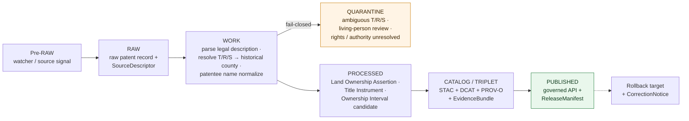

<!-- [KFM_META_BLOCK_V2]
doc_id: kfm://doc/docs-sources-catalog-blm-glo-land-patents
title: BLM GLO Land Patents
type: product-page
version: v0.2
status: draft
owners: <PLACEHOLDER — Docs steward + Source steward for blm>
created: 2026-05-20
updated: 2026-05-20
policy_label: public
related:
  - docs/sources/catalog/blm/README.md
  - docs/sources/catalog/blm/IDENTITY.md
  - docs/sources/catalog/blm/RIGHTS-AND-SENSITIVITY-MAP.md
  - docs/sources/catalog/blm/glo-plats.md
  - docs/sources/catalog/blm/glo-field-notes.md
  - docs/sources/catalog/README.md
  - docs/sources/catalog/_examples/stac-item-example.json
  - docs/doctrine/directory-rules.md
tags: [kfm, docs, sources, catalog, blm, glo, land-patents, title, people-dna-land, frontier-matrix]
notes:
  - "PROPOSED product-page scaffold; sibling-link presence verified in Claude Code session."
  - "PROPOSED content sourced from Pass 23/32 atlas (KFM-P29-IDEA-0016, KFM-P17-PROG-0014, KFM-P2-IDEA-0016, KFM-P2-PROG-0011) and Pass 10 (C4-01, C15-01..03); descriptor fields intentionally not restated here."
[/KFM_META_BLOCK_V2] -->

# BLM GLO Land Patents

> Federal land **conveyance and title records** for the Public Land States, **1820–present** — modeled in KFM as **evidence-bound temporal land assertions**, not as simple map labels.

**Status:** PROPOSED — scaffold only · **Family:** [`blm`](./README.md) · **Owners:** _PLACEHOLDER — Docs steward + Source steward for `blm`_ · **Last reviewed:** 2026-05-20

> [!IMPORTANT]
> This is a **scaffold product page**. It points readers at the authoritative homes for source identity, rights, sensitivity, and contract shape; it **does not restate** them. The authoritative `SourceDescriptor` lives in [`data/registry/sources/`](../../../../data/registry/sources/). PROPOSED.

> [!WARNING]
> **Patents are person-bearing.** Patentee names are the *primary content*, not incidental — so this product carries the People/DNA/Land **living-person policy** by default, not the Field-Notes-style "redact incidental PII" posture. See [Rights and sensitivity](#rights-and-sensitivity).

---

## Quick jump

- [Overview](#overview)
- [What this product is *not*](#what-this-product-is-not)
- [Source authority](#source-authority)
- [Pipeline shape (KFM lifecycle)](#pipeline-shape-kfm-lifecycle)
- [Catalog profiles used](#catalog-profiles-used)
- [Collection identity](#collection-identity)
- [Provenance fields](#provenance-fields)
- [Temporal handling](#temporal-handling)
- [Geometry and legal description](#geometry-and-legal-description)
- [Patentee identity and person-bearing fields](#patentee-identity-and-person-bearing-fields)
- [Rights and sensitivity](#rights-and-sensitivity)
- [Cross-domain consumers](#cross-domain-consumers)
- [Validation and catalog closure](#validation-and-catalog-closure)
- [Related contracts and schemas](#related-contracts-and-schemas)
- [Related connectors and pipelines](#related-connectors-and-pipelines)
- [Examples](#examples)
- [Open questions](#open-questions)
- [Atlas-card references (collapsible)](#atlas-card-references)
- [Related docs](#related-docs)

---

## Overview

PROPOSED. **BLM General Land Office (GLO) Land Patents** are the federal government's **conveyance instruments** transferring public-domain land into private (or state, railroad, military-bounty, tribal-allotment, etc.) ownership. Patents are *title* records — the legal hinge of the U.S. cadastral chain — and span roughly **1820 to the present**.

CONFIRMED doctrine (KFM-P29-IDEA-0016): *"GLO land patents should be modeled as evidence-bound temporal land assertions rather than as simple map labels."* PROPOSED (KFM-P17-PROG-0014): patent records should parse **township / range / section**, normalize to **county by historical boundary time slice**, and **retain the raw legal description** as auditable evidence.

In KFM, a land patent is an **assertion**: at a particular `patent_date`, a named **patentee** received title to a specific **aliquot of the PLSS** under a specific **authority** (e.g., Homestead Act of 1862, Cash Sale, Military Bounty Land Warrant, Timber Culture Act, Railroad Grant). The product surface is therefore closer to **title-instrument evidence** than to a map layer.

> [!NOTE]
> NEEDS VERIFICATION: cadence, Kansas-subset coverage, current endpoint URL(s), license terms, patentee-name normalization toolchain, historical-county crosswalk source, and whether the source is treated as **authority** (title truth) or **observation** (digitized index of the underlying paper record). Resolution belongs in the authoritative `SourceDescriptor` and in an ADR-class decision per Directory Rules §2.4.

[Back to top](#top)

---

## What this product is *not*

PROPOSED — bounding the product is as important as defining it:

- **Not the present-day cadastre.** That role belongs to **BLM CadNSDI** (KFM-P2-IDEA-0016).
- **Not the original survey narrative.** That role belongs to [**GLO Field Notes**](./glo-field-notes.md).
- **Not the plat-image record.** That role belongs to **GLO Plats** (the raster survey-product sibling).
- **Not assessor/tax data.** PROPOSED doctrine (People/DNA/Land K): *"assessor-as-title denial"* — assessor records and parcel geometry are **not title truth** and must not be conflated with patents.
- **Not chain-of-title in itself.** A patent is the *first link* in the chain only. Subsequent deeds, mortgages, easements, and probate instruments belong to their own product surfaces under the same family.

[Back to top](#top)

---

## Source authority

See [`data/registry/sources/`](../../../../data/registry/sources/) for the authoritative `SourceDescriptor`. **Do not duplicate descriptor fields here.** PROPOSED placement per Directory Rules §6 (responsibility roots) and KFM-P1-PROG-0007 (every admitted source carries a descriptor recording identity, role, rights posture, update cadence, authority scope, and verification obligations).

| Authority surface | Where it lives | What it owns | Restated here? |
|---|---|---|---|
| `SourceDescriptor` | [`data/registry/sources/`](../../../../data/registry/sources/) | Identity, source role, rights, cadence, sensitivity, authority class | **No** — pointer only |
| Family overview & sibling links | [`./README.md`](./README.md) | Family-level orientation for `blm` | **No** — see family README |
| Collection identity rules | [`./IDENTITY.md`](./IDENTITY.md) | `kfm-<org>-<product>` pattern, namespace | **No** — see IDENTITY |
| Rights & sensitivity mapping | [`./RIGHTS-AND-SENSITIVITY-MAP.md`](./RIGHTS-AND-SENSITIVITY-MAP.md) | Tiering, living-person review, release class | **No** — see map |
| Contract shape | `schemas/contracts/v1/source/` and `schemas/contracts/v1/domains/people-dna-land/` | JSON-schema for descriptor + Land Ownership Assertion / Title Instrument | **No** — per ADR-0001 |

[Back to top](#top)

---

## Pipeline shape (KFM lifecycle)

CONFIRMED doctrine / PROPOSED lane application: BLM GLO Land Patents follow the canonical lifecycle invariant **RAW → WORK/QUARANTINE → PROCESSED → CATALOG/TRIPLET → PUBLISHED**, where each transition is a governed state change — not a file move (Directory Rules §3, Connected-Dots Architecture Brief §4).

PROPOSED — diagram reflects KFM doctrine; specific gate names, validators, and connector boundaries for this product **NEED VERIFICATION** against `pipeline_specs/` and `pipelines/` once the repo is mounted. The **WORK → QUARANTINE** branch is doctrinally fail-closed on T/R/S key ambiguity (KFM-P2-IDEA-0016 tensions) and on unresolved living-person status (People/DNA/Land I).

[Back to top](#top)

---

## Catalog profiles used

PROPOSED. The catalog projection set this product participates in. Lanes follow Directory Rules §6 and Pass-10 C4 (Catalogs and Metadata Profiles). Update per-row once verified against `data/catalog/` artifacts.

| Profile | Lane | Used by this product? |
|---|---|---|
| STAC | `data/catalog/stac/` | PROPOSED — Yes / No (NEEDS VERIFICATION) |
| DCAT | `data/catalog/dcat/` | PROPOSED — Yes / No (NEEDS VERIFICATION) |
| PROV-O | `data/catalog/prov/` | PROPOSED — Yes / No (NEEDS VERIFICATION) |
| Domain projection (`people-dna-land`) | `data/catalog/domain/people-dna-land/` | PROPOSED — Yes (primary domain home) |
| Domain projection (`frontier-matrix`) | `data/catalog/domain/frontier-matrix/` | PROPOSED — Yes (Land Office Record context) |

[Back to top](#top)

---

## Collection identity

- PROPOSED Collection id pattern: `kfm-<org>-<product>` — see [`IDENTITY.md`](./IDENTITY.md) for the canonical rule.
- PROPOSED namespace: `kfm:` — *see [OPEN-DSC-03](#open-questions); Pass-10 C4-01 records the `kfm:` vs `ks-kfm:` choice as an unresolved namespace question.*
- Asset roles (record-image, parsed-record, legal-description-raw, legal-description-parsed, ownership-assertion, title-instrument, etc.): NEEDS VERIFICATION — confirm against `schemas/contracts/v1/source/` and `schemas/contracts/v1/domains/people-dna-land/`.

[Back to top](#top)

---

## Provenance fields

CONFIRMED doctrine (Pass-10 C4-01): STAC Items carry an `item.properties.kfm:provenance` block. The fields below are the doctrinal set; **per-product values** are PROPOSED until verified against emitted artifacts in `data/catalog/stac/`.

| Field | Type / form | Role |
|---|---|---|
| `spec_hash` | `sha256` of canonical record (JCS+SHA-256) | Identity anchor; the spec-hash gate is fail-closed at promotion |
| `evidence_bundle_ref` | `kfm://evidence/<digest>` | Resolves to the `EvidenceBundle` carrying receipts, validations, source citations, and raw legal description |
| `run_record_ref` | `kfm://run/<run-id>` | Pointer to the immutable `RunReceipt` for the producing run |
| `audit_ref` | `kfm://audit/<attestation-id>` | SLSA / OPA attestation reference |
| `policy_digest` | `sha256` of the policy bundle | Records the policy set in force at promotion (C5-03 parity) |

Per-asset integrity: `file:checksum` on each STAC asset. PROPOSED — for patents specifically, the **raw legal description string** should travel inside the `EvidenceBundle` so downstream reasoners can re-parse without losing audit trail (KFM-P17-PROG-0014).

[Back to top](#top)

---

## Temporal handling

CONFIRMED doctrine / PROPOSED per-product: KFM keeps **source / observed / valid / retrieval / release / correction** times distinct wherever material (Domain Atlas, operating-law invariant 1). Patents have an unusually rich temporal profile because the **valid time of ownership** runs from this patent forward until a subsequent conveyance.

| Time facet | What it means for Land Patents | Status |
|---|---|---|
| Source time | `patent_date` printed on the instrument | PROPOSED |
| Observed time | Date the title actually conveyed (typically == `patent_date`; may differ for delayed-issue patents) | PROPOSED |
| Valid time | The `Ownership Interval` opened by this patent (from `patent_date` to next conveyance or "open") | PROPOSED (see chain-of-title gap tests) |
| Retrieval time | When KFM fetched the digitized record | PROPOSED |
| Release time | When the catalog entry was promoted to PUBLISHED | PROPOSED |
| Correction time | When a `CorrectionNotice` or `RollbackCard` superseded a prior release | PROPOSED |

> [!NOTE]
> Township / range / section keys at `patent_date` may not map cleanly to **today's** county boundaries. PROPOSED (KFM-P17-PROG-0014): T/R/S must be normalized to county **by historical boundary time slice** (e.g., AHCB or equivalent), and the raw legal description must be retained for audit.

[Back to top](#top)

---

## Geometry and legal description

PROPOSED. Patents are **legal-description-first**, not geometry-first. The PLSS aliquot strings (e.g., `SW¼ of NE¼ of Sec. 14, T7S, R12W, 6th P.M.`) are the canonical claim; any rendered polygon is **derived** from those strings via the PLSS control plane.

- **Primary source field** — raw legal-description string, retained verbatim (KFM-P17-PROG-0014).
- **Derived geometry** — built by joining the parsed aliquot against CadNSDI / GLO survey geometry on township / range / section keys (KFM-P2-IDEA-0016).
- **CRS** — NEEDS VERIFICATION; the corpus uses `EPSG:5070` for PLSS-overlay SQL (KFM-P26-PROG-0027) — confirm for this product.
- **Boundary-time-slice normalization** — required (KFM-P17-PROG-0014); patents reference T/R/S as they existed at `patent_date`, which can disagree with present-day administrative geography.

> [!WARNING]
> **Geometry is evidence-derived, not native.** Doctrine (ML-K-077, paraphrased): terrain / derived geometry "should remain evidence-derived and not a 3D default." Display surfaces must show the raw legal description alongside any rendered polygon, and must never present derived geometry as the title fact.

[Back to top](#top)

---

## Patentee identity and person-bearing fields

PROPOSED. Unlike Field Notes, where personal information is incidental and **redacted** before release, the **patentee name is the primary content** of a patent. KFM models this through People/DNA/Land object types (Domains v1.1 ch. 16, scope B):

| Field family | Object type | Domain home |
|---|---|---|
| Patentee identity | `Person Assertion` (one per patent; may be later linked to `PersonCanonical`) | People/DNA/Land |
| The instrument itself | `Title Instrument` (patents are a subtype of `LandInstrument`) | People/DNA/Land |
| Resulting ownership | `Land Ownership Assertion` + `Ownership Interval` | People/DNA/Land |
| Aliquot / parcel reference | `Parcel Version` (T/R/S + aliquot at `patent_date`) | People/DNA/Land |
| Land-office context | `Land Office Record` (which office issued the patent) | Frontier Demography |

PROPOSED identity rule for the patent record itself (Domain Atlas E): *deterministic basis = source id + object role + temporal scope + normalized digest*. Patentee name normalization is a separate identity step that must **not** silently collapse distinct historical persons (PROPOSED test: People assertion evidence tests, Domain Atlas K).

> [!CAUTION]
> Most GLO patentees are deceased historical figures, but the source spans **1820 to the present**. Patents issued in the last ~25 years may name living individuals, who fall under the People/DNA/Land **living-person policy**. Do not assume "historical" implies "no living-person review."

[Back to top](#top)

---

## Rights and sensitivity

NEEDS VERIFICATION — see [`policy/sensitivity/`](../../../../policy/sensitivity/) and [`RIGHTS-AND-SENSITIVITY-MAP.md`](./RIGHTS-AND-SENSITIVITY-MAP.md). **Do not restate policy here.**

PROPOSED sensitivity posture for this product, derived from People/DNA/Land doctrine (Domains v1.1 ch. 16, sections I and N):

- **Living-person policy applies by default** — patents post-dating the configured cutoff require living-person review before publication. NEEDS VERIFICATION on cutoff value.
- **Assessor-as-title denial** — even where assessor or tax-roll data is joined for context, it **cannot stand in** for a patent's title evidence.
- **CARE applicability** — flagged for review where a patent touches **Indian allotment** acts (e.g., Dawes Act allotments), tribal trust land, or other sovereignty-relevant conveyances (Pass-10 C15-01..03).
- **Public-domain inheritance vs aggregator overlays** — federal-source rights flow through; any aggregator's added value (transcription, indexing) may carry separate terms. NEEDS VERIFICATION.

> [!WARNING]
> PROPOSED gate set (Domain Atlas K, People/DNA/Land):
> - *legal-description and chain-of-title gap tests*,
> - *living-person policy tests*,
> - *assessor-as-title denial*,
> - *graph projection safety tests*.
> 
> These must pass before any patent record is promoted to PUBLISHED.

[Back to top](#top)

---

## Cross-domain consumers

PROPOSED. Unlike Field Notes (primarily PLSS / Spatial Foundation), Land Patents are **inherently cross-domain**:

| Consuming domain | What it consumes | Constraint (Domain Atlas F / I) |
|---|---|---|
| **People / DNA / Land** | `Land Ownership Assertion`, `Title Instrument`, `Ownership Interval`, patentee `Person Assertion` | Must preserve ownership, source role, sensitivity, and `EvidenceBundle` support |
| **Frontier Demography / Settlement / Land / Time Matrix** | `Land Office Record`, `Public Land Record` (panel-level land-office aggregates) | Patent-as-context, not patent-as-title |
| **Roads / Rail / Trade** | Railroad-grant patents as corridor-grant evidence | Relation must preserve ownership, source role, sensitivity, EvidenceBundle support |
| **Settlements & Infrastructure** | Patent-date as a settlement-status anchor | Land Office Record as context; not a settlement-status fact alone |

[Back to top](#top)

---

## Validation and catalog closure

PROPOSED gate set for this product. **Catalog closure is required before public release** (Pass-10 / KFM-P1-IDEA-0020).

- **STAC Projection lint** — KFM-P27-FEAT-0003 — PROPOSED.
- **STAC checksum closure** against the `ReleaseManifest` digest — KFM-P22-PROG-0037 — PROPOSED.
- **Spec-hash-match gate** (C5-04) — PROPOSED; recomputed `spec_hash` must equal asserted value.
- **Legal-description parser test suite** — PROPOSED (KFM-P17-PROG-0014); golden fixtures of canonical aliquot strings, including fractional sections and irregular townships.
- **Historical-county crosswalk test** — PROPOSED; verify T/R/S → county at `patent_date` against AHCB or equivalent.
- **Living-person policy gate** — PROPOSED; required for patents whose `patent_date` is within the configured living-person window.
- **Chain-of-title gap audit** — PROPOSED (Domain Atlas K); flags but does not block publication unless paired with a sensitivity escalation.

NEEDS VERIFICATION — concrete validator names, fixture paths, and CI workflow files in `tools/validators/` and `.github/workflows/`.

[Back to top](#top)

---

## Related contracts and schemas

- `contracts/domains/people-dna-land/` — semantic meaning for `LandInstrument`, `Title Instrument`, `Land Ownership Assertion`, `Ownership Interval`. NEEDS VERIFICATION.
- `contracts/domains/frontier-matrix/` — semantic meaning for `Land Office Record`, `Public Land Record`. NEEDS VERIFICATION.
- `schemas/contracts/v1/source/` — per **ADR-0001** (canonical schema home).
- `schemas/contracts/v1/domains/people-dna-land/` — domain projection shapes.

PROPOSED — exact files NEED VERIFICATION once the repo is mounted.

[Back to top](#top)

---

## Related connectors and pipelines

- `connectors/blm/` — source fetchers for the `blm` family.
- `pipelines/ingest/`, `pipelines/normalize/`, `pipelines/validate/`, `pipelines/catalog/` — lifecycle stages.
- `pipeline_specs/people-dna-land/` — declarative spec for the People/DNA/Land projection.
- `pipeline_specs/frontier-matrix/` — declarative spec for the Frontier Matrix Land Office Record projection.

PROPOSED — module file names NEED VERIFICATION.

[Back to top](#top)

---

## Examples

*(Illustrative only — do not treat as authoritative.)*

See [`_examples/stac-item-example.json`](../_examples/stac-item-example.json) for the minimal STAC + `kfm:provenance` shape. The example is a **shape sketch**, not a released item — it does not assert any real `spec_hash`, `evidence_bundle_ref`, or release state.

A patent record's `EvidenceBundle` is PROPOSED to additionally carry:
- The raw legal-description string (verbatim from source).
- The parsed T/R/S/aliquot decomposition.
- The historical-county time slice used for normalization.
- A `Person Assertion` block for the patentee (or a `living-person-pending-review` quarantine marker).

[Back to top](#top)

---

## Open questions

- **OPEN-DSC-01** — Confirm cadence, Kansas-subset coverage, and current endpoint URL(s) for the BLM GLO Land Patents source. NEEDS VERIFICATION — resolution belongs in `SourceDescriptor`.
- **OPEN-DSC-02** — Confirm rights posture (federal public domain inheritance vs aggregator overlays) and CARE applicability for tribal allotment / sovereignty-relevant patents. NEEDS VERIFICATION.
- **OPEN-DSC-03** — `kfm:` vs `ks-kfm:` namespace choice (Pass-10 C4-01). UNKNOWN — awaits ADR.
- **OPEN-FAM-01** — Whether this product warrants its own STAC Collection or shares a `blm-glo` Collection with sibling products (Plats, Field Notes). NEEDS VERIFICATION.
- **OPEN-FAM-02** — Source-role classification: **authority** (federal title truth) or **observation** (digitized index of paper instruments)? Probably authority for the official BLM-issued record; observation for any third-party transcription. NEEDS VERIFICATION.
- **OPEN-FAM-03** — Living-person cutoff value and review workflow. NEEDS VERIFICATION — see People/DNA/Land verification backlog ("Verify living-person policy").
- **OPEN-FAM-04** — Authority-act taxonomy: Homestead Act / Cash Sale / Military Bounty Land Warrant / Timber Culture Act / Railroad Grant / Indian Allotment / Other — should this be a controlled vocabulary in `control_plane/registries/`? NEEDS VERIFICATION.
- **OPEN-FAM-05** — Historical-county crosswalk source (AHCB? state-specific?). NEEDS VERIFICATION.

[Back to top](#top)

---

## Atlas-card references

<b>Pass 23/32 atlas cards backing this page (click to expand)</b>

These are the KFM atlas cards from which the PROPOSED content above is sourced. They are doctrinal carriers — they do **not** assert mounted-repo implementation. Each card's own truth labels apply.

- **KFM-P29-IDEA-0016** — *Land patents as temporal assertions.* Class: idea · Category: MOD · Status: active · Pass 32 spec hash: `sha256:94cfe5a7598026b32236c302a77db6ce533c40aa1cc811075765fb1bb88bc8b4`. *"GLO land patents should be modeled as evidence-bound temporal land assertions rather than as simple map labels."* (PROPOSED.)
- **KFM-P17-PROG-0014** — *GLO legal description normalization.* Class: programming · Category: MOD · Status: active · Pass 32 spec hash: `sha256:2824357d5b65b68fe8d5458b456dd87653891540f67f872942ed05c944b0557c`. *"GLO patent anchors should parse township/range/section, normalize to county by historical boundary time slice, and retain raw legal description."* (PROPOSED.)
- **KFM-P2-IDEA-0016** — *BLM CadNSDI as the canonical PLSS source, GLO records as historical layer.* Class: idea · Category: MOD · Status: active · Pass 32 spec hash: `sha256:d2cac160ff7ecba29ad33e49965c634cef4e94e1095d7faab3d3514c9020e6ea`. (CONFIRMED normalized statement; PROPOSED expansion.)
- **KFM-P2-PROG-0011** — *BLM CadNSDI and GLO records ingest as the cadastral spine.* Class: programming · Category: PIP · Status: active · Pass 32 spec hash: `sha256:fea9d7b55c74aea098eacd7aecadb16f387f2bd7b382004f04300e2865ea260e`. (PROPOSED ingest pattern — broader card covering plats / field notes / patents.)
- **KFM-P17-PROG-0042** — *Public authority catalog connector set* — includes BLM GLO among authority connectors. PROPOSED.

Domains v1.1 references (consolidated atlas):
- **Ch. 16 — People, Genealogy, DNA, and Land Ownership** — owns `Land Ownership Assertion`, `Title Instrument`, `Ownership Interval`, `Parcel Version`. Source family "patent/deed/mortgage/lien/easement/lease/mineral/water/access/probate instruments" explicitly listed. Validators include *legal-description and chain-of-title gap tests* and *assessor-as-title denial*.
- **Ch. 17 — Frontier Demography / Economy / Settlement / Land / Time Matrix** — owns `Land Office Record` and `Public Land Record` as context.

Pass-10 references:
- **C4-01** — STAC Item `kfm:provenance` namespace (CONFIRMED).
- **C4-02** — STAC Collection with KFM governance description (CONFIRMED).
- **C4-04** — Evidence-Bundle JSON-LD content addressing (CONFIRMED).
- **C5-02 / C5-04** — Default-deny promotion + spec-hash-match gate (CONFIRMED).
- **C15-01..03** — CARE MetaBlock v2, `kfm:care` extension, OPA default-deny on CARE-tagged assets (CONFIRMED).

[Back to top](#top)

---

## Related docs

- [`docs/sources/catalog/blm/README.md`](./README.md) — `blm` family landing page.
- [`docs/sources/catalog/blm/IDENTITY.md`](./IDENTITY.md) — Collection-id and namespace rules for the family.
- [`docs/sources/catalog/blm/RIGHTS-AND-SENSITIVITY-MAP.md`](./RIGHTS-AND-SENSITIVITY-MAP.md) — Rights / sensitivity tiering for `blm` (living-person policy lives here).
- [`docs/sources/catalog/blm/glo-field-notes.md`](./glo-field-notes.md) — Sibling product: narrative survey records.
- _TODO_ — `docs/sources/catalog/blm/glo-plats.md` — Sibling product: raster survey plats.
- _TODO_ — `docs/sources/catalog/blm/cadnsdi.md` — Sibling product: present-day cadastre.
- [`docs/sources/catalog/README.md`](../../README.md) — Catalog of source families.
- [`docs/sources/catalog/_examples/stac-item-example.json`](../_examples/stac-item-example.json) — Illustrative STAC + `kfm:provenance` shape.
- [`docs/doctrine/directory-rules.md`](../../../../docs/doctrine/directory-rules.md) — Placement authority.
- _TODO_ — `docs/standards/STAC_KFM_PROFILE.md` (PROPOSED, Pass-10 C4-01 expansion).
- _TODO_ — `docs/standards/PROV.md` _(or `PROVENANCE.md`, naming question per Directory Rules §18 OPEN-DR-01)_.
- _TODO_ — `docs/domains/people-dna-land/README.md` — Primary consuming domain.
- _TODO_ — `docs/domains/frontier-matrix/README.md` — Secondary consuming domain (Land Office Record context).

---

_Last updated: **2026-05-20** · doc version **v0.2** · status **draft / PROPOSED scaffold**_

[Back to top](#top)
