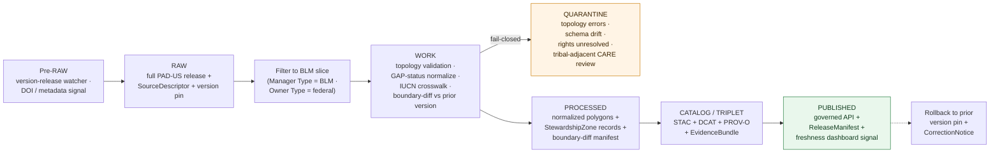

<!-- [KFM_META_BLOCK_V2]
doc_id: kfm://doc/docs-sources-catalog-blm-pad-us
title: BLM PAD-US Federal Lands
type: product-page
version: v0.2
status: draft
owners: <PLACEHOLDER — Docs steward + Source steward for blm>
created: 2026-05-20
updated: 2026-05-20
policy_label: public
related:
  - docs/sources/catalog/blm/README.md
  - docs/sources/catalog/blm/IDENTITY.md
  - docs/sources/catalog/blm/RIGHTS-AND-SENSITIVITY-MAP.md
  - docs/sources/catalog/blm/glo-field-notes.md
  - docs/sources/catalog/blm/glo-land-patents.md
  - docs/sources/catalog/blm/glo-survey-plats.md
  - docs/sources/catalog/README.md
  - docs/sources/catalog/_examples/stac-item-example.json
  - docs/doctrine/directory-rules.md
tags: [kfm, docs, sources, catalog, blm, pad-us, protected-areas, habitat, conservation, gap-status, versioned-context]
notes:
  - "PROPOSED product-page scaffold; sibling-link presence verified in Claude Code session."
  - "PROPOSED content sourced from Pass 23/32 atlas (KFM-P25-PROG-0009, KFM-P25-IDEA-0004, KFM-P25-FEAT-0003) and Pass 10 (C4-01, C15-01..03); descriptor fields intentionally not restated here."
  - "This is the BLM-contributed federal-lands SLICE of PAD-US; the full aggregate dataset is stewarded by USGS Gap Analysis Project — source-role distinction surfaced in §Source authority and OPEN-FAM-01."
[/KFM_META_BLOCK_V2] -->

# BLM PAD-US Federal Lands

> The **BLM-contributed federal-lands slice** of the **Protected Areas Database of the United States (PAD-US)** — a versioned vector polygon dataset of BLM-managed protected and conservation lands (Wilderness, Wilderness Study Areas, National Monuments, National Conservation Areas, ACECs, etc.), modeled in KFM as **versioned habitat context**, not as a sovereign truth root.

**Status:** PROPOSED — scaffold only · **Family:** [`blm`](./README.md) · **Owners:** _PLACEHOLDER — Docs steward + Source steward for `blm`_ · **Last reviewed:** 2026-05-20

> [!IMPORTANT]
> This is a **scaffold product page**. It points readers at the authoritative homes for source identity, rights, sensitivity, and contract shape; it **does not restate** them. The authoritative `SourceDescriptor` lives in [`data/registry/sources/`](../../../../data/registry/sources/). PROPOSED.

> [!WARNING]
> CONFIRMED doctrine (KFM-P25-IDEA-0004, normalized statement PROPOSED): *"NLCD, NWI, PAD-US, GAP/LANDFIRE, and NEON should be treated as **versioned context layers, not as sovereign truth roots**."* Consumers must reference a specific PAD-US version and surface the boundary-diff to any prior version; KFM does not silently coerce PAD-US polygons into authoritative management decisions.

---

## Quick jump

- [Overview](#overview)
- [What this product is *not*](#what-this-product-is-not)
- [Source authority](#source-authority)
- [Pipeline shape (KFM lifecycle)](#pipeline-shape-kfm-lifecycle)
- [Catalog profiles used](#catalog-profiles-used)
- [Collection identity](#collection-identity)
- [Provenance fields](#provenance-fields)
- [Temporal handling](#temporal-handling)
- [Geometry and projection](#geometry-and-projection)
- [PAD-US schema fields](#pad-us-schema-fields)
- [Versioning and boundary-diff strategy](#versioning-and-boundary-diff-strategy)
- [Rights and sensitivity](#rights-and-sensitivity)
- [Cross-domain consumers](#cross-domain-consumers)
- [Freshness dashboard signals](#freshness-dashboard-signals)
- [Validation and catalog closure](#validation-and-catalog-closure)
- [Related contracts and schemas](#related-contracts-and-schemas)
- [Related connectors and pipelines](#related-connectors-and-pipelines)
- [Examples](#examples)
- [Open questions](#open-questions)
- [Atlas-card references (collapsible)](#atlas-card-references)
- [Related docs](#related-docs)

---

## Overview

PROPOSED. The **Protected Areas Database of the United States (PAD-US)** is a national vector polygon dataset of protected areas — federal, state, local, tribal, and non-profit — covering parks, wilderness, conservation easements, wildlife refuges, monuments, and other management designations. The **BLM-contributed federal-lands slice** documented here covers protected and conservation lands managed by the Bureau of Land Management, including (PROPOSED):

- Wilderness Areas and Wilderness Study Areas (WSAs)
- National Conservation Areas (NCAs) and National Monuments under BLM administration
- Areas of Critical Environmental Concern (ACECs)
- BLM National Conservation Lands (NCLs)
- Other BLM-managed designations carrying conservation, recreation, or special-management status

CONFIRMED doctrine (KFM-P25-PROG-0009, PROPOSED normalized statement): *"A PAD-US descriptor should capture protected-area/easement version, GAP status fields, boundary-diff strategy, rights, and source URI."* CONFIRMED doctrine (KFM-P25-IDEA-0004): PAD-US is **versioned habitat context** — KFM consumes the dataset at a pinned version, surfaces boundary diffs between versions, and never treats PAD-US polygons as the management decision itself.

> [!NOTE]
> NEEDS VERIFICATION: cadence (PAD-US is released approximately every 2 years; the current version, dataset DOI, and KFM-pinned version all NEED VERIFICATION), geographic coverage (national dataset; Kansas-relevant features will be sparse but not absent for BLM lands), current endpoint URL(s), and whether KFM consumes PAD-US **from USGS Gap Analysis Project (the aggregator)** or **directly from BLM (the contributor for this slice)** — see [OPEN-FAM-01](#open-questions). Resolution belongs in the authoritative `SourceDescriptor`.

[Back to top](#top)

---

## What this product is *not*

PROPOSED — bounding the product against adjacent concepts:

- **Not a cadastral dataset.** It does not establish title or boundaries in a legal sense. For cadastral truth, consult **BLM CadNSDI**; for historical cadastral context, consult [GLO Plats](./glo-survey-plats.md) / [Field Notes](./glo-field-notes.md) / [Land Patents](./glo-land-patents.md).
- **Not the full national PAD-US dataset.** This product is the **BLM-managed-lands slice only**. Other contributors (NPS, USFWS, USFS, state agencies, NGOs) provide their own slices; a future `usgs-pad-us.md` product page would catalog the aggregate.
- **Not a management decision.** A polygon in PAD-US describes a *current designation*, not a *recommendation*. KFM treats designations as observations recorded by the responsible agency, surfaced through PAD-US.
- **Not real-time.** PAD-US releases are periodic. KFM consumers must reference a pinned version; live management actions (e.g., a new wilderness designation issued today) will not appear until the next PAD-US release.
- **Not the substantive habitat data.** Land cover (NLCD, LANDFIRE, GAP), wetlands (NWI), soils (SSURGO), and species occurrences (GBIF, iNaturalist) are separate context layers. PAD-US records *stewardship designation*, not biophysical state.

[Back to top](#top)

---

## Source authority

See [`data/registry/sources/`](../../../../data/registry/sources/) for the authoritative `SourceDescriptor`. **Do not duplicate descriptor fields here.** PROPOSED placement per Directory Rules §6 and KFM-P1-PROG-0007.

PAD-US has a **dual-authority structure** that the descriptor must record explicitly:

| Authority surface | Where it lives | What it owns | Restated here? |
|---|---|---|---|
| `SourceDescriptor` | [`data/registry/sources/`](../../../../data/registry/sources/) | Identity, source role, rights, cadence, sensitivity, version pin, USGS-aggregator vs BLM-contributor distinction | **No** — pointer only |
| Family overview & sibling links | [`./README.md`](./README.md) | Family-level orientation for `blm` | **No** — see family README |
| Collection identity rules | [`./IDENTITY.md`](./IDENTITY.md) | `kfm-<org>-<product>` pattern, namespace | **No** — see IDENTITY |
| Rights & sensitivity mapping | [`./RIGHTS-AND-SENSITIVITY-MAP.md`](./RIGHTS-AND-SENSITIVITY-MAP.md) | Tiering, CARE applicability for tribal-adjacent designations, release class | **No** — see map |
| Contract shape | `schemas/contracts/v1/source/` and `schemas/contracts/v1/domains/habitat/` | JSON-schema for descriptor + PAD-US-shaped polygon record | **No** — per ADR-0001 |

> [!NOTE]
> PROPOSED source-role posture: **observation** (the BLM is recording its own designations) when consumed via BLM-direct; **observation-via-aggregator** when consumed via USGS PAD-US. Neither role makes PAD-US a substitute for federal-register actions, agency planning documents, or congressional designations — those remain the underlying authority. NEEDS VERIFICATION in `SourceDescriptor`.

[Back to top](#top)

---

## Pipeline shape (KFM lifecycle)

CONFIRMED doctrine / PROPOSED lane application: BLM PAD-US Federal Lands follow the canonical lifecycle invariant **RAW → WORK/QUARANTINE → PROCESSED → CATALOG/TRIPLET → PUBLISHED**, where each transition is a governed state change — not a file move (Directory Rules §3, Connected-Dots Architecture Brief §4).

PROPOSED — diagram reflects KFM doctrine; specific gate names, validators, and connector boundaries for this product **NEED VERIFICATION** against `pipeline_specs/` and `pipelines/`. The pipeline differs from the GLO siblings in two ways: (1) a **slice-filter** step extracts the BLM-managed subset from the full national release, and (2) the **boundary-diff** step is doctrinally required (KFM-P25-PROG-0009) and gates promotion when topology or schema drift is unresolved.

[Back to top](#top)

---

## Catalog profiles used

PROPOSED. The catalog projection set this product participates in. Lanes follow Directory Rules §6 and Pass-10 C4 (Catalogs and Metadata Profiles).

| Profile | Lane | Used by this product? |
|---|---|---|
| STAC | `data/catalog/stac/` | PROPOSED — Yes (Collection per version; Items per management unit or per slice depending on scale) |
| DCAT | `data/catalog/dcat/` | PROPOSED — Yes (dataset-level metadata, DOI) |
| PROV-O | `data/catalog/prov/` | PROPOSED — Yes (slice-filter activity, version-derivation lineage) |
| Domain projection (`habitat`) | `data/catalog/domain/habitat/` | PROPOSED — Yes (primary: PAD-US is named in Habitat source families) |
| Domain projection (`fauna`) | `data/catalog/domain/fauna/` | PROPOSED — Yes (Fauna source family `NLCD/NWI/PAD-US/SSURGO context layers`) |
| Domain projection (`flora`) | `data/catalog/domain/flora/` | PROPOSED — Conditional (vegetation-community consumers) |

[Back to top](#top)

---

## Collection identity

- PROPOSED Collection id pattern: `kfm-<org>-<product>` — see [`IDENTITY.md`](./IDENTITY.md) for the canonical rule.
- PROPOSED namespace: `kfm:` — *see [OPEN-DSC-03](#open-questions); Pass-10 C4-01 records the `kfm:` vs `ks-kfm:` choice as an unresolved namespace question.*
- PROPOSED: one Collection per PAD-US **version pin** (e.g., a v3.0 Collection and a v4.0 Collection coexist with explicit supersession). NEEDS VERIFICATION.
- Asset roles (polygon-vector, attribute-table, gap-status-summary, iucn-crosswalk, boundary-diff-manifest, etc.): NEEDS VERIFICATION — confirm against `schemas/contracts/v1/source/` and `schemas/contracts/v1/domains/habitat/`.

[Back to top](#top)

---

## Provenance fields

CONFIRMED doctrine (Pass-10 C4-01): STAC Items carry an `item.properties.kfm:provenance` block. The fields below are the doctrinal set; **per-product values** are PROPOSED until verified against emitted artifacts in `data/catalog/stac/`.

| Field | Type / form | Role |
|---|---|---|
| `spec_hash` | `sha256` of canonical record (JCS+SHA-256) | Identity anchor; the spec-hash gate is fail-closed at promotion |
| `evidence_bundle_ref` | `kfm://evidence/<digest>` | Resolves to the `EvidenceBundle` carrying receipts, validations, **version pin**, **boundary-diff manifest** |
| `run_record_ref` | `kfm://run/<run-id>` | Pointer to the immutable `RunReceipt` for the producing run |
| `audit_ref` | `kfm://audit/<attestation-id>` | SLSA / OPA attestation reference |
| `policy_digest` | `sha256` of the policy bundle | Records the policy set in force at promotion (C5-03 parity) |

Per-asset integrity: `file:checksum` on each STAC asset. PROPOSED — for PAD-US specifically, the `EvidenceBundle` must carry the **upstream version identifier** (e.g., PAD-US v4.0), the **DOI**, and the **boundary-diff manifest** versus the prior pinned version so consumers can detect designation changes (KFM-P25-PROG-0009).

[Back to top](#top)

---

## Temporal handling

CONFIRMED doctrine / PROPOSED per-product: KFM keeps **source / observed / valid / retrieval / release / correction** times distinct wherever material (Domain Atlas, operating-law invariant 1). PAD-US has a periodic-release pattern; consumers must reason about both **upstream release time** and **KFM ingestion time** explicitly.

| Time facet | What it means for PAD-US | Status |
|---|---|---|
| Source time | Upstream PAD-US release date for the pinned version | PROPOSED |
| Observed time | Date each polygon's designation was made authoritative (often pre-dates the PAD-US release that records it) | NEEDS VERIFICATION — varies per-polygon |
| Valid time | Period the designation was held to be true (from designation forward; superseded by subsequent designation or rescission) | PROPOSED |
| Retrieval time | When KFM fetched the PAD-US release | PROPOSED |
| Release time | When the KFM catalog entry was promoted to PUBLISHED | PROPOSED |
| Correction time | When a `CorrectionNotice` (boundary correction, mis-attributed designation, etc.) superseded a prior KFM release | PROPOSED |

> [!CAUTION]
> A PAD-US release acts as a **point-in-time snapshot** of designations. Designations change between releases (Congressional acts, agency RMPs, ACEC nominations) and will not appear in KFM until the next pinned-version ingest. The freshness dashboard surfaces this lag explicitly.

[Back to top](#top)

---

## Geometry and projection

PROPOSED. PAD-US is delivered as **vector polygon** features (Esri File Geodatabase + shapefile + GeoJSON depending on release). The BLM slice retains the upstream geometry and attribute schema (with KFM-added provenance).

- **CRS** — NEEDS VERIFICATION (the corpus uses `EPSG:5070` for PLSS-overlay SQL per KFM-P26-PROG-0027; confirm whether PAD-US ingestion preserves upstream CRS or reprojects to a KFM-canonical one).
- **Topology** — PROPOSED gate: validate geometry validity (no self-intersection, no zero-area slivers, no orphaned holes) before promotion. NEEDS VERIFICATION against `tools/validators/`.
- **Generalization** — PROPOSED: PAD-US is delivered at the upstream scale; KFM does not generalize before catalog. Downstream tile profiles may carry generalized representations.
- **Scale support** — PROPOSED multi-scale tile profiles for MapLibre / story-node rendering. NEEDS VERIFICATION.

[Back to top](#top)

---

## PAD-US schema fields

PROPOSED. Notable PAD-US attribute fields that KFM should retain and surface (KFM-P25-PROG-0009 names *"GAP status fields"* explicitly; other fields below are PROPOSED based on the general PAD-US schema posture and NEED VERIFICATION against the pinned upstream version):

| Field family | Examples | Role |
|---|---|---|
| GAP Status | `GAP_Sts` (1, 2, 3, 4) | Biodiversity-management category; 1 = strict, 4 = multiple use (PROPOSED — verify against upstream schema) |
| IUCN Category | Ia, Ib, II, III, IV, V, VI, "Other Conservation Area" | International protected-area classification |
| Owner Type / Owner Name | "Federal" / "Bureau of Land Management" | Identifies the holding agency (the BLM slice filter uses this) |
| Manager Type / Manager Name | "Federal" / "BLM" | Identifies the day-to-day management agency |
| Designation Type | "Wilderness Area", "Wilderness Study Area", "National Monument", "ACEC", etc. | Specific designation under which the unit is protected |
| Public Access | "Open", "Restricted", "Closed", "Unknown" | Recreation-access posture |
| Date of Establishment | Year designation made authoritative | Feeds the `observed time` facet |

> [!WARNING]
> PROPOSED — KFM **preserves the upstream schema verbatim** in the WORK lane; any KFM-side crosswalks (e.g., GAP↔IUCN) are advisory derivatives, not authoritative reassignments. Cross-walks are advisory, not authoritative (compare KFM-P2-IDEA-0028 land-cover crosswalk doctrine). NEEDS VERIFICATION.

[Back to top](#top)

---

## Versioning and boundary-diff strategy

PROPOSED. PAD-US is **versioned context** (KFM-P25-IDEA-0004); KFM must reason about versions explicitly:

- **Version pin** — Each PAD-US ingest references a specific upstream version identifier (PROPOSED format: `padus-vX.Y[-patch]`). The descriptor's `SourceDescriptor` carries the pin.
- **Boundary-diff manifest** — When a new version is ingested, KFM produces a diff manifest enumerating: polygons added, removed, geometry-changed beyond a tolerance, attribute-changed, and re-classified (e.g., GAP-status change). KFM-P25-PROG-0009 names this as a required descriptor field.
- **Supersession, not deletion** — A prior PAD-US version remains catalog-discoverable as a historical snapshot; new versions do not delete prior records. Consumers may "freeze" to a specific version when needed.
- **Designation events** — PROPOSED: where the diff manifest records a designation change, KFM may emit a corresponding `DesignationChangeEvent` to the Habitat / Fauna / Flora domains so downstream analyses recompute against the new state.
- **Rollback** — PROPOSED: catalog rollback to a prior pinned version is supported via `RollbackCard`; downstream consumers must re-receive the boundary-diff manifest to recompute.

[Back to top](#top)

---

## Rights and sensitivity

NEEDS VERIFICATION — see [`policy/sensitivity/`](../../../../policy/sensitivity/) and [`RIGHTS-AND-SENSITIVITY-MAP.md`](./RIGHTS-AND-SENSITIVITY-MAP.md). **Do not restate policy here.**

PROPOSED sensitivity posture for this product:

- **Rights** — PAD-US is generally **federal public-domain** when sourced from USGS; aggregator overlays (e.g., third-party hosting) may layer additional terms. PROPOSED: federal-source rights flow through unmodified.
- **CARE applicability** — flagged for **review** where designations touch tribal-relevant geographies (e.g., BLM lands adjacent to or within Indian Country, sacred-site adjacency, areas under co-management or consultation). Pass-10 C15-01..03 default-deny may apply where `authority_to_control` is asserted.
- **Sensitive geometry** — Most PAD-US polygons are **public-precision** (designation boundaries are public). However, some PAD-US records may reference areas where the *contents* (e.g., a rare-species critical habitat, a sacred site, an archaeological zone) are sensitive at point precision. PROPOSED: cross-reference Habitat domain sensitivity controls; do not infer feature-content sensitivity from designation-polygon publicity.
- **Living-person policy** — Not applicable in the GLO-Patents sense; PAD-US records designations, not persons. PROPOSED.

[Back to top](#top)

---

## Cross-domain consumers

PROPOSED. PAD-US is a **multi-domain context feeder** named in Habitat, Fauna, and Flora source family lists (Domains v1.1, ch. on each domain). It is **not** an authority for what land *should* be protected — it is an observation of what *is* designated.

| Consuming domain | What it consumes | Constraint (Domain Atlas F / I) |
|---|---|---|
| **Habitat** (primary) | `PAD-US stewardship context` source family — feeds `StewardshipZone` and `HabitatPatch` context (Domains v1.1, ch. Habitat D / E) | Versioned context; must preserve `EvidenceBundle` support |
| **Fauna** | Part of `NLCD/NWI/PAD-US/SSURGO context layers` source family — feeds occurrence-context joins (Domains v1.1, ch. Fauna D) | Versioned context; must not be conflated with critical-habitat authority (USFWS ECOS) |
| **Flora** | Vegetation-community context where designation correlates with managed habitat type | Versioned context |
| **Hazards** | Fire-management overlap (Wilderness, Wilderness Study Areas have differential suppression policy) | Context only; not a fire-behavior authority |
| **Archaeology** | Designation adjacency for protected sites (without resolving sensitive content) | Context only; sensitive-geometry controls remain in Archaeology domain |
| **Frontier Demography** | Settlement-status context (federal-land withdrawal as a settlement-history marker) | Context only |

[Back to top](#top)

---

## Freshness dashboard signals

PROPOSED. PAD-US participates in the **habitat freshness dashboard** (KFM-P25-FEAT-0003, PROPOSED): *"A habitat source dashboard should show NLCD, NWI, PAD-US, GAP/LANDFIRE, and NEON release dates, DOI or metadata links, last diff, and next watch expectation."*

This product's expected dashboard signals:

| Signal | What it shows | Source |
|---|---|---|
| Pinned version | The PAD-US version KFM currently consumes | `SourceDescriptor` |
| DOI / metadata link | Upstream catalog reference | `SourceDescriptor` |
| Release date | Date the pinned version was released upstream | `SourceDescriptor` |
| Last diff | Summary of the boundary-diff manifest produced at last ingest | `EvidenceBundle` |
| Next watch expectation | Approximate window for the next upstream release | `SourceDescriptor` (watcher cadence) |
| Stale flag | Whether KFM's pinned version is behind a known upstream release | Watcher state |

[Back to top](#top)

---

## Validation and catalog closure

PROPOSED gate set for this product. **Catalog closure is required before public release** (Pass-10 / KFM-P1-IDEA-0020).

- **STAC Projection lint** — KFM-P27-FEAT-0003 — PROPOSED.
- **STAC checksum closure** against the `ReleaseManifest` digest — KFM-P22-PROG-0037 — PROPOSED.
- **Spec-hash-match gate** (C5-04) — PROPOSED; recomputed `spec_hash` must equal asserted value.
- **Topology validation gate** — PROPOSED; polygon geometry must be valid (no self-intersection, no zero-area slivers, no orphaned interior rings).
- **Version-pin gate** — PROPOSED (KFM-P25-PROG-0009); descriptor must declare a specific upstream PAD-US version; "latest" is not a valid pin.
- **Slice-filter integrity gate** — PROPOSED; sum of (in-slice + out-of-slice) features must equal upstream count for the pinned version. Catches filter-rule regressions.
- **Boundary-diff manifest gate** — PROPOSED (KFM-P25-PROG-0009); a non-empty diff against the prior pinned version must be produced and reviewed before promotion. An empty diff requires explicit "no change since vN" attestation.
- **Schema-drift detection** — PROPOSED; PAD-US schemas evolve across major versions; ingest must detect added/removed/renamed fields and quarantine if a destructive change is unresolved.
- **CARE review on tribal-adjacent designations** — PROPOSED; flagged polygons require sensitivity-reviewer sign-off before promotion.

NEEDS VERIFICATION — concrete validator names, fixture paths, and CI workflow files in `tools/validators/` and `.github/workflows/`.

[Back to top](#top)

---

## Related contracts and schemas

- `contracts/domains/habitat/` — semantic meaning for `StewardshipZone`, `HabitatPatch`, `LandCoverObservation`. NEEDS VERIFICATION.
- `schemas/contracts/v1/source/` — per **ADR-0001** (canonical schema home).
- `schemas/contracts/v1/domains/habitat/` — domain projection shapes for PAD-US-derived records.

PROPOSED — exact files NEED VERIFICATION once the repo is mounted.

[Back to top](#top)

---

## Related connectors and pipelines

- `connectors/blm/` — source fetchers for the BLM slice (or upstream USGS-aggregator fetch with a BLM filter; see OPEN-FAM-01).
- `pipelines/ingest/`, `pipelines/normalize/`, `pipelines/validate/`, `pipelines/catalog/` — lifecycle stages.
- `pipelines/watchers/` — version-release watcher for PAD-US (DOI / metadata polling, ETag / conditional GETs).
- `pipeline_specs/habitat/` — declarative spec for the Habitat projection (primary consumer).

PROPOSED — module file names NEED VERIFICATION.

[Back to top](#top)

---

## Examples

*(Illustrative only — do not treat as authoritative.)*

See [`_examples/stac-item-example.json`](../_examples/stac-item-example.json) for the minimal STAC + `kfm:provenance` shape.

A PAD-US BLM-slice `EvidenceBundle` is PROPOSED to additionally carry:
- The pinned upstream version identifier (e.g., `padus-v4.0`) and DOI.
- The slice-filter rule used (PROPOSED: `Manager Type == "BLM" OR Owner Type startswith "BLM"`).
- The slice-filter integrity check (count in, count out).
- The boundary-diff manifest against the prior pinned version.
- A schema-drift report (fields added / removed / renamed since prior version).
- A pointer to the upstream metadata page (DCAT distribution).

[Back to top](#top)

---

## Open questions

- **OPEN-DSC-01** — Confirm cadence (PAD-US release frequency typically ~2 years; verify), current pinned version, DOI, and endpoint URL(s). NEEDS VERIFICATION — resolution belongs in `SourceDescriptor`.
- **OPEN-DSC-02** — Confirm rights posture (USGS public-domain inheritance vs aggregator overlays) and CARE applicability for tribal-adjacent designations. NEEDS VERIFICATION.
- **OPEN-DSC-03** — `kfm:` vs `ks-kfm:` namespace choice (Pass-10 C4-01). UNKNOWN — awaits ADR.
- **OPEN-FAM-01** — **Upstream source choice**: USGS Gap Analysis Project (the PAD-US aggregator) vs BLM-direct for the BLM-managed slice? Probably USGS for consistency with sibling slices and version pinning; BLM-direct as fallback or for pre-release intelligence. NEEDS VERIFICATION — ADR-class question.
- **OPEN-FAM-02** — Whether this product warrants its own STAC Collection or shares a `blm` Collection with the GLO siblings. **Probably its own** because PAD-US lifecycle (versioned national release) is fundamentally different from GLO (historical archival). NEEDS VERIFICATION.
- **OPEN-FAM-03** — Slice-filter rule definition (Manager Type, Owner Type, both, with disjunction or conjunction?). NEEDS VERIFICATION.
- **OPEN-FAM-04** — Boundary-diff tolerance for geometry changes (Hausdorff distance? Area-delta percentage? Both?). NEEDS VERIFICATION.
- **OPEN-FAM-05** — GAP↔IUCN crosswalk authority. KFM should not invent a crosswalk; the upstream PAD-US schema may carry both fields already. NEEDS VERIFICATION.
- **OPEN-FAM-06** — Whether designation changes between PAD-US versions should emit graph events to downstream domains (PROPOSED `DesignationChangeEvent`). NEEDS VERIFICATION.
- **OPEN-FAM-07** — How to surface "stale pin" state to consumers (badge, dashboard chip, both?). Cross-reference [KFM-P3-FEAT-0005](#atlas-card-references) badge family.

[Back to top](#top)

---

## Atlas-card references

<b>Pass 23/32 atlas cards backing this page (click to expand)</b>

These are the KFM atlas cards from which the PROPOSED content above is sourced. They are doctrinal carriers — they do **not** assert mounted-repo implementation. Each card's own truth labels apply.

**PAD-US-specific cards:**
- **KFM-P25-PROG-0009** — *PAD-US source descriptor.* Class: programming · Category: CAT (Catalog, Discovery, Registration) · Status: active · Pass 32 spec hash: `sha256:c4c0cdfde7ef67964b14e6daba9837b47679a3dc3b5c3813936ee4a02283be2d`. PROPOSED: *"A PAD-US descriptor should capture protected-area/easement version, GAP status fields, boundary-diff strategy, rights, and source URI."*
- **KFM-P25-IDEA-0004** — *Habitat source suite as versioned context.* Class: idea · Category: MDP (Metadata, Profiles, Crosswalks) · Status: active · Pass 32 spec hash: `sha256:3a3191cba7e2b99b0f01b5b8a390f585b66329aa62ccdc6d32532b02094e7029`. PROPOSED: *"NLCD, NWI, PAD-US, GAP/LANDFIRE, and NEON should be treated as versioned habitat context layers, not as sovereign truth roots."*
- **KFM-P25-FEAT-0003** — *Habitat freshness dashboard.* Class: feature · Category: CAT · Status: active · Pass 32 spec hash: `sha256:e163ca5ed83ad38166d5f84c02ead9c90183815abc84e94162aff2870f10b1f4`. PROPOSED: *"A habitat source dashboard should show NLCD, NWI, PAD-US, GAP/LANDFIRE, and NEON release dates, DOI or metadata links, last diff, and next watch expectation."*

**Family-shared / adjacent cards:**
- **KFM-P25-IDEA-0011** — *EPA ecoregion PLSS WBD context fabric* — broader "landscape context layers with source roles rather than interchangeable geometry truth" principle that PAD-US participates in.
- **KFM-P2-IDEA-0028** — *USDA CDL, NLCD, LANDFIRE, GAP for land cover* — adjacent "preserve native classification; crosswalks are advisory" doctrine relevant to GAP↔IUCN handling.
- **KFM-P17-PROG-0042** — *Public authority catalog connector set* — BLM among authority connectors. PROPOSED.
- **KFM-P3-FEAT-0005** — *Badge Family for Trust, Gate, Freshness, Source-Role* — informs the freshness dashboard signaling.

**Domains v1.1 references (consolidated atlas):**
- **Habitat domain (ch. on Habitat)** — explicit source family `PAD-US stewardship context` (authority/observation/context/model).
- **Fauna domain (ch. on Fauna)** — `NLCD/NWI/PAD-US/SSURGO context layers` source family.
- **Flora domain (likely parallel)** — NEEDS VERIFICATION.

**Pass-10 references:**
- **C4-01** — STAC Item `kfm:provenance` namespace (CONFIRMED).
- **C4-02** — STAC Collection with KFM governance description (CONFIRMED).
- **C4-04** — Evidence-Bundle JSON-LD content addressing (CONFIRMED).
- **C5-02 / C5-04** — Default-deny promotion + spec-hash-match gate (CONFIRMED).
- **C15-01..03** — CARE MetaBlock v2, `kfm:care` extension, OPA default-deny on CARE-tagged assets (CONFIRMED).

[Back to top](#top)

---

## Related docs

- [`docs/sources/catalog/blm/README.md`](./README.md) — `blm` family landing page.
- [`docs/sources/catalog/blm/IDENTITY.md`](./IDENTITY.md) — Collection-id and namespace rules for the family.
- [`docs/sources/catalog/blm/RIGHTS-AND-SENSITIVITY-MAP.md`](./RIGHTS-AND-SENSITIVITY-MAP.md) — Rights / sensitivity tiering for `blm` (CARE applicability for tribal-adjacent designations).
- [`docs/sources/catalog/blm/glo-field-notes.md`](./glo-field-notes.md) — Sibling product: GLO narrative survey records.
- [`docs/sources/catalog/blm/glo-land-patents.md`](./glo-land-patents.md) — Sibling product: GLO title-instrument records.
- [`docs/sources/catalog/blm/glo-survey-plats.md`](./glo-survey-plats.md) — Sibling product: GLO historic raster plats.
- _TODO_ — `docs/sources/catalog/blm/cadnsdi.md` — Sibling product: present-day cadastre.
- _TODO_ — `docs/sources/catalog/usgs/pad-us.md` — Aggregate-dataset product page (the full national PAD-US, stewarded by USGS GAP).
- [`docs/sources/catalog/README.md`](../../README.md) — Catalog of source families.
- [`docs/sources/catalog/_examples/stac-item-example.json`](../_examples/stac-item-example.json) — Illustrative STAC + `kfm:provenance` shape.
- [`docs/doctrine/directory-rules.md`](../../../../docs/doctrine/directory-rules.md) — Placement authority.
- _TODO_ — `docs/standards/STAC_KFM_PROFILE.md` (PROPOSED, Pass-10 C4-01 expansion).
- _TODO_ — `docs/standards/PROV.md` _(or `PROVENANCE.md`, naming question per Directory Rules §18 OPEN-DR-01)_.
- _TODO_ — `docs/domains/habitat/README.md` — Primary consuming domain.

---

_Last updated: **2026-05-20** · doc version **v0.2** · status **draft / PROPOSED scaffold**_

[Back to top](#top)
