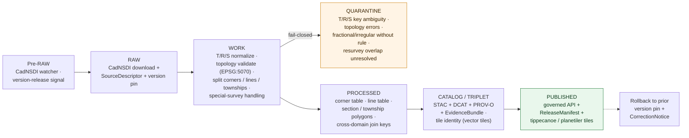

<!-- [KFM_META_BLOCK_V2]
doc_id: kfm://doc/docs-sources-catalog-blm-plss-cadnsdi
title: BLM PLSS / CadNSDI
type: product-page
version: v0.2
status: draft
owners: <PLACEHOLDER — Docs steward + Source steward for blm>
created: 2026-05-20
updated: 2026-05-20
policy_label: public
related:
  - docs/sources/catalog/blm/README.md
  - docs/sources/catalog/blm/IDENTITY.md
  - docs/sources/catalog/blm/RIGHTS-AND-SENSITIVITY-MAP.md
  - docs/sources/catalog/blm/glo-survey-plats.md
  - docs/sources/catalog/blm/glo-field-notes.md
  - docs/sources/catalog/blm/glo-land-patents.md
  - docs/sources/catalog/blm/pad-us.md
  - docs/sources/catalog/README.md
  - docs/sources/catalog/_examples/stac-item-example.json
  - docs/doctrine/directory-rules.md
tags: [kfm, docs, sources, catalog, blm, cadnsdi, plss, cadastre, control-geometry, spatial-foundation, spatial-spine, fgdc]
notes:
  - "PROPOSED product-page scaffold; sibling-link presence verified in Claude Code session."
  - "PROPOSED content sourced from Pass 23/32 atlas (KFM-P2-IDEA-0016, KFM-P2-PROG-0011, KFM-P25-PROG-0027, KFM-P26-PROG-0028, KFM-P26-IDEA-0016, KFM-P26-PROG-0027, KFM-P25-IDEA-0011, KFM-P17-PROG-0014) and Pass 10 (C4-01); descriptor fields intentionally not restated here."
  - "Anchor sibling for the blm family: present-day cadastre; GLO Plats / Field Notes / Land Patents are historical companions; PAD-US is a separate stewardship-context product."
[/KFM_META_BLOCK_V2] -->

# BLM PLSS / CadNSDI

> GIS Public Land Survey System townships, sections, and special surveys per the **FGDC cadastral standard** — the **canonical present-day federal cadastre** maintained by BLM. In KFM, CadNSDI is the **vector control geometry** that anchors the PLSS control plane and the **cross-domain join key** for hydrology, soil, ecology, infrastructure, archaeology, and ownership.

**Status:** PROPOSED — scaffold only · **Family:** [`blm`](./README.md) · **Owners:** _PLACEHOLDER — Docs steward + Source steward for `blm`_ · **Last reviewed:** 2026-05-20

> [!IMPORTANT]
> This is a **scaffold product page**. It points readers at the authoritative homes for source identity, rights, sensitivity, and contract shape; it **does not restate** them. The authoritative `SourceDescriptor` lives in [`data/registry/sources/`](../../../../data/registry/sources/). PROPOSED.

> [!WARNING]
> **Non-title context.** CONFIRMED descriptor requirement (KFM-P25-PROG-0027, PROPOSED): a PLSS descriptor must record **non-title context limitations**. CadNSDI describes the *cadastral survey hierarchy* — corners, lines, sections, townships — it is **not** a title document, **not** a parcel-ownership system, and **not** a chain-of-title authority. For ownership and title, see [GLO Land Patents](./glo-land-patents.md) and downstream deed instruments in the People/DNA/Land domain.

> [!WARNING]
> **Spine status is conditional.** CONFIRMED doctrine (KFM-P26-IDEA-0016, normalized statement PROPOSED): *"PLSS can serve as a spatial spine **only when** corner, line, and tile outputs carry EvidenceBundle enforcement, geometry validators, policy stubs, fixtures, and rollback tests."* Until those guarantees are present in the mounted repo, KFM consumers must treat CadNSDI as **canonical source** rather than **proven spine**.

---

## Quick jump

- [Overview](#overview)
- [What this product is *not*](#what-this-product-is-not)
- [Source authority](#source-authority)
- [Pipeline shape (KFM lifecycle)](#pipeline-shape-kfm-lifecycle)
- [Catalog profiles used](#catalog-profiles-used)
- [Collection identity](#collection-identity)
- [Provenance fields](#provenance-fields)
- [Temporal handling](#temporal-handling)
- [Geometry, projection, and topology](#geometry-projection-and-topology)
- [PLSS hierarchy and identity](#plss-hierarchy-and-identity)
- [Special surveys and irregularities](#special-surveys-and-irregularities)
- [Cross-domain join role](#cross-domain-join-role)
- [Rights and sensitivity](#rights-and-sensitivity)
- [Validation and catalog closure](#validation-and-catalog-closure)
- [Related contracts and schemas](#related-contracts-and-schemas)
- [Related connectors and pipelines](#related-connectors-and-pipelines)
- [Examples](#examples)
- [Open questions](#open-questions)
- [Atlas-card references (collapsible)](#atlas-card-references)
- [Related docs](#related-docs)

---

## Overview

CONFIRMED doctrine (KFM-P2-IDEA-0016, normalized statement): *"PLSS data is sourced from BLM's Cadastral National Spatial Data Infrastructure (CadNSDI) for the canonical present-day cadastre."* CONFIRMED doctrine: *"CadNSDI answers 'what does the present-day legal cadastre say?'; GLO answers 'what did the original survey find?'."* Treating them as separate layers, joined by stable township / range / section keys, preserves their distinct authority.

PROPOSED (KFM-P2-PROG-0011): KFM ingests CadNSDI PLSS **corner points**, **section / township boundaries**, and **metadata**, and treats the corners and lines as **vector control geometry** feeding the PLSS domain control plane (Spatial Foundation H.1). Outputs include validated corner / line tables, generalized vector tiles for renderers, and the cross-domain T/R/S join key used throughout KFM.

PROPOSED (KFM-P25-PROG-0027): the CadNSDI descriptor records **cadastral survey hierarchy**, **township / section features**, **source URI**, and **non-title context limitations**. PROPOSED (KFM-P26-PROG-0028): corner and line schemas additionally record **source role**, **survey hierarchy**, **geometry validity**, **`EvidenceBundle` reference**, **tile identity**, and **rollback-ready release metadata**.

> [!NOTE]
> NEEDS VERIFICATION: current CadNSDI version, cadence, Kansas-subset endpoint URL(s), FGDC cadastral standard version conformance, BLM service identifiers, license / rights text, and the specific NSDI feature class names (Township, Section, Special Survey, etc.) against the current upstream schema. Resolution belongs in the authoritative `SourceDescriptor`.

[Back to top](#top)

---

## What this product is *not*

PROPOSED — bounding CadNSDI is unusually important because it is widely conflated with adjacent concepts:

- **Not a title document.** PROPOSED descriptor requirement (KFM-P25-PROG-0027): *"non-title context limitations"* must be recorded. CadNSDI says *where* the PLSS framework is; it does not say *who owns it*. For title evidence, see [GLO Land Patents](./glo-land-patents.md) (federal originals) and downstream deed instruments in People/DNA/Land.
- **Not the historical record.** Historical survey representation lives in [GLO Survey Plats](./glo-survey-plats.md) (raster) and [GLO Field Notes](./glo-field-notes.md) (narrative). CadNSDI is *present-day* (KFM-P2-IDEA-0016).
- **Not a parcel cadastre.** PLSS is the federal **survey framework** (corners, lines, sections, aliquots). It does **not** carry county assessor-parcel boundaries; those are state / county / municipal cadastres.
- **Not a 3D survey.** PLSS is 2D plan-view geometry. Elevation / terrain context is provided by other Spatial Foundation lanes (3DEP, etc.).
- **Not a tax or boundary jurisdiction.** Administrative boundaries (county, place, jurisdiction) come from TIGER and equivalents; PLSS units and admin units intersect but do not substitute for one another.
- **Not a spatial spine yet.** PROPOSED conditional (KFM-P26-IDEA-0016): spine status is granted only when the enforcement scaffolding is in place. Today: **canonical source**, **prospective spine**.

[Back to top](#top)

---

## Source authority

See [`data/registry/sources/`](../../../../data/registry/sources/) for the authoritative `SourceDescriptor`. **Do not duplicate descriptor fields here.** PROPOSED placement per Directory Rules §6 and KFM-P1-PROG-0007.

| Authority surface | Where it lives | What it owns | Restated here? |
|---|---|---|---|
| `SourceDescriptor` | [`data/registry/sources/`](../../../../data/registry/sources/) | Identity, source role (**authority**), rights, cadence, FGDC conformance, version pin, sensitivity | **No** — pointer only |
| Family overview & sibling links | [`./README.md`](./README.md) | Family-level orientation for `blm` | **No** — see family README |
| Collection identity rules | [`./IDENTITY.md`](./IDENTITY.md) | `kfm-<org>-<product>` pattern, namespace | **No** — see IDENTITY |
| Rights & sensitivity mapping | [`./RIGHTS-AND-SENSITIVITY-MAP.md`](./RIGHTS-AND-SENSITIVITY-MAP.md) | Tiering, CARE applicability for tribal-relevant PLSS extents, release class | **No** — see map |
| Contract shape | `schemas/contracts/v1/source/` and `schemas/contracts/v1/domains/spatial-foundation/` | JSON-schema for descriptor + PLSS corner / line / special-survey records (KFM-P26-PROG-0028) | **No** — per ADR-0001 |

PROPOSED source-role posture: **authority** (BLM is the federal cadastre authority for the public-land states). Even so: authority over the **PLSS framework**, not over **title or ownership**.

[Back to top](#top)

---

## Pipeline shape (KFM lifecycle)

CONFIRMED doctrine / PROPOSED lane application: BLM PLSS / CadNSDI follows the canonical lifecycle invariant **RAW → WORK/QUARANTINE → PROCESSED → CATALOG/TRIPLET → PUBLISHED**, where each transition is a governed state change — not a file move (Directory Rules §3, Connected-Dots Architecture Brief §4).

PROPOSED — diagram reflects KFM doctrine; specific gate names, validators, and connector boundaries for this product **NEED VERIFICATION** against `pipeline_specs/spatial-foundation/` and `pipelines/`. The **WORK → QUARANTINE** branch is doctrinally fail-closed on T/R/S key ambiguity in fractional sections, irregular townships, and areas of resurvey (KFM-P2-IDEA-0016 tensions: *"the watcher fail-closed on key ambiguity and preserve original strings for audit"*).

[Back to top](#top)

---

## Catalog profiles used

PROPOSED. The catalog projection set this product participates in. Lanes follow Directory Rules §6 and Pass-10 C4 (Catalogs and Metadata Profiles).

| Profile | Lane | Used by this product? |
|---|---|---|
| STAC | `data/catalog/stac/` | PROPOSED — Yes (Items per CadNSDI feature class; Collection per version pin) |
| DCAT | `data/catalog/dcat/` | PROPOSED — Yes (dataset-level metadata) |
| PROV-O | `data/catalog/prov/` | PROPOSED — Yes (T/R/S-normalization activity, topology-fix lineage, special-survey resolution) |
| Domain projection (`spatial-foundation`) | `data/catalog/domain/spatial-foundation/` | PROPOSED — Yes (primary domain home; PLSS control plane) |
| Domain projection (cross-domain) | `data/catalog/domain/<consuming-domain>/` | PROPOSED — Conditional (consuming domains reference the canonical PLSS via join key, not by copying geometry) |

[Back to top](#top)

---

## Collection identity

- PROPOSED Collection id pattern: `kfm-<org>-<product>` — see [`IDENTITY.md`](./IDENTITY.md) for the canonical rule.
- PROPOSED namespace: `kfm:` — *see [OPEN-DSC-03](#open-questions); Pass-10 C4-01 records the `kfm:` vs `ks-kfm:` choice as an unresolved namespace question.*
- PROPOSED: one Collection per CadNSDI **version pin** so consumers can freeze to a specific release. NEEDS VERIFICATION.
- Asset roles (corner-points, section-polygons, township-polygons, special-survey-polygons, attribute-tables, vector-tiles, etc.): NEEDS VERIFICATION — confirm against `schemas/contracts/v1/source/` and `schemas/contracts/v1/domains/spatial-foundation/`.

[Back to top](#top)

---

## Provenance fields

CONFIRMED doctrine (Pass-10 C4-01): STAC Items carry an `item.properties.kfm:provenance` block. The fields below are the doctrinal set; **per-product values** are PROPOSED until verified against emitted artifacts in `data/catalog/stac/`.

| Field | Type / form | Role |
|---|---|---|
| `spec_hash` | `sha256` of canonical record (JCS+SHA-256) | Identity anchor; the spec-hash gate is fail-closed at promotion |
| `evidence_bundle_ref` | `kfm://evidence/<digest>` | Resolves to the `EvidenceBundle` carrying receipts, validations, **version pin**, **topology report**, **T/R/S normalization decisions**, and **special-survey resolution notes** |
| `run_record_ref` | `kfm://run/<run-id>` | Pointer to the immutable `RunReceipt` for the producing run |
| `audit_ref` | `kfm://audit/<attestation-id>` | SLSA / OPA attestation reference |
| `policy_digest` | `sha256` of the policy bundle | Records the policy set in force at promotion (C5-03 parity) |

Per-asset integrity: `file:checksum` on each STAC asset. PROPOSED (KFM-P26-PROG-0028): PLSS corner and line records additionally carry **source role**, **survey hierarchy**, **geometry validity**, **`EvidenceBundle` reference**, **tile identity**, and **rollback-ready release metadata** within their domain projection — these are projection-level fields, not duplicates of the STAC `kfm:provenance` block.

[Back to top](#top)

---

## Temporal handling

CONFIRMED doctrine / PROPOSED per-product: KFM keeps **source / observed / valid / retrieval / release / correction** times distinct wherever material (Domain Atlas, operating-law invariant 1). CadNSDI is unusual because the underlying *cadastral framework* is centuries old, while the *digital release* is contemporary; both must remain distinguishable.

| Time facet | What it means for CadNSDI | Status |
|---|---|---|
| Source time | Upstream CadNSDI version release date | PROPOSED |
| Observed time | Date the cadastral feature became authoritative on the ground (often 19th-C survey date; may be resurvey date) | NEEDS VERIFICATION per feature |
| Valid time | Period the feature remained the authoritative cadastral framework (until a resurvey, special survey, or boundary correction supersedes) | PROPOSED |
| Retrieval time | When KFM fetched the CadNSDI release | PROPOSED |
| Release time | When the KFM catalog entry was promoted to PUBLISHED | PROPOSED |
| Correction time | When a `CorrectionNotice` (boundary correction, mis-attributed survey, resurvey overlap) superseded a prior KFM release | PROPOSED |

> [!CAUTION]
> Resurveys, dependent resurveys, and special surveys can cause the **observed time** and **valid time** of a single feature to differ substantially from its **source release date**. The `EvidenceBundle` must preserve enough survey-hierarchy detail (KFM-P25-PROG-0027) for downstream consumers to reason about supersession.

[Back to top](#top)

---

## Geometry, projection, and topology

PROPOSED. CadNSDI is delivered as **vector** features (corner points, section / township boundary lines, polygon coverages). KFM ingests with topology preservation as a fail-closed requirement.

- **CRS** — PROPOSED canonical: **`EPSG:5070`** (NAD83 / Conus Albers) per KFM-P26-PROG-0027 for overlap SQL. Upstream native CRS NEEDS VERIFICATION; a projection-transform receipt records any reprojection (Spatial Foundation `Projection Transform Receipt` object family, Domain Atlas E).
- **Topology gates** — PROPOSED (KFM-P26-PROG-0028): geometry validity is a required schema field. PROPOSED gates: no self-intersection, no zero-area slivers, no orphaned interior rings, no unclosed boundary lines, no corner-line topology mismatch.
- **Overlap SQL** — PROPOSED contract (KFM-P26-PROG-0027): cross-domain overlap with CadNSDI uses *valid geometries, `EPSG:5070`, `ST_Intersection`, deterministic areas, centroid flags, topology flags, and deterministic fallback tie-breakers*.
- **Generalization** — PROPOSED: upstream native scale preserved in PROCESSED; vector tiles for renderers use **Tippecanoe / Planetiler** generalization (KFM-P2-PROG-0011 dependency). Renderer generalization is a downstream `Generalization Transform`, not a re-write of CadNSDI.

[Back to top](#top)

---

## PLSS hierarchy and identity

PROPOSED. The PLSS hierarchy is the spine of KFM's cross-domain join key. CadNSDI records the federal cadastre at each level:

| Level | Identifier | Role |
|---|---|---|
| **Principal Meridian** | P.M. name (e.g., 6th Principal Meridian for Kansas) | Origin point for T/R numbering |
| **Township / Range** | `T<n><N/S>` / `R<n><E/W>` of P.M. | 6-mile × 6-mile grid cell |
| **Section** | 1–36 within Township (standard 6×6 mile grid) | 1-mile × 1-mile cell |
| **Aliquot** | Quarter / Quarter-Quarter (e.g., `SW¼NE¼`) | Sub-section legal description, used by Land Patents |
| **Special Survey** | Donation, mineral, Indian allotment, military reservation, etc. | Survey that does **not** conform to the standard 6×6×36 framework |

PROPOSED identity rule (KFM-P26-PROG-0028 + Domain Atlas E): deterministic basis = source id + object role + temporal scope + normalized digest, with **survey hierarchy** preserved as a structured field — not stuffed into a single string.

> [!NOTE]
> Kansas's primary meridians are the **6th Principal Meridian** (most of the state) and remnants of others along Kansas's borders. NEEDS VERIFICATION against current CadNSDI metadata for the precise meridian set covered by the Kansas subset.

[Back to top](#top)

---

## Special surveys and irregularities

PROPOSED. The PLSS framework is regular **most** of the time, not all of the time. CadNSDI records irregularities that downstream consumers must handle without silently coercing them into the standard 6×6×36 model:

- **Fractional sections** — sections along state lines, water bodies, or P.M. transitions that are smaller than the standard 1 sq. mile.
- **Irregular townships** — townships with section counts other than 36, often near state lines or where surveys met at offsets.
- **Resurveys and dependent resurveys** — re-monumentation of earlier surveys; the original *and* the resurvey both have records, and supersession is governed.
- **Special surveys** — donations (e.g., donation land claims), Indian allotments, military reservations, mineral surveys, town-site surveys, railroad-grant surveys. These do **not** conform to the standard township-section grid and may overlap it.
- **Areas of overlap** — boundary corrections, gap surveys, and historical-survey disputes can produce ambiguous T/R/S keys.

CONFIRMED doctrine (KFM-P2-IDEA-0016, tensions): *"T/R/S keys can be ambiguous in fractional sections, irregular townships, and areas of resurvey; the corpus directs that the **watcher fail-closed on key ambiguity** and **preserve original strings for audit**."* This is the canonical KFM posture for CadNSDI ingest.

> [!WARNING]
> Special-survey records **must** be stored as first-class features, not normalized away into the standard grid. PROPOSED — special-survey resolution rule and schema NEED VERIFICATION; this is an [OPEN-FAM](#open-questions) item.

[Back to top](#top)

---

## Cross-domain join role

PROPOSED. CadNSDI is unique among the `blm` family in that it is **the cross-domain join key** — many other KFM domains reference CadNSDI by T/R/S rather than carrying their own copy of the geometry.

CONFIRMED doctrine (KFM-P2-PROG-0011, why it matters): *"PLSS is the spatial spine of the western U.S.: it gives a federal 'ground truth lattice' for spatial alignment. The cadastral spine also functions as a cross-domain join key (hydrology, soil, ecology, infrastructure, archaeology, ownership)."*

| Consuming domain | Join role | Typical SQL pattern (PROPOSED) |
|---|---|---|
| **People / DNA / Land** | Land Patents join T/R/S/aliquot to a parcel version | `ON patents.tr_s_aliquot = cadnsdi.tr_s_aliquot` (with historical-boundary time slice — KFM-P17-PROG-0014) |
| **Hydrology** | HUC12 overlap with section / township for watershed-by-cadastre rollups | `ST_Intersection(huc12.geom, cadnsdi.section_geom)` at `EPSG:5070` (KFM-P26-PROG-0027) |
| **Soil** | SSURGO map units overlap with section / township | Similar to HUC12 pattern |
| **Habitat / Fauna / Flora** | Sampling-frame definition; spatial-context joins | T/R/S-aware sampling design |
| **Archaeology** | Site-context joins (with sensitive-geometry controls) | T/R/S generalized; never exact point joins for sensitive sites |
| **Roads / Rail / Trade** | Right-of-way overlay context | Geometric intersection at section level |
| **Settlements & Infrastructure** | Municipal-extent overlay context | Geometric intersection |
| **Frontier Demography** | Settlement-status mapping; county boundaries × township grid | Crosswalk product (KFM-P25-IDEA-0011: landscape context fabric) |

> [!IMPORTANT]
> PROPOSED rule (KFM-P25-IDEA-0011): EPA ecoregions, PLSS survey units, and WBD HUC12 boundaries are **landscape context layers with source roles** — they must not be treated as *interchangeable geometry truth*. Each layer keeps its own source identity even when used as a join target.

[Back to top](#top)

---

## Rights and sensitivity

NEEDS VERIFICATION — see [`policy/sensitivity/`](../../../../policy/sensitivity/) and [`RIGHTS-AND-SENSITIVITY-MAP.md`](./RIGHTS-AND-SENSITIVITY-MAP.md). **Do not restate policy here.**

PROPOSED sensitivity posture for this product:

- **Rights** — CadNSDI is generally **federal public-domain** as a BLM-published dataset. Aggregator overlays may layer separate terms. NEEDS VERIFICATION against current upstream rights statement.
- **CARE applicability** — flagged for review where the cadastral framework overlays **Indian allotment surveys**, **tribal trust land**, or other sovereignty-relevant geographies. Pass-10 C15-01..03 default-deny may apply where `authority_to_control` is asserted. PROPOSED.
- **Sensitive geometry** — the cadastral framework itself is generally public-precision. However, joining CadNSDI to **archaeological** features creates sensitive joins; the sensitive-geometry rules (ML-061-158/159: no exact archaeology coordinates, no geometry below H3 r7 for sensitive content) apply to the **join result**, not to CadNSDI as a source. PROPOSED.
- **Living-person policy** — not applicable to CadNSDI itself. PROPOSED.

[Back to top](#top)

---

## Validation and catalog closure

PROPOSED gate set for this product. **Catalog closure is required before public release** (Pass-10 / KFM-P1-IDEA-0020).

- **STAC Projection lint** — KFM-P27-FEAT-0003 — PROPOSED.
- **STAC checksum closure** against the `ReleaseManifest` digest — KFM-P22-PROG-0037 — PROPOSED.
- **Spec-hash-match gate** (C5-04) — PROPOSED.
- **Topology validation gate** — PROPOSED (KFM-P26-PROG-0028); geometry validity is a required schema field.
- **T/R/S key ambiguity gate** — PROPOSED (KFM-P2-IDEA-0016); fail-closed on ambiguous keys; preserve original strings.
- **Special-survey integrity gate** — PROPOSED; special-survey records must not be silently mapped into the standard grid.
- **Resurvey supersession audit** — PROPOSED; where overlapping surveys exist, the supersession chain must be recorded.
- **Cross-domain join determinism test** — PROPOSED (KFM-P26-PROG-0027); overlap SQL must be deterministic (areas, centroid flags, topology flags, deterministic fallback tie-breakers).
- **Spatial-spine gate set** — PROPOSED (KFM-P26-IDEA-0016, **conditional spine doctrine**): a "spine" claim requires:
  - `EvidenceBundle` enforcement on every corner / line / tile artifact;
  - geometry validators wired into CI;
  - policy stubs that explicitly cover PLSS;
  - golden fixtures (standard sections, fractional sections, irregular townships, resurveys, special surveys);
  - rollback-replay tests.
- **No public RAW / WORK path** — CONFIRMED doctrine; public clients consume governed PUBLISHED state only.

NEEDS VERIFICATION — concrete validator names, fixture paths, and CI workflow files in `tools/validators/` and `.github/workflows/`.

[Back to top](#top)

---

## Related contracts and schemas

- `contracts/domains/spatial-foundation/` — semantic meaning for `Coordinate Reference Profile`, `LayerManifest`, `UncertaintySurface`, plus PLSS corner / line / section / township / special-survey object meanings (KFM-P26-PROG-0028). NEEDS VERIFICATION.
- `contracts/common/` — overlap-SQL contract referenced by KFM-P26-PROG-0027 (PROPOSED).
- `schemas/contracts/v1/source/` — per **ADR-0001** (canonical schema home).
- `schemas/contracts/v1/domains/spatial-foundation/` — domain projection shapes for CadNSDI-derived records.

PROPOSED — exact files NEED VERIFICATION once the repo is mounted.

[Back to top](#top)

---

## Related connectors and pipelines

- `connectors/blm/` — source fetchers for CadNSDI (and the rest of the `blm` family).
- `pipelines/ingest/`, `pipelines/normalize/`, `pipelines/validate/`, `pipelines/catalog/` — lifecycle stages.
- `pipelines/watchers/` — version-release watcher for CadNSDI.
- `pipeline_specs/spatial-foundation/` — declarative spec for the Spatial Foundation projection (primary consumer).
- **Tippecanoe / Planetiler** — vector-tiling tools (KFM-P2-PROG-0011 dependency, PROPOSED).

PROPOSED — module file names NEED VERIFICATION.

[Back to top](#top)

---

## Examples

*(Illustrative only — do not treat as authoritative.)*

See [`_examples/stac-item-example.json`](../_examples/stac-item-example.json) for the minimal STAC + `kfm:provenance` shape.

A CadNSDI `EvidenceBundle` is PROPOSED to additionally carry:
- The pinned upstream CadNSDI version identifier.
- The FGDC cadastral standard version claimed.
- The Principal Meridian set covered.
- The topology validation report (errors found and resolutions applied; or "none").
- The T/R/S normalization decisions and any rejected ambiguous keys (with original strings).
- The special-survey register for any non-standard surveys in scope.
- Pointers to derived tile artifacts (vector tiles for the renderer).

[Back to top](#top)

---

## Open questions

- **OPEN-DSC-01** — Confirm CadNSDI cadence, current pinned version, BLM endpoint URL(s), and FGDC cadastral standard version conformance. NEEDS VERIFICATION — resolution belongs in `SourceDescriptor`.
- **OPEN-DSC-02** — Confirm rights posture (federal public-domain inheritance vs aggregator overlays) and CARE applicability for Indian-allotment surveys. NEEDS VERIFICATION.
- **OPEN-DSC-03** — `kfm:` vs `ks-kfm:` namespace choice (Pass-10 C4-01). UNKNOWN — awaits ADR.
- **OPEN-FAM-01** — Whether this product warrants its own STAC Collection or shares a `blm` Collection with the GLO siblings. **Probably its own** because CadNSDI is present-day cadastre, the GLO products are historical. NEEDS VERIFICATION.
- **OPEN-FAM-02** — **Fractional and irregular-section schema** (KFM-P2-IDEA-0016 open question): *"Should fractional and irregular-section handling be encoded in a separate schema or in CadNSDI extensions? Probably extensions for portability."* — ADR-class.
- **OPEN-FAM-03** — Special-survey resolution rule. How are donation, allotment, mineral, military-reservation, and railroad-grant surveys stored alongside the standard grid? PROPOSED: first-class feature class. NEEDS VERIFICATION.
- **OPEN-FAM-04** — Resurvey supersession chain encoding (original / first resurvey / dependent resurvey / boundary correction). NEEDS VERIFICATION.
- **OPEN-FAM-05** — Tile profile: vector tiles via Tippecanoe vs Planetiler vs both. NEEDS VERIFICATION.
- **OPEN-FAM-06** — **Spine readiness**: the conditional doctrine (KFM-P26-IDEA-0016) requires `EvidenceBundle` enforcement, geometry validators, policy stubs, fixtures, and rollback tests. Which of these exist today in the repo, and which are still PROPOSED? NEEDS VERIFICATION against mounted repo.
- **OPEN-FAM-07** — Overlap-SQL contract location: is the `EPSG:5070` + `ST_Intersection` + deterministic-tie-breaker rule encoded in `contracts/common/` or scattered across domain `pipeline_specs/`? NEEDS VERIFICATION.

[Back to top](#top)

---

## Atlas-card references

<b>Pass 23/32 atlas cards backing this page (click to expand)</b>

These are the KFM atlas cards from which the PROPOSED content above is sourced. They are doctrinal carriers — they do **not** assert mounted-repo implementation. Each card's own truth labels apply.

**CadNSDI-specific cards (primary):**
- **KFM-P2-IDEA-0016** — *BLM CadNSDI as the canonical PLSS source, GLO records as historical layer.* Class: idea · Category: MOD · Status: active · Pass 32 spec hash: `sha256:d2cac160ff7ecba29ad33e49965c634cef4e94e1095d7faab3d3514c9020e6ea`. **Normalized statement CONFIRMED:** *"PLSS data is sourced from BLM's Cadastral National Spatial Data Infrastructure (CadNSDI) for the canonical present-day cadastre."*
- **KFM-P2-PROG-0011** — *BLM CadNSDI and GLO records ingest as the cadastral spine.* Class: programming · Category: PIP · Status: active · Pass 32 spec hash: `sha256:fea9d7b55c74aea098eacd7aecadb16f387f2bd7b382004f04300e2865ea260e`. PROPOSED: ingest corners / lines / metadata as vector control geometry.
- **KFM-P25-PROG-0027** — *PLSS context layer descriptor.* Class: programming · Category: MDP · Status: active · Pass 32 spec hash: `sha256:73535c901d397a43a7b36df17daaa30ea6e4f9d1743a832a80b779ec28f4a235`. PROPOSED: *"A PLSS descriptor should record cadastral survey hierarchy, township/section features, source URI, and non-title context limitations."*
- **KFM-P26-PROG-0028** — *PLSS corner-line schemas.* Class: programming · Category: MOD · Status: active · Pass 32 spec hash: `sha256:21c08f8ac44a96a105fba709a008b4d372d72db7be153d599918687688747ff9`. PROPOSED: *"PLSS corner and line schemas should include source role, survey hierarchy, geometry validity, EvidenceBundle reference, tile identity, and rollback-ready release metadata."*
- **KFM-P26-IDEA-0016** — *PLSS as governed spatial spine.* Class: idea · Category: MDP · Status: active · Pass 32 spec hash: `sha256:41301ba46bf60ec615397baf92bc0364bf20e92fe00f193678f9281f491d5a56`. PROPOSED: *"PLSS can serve as a spatial spine only when corner, line, and tile outputs carry EvidenceBundle enforcement, geometry validators, policy stubs, fixtures, and rollback tests."*

**Adjacent cards:**
- **KFM-P26-PROG-0027** — *HUC12-admin overlap SQL.* PROPOSED: *"valid geometries, EPSG:5070, ST_Intersection, deterministic areas, centroid flags, topology flags, and deterministic fallback tie breakers."* Pass 32 spec hash: `sha256:75efce1edb0eb29f4f9e6f844f3f3e8acc26ecaacccca14cb3df23a691ad68cc`.
- **KFM-P25-IDEA-0011** — *EPA ecoregion PLSS WBD context fabric.* PROPOSED: PLSS as landscape-context layer with source role, not interchangeable geometry truth.
- **KFM-P17-PROG-0014** — *GLO legal description normalization.* PROPOSED: GLO patent T/R/S anchors normalize to **CadNSDI** as the present-day join target.
- **KFM-P17-PROG-0042** — *Public authority catalog connector set* — BLM among authority connectors. PROPOSED.

**Domains v1.1 references:**
- **Spatial Foundation domain** — owns `Coordinate Reference Profile`, `GeographyVersion`, `Projection Transform Receipt`, `Geometry Fingerprint`, `Base Layer Descriptor`, `MapStyleRule`, `Scale Support Profile`, `UncertaintySurface`, `Generalization Transform`, `LayerManifest`. PLSS lives here.

**Pass-10 references:**
- **C4-01** — STAC Item `kfm:provenance` namespace (CONFIRMED).
- **C4-02** — STAC Collection with KFM governance description (CONFIRMED).
- **C4-04** — Evidence-Bundle JSON-LD content addressing (CONFIRMED).
- **C5-02 / C5-04** — Default-deny promotion + spec-hash-match gate (CONFIRMED).
- **C15-01..03** — CARE MetaBlock v2, `kfm:care` extension, OPA default-deny on CARE-tagged assets (CONFIRMED).

[Back to top](#top)

---

## Related docs

- [`docs/sources/catalog/blm/README.md`](./README.md) — `blm` family landing page.
- [`docs/sources/catalog/blm/IDENTITY.md`](./IDENTITY.md) — Collection-id and namespace rules for the family.
- [`docs/sources/catalog/blm/RIGHTS-AND-SENSITIVITY-MAP.md`](./RIGHTS-AND-SENSITIVITY-MAP.md) — Rights / sensitivity tiering for `blm` (CARE applicability for tribal-relevant surveys).
- [`docs/sources/catalog/blm/glo-survey-plats.md`](./glo-survey-plats.md) — Sibling: GLO historic raster plats (historical companion).
- [`docs/sources/catalog/blm/glo-field-notes.md`](./glo-field-notes.md) — Sibling: GLO narrative survey records (historical companion).
- [`docs/sources/catalog/blm/glo-land-patents.md`](./glo-land-patents.md) — Sibling: GLO title-instrument records (T/R/S consumer of CadNSDI).
- [`docs/sources/catalog/blm/pad-us.md`](./pad-us.md) — Sibling: stewardship-context (separate Habitat-context lane).
- [`docs/sources/catalog/README.md`](../../README.md) — Catalog of source families.
- [`docs/sources/catalog/_examples/stac-item-example.json`](../_examples/stac-item-example.json) — Illustrative STAC + `kfm:provenance` shape.
- [`docs/doctrine/directory-rules.md`](../../../../docs/doctrine/directory-rules.md) — Placement authority.
- _TODO_ — `docs/standards/STAC_KFM_PROFILE.md` (PROPOSED, Pass-10 C4-01 expansion).
- _TODO_ — `docs/standards/FGDC-CADASTRAL.md` — FGDC Cadastral Data Content Standard conformance posture (PROPOSED).
- _TODO_ — `docs/standards/PROV.md` _(or `PROVENANCE.md`, naming question per Directory Rules §18 OPEN-DR-01)_.
- _TODO_ — `docs/domains/spatial-foundation/README.md` — Primary consuming domain (PLSS control plane).

---

_Last updated: **2026-05-20** · doc version **v0.2** · status **draft / PROPOSED scaffold**_

[Back to top](#top)
