<!-- [KFM_META_BLOCK_V2]
doc_id: kfm://doc/sources/catalog/census
title: Census Source Family
type: standard
version: v1
status: draft
owners: placeholder — frontier-matrix steward + people-land steward + docs steward
created: 2026-05-13
updated: 2026-05-13
policy_label: public
related:
  - docs/sources/SOURCE_DESCRIPTOR_STANDARD.md
  - docs/sources/catalog/README.md
  - docs/doctrine/directory-rules.md
  - docs/doctrine/authority-ladder.md
  - docs/doctrine/truth-posture.md
  - docs/doctrine/trust-membrane.md
  - docs/doctrine/lifecycle-law.md
  - docs/domains/frontier-matrix/README.md
  - docs/domains/settlements-infrastructure/README.md
  - docs/domains/people-dna-land/README.md
  - docs/adr/ADR-0001-schema-home.md
  - connectors/census/README.md
  - schemas/contracts/v1/source/source-descriptor.json
tags: [kfm, sources, catalog, census, tiger, frontier-matrix]
notes:
  - "Path `docs/sources/catalog/` is a PROPOSED subdivision of `docs/sources/` (Directory Rules §6.1 names `docs/sources/`; not the `catalog/` segment). Verify against repo or open an ADR."
  - "Owners and updated date are placeholders pending docs-steward review."
[/KFM_META_BLOCK_V2] -->

# Census Source Family

> Catalog entry for the U.S. Census Bureau source family in KFM — decennial counts, American Community Survey (ACS) estimates, TIGER/Line geography, historic micro-data releases, and historical re-publications. This is a **multi-role, multi-domain** source family that primarily anchors the **Frontier Demography, Economy, Settlement, Land, and Time Matrix** domain and contributes administrative geometry across several others. Aggregates here are never per-place truth; geographies are never event evidence; living-person fields are deny-by-default.

**Status:** PROPOSED · **Owners:** _placeholder — frontier-matrix steward + people-land steward + docs steward_ · **Updated:** 2026-05-13 _(placeholder)_

## Quick jump

- [1. Scope and one-line purpose](#1-scope-and-one-line-purpose)
- [2. Repo fit](#2-repo-fit)
- [3. Source families and source-role mapping](#3-source-families-and-source-role-mapping)
- [4. Domain consumers](#4-domain-consumers)
- [5. Admission lifecycle](#5-admission-lifecycle)
- [6. Sensitivity and rights posture](#6-sensitivity-and-rights-posture)
- [7. Anti-patterns specific to Census](#7-anti-patterns-specific-to-census)
- [8. What belongs here vs what does not](#8-what-belongs-here-vs-what-does-not)
- [9. Proposed paths](#9-proposed-paths)
- [10. Open verification items](#10-open-verification-items)
- [11. Related docs](#11-related-docs)
- [Appendices](#appendix-a--census-product--source-role--domain-quick-crosswalk)

---

## 1. Scope and one-line purpose

CONFIRMED doctrine / PROPOSED implementation. This document is the **human-facing catalog entry** for the Census source family. It links Census Bureau products to KFM's source-descriptor standard, to the connector that admits them, to the lifecycle phases they pass through, to the domains that consume them, and to the policy gates that protect them.

It is **not** the SourceDescriptor itself. SourceDescriptor records live as machine-readable objects under `data/registry/sources/` (PROPOSED), validated against `schemas/contracts/v1/source/source-descriptor.json` (PROPOSED per Directory Rules §7.4 and ADR-0001). This page **explains** what those records mean and where they fit; it does not decide rights, release state, or admission.

> [!IMPORTANT]
> Two governing facts apply throughout this catalog entry:
> 1. Census products are almost never **observation** in the KFM source-role sense — they are **aggregate**, **administrative**, or (for select historic micro-data releases) an **administrative compilation** of population-register form.
> 2. Current Census rights, redistribution terms, attribution requirements, and API surface are **NEEDS VERIFICATION** per source-vintage. Any connector activation requires an explicit `SourceActivationDecision` before fetch.

---

## 2. Repo fit

**Proposed path:** `docs/sources/catalog/census.md`
**Authority root:** `docs/` (the human-facing control plane, per Directory Rules §6.1) → `docs/sources/` (source-descriptor standards, source families).
**Directory Rules basis:** Directory Rules §6.1 names `docs/sources/` for "source-descriptor standards, source families." The `catalog/` subdivision is a PROPOSED organizational refinement that groups per-source-family landing pages alongside the umbrella `SOURCE_DESCRIPTOR_STANDARD.md`. Verify against repo evidence or pin via ADR / per-root README.

| Question | Answer |
|---|---|
| Is this a SourceDescriptor record? | **No.** This is documentation; the record itself is a JSON object elsewhere. |
| Is this the connector? | **No.** The connector is code under `connectors/census/` (PROPOSED). |
| Does this page decide rights or terms? | **No.** Rights and terms decisions live in `data/registry/sources/` and `policy/sensitivity/` / `policy/sources/`. |
| Is Census data stored here? | **No.** Raw Census captures land in `data/raw/<domain>/<source_id>/<run_id>/`. |
| Does this doc carry release authority? | **No.** Release decisions live in `release/`. This doc explains; it does not promote. |

**Upstream of this doc** (doctrinal evidence base): KFM Encyclopedia (Frontier Matrix domain, §7.15), KFM Domains Culmination Atlas (Frontier Matrix and Settlements/Infrastructure source-family tables; common publication errors §24; receipt catalog §24.2; roles-to-source-descriptor §24.1.3), Directory Rules §6.1, §7.3, §7.4, §9.1.

**Downstream of this doc** (artifacts that reference or depend on it): Census `SourceDescriptor` records (PROPOSED), the `connectors/census/` README (PROPOSED), domain READMEs whose source-family tables name Census (Frontier Matrix, Settlements/Infrastructure, Roads/Rail, Spatial Foundation, People/DNA/Land).

---

## 3. Source families and source-role mapping

CONFIRMED doctrine: the Census source family is composed of multiple distinct **products**, and each product carries a **different source-role** in KFM's vocabulary. Treating them as interchangeable is a named anti-pattern in project doctrine (§7).

| Census product family | Default KFM `source_role` | Geometry / aggregation unit | Notes |
|---|---|---|---|
| Decennial Census counts (e.g., P / H tables) | `aggregate` | County, tract, block group, place, block (vintage-specific) | `AggregationReceipt` required; `role_aggregation_unit` MUST pin the geometry-scope token. Never published as per-place truth. |
| American Community Survey (ACS) 1-year / 5-year estimates | `aggregate` (with model-uncertainty character) | Tract, BG, place, county, ZCTA | Margins of error MUST travel with each value. NEEDS VERIFICATION: canonical uncertainty representation in `schemas/contracts/v1/...`. |
| TIGER/Line geographic boundaries and linework | `administrative` | Vintage-tagged county, place, tract, BG, road network, etc. | Bound to a `GeographyVersion`; never published as observed-event evidence; not a current legal-boundary authority without verification of vintage. |
| Historic decennial micro-data releases (post-disclosure-window) | `administrative` (population-register form) | Individual / household, county-year | NEEDS VERIFICATION: applicability and current scope of the U.S. 72-year decennial disclosure rule and any state overlays. Living-person fields are DENY-by-default. |
| Historical compilations and re-publications (e.g., NHGIS-style county-year panels) | `administrative` (re-publication of compiled tables) | County-year, tract-year | `AggregationReceipt` plus `Crosswalk` for `GeographyVersion`; preserve attribution to both the historical Census vintage and the compiling agency. |

> [!NOTE]
> PROPOSED `source_role` enum (from KFM Domains Culmination Atlas §24.1.3):
> `observed | regulatory | modeled | aggregate | administrative | candidate | synthetic`.
> Census never carries `observed` in KFM unless an accepted ADR redefines a derived product. The default mapping above is the doctrinal posture; field names and required-when conditions remain PROPOSED until the source-descriptor schema is verified.

---

## 4. Domain consumers

CONFIRMED doctrine: Census is multi-domain. The **Frontier Matrix** is the primary consumer; other domains consume Census as **geometry** or **context**, not as the truth of their own object families.

| Domain | What it consumes | Source-role expected | Doctrinal note |
|---|---|---|---|
| Frontier Demography, Economy, Settlement, Land, and Time Matrix | Decennial counts, ACS estimates, TIGER administrative geometry, NHGIS-style historical compilations | `aggregate`, `administrative` | Primary anchor. County-year panels and matrix releases require crosswalks across geography versions. |
| Settlements, Cities, and Infrastructure | TIGER census places and place geometry; historic decennial place counts | `administrative`, `aggregate` | Place-identity reconciliation requires alias handling and source-role preservation. |
| Roads, Rail, and Trade Routes | TIGER linework for roads/rail; historic linework as context | `administrative`, context | Never used as observed-event evidence for route history. |
| Spatial Foundation, Cartography, Reference Systems | TIGER administrative geometry as a reference layer | `administrative` | Pairs with USGS 3DEP / The National Map and GNIS; not a substitute for legal-boundary authorities. |
| People, Genealogy, DNA, and Land Ownership | Historic decennial micro-data where public/legal | `administrative` (population-register form) | Living-person fields DENY public exact/identifying output. 72-year rule NEEDS VERIFICATION per vintage. |

> [!NOTE]
> The Frontier Matrix domain (`docs/domains/frontier-matrix/`, PROPOSED) treats Census decennial / ACS / historical datasets and Census/TIGER geography as one of several authoritative source families — alongside GNIS, NASS, land-office / public-land records, and historical gazetteers. Census is necessary but not sufficient.

---

## 5. Admission lifecycle

CONFIRMED doctrine. Census admission follows the KFM lifecycle invariant. The diagram below shows the **governance path**, not file-system shorthand. Promotion is a **governed state transition**, not a file move.

```mermaid
flowchart LR
  A["SourceDescriptor<br/>(Census product × vintage)"] --> B{"SourceActivationDecision<br/>allowed · restricted · denied · needs-review"}
  B -- allowed --> C["connectors/census/<br/>(PROPOSED)"]
  C --> D["data/raw/&lt;domain&gt;/&lt;source_id&gt;/&lt;run_id&gt;/<br/>+ checksums + RawCaptureReceipt"]
  D --> E{"Validation<br/>schema · geometry · temporal · rights · sensitivity"}
  E -- fail closed --> Q["data/quarantine/&lt;reason&gt;/"]
  E -- pass --> W["data/work/<br/>normalize · candidate records"]
  W --> P["data/processed/<br/>validated canonical records"]
  P --> CAT["data/catalog/<br/>STAC · DCAT · PROV · domain"]
  CAT --> EV["data/proofs/evidence_bundle/<br/>EvidenceBundle + AggregationReceipt"]
  EV --> REL["release/<br/>ReleaseManifest · PromotionDecision · RollbackCard"]
  REL --> PUB["data/published/<br/>API payloads · layers · PMTiles · GeoParquet"]
  classDef gov fill:#fff7e6,stroke:#d4a017,color:#5a3a00
  classDef store fill:#eaf5ff,stroke:#2b6cb0,color:#1a365d
  classDef deny fill:#fff5f5,stroke:#c53030,color:#742a2a
  class A,B,E,EV,REL gov
  class C,D,W,P,CAT,PUB store
  class Q deny
```

**Read this diagram as:** every Census product entering KFM crosses a `SourceActivationDecision` gate before any connector code runs; it lands first in immutable RAW; it must pass validation (including sensitivity and rights); and it only ever reaches a public surface through `release/` and `data/published/`. The browser never touches RAW, WORK, QUARANTINE, candidates, direct stores, model runtimes, or unpublished candidates.

[⤴ Back to top](#census-source-family)

---

## 6. Sensitivity and rights posture

CONFIRMED doctrine / PROPOSED execution. Census products span the full range from broadly redistributable aggregate tables to deny-by-default living-person micro-data. The default posture is **deny-by-default for anything that could re-identify a living person**, and **geometry-scope guard required for every aggregate** so it is not used as per-place truth.

| Class | Examples for Census | Default outcome | Required controls |
|---|---|---|---|
| Living persons | Modern decennial micro-data (within disclosure window); ACS micro-data where applicable | DENY public exact / identifying output | Privacy review; aggregation; staged access; documented legal basis |
| Aggregate-as-per-place | A county-aggregate value used to claim a single household's income, race, or composition | DENY join from aggregate cell to single record; ABSTAIN at AI | `AggregationReceipt`; geometry-scope guard; matrix-cell semantics |
| Administrative compilation cited as observation | A historical place-population table cited as a per-place event timeline | DENY publication of compilation as observed event timeline | Preserve `source_role`; route to named `LifeEvent` / `AdminEvent` types |
| Source-rights-limited records | Any Census product whose redistribution terms are unverified for KFM's release class | DENY public release until terms resolved | Rights register; attribution; no public derivative if barred |

Source basis in project doctrine: Sensitive / Deny-by-Default Register (KFM Encyclopedia §13); Common publication errors (KFM Domains Culmination Atlas §24); Roles-to-source-descriptor (Atlas §24.1.3).

> [!CAUTION]
> Census aggregate cells (county, tract, block-group, place) are not place-level facts about individuals. A query like *"how many veterans lived at this address in 1900"* cannot be answered from an aggregate. The correct KFM finite outcomes are **ABSTAIN** at Focus Mode and **DENY** at publication if the question is rephrased as an attributed claim.

---

## 7. Anti-patterns specific to Census

The doctrine's common-error classes map directly onto Census. Each is paired with a KFM finite outcome.

| Anti-pattern | Census-specific symptom | KFM response |
|---|---|---|
| **Aggregate cited as a per-place truth** | A county-level choropleth value is used to label every parcel inside the county. | DENY join from aggregate cell to single record; require `AggregationReceipt`; ABSTAIN at AI. |
| **Administrative compilation cited as observation** | A historical Census table is rendered as a series of "events" in a People / Land timeline. | DENY publication of compilation as observed-event timeline; preserve `source_role`; route to named `AdminEvent` types. |
| **Candidate record exposed on a public surface** | A Census-derived candidate place identity is rendered on a public layer before promotion. | DENY at trust membrane; route to QUARANTINE; promotion gate required. |
| **Geometry-vintage drift** | TIGER 2020 boundaries are used to summarize a 1900 decennial table without a `Crosswalk` and `GeographyVersion`. | Block at validation; require crosswalk and explicit `GeographyVersion`. |

> [!WARNING]
> Geometry-vintage drift is the highest-frequency Census error in any historical-mapping system. Every Census-derived figure that is plotted MUST carry a `GeographyVersion`, and every join across vintages MUST resolve a `Crosswalk` with a documented method and an uncertainty class.

[⤴ Back to top](#census-source-family)

---

## 8. What belongs here vs what does not

### What belongs here

- Doctrinal description of the Census source family as a multi-product, multi-role set.
- Source-role mapping for each Census product family.
- Domain-consumer crosswalk: which KFM domain consumes which Census product, at what source-role.
- Sensitivity and rights posture summary for Census products.
- Anti-pattern register entries specific to Census.
- Pointers to the connector, the SourceDescriptor, schemas, and policy gates.

### What does NOT belong here

- Live API endpoints, query templates, or fetch code → `connectors/census/`.
- Field-level schema definitions → `schemas/contracts/v1/source/source-descriptor.json` (PROPOSED) and product-specific schemas under `schemas/contracts/v1/...`.
- Rights / terms decisions → `data/registry/sources/`, `policy/sensitivity/`, `policy/sources/`.
- Released artifacts (PMTiles, GeoParquet, layer manifests) → `data/published/`, `release/manifests/`.
- Release decisions and rollback targets → `release/`.
- ADRs (e.g., for source-role enum evolution) → `docs/adr/`.

---

## 9. Proposed paths

The table below lists files and folders that complete the Census source family across responsibility roots. **All paths below are PROPOSED** until verified against mounted-repo evidence; an ADR is required where Directory Rules §2.4 applies.

| Purpose | Proposed path | Status | Notes |
|---|---|---|---|
| This catalog entry | `docs/sources/catalog/census.md` | PROPOSED | `catalog/` subdivision is PROPOSED; verify against repo or open ADR. |
| Source-descriptor standard (umbrella) | `docs/sources/SOURCE_DESCRIPTOR_STANDARD.md` | PROPOSED | Named in project lineage. |
| `SourceDescriptor` records | `data/registry/sources/census/<vintage>/<product>.json` | PROPOSED | One per product × vintage; signed and checksummed. |
| Connector | `connectors/census/` | PROPOSED | Output to `data/raw/<domain>/<source_id>/<run_id>/`. Must not write to `data/processed/`, `data/catalog/`, or `data/published/`. |
| Source-descriptor schema | `schemas/contracts/v1/source/source-descriptor.json` | PROPOSED | Per Directory Rules §7.4 + ADR-0001. |
| Rights / sensitivity policy | `policy/sensitivity/census/`, `policy/sources/census/` | PROPOSED | Deny-by-default branches for living-person micro-data and unresolved redistribution terms. |
| Fixtures (valid / invalid) | `tests/fixtures/sources/census/` | PROPOSED | Required before connector activation. |
| Validators (descriptor / connector gate) | `tools/validators/source_descriptor/`, `tools/validators/connector_gate/` | PROPOSED | Generic; Census-specific cases live in the fixture pack. |
| Lifecycle homes | `data/raw/`, `data/work/`, `data/quarantine/`, `data/processed/`, `data/catalog/`, `data/proofs/evidence_bundle/`, `data/published/` | CONFIRMED doctrine / PROPOSED for this source family | Per Directory Rules §9.1. |
| Release decisions | `release/manifests/`, `release/promotion_decisions/`, `release/rollback_cards/` | PROPOSED for this source family | Per Directory Rules §9.2. |

---

## 10. Open verification items

| # | Item | Evidence that would settle it | Status |
|---|---|---|---|
| 1 | Current Census Bureau public-API access terms, attribution requirements, and per-product redistribution rules for KFM's release class. | Live source-rights review; pinned terms in `data/registry/sources/census/...` | NEEDS VERIFICATION |
| 2 | Applicability and current scope of the U.S. Census 72-year decennial disclosure rule (and any state-level overlays) for the specific historical vintages KFM intends to admit. | Documented legal review; `ReviewRecord` pinned in `release/` | NEEDS VERIFICATION |
| 3 | Whether `docs/sources/catalog/` is the canonical home for per-source-family landing pages, or whether each landing page lives at `docs/sources/<source>.md`. | Per-root `README.md` in `docs/sources/`; ADR if naming differs. | PROPOSED / NEEDS VERIFICATION |
| 4 | Canonical representation of ACS margins of error in the source-descriptor and downstream contracts. | Schema fixture + validator; ADR if a new uncertainty wrapper is introduced. | NEEDS VERIFICATION |
| 5 | Crosswalk methodology for County / Place / Tract / BG across decennial vintages used by KFM. | `Crosswalk` records in `data/registry/crosswalks/` + validator | NEEDS VERIFICATION |
| 6 | Activation status of the Census connector (`connectors/census/`) and which products are currently allowed / restricted / denied. | `SourceActivationDecision` records | UNKNOWN |
| 7 | Implementation of `source_role`, `role_aggregation_unit`, `role_authority`, and related fields in the mounted SourceDescriptor schema. | Mounted `schemas/contracts/v1/source/source-descriptor.json` | NEEDS VERIFICATION |
| 8 | Test coverage: aggregate-cited-as-per-place DENY path; administrative-compilation-as-observation DENY path; geometry-vintage drift DENY path. | `tests/fixtures/sources/census/` with negative fixtures + validator hits | NEEDS VERIFICATION |

[⤴ Back to top](#census-source-family)

---

## 11. Related docs

> Relative paths assume this file is located at `docs/sources/catalog/census.md`. Link validity is **PROPOSED** until repo evidence is verified.

- Source-descriptor umbrella standard — [`../SOURCE_DESCRIPTOR_STANDARD.md`](../SOURCE_DESCRIPTOR_STANDARD.md) _(PROPOSED)_
- Source-catalog index — [`./README.md`](./README.md) _(PROPOSED)_
- Directory Rules — [`../../doctrine/directory-rules.md`](../../doctrine/directory-rules.md)
- Authority Ladder — [`../../doctrine/authority-ladder.md`](../../doctrine/authority-ladder.md) _(PROPOSED)_
- Truth Posture (cite-or-abstain) — [`../../doctrine/truth-posture.md`](../../doctrine/truth-posture.md) _(PROPOSED)_
- Trust Membrane — [`../../doctrine/trust-membrane.md`](../../doctrine/trust-membrane.md) _(PROPOSED)_
- Lifecycle Law — [`../../doctrine/lifecycle-law.md`](../../doctrine/lifecycle-law.md) _(PROPOSED)_
- Frontier Matrix domain README — [`../../domains/frontier-matrix/README.md`](../../domains/frontier-matrix/README.md) _(PROPOSED)_
- Settlements / Infrastructure domain README — [`../../domains/settlements-infrastructure/README.md`](../../domains/settlements-infrastructure/README.md) _(PROPOSED)_
- People / Genealogy / DNA / Land domain README — [`../../domains/people-dna-land/README.md`](../../domains/people-dna-land/README.md) _(PROPOSED)_
- ADR-0001 — Schema home — [`../../adr/ADR-0001-schema-home.md`](../../adr/ADR-0001-schema-home.md) _(PROPOSED)_
- Census connector README — [`../../../connectors/census/README.md`](../../../connectors/census/README.md) _(PROPOSED)_
- Source-descriptor schema — [`../../../schemas/contracts/v1/source/source-descriptor.json`](../../../schemas/contracts/v1/source/source-descriptor.json) _(PROPOSED)_

---

## Appendix A — Census product / source-role / domain quick crosswalk

Click to expand quick crosswalk table

| Product | Default role | Primary domain | Sensitivity entry |
|---|---|---|---|
| Decennial counts (modern) | `aggregate` | Frontier Matrix | Aggregate-as-per-place; living-person micro-data DENY |
| Decennial counts (historical) | `aggregate` | Frontier Matrix; People / Land | Aggregate-as-per-place |
| Historic decennial micro-data | `administrative` | People / Land | Living-person rule; 72-year disclosure NEEDS VERIFICATION |
| ACS estimates | `aggregate` (model-uncertainty character) | Frontier Matrix; Settlements | Margin-of-error required |
| TIGER (current vintage) | `administrative` | Spatial Foundation; Settlements; Roads | Vintage drift |
| TIGER (historical vintage) | `administrative` | Frontier Matrix; People / Land; Roads | Vintage drift; crosswalk required |
| NHGIS-style compilations | `administrative` (re-publication) | Frontier Matrix | Attribution to both Census vintage and compiling agency |

## Appendix B — Receipt classes commonly produced when admitting or publishing Census data

Click to expand receipt-class table

These receipt classes are CONFIRMED doctrine; schema homes are PROPOSED per Atlas §24.2.

| Receipt | When produced (Census context) |
|---|---|
| `RawCaptureReceipt` | When `connectors/census/` writes an immutable source-native file to `data/raw/`. |
| `TransformReceipt` (projection / generalization) | When TIGER linework is reprojected or simplified for publication. |
| `AggregationReceipt` | Every time a Census aggregate cell is computed or summarized to a different geometry-scope. |
| `RedactionReceipt` | When historic micro-data is redacted or generalized for public release. |
| `ValidationReport` | At every WORK→PROCESSED and PROCESSED→CATALOG promotion gate. |
| `PolicyDecision` | At every rights / sensitivity / release evaluation. |
| `EvidenceBundle` | Bound to any released layer or claim derived from Census data. |
| `ReleaseManifest` | When a Census-derived release moves to PUBLISHED. |
| `CorrectionNotice` | When a published Census-derived claim is corrected post-release. |

## Appendix C — Citation discipline for Census-derived claims

Click to expand citation surface

PROPOSED minimum citation surface, illustrative — bind in `EvidenceBundle` and any downstream UI payload:

- Source vintage (e.g., decennial 1900; ACS 5-year 2018–2022; TIGER 2020).
- Source product (e.g., P1, B19013, county shapefile).
- Geometry version (e.g., 1900 county boundaries; 2020 TIGER county boundaries).
- Aggregation scope (county / tract / BG / place / ZCTA / block).
- Re-publication agency where applicable (e.g., NHGIS-style compiler).
- `EvidenceRef` resolving to the binding `EvidenceBundle`.
- Any applied transforms (reprojection, generalization, crosswalk method, suppression rule).

---

> **Related:** [`../SOURCE_DESCRIPTOR_STANDARD.md`](../SOURCE_DESCRIPTOR_STANDARD.md) · [`./README.md`](./README.md) · [`../../doctrine/directory-rules.md`](../../doctrine/directory-rules.md) · [`../../domains/frontier-matrix/README.md`](../../domains/frontier-matrix/README.md)
> **Last updated:** 2026-05-13 _(placeholder — review on next docs sweep)_
> **Back to top:** [Census Source Family](#census-source-family)
