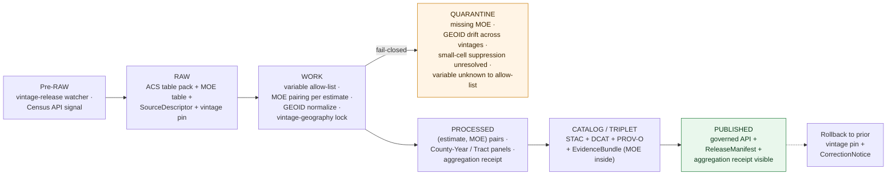

<!-- [KFM_META_BLOCK_V2]
doc_id: kfm://doc/docs-sources-catalog-census-acs-estimates
title: American Community Survey (ACS) Estimates
type: product-page
version: v0.2
status: draft
owners: <PLACEHOLDER — Docs steward + Source steward for census>
created: 2026-05-20
updated: 2026-05-20
policy_label: public
related:
  - docs/sources/catalog/census/README.md
  - docs/sources/catalog/census/IDENTITY.md
  - docs/sources/catalog/census/RIGHTS-AND-SENSITIVITY-MAP.md
  - docs/sources/catalog/census/decennial-census.md
  - docs/sources/catalog/census/tiger.md
  - docs/sources/catalog/README.md
  - docs/sources/catalog/_examples/stac-item-example.json
  - docs/doctrine/directory-rules.md
tags: [kfm, docs, sources, catalog, census, acs, american-community-survey, demography, aggregate, margin-of-error, frontier-matrix]
notes:
  - "PROPOSED product-page scaffold; sibling-link presence verified in Claude Code session."
  - "PROPOSED content sourced from Pass 23/32 atlas (Frontier Matrix domain D/E; Source-Role Anti-Collapse Register §24.1.1), Pass 10 (C4-01, C6-05), KFM-P9-FEAT-0008; descriptor fields intentionally not restated here."
  - "ACS is doctrinally an Aggregate source-role with Margin-of-Error as evidence — see top-of-doc WARNING callouts."
[/KFM_META_BLOCK_V2] -->

# American Community Survey (ACS) Estimates

> ACS 1-year and 5-year estimates with **margins of error (MOEs)**, by tract, block group, place, county, and ZCTA — modeled in KFM as **statistical Aggregates** (not per-place observations) with MOE preserved as **first-class uncertainty evidence**.

**Status:** PROPOSED — scaffold only · **Family:** [`census`](./README.md) · **Owners:** _PLACEHOLDER — Docs steward + Source steward for `census`_ · **Last reviewed:** 2026-05-20

> [!IMPORTANT]
> This is a **scaffold product page**. It points readers at the authoritative homes for source identity, rights, sensitivity, and contract shape; it **does not restate** them. The authoritative `SourceDescriptor` lives in [`data/registry/sources/`](../../../../data/registry/sources/). PROPOSED.

> [!WARNING]
> **Aggregate, not observed.** CONFIRMED doctrine (Atlas §24.1.1, Source-Role Anti-Collapse Register): ACS is an **Aggregate** source-role — "a published summary, total, or average over a unit (county, year, watershed); irreversible loss of individual record fidelity." Example explicitly cited: *"Census tract aggregates."* Allowed downstream role: *"Cite with aggregation receipt; **never treated as a per-place record**."* KFM's governed API fails closed when this role is conflated with Observed or Modeled.

> [!WARNING]
> **Estimates carry MOEs.** ACS estimates are statistical samples with **margins of error**, not censuses. PROPOSED (per KFM-P9-FEAT-0008 normalized statement): publish only with **uncertainty metadata** — *"interpolation method, sampling support, assumptions, and uncertainty metadata"*. KFM treats the MOE as **first-class evidence** that must travel with every estimate; rendering an ACS value without its MOE is a doctrinal failure.

---

## Quick jump

- [Overview](#overview)
- [What this product is *not*](#what-this-product-is-not)
- [Source authority](#source-authority)
- [Pipeline shape (KFM lifecycle)](#pipeline-shape-kfm-lifecycle)
- [Catalog profiles used](#catalog-profiles-used)
- [Collection identity](#collection-identity)
- [Provenance fields](#provenance-fields)
- [Temporal handling](#temporal-handling)
- [Geometry and projection](#geometry-and-projection)
- [Geography levels and join keys](#geography-levels-and-join-keys)
- [Margin-of-error handling](#margin-of-error-handling)
- [1-year vs 5-year estimates](#1-year-vs-5-year-estimates)
- [Aggregation receipt and disclosure controls](#aggregation-receipt-and-disclosure-controls)
- [Rights and sensitivity](#rights-and-sensitivity)
- [Cross-domain consumers](#cross-domain-consumers)
- [Validation and catalog closure](#validation-and-catalog-closure)
- [Related contracts and schemas](#related-contracts-and-schemas)
- [Related connectors and pipelines](#related-connectors-and-pipelines)
- [Examples](#examples)
- [Open questions](#open-questions)
- [Atlas-card references (collapsible)](#atlas-card-references)
- [Related docs](#related-docs)

---

## Overview

PROPOSED. The **American Community Survey (ACS)** is the U.S. Census Bureau's continuous survey of households, replacing the long-form decennial census. It produces estimates of demographic, social, economic, and housing characteristics for U.S. geographies, sampled and weighted to small-area populations.

KFM ingests ACS as **two release products** with different geographic and temporal trade-offs:

- **ACS 1-year estimates** — current-year estimates for geographies with population ≥ 65,000. PROPOSED — best for **timeliness**; coarsest geography.
- **ACS 5-year estimates** — rolling-5-year averages for all geographies, including tracts and block groups. PROPOSED — best for **small-area coverage**; lagged temporal centroid.

CONFIRMED Atlas placement (Domains v1.1, Frontier Matrix domain D): **"Census decennial, ACS, historical datasets"** is named as a source family with source role "*authority / observation / context / model as source role requires*" — for ACS specifically, the canonical role is **Aggregate** (Atlas §24.1.1).

> [!NOTE]
> NEEDS VERIFICATION: cadence (ACS releases are annual; 1-year typically September following the data year, 5-year typically December following the closing data year), current pinned vintage(s), endpoint URL(s) (Census Bureau API vs FTP table-pack vs `tidycensus`-style aggregator), Kansas-relevant geography enumeration, license / terms (federal public-domain inheritance vs aggregator overlay terms), and the precise variable allow-list KFM ingests (ACS publishes thousands of detail tables). Resolution belongs in the authoritative `SourceDescriptor`.

[Back to top](#top)

---

## What this product is *not*

PROPOSED — ACS sits in a dense thicket of demographic products; bounding it is critical:

- **Not the decennial census.** The decennial is a constitutionally-mandated **enumeration** (count) released every 10 years; ACS is a continuous **sample survey**. They are separate sources with different source-role behavior — see [Decennial Census](./decennial-census.md).
- **Not TIGER/Line.** TIGER provides the *boundary geometry* (tracts, block groups, places, counties, ZCTAs); ACS provides *attribute values* on those geographies. They are joined by GEOID, not substituted — see [TIGER](./tiger.md).
- **Not a per-household / per-person record.** PROPOSED (Atlas §24.1.1): ACS published estimates are **aggregates with irreversible loss of individual record fidelity** — disclosure controls and statistical methods prevent re-identification. The Public Use Microdata Sample (PUMS) is a separately-governed source not covered here.
- **Not a census count.** Even at low MOE, an ACS value is an **estimate**, not a count. Conflating the two violates Atlas §24.1.1.
- **Not an observation.** PROPOSED — never treated as Observed. If a downstream consumer needs household-level evidence, ACS is not the right source.
- **Not a real-time signal.** ACS releases lag the data year by 9–18 months.
- **Not stable across vintages.** Geographies (tracts, block groups, ZCTAs) reshape between decennial geographies, and table contents shift across ACS releases. Always pin vintage.

[Back to top](#top)

---

## Source authority

See [`data/registry/sources/`](../../../../data/registry/sources/) for the authoritative `SourceDescriptor`. **Do not duplicate descriptor fields here.** PROPOSED placement per Directory Rules §6 and KFM-P1-PROG-0007.

| Authority surface | Where it lives | What it owns | Restated here? |
|---|---|---|---|
| `SourceDescriptor` | [`data/registry/sources/`](../../../../data/registry/sources/) | Identity, **source role = Aggregate**, rights, cadence, vintage pin, variable allow-list, sensitivity | **No** — pointer only |
| Family overview & sibling links | [`./README.md`](./README.md) | Family-level orientation for `census` | **No** — see family README |
| Collection identity rules | [`./IDENTITY.md`](./IDENTITY.md) | `kfm-<org>-<product>` pattern, namespace | **No** — see IDENTITY |
| Rights & sensitivity mapping | [`./RIGHTS-AND-SENSITIVITY-MAP.md`](./RIGHTS-AND-SENSITIVITY-MAP.md) | Tiering, small-cell-suppression, living-person posture | **No** — see map |
| Contract shape | `schemas/contracts/v1/source/` and `schemas/contracts/v1/domains/frontier-matrix/` | JSON-schema for descriptor + `Population Observation` / `Economic Observation` / `County-Year Panel` shapes | **No** — per ADR-0001 |

PROPOSED source-role posture: **Aggregate** (Atlas §24.1.1 names "Census tract aggregates" as the canonical Aggregate example). Even when joined to TIGER geometry, ACS values remain Aggregates — the geometry does not promote them to Observations.

[Back to top](#top)

---

## Pipeline shape (KFM lifecycle)

CONFIRMED doctrine / PROPOSED lane application: ACS Estimates follow the canonical lifecycle invariant **RAW → WORK/QUARANTINE → PROCESSED → CATALOG/TRIPLET → PUBLISHED**, where each transition is a governed state change — not a file move (Directory Rules §3, Connected-Dots Architecture Brief §4).

PROPOSED — diagram reflects KFM doctrine; specific gate names, validators, and connector boundaries for this product **NEED VERIFICATION** against `pipeline_specs/frontier-matrix/` and `pipelines/`. The **WORK → QUARANTINE** branch is doctrinally fail-closed when an estimate appears without its MOE (KFM-P9-FEAT-0008), when GEOIDs do not resolve cleanly to the pinned vintage, or when small-cell suppression flags are missing.

[Back to top](#top)

---

## Catalog profiles used

PROPOSED. The catalog projection set this product participates in. Lanes follow Directory Rules §6 and Pass-10 C4 (Catalogs and Metadata Profiles).

| Profile | Lane | Used by this product? |
|---|---|---|
| STAC | `data/catalog/stac/` | PROPOSED — Yes (Collection per vintage × release-type; Items per geography level) |
| DCAT | `data/catalog/dcat/` | PROPOSED — Yes (dataset-level metadata) |
| PROV-O | `data/catalog/prov/` | PROPOSED — Yes (variable-allow-list activity, MOE-pairing lineage, vintage-geography lock) |
| Domain projection (`frontier-matrix`) | `data/catalog/domain/frontier-matrix/` | PROPOSED — Yes (primary: Population / Economic Observation, County-Year Panel) |
| Domain projection (`agriculture`) | `data/catalog/domain/agriculture/` | PROPOSED — Conditional (rural-economy / agricultural-employment cross-cuts) |

[Back to top](#top)

---

## Collection identity

- PROPOSED Collection id pattern: `kfm-<org>-<product>` — see [`IDENTITY.md`](./IDENTITY.md) for the canonical rule.
- PROPOSED namespace: `kfm:` — *see [OPEN-DSC-03](#open-questions); Pass-10 C4-01 records the `kfm:` vs `ks-kfm:` choice as an unresolved namespace question.*
- PROPOSED: one Collection per **(vintage, release-type)** pair (e.g., `acs-1yr-2024`, `acs-5yr-2020-2024`). NEEDS VERIFICATION.
- Asset roles (estimate-table, moe-table, allow-listed-variables, aggregation-receipt, geoid-crosswalk, etc.): NEEDS VERIFICATION — confirm against `schemas/contracts/v1/source/` and `schemas/contracts/v1/domains/frontier-matrix/`.

[Back to top](#top)

---

## Provenance fields

CONFIRMED doctrine (Pass-10 C4-01): STAC Items carry an `item.properties.kfm:provenance` block. The fields below are the doctrinal set; **per-product values** are PROPOSED until verified against emitted artifacts in `data/catalog/stac/`.

| Field | Type / form | Role |
|---|---|---|
| `spec_hash` | `sha256` of canonical record (JCS+SHA-256) | Identity anchor; the spec-hash gate is fail-closed at promotion |
| `evidence_bundle_ref` | `kfm://evidence/<digest>` | Resolves to the `EvidenceBundle` carrying receipts, validations, **vintage pin**, **MOE table**, **aggregation receipt**, **variable allow-list** |
| `run_record_ref` | `kfm://run/<run-id>` | Pointer to the immutable `RunReceipt` for the producing run |
| `audit_ref` | `kfm://audit/<attestation-id>` | SLSA / OPA attestation reference |
| `policy_digest` | `sha256` of the policy bundle | Records the policy set in force at promotion (C5-03 parity) |

Per-asset integrity: `file:checksum` on each STAC asset. PROPOSED ACS-specific extension: the `EvidenceBundle` carries an **`AggregationReceipt`** (Atlas §24.1.1: *"Cite with aggregation receipt"*) recording the variable, geography level, sampling support, MOE method, and disclosure-control posture.

[Back to top](#top)

---

## Temporal handling

CONFIRMED doctrine / PROPOSED per-product: KFM keeps **source / observed / valid / retrieval / release / correction** times distinct wherever material (Domain Atlas, operating-law invariant 1). ACS has an unusually subtle temporal structure because **5-year estimates average over a five-year window** — the "observed time" is not a point.

| Time facet | What it means for ACS | Status |
|---|---|---|
| Source time | ACS release date for the pinned vintage (e.g., December 2025 for the 2020–2024 5-year release) | PROPOSED |
| Observed time | Survey-window center (point for 1-year; window centroid for 5-year — *not* a point) | PROPOSED — distinguished from source time |
| Valid time | Period the estimate is considered the best available for that geography × variable | PROPOSED |
| Retrieval time | When KFM fetched the ACS release | PROPOSED |
| Release time | When the KFM catalog entry was promoted to PUBLISHED | PROPOSED |
| Correction time | When a `CorrectionNotice` superseded a prior KFM release (e.g., Census Bureau erratum, KFM allow-list correction) | PROPOSED |

> [!CAUTION]
> A 5-year estimate's **observed time is a window**, not a point. Downstream consumers must not silently treat the release year as the observation year. The `EvidenceBundle` records the window start / end / centroid; the visualization layer must surface that. PROPOSED.

[Back to top](#top)

---

## Geometry and projection

PROPOSED. ACS itself ships *no geometry* — it ships **tables keyed by GEOID**. Geometry is joined from **TIGER/Line** (sibling product) at the matching vintage. The join is GEOID-on-GEOID, never spatial-intersect for ACS records.

- **CRS** — Inherited from the TIGER join target. PROPOSED canonical: `EPSG:5070` for overlap SQL (KFM-P26-PROG-0027) where ACS-on-TIGER products are intersected with other layers; the ACS tables themselves are geometry-free.
- **GEOID stability** — GEOIDs are **vintage-bound**: a 2020-vintage tract `20155002400` is not the same polygon as a 2010-vintage tract with the same GEOID. PROPOSED gate: ACS estimates only join to TIGER geometry of the **same vintage family**; cross-vintage joins require a documented crosswalk.
- **Geometry comes from elsewhere** — PROPOSED: this product page does not redefine geometry; consult [TIGER](./tiger.md) for the boundary product.

[Back to top](#top)

---

## Geography levels and join keys

PROPOSED. ACS publishes at several nested geography levels, each with its own GEOID structure. Not all variables are released at all levels (data-suppression rules vary by population threshold and table type).

| Level | GEOID structure (PROPOSED) | 1-year? | 5-year? | Typical KFM use |
|---|---|---|---|---|
| **State** | `STATE` (2 digits) | Yes | Yes | County rollup denominators |
| **County** | `STATE+COUNTY` (5 digits) | If pop ≥ 65k | Yes | Primary `County-Year Panel` source |
| **Place** (city / town / CDP) | `STATE+PLACE` (7 digits) | If pop ≥ 65k | Yes | Settlements domain context |
| **County subdivision (MCD/CCD)** | `STATE+COUNTY+COUSUB` (10 digits) | Limited | Yes | Township-level demography (Kansas relevant) |
| **Tract** | `STATE+COUNTY+TRACT` (11 digits) | **No** | Yes | Small-area pattern; 5-year only |
| **Block Group** | `STATE+COUNTY+TRACT+BG` (12 digits) | **No** | Yes (subset of tables) | Finest published level; many tables suppressed |
| **ZCTA** | `ZCTA5` (5 digits) | No | Yes | ZIP-adjacent demography (caveat: not a postal entity) |

> [!NOTE]
> **Block groups and tracts are 5-year only.** PROPOSED — KFM consumers requesting tract or block-group ACS must use 5-year vintages; the watcher must reject 1-year requests at sub-county geographies.

[Back to top](#top)

---

## Margin-of-error handling

PROPOSED — this is the core ACS-specific governance requirement. CONFIRMED doctrine (KFM-P9-FEAT-0008, normalized statement): *"KFM should publish geostatistical surfaces only with interpolation method, sampling support, assumptions, and uncertainty metadata."* Applied to ACS:

- **MOE travels with every estimate.** PROPOSED rule: an ACS estimate cell **without** an MOE cell is a quarantine event. The watcher fails closed.
- **MOE is published at the 90% confidence level by default** (Census Bureau convention). PROPOSED: record the confidence level in the descriptor; downstream consumers may compute 95% or 99% intervals but must record the conversion.
- **Derived statistics (ratios, sums, differences) require MOE propagation.** PROPOSED gate: any KFM-computed derived statistic must carry a propagated MOE computed by the documented method (e.g., Census Bureau's published formulas for sums and proportions).
- **Coefficient of Variation (CV) flag.** PROPOSED rule: estimates with CV above a configured threshold (e.g., > 30%) are flagged as **low reliability**. They are not suppressed by default but the flag is required.
- **Rendering rule.** PROPOSED: any visual surface (map, chart, popup) that shows an ACS value must also show its MOE or its CV-reliability flag.

> [!WARNING]
> PROPOSED gate (echoes KFM-P9-FEAT-0008, doctrine: *"It protects readers from treating interpolated surfaces as direct observations"*): a published ACS value without its MOE / CV-flag is a doctrinal failure and must be blocked at promotion. This is the most consequential ACS-specific validation.

[Back to top](#top)

---

## 1-year vs 5-year estimates

PROPOSED. The two release products trade off timeliness against geographic coverage and reliability:

| Property | 1-year estimate | 5-year estimate |
|---|---|---|
| Survey window | 1 year | 5 years (rolling) |
| Geographies released | Population ≥ 65,000 only | All geographies down to block group (with table-level suppression) |
| Timeliness | Best (data year + ~9 months) | Lagged (window-end + ~12 months) |
| MOE magnitude | Larger (smaller sample) | Smaller (5× sample) |
| Best for | Current-state county / large-place trends | Small-area patterns; tract / block-group / rural |
| Comparing across years | Direct (each year is independent) | Window overlap — successive 5-year releases share 4 years of data |

> [!CAUTION]
> **5-year releases overlap.** Comparing 2018–2022 5-year to 2019–2023 5-year is *not* a year-over-year comparison; the windows share four years of data. PROPOSED: the catalog records overlap explicitly; any KFM-side trend product must use either 1-year (where available) or non-overlapping 5-year releases.

[Back to top](#top)

---

## Aggregation receipt and disclosure controls

PROPOSED. ACS is itself an aggregate; KFM does not need to apply differential privacy or further suppression on top. But KFM **must record** the upstream disclosure-control posture as part of the `AggregationReceipt`.

CONFIRMED doctrine (Atlas §24.1.1): Aggregate sources are cited with an **aggregation receipt**, *never treated as a per-place record*. Applied to ACS, the `AggregationReceipt` is PROPOSED to carry:

- The aggregation method (5-year window vs 1-year cross-section).
- The sampling support (sample size or count of person-records contributing to the cell).
- The MOE method (90% CL by default).
- The upstream disclosure-control posture (Census Bureau's published suppression rules for the vintage; for ACS 2020+ this includes the **Disclosure Avoidance System (DAS)** for certain tables — verify per-vintage).
- The KFM-side variable allow-list applied.

CONFIRMED reference (Pass-10 C6-05): KFM doctrine on differential privacy is *"Differential privacy (epsilon-delta) is applied only to aggregate outputs (counts, heatmaps) using OpenDP, Google DP, or PyDP; raw points are never DP-noised, and DP parameters (epsilon, delta) are recorded in receipts."* ACS is **upstream-DP-treated by the Census Bureau**, not by KFM. KFM does **not** add DP noise to ACS; KFM records that DP / DAS was applied upstream.

[Back to top](#top)

---

## Rights and sensitivity

NEEDS VERIFICATION — see [`policy/sensitivity/`](../../../../policy/sensitivity/) and [`RIGHTS-AND-SENSITIVITY-MAP.md`](./RIGHTS-AND-SENSITIVITY-MAP.md). **Do not restate policy here.**

PROPOSED sensitivity posture for this product:

- **Rights** — ACS data is **federal public-domain**. Aggregator overlays (e.g., IPUMS NHGIS, Social Explorer, `tidycensus`-style table packs) may layer separate terms — NEEDS VERIFICATION if such an aggregator is used.
- **Re-identification risk** — Census Bureau disclosure controls bound re-identification risk at the source. KFM does not add personal data. However, joining ACS to small-area events (e.g., a single household's geocoded record) can re-introduce risk; cross-product joins to single-record observations require **review**.
- **Small-cell handling** — PROPOSED: where the Census Bureau publishes a suppression flag (estimate withheld due to inadequate sample), KFM preserves the flag and refuses to interpolate. Suppressed cells are *not* zero.
- **CARE applicability** — flagged for review for ACS variables that segment by **tribal / racial / ethnic / sovereignty-adjacent** categories where downstream presentation could harm. PROPOSED: Pass-10 C15-01..03 default-deny may apply for joins that re-identify or stigmatize small groups; render-time guardrails preferred over wholesale suppression of public data.
- **Living-person policy** — not directly applicable (ACS is aggregate). PROPOSED.

[Back to top](#top)

---

## Cross-domain consumers

PROPOSED. ACS feeds the **Frontier Matrix** domain primarily, with cross-cuts to several others (Domains v1.1 D / E).

| Consuming domain | What it consumes | Constraint (Atlas §24.1.1 / Domain Atlas F) |
|---|---|---|
| **Frontier Matrix** (primary) | `Population Observation`, `Economic Observation`, `County-Year Panel` (Domains v1.1 ch. on Frontier Matrix, object families E) | Aggregate role preserved; never per-place |
| **Agriculture** | Rural-employment, ag-economy ACS variables → `Agriculture Observation` | Aggregate role; cite with aggregation receipt |
| **Settlements & Infrastructure** | Place- and county-subdivision demographic context | Aggregate role; never a per-household claim |
| **Habitat / Fauna / Flora** | Human-population pressure context (population density, commute patterns) | Context only, never a biophysical claim |
| **Roads / Rail / Trade** | Commute-flow context (where supported by ACS commuting tables) | Aggregate role |
| **Hazards** | Vulnerability-context join (age, disability, language-isolation rollups) | Aggregate role; render-time CARE review for stigma-adjacent variables |

[Back to top](#top)

---

## Validation and catalog closure

PROPOSED gate set for this product. **Catalog closure is required before public release** (Pass-10 / KFM-P1-IDEA-0020).

- **STAC Projection lint** — KFM-P27-FEAT-0003 — PROPOSED.
- **STAC checksum closure** against the `ReleaseManifest` digest — KFM-P22-PROG-0037 — PROPOSED.
- **Spec-hash-match gate** (C5-04) — PROPOSED.
- **MOE-paired-with-estimate gate** — PROPOSED (KFM-P9-FEAT-0008); every estimate cell must have a paired MOE cell or an explicit suppression flag.
- **CV-reliability flag gate** — PROPOSED; CV computed and flagged where above threshold.
- **Vintage-pin gate** — PROPOSED; descriptor must declare a specific (vintage, release-type) pair; "latest" is not a valid pin.
- **GEOID vintage-lock test** — PROPOSED; estimates join only to TIGER geometry of the same vintage family; cross-vintage joins require a documented crosswalk.
- **Variable allow-list gate** — PROPOSED; unknown variables fail closed at WORK rather than silently passing through to PROCESSED.
- **Source-role anti-collapse test** — PROPOSED (Atlas §24.1.1); any record promoted as Observed that traces back to ACS must DENY.
- **Aggregation-receipt presence gate** — PROPOSED; required at promotion.
- **Suppression-flag preservation test** — PROPOSED; Census Bureau suppression flags are preserved verbatim and never zero-filled.
- **No public RAW / WORK path** — CONFIRMED doctrine; public clients consume governed PUBLISHED state only.

NEEDS VERIFICATION — concrete validator names, fixture paths, and CI workflow files in `tools/validators/` and `.github/workflows/`.

[Back to top](#top)

---

## Related contracts and schemas

- `contracts/domains/frontier-matrix/` — semantic meaning for `Population Observation`, `Economic Observation`, `County-Year Panel`, `GeographyVersion`. NEEDS VERIFICATION.
- `contracts/common/` — `AggregationReceipt` shape (PROPOSED). NEEDS VERIFICATION.
- `schemas/contracts/v1/source/` — per **ADR-0001** (canonical schema home).
- `schemas/contracts/v1/domains/frontier-matrix/` — domain projection shapes for ACS-derived records.

PROPOSED — exact files NEED VERIFICATION once the repo is mounted.

[Back to top](#top)

---

## Related connectors and pipelines

- `connectors/census/` — source fetchers for the `census` family (ACS, decennial, TIGER).
- `pipelines/ingest/`, `pipelines/normalize/`, `pipelines/validate/`, `pipelines/catalog/` — lifecycle stages.
- `pipelines/watchers/` — vintage-release watcher for ACS (annual signal).
- `pipeline_specs/frontier-matrix/` — declarative spec for the Frontier Matrix projection (primary consumer).

PROPOSED — module file names NEED VERIFICATION.

[Back to top](#top)

---

## Examples

*(Illustrative only — do not treat as authoritative.)*

See [`_examples/stac-item-example.json`](../_examples/stac-item-example.json) for the minimal STAC + `kfm:provenance` shape.

An ACS `EvidenceBundle` is PROPOSED to additionally carry:
- The pinned vintage and release-type (e.g., `acs-5yr-2020-2024`).
- The variable allow-list applied.
- The `AggregationReceipt` (aggregation method, sampling support, MOE method, upstream disclosure-control posture, KFM-side allow-list).
- The MOE table referenced by GEOID × variable.
- The vintage-bound TIGER GEOID set used for joins (or a content-addressed pointer to the sibling TIGER catalog entry).
- The suppression-flag register for any cells without estimates.
- The CV-reliability flag table.

[Back to top](#top)

---

## Open questions

- **OPEN-DSC-01** — Confirm cadence, current pinned vintage(s) for 1-year and 5-year, Census Bureau endpoint URL(s), and whether KFM consumes directly from Census API or via an aggregator. NEEDS VERIFICATION — resolution belongs in `SourceDescriptor`.
- **OPEN-DSC-02** — Confirm rights posture (federal public-domain inheritance vs aggregator overlays). NEEDS VERIFICATION.
- **OPEN-DSC-03** — `kfm:` vs `ks-kfm:` namespace choice (Pass-10 C4-01). UNKNOWN — awaits ADR.
- **OPEN-FAM-01** — **Variable allow-list scope**. ACS publishes thousands of detail tables; KFM must declare which subset is in scope. PROPOSED phased rollout: population + housing + commuting + selected economic. NEEDS VERIFICATION — ADR-class.
- **OPEN-FAM-02** — Whether 1-year and 5-year warrant separate Collections or a single Collection with a release-type discriminator. PROPOSED separate (different geographic coverage rules). NEEDS VERIFICATION.
- **OPEN-FAM-03** — CV-reliability threshold value (commonly 30% but configurable). NEEDS VERIFICATION.
- **OPEN-FAM-04** — MOE-derived-statistic propagation library (KFM-internal vs Census-published formulas via `tidycensus` / `acs` Python equivalent). NEEDS VERIFICATION.
- **OPEN-FAM-05** — Cross-vintage crosswalk policy (e.g., 2010-vintage tracts to 2020-vintage tracts via population-weighted blocks). NEEDS VERIFICATION.
- **OPEN-FAM-06** — How to handle Census Bureau's **Disclosure Avoidance System (DAS)** for 2020+ ACS releases at low geography. NEEDS VERIFICATION.
- **OPEN-FAM-07** — Render-time guardrails for stigma-adjacent variables (Pass-10 C6-* and CARE cross-references). NEEDS VERIFICATION.
- **OPEN-FAM-08** — ZCTA caveat handling (ZCTAs are statistical approximations of ZIP codes, not postal entities; downstream consumers must not infer postal coverage). NEEDS VERIFICATION.

[Back to top](#top)

---

## Atlas-card references

<b>Pass 23/32 atlas cards and Domains v1.1 references backing this page (click to expand)</b>

These are the KFM atlas cards from which the PROPOSED content above is sourced. They are doctrinal carriers — they do **not** assert mounted-repo implementation. Each card's own truth labels apply.

**Domains v1.1 — Frontier Matrix domain (primary):**
- **Source family D** — *"Census decennial, ACS, historical datasets"* — authority / observation / context / model as source role requires. The Source-Role Anti-Collapse Register (§24.1.1) resolves the role for **ACS** specifically to **Aggregate**.
- **Object families E** — `Population Observation`, `Economic Observation`, `County-Year Panel`, `GeographyVersion`, `Settlement Status`. These are the canonical projections of ACS into the Frontier Matrix domain.

**Atlas §24.1.1 — Source-Role Anti-Collapse Register (CONFIRMED doctrine):**
- **Aggregate** role definition: *"A published summary, total, or average over a unit (county, year, watershed); irreversible loss of individual record fidelity."*
- Example explicitly named: *"Census tract aggregates."*
- Allowed downstream role: *"Cite with aggregation receipt; never treated as a per-place record."*
- Cross-domain citation: `[DOM-PEOPLE]` among others.
- Anti-collapse failure mode: "Aggregate labeled or queried as observed" — DENY.

**Geostatistical / uncertainty doctrine:**
- **KFM-P9-FEAT-0008** — *Geostatistical products require uncertainty and model metadata.* Class: feature · Category: ANA · Status: active · Pass 32 spec hash: `sha256:f3feefa0c94a25de5f3ee35f383c6fd9c41189ecf2743261aa7547862fb093a8`. PROPOSED: *"KFM should publish geostatistical surfaces only with interpolation method, sampling support, assumptions, and uncertainty metadata."* Why it matters: *"It protects readers from treating interpolated surfaces as direct observations."*

**Pass-10 references:**
- **C4-01** — STAC Item `kfm:provenance` namespace (CONFIRMED).
- **C4-02** — STAC Collection with KFM governance description (CONFIRMED).
- **C4-04** — Evidence-Bundle JSON-LD content addressing (CONFIRMED).
- **C5-02 / C5-04** — Default-deny promotion + spec-hash-match gate (CONFIRMED).
- **C6-05** — *Differential Privacy for Aggregates Only* (CONFIRMED). Relevant to ACS as upstream-DP-treated; KFM does **not** apply DP on top.
- **C15-01..03** — CARE MetaBlock v2, `kfm:care` extension, OPA default-deny on CARE-tagged assets (CONFIRMED).

[Back to top](#top)

---

## Related docs

- [`docs/sources/catalog/census/README.md`](./README.md) — `census` family landing page.
- [`docs/sources/catalog/census/IDENTITY.md`](./IDENTITY.md) — Collection-id and namespace rules for the family.
- [`docs/sources/catalog/census/RIGHTS-AND-SENSITIVITY-MAP.md`](./RIGHTS-AND-SENSITIVITY-MAP.md) — Rights / sensitivity tiering for `census`.
- [`docs/sources/catalog/census/decennial-census.md`](./decennial-census.md) — Sibling: decennial enumeration (different source-role; not a survey estimate).
- [`docs/sources/catalog/census/tiger.md`](./tiger.md) — Sibling: TIGER/Line boundary geometry (ACS joins to this).
- _TODO_ — `docs/sources/catalog/census/pums.md` — PUMS microdata (separately-governed sibling).
- [`docs/sources/catalog/README.md`](../../README.md) — Catalog of source families.
- [`docs/sources/catalog/_examples/stac-item-example.json`](../_examples/stac-item-example.json) — Illustrative STAC + `kfm:provenance` shape.
- [`docs/doctrine/directory-rules.md`](../../../../docs/doctrine/directory-rules.md) — Placement authority.
- _TODO_ — `docs/standards/STAC_KFM_PROFILE.md` (PROPOSED, Pass-10 C4-01 expansion).
- _TODO_ — `docs/standards/AGGREGATION_RECEIPT.md` — Atlas §24.1.1 aggregation-receipt schema (PROPOSED).
- _TODO_ — `docs/standards/PROV.md` _(or `PROVENANCE.md`, naming question per Directory Rules §18 OPEN-DR-01)_.
- _TODO_ — `docs/domains/frontier-matrix/README.md` — Primary consuming domain.

---

_Last updated: **2026-05-20** · doc version **v0.2** · status **draft / PROPOSED scaffold**_

[Back to top](#top)
