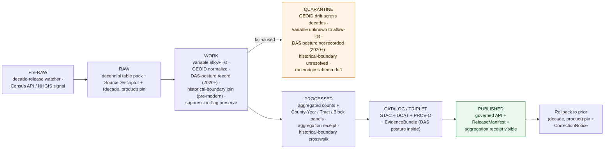

<!-- [KFM_META_BLOCK_V2]
doc_id: kfm://doc/docs-sources-catalog-census-decennial-counts
title: U.S. Census Decennial Counts
type: product-page
version: v0.2
status: draft
owners: <PLACEHOLDER — Docs steward + Source steward for census>
created: 2026-05-20
updated: 2026-05-20
policy_label: public
related:
  - docs/sources/catalog/census/README.md
  - docs/sources/catalog/census/IDENTITY.md
  - docs/sources/catalog/census/RIGHTS-AND-SENSITIVITY-MAP.md
  - docs/sources/catalog/census/acs-estimates.md
  - docs/sources/catalog/census/tiger.md
  - docs/sources/catalog/README.md
  - docs/sources/catalog/_examples/stac-item-example.json
  - docs/doctrine/directory-rules.md
tags: [kfm, docs, sources, catalog, census, decennial, enumeration, redistricting, das, historical-census, frontier-matrix, people-dna-land]
notes:
  - "PROPOSED product-page scaffold; sibling-link presence verified in Claude Code session."
  - "PROPOSED content sourced from Pass 23/32 atlas (Frontier Matrix domain D/E; Source-Role Anti-Collapse Register §24.1.1; KFM-P17-PROG-0015), Pass 10 (C4-01, C6-05); descriptor fields intentionally not restated here."
  - "Decennial is an enumeration (count), not a sample survey — see top-of-doc WARNING callouts distinguishing it from ACS."
[/KFM_META_BLOCK_V2] -->

# U.S. Census Decennial Counts

> Decennial census **population and housing counts** as aggregate tables by state, county, county subdivision, place, tract, block group, **block**, ZCTA, and tribal geographies — modeled in KFM as **Aggregates** with constitutionally-mandated enumeration semantics, distinct from ACS estimates and PUMS microdata.

-purple)

**Status:** PROPOSED — scaffold only · **Family:** [`census`](./README.md) · **Owners:** _PLACEHOLDER — Docs steward + Source steward for `census`_ · **Last reviewed:** 2026-05-20

> [!IMPORTANT]
> This is a **scaffold product page**. It points readers at the authoritative homes for source identity, rights, sensitivity, and contract shape; it **does not restate** them. The authoritative `SourceDescriptor` lives in [`data/registry/sources/`](../../../../data/registry/sources/). PROPOSED.

> [!WARNING]
> **Aggregate, not per-person.** CONFIRMED doctrine (Atlas §24.1.1, Source-Role Anti-Collapse Register): decennial published tables are an **Aggregate** source-role — "a published summary, total, or average over a unit (county, year, watershed); irreversible loss of individual record fidelity." Allowed downstream role: *"Cite with aggregation receipt; **never treated as a per-place record**."* KFM's governed API fails closed when this role is conflated with Observed or Modeled.

> [!WARNING]
> **2020-and-later decennial tables carry upstream DAS noise.** CONFIRMED context (Pass-10 C6-05): the U.S. Census Bureau applied the **Disclosure Avoidance System (DAS)** to 2020 decennial tables, intentionally injecting bounded noise into published counts before release. KFM does **not** strip this noise and does **not** add further noise. The `AggregationReceipt` must record that DAS was applied upstream; downstream consumers must treat the published count as the released figure, not "the true count minus DAS."

> [!WARNING]
> **Constitutionally-distinct from ACS.** The decennial is a **constitutionally-mandated enumeration** that drives apportionment of the U.S. House of Representatives, federal funding formulas, and state redistricting. It is **not** a sample survey and **does not** carry margins of error in the ACS sense. Do not import ACS MOE-handling code paths for decennial tables.

---

## Quick jump

- [Overview](#overview)
- [What this product is *not*](#what-this-product-is-not)
- [Source authority](#source-authority)
- [Pipeline shape (KFM lifecycle)](#pipeline-shape-kfm-lifecycle)
- [Catalog profiles used](#catalog-profiles-used)
- [Collection identity](#collection-identity)
- [Provenance fields](#provenance-fields)
- [Temporal handling](#temporal-handling)
- [Geometry and projection](#geometry-and-projection)
- [Geography levels and join keys](#geography-levels-and-join-keys)
- [Release products](#release-products)
- [Modern vs historical decennial](#modern-vs-historical-decennial)
- [Disclosure Avoidance System (DAS) handling](#disclosure-avoidance-system-das-handling)
- [Aggregation receipt and disclosure controls](#aggregation-receipt-and-disclosure-controls)
- [Negative-evidence role for identity resolution](#negative-evidence-role-for-identity-resolution)
- [Rights and sensitivity](#rights-and-sensitivity)
- [Cross-domain consumers](#cross-domain-consumers)
- [Validation and catalog closure](#validation-and-catalog-closure)
- [Related contracts and schemas](#related-contracts-and-schemas)
- [Related connectors and pipelines](#related-connectors-and-pipelines)
- [Examples](#examples)
- [Open questions](#open-questions)
- [Atlas-card references (collapsible)](#atlas-card-references)
- [Related docs](#related-docs)

---

## Overview

PROPOSED. The **U.S. Decennial Census** is the constitutionally-mandated enumeration of the U.S. population, conducted every ten years since 1790. It produces **counts** of population and housing characteristics for U.S. geographies — including the smallest published unit, the **census block** — and feeds congressional apportionment, federal redistricting, and a wide range of demographic baselines.

KFM ingests the decennial as **two related product surfaces**:

- **Modern decennial (2000, 2010, 2020, …)** — multiple release products per decade (PL 94-171 redistricting, DHC, Detailed DHC). PROPOSED — 2020+ carries Census Bureau **DAS** noise upstream.
- **Historical decennial (1790–1990)** — decadal enumerations with varying schema, geographic coverage, and digitization quality. PROPOSED — joins to historical-boundary time slices (compare KFM-P17-PROG-0014 patent → historical-county pattern).

CONFIRMED Atlas placement (Domains v1.1, Frontier Matrix domain D source family): **"Census decennial, ACS, historical datasets"** is named explicitly. The Source-Role Anti-Collapse Register §24.1.1 resolves the role to **Aggregate** (with "Census tract aggregates" as the canonical example).

CONFIRMED doctrine (KFM-P17-PROG-0015): *"Identity resolution should subtract confidence for strong contradictions such as **census enumeration in a different county** or conflicting patents."* This is a **distinctive decennial role** — modern and historical decennial enumeration records serve as **negative evidence** in People/DNA/Land identity resolution. See [§Negative-evidence role](#negative-evidence-role-for-identity-resolution).

> [!NOTE]
> NEEDS VERIFICATION: cadence (decadal; release products spread over ~2-3 years after each decennial), Kansas-relevant geography enumeration including historical-boundary time slices for 1790–1990 censuses (Kansas as a territory before 1861, as a state thereafter), current endpoint URL(s) for both modern (Census API / data.census.gov) and historical (IPUMS NHGIS / Census Bureau historical archive / Ancestry partner products), license / terms, and the precise table set KFM ingests per decade. Resolution belongs in the authoritative `SourceDescriptor`.

[Back to top](#top)

---

## What this product is *not*

PROPOSED — bounding the decennial against adjacent demographic products is critical:

- **Not ACS.** ACS is a continuous sample survey with margins of error; decennial is a decadal enumeration with counts. Different cadence, different uncertainty model, different geography coverage. See [ACS Estimates](./acs-estimates.md).
- **Not TIGER/Line.** TIGER provides the *boundary geometry*; decennial provides *attribute counts* on those geographies. Joined by GEOID, not substituted. See [TIGER](./tiger.md).
- **Not PUMS microdata.** PUMS publishes anonymized person-record samples derived from the survey effort; decennial tables are aggregates. PUMS is a separately-governed source.
- **Not the long-form census.** The long-form decennial (asked of a sample) was replaced by ACS after 2000. Long-form 1990, 1980, etc. are historical decennial; modern 2000+ uses ACS for the long-form content.
- **Not a per-person record.** PROPOSED (Atlas §24.1.1): decennial tables are aggregates; per-person records are released only on the 72-year cycle (currently through 1950) via NARA and are a separately-governed product.
- **Not "the true count" after DAS.** PROPOSED — the published 2020+ figure **is** the official count; KFM does not present it as "true count plus noise."
- **Not stable across geography vintages.** Tract, block group, and block boundaries reshape between decades; comparing 2010-vintage to 2020-vintage geographies requires a crosswalk.
- **Not the historical-population-of-Kansas in isolation.** The historical decennial is part of a wider Frontier Matrix evidence set (also Land Office Records, county histories, KFM-P28-IDEA-0018 county profiles); decennial alone is not the demographic-history source.

[Back to top](#top)

---

## Source authority

See [`data/registry/sources/`](../../../../data/registry/sources/) for the authoritative `SourceDescriptor`. **Do not duplicate descriptor fields here.** PROPOSED placement per Directory Rules §6 and KFM-P1-PROG-0007.

| Authority surface | Where it lives | What it owns | Restated here? |
|---|---|---|---|
| `SourceDescriptor` | [`data/registry/sources/`](../../../../data/registry/sources/) | Identity, **source role = Aggregate**, rights, cadence, decade pin, release-product pin, DAS posture, sensitivity | **No** — pointer only |
| Family overview & sibling links | [`./README.md`](./README.md) | Family-level orientation for `census` | **No** — see family README |
| Collection identity rules | [`./IDENTITY.md`](./IDENTITY.md) | `kfm-<org>-<product>` pattern, namespace | **No** — see IDENTITY |
| Rights & sensitivity mapping | [`./RIGHTS-AND-SENSITIVITY-MAP.md`](./RIGHTS-AND-SENSITIVITY-MAP.md) | Tiering, CARE applicability for tribal-area tables and historical-enumeration race/origin records, release class | **No** — see map |
| Contract shape | `schemas/contracts/v1/source/` and `schemas/contracts/v1/domains/frontier-matrix/` | JSON-schema for descriptor + `Population Observation` / `County-Year Panel` shapes | **No** — per ADR-0001 |

PROPOSED source-role posture: **Aggregate** (Atlas §24.1.1). Constitutionally-mandated authority over the **count process**, but published tables remain aggregates per the anti-collapse register. Where a downstream consumer needs constitutional / administrative authority (apportionment, redistricting), the record is cited as **Aggregate with administrative-authority context**, never as Observed.

[Back to top](#top)

---

## Pipeline shape (KFM lifecycle)

CONFIRMED doctrine / PROPOSED lane application: Decennial Counts follow the canonical lifecycle invariant **RAW → WORK/QUARANTINE → PROCESSED → CATALOG/TRIPLET → PUBLISHED**, where each transition is a governed state change — not a file move (Directory Rules §3, Connected-Dots Architecture Brief §4).

PROPOSED — diagram reflects KFM doctrine; specific gate names, validators, and connector boundaries for this product **NEED VERIFICATION** against `pipeline_specs/frontier-matrix/` and `pipelines/`. The **WORK → QUARANTINE** branch is doctrinally fail-closed on five cases (GEOID drift, unknown variable, missing DAS-posture record for 2020+, unresolved historical boundary, race / origin schema drift across decades).

[Back to top](#top)

---

## Catalog profiles used

PROPOSED. The catalog projection set this product participates in. Lanes follow Directory Rules §6 and Pass-10 C4 (Catalogs and Metadata Profiles).

| Profile | Lane | Used by this product? |
|---|---|---|
| STAC | `data/catalog/stac/` | PROPOSED — Yes (Collection per (decade, release-product); Items per geography level) |
| DCAT | `data/catalog/dcat/` | PROPOSED — Yes (dataset-level metadata, official-source citation) |
| PROV-O | `data/catalog/prov/` | PROPOSED — Yes (variable-allow-list activity, GEOID-normalization lineage, historical-boundary join) |
| Domain projection (`frontier-matrix`) | `data/catalog/domain/frontier-matrix/` | PROPOSED — Yes (primary: Population Observation, County-Year Panel) |
| Domain projection (`people-dna-land`) | `data/catalog/domain/people-dna-land/` | PROPOSED — Yes (secondary: negative-evidence role for identity resolution) |

[Back to top](#top)

---

## Collection identity

- PROPOSED Collection id pattern: `kfm-<org>-<product>` — see [`IDENTITY.md`](./IDENTITY.md) for the canonical rule.
- PROPOSED namespace: `kfm:` — *see [OPEN-DSC-03](#open-questions); Pass-10 C4-01 records the `kfm:` vs `ks-kfm:` choice as an unresolved namespace question.*
- PROPOSED: one Collection per **(decade, release-product)** pair (e.g., `decennial-2020-pl94-171`, `decennial-2020-dhc`, `decennial-2010-sf1`, `decennial-1880-historical`). NEEDS VERIFICATION.
- Asset roles (count-table, allow-listed-variables, aggregation-receipt, geoid-crosswalk, das-posture-record, historical-boundary-crosswalk, etc.): NEEDS VERIFICATION — confirm against `schemas/contracts/v1/source/` and `schemas/contracts/v1/domains/frontier-matrix/`.

[Back to top](#top)

---

## Provenance fields

CONFIRMED doctrine (Pass-10 C4-01): STAC Items carry an `item.properties.kfm:provenance` block. The fields below are the doctrinal set; **per-product values** are PROPOSED until verified against emitted artifacts in `data/catalog/stac/`.

| Field | Type / form | Role |
|---|---|---|
| `spec_hash` | `sha256` of canonical record (JCS+SHA-256) | Identity anchor; the spec-hash gate is fail-closed at promotion |
| `evidence_bundle_ref` | `kfm://evidence/<digest>` | Resolves to the `EvidenceBundle` carrying receipts, validations, **decade + release-product pin**, **aggregation receipt**, **DAS posture record** (2020+), **historical-boundary crosswalk** (pre-modern) |
| `run_record_ref` | `kfm://run/<run-id>` | Pointer to the immutable `RunReceipt` for the producing run |
| `audit_ref` | `kfm://audit/<attestation-id>` | SLSA / OPA attestation reference |
| `policy_digest` | `sha256` of the policy bundle | Records the policy set in force at promotion (C5-03 parity) |

Per-asset integrity: `file:checksum` on each STAC asset. PROPOSED decennial-specific extension: the `EvidenceBundle` carries an **`AggregationReceipt`** (Atlas §24.1.1) and, for 2020+ releases, a **`DASPostureRecord`** documenting that DAS was applied upstream and at what release-class.

[Back to top](#top)

---

## Temporal handling

CONFIRMED doctrine / PROPOSED per-product: KFM keeps **source / observed / valid / retrieval / release / correction** times distinct wherever material (Domain Atlas, operating-law invariant 1).

| Time facet | What it means for Decennial Counts | Status |
|---|---|---|
| Source time | Decennial release date for the pinned product (e.g., 2020 PL 94-171 released August 2021) | PROPOSED |
| Observed time | **Census day** of the decade (April 1 of the census year, by long-standing convention) | PROPOSED |
| Valid time | The decade for which the count is the authoritative snapshot (until the next decennial supersedes for routine reporting purposes; historical decennials remain valid for their own decade indefinitely) | PROPOSED |
| Retrieval time | When KFM fetched the release | PROPOSED |
| Release time | When the KFM catalog entry was promoted to PUBLISHED | PROPOSED |
| Correction time | When a `CorrectionNotice` (Census Bureau erratum, post-enumeration revision, KFM-side allow-list correction) superseded a prior KFM release | PROPOSED |

> [!CAUTION]
> **Historical decennial observation times vary.** Census Day was June 1 from 1790–1900 (with the exception of 1820, when it was August 7), April 15 in 1910, January 1 in 1920, then April 1 thereafter. The `EvidenceBundle` must preserve the actual census day for the decade, not a generic "April 1" placeholder. PROPOSED — verify per-decade against Census Bureau historical metadata.

[Back to top](#top)

---

## Geometry and projection

PROPOSED. Decennial itself ships **no geometry** — it ships **tables keyed by GEOID**. Geometry is joined from **TIGER/Line** (sibling product) at the matching vintage, or from a historical-boundary source (e.g., AHCB) for pre-modern decennials.

- **CRS** — Inherited from the join target. PROPOSED canonical: `EPSG:5070` where decennial-on-TIGER products are intersected with other layers; decennial tables themselves are geometry-free.
- **GEOID stability** — GEOIDs are **decade-bound**. A 2020-vintage tract `20155002400` is not the same polygon as a 2010-vintage tract with the same code. PROPOSED gate: decennial counts only join to TIGER geometry of the same vintage family; cross-decade joins require a documented crosswalk.
- **Historical decennial geography** — Pre-modern decennials predate TIGER. PROPOSED: historical decennial counts join to **historical-county boundaries** via AHCB or an equivalent (compare KFM-P17-PROG-0014 patent-to-historical-county pattern).
- **Geometry comes from elsewhere** — PROPOSED: this product page does not redefine geometry; consult [TIGER](./tiger.md) for modern, and an AHCB-equivalent crosswalk for historical.

[Back to top](#top)

---

## Geography levels and join keys

PROPOSED. Decennial publishes at the **broadest set of geography levels** in the Census Bureau system, including the **block** (the smallest published unit, unavailable in ACS).

| Level | GEOID structure (PROPOSED) | Modern? | Historical? | Typical KFM use |
|---|---|---|---|---|
| **State** | `STATE` (2 digits) | Yes | Yes | County rollup denominators |
| **County** | `STATE+COUNTY` (5 digits) | Yes | Yes | Primary `County-Year Panel` source |
| **County subdivision (MCD/CCD)** | `STATE+COUNTY+COUSUB` (10 digits) | Yes | Yes (varies pre-1950) | Township-level demography (Kansas relevant) |
| **Place** (city / town / CDP) | `STATE+PLACE` (7 digits) | Yes | Limited (incorporated places only pre-1950) | Settlements domain context |
| **Tract** | `STATE+COUNTY+TRACT` (11 digits) | Yes | Limited (urban only pre-1990) | Small-area baseline |
| **Block Group** | `STATE+COUNTY+TRACT+BG` (12 digits) | Yes | No (introduced 1990) | Finer-than-tract baseline |
| **Block** | `STATE+COUNTY+TRACT+BLOCK` (15 digits) | Yes | No (introduced 1990 for full geography) | Smallest published; redistricting / fine-grain analysis |
| **ZCTA** | `ZCTA5` (5 digits) | Yes | No (introduced 2000) | ZIP-adjacent demography (caveat: not a postal entity) |
| **Voting Tabulation District (VTD)** | `STATE+COUNTY+VTD` | Yes (PL 94-171) | No | Redistricting; decennial-only |
| **American Indian / Alaska Native / Native Hawaiian Areas** | varies (AIANNH codes) | Yes | Limited / varies | Tribal-area tabulation; CARE-sensitive (see Rights) |

> [!NOTE]
> **Tract / block group / block are modern.** PROPOSED — for historical decennials (pre-1990 across most U.S. geography), the finest published unit is county or county subdivision; tracts existed for urban areas back to ~1910 in some cities but were not universal. The Kansas historical record will be county and MCD-level for most decades. NEEDS VERIFICATION.

[Back to top](#top)

---

## Release products

PROPOSED. The decennial is **not a single release** — each decade publishes several release products in succession, each with its own scope and timeline:

| Release product | Cycle position | Scope | KFM ingest priority |
|---|---|---|---|
| **PL 94-171 Redistricting Data** | First (≈ year + 6 months) | Population counts, race / ethnicity, voting-age population, occupied/vacant housing — at block and VTD | PROPOSED — high (timeliest official count) |
| **Apportionment Counts** | Earliest (≈ year + 4 months) | State population totals only | PROPOSED — low (state level only) |
| **Demographic and Housing Characteristics (DHC)** (2020+) — formerly **Summary File 1 (SF1)** in prior decades | Second (≈ year + 18 months) | Detailed demographic and housing tables | PROPOSED — high (broadest table set) |
| **Detailed DHC (DHC-A, DHC-B)** | Third (≈ year + 2-3 years) | Fine-grained race / ethnicity / age tables | PROPOSED — medium (detail tables for specific analyses) |
| **Historical decadal censuses (1790–2010)** | Long-tail | Varies per decade; historical schema | PROPOSED — high for Frontier Matrix work |

> [!NOTE]
> **Product names change.** The Census Bureau renamed many 2020 release products from prior-decade nomenclature (e.g., SF1 → DHC, SF2 → DHC-A). PROPOSED: the descriptor pins the release-product *as the Bureau names it for that decade*, with a canonical alias maintained for cross-decade reference. NEEDS VERIFICATION.

[Back to top](#top)

---

## Modern vs historical decennial

PROPOSED. KFM treats the decennial as **two pipeline branches** that converge at the catalog:

| Property | Modern (2000, 2010, 2020, …) | Historical (1790–1990) |
|---|---|---|
| Source | Census Bureau API / data.census.gov / NHGIS | NHGIS / IPUMS / NARA / digitized historical archives |
| Schema | Standardized PL/DHC tables | Varies per decade; transcription-quality varies |
| Geography | Modern TIGER (block-level) | Historical-county boundaries (AHCB-equivalent) |
| Disclosure controls | **DAS (2020+)** / SF1 swapping (prior decades) | None — original schedule data; transcription error instead |
| Race / ethnicity categories | Modern OMB schema | Per-decade schema (significant change between censuses) |
| Living-person risk | None at aggregate level | Pre-1950 enumeration sheets fully public via NARA; 1950+ subject to 72-year rule |
| KFM cadence | Decade-pin watchers; release-product staggered | One-time historical ingest per decade with periodic re-verification |

> [!CAUTION]
> **Race and ethnicity categories shift between decades.** The doctrine of preserving native classification (KFM-P2-IDEA-0028 land-cover analog) applies: KFM preserves the **as-published category set** for each decade and provides **advisory** crosswalks. The aggregation receipt must record the decade's native schema, not a normalized contemporary version.

[Back to top](#top)

---

## Disclosure Avoidance System (DAS) handling

PROPOSED. For **2020 and later** decennial releases, the Census Bureau replaced prior decades' household swapping with a **Disclosure Avoidance System (DAS)** based on differential privacy. DAS adds bounded statistical noise to most published tables before release.

CONFIRMED reference (Pass-10 C6-05): KFM doctrine on differential privacy is *"Differential privacy (epsilon-delta) is applied only to aggregate outputs (counts, heatmaps) using OpenDP, Google DP, or PyDP; raw points are never DP-noised, and DP parameters (epsilon, delta) are recorded in receipts."* Applied to the 2020+ decennial:

- KFM **does not** add DP noise to decennial. DAS already did.
- KFM **does not** strip DAS noise. The released figure is the official figure.
- KFM **records** in the `AggregationReceipt`:
  - That DAS was applied upstream.
  - The release product's class (PL 94-171 vs DHC vs Detailed DHC have different DAS treatments).
  - Known limitations the Census Bureau has documented for the release (e.g., small-area / small-population tables with elevated DAS impact).
- KFM **may** publish a **DAS-aware comparison badge** in the visualization layer when comparing 2020+ to prior decades, surfacing that the comparison crosses a disclosure-control methodology change.

> [!WARNING]
> Comparing 2020+ to 2010 or earlier is **not a clean year-over-year**: the disclosure-control methodology changed. PROPOSED: any KFM-produced cross-decade trend product must surface the methodology-change boundary and refuse to imply continuity at small populations.

[Back to top](#top)

---

## Aggregation receipt and disclosure controls

PROPOSED. Decennial is doctrinally Aggregate (Atlas §24.1.1: *"Cite with aggregation receipt; never treated as a per-place record"*). The `AggregationReceipt` for decennial is PROPOSED to carry:

- The aggregation unit (block / block group / tract / county / state / tribal area).
- The release product (PL / DHC / Detailed DHC / historical).
- The decennial decade and Census Day.
- The upstream disclosure-control posture (DAS for 2020+, swapping for 2000-2010, none for historical).
- For 2020+: the Census Bureau's published DAS parameters where available (the Bureau publishes some but not all epsilon allocations per release).
- The KFM-side variable allow-list applied.
- For historical: the transcription source (NHGIS / NARA / other) and any KFM-side corrections applied.

[Back to top](#top)

---

## Negative-evidence role for identity resolution

PROPOSED — this is a **doctrinally distinctive** decennial role not shared by ACS. CONFIRMED card (KFM-P17-PROG-0015, Pass 32 spec hash `sha256:e8a3e7a2b196d61b9bc8cadd7750a74f9a3e6ea31bde8339a44f8b4605adfef7`): *"Identity resolution should subtract confidence for strong contradictions such as census enumeration in a different county or conflicting patents."*

Applied to KFM:

- **Historical decennials** (especially 1850–1940, which name individuals on the enumeration sheets) are usable as **negative evidence** in People/DNA/Land identity resolution. A candidate person assertion that places "John Smith" in Sumner County, Kansas in 1880 takes a confidence hit if the 1880 census enumerates a person of that name and age in Lyon County instead.
- **Aggregate decennial tables** can serve a weaker form of negative evidence: claiming a settlement of N people in a county-year where decennial counts that county at zero is a contradiction worth surfacing (subject to enumeration-error tolerance, especially in frontier decades).
- The People/DNA/Land domain owns the identity-resolution logic; this product page **does not** restate it. Cross-link to [`docs/domains/people-dna-land/`](#related-docs).

> [!IMPORTANT]
> Negative evidence is **subtracted**, not used as positive evidence on its own. PROPOSED — the rule is asymmetric: decennial contradictions reduce confidence in a candidate assertion but decennial co-presence does not by itself prove identity (many people share names and rough ages).

[Back to top](#top)

---

## Rights and sensitivity

NEEDS VERIFICATION — see [`policy/sensitivity/`](../../../../policy/sensitivity/) and [`RIGHTS-AND-SENSITIVITY-MAP.md`](./RIGHTS-AND-SENSITIVITY-MAP.md). **Do not restate policy here.**

PROPOSED sensitivity posture for this product:

- **Rights** — Decennial data is **federal public-domain**. Aggregator overlays (NHGIS, IPUMS) layer their own terms — verify if such an aggregator is the ingest path.
- **Re-identification risk** — Census Bureau disclosure controls bound risk at the source (DAS for 2020+, swapping in prior modern decades). KFM does not add personal data to aggregate tables. **However**, the 72-year rule means **pre-1950 enumeration sheets are fully public via NARA** — these are *not* aggregates and carry per-person re-identification potential; they fall under a different sensitivity regime (see [§Negative-evidence role](#negative-evidence-role-for-identity-resolution) and People/DNA/Land).
- **Small-cell handling** — PROPOSED: Census Bureau suppression flags (where used in prior decades) are preserved verbatim; DAS-noisy small cells (2020+) are passed through unmodified.
- **CARE applicability** — flagged for review for tables that segment by **tribal area** (AIANNH), **race / ethnicity / origin** at small populations, or other categories where downstream presentation could harm. PROPOSED: Pass-10 C15-01..03 default-deny applies for joins that re-identify or stigmatize small groups; render-time guardrails preferred over wholesale suppression of public data.
- **Historical race / origin categories** — historical decennials used categories now considered offensive or imprecise. PROPOSED: KFM preserves the as-published category verbatim in the data and provides a **doctrine-aware display layer** that surfaces the historical naming with appropriate context (this is a UI / presentation responsibility, not a data-rewriting one).
- **Living-person policy** — not applicable at aggregate level. PROPOSED.

[Back to top](#top)

---

## Cross-domain consumers

PROPOSED. Decennial feeds the **Frontier Matrix** domain primarily, with notable cross-cuts:

| Consuming domain | What it consumes | Constraint (Atlas §24.1.1 / Domain Atlas F) |
|---|---|---|
| **Frontier Matrix** (primary) | `Population Observation`, `County-Year Panel`, `GeographyVersion`, `Settlement Status` baselines (Domains v1.1 ch. on Frontier Matrix, E) | Aggregate role preserved; never per-place |
| **People / DNA / Land** | **Negative evidence** for identity resolution (KFM-P17-PROG-0015); historical enumeration sheets as person evidence (separate from aggregate tables) | Aggregate role for tables; per-person care for historical sheets |
| **Settlements & Infrastructure** | Place- and county-subdivision count baselines | Aggregate role |
| **Agriculture** | Rural / farm-population context (paired with NASS agricultural census) | Aggregate role |
| **Habitat / Fauna / Flora** | Human-population pressure baseline | Aggregate role; context only |
| **Hazards** | Vulnerability-context joins (age, language, etc. via DHC) | Aggregate role; render-time CARE review for stigma-adjacent variables |

[Back to top](#top)

---

## Validation and catalog closure

PROPOSED gate set for this product. **Catalog closure is required before public release** (Pass-10 / KFM-P1-IDEA-0020).

- **STAC Projection lint** — KFM-P27-FEAT-0003 — PROPOSED.
- **STAC checksum closure** against the `ReleaseManifest` digest — KFM-P22-PROG-0037 — PROPOSED.
- **Spec-hash-match gate** (C5-04) — PROPOSED.
- **(Decade, release-product) pin gate** — PROPOSED; descriptor must declare a specific (decade, release-product) pair; "latest decennial" is not a valid pin.
- **GEOID decade-lock test** — PROPOSED; counts join only to TIGER geometry of the same decade family; cross-decade joins require a documented crosswalk.
- **Variable allow-list gate** — PROPOSED; unknown variables fail closed at WORK rather than silently passing through.
- **DAS-posture-record gate (2020+)** — PROPOSED; the `AggregationReceipt` must carry the DAS posture record; missing records quarantine.
- **Historical-boundary join gate (pre-modern)** — PROPOSED; historical decennials must join to a documented historical-boundary time slice (AHCB-equivalent); ambiguous joins quarantine.
- **Race / origin schema-drift detection** — PROPOSED; ingest must detect when a category enumeration changes across decades and preserve native schema per decade.
- **Source-role anti-collapse test** — PROPOSED (Atlas §24.1.1); any record promoted as Observed that traces back to decennial aggregate tables must DENY.
- **Aggregation-receipt presence gate** — PROPOSED; required at promotion.
- **Suppression-flag preservation test** — PROPOSED; flags preserved verbatim; never zero-filled.
- **No public RAW / WORK path** — CONFIRMED doctrine; public clients consume governed PUBLISHED state only.

NEEDS VERIFICATION — concrete validator names, fixture paths, and CI workflow files in `tools/validators/` and `.github/workflows/`.

[Back to top](#top)

---

## Related contracts and schemas

- `contracts/domains/frontier-matrix/` — semantic meaning for `Population Observation`, `County-Year Panel`, `GeographyVersion`. NEEDS VERIFICATION.
- `contracts/domains/people-dna-land/` — negative-evidence application of decennial in identity resolution (KFM-P17-PROG-0015). NEEDS VERIFICATION.
- `contracts/common/` — `AggregationReceipt` and `DASPostureRecord` shapes (PROPOSED). NEEDS VERIFICATION.
- `schemas/contracts/v1/source/` — per **ADR-0001** (canonical schema home).
- `schemas/contracts/v1/domains/frontier-matrix/` — domain projection shapes for decennial-derived records.

PROPOSED — exact files NEED VERIFICATION once the repo is mounted.

[Back to top](#top)

---

## Related connectors and pipelines

- `connectors/census/` — source fetchers for the `census` family (decennial, ACS, TIGER).
- `pipelines/ingest/`, `pipelines/normalize/`, `pipelines/validate/`, `pipelines/catalog/` — lifecycle stages.
- `pipelines/watchers/` — decade-release watcher (multi-product cadence across each decade's release schedule).
- `pipeline_specs/frontier-matrix/` — declarative spec for the Frontier Matrix projection (primary consumer).
- `pipeline_specs/people-dna-land/` — declarative spec for negative-evidence integration with identity resolution.

PROPOSED — module file names NEED VERIFICATION.

[Back to top](#top)

---

## Examples

*(Illustrative only — do not treat as authoritative.)*

See [`_examples/stac-item-example.json`](../_examples/stac-item-example.json) for the minimal STAC + `kfm:provenance` shape.

A decennial `EvidenceBundle` is PROPOSED to additionally carry:
- The pinned (decade, release-product) (e.g., `decennial-2020-pl94-171`).
- The variable allow-list applied.
- The `AggregationReceipt` (aggregation unit, decade, Census Day, upstream disclosure-control posture, KFM-side allow-list).
- For 2020+: the `DASPostureRecord` (release class, Census-Bureau-published parameters where available, known small-area limitations).
- For historical (pre-1990): the historical-boundary crosswalk used (AHCB-equivalent + version), the transcription source, and any KFM-side corrections.
- The GEOID set used for joins (or a content-addressed pointer to the sibling TIGER catalog entry).
- The suppression-flag register for any cells without published values.
- The native race / ethnicity / origin schema as published for the decade.

[Back to top](#top)

---

## Open questions

- **OPEN-DSC-01** — Confirm cadence (release-product schedule per decade), current pinned (decade, release-product) set, endpoint URL(s), and ingest path (Census API direct vs NHGIS / IPUMS aggregator). NEEDS VERIFICATION — resolution belongs in `SourceDescriptor`.
- **OPEN-DSC-02** — Confirm rights posture (federal public-domain inheritance vs aggregator overlays) and CARE applicability for tribal-area and small-population race / origin tables. NEEDS VERIFICATION.
- **OPEN-DSC-03** — `kfm:` vs `ks-kfm:` namespace choice (Pass-10 C4-01). UNKNOWN — awaits ADR.
- **OPEN-FAM-01** — **Variable allow-list scope per decade**. PL 94-171 tables differ from DHC; modern differs from historical. PROPOSED phased rollout — start with PL + DHC core demographics. NEEDS VERIFICATION — ADR-class.
- **OPEN-FAM-02** — Whether to publish one Collection per (decade, release-product) or one Collection per decade with release-product as discriminator. PROPOSED separate (release-products have different table sets and timelines). NEEDS VERIFICATION.
- **OPEN-FAM-03** — Historical-boundary crosswalk source for pre-modern decennials (AHCB? NHGIS-bundled crosswalks? Custom Kansas-specific crosswalk?). NEEDS VERIFICATION — ADR-class.
- **OPEN-FAM-04** — Race / ethnicity / origin display policy for historical decennials with offensive or imprecise category names. PROPOSED: data preserves native categories verbatim; display layer adds context. NEEDS VERIFICATION — coordination with People/DNA/Land sensitivity posture.
- **OPEN-FAM-05** — Cross-decade trend product methodology: how to surface the 2010→2020 DAS methodology change in visualization. NEEDS VERIFICATION.
- **OPEN-FAM-06** — Negative-evidence integration into People/DNA/Land identity resolution: API shape, confidence-subtraction formula, audit trail (KFM-P17-PROG-0015 expansion). NEEDS VERIFICATION.
- **OPEN-FAM-07** — Whether to publish a **DAS-aware comparison badge** in the legend / popup (Pass-10 C6-* and Pass-10 C3 family adjacency). NEEDS VERIFICATION.
- **OPEN-FAM-08** — Pre-1950 enumeration-sheet handling (per-person historical NARA records) — these are out-of-scope for *this* product page (aggregate tables only) but warrant their own sibling product page. PROPOSED `census/historical-enumeration-sheets.md`. NEEDS VERIFICATION.

[Back to top](#top)

---

## Atlas-card references

<b>Pass 23/32 atlas cards and Domains v1.1 references backing this page (click to expand)</b>

These are the KFM atlas cards from which the PROPOSED content above is sourced. They are doctrinal carriers — they do **not** assert mounted-repo implementation. Each card's own truth labels apply.

**Domains v1.1 — Frontier Matrix domain (primary):**
- **Source family D** — *"Census decennial, ACS, historical datasets"* — authority / observation / context / model as source role requires. The Source-Role Anti-Collapse Register (§24.1.1) resolves the role for **decennial published tables** specifically to **Aggregate**.
- **Object families E** — `Population Observation`, `Economic Observation`, `County-Year Panel`, `GeographyVersion`, `Settlement Status`. These are the canonical projections of decennial into the Frontier Matrix domain.

**Atlas §24.1.1 — Source-Role Anti-Collapse Register (CONFIRMED doctrine):**
- **Aggregate** role definition: *"A published summary, total, or average over a unit (county, year, watershed); irreversible loss of individual record fidelity."*
- Example explicitly named: *"Census tract aggregates"* (applies to both decennial and ACS).
- Allowed downstream role: *"Cite with aggregation receipt; never treated as a per-place record."*
- Cross-domain citation: `[DOM-PEOPLE]` among others.
- Anti-collapse failure mode: "Aggregate labeled or queried as observed" — DENY.

**Decennial-specific identity-resolution doctrine:**
- **KFM-P17-PROG-0015** — *Negative evidence penalty rules.* Class: programming · Category: ANA · Status: active · Pass 32 spec hash: `sha256:e8a3e7a2b196d61b9bc8cadd7750a74f9a3e6ea31bde8339a44f8b4605adfef7`. PROPOSED: *"Identity resolution should subtract confidence for strong contradictions such as census enumeration in a different county or conflicting patents."*

**Identity-resolution adjacent:**
- **KFM-P28-IDEA-0018** — *County profile governance for dynamic baselines.* PROPOSED: county profiles govern baselines where statewide defaults are unreliable; decennial county-year panels are a backbone input.

**Pass-10 references:**
- **C4-01** — STAC Item `kfm:provenance` namespace (CONFIRMED).
- **C4-02** — STAC Collection with KFM governance description (CONFIRMED).
- **C4-04** — Evidence-Bundle JSON-LD content addressing (CONFIRMED).
- **C5-02 / C5-04** — Default-deny promotion + spec-hash-match gate (CONFIRMED).
- **C6-05** — *Differential Privacy for Aggregates Only* (CONFIRMED). Directly relevant: 2020+ decennial is upstream-DP-treated via DAS; KFM does **not** apply DP on top.
- **C6-06** — *k-Anonymity for Living-People Overlays* — adjacent doctrine for sensitive joins.
- **C15-01..03** — CARE MetaBlock v2, `kfm:care` extension, OPA default-deny on CARE-tagged assets (CONFIRMED).

[Back to top](#top)

---

## Related docs

- [`docs/sources/catalog/census/README.md`](./README.md) — `census` family landing page.
- [`docs/sources/catalog/census/IDENTITY.md`](./IDENTITY.md) — Collection-id and namespace rules for the family.
- [`docs/sources/catalog/census/RIGHTS-AND-SENSITIVITY-MAP.md`](./RIGHTS-AND-SENSITIVITY-MAP.md) — Rights / sensitivity tiering for `census`.
- [`docs/sources/catalog/census/acs-estimates.md`](./acs-estimates.md) — Sibling: ACS survey estimates with MOEs (continuous, sample-based).
- [`docs/sources/catalog/census/tiger.md`](./tiger.md) — Sibling: TIGER/Line boundary geometry (decennial joins to this).
- _TODO_ — `docs/sources/catalog/census/historical-enumeration-sheets.md` — Per-person pre-1950 NARA records (PROPOSED separate product, OPEN-FAM-08).
- _TODO_ — `docs/sources/catalog/census/pums.md` — PUMS microdata (separately-governed sibling).
- [`docs/sources/catalog/README.md`](../../README.md) — Catalog of source families.
- [`docs/sources/catalog/_examples/stac-item-example.json`](../_examples/stac-item-example.json) — Illustrative STAC + `kfm:provenance` shape.
- [`docs/doctrine/directory-rules.md`](../../../../docs/doctrine/directory-rules.md) — Placement authority.
- _TODO_ — `docs/standards/STAC_KFM_PROFILE.md` (PROPOSED, Pass-10 C4-01 expansion).
- _TODO_ — `docs/standards/AGGREGATION_RECEIPT.md` — Atlas §24.1.1 aggregation-receipt schema (PROPOSED, shared with ACS).
- _TODO_ — `docs/standards/DAS_POSTURE.md` — 2020+ decennial DAS posture documentation (PROPOSED).
- _TODO_ — `docs/standards/PROV.md` _(or `PROVENANCE.md`, naming question per Directory Rules §18 OPEN-DR-01)_.
- _TODO_ — `docs/domains/frontier-matrix/README.md` — Primary consuming domain.
- _TODO_ — `docs/domains/people-dna-land/README.md` — Negative-evidence consumer (KFM-P17-PROG-0015).

---

_Last updated: **2026-05-20** · doc version **v0.2** · status **draft / PROPOSED scaffold**_

[Back to top](#top)
