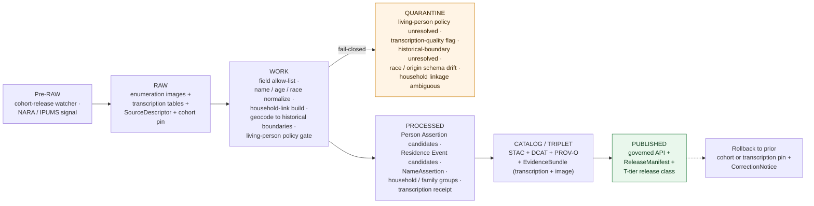

<!-- [KFM_META_BLOCK_V2]
doc_id: kfm://doc/docs-sources-catalog-census-decennial-microdata
title: Historic Decennial Micro-data
type: product-page
version: v0.2
status: draft
owners: <PLACEHOLDER — Docs steward + Source steward for census>
created: 2026-05-20
updated: 2026-05-20
policy_label: public
related:
  - docs/sources/catalog/census/README.md
  - docs/sources/catalog/census/IDENTITY.md
  - docs/sources/catalog/census/RIGHTS-AND-SENSITIVITY-MAP.md
  - docs/sources/catalog/census/decennial-counts.md
  - docs/sources/catalog/census/acs-estimates.md
  - docs/sources/catalog/census/tiger.md
  - docs/sources/catalog/README.md
  - docs/sources/catalog/_examples/stac-item-example.json
  - docs/doctrine/directory-rules.md
tags: [kfm, docs, sources, catalog, census, decennial, microdata, enumeration-sheets, 72-year-rule, people-dna-land, person-bearing, observed]
notes:
  - "PROPOSED product-page scaffold; sibling-link presence verified in Claude Code session."
  - "PROPOSED content sourced from Pass 23/32 atlas (People/DNA/Land domain D/E; Source-Role Anti-Collapse Register §24.1.1; KFM-P17-PROG-0015), Pass 10 (C4-01, C6-05, C6-06), unified-doctrine sensitivity tier scheme T0-T4; descriptor fields intentionally not restated here."
  - "Distinct from the decennial-counts sibling: this product is Observed (per-person enumeration), NOT Aggregate — see top-of-doc WARNING callouts."
[/KFM_META_BLOCK_V2] -->

# Historic Decennial Micro-data

> **Post-disclosure-window** historic decennial **individual and household micro-data** releases — the per-person enumeration sheets released under the **72-year rule** (currently 1790–1950) — modeled in KFM as **Observed** source-role and consumed primarily as **Person Assertions** in the People/DNA/Land domain.

-darkgreen)

**Status:** PROPOSED — scaffold only · **Family:** [`census`](./README.md) · **Owners:** _PLACEHOLDER — Docs steward + Source steward for `census`_ · **Last reviewed:** 2026-05-20

> [!IMPORTANT]
> This is a **scaffold product page**. It points readers at the authoritative homes for source identity, rights, sensitivity, and contract shape; it **does not restate** them. The authoritative `SourceDescriptor` lives in [`data/registry/sources/`](../../../../data/registry/sources/). PROPOSED.

> [!WARNING]
> **Observed, not Aggregate.** CONFIRMED doctrine (Atlas §24.1.1, Source-Role Anti-Collapse Register): historic enumeration sheets are **Observed** — *"A direct reading, measurement, or first-hand evidentiary record tied to a place and time"* — not Aggregate. They are **per-person records**. The published [decennial-counts](./decennial-counts.md) sibling is Aggregate; this product is the *underlying* per-person evidence and **must not be conflated** with the aggregate tables.

> [!WARNING]
> **Person-bearing and identity-resolution-bearing.** The primary content is **names, ages, relationships, race / origin, occupation, place of birth, household composition** of named individuals. CONFIRMED doctrine (KFM-P17-PROG-0015): historic enumeration is the *direct* source of the **"census enumeration in a different county"** contradiction used for identity-resolution confidence subtraction in People/DNA/Land.

> [!WARNING]
> **Living-person policy still applies for recently-released cohorts.** The 72-year rule rolls forward: the 1950 census released in 2022; the 1960 census releases in 2032. Respondents who were children in a recently-released cohort may still be living. PROPOSED: the **living-person policy** applies per-respondent based on enumerated age + census-day date, not a blanket cohort cutoff. See [§Rights and sensitivity](#rights-and-sensitivity).

---

## Quick jump

- [Overview](#overview)
- [What this product is *not*](#what-this-product-is-not)
- [Source authority](#source-authority)
- [Pipeline shape (KFM lifecycle)](#pipeline-shape-kfm-lifecycle)
- [Catalog profiles used](#catalog-profiles-used)
- [Collection identity](#collection-identity)
- [Provenance fields](#provenance-fields)
- [Temporal handling](#temporal-handling)
- [Geometry and projection](#geometry-and-projection)
- [Enumeration fields and schema variation](#enumeration-fields-and-schema-variation)
- [The 72-year rule and cohort cadence](#the-72-year-rule-and-cohort-cadence)
- [Person Assertion projection](#person-assertion-projection)
- [Historical name, race, and origin handling](#historical-name-race-and-origin-handling)
- [Rights and sensitivity](#rights-and-sensitivity)
- [Cross-domain consumers](#cross-domain-consumers)
- [Validation and catalog closure](#validation-and-catalog-closure)
- [Related contracts and schemas](#related-contracts-and-schemas)
- [Related connectors and pipelines](#related-connectors-and-pipelines)
- [Examples](#examples)
- [Open questions](#open-questions)
- [Atlas-card references (collapsible)](#atlas-card-references)
- [Related docs](#related-docs)

---

## Overview

PROPOSED. The U.S. decennial census collects information on every household and individual in the country every ten years. By federal law, the per-person enumeration schedules (the actual filled-in forms naming individuals) are **released to the public 72 years after the census date** through the National Archives and Records Administration (NARA). As of the 2026 reference date, **the 1790–1950 enumerations are fully public**; the 1960 enumeration releases in 2032.

KFM ingests this stream as **per-person evidence** distinct from the aggregate-table product. The records are person-bearing (names, ages, relationships, race / origin categories as historically recorded, occupations, places of birth, household composition) and serve as the foundational evidence for **Person Assertion** in the People/DNA/Land domain.

CONFIRMED Atlas placement (Domains v1.1, People/DNA/Land domain D, source family): *"vital/cemetery/burial/obituary/church/school/military/**census**/directory/court/probate records"* — historic decennial micro-data falls squarely within this source family.

CONFIRMED Atlas placement (Atlas §24.1.1, Source-Role Anti-Collapse Register): enumeration sheets are **Observed** records (a direct evidentiary record tied to a place and time), **not** Aggregate. Per-person evidence rolls up to Aggregate decennial tables; the rollup does not collapse them.

CONFIRMED doctrine (KFM-P17-PROG-0015): *"Identity resolution should subtract confidence for strong contradictions such as census enumeration in a different county or conflicting patents."* Historic decennial micro-data is the source against which this contradiction-check runs. See [§Person Assertion projection](#person-assertion-projection).

> [!NOTE]
> NEEDS VERIFICATION: which ingest path KFM uses (NARA digital images, IPUMS USA cleaned microdata, Ancestry / FamilySearch transcriptions, KFM-internal Kansas-specific transcription), the precise cohort set in scope (1790–1950 currently public; KFM Kansas subset begins meaningfully after Kansas Territory in 1854 and especially after 1860 statehood), license / terms across transcription providers, the per-decade variable allow-list, and ingest cadence (one-time per cohort with periodic re-verification). Resolution belongs in the authoritative `SourceDescriptor`.

[Back to top](#top)

---

## What this product is *not*

PROPOSED — historic decennial micro-data sits adjacent to several products that are easy to conflate:

- **Not aggregate decennial tables.** The aggregate counts (county / tract / block totals) are a separately-governed product with a different source role (Aggregate) and different sensitivity treatment. See [Decennial Counts](./decennial-counts.md).
- **Not ACS PUMS.** The Public Use Microdata Sample from ACS is a *modern* sample microdata release with **statistical disclosure controls** (geographic generalization, top-coding, swap noise). Historic decennial micro-data is **historical** and (for pre-1950 cohorts) is released **without** modern disclosure controls — the 72-year rule is the disclosure control. PUMS is a separate sibling product.
- **Not modern decennial 2020+.** Modern decennial micro-data is **not** publicly released at the per-person level — the 2020 decennial micro-data will be released in 2092.
- **Not GEDCOM / family-tree overlays.** Those are a separate People/DNA/Land source family (Domains v1.1 D). Historic decennial is the **independent enumeration** that family-tree work joins to, not the family-tree itself.
- **Not vital records.** Birth / death / marriage records are a separate People/DNA/Land source family. Decennial enumeration captures *snapshots* every 10 years; vital records capture *events*.
- **Not an aggregate count substitute.** Even though per-person records can be re-aggregated, the aggregate-decennial-counts product is the authority for aggregate use — re-aggregating microdata produces a *different* number than the published Aggregate (due to enumeration-error correction the Bureau applies to published totals).
- **Not living-person records.** The 72-year rule **post-dates** living-person exposure for most respondents — but not all, see top-of-doc WARNING.

[Back to top](#top)

---

## Source authority

See [`data/registry/sources/`](../../../../data/registry/sources/) for the authoritative `SourceDescriptor`. **Do not duplicate descriptor fields here.** PROPOSED placement per Directory Rules §6 and KFM-P1-PROG-0007.

| Authority surface | Where it lives | What it owns | Restated here? |
|---|---|---|---|
| `SourceDescriptor` | [`data/registry/sources/`](../../../../data/registry/sources/) | Identity, **source role = Observed**, rights, cohort cadence, transcription-source pin, sensitivity, living-person policy reference | **No** — pointer only |
| Family overview & sibling links | [`./README.md`](./README.md) | Family-level orientation for `census` | **No** — see family README |
| Collection identity rules | [`./IDENTITY.md`](./IDENTITY.md) | `kfm-<org>-<product>` pattern, namespace | **No** — see IDENTITY |
| Rights & sensitivity mapping | [`./RIGHTS-AND-SENSITIVITY-MAP.md`](./RIGHTS-AND-SENSITIVITY-MAP.md) | Tiering (T0–T4), living-person policy, historical race / origin display | **No** — see map |
| Contract shape | `schemas/contracts/v1/source/` and `schemas/contracts/v1/domains/people-dna-land/` | JSON-schema for descriptor + `Person Assertion` / `NameAssertion` / `Residence Event` shapes | **No** — per ADR-0001 |

PROPOSED source-role posture: **Observed** (Atlas §24.1.1). Specifically: the *original NARA-released enumeration schedule* is the canonical Observed record; **transcriptions** (IPUMS, Ancestry, FamilySearch) are *Observed-with-transcription-receipt* — the transcription introduces a step-with-its-own-errors that must be recorded but does not change the underlying source role.

[Back to top](#top)

---

## Pipeline shape (KFM lifecycle)

CONFIRMED doctrine / PROPOSED lane application: Historic Decennial Micro-data follow the canonical lifecycle invariant **RAW → WORK/QUARANTINE → PROCESSED → CATALOG/TRIPLET → PUBLISHED**, where each transition is a governed state change — not a file move (Directory Rules §3, Connected-Dots Architecture Brief §4).

PROPOSED — diagram reflects KFM doctrine; specific gate names, validators, and connector boundaries for this product **NEED VERIFICATION** against `pipeline_specs/people-dna-land/` and `pipelines/`. The **WORK → QUARANTINE** branch is doctrinally fail-closed on five cases including the **living-person policy gate** (uniquely emphasized here) and **transcription-quality flag** (a per-person-data-specific concern).

[Back to top](#top)

---

## Catalog profiles used

PROPOSED. The catalog projection set this product participates in. Lanes follow Directory Rules §6 and Pass-10 C4 (Catalogs and Metadata Profiles).

| Profile | Lane | Used by this product? |
|---|---|---|
| STAC | `data/catalog/stac/` | PROPOSED — Yes (Collection per (cohort, transcription-source); Items per state / county subset) |
| DCAT | `data/catalog/dcat/` | PROPOSED — Yes (dataset-level metadata, NARA / IPUMS reference) |
| PROV-O | `data/catalog/prov/` | PROPOSED — Yes (field allow-list activity, name / race normalization lineage, household-link construction, transcription provenance) |
| Domain projection (`people-dna-land`) | `data/catalog/domain/people-dna-land/` | PROPOSED — Yes (primary domain home; Person Assertion / Residence Event / NameAssertion) |
| Domain projection (`frontier-matrix`) | `data/catalog/domain/frontier-matrix/` | PROPOSED — Conditional (population context where micro-data is re-aggregated for Frontier Matrix; cite aggregation receipt) |

[Back to top](#top)

---

## Collection identity

- PROPOSED Collection id pattern: `kfm-<org>-<product>` — see [`IDENTITY.md`](./IDENTITY.md) for the canonical rule.
- PROPOSED namespace: `kfm:` — *see [OPEN-DSC-03](#open-questions); Pass-10 C4-01 records the `kfm:` vs `ks-kfm:` choice as an unresolved namespace question.*
- PROPOSED: one Collection per **(cohort, transcription-source)** pair (e.g., `decennial-microdata-1880-ipums`, `decennial-microdata-1900-nara`, `decennial-microdata-1940-familysearch`). NEEDS VERIFICATION.
- Asset roles (enumeration-image, transcription-table, household-link, person-assertion, name-assertion, residence-event, historical-boundary-geocode, transcription-receipt, etc.): NEEDS VERIFICATION — confirm against `schemas/contracts/v1/source/` and `schemas/contracts/v1/domains/people-dna-land/`.

[Back to top](#top)

---

## Provenance fields

CONFIRMED doctrine (Pass-10 C4-01): STAC Items carry an `item.properties.kfm:provenance` block. The fields below are the doctrinal set; **per-product values** are PROPOSED until verified against emitted artifacts in `data/catalog/stac/`.

| Field | Type / form | Role |
|---|---|---|
| `spec_hash` | `sha256` of canonical record (JCS+SHA-256) | Identity anchor; the spec-hash gate is fail-closed at promotion |
| `evidence_bundle_ref` | `kfm://evidence/<digest>` | Resolves to the `EvidenceBundle` carrying receipts, validations, **cohort + transcription-source pin**, **transcription receipt**, **historical-boundary crosswalk**, **living-person policy decision** |
| `run_record_ref` | `kfm://run/<run-id>` | Pointer to the immutable `RunReceipt` for the producing run |
| `audit_ref` | `kfm://audit/<attestation-id>` | SLSA / OPA attestation reference |
| `policy_digest` | `sha256` of the policy bundle | Records the policy set in force at promotion (C5-03 parity) |

Per-asset integrity: `file:checksum` on each STAC asset. PROPOSED product-specific extensions:
- **`TranscriptionReceipt`** — pins the transcription source, transcription date, transcription confidence, and any KFM-side corrections.
- **`PersonAssertionReceipt`** — pins the field allow-list applied and the historical-name / race / origin handling rules.
- **`LivingPersonPolicyDecision`** — for cohorts with potentially-living respondents (currently 1950 onward), records the per-record policy decision.

[Back to top](#top)

---

## Temporal handling

CONFIRMED doctrine / PROPOSED per-product: KFM keeps **source / observed / valid / retrieval / release / correction** times distinct wherever material (Domain Atlas, operating-law invariant 1). Historic micro-data is one of the most temporally-nuanced KFM products — three distinct time anchors per record.

| Time facet | What it means for Historic Decennial Micro-data | Status |
|---|---|---|
| Source time | Original Census Day for the enumeration (varies per decade — see [Decennial Counts §Temporal handling](./decennial-counts.md#temporal-handling) caution) | PROPOSED |
| Observed time | Same as source time for the *enumeration event*; per-person *life events* (birth, place-of-residence) reference the same Census Day | PROPOSED |
| Valid time | Period the snapshot is held to be true for the person (until next decennial or other evidence supersedes) | PROPOSED |
| Retrieval time | When KFM fetched the transcription / NARA image | PROPOSED |
| Release time | When the KFM catalog entry was promoted to PUBLISHED | PROPOSED |
| Correction time | When a `CorrectionNotice` (transcription error correction, living-person policy update) superseded a prior KFM release | PROPOSED |

> [!CAUTION]
> **Transcription time is separate from enumeration time.** A 1900 enumeration transcribed by IPUMS in 1995 and re-transcribed by FamilySearch in 2018 has *one* Census Day but *two* transcription times. The `EvidenceBundle` must preserve both. PROPOSED.

[Back to top](#top)

---

## Geometry and projection

PROPOSED. Historic micro-data itself ships **no geometry** — it ships **per-person records keyed to enumeration district (ED), county, township, place, dwelling number**, and (in some cohorts) **street address**. Geometry is *geocoded* during the WORK stage:

- **Geocoding target** — historical-boundary geography (compare KFM-P17-PROG-0014 patent → historical-county pattern). For most cohorts, geocoding resolves to **historical county** + **historical township / place**; street addresses (where transcribed) resolve to point geometries with explicit uncertainty.
- **CRS** — inherited from the historical-boundary join target. PROPOSED canonical: `EPSG:5070` for any cross-layer overlap SQL (KFM-P26-PROG-0027).
- **Historical boundary** — AHCB or equivalent for county boundaries at Census Day. NEEDS VERIFICATION.
- **Geocoding uncertainty** — PROPOSED: each Person Assertion carries an explicit geocoding uncertainty (`Coordinate Uncertainty` per Spatial Foundation patterns); point-precision street geocodes carry one tier of uncertainty, county-only carries another.
- **No 3D, no time-warped overlay** — this is tabular evidence with geocode pointers; no historic-map raster lives here (those are GLO Plats, sibling product in the `blm` family).

> [!WARNING]
> Point-precision geocoding of a per-person residence is **doctrinally sensitive** for any record where the respondent or their close relatives may still be living. PROPOSED: point-precision geocodes are gated by the living-person policy; cohorts deemed living-person-clear (currently 1790–1940 in the U.S.) may publish point precision; recently-released cohorts may require generalization.

[Back to top](#top)

---

## Enumeration fields and schema variation

PROPOSED. Historic decennial enumeration schedules vary **dramatically** across decades — the field set, terminology, and granularity reflect each era's social categories. PROPOSED — KFM preserves the as-published schema verbatim per cohort and provides **advisory** crosswalks where useful.

| Field family | Coverage across cohorts | Notes |
|---|---|---|
| **Name** (head, spouse, children, others in household) | 1850 onward (1790–1840 listed only heads of household) | Historical naming conventions; gendered honorifics; abbreviations |
| **Age** | All cohorts (varying precision) | Age-heaping is common; some cohorts record age in years + months for infants |
| **Sex** | All cohorts | Historically recorded as binary |
| **Race / Color / Origin** | All cohorts (categories change *substantially* between decades) | Most historically-charged field set — see [§Historical name, race, and origin handling](#historical-name-race-and-origin-handling) |
| **Relationship to head of household** | 1880 onward | Reveals household structure; key for `Genealogy Relationship` |
| **Marital status** | 1880 onward (1850–1870 indirect) | Includes widowed, divorced, age at first marriage in some cohorts |
| **Place of birth (person, parents)** | 1850 onward (1880 added parent birthplaces) | State-level or country-level; key for `Migration Event` reconstruction |
| **Year of immigration / naturalization** | 1900 onward (varies) | Tracks naturalization status |
| **Mother tongue / language** | 1890–1940 (varies) | Reveals immigrant-community structure |
| **Occupation / Industry** | 1850 onward (granularity varies) | Key for `Economic Observation` rollups |
| **Literacy / school attendance** | Most cohorts | Historical social-context evidence |
| **Home ownership / value / rent** | 1890 onward (varies) | Bridges to Land Patents / assessor records |
| **Slavery (1790–1860)** | 1790–1860, then abolition | Enumerated separately as *Slave Schedules* in 1850 and 1860 — see CAUTION below |
| **Veteran status, disability, other special schedules** | Varies; some cohorts have separate schedules | Mortality, agriculture, manufacturing supplements |

> [!CAUTION]
> **1850 and 1860 Slave Schedules** are a distinct schedule type within the historic decennial. They enumerated enslaved individuals by slaveholder, often without recording names, and carry profound historical and ethical weight. PROPOSED: Slave Schedules are ingested with explicit metadata noting their nature, are linked to free-population schedules where possible, and require CARE-aware presentation. Display surfaces must surface their nature; KFM does **not** silently merge slave-schedule records into the general population enumeration.

[Back to top](#top)

---

## The 72-year rule and cohort cadence

PROPOSED. Public release of per-person enumeration sheets follows the **72-year rule**, codified in U.S. law. As of the 2026 reference date:

| Cohort | Census Day | Public release date | Status in KFM (2026) |
|---|---|---|---|
| 1790 | August 2, 1790 | already public | In scope (heads of household only) |
| 1800–1840 | varies (August → June 1) | already public | In scope (heads of household only) |
| 1850 | June 1, 1850 | already public | In scope (free + slave schedules) |
| 1860 | June 1, 1860 | already public | In scope (free + slave schedules) |
| 1870 | June 1, 1870 | already public | In scope |
| 1880 | June 1, 1880 | already public | In scope (relationship + parent birthplace added) |
| 1890 | June 2, 1890 | already public *(mostly destroyed in 1921 fire)* | **Severely incomplete** — see WARNING |
| 1900 | June 1, 1900 | already public | In scope |
| 1910 | April 15, 1910 | already public | In scope |
| 1920 | January 1, 1920 | already public | In scope |
| 1930 | April 1, 1930 | already public | In scope |
| 1940 | April 1, 1940 | already public (released 2012) | In scope |
| 1950 | April 1, 1950 | **released April 2022** | In scope **with living-person policy review** |
| 1960 | April 1, 1960 | releases April 2032 | **Out of scope** until 2032 |
| 1970+ | — | future | Out of scope |

> [!WARNING]
> **The 1890 census schedules were almost entirely destroyed by fire in 1921.** Only fragments survive. KFM consumers querying for 1890 records will find essentially no data; the gap is genuine, not a KFM ingest failure. PROPOSED: the descriptor records the 1890 special status explicitly.

> [!IMPORTANT]
> **The 72-year rule rolls forward.** Every April, new cohort information may be approaching release. The watcher (`pipelines/watchers/`) should anticipate the 1960 release in April 2032 and the per-cohort schedule indefinitely thereafter. NEEDS VERIFICATION on watcher cadence.

[Back to top](#top)

---

## Person Assertion projection

PROPOSED. The primary KFM consumer of this product is the **People/DNA/Land** domain, which owns the object families that historic micro-data projects into (Domains v1.1 ch. on People/DNA/Land, E):

| Object family | What enumeration data becomes | Domain home |
|---|---|---|
| **Person Assertion** | One per enumerated individual, per cohort (a single historical person produces ~7-15 Person Assertions across their life from successive enumerations) | People/DNA/Land |
| **NameAssertion** | The name as transcribed (preserving variant spellings, abbreviations, honorifics) | People/DNA/Land |
| **Residence Event** | Where the person was enumerated at Census Day | People/DNA/Land |
| **Migration Event** | Inferred when consecutive enumerations show different residences | People/DNA/Land |
| **Genealogy Relationship** | From household-structure enumerations (1880+ explicitly; earlier inferred) | People/DNA/Land |
| **FamilyGroup** | Co-resident households | People/DNA/Land |

PROPOSED identity rule (Domain Atlas E): deterministic basis = source id + object role + temporal scope + normalized digest. A Person Assertion's `source_id` references the enumeration cohort + transcription source; multiple cohorts produce multiple Person Assertions for the same historical person; **PersonCanonical resolution** is a separate governed step (Domains v1.1 E).

CONFIRMED doctrine (KFM-P17-PROG-0015) applied here: when reconciling Person Assertions across cohorts toward a PersonCanonical, **a 1900 enumeration in Sumner County combined with a 1900 enumeration in Lyon County for "John Smith age 32"** is a strong contradiction — the resolver subtracts confidence. This is the *direct* operational use of the negative-evidence rule.

> [!IMPORTANT]
> Each Person Assertion is **candidate evidence** until promoted via People/DNA/Land's identity-resolution gates. PROPOSED — the catalog Item should advertise the assertion's promotion state; published Person Assertion records reflect the resolved state, not raw transcription.

[Back to top](#top)

---

## Historical name, race, and origin handling

PROPOSED. Historic enumeration sheets recorded names, race / color / origin categories, and personal characteristics in **the terms of their era**. Some of those terms are now considered offensive, imprecise, or rooted in historical injustice. KFM's posture is *preserve the source verbatim, contextualize the display*.

- **Names** — preserved verbatim as transcribed. Variant spellings, abbreviations, honorifics ("Mrs. John Smith"), and patronymic forms are *evidence*, not noise; correcting them would erase the historical record. PROPOSED: variant-name handling lives in **NameAssertion**, not in upstream cleaning.
- **Race / color / origin categories** — preserved verbatim per cohort. The 1790 enumeration used three categories; 2020 used many. Each cohort's published schema is kept as-is. PROPOSED: KFM provides **advisory** modern crosswalks (e.g., a 1900 "Mulatto" category mapped to a modern multi-race indicator) — these crosswalks are *navigation aids* on top of the data, never replacements for the source.
- **Slave Schedules (1850, 1860)** — preserved with explicit metadata distinguishing them from free-population schedules. Display surfaces must surface their distinct nature; queries that flatten them into general-population counts are doctrinally wrong.
- **Sex / gender** — preserved verbatim. Historically binary; KFM does not synthesize non-binary categories that the source did not record.
- **Living-respondent dignity** — for the 1950 cohort and any future post-72-year cohort with living respondents, sensitive fields (relationship to head, occupation in some cases) may require generalization at publication. PROPOSED — guided by `RIGHTS-AND-SENSITIVITY-MAP.md`.

CONFIRMED doctrine cross-reference (unified-doctrine sensitivity-tier scheme): *"KFM publishes only the safest representation that still answers the steward's and the public's reasonable needs."* PROPOSED — most historic micro-data publishes at **T0 (Open)** or **T1 (Generalized)** with display-layer context for race / origin terms; some 1950-cohort records may publish at **T2 (Reviewer)** until living-respondent risk clears.

> [!WARNING]
> KFM's data lane preserves the source verbatim. The **display lane** is responsible for adding modern context, definitions of historical terms, and CARE-aware framing. **Do not** "clean" historical race or origin categories at ingest — that erases the historical record and breaks identity-resolution against other sources that also preserve them.

[Back to top](#top)

---

## Rights and sensitivity

NEEDS VERIFICATION — see [`policy/sensitivity/`](../../../../policy/sensitivity/) and [`RIGHTS-AND-SENSITIVITY-MAP.md`](./RIGHTS-AND-SENSITIVITY-MAP.md). **Do not restate policy here.**

PROPOSED sensitivity posture for this product:

- **Rights** — Original NARA-released enumeration schedules are **federal public-domain** post-72-years. Transcription providers (IPUMS, Ancestry, FamilySearch) may layer separate licensing on the **transcribed and cleaned** dataset — NEEDS VERIFICATION per ingest path. Free-tier transcription is generally permissive; commercial transcription products may not be redistributable.
- **72-year rule compliance** — automatic by ingest path (KFM only ingests publicly-released cohorts). Watcher must not ingest unreleased cohorts.
- **Living-person policy** — applies per-record for cohorts with potentially-living respondents. Age + cohort + Census Day determines plausible currently-living status. PROPOSED: a configurable maximum-plausible-current-age threshold (e.g., a 1950 enumerated infant is 76 years old today and likely alive; a 1900 enumerated infant is 126 and not). The descriptor records the threshold; the catalog gate checks per-record.
- **Slave Schedule sensitivity** — distinct from free-schedule sensitivity. PROPOSED: Slave Schedules carry CARE-aware metadata and surface their nature in display; queries treating them as ordinary population data are doctrinally wrong.
- **Historical race / origin categories** — preserved verbatim in data; CARE-aware display contextualization required. See [§Historical name, race, and origin handling](#historical-name-race-and-origin-handling).
- **Tribal-enumeration records** — historic enumerations of American Indian populations carry distinct sensitivity. PROPOSED: cross-reference Pass-10 C15-01..03 (CARE MetaBlock); flagged for steward review where tribal sovereignty considerations apply.
- **Aggregation receipt** — when historic micro-data is *re-aggregated* by KFM (for Frontier Matrix consumption), the aggregation receipt must distinguish KFM-internal re-aggregation from Census-Bureau-published aggregate (which is the [decennial-counts](./decennial-counts.md) product).

> [!CAUTION]
> The sensitivity tier varies *per cohort*: pre-1940 mostly T0 (Open); 1940 T0/T1; 1950 a mix of T0/T1/T2 depending on living-respondent assessment. PROPOSED — the per-cohort tier is recorded in the descriptor, not assumed.

[Back to top](#top)

---

## Cross-domain consumers

PROPOSED. Historic decennial micro-data feeds **People/DNA/Land** primarily but has notable cross-domain reach.

| Consuming domain | What it consumes | Constraint |
|---|---|---|
| **People / DNA / Land** (primary) | `Person Assertion`, `NameAssertion`, `Residence Event`, `Migration Event`, `Genealogy Relationship`, `FamilyGroup` (Domains v1.1 People/DNA/Land E) | Observed role; candidate evidence until promoted |
| **Frontier Demography (Frontier Matrix)** | KFM re-aggregated counts as `Population Observation` candidates (cite KFM-internal aggregation receipt, distinct from Census Bureau published) | Aggregate role; must not be conflated with [decennial-counts](./decennial-counts.md) |
| **Settlements & Infrastructure** | Place-of-residence joined to settlement context | Observed role; preserve as evidence |
| **Agriculture** | Farm-household identification via Agricultural Schedules where available | Observed role |
| **Roads / Rail / Trade** | Migration trajectories inferred across cohorts | Migration Event level; inferred, not observed |
| **Archaeology** | Place-name and household-level evidence for historic-settlement context | Observed role; sensitive joins fail closed |

[Back to top](#top)

---

## Validation and catalog closure

PROPOSED gate set for this product. **Catalog closure is required before public release** (Pass-10 / KFM-P1-IDEA-0020).

- **STAC Projection lint** — KFM-P27-FEAT-0003 — PROPOSED.
- **STAC checksum closure** against the `ReleaseManifest` digest — KFM-P22-PROG-0037 — PROPOSED.
- **Spec-hash-match gate** (C5-04) — PROPOSED.
- **(Cohort, transcription-source) pin gate** — PROPOSED; descriptor must declare a specific (cohort, transcription-source) pair.
- **72-year-rule compliance test** — PROPOSED; cohort release date must be ≤ current date − 72 years.
- **Living-person policy gate** — PROPOSED; per-record check against age + cohort + Census Day; living-plausibility threshold from descriptor.
- **Transcription-quality flag preservation** — PROPOSED; upstream transcription confidence flags preserved; KFM does not silently upgrade.
- **Historical-boundary join gate** — PROPOSED; records geocode to a documented historical-boundary time slice.
- **Race / origin schema-drift detection** — PROPOSED; detect when category set changes across cohorts; preserve native schema per cohort.
- **Slave Schedule distinct-handling test** — PROPOSED (1850, 1860); slave-schedule records carry distinct metadata and do not merge with free-schedule.
- **Source-role anti-collapse test** — PROPOSED (Atlas §24.1.1); any record promoted as Aggregate that traces back to per-person micro-data must carry a KFM-internal aggregation receipt distinguishing from Census-Bureau aggregate.
- **Person Assertion candidate gate** — PROPOSED; per-record candidate state until People/DNA/Land identity resolution promotes; published records reflect resolved state.
- **No public RAW / WORK path** — CONFIRMED doctrine; public clients consume governed PUBLISHED state only.

NEEDS VERIFICATION — concrete validator names, fixture paths, and CI workflow files in `tools/validators/` and `.github/workflows/`.

[Back to top](#top)

---

## Related contracts and schemas

- `contracts/domains/people-dna-land/` — semantic meaning for `Person Assertion`, `PersonCanonical`, `NameAssertion`, `LifeEvent`, `Residence Event`, `Migration Event`, `Genealogy Relationship`, `FamilyGroup`. NEEDS VERIFICATION.
- `contracts/common/` — `TranscriptionReceipt`, `PersonAssertionReceipt`, `LivingPersonPolicyDecision` shapes (PROPOSED). NEEDS VERIFICATION.
- `schemas/contracts/v1/source/` — per **ADR-0001** (canonical schema home).
- `schemas/contracts/v1/domains/people-dna-land/` — domain projection shapes for micro-data-derived records.

PROPOSED — exact files NEED VERIFICATION once the repo is mounted.

[Back to top](#top)

---

## Related connectors and pipelines

- `connectors/census/` — source fetchers for the `census` family.
- `pipelines/ingest/`, `pipelines/normalize/`, `pipelines/validate/`, `pipelines/catalog/` — lifecycle stages.
- `pipelines/watchers/` — cohort-release watcher (annual check; new cohort each decade after April).
- `pipeline_specs/people-dna-land/` — declarative spec for the People/DNA/Land projection (primary consumer).

PROPOSED — module file names NEED VERIFICATION.

[Back to top](#top)

---

## Examples

*(Illustrative only — do not treat as authoritative.)*

See [`_examples/stac-item-example.json`](../_examples/stac-item-example.json) for the minimal STAC + `kfm:provenance` shape.

A historic decennial micro-data `EvidenceBundle` is PROPOSED to additionally carry:
- The pinned (cohort, transcription-source) (e.g., `decennial-microdata-1880-ipums-v8`).
- The `TranscriptionReceipt` (transcription provider, transcription date, transcription confidence, any KFM-side corrections).
- The `PersonAssertionReceipt` (field allow-list applied, race / origin handling rules, name-preservation rules).
- For 1950 and later: the `LivingPersonPolicyDecision` per-record (or per-batch with per-record exceptions).
- The historical-boundary crosswalk used (AHCB-equivalent + version) and the geocoding-uncertainty class.
- Pointers to the original NARA enumeration image (where available) for audit.
- The native cohort schema (field list, race / origin enumeration as published).

[Back to top](#top)

---

## Open questions

- **OPEN-DSC-01** — Confirm ingest path (NARA direct vs IPUMS USA vs FamilySearch vs Ancestry vs hybrid), cohort coverage, license terms, and per-cohort table set. NEEDS VERIFICATION — resolution belongs in `SourceDescriptor`.
- **OPEN-DSC-02** — Confirm rights posture across transcription providers and per-record CARE applicability. NEEDS VERIFICATION.
- **OPEN-DSC-03** — `kfm:` vs `ks-kfm:` namespace choice (Pass-10 C4-01). UNKNOWN — awaits ADR.
- **OPEN-FAM-01** — Whether to publish one Collection per (cohort, transcription-source) or one per cohort with transcription-source as discriminator. PROPOSED separate (each transcription has different quality and licensing). NEEDS VERIFICATION.
- **OPEN-FAM-02** — **Living-person plausibility threshold value** for 1950 and future cohorts. PROPOSED: configurable maximum-plausible-current-age (e.g., 110 years). NEEDS VERIFICATION — ADR-class for sensitivity scheme.
- **OPEN-FAM-03** — Slave Schedule handling: how to surface, link to free schedules, and present in display layers. NEEDS VERIFICATION — coordination with People/DNA/Land CARE posture.
- **OPEN-FAM-04** — Historical race / origin / occupation display contextualization policy. PROPOSED: data preserves native categories; display contextualizes. NEEDS VERIFICATION.
- **OPEN-FAM-05** — Historical-boundary crosswalk source (AHCB? NHGIS? bespoke Kansas-specific). NEEDS VERIFICATION — shared question with [decennial-counts](./decennial-counts.md).
- **OPEN-FAM-06** — Variant-name handling and cross-cohort name normalization for PersonCanonical resolution. NEEDS VERIFICATION — coordination with People/DNA/Land identity-resolution logic (KFM-P17-PROG-0015 expansion).
- **OPEN-FAM-07** — Re-aggregation policy: should KFM publish KFM-internal aggregate counts derived from micro-data, given that they may differ from the Census Bureau's published aggregates? PROPOSED yes-with-explicit-aggregation-receipt; NEEDS VERIFICATION.
- **OPEN-FAM-08** — Coordination with PUMS modern microdata sibling (when authored): how to articulate that historic decennial micro-data and ACS PUMS share a microdata-shape but are governed by very different sensitivity regimes. PROPOSED — separate product pages with explicit cross-references.

[Back to top](#top)

---

## Atlas-card references

<b>Pass 23/32 atlas cards and Domains v1.1 references backing this page (click to expand)</b>

These are the KFM atlas cards from which the PROPOSED content above is sourced. They are doctrinal carriers — they do **not** assert mounted-repo implementation. Each card's own truth labels apply.

**Domains v1.1 — People/DNA/Land domain (primary):**
- **Source family D** — *"vital/cemetery/burial/obituary/church/school/military/census/directory/court/probate records"* — historic decennial micro-data sits explicitly within this source family.
- **Object families E** — `Person Assertion`, `PersonCanonical`, `NameAssertion`, `LifeEvent`, `Residence Event`, `Migration Event`, `Genealogy Relationship`, `FamilyGroup`, `DNA Match Evidence`, `DNASegment`. The first six are the canonical projections of historic decennial micro-data.

**Atlas §24.1.1 — Source-Role Anti-Collapse Register (CONFIRMED doctrine):**
- **Observed** role definition: *"A direct reading, measurement, or first-hand evidentiary record tied to a place and time."* Historic enumeration sheets are Observed per-person records.
- Allowed downstream role: *"May feed modeled or aggregate products; never relabeled as 'regulatory' or 'administrative'."* Critically: enumeration sheets *feed* Aggregate decennial counts but the rollup does not collapse the source role.
- Anti-collapse failure mode (worth pre-empting): per-person micro-data labeled as Aggregate.

**Identity-resolution doctrine (CONFIRMED card, operationally critical):**
- **KFM-P17-PROG-0015** — *Negative evidence penalty rules.* Class: programming · Category: ANA · Status: active · Pass 32 spec hash: `sha256:e8a3e7a2b196d61b9bc8cadd7750a74f9a3e6ea31bde8339a44f8b4605adfef7`. PROPOSED: *"Identity resolution should subtract confidence for strong contradictions such as **census enumeration in a different county** or conflicting patents."* This product page is the *source-side* of that rule.

**Unified doctrine sensitivity tier scheme:**
- **T0 (Open)** — public-safe with no transformations required. Most pre-1940 historic micro-data.
- **T1 (Generalized)** — public-safe after generalization / fuzzing / redaction. Some 1940 records, some 1950 records.
- **T2 (Reviewer)** — released only to authenticated reviewers / stewards. Some 1950 records during living-person review window.
- **T3 (Restricted)** — released only under named agreement. Rare for historic enumeration.

**Pass-10 references:**
- **C4-01** — STAC Item `kfm:provenance` namespace (CONFIRMED).
- **C4-02** — STAC Collection with KFM governance description (CONFIRMED).
- **C4-04** — Evidence-Bundle JSON-LD content addressing (CONFIRMED).
- **C5-02 / C5-04** — Default-deny promotion + spec-hash-match gate (CONFIRMED).
- **C6-05** — *Differential Privacy for Aggregates Only* — relevant where KFM re-aggregates micro-data; DP applied to KFM-internal aggregate, never to per-person records.
- **C6-06** — *k-Anonymity for Living-People Overlays* — relevant for 1950 cohort and future cohorts with potentially-living respondents.
- **C15-01..03** — CARE MetaBlock v2, `kfm:care` extension, OPA default-deny on CARE-tagged assets (CONFIRMED).

**Adjacent product (sibling, this catalog):**
- [`decennial-counts.md`](./decennial-counts.md) — the Aggregate decennial product (different source role; same census surveys).

[Back to top](#top)

---

## Related docs

- [`docs/sources/catalog/census/README.md`](./README.md) — `census` family landing page.
- [`docs/sources/catalog/census/IDENTITY.md`](./IDENTITY.md) — Collection-id and namespace rules for the family.
- [`docs/sources/catalog/census/RIGHTS-AND-SENSITIVITY-MAP.md`](./RIGHTS-AND-SENSITIVITY-MAP.md) — Rights / sensitivity tiering for `census` (living-person policy, historical race / origin display).
- [`docs/sources/catalog/census/decennial-counts.md`](./decennial-counts.md) — Sibling: aggregate decennial tables (Aggregate source role).
- [`docs/sources/catalog/census/acs-estimates.md`](./acs-estimates.md) — Sibling: ACS estimates (Aggregate source role).
- [`docs/sources/catalog/census/tiger.md`](./tiger.md) — Sibling: TIGER/Line boundary geometry (modern geography only).
- _TODO_ — `docs/sources/catalog/census/pums.md` — PUMS microdata (modern microdata sibling).
- [`docs/sources/catalog/README.md`](../../README.md) — Catalog of source families.
- [`docs/sources/catalog/_examples/stac-item-example.json`](../_examples/stac-item-example.json) — Illustrative STAC + `kfm:provenance` shape.
- [`docs/doctrine/directory-rules.md`](../../../../docs/doctrine/directory-rules.md) — Placement authority.
- _TODO_ — `docs/standards/STAC_KFM_PROFILE.md` (PROPOSED, Pass-10 C4-01 expansion).
- _TODO_ — `docs/standards/PERSON_ASSERTION.md` — Person-bearing source schema (PROPOSED).
- _TODO_ — `docs/standards/TRANSCRIPTION_RECEIPT.md` — Transcription-source receipt schema (PROPOSED).
- _TODO_ — `docs/standards/LIVING_PERSON_POLICY.md` — Living-person policy doctrine (PROPOSED, shared with vital / military / probate records).
- _TODO_ — `docs/standards/PROV.md` _(or `PROVENANCE.md`, naming question per Directory Rules §18 OPEN-DR-01)_.
- _TODO_ — `docs/domains/people-dna-land/README.md` — Primary consuming domain (Person Assertion / PersonCanonical / identity resolution).
- _TODO_ — `docs/domains/frontier-matrix/README.md` — Secondary consumer for re-aggregated panels.

---

_Last updated: **2026-05-20** · doc version **v0.2** · status **draft / PROPOSED scaffold**_

[Back to top](#top)
