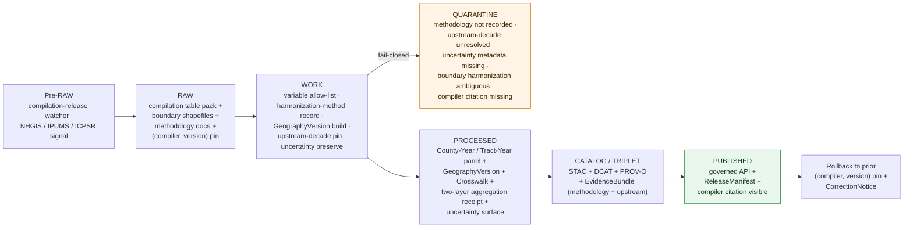

<!-- [KFM_META_BLOCK_V2]
doc_id: kfm://doc/docs-sources-catalog-census-nhgis-compilations
title: Census Historical Compilations (NHGIS-style)
type: product-page
version: v0.2
status: draft
owners: <PLACEHOLDER — Docs steward + Source steward for census>
created: 2026-05-20
updated: 2026-05-20
policy_label: public
related:
  - docs/sources/catalog/census/README.md
  - docs/sources/catalog/census/IDENTITY.md
  - docs/sources/catalog/census/RIGHTS-AND-SENSITIVITY-MAP.md
  - docs/sources/catalog/census/decennial-counts.md
  - docs/sources/catalog/census/decennial-microdata.md
  - docs/sources/catalog/census/acs-estimates.md
  - docs/sources/catalog/census/tiger.md
  - docs/sources/catalog/README.md
  - docs/sources/catalog/_examples/stac-item-example.json
  - docs/doctrine/directory-rules.md
tags: [kfm, docs, sources, catalog, census, historical-compilation, nhgis, ipums, county-year-panel, boundary-harmonization, geography-version, frontier-matrix, crosswalk]
notes:
  - "PROPOSED product-page scaffold; sibling-link presence verified in Claude Code session."
  - "PROPOSED content sourced from Pass 23/32 atlas (Frontier Matrix domain B/D/E; Source-Role Anti-Collapse Register §24.1.1 — Aggregate + Modeled doctrine), KFM-P5-PROG-0008 (crosswalk manifest pattern), KFM-P25-IDEA-0014 (deterministic spatial identity), KFM-P9-FEAT-0008 (uncertainty doctrine), Pass 10 (C4-01, C6-05); descriptor fields intentionally not restated here."
  - "Distinct from the decennial-counts sibling: this is a THIRD-PARTY COMPILATION of decennial+ACS+historical-gazetteer aggregate data, with boundary harmonization as a Modeled step — see top-of-doc WARNING callouts."
[/KFM_META_BLOCK_V2] -->

# Census Historical Compilations (NHGIS-style)

> **Re-published, compiled historical Census panels** — county-year, tract-year, and similar harmonized aggregations produced by third-party compilers (NHGIS / IPUMS, ICPSR, Caliper, scholarly products) — that combine Census Bureau **Aggregate** releases with **Modeled** boundary harmonization to produce time-consistent geography panels.

**Status:** PROPOSED — scaffold only · **Family:** [`census`](./README.md) · **Owners:** _PLACEHOLDER — Docs steward + Source steward for `census`_ · **Last reviewed:** 2026-05-20

> [!IMPORTANT]
> This is a **scaffold product page**. It points readers at the authoritative homes for source identity, rights, sensitivity, and contract shape; it **does not restate** them. The authoritative `SourceDescriptor` lives in [`data/registry/sources/`](../../../../data/registry/sources/). PROPOSED.

> [!WARNING]
> **Two-layer source-role posture: Aggregate + Modeled.** CONFIRMED doctrine (Atlas §24.1.1, Source-Role Anti-Collapse Register): the underlying values are **Aggregate** (re-published Census Bureau county / tract counts); the **boundary harmonization** between decades is **Modeled** — *"A derived product from inputs, assumptions, or fitted parameters; uncertainty and provenance of inputs must be preserved."* Both roles must be recorded in the descriptor and **must not collapse**. Modeled-as-observed and Aggregate-as-per-place are both DENY conditions.

> [!WARNING]
> **Third-party compilation, not the official Census Bureau release.** The Census Bureau is the authority for the underlying data; NHGIS (Minnesota Population Center / IPUMS), ICPSR, and similar compilers are *authoritative compilers* but **not** the original source. PROPOSED: cite *both* — the underlying Census Bureau decade and product, *and* the compilation provider and version — in every `EvidenceBundle`.

> [!WARNING]
> **Boundary harmonization carries uncertainty.** CONFIRMED doctrine (KFM-P9-FEAT-0008, normalized statement): geostatistical / Modeled products must publish *"interpolation method, sampling support, assumptions, and uncertainty metadata."* For NHGIS-style harmonization, this means recording the interpolation method (areal weighting, dasymetric, population-weighted, etc.), the donor-target boundary pair, and the per-cell uncertainty. KFM consumers must surface this uncertainty alongside the harmonized value.

---

## Quick jump

- [Overview](#overview)
- [What this product is *not*](#what-this-product-is-not)
- [Source authority](#source-authority)
- [Pipeline shape (KFM lifecycle)](#pipeline-shape-kfm-lifecycle)
- [Catalog profiles used](#catalog-profiles-used)
- [Collection identity](#collection-identity)
- [Provenance fields](#provenance-fields)
- [Temporal handling](#temporal-handling)
- [Geometry, harmonized boundaries, and GeographyVersion](#geometry-harmonized-boundaries-and-geographyversion)
- [Boundary harmonization methodology](#boundary-harmonization-methodology)
- [Compiler diversity (NHGIS / IPUMS / ICPSR / others)](#compiler-diversity-nhgis--ipums--icpsr--others)
- [Two-layer aggregation receipt](#two-layer-aggregation-receipt)
- [Rights and sensitivity](#rights-and-sensitivity)
- [Cross-domain consumers](#cross-domain-consumers)
- [Validation and catalog closure](#validation-and-catalog-closure)
- [Related contracts and schemas](#related-contracts-and-schemas)
- [Related connectors and pipelines](#related-connectors-and-pipelines)
- [Examples](#examples)
- [Open questions](#open-questions)
- [Atlas-card references (collapsible)](#atlas-card-references)
- [Related docs](#related-docs)

---

## Overview

PROPOSED. **Census historical compilations** are scholarly and institutional re-publications of U.S. Census Bureau decennial, ACS, and historical-data releases — re-shaped into **county-year and tract-year panels** with harmonized geography so they can be queried as continuous time series across decades. The canonical example is **NHGIS (National Historical GIS)** produced by the Minnesota Population Center (IPUMS), which provides 1790–present harmonized tables with companion historical-boundary GIS files; **ICPSR**, **Caliper**, and academic compilations populate the same product category.

CONFIRMED Atlas placement (Domains v1.1, **Frontier Matrix domain B / D**): the Frontier Matrix domain explicitly owns *"Frontier Definition; **GeographyVersion**; **County-Year Panel**; Population Observation; Economic Observation; Agriculture Observation; Access Observation; Settlement Status; Land Office Record; Public Land Record; **Admin Boundary Change**; **Crosswalk**; Uncertainty Class; Frontier Threshold Model; Matrix Release."* NHGIS-style compilations are the **canonical input** for this domain's object families.

CONFIRMED Atlas placement (Frontier Matrix domain D source families): two source families bear directly on this product —
- *"Census decennial, ACS, historical datasets"* — the underlying data,
- *"historical gazetteers and maps"* — the historical-boundary geography NHGIS produces alongside the data.

Doctrinally, the compilation provides a **canonical pre-resolved Crosswalk** for cross-decade analysis: rather than each consumer re-implementing 1880→2010 boundary harmonization, NHGIS publishes one harmonization with documented methodology, which KFM ingests once and records with full provenance.

> [!NOTE]
> NEEDS VERIFICATION: which compiler(s) KFM uses (NHGIS / IPUMS USA as the canonical first choice; ICPSR / others as adjuncts), the precise version pin per ingest, license / DUA terms (NHGIS in particular requires user registration and citation; redistribution terms vary), the precise table set in scope per decade, and the harmonization-method choice (NHGIS publishes both "time-consistent" and "year-specific" geographies). Resolution belongs in the authoritative `SourceDescriptor`.

[Back to top](#top)

---

## What this product is *not*

PROPOSED — historical compilations sit adjacent to several Census products that are easy to conflate:

- **Not the official Census Bureau release.** This is a *third-party* re-publication. The Census Bureau remains the underlying authority; the compiler adds harmonization. See [Decennial Counts](./decennial-counts.md) and [ACS Estimates](./acs-estimates.md) for direct Census Bureau ingest.
- **Not per-person micro-data.** Historical compilations are *aggregates*, not enumeration sheets. For per-person records see [Historic Decennial Micro-data](./decennial-microdata.md).
- **Not raw TIGER.** Historical compilations include their *own* historical-boundary GIS files (NHGIS GIS, IPUMS-NHGIS shapefiles). Those are the boundary geography appropriate for the harmonized data — *not* modern TIGER. See [TIGER](./tiger.md) for modern boundary geometry.
- **Not a substitute for AHCB.** The Atlas of Historical County Boundaries (AHCB) is a *boundary* compilation. NHGIS-style historical-data compilations *use* AHCB-equivalent boundaries but their primary content is *data* (counts, estimates), not just boundaries. KFM may use AHCB independently for boundary-only work.
- **Not a single product.** "Historical compilations" is a product category. Different compilers, different harmonization methods, different cohort coverage. The descriptor must pin a specific compiler + version per ingest.
- **Not authoritative for any specific decade's data.** When the underlying decade's official Census Bureau aggregate disagrees with the compilation, **the Census Bureau release is the authority for that decade**. The compilation is authoritative for the *cross-decade harmonization*, not for any single year.
- **Not modeled-as-observed.** PROPOSED — harmonized values are Aggregate + Modeled. Treating them as Observed is a DENY condition (Atlas §24.1.1 anti-collapse).
- **Not a pure crosswalk.** NHGIS publishes some pure crosswalks (boundary-to-boundary mappings) and some harmonized data (counts re-allocated). This product page covers the *data* products; pure-crosswalk products may live elsewhere (e.g., under `Crosswalk` as a Frontier Matrix object).

[Back to top](#top)

---

## Source authority

See [`data/registry/sources/`](../../../../data/registry/sources/) for the authoritative `SourceDescriptor`. **Do not duplicate descriptor fields here.** PROPOSED placement per Directory Rules §6 and KFM-P1-PROG-0007.

| Authority surface | Where it lives | What it owns | Restated here? |
|---|---|---|---|
| `SourceDescriptor` | [`data/registry/sources/`](../../../../data/registry/sources/) | Identity, **source role = Aggregate + Modeled**, rights, compiler pin, version pin, harmonization-method pin, citation requirement | **No** — pointer only |
| Family overview & sibling links | [`./README.md`](./README.md) | Family-level orientation for `census` | **No** — see family README |
| Collection identity rules | [`./IDENTITY.md`](./IDENTITY.md) | `kfm-<org>-<product>` pattern, namespace | **No** — see IDENTITY |
| Rights & sensitivity mapping | [`./RIGHTS-AND-SENSITIVITY-MAP.md`](./RIGHTS-AND-SENSITIVITY-MAP.md) | Tiering, compiler-DUA, citation enforcement | **No** — see map |
| Contract shape | `schemas/contracts/v1/source/` and `schemas/contracts/v1/domains/frontier-matrix/` | JSON-schema for descriptor + `County-Year Panel` / `GeographyVersion` / `Crosswalk` shapes | **No** — per ADR-0001 |

PROPOSED source-role posture: **Aggregate + Modeled**. The underlying *values* trace to Aggregate Census Bureau releases (e.g., 1880 decennial county counts). The *boundary harmonization* — re-allocating those values to a different decade's geography — is a Modeled step with documented method, parameters, and uncertainty. Both roles travel with the record.

> [!NOTE]
> PROPOSED dual-authority structure: the underlying authority is the **Census Bureau** (for each decade's source value); the harmonization authority is the **compiler** (NHGIS, ICPSR, etc.). The descriptor records **both** with separate version pins and license / citation requirements.

[Back to top](#top)

---

## Pipeline shape (KFM lifecycle)

CONFIRMED doctrine / PROPOSED lane application: Historical compilations follow the canonical lifecycle invariant **RAW → WORK/QUARANTINE → PROCESSED → CATALOG/TRIPLET → PUBLISHED**, where each transition is a governed state change — not a file move (Directory Rules §3, Connected-Dots Architecture Brief §4).

PROPOSED — diagram reflects KFM doctrine; specific gate names, validators, and connector boundaries for this product **NEED VERIFICATION** against `pipeline_specs/frontier-matrix/` and `pipelines/`. The **WORK → QUARANTINE** branch is doctrinally fail-closed on five cases including the **methodology not recorded** gate (required because boundary harmonization is a Modeled step, and Modeled doctrine requires method+receipt+bounds per Atlas §24.1.1).

[Back to top](#top)

---

## Catalog profiles used

PROPOSED. The catalog projection set this product participates in. Lanes follow Directory Rules §6 and Pass-10 C4 (Catalogs and Metadata Profiles).

| Profile | Lane | Used by this product? |
|---|---|---|
| STAC | `data/catalog/stac/` | PROPOSED — Yes (Collection per (compiler, version, harmonization-method); Items per geography level × decade) |
| DCAT | `data/catalog/dcat/` | PROPOSED — Yes (dataset-level metadata, compiler citation, upstream Census Bureau reference) |
| PROV-O | `data/catalog/prov/` | PROPOSED — Yes (harmonization-method activity, upstream-decade lineage, boundary-version derivation) |
| Domain projection (`frontier-matrix`) | `data/catalog/domain/frontier-matrix/` | PROPOSED — Yes (primary: County-Year Panel, GeographyVersion, Crosswalk, Admin Boundary Change) |
| Domain projection (cross-domain) | `data/catalog/domain/<consuming-domain>/` | PROPOSED — Conditional (Settlements / Agriculture / People-DNA-Land context via Frontier Matrix) |

[Back to top](#top)

---

## Collection identity

- PROPOSED Collection id pattern: `kfm-<org>-<product>` — see [`IDENTITY.md`](./IDENTITY.md) for the canonical rule.
- PROPOSED namespace: `kfm:` — *see [OPEN-DSC-03](#open-questions); Pass-10 C4-01 records the `kfm:` vs `ks-kfm:` choice as an unresolved namespace question.*
- PROPOSED: one Collection per **(compiler, version, harmonization-method)** triple (e.g., `nhgis-v18-time-consistent-2010`, `nhgis-v18-year-specific`, `icpsr-2896-county-year`). NEEDS VERIFICATION.
- Asset roles (panel-table, boundary-shapefile, methodology-doc, crosswalk-table, uncertainty-surface, two-layer-aggregation-receipt, compiler-citation, etc.): NEEDS VERIFICATION — confirm against `schemas/contracts/v1/source/` and `schemas/contracts/v1/domains/frontier-matrix/`.

[Back to top](#top)

---

## Provenance fields

CONFIRMED doctrine (Pass-10 C4-01): STAC Items carry an `item.properties.kfm:provenance` block. The fields below are the doctrinal set; **per-product values** are PROPOSED until verified against emitted artifacts in `data/catalog/stac/`.

| Field | Type / form | Role |
|---|---|---|
| `spec_hash` | `sha256` of canonical record (JCS+SHA-256) | Identity anchor; the spec-hash gate is fail-closed at promotion |
| `evidence_bundle_ref` | `kfm://evidence/<digest>` | Resolves to the `EvidenceBundle` carrying receipts, validations, **(compiler, version, harmonization-method) pin**, **two-layer aggregation receipt** (upstream Census Bureau + harmonization), **uncertainty surface** |
| `run_record_ref` | `kfm://run/<run-id>` | Pointer to the immutable `RunReceipt` for the producing run |
| `audit_ref` | `kfm://audit/<attestation-id>` | SLSA / OPA attestation reference |
| `policy_digest` | `sha256` of the policy bundle | Records the policy set in force at promotion (C5-03 parity) |

Per-asset integrity: `file:checksum` on each STAC asset. PROPOSED product-specific extensions:
- **`HarmonizationReceipt`** — pins the harmonization method (areal weighting / dasymetric / population-weighted / etc.), the donor-target boundary pair, and per-cell uncertainty.
- **`CompilerCitation`** — pins the canonical compiler citation (NHGIS / IPUMS DUA-required citation text, ICPSR study number, etc.).
- **`UpstreamSourceLineage`** — links each compiled value back to the underlying Census Bureau decade and release product (compare [Decennial Counts](./decennial-counts.md) for the upstream).

[Back to top](#top)

---

## Temporal handling

CONFIRMED doctrine / PROPOSED per-product: KFM keeps **source / observed / valid / retrieval / release / correction** times distinct wherever material (Domain Atlas, operating-law invariant 1). Historical compilations have an unusually *layered* temporal structure: source / underlying-observation / harmonization-target.

| Time facet | What it means for Historical Compilations | Status |
|---|---|---|
| Source time | Compilation release date for the pinned (compiler, version) (e.g., NHGIS v18 released YYYY) | PROPOSED |
| Observed time | Census Day for each underlying decade contributing to the panel — *one panel may span many decades* | PROPOSED — distinct per cell |
| Valid time | The decade for which each underlying value was authoritative; **separate from** the *target* geography year used by the harmonization | PROPOSED |
| Retrieval time | When KFM fetched the compilation | PROPOSED |
| Release time | When the KFM catalog entry was promoted to PUBLISHED | PROPOSED |
| Correction time | When a `CorrectionNotice` (compiler erratum, methodology revision, KFM-side allow-list correction) superseded a prior KFM release | PROPOSED |

> [!CAUTION]
> **Harmonization target year is separate from observation year.** "1880 population in 2010 county boundaries" carries two dates: the *observation* is 1880; the *target geography* is 2010. The `EvidenceBundle` must preserve both. This is the single most common temporal confusion with NHGIS-style products.

[Back to top](#top)

---

## Geometry, harmonized boundaries, and GeographyVersion

PROPOSED. Historical compilations ship **both** data *and* boundary geometry — the geometry is essential to interpret the data correctly. Boundaries map to the Frontier Matrix `GeographyVersion` object family (Domains v1.1, ch. on Frontier Matrix, B).

- **GeographyVersion** — each compilation publishes one or more boundary versions (e.g., "1880 contemporaneous county boundaries", "2010 county boundaries used as constant-boundary target"). Each becomes a `GeographyVersion` record in KFM.
- **Two boundary conventions** —
  - **Contemporaneous (year-specific)**: data published on the actual boundaries in effect at observation time. PROPOSED — useful for historical-context analysis.
  - **Constant-boundary (time-consistent)**: data re-allocated to a single target boundary year (commonly 2010 or 2020 county boundaries). PROPOSED — useful for cross-decade trend analysis.
  - PROPOSED: KFM ingests both, recorded with explicit `GeographyVersion` per record; consumers may pick.
- **CRS** — PROPOSED canonical: `EPSG:5070` for overlap SQL (KFM-P26-PROG-0027). Upstream compilation CRS NEEDS VERIFICATION; projection-transform receipt records any reprojection.
- **`Admin Boundary Change`** — the Frontier Matrix domain owns this object family. PROPOSED: each historical boundary change documented by the compilation becomes an `Admin Boundary Change` record (county splits, mergers, name changes, state-line shifts).
- **`Crosswalk`** — the Frontier Matrix domain owns this object family. PROPOSED: NHGIS-style boundary-to-boundary mappings become `Crosswalk` records, citing the compiler's methodology.

> [!IMPORTANT]
> Don't join NHGIS-harmonized data to modern TIGER geometry assuming match. The geometry **lives with the data** — use the compilation's own boundary shapefiles. Modern TIGER may differ from the compilation's target-year boundaries in subtle ways (water-feature exclusions, equivalent-area treatment, etc.).

[Back to top](#top)

---

## Boundary harmonization methodology

PROPOSED. **Boundary harmonization is a Modeled step** (Atlas §24.1.1: *"A derived product from inputs, assumptions, or fitted parameters; uncertainty and provenance of inputs must be preserved"*). Each method has different strengths and well-known limitations.

| Method | What it does | When it works well | Known limitations |
|---|---|---|---|
| **Areal weighting** | Re-allocate counts to target boundary by area-proportional share | Uniform population distribution; simple geographic splits | Fails badly when population is concentrated (urban core in only part of a target unit) |
| **Dasymetric** | Re-allocate weighted by ancillary land-use / population layer | Better than areal weighting when ancillary layer exists | Depends on quality and time-alignment of the ancillary layer |
| **Population-weighted** | Re-allocate by historical population density estimate | Useful when historical settlement pattern is known | Requires a separate historical-population surface estimate |
| **Crosswalk-table direct** | Use compiler's published donor-target table (no interpolation) | Authoritative if compiler-published | Tied to compiler's choices and assumptions |
| **No-harmonization (contemporaneous only)** | Publish at observation-year boundaries; let consumer harmonize if needed | Preserves original record exactly | Cross-decade comparison requires consumer-side work |

CONFIRMED doctrine (KFM-P9-FEAT-0008): geostatistical / Modeled products require *"interpolation method, sampling support, assumptions, and uncertainty metadata."* PROPOSED applied here: the **`HarmonizationReceipt`** records:
- The method used (one of the above).
- The donor-target boundary pair.
- The ancillary layer (if any) and its version.
- The per-cell uncertainty (compiler-published or KFM-computed).
- Known limitations (e.g., "areal weighting fails for cells with > X% urban concentration").

CONFIRMED reference pattern (KFM-P5-PROG-0008, COMID→HUC12 crosswalk manifest): KFM doctrine for spatial crosswalks is *"computed deterministically per release with a fixed fallback order, explicit alignment scoring, geometry sanity flags, version-drift handling, [region]-subset CI probing, and a DSSE-signed manifest carrying both spec_hash (descriptor) and a release content hash."* PROPOSED: NHGIS-style harmonizations should follow this pattern — even though NHGIS publishes the methodology upstream, KFM records it in the same crosswalk-manifest form.

> [!WARNING]
> **Modeled-as-observed is a DENY condition.** Atlas §24.1.1 anti-collapse: a harmonized value queried as if it were a direct observation must DENY. PROPOSED — the catalog gate fails closed when an item with `source_role = aggregate+modeled` is queried via the Observed API path.

[Back to top](#top)

---

## Compiler diversity (NHGIS / IPUMS / ICPSR / others)

PROPOSED. "NHGIS-style" is a product category; the descriptor must pin a specific compiler. Major historical-compilation sources KFM may consume:

| Compiler | Notes | License / rights | KFM ingest priority |
|---|---|---|---|
| **NHGIS / IPUMS USA** (Minnesota Population Center) | Canonical example; 1790–present harmonized; includes boundary shapefiles; user registration + citation required | Free with registration; **citation required**; redistribution requires checking DUA | PROPOSED — high |
| **ICPSR** (University of Michigan) | Many individual studies (study numbers); per-study terms; broad social-science compilations | Per-study terms; many open; some restricted | PROPOSED — medium |
| **Caliper Maptitude historical data** | Commercial product; comprehensive | Commercial license; **not freely redistributable** | PROPOSED — low (unless licensed) |
| **Academic / institutional compilations** | One-off scholarly products (e.g., specific historical demography projects) | Per-product terms; many open | PROPOSED — case-by-case |
| **AHCB (Atlas of Historical County Boundaries)** | Boundaries only, not data; companion to many NHGIS-style products | Free, citation required | PROPOSED — frequently combined with NHGIS |

> [!NOTE]
> **NHGIS data-use agreement (DUA) typically requires citation.** PROPOSED — the `CompilerCitation` field in the EvidenceBundle carries the exact required citation text per (compiler, version); display surfaces include the citation when surfacing data.

[Back to top](#top)

---

## Two-layer aggregation receipt

PROPOSED. CONFIRMED doctrine (Atlas §24.1.1, Aggregate role): aggregate sources are cited *"with aggregation receipt; never treated as a per-place record."* For historical compilations, the aggregation receipt has **two layers**:

1. **Upstream aggregation** — the original Census Bureau decade and product (e.g., "1880 decennial Aggregate Census Table 1, county-level"). This is the Aggregate-source attribution.
2. **Compiler harmonization** — the compiler's methodology layered on top (e.g., "NHGIS v18 time-consistent re-allocation of 1880 county counts to 2010 county boundaries via areal weighting"). This is the Modeled-step attribution.

PROPOSED `AggregationReceipt` for this product carries:
- Upstream-layer: the underlying Census Bureau decade, release product, and (if applicable) DAS posture.
- Compiler-layer: the compiler, version, harmonization-method, donor-target boundary pair, uncertainty metadata.
- Citation: the compiler's required citation text.

Cross-domain consumers cite **both** layers (per Atlas §24.1.1 doctrine of preserving source-role provenance through promotion).

[Back to top](#top)

---

## Rights and sensitivity

NEEDS VERIFICATION — see [`policy/sensitivity/`](../../../../policy/sensitivity/) and [`RIGHTS-AND-SENSITIVITY-MAP.md`](./RIGHTS-AND-SENSITIVITY-MAP.md). **Do not restate policy here.**

PROPOSED sensitivity posture for this product:

- **Rights** — the underlying Census Bureau data is federal public-domain; the **compiler layer** carries its own terms.
  - **NHGIS / IPUMS USA**: free with user registration; **citation required**; redistribution requires checking the DUA. KFM compliance: enforce citation in all surfaces; document any redistribution in `RIGHTS-AND-SENSITIVITY-MAP.md`.
  - **ICPSR**: per-study terms (many open, some restricted). KFM compliance: pin a specific study and verify its terms.
  - **Caliper**: commercial license; not freely redistributable.
- **CARE applicability** — flagged for review for compilation-aggregated tables that segment by tribal area, race / origin / ethnicity at small populations. Pass-10 C15-01..03 default-deny may apply at render time. PROPOSED.
- **Re-identification risk** — minimal at the compilation-aggregate level (the underlying Census Bureau disclosure controls already applied). Re-aggregating to very small geographies can compound risk — PROPOSED: cell-count-floor enforcement at render time for tribal-area and small-population tables.
- **Compiler citation as a rights obligation** — PROPOSED: the `CompilerCitation` field is enforced at publication; surfaces that fail to display the required citation are doctrinally non-compliant.
- **Living-person policy** — not applicable at compilation-aggregate level. PROPOSED.

[Back to top](#top)

---

## Cross-domain consumers

PROPOSED. Historical compilations feed the **Frontier Matrix** domain primarily — they are the canonical source for several Frontier Matrix object families.

| Consuming domain | What it consumes | Constraint (Atlas §24.1.1 / Domain Atlas F) |
|---|---|---|
| **Frontier Matrix** (primary) | `County-Year Panel`, `GeographyVersion`, `Admin Boundary Change`, `Crosswalk`, `Population Observation`, `Economic Observation`, `Agriculture Observation`, `Settlement Status`, `Frontier Definition`, `Frontier Threshold Model`, `Matrix Release` (Domains v1.1 ch. on Frontier Matrix, B) | Aggregate + Modeled roles preserved; cite both layers |
| **Settlements & Infrastructure** | Place-level historical context from harmonized panels | Aggregate role; cite compiler |
| **Agriculture** | Farm / crop / acreage historical panels (where compiled from Census of Agriculture) | Aggregate role |
| **People / DNA / Land** | Historical context joins (county-year denominators for Person Assertion sets) — *aggregate-only*, never per-person | Aggregate role; never treat as per-person evidence |
| **Roads / Rail / Trade** | Historical access-context joins | Aggregate role |
| **Habitat / Fauna / Flora** | Historical human-pressure context | Aggregate role |

[Back to top](#top)

---

## Validation and catalog closure

PROPOSED gate set for this product. **Catalog closure is required before public release** (Pass-10 / KFM-P1-IDEA-0020).

- **STAC Projection lint** — KFM-P27-FEAT-0003 — PROPOSED.
- **STAC checksum closure** against the `ReleaseManifest` digest — KFM-P22-PROG-0037 — PROPOSED.
- **Spec-hash-match gate** (C5-04) — PROPOSED.
- **(Compiler, version, harmonization-method) pin gate** — PROPOSED; descriptor must declare all three; "latest NHGIS" is not a valid pin.
- **HarmonizationReceipt presence gate** — PROPOSED (KFM-P9-FEAT-0008 + Atlas §24.1.1 Modeled doctrine); method, donor-target boundary, uncertainty all required.
- **Two-layer aggregation receipt gate** — PROPOSED; both upstream Census Bureau attribution and compiler harmonization attribution required.
- **Upstream-decade lineage test** — PROPOSED; each compiled value must link back to a specific underlying Census Bureau decade and release product.
- **Variable allow-list gate** — PROPOSED; unknown variables fail closed at WORK.
- **GeographyVersion build gate** — PROPOSED; boundary shapefiles must produce a valid `GeographyVersion` record per published target year.
- **Compiler-citation presence gate** — PROPOSED; required at publication where the compiler's DUA mandates citation.
- **Source-role anti-collapse test** — PROPOSED (Atlas §24.1.1); harmonized values queried via the Observed API path must DENY; per-place queries on aggregate panels must include the aggregation receipt.
- **Boundary-version-consistency test** — PROPOSED; data records and boundary records share the same `GeographyVersion` pin.
- **No public RAW / WORK path** — CONFIRMED doctrine; public clients consume governed PUBLISHED state only.

NEEDS VERIFICATION — concrete validator names, fixture paths, and CI workflow files in `tools/validators/` and `.github/workflows/`.

[Back to top](#top)

---

## Related contracts and schemas

- `contracts/domains/frontier-matrix/` — semantic meaning for `County-Year Panel`, `GeographyVersion`, `Admin Boundary Change`, `Crosswalk`, `Population Observation`, `Economic Observation`. NEEDS VERIFICATION.
- `contracts/common/` — `HarmonizationReceipt`, `CompilerCitation`, `UpstreamSourceLineage`, two-layer `AggregationReceipt` (PROPOSED). NEEDS VERIFICATION.
- `schemas/contracts/v1/source/` — per **ADR-0001** (canonical schema home).
- `schemas/contracts/v1/domains/frontier-matrix/` — domain projection shapes for compilation-derived records.

PROPOSED — exact files NEED VERIFICATION once the repo is mounted.

[Back to top](#top)

---

## Related connectors and pipelines

- `connectors/census/` — source fetchers for the `census` family (compilations + decennial + ACS + TIGER).
- `pipelines/ingest/`, `pipelines/normalize/`, `pipelines/validate/`, `pipelines/catalog/` — lifecycle stages.
- `pipelines/watchers/` — compilation-release watcher (NHGIS / IPUMS / ICPSR version-bump signals).
- `pipeline_specs/frontier-matrix/` — declarative spec for the Frontier Matrix projection (primary consumer).
- **Crosswalk-manifest pattern** — follow KFM-P5-PROG-0008 (COMID→HUC12) as the architectural reference for the harmonization-manifest shape.

PROPOSED — module file names NEED VERIFICATION.

[Back to top](#top)

---

## Examples

*(Illustrative only — do not treat as authoritative.)*

See [`_examples/stac-item-example.json`](../_examples/stac-item-example.json) for the minimal STAC + `kfm:provenance` shape.

A historical-compilation `EvidenceBundle` is PROPOSED to additionally carry:
- The pinned (compiler, version, harmonization-method) (e.g., `nhgis-v18-time-consistent-2010`).
- The `HarmonizationReceipt` (method, donor-target boundary pair, ancillary layer if any, uncertainty per cell, known limitations).
- The `CompilerCitation` (exact citation text per compiler's DUA).
- The `UpstreamSourceLineage` mapping each compiled cell to its underlying Census Bureau decade and release product.
- The two-layer `AggregationReceipt` (upstream Census Bureau + compiler harmonization).
- The `GeographyVersion` references (one per published target year; multiple if both contemporaneous and constant-boundary are ingested).
- Pointers to the compiler's published methodology document.

[Back to top](#top)

---

## Open questions

- **OPEN-DSC-01** — Confirm compiler choice (NHGIS / IPUMS canonical first choice; ICPSR / others as adjuncts), pinned versions, and license / DUA terms. NEEDS VERIFICATION — resolution belongs in `SourceDescriptor`.
- **OPEN-DSC-02** — Confirm CARE applicability and re-aggregation cell-count-floor enforcement for tribal-area and small-population tables. NEEDS VERIFICATION.
- **OPEN-DSC-03** — `kfm:` vs `ks-kfm:` namespace choice (Pass-10 C4-01). UNKNOWN — awaits ADR.
- **OPEN-FAM-01** — Whether to ingest both **contemporaneous (year-specific)** and **constant-boundary (time-consistent)** geographies, or one. PROPOSED both, recorded as separate `GeographyVersion` records. NEEDS VERIFICATION — ADR-class.
- **OPEN-FAM-02** — Constant-boundary target year choice (2010? 2020? both?). PROPOSED 2010 + 2020 with explicit pins. NEEDS VERIFICATION.
- **OPEN-FAM-03** — Harmonization-method allowlist. NHGIS publishes multiple methods; KFM must pin per ingest. NEEDS VERIFICATION.
- **OPEN-FAM-04** — Compiler-citation enforcement at render time. PROPOSED: catalog Item carries citation in metadata; UI and API surfaces display it. NEEDS VERIFICATION.
- **OPEN-FAM-05** — Variable allow-list scope. NHGIS publishes thousands of tables across decades. PROPOSED phased rollout — start with core population + housing + agriculture. NEEDS VERIFICATION — ADR-class.
- **OPEN-FAM-06** — How to reconcile compilation values that disagree with direct Census Bureau values for a given decade. PROPOSED: Census Bureau is authority for the decade; compilation is authority for the harmonization; discrepancies surface as `CorrectionNotice` candidates. NEEDS VERIFICATION.
- **OPEN-FAM-07** — Coordination with AHCB ingest. If AHCB is ingested independently as a boundary source, how does it relate to NHGIS's bundled boundary shapefiles? NEEDS VERIFICATION.
- **OPEN-FAM-08** — Uncertainty propagation to downstream consumers. PROPOSED: per-cell uncertainty travels with the harmonized value; cross-domain consumers must accept-and-surface it. NEEDS VERIFICATION.

[Back to top](#top)

---

## Atlas-card references

<b>Pass 23/32 atlas cards and Domains v1.1 references backing this page (click to expand)</b>

These are the KFM atlas cards from which the PROPOSED content above is sourced. They are doctrinal carriers — they do **not** assert mounted-repo implementation. Each card's own truth labels apply.

**Domains v1.1 — Frontier Matrix domain (primary):**
- **Domain identity (A)** — *"Govern county-year panels, geography versions, frontier definitions, population/economic/agriculture/access observations, settlement status, public land and land-office data, boundary changes, **crosswalks**, uncertainty, threshold models, and matrix releases."*
- **Owned objects (B)** — `Frontier Definition`, **`GeographyVersion`**, **`County-Year Panel`**, `Population Observation`, `Economic Observation`, `Agriculture Observation`, `Access Observation`, `Settlement Status`, `Land Office Record`, `Public Land Record`, **`Admin Boundary Change`**, **`Crosswalk`**, `Uncertainty Class`, `Frontier Threshold Model`, `Matrix Release`. The bold items are the canonical objects NHGIS-style compilations populate.
- **Source families (D)** — *"Census decennial, ACS, historical datasets"* and *"historical gazetteers and maps"* both bear directly.

**Atlas §24.1.1 — Source-Role Anti-Collapse Register (CONFIRMED doctrine):**
- **Aggregate** role: *"A published summary, total, or average over a unit; irreversible loss of individual record fidelity"* — applies to the underlying values.
- **Modeled** role: *"A derived product from inputs, assumptions, or fitted parameters; uncertainty and provenance of inputs must be preserved. Cite with model identity, run receipt, and bounds; never labeled an observation."* — applies to the boundary harmonization step.
- Anti-collapse failure mode: Modeled-as-observed, Aggregate-as-per-place. Both DENY.

**Uncertainty / Modeled doctrine:**
- **KFM-P9-FEAT-0008** — *Geostatistical products require uncertainty and model metadata.* Class: feature · Category: ANA · Status: active · Pass 32 spec hash: `sha256:f3feefa0c94a25de5f3ee35f383c6fd9c41189ecf2743261aa7547862fb093a8`. PROPOSED: *"KFM should publish geostatistical surfaces only with interpolation method, sampling support, assumptions, and uncertainty metadata."*

**Crosswalk pattern (architectural reference):**
- **KFM-P5-PROG-0008** — *Fail-closed COMID-to-HUC12 crosswalk manifest.* Class: programming · Category: MOD · Status: active · Pass 32 spec hash: `sha256:1e979e1e2c4a5a89e790894bf08c9fedef0348471f25cc1ac48dbdcda25693b8`. PROPOSED: *"Crosswalk is computed deterministically per release with a fixed fallback order, explicit alignment scoring, geometry sanity flags, version-drift handling, [region]-subset CI probing, and a DSSE-signed manifest carrying both spec_hash (descriptor) and a release content hash."* This is the architectural reference for NHGIS-style harmonization manifests.

**Spatial-identity adjacent doctrine:**
- **KFM-P25-IDEA-0014** — *Station-to-HUC12-county spatial identity.* PROPOSED: *"deterministic point-in-polygon joins with recorded geometry/source versions."* Same pattern applies to compilation-record geography assignment.

**Pass-10 references:**
- **C4-01** — STAC Item `kfm:provenance` namespace (CONFIRMED).
- **C4-02** — STAC Collection with KFM governance description (CONFIRMED).
- **C4-04** — Evidence-Bundle JSON-LD content addressing (CONFIRMED).
- **C5-02 / C5-04** — Default-deny promotion + spec-hash-match gate (CONFIRMED).
- **C6-05** — *Differential Privacy for Aggregates Only* (CONFIRMED). Relevant where compilation aggregates very small populations.
- **C15-01..03** — CARE MetaBlock v2, `kfm:care` extension, OPA default-deny on CARE-tagged assets (CONFIRMED).

**Adjacent products (siblings, this catalog):**
- [`decennial-counts.md`](./decennial-counts.md) — direct Census Bureau Aggregate (upstream input).
- [`decennial-microdata.md`](./decennial-microdata.md) — per-person sibling (different source role).
- [`acs-estimates.md`](./acs-estimates.md) — modern Aggregate sibling.

[Back to top](#top)

---

## Related docs

- [`docs/sources/catalog/census/README.md`](./README.md) — `census` family landing page.
- [`docs/sources/catalog/census/IDENTITY.md`](./IDENTITY.md) — Collection-id and namespace rules for the family.
- [`docs/sources/catalog/census/RIGHTS-AND-SENSITIVITY-MAP.md`](./RIGHTS-AND-SENSITIVITY-MAP.md) — Rights / sensitivity tiering for `census` (compiler-DUA enforcement, citation requirements).
- [`docs/sources/catalog/census/decennial-counts.md`](./decennial-counts.md) — Sibling: direct Census Bureau Aggregate (the underlying source for most compilations).
- [`docs/sources/catalog/census/decennial-microdata.md`](./decennial-microdata.md) — Sibling: per-person historic micro-data.
- [`docs/sources/catalog/census/acs-estimates.md`](./acs-estimates.md) — Sibling: ACS modern Aggregate.
- [`docs/sources/catalog/census/tiger.md`](./tiger.md) — Sibling: modern TIGER/Line geometry.
- _TODO_ — `docs/sources/catalog/census/ahcb.md` — Atlas of Historical County Boundaries (boundaries-only companion).
- _TODO_ — `docs/sources/catalog/census/pums.md` — PUMS microdata (separately-governed sibling).
- [`docs/sources/catalog/README.md`](../../README.md) — Catalog of source families.
- [`docs/sources/catalog/_examples/stac-item-example.json`](../_examples/stac-item-example.json) — Illustrative STAC + `kfm:provenance` shape.
- [`docs/doctrine/directory-rules.md`](../../../../docs/doctrine/directory-rules.md) — Placement authority.
- _TODO_ — `docs/standards/STAC_KFM_PROFILE.md` (PROPOSED, Pass-10 C4-01 expansion).
- _TODO_ — `docs/standards/AGGREGATION_RECEIPT.md` — Atlas §24.1.1 aggregation-receipt schema (PROPOSED, shared with decennial-counts + ACS, extended here with two-layer pattern).
- _TODO_ — `docs/standards/HARMONIZATION_RECEIPT.md` — Boundary harmonization methodology receipt schema (PROPOSED, new).
- _TODO_ — `docs/standards/COMPILER_CITATION.md` — Third-party compiler citation enforcement schema (PROPOSED, new).
- _TODO_ — `docs/standards/PROV.md` _(or `PROVENANCE.md`, naming question per Directory Rules §18 OPEN-DR-01)_.
- _TODO_ — `docs/domains/frontier-matrix/README.md` — Primary consuming domain (County-Year Panel / GeographyVersion / Crosswalk owner).

---

_Last updated: **2026-05-20** · doc version **v0.2** · status **draft / PROPOSED scaffold**_

[Back to top](#top)
