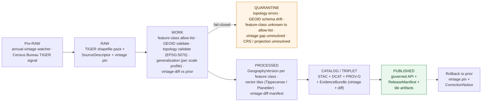
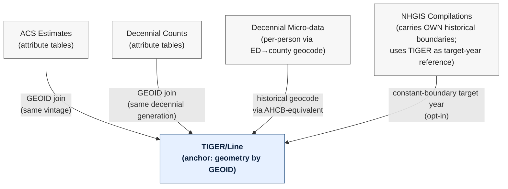

<!-- [KFM_META_BLOCK_V2]
doc_id: kfm://doc/docs-sources-catalog-census-tiger-line
title: Census TIGER/Line Geography
type: product-page
version: v0.2
status: draft
owners: <PLACEHOLDER — Docs steward + Source steward for census>
created: 2026-05-20
updated: 2026-05-20
policy_label: public
related:
  - docs/sources/catalog/census/README.md
  - docs/sources/catalog/census/IDENTITY.md
  - docs/sources/catalog/census/RIGHTS-AND-SENSITIVITY-MAP.md
  - docs/sources/catalog/census/decennial-counts.md
  - docs/sources/catalog/census/decennial-microdata.md
  - docs/sources/catalog/census/acs-estimates.md
  - docs/sources/catalog/census/nhgis-compilations.md
  - docs/sources/catalog/README.md
  - docs/sources/catalog/_examples/stac-item-example.json
  - docs/doctrine/directory-rules.md
tags: [kfm, docs, sources, catalog, census, tiger, tiger-line, administrative-geometry, geography-version, vintage, spatial-foundation, frontier-matrix, settlements, roads-rail]
notes:
  - "PROPOSED product-page scaffold; sibling-link presence verified in Claude Code session."
  - "PROPOSED content sourced from Pass 23/32 atlas (Spatial Foundation D, Frontier Matrix D, Settlements/Infrastructure D, Roads/Rail D — TIGER is named in FOUR domain source families), Source-Role Anti-Collapse Register §24.1.1 (Administrative role doctrine), KFM-P26-PROG-0027 (EPSG:5070 overlap SQL); descriptor fields intentionally not restated here."
  - "Anchor sibling for the census family: the canonical modern boundary geometry that ACS, decennial counts, decennial micro-data, and NHGIS compilations all join to."
[/KFM_META_BLOCK_V2] -->

# Census TIGER/Line Geography

> **Vintage-tagged administrative boundaries and linework** — counties, places, tracts, block groups, blocks, county subdivisions, ZCTAs, roads, hydrography, tribal areas — released annually by the U.S. Census Bureau. The **canonical modern boundary geometry** that all other `census` products join to, modeled in KFM as an **Administrative** source role with explicit vintage handling.

**Status:** PROPOSED — scaffold only · **Family:** [`census`](./README.md) · **Owners:** _PLACEHOLDER — Docs steward + Source steward for `census`_ · **Last reviewed:** 2026-05-20

> [!IMPORTANT]
> This is a **scaffold product page**. It points readers at the authoritative homes for source identity, rights, sensitivity, and contract shape; it **does not restate** them. The authoritative `SourceDescriptor` lives in [`data/registry/sources/`](../../../../data/registry/sources/). PROPOSED.

> [!WARNING]
> **Geometry, not data.** TIGER/Line ships *vector geometry* keyed by GEOID. Attribute data (counts, estimates, characteristics) lives in the sibling census products ([decennial-counts](./decennial-counts.md), [ACS estimates](./acs-estimates.md), etc.) and joins to TIGER on GEOID. Conflating "TIGER" with "Census data" is a common upstream error this catalog separates out explicitly.

> [!WARNING]
> **Vintage matters intensely.** TIGER/Line releases **annually**; GEOIDs and polygon shapes shift between vintages (boundary corrections, place incorporations, tract re-tabulations after each decennial). Joins **must** match vintages. PROPOSED gate: cross-vintage GEOID joins require a documented crosswalk, never silent re-use of the same GEOID string across vintages.

> [!WARNING]
> **TIGER/Line vs Cartographic Boundary Files (CBF) are different products.** TIGER/Line is *detailed* vector (every road segment, water edge); CBF is *generalized* for thematic mapping. Do not mix them in the same join. CBFs are a separate sibling product (PROPOSED `cartographic-boundary-files.md`).

---

## Quick jump

- [Overview](#overview)
- [What this product is *not*](#what-this-product-is-not)
- [Source authority](#source-authority)
- [Pipeline shape (KFM lifecycle)](#pipeline-shape-kfm-lifecycle)
- [Catalog profiles used](#catalog-profiles-used)
- [Collection identity](#collection-identity)
- [Provenance fields](#provenance-fields)
- [Temporal handling](#temporal-handling)
- [Geometry, CRS, and topology](#geometry-crs-and-topology)
- [Feature classes and GEOID anatomy](#feature-classes-and-geoid-anatomy)
- [Vintage handling and annual releases](#vintage-handling-and-annual-releases)
- [Cross-domain consumers](#cross-domain-consumers)
- [Anchor role within the census family](#anchor-role-within-the-census-family)
- [Rights and sensitivity](#rights-and-sensitivity)
- [Validation and catalog closure](#validation-and-catalog-closure)
- [Related contracts and schemas](#related-contracts-and-schemas)
- [Related connectors and pipelines](#related-connectors-and-pipelines)
- [Examples](#examples)
- [Open questions](#open-questions)
- [Atlas-card references (collapsible)](#atlas-card-references)
- [Related docs](#related-docs)

---

## Overview

PROPOSED. **TIGER/Line** (Topologically Integrated Geographic Encoding and Referencing / Line) is the U.S. Census Bureau's released vector representation of administrative boundaries and linework for federal-statistical geography. It ships annually, covers the full U.S. plus territories, and provides the GEOID-keyed boundary geometry that **every other `census` product** joins to.

CONFIRMED Atlas placement (Domains v1.1) — TIGER is named in **four** distinct domain source families, which is unusually broad:

| Atlas domain | Source-family name | Role |
|---|---|---|
| **Spatial Foundation** (D) | *"TIGER administrative geometry"* | Canonical federal-statistical geometry |
| **Frontier Matrix** (D) | *"Census/TIGER geography"* | County-year panel boundary versions |
| **Settlements / Infrastructure** (D) | *"Census TIGER / census place geography"* | Place / CDP / municipality geometry |
| **Roads / Rail** (D) | *"Census TIGER/Line roads"* | Road network as one of several inputs |

This cross-domain breadth makes TIGER doctrinally distinct from the other `census` products — it is **geometry**, while the others are **data on that geometry**.

> [!NOTE]
> NEEDS VERIFICATION: ingest path (Census Bureau FTP, TIGERweb REST services, geopandas / pygris pull, third-party mirrors), current pinned vintage(s), Kansas-relevant feature classes (places, MCDs, ZCTAs, tracts, block groups, blocks, water, roads, etc.), license terms (federal public-domain inheritance is presumed; verify any aggregator overlay), and ingest cadence (TIGER updates annually; the watcher should anticipate the calendar-year cycle). Resolution belongs in the authoritative `SourceDescriptor`.

[Back to top](#top)

---

## What this product is *not*

PROPOSED — TIGER sits at the center of many adjacent geometry concepts; bounding it is critical:

- **Not Census data.** TIGER provides *geometry only*; counts, estimates, and characteristics live in [decennial-counts](./decennial-counts.md), [ACS estimates](./acs-estimates.md), [decennial-microdata](./decennial-microdata.md), and [NHGIS compilations](./nhgis-compilations.md).
- **Not Cartographic Boundary Files (CBF).** CBFs are *generalized* derivatives produced by the Census Bureau for thematic mapping; TIGER is the *detailed* base. They have different feature counts, different vertex densities, and different intended uses. PROPOSED separate sibling product.
- **Not the cadastral system.** TIGER captures *administrative* boundaries (counties, places, tracts) — not *cadastral* boundaries (PLSS sections, parcels, lots). For PLSS see the [BLM CadNSDI](../blm/plss-cadnsdi.md) product. For parcel cadastres see state / local sources.
- **Not historical geography.** TIGER reflects *current* (or recent-annual) boundaries. For historical county geography see [NHGIS](./nhgis-compilations.md) and an AHCB-equivalent crosswalk.
- **Not the canonical hydrography source.** TIGER's Areal Hydrography is *context* — KFM's hydrology lane uses NHD / WBD for authoritative hydrography. TIGER hydrography may inform but does not authorize hydrologic claims.
- **Not the canonical roads source.** TIGER/Line includes road network linework but the **Roads / Rail** domain (Domains v1.1, ch. on Roads/Rail) uses TIGER alongside **FHWA HPMS**, **FHWA National Highway Freight Network**, **WZDx feeds**, **KDOT / KanPlan / KanDrive**, **county/state bridge** data, and **OpenStreetMap**. TIGER roads are one input among several.
- **Not GNIS names.** GNIS is a separate gazetteer source family in the Atlas. TIGER carries some place names but GNIS is the canonical names authority for KFM.
- **Not the boundary authority itself.** PROPOSED: TIGER is the Census Bureau's *compilation* of administrative boundaries for federal statistical purposes. The *underlying authority* for a county line lives with the state; for a place line, the municipality; for a tribal area, the tribal nation. TIGER is the Census Bureau's *Administrative* compilation, not the upstream legal authority.

[Back to top](#top)

---

## Source authority

See [`data/registry/sources/`](../../../../data/registry/sources/) for the authoritative `SourceDescriptor`. **Do not duplicate descriptor fields here.** PROPOSED placement per Directory Rules §6 and KFM-P1-PROG-0007.

| Authority surface | Where it lives | What it owns | Restated here? |
|---|---|---|---|
| `SourceDescriptor` | [`data/registry/sources/`](../../../../data/registry/sources/) | Identity, **source role = Administrative (with Authority for federal-statistical GEOID definition)**, rights, vintage pin, feature-class allow-list, sensitivity | **No** — pointer only |
| Family overview & sibling links | [`./README.md`](./README.md) | Family-level orientation for `census` | **No** — see family README |
| Collection identity rules | [`./IDENTITY.md`](./IDENTITY.md) | `kfm-<org>-<product>` pattern, namespace | **No** — see IDENTITY |
| Rights & sensitivity mapping | [`./RIGHTS-AND-SENSITIVITY-MAP.md`](./RIGHTS-AND-SENSITIVITY-MAP.md) | Tiering, CARE applicability for tribal areas, release class | **No** — see map |
| Contract shape | `schemas/contracts/v1/source/` and `schemas/contracts/v1/domains/spatial-foundation/` | JSON-schema for descriptor + `GeographyVersion` / `LayerManifest` shapes | **No** — per ADR-0001 |

PROPOSED source-role posture: **Administrative** in the general sense (CONFIRMED Atlas §24.1.1: *"A compiled record produced by an agency for administration, registration, or accounting purposes — not necessarily an observation or a regulation. Cite as administrative context; never collapsed with observation or regulation."*) — paired with **Authority** specifically for the federal-statistical GEOID definition that joins the rest of the census family. Both roles travel with the record.

> [!NOTE]
> The underlying *legal* authority for any given boundary lives with the entity that defines it (state, county, municipality, tribal nation); TIGER is the Census Bureau's **administrative compilation** for federal-statistical use. Cite TIGER as administrative context, not as legal authority for boundary disputes.

[Back to top](#top)

---

## Pipeline shape (KFM lifecycle)

CONFIRMED doctrine / PROPOSED lane application: TIGER/Line follows the canonical lifecycle invariant **RAW → WORK/QUARANTINE → PROCESSED → CATALOG/TRIPLET → PUBLISHED**, where each transition is a governed state change — not a file move (Directory Rules §3, Connected-Dots Architecture Brief §4).

PROPOSED — diagram reflects KFM doctrine; specific gate names, validators, and connector boundaries for this product **NEED VERIFICATION** against `pipeline_specs/spatial-foundation/` and `pipelines/`. The **WORK → QUARANTINE** branch is doctrinally fail-closed on five cases including the **vintage gap unresolved** gate (if a vintage is skipped, the watcher must not silently jump versions).

[Back to top](#top)

---

## Catalog profiles used

PROPOSED. The catalog projection set this product participates in. Lanes follow Directory Rules §6 and Pass-10 C4 (Catalogs and Metadata Profiles).

| Profile | Lane | Used by this product? |
|---|---|---|
| STAC | `data/catalog/stac/` | PROPOSED — Yes (Collection per vintage; Items per feature class) |
| DCAT | `data/catalog/dcat/` | PROPOSED — Yes (dataset-level metadata) |
| PROV-O | `data/catalog/prov/` | PROPOSED — Yes (vintage-diff activity, GEOID-normalization lineage) |
| Domain projection (`spatial-foundation`) | `data/catalog/domain/spatial-foundation/` | PROPOSED — Yes (primary domain home; canonical federal-statistical geometry) |
| Domain projection (`frontier-matrix`) | `data/catalog/domain/frontier-matrix/` | PROPOSED — Yes (`GeographyVersion` source for county-year panels) |
| Domain projection (`settlements`) | `data/catalog/domain/settlements/` | PROPOSED — Yes (Settlement / Municipality / CensusPlace geometry) |
| Domain projection (`roads-rail`) | `data/catalog/domain/roads-rail/` | PROPOSED — Conditional (Road Segment context) |

[Back to top](#top)

---

## Collection identity

- PROPOSED Collection id pattern: `kfm-<org>-<product>` — see [`IDENTITY.md`](./IDENTITY.md) for the canonical rule.
- PROPOSED namespace: `kfm:` — *see [OPEN-DSC-03](#open-questions); Pass-10 C4-01 records the `kfm:` vs `ks-kfm:` choice as an unresolved namespace question.*
- PROPOSED: one Collection per **vintage year** (e.g., `tiger-2020`, `tiger-2024`); within each Collection, Items per feature class (counties, places, tracts, etc.). NEEDS VERIFICATION.
- Asset roles (counties-shapefile, places-shapefile, tracts-shapefile, block-groups-shapefile, blocks-shapefile, mcds-shapefile, zctas-shapefile, areal-water-shapefile, linear-water-shapefile, roads-shapefile, etc.): NEEDS VERIFICATION — confirm against `schemas/contracts/v1/source/` and `schemas/contracts/v1/domains/spatial-foundation/`.

[Back to top](#top)

---

## Provenance fields

CONFIRMED doctrine (Pass-10 C4-01): STAC Items carry an `item.properties.kfm:provenance` block. The fields below are the doctrinal set; **per-product values** are PROPOSED until verified against emitted artifacts in `data/catalog/stac/`.

| Field | Type / form | Role |
|---|---|---|
| `spec_hash` | `sha256` of canonical record (JCS+SHA-256) | Identity anchor; the spec-hash gate is fail-closed at promotion |
| `evidence_bundle_ref` | `kfm://evidence/<digest>` | Resolves to the `EvidenceBundle` carrying receipts, validations, **vintage pin**, **vintage-diff manifest**, **topology report** |
| `run_record_ref` | `kfm://run/<run-id>` | Pointer to the immutable `RunReceipt` for the producing run |
| `audit_ref` | `kfm://audit/<attestation-id>` | SLSA / OPA attestation reference |
| `policy_digest` | `sha256` of the policy bundle | Records the policy set in force at promotion (C5-03 parity) |

Per-asset integrity: `file:checksum` on each STAC asset. PROPOSED product-specific extensions: each TIGER `GeographyVersion` record carries a **`VintageDiffManifest`** documenting features added / removed / re-shaped vs the prior vintage — analogous to the boundary-diff manifest used for PAD-US (KFM-P25-PROG-0009 pattern).

[Back to top](#top)

---

## Temporal handling

CONFIRMED doctrine / PROPOSED per-product: KFM keeps **source / observed / valid / retrieval / release / correction** times distinct wherever material (Domain Atlas, operating-law invariant 1).

| Time facet | What it means for TIGER/Line | Status |
|---|---|---|
| Source time | TIGER vintage-year release date (typically September / October of the vintage year) | PROPOSED |
| Observed time | Date the recorded boundary was authoritative on the ground (often pre-dates the TIGER vintage release by months or years; particularly relevant for newly-incorporated places or boundary corrections) | NEEDS VERIFICATION per feature |
| Valid time | Period the feature is treated as the federal-statistical-geography canonical for that GEOID (typically until the next vintage supersedes for that feature, though many features persist unchanged across vintages) | PROPOSED |
| Retrieval time | When KFM fetched the TIGER vintage | PROPOSED |
| Release time | When the KFM catalog entry was promoted to PUBLISHED | PROPOSED |
| Correction time | When a `CorrectionNotice` (Census Bureau erratum, boundary correction, GEOID re-assignment) superseded a prior KFM release | PROPOSED |

> [!CAUTION]
> **Decennial-rebase years are distinctive.** After each decennial census (2020, 2030, …), the Census Bureau **re-tabulates** tracts and block groups based on the new decennial; many GEOIDs change between, e.g., TIGER 2019 (still using 2010 tabulation) and TIGER 2020 (using 2020 tabulation). PROPOSED — the catalog records the *tabulation generation* alongside the vintage year (e.g., `tiger-2020-decennial-tabulation-2020`).

[Back to top](#top)

---

## Geometry, CRS, and topology

PROPOSED. TIGER/Line is delivered as **ESRI Shapefile** per feature class, in **NAD83 geographic coordinates** (EPSG:4269) by default.

- **Upstream CRS** — NAD83 geographic (EPSG:4269). PROPOSED canonical reprojection: **`EPSG:5070`** (NAD83 / Conus Albers) for overlap SQL per KFM-P26-PROG-0027. Each reprojection produces a `Projection Transform Receipt` (Spatial Foundation object family).
- **Topology** — TIGER is topologically integrated by design (the "TI" in TIGER) within each feature class. PROPOSED gates: validate that boundary line geometry is closed, no self-intersection, no zero-area slivers — these should pass cleanly for TIGER but are checked as fail-closed gates anyway.
- **Edge sharing across feature classes** — TIGER feature classes share edges where appropriate (a county boundary edge in counties.shp also appears in the block boundary file). PROPOSED: KFM preserves this where consumers benefit; cross-feature-class edge integrity is a fail-closed gate.
- **Generalization** — KFM does **not** generalize TIGER at ingest. Consumer-side renderer generalization (e.g., for low-zoom map tiles) produces a downstream `Generalization Transform` (Spatial Foundation object family) per scale profile; the source TIGER is preserved unmodified.

[Back to top](#top)

---

## Feature classes and GEOID anatomy

PROPOSED. TIGER ships a broad set of feature classes; KFM ingests selected ones per the allow-list. GEOIDs nest in a stable structure that KFM can use as a join key across the family.

| Feature class | GEOID structure | KFM use |
|---|---|---|
| **State** | `STATE` (2 digits) | State outline; rollup denominator |
| **County** | `STATE+COUNTY` (5 digits) | Primary admin unit for Frontier Matrix; County-Year Panel join key |
| **County Subdivision (MCD / CCD)** | `STATE+COUNTY+COUSUB` (10 digits) | Township-level admin (Kansas relevant for MCDs) |
| **Place (Incorporated / CDP)** | `STATE+PLACE` (7 digits) | Settlements domain Municipality / CensusPlace |
| **Tract** | `STATE+COUNTY+TRACT` (11 digits) | Small-area baseline for ACS / decennial joins |
| **Block Group** | `STATE+COUNTY+TRACT+BG` (12 digits) | Finer-than-tract baseline |
| **Block** | `STATE+COUNTY+TRACT+BLOCK` (15 digits) | Smallest unit; decennial-only attribute support |
| **ZCTA** | `ZCTA5` (5 digits) | ZIP-adjacent geometry (caveat: not a postal entity) |
| **VTD (Voting Tabulation District)** | `STATE+COUNTY+VTD` | Redistricting; decennial-only |
| **American Indian / Alaska Native / Native Hawaiian Areas (AIANNH)** | varies (AIANNH codes) | Tribal-area geometry; CARE-sensitive |
| **Areal Hydrography** | per-feature | Context only; not the canonical hydrography (see NHD/WBD for hydrology) |
| **Linear Hydrography** | per-feature | Context only |
| **All Lines / Roads (Edges)** | per-feature | One of several Roads/Rail inputs |
| **Coastline** | per-feature | Coastline context |
| **Military Installation** | per-feature | Federal-installation geometry |
| **Schools / Hospitals / etc. (specialty layers)** | per-feature | Settlement-context layers; opt-in per allow-list |

> [!IMPORTANT]
> **GEOIDs nest.** A block GEOID `20155002400 1234` (15 digits) contains its tract (`20155002400`, 11 digits), its county (`20155`, 5 digits), and its state (`20`, 2 digits). PROPOSED: KFM exposes this nesting as a structured field so consumers can roll up without string parsing.

[Back to top](#top)

---

## Vintage handling and annual releases

PROPOSED. TIGER releases on an annual cycle (typically September / October of the vintage year). Vintages differ by:

| Change category | What it covers |
|---|---|
| **Boundary corrections** | Routine corrections submitted by states / counties via the Boundary and Annexation Survey (BAS) |
| **Place incorporations / disincorporations** | New cities, dissolved CDPs |
| **Annexations** | City limits expansions |
| **Tract re-tabulations (decennial)** | Major re-shape after each decennial; 2010, 2020 generation boundaries |
| **Block-group / block re-tabulations** | Decennial-driven |
| **Linework updates** | New roads, new water features, edge refinements |

PROPOSED `VintageDiffManifest` (per Census Bureau methodology) records:
- Features added vs prior vintage.
- Features removed vs prior vintage.
- Features re-shaped beyond a configurable Hausdorff distance.
- Attribute-only changes (e.g., name change without geometry change).

> [!NOTE]
> **The decennial-tabulation boundary** (TIGER 2019 → TIGER 2020) is the most consequential vintage transition. Tracts, block groups, and blocks substantially re-tabulate. PROPOSED — cross-tabulation-generation queries require a documented crosswalk (similar to the [NHGIS](./nhgis-compilations.md) harmonization pattern).

> [!CAUTION]
> **GEOIDs may be re-used.** A tract `20155002400` in TIGER 2019 (2010-tabulation) is *not* necessarily the same polygon as tract `20155002400` in TIGER 2020 (2020-tabulation). PROPOSED gate: cross-tabulation-generation joins require explicit consumer opt-in with a crosswalk.

[Back to top](#top)

---

## Cross-domain consumers

PROPOSED. TIGER's distinctive characteristic is **cross-domain reach** — it appears as a named source family in four KFM domains. This makes TIGER the **anchor geometry** for KFM's modern-administrative-geography concerns.

| Consuming domain | What it consumes | Constraint (Atlas §24.1.1 / Domain Atlas F) |
|---|---|---|
| **Spatial Foundation** (primary) | `GeographyVersion`, `LayerManifest`, projection-transform receipts (Domains v1.1 ch. on Spatial Foundation D) | Authority role for federal-statistical geometry |
| **Frontier Matrix** | `GeographyVersion` for County-Year Panels (Domains v1.1 ch. on Frontier Matrix D) | Administrative role; preserve vintage pin |
| **Settlements / Infrastructure** | `Settlement`, `Municipality`, `CensusPlace` geometry (Domains v1.1 ch. on Settlements/Infrastructure D) | Administrative role |
| **Roads / Rail** | `Road Segment` as one input among several (Domains v1.1 ch. on Roads/Rail D — Census TIGER/Line roads named alongside FHWA HPMS, KDOT, OSM, etc.) | One source among multi-source; cite distinct source role |
| **People / DNA / Land** | Modern boundary geography for residential geocoding | Administrative role; never collapsed with title or cadastre |
| **All other domains** | Federal-statistical join keys (GEOIDs) for any geography-aware analysis | Administrative role |

[Back to top](#top)

---

## Anchor role within the census family

PROPOSED. TIGER is the **anchor sibling** for the `census` family — every other census product joins to TIGER on GEOID. This is structurally parallel to how [CadNSDI](../blm/plss-cadnsdi.md) anchors the `blm` family.

PROPOSED diagram — relationships reflect KFM doctrine; specific join paths per product **NEED VERIFICATION** once mounted. The vintage-pin requirement (cross-vintage joins are gated) is doctrinally critical and applies across all four consumers.

[Back to top](#top)

---

## Rights and sensitivity

NEEDS VERIFICATION — see [`policy/sensitivity/`](../../../../policy/sensitivity/) and [`RIGHTS-AND-SENSITIVITY-MAP.md`](./RIGHTS-AND-SENSITIVITY-MAP.md). **Do not restate policy here.**

PROPOSED sensitivity posture for this product:

- **Rights** — TIGER/Line is **federal public-domain**. Aggregator overlays (e.g., third-party packaged shapefiles, geopandas-distributed convenience datasets) may layer separate terms — NEEDS VERIFICATION per ingest path. Most legitimate aggregators preserve public-domain rights.
- **CARE applicability** — flagged for review for **AIANNH (American Indian / Alaska Native / Native Hawaiian Areas)** feature classes; tribal-area geometry may carry sovereignty considerations even when the underlying data is technically public. Pass-10 C15-01..03 default-deny may apply where the descriptor records `authority_to_control` from a tribal nation. PROPOSED.
- **Sensitive geometry at small geographies** — most TIGER geometry is public-precision and safe. However, joining TIGER to **sensitive data products** (archaeological sites, occurrences of sensitive species, living-person residences) inherits the sensitivity of the joined data, not of TIGER. PROPOSED: sensitivity gates apply to the *join result*, not to TIGER as a source.
- **Living-person policy** — not applicable to TIGER itself. PROPOSED.
- **Boundary-dispute neutrality** — TIGER reflects the Census Bureau's compilation; KFM does not present TIGER as authoritative for boundary disputes. PROPOSED — for disputed boundaries, KFM presents TIGER alongside the disputing parties' versions where applicable, without picking sides.

[Back to top](#top)

---

## Validation and catalog closure

PROPOSED gate set for this product. **Catalog closure is required before public release** (Pass-10 / KFM-P1-IDEA-0020).

- **STAC Projection lint** — KFM-P27-FEAT-0003 — PROPOSED.
- **STAC checksum closure** against the `ReleaseManifest` digest — KFM-P22-PROG-0037 — PROPOSED.
- **Spec-hash-match gate** (C5-04) — PROPOSED.
- **Vintage-pin gate** — PROPOSED; descriptor must declare a specific vintage year; "latest TIGER" is not a valid pin.
- **Topology validation gate** — PROPOSED; geometry validity required.
- **GEOID schema-drift detection** — PROPOSED; detect when GEOID structure changes across vintages (e.g., decennial-tabulation rebase).
- **Feature-class allow-list gate** — PROPOSED; unknown feature classes fail closed at WORK rather than silently passing through.
- **Vintage-diff manifest gate** — PROPOSED; non-empty diff vs prior vintage must be produced and reviewed before promotion (empty diff requires explicit "no change" attestation).
- **Cross-tabulation-generation join gate** — PROPOSED; queries joining across decennial-tabulation boundaries (e.g., 2010 → 2020) require an explicit crosswalk or are denied.
- **CRS / projection-transform-receipt gate** — PROPOSED; any reprojection produces a `Projection Transform Receipt`.
- **Edge-sharing consistency test** — PROPOSED; cross-feature-class shared edges remain topologically consistent.
- **Source-role anti-collapse test** — PROPOSED (Atlas §24.1.1); any record claiming TIGER as legal-authority for a boundary dispute must DENY (TIGER is Administrative, not Regulatory).
- **No public RAW / WORK path** — CONFIRMED doctrine; public clients consume governed PUBLISHED state only.

NEEDS VERIFICATION — concrete validator names, fixture paths, and CI workflow files in `tools/validators/` and `.github/workflows/`.

[Back to top](#top)

---

## Related contracts and schemas

- `contracts/domains/spatial-foundation/` — semantic meaning for `GeographyVersion`, `LayerManifest`, `Coordinate Reference Profile`, `Projection Transform Receipt`, `Generalization Transform`. NEEDS VERIFICATION.
- `contracts/domains/frontier-matrix/` — `GeographyVersion` as County-Year Panel anchor. NEEDS VERIFICATION.
- `contracts/common/` — `VintageDiffManifest` shape (PROPOSED, similar to PAD-US BoundaryDiffManifest pattern). NEEDS VERIFICATION.
- `schemas/contracts/v1/source/` — per **ADR-0001** (canonical schema home).
- `schemas/contracts/v1/domains/spatial-foundation/` — domain projection shapes for TIGER-derived records.

PROPOSED — exact files NEED VERIFICATION once the repo is mounted.

[Back to top](#top)

---

## Related connectors and pipelines

- `connectors/census/` — source fetchers for the `census` family (TIGER + ACS + decennial + compilations).
- `pipelines/ingest/`, `pipelines/normalize/`, `pipelines/validate/`, `pipelines/catalog/` — lifecycle stages.
- `pipelines/watchers/` — annual-vintage watcher.
- `pipeline_specs/spatial-foundation/` — declarative spec for the Spatial Foundation projection (primary consumer).
- **Tippecanoe / Planetiler** — vector-tiling tools (compare KFM-P2-PROG-0011 dependency for PLSS, PROPOSED).

PROPOSED — module file names NEED VERIFICATION.

[Back to top](#top)

---

## Examples

*(Illustrative only — do not treat as authoritative.)*

See [`_examples/stac-item-example.json`](../_examples/stac-item-example.json) for the minimal STAC + `kfm:provenance` shape.

A TIGER `EvidenceBundle` is PROPOSED to additionally carry:
- The pinned TIGER vintage year and tabulation generation (e.g., `tiger-2024-decennial-tabulation-2020`).
- The feature-class allow-list applied.
- The `VintageDiffManifest` vs prior vintage (features added / removed / re-shaped / attribute-changed).
- The topology validation report.
- The Projection Transform Receipt for any reprojection (e.g., NAD83 → EPSG:5070).
- Pointers to derived tile artifacts (vector tiles for renderers, per scale profile).

[Back to top](#top)

---

## Open questions

- **OPEN-DSC-01** — Confirm ingest path (Census Bureau FTP, TIGERweb REST services, pygris-style wrapper, third-party mirror), pinned vintage(s), Kansas-relevant feature-class set, license terms. NEEDS VERIFICATION — resolution belongs in `SourceDescriptor`.
- **OPEN-DSC-02** — Confirm rights posture and CARE applicability for AIANNH and tribal-area feature classes. NEEDS VERIFICATION.
- **OPEN-DSC-03** — `kfm:` vs `ks-kfm:` namespace choice (Pass-10 C4-01). UNKNOWN — awaits ADR.
- **OPEN-FAM-01** — Feature-class allow-list scope. PROPOSED phased rollout — core (states, counties, places, MCDs, tracts, block groups, blocks, ZCTAs, AIANNH); extended (roads, hydrography, schools, military installations); opt-in (specialty layers). NEEDS VERIFICATION — ADR-class.
- **OPEN-FAM-02** — Vintage-pin policy: ingest every annual vintage, every Nth vintage, or only decennial-generation-boundary vintages? PROPOSED every annual; NEEDS VERIFICATION.
- **OPEN-FAM-03** — Vintage-diff Hausdorff tolerance for "re-shaped" classification. NEEDS VERIFICATION.
- **OPEN-FAM-04** — Cross-tabulation-generation crosswalk source (Census Bureau-published TIGER relationship tables? NHGIS? KFM-internal?). NEEDS VERIFICATION.
- **OPEN-FAM-05** — TIGER vs Cartographic Boundary Files split: should they share a Collection family or remain entirely separate products? PROPOSED separate (different scales, different use cases). NEEDS VERIFICATION.
- **OPEN-FAM-06** — Tile profile: vector tiles via Tippecanoe vs Planetiler vs both. NEEDS VERIFICATION (shared with [CadNSDI sibling](../blm/plss-cadnsdi.md)).
- **OPEN-FAM-07** — Roads/Rail-domain integration: TIGER roads are one source among several; how does the Roads/Rail domain reconcile across TIGER + FHWA HPMS + KDOT + OSM? PROPOSED: multi-source `Road Segment` with source-role-distinct evidence per segment; cross-link to Roads/Rail domain README. NEEDS VERIFICATION.
- **OPEN-FAM-08** — Disputed-boundary handling. PROPOSED: KFM does not arbitrate; present TIGER alongside disputing-party versions where applicable. NEEDS VERIFICATION.

[Back to top](#top)

---

## Atlas-card references

<b>Pass 23/32 atlas cards and Domains v1.1 references backing this page (click to expand)</b>

These are the KFM atlas cards from which the PROPOSED content above is sourced. They are doctrinal carriers — they do **not** assert mounted-repo implementation. Each card's own truth labels apply.

**Domains v1.1 — Four domain placements (uniquely broad):**
- **Spatial Foundation domain D** — *"TIGER administrative geometry"* — canonical federal-statistical geometry source family.
- **Frontier Matrix domain D** — *"Census/TIGER geography"* — County-Year Panel boundary anchor.
- **Settlements / Infrastructure domain D** — *"Census TIGER / census place geography"* — Place / Municipality / CensusPlace geometry source family.
- **Roads / Rail domain D** — *"Census TIGER/Line roads"* — one Road Segment source among several (FHWA HPMS, FHWA NHFN, WZDx, KDOT/KanPlan/KanDrive/Kansas GIS, county/state bridge data, GNIS, OpenStreetMap).

**Atlas §24.1.1 — Source-Role Anti-Collapse Register (CONFIRMED doctrine):**
- **Administrative** role definition: *"A compiled record produced by an agency for administration, registration, or accounting purposes — not necessarily an observation or a regulation."*
- Example explicitly named: *"Land office tract book; deed index compilation; county incorporation record; transport facility roster."* TIGER fits this pattern: a Census Bureau-compiled record of administrative boundaries for federal-statistical use.
- Allowed downstream role: *"Cite as administrative context; never collapsed with observation or regulation."*
- Anti-collapse failure mode: TIGER-as-legal-authority for boundary disputes — DENY.

**Spatial-foundation object families (E):**
- `Coordinate Reference Profile`, `GeographyVersion`, `Projection Transform Receipt`, `Geometry Fingerprint`, `Base Layer Descriptor`, `MapStyleRule`, `Scale Support Profile`, `UncertaintySurface`, `Generalization Transform`, `LayerManifest`. TIGER populates several of these directly.

**Frontier Matrix object families (E):**
- `Frontier Definition`, `GeographyVersion`, `County-Year Panel`, `Population Observation`, ..., `Admin Boundary Change`, `Crosswalk`. TIGER is the canonical input for `GeographyVersion` and `Admin Boundary Change` in this domain.

**Settlements / Infrastructure object families (E):**
- `Settlement`, `Municipality`, `CensusPlace`, `Townsite`, `GhostTown`, `Fort`, `Mission`, `ReservationCommunity`, `Infrastructure Asset`, `Network Node`, `Network Segment`, `Facility`. TIGER populates `Settlement`, `Municipality`, `CensusPlace` geometry.

**Roads / Rail object families (E):**
- `Road Segment`, `Rail Segment`, `CorridorRoute`, `RouteMembership`, `Network Node`, `Crossing`, `Bridge`, `Ferry`, `TransportFacility`, `RestrictionEvent`, `StatusEvent`, `OperatorAssignment`. TIGER populates `Road Segment` (as one source among several).

**Overlap-SQL doctrine:**
- **KFM-P26-PROG-0027** — *HUC12-admin overlap SQL.* PROPOSED: *"valid geometries, EPSG:5070, ST_Intersection, deterministic areas, centroid flags, topology flags, and deterministic fallback tie breakers."* Pass 32 spec hash: `sha256:75efce1edb0eb29f4f9e6f844f3f3e8acc26ecaacccca14cb3df23a691ad68cc`. TIGER reprojections to `EPSG:5070` follow this contract.

**Cross-vintage crosswalk pattern:**
- **KFM-P5-PROG-0008** — *Fail-closed crosswalk manifest.* Architectural reference for the `VintageDiffManifest` shape this product page proposes.

**Pass-10 references:**
- **C4-01** — STAC Item `kfm:provenance` namespace (CONFIRMED).
- **C4-02** — STAC Collection with KFM governance description (CONFIRMED).
- **C4-04** — Evidence-Bundle JSON-LD content addressing (CONFIRMED).
- **C5-02 / C5-04** — Default-deny promotion + spec-hash-match gate (CONFIRMED).
- **C15-01..03** — CARE MetaBlock v2, `kfm:care` extension, OPA default-deny on CARE-tagged assets (CONFIRMED).

**Adjacent products (siblings, this catalog):**
- [`decennial-counts.md`](./decennial-counts.md), [`decennial-microdata.md`](./decennial-microdata.md), [`acs-estimates.md`](./acs-estimates.md), [`nhgis-compilations.md`](./nhgis-compilations.md) — all join to TIGER as their geometry source.

[Back to top](#top)

---

## Related docs

- [`docs/sources/catalog/census/README.md`](./README.md) — `census` family landing page.
- [`docs/sources/catalog/census/IDENTITY.md`](./IDENTITY.md) — Collection-id and namespace rules for the family.
- [`docs/sources/catalog/census/RIGHTS-AND-SENSITIVITY-MAP.md`](./RIGHTS-AND-SENSITIVITY-MAP.md) — Rights / sensitivity tiering for `census` (CARE applicability for AIANNH).
- [`docs/sources/catalog/census/decennial-counts.md`](./decennial-counts.md) — Sibling: decennial aggregate tables (joins to TIGER by GEOID).
- [`docs/sources/catalog/census/decennial-microdata.md`](./decennial-microdata.md) — Sibling: per-person historic enumeration (uses TIGER for modern geocode; AHCB for historical).
- [`docs/sources/catalog/census/acs-estimates.md`](./acs-estimates.md) — Sibling: ACS attribute tables (joins to TIGER by GEOID).
- [`docs/sources/catalog/census/nhgis-compilations.md`](./nhgis-compilations.md) — Sibling: historical compilations (carries own boundary shapefiles; uses TIGER for constant-boundary target years).
- _TODO_ — `docs/sources/catalog/census/cartographic-boundary-files.md` — Sibling: generalized CBF derivatives.
- _TODO_ — `docs/sources/catalog/census/gnis.md` — GNIS gazetteer (sibling names authority).
- [`docs/sources/catalog/README.md`](../../README.md) — Catalog of source families.
- [`docs/sources/catalog/_examples/stac-item-example.json`](../_examples/stac-item-example.json) — Illustrative STAC + `kfm:provenance` shape.
- [`docs/doctrine/directory-rules.md`](../../../../docs/doctrine/directory-rules.md) — Placement authority.
- _TODO_ — `docs/standards/STAC_KFM_PROFILE.md` (PROPOSED, Pass-10 C4-01 expansion).
- _TODO_ — `docs/standards/VINTAGE_DIFF_MANIFEST.md` — Vintage-diff manifest schema (PROPOSED, shared with PAD-US BoundaryDiffManifest pattern).
- _TODO_ — `docs/standards/PROV.md` _(or `PROVENANCE.md`, naming question per Directory Rules §18 OPEN-DR-01)_.
- _TODO_ — `docs/domains/spatial-foundation/README.md` — Primary consuming domain.
- _TODO_ — `docs/domains/settlements/README.md` — Settlements / Infrastructure consuming domain.
- _TODO_ — `docs/domains/roads-rail/README.md` — Roads / Rail consuming domain (multi-source `Road Segment`).

---

_Last updated: **2026-05-20** · doc version **v0.2** · status **draft / PROPOSED scaffold**_

[Back to top](#top)
