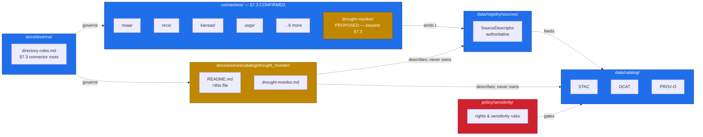

<!-- [KFM_META_BLOCK_V2]
doc_id: kfm://doc/docs-sources-catalog-drought_monitor-readme
title: U.S. Drought Monitor (USDM) source family
type: readme
version: v0.2
status: draft
owners: <PLACEHOLDER — Docs steward + Source steward for drought_monitor>
created: 2026-05-21
updated: 2026-05-21
policy_label: public
related:
  - docs/sources/catalog/README.md
  - docs/doctrine/directory-rules.md
  - docs/sources/catalog/_template/SOURCE_PRODUCT_TEMPLATE.md
  - docs/sources/catalog/OPEN-QUESTIONS.md
  - docs/sources/catalog/PROFILES.md
  - docs/sources/catalog/IDENTITY.md
  - docs/sources/catalog/RIGHTS-AND-SENSITIVITY-MAP.md
tags: [kfm, docs, sources, catalog, drought_monitor, drought, agriculture, hydrology, hazards]
notes:
  - "Family folder scaffolded from the connectors/ inventory. drought_monitor is NOT one of the nine directory-rules.md §7.3 connector roots (usgs, fema, noaa, nrcs, kansas, gbif, inaturalist, census, local_upload). PROPOSED — promotion or absorption decision tracked as OPEN-DSC-14."
  - "USDM producer attribution corrected from prior draft: jointly produced by NDMC (University of Nebraska-Lincoln), USDA, and NOAA — NDMC hosts the canonical website. NIDIS (Drought.gov) is a related portal, not the USDM producer."
  - "All repo paths in this doc are PROPOSED until a mounted-repo inspection. No mounted repository, contracts, schemas, tests, or workflows were verified in this docs-only session."
[/KFM_META_BLOCK_V2] -->

# `drought_monitor` — U.S. Drought Monitor (USDM) source family

> Source-oriented catalog README for the **U.S. Drought Monitor (USDM)** weekly drought-classification source family — orientation, scope, repo fit, and the lifecycle this family follows from connector to publication. **Not** a SourceDescriptor and **not** policy. Authoritative descriptors live in `data/registry/sources/`; policy lives in `policy/`. PROPOSED — this family is not yet ratified under `directory-rules.md` §7.3.


> **Status:** draft — **PROPOSED** beyond `directory-rules.md` §7.3 · **Owners:** `<PLACEHOLDER — Docs steward + Source steward for drought_monitor>` · **Last reviewed:** 2026-05-21
>
> Badge targets are placeholder Shields.io endpoints until CI, registry, and policy wiring are confirmed against a mounted repo.

---

## Quick jump

- [1. Scope](#1-scope)
- [2. Repo fit](#2-repo-fit)
- [3. Why this family is provisional](#3-why-this-family-is-provisional)
- [4. Product pages](#4-product-pages)
- [5. PROPOSED directory tree](#5-proposed-directory-tree)
- [6. What belongs here · what does not](#6-what-belongs-here--what-does-not)
- [7. Source authority](#7-source-authority)
- [8. Catalog profiles](#8-catalog-profiles)
- [9. Identity & namespaces](#9-identity--namespaces)
- [10. Rights & sensitivity](#10-rights--sensitivity)
- [11. Lifecycle through KFM](#11-lifecycle-through-kfm)
- [12. Validation](#12-validation)
- [13. Related contracts & schemas](#13-related-contracts--schemas)
- [14. Related connectors & pipelines](#14-related-connectors--pipelines)
- [15. Open questions](#15-open-questions)
- [16. Related docs](#16-related-docs)
- [17. Appendix — about the USDM as a product](#17-appendix--about-the-usdm-as-a-product)

---

## 1. Scope

This README orients readers to KFM's **catalog-side documentation** for the U.S. Drought Monitor (USDM) source family. The USDM is a weekly U.S. drought-classification product released every Thursday; it is **jointly produced by the National Drought Mitigation Center (NDMC) at the University of Nebraska-Lincoln, USDA, and NOAA**, with NDMC hosting the canonical website — [EXTERNAL, droughtmonitor.unl.edu]. Inside KFM, this family is treated as a candidate authority for **drought-extent context** that informs hydrology, agriculture, hazards, and habitat reasoning (`KFM-P25-PROG-0004`, `KFM-P25-IDEA-0003`).

This doc covers:

- What products belong to the USDM family in KFM (per-product pages link below).
- Where this family fits relative to `connectors/`, `data/registry/sources/`, `data/catalog/`, `contracts/`, `schemas/`, and `policy/` — all CONFIRMED roots per `docs/doctrine/directory-rules.md`.
- The governance state of the family itself, which is **PROPOSED** beyond `directory-rules.md` §7.3.

This doc does **not** restate SourceDescriptor fields, policy decisions, schema shapes, or product-level lineage — those have authoritative homes elsewhere.

[↑ back to top](#quick-jump)

---

## 2. Repo fit

The intended home of this README is `docs/sources/catalog/drought_monitor/README.md` — **PROPOSED**. The `docs/sources/catalog/` lane is documented as a target subtree in the repository structure guiding document but its substructure (per-family folders) has not been verified against a mounted repo.



> [!NOTE]
> The diagram is illustrative of doctrinal relationships from `directory-rules.md` §7.3, §9.1, and the docs/repo guiding document. Edge labels and per-edge flow direction are **PROPOSED** and **NEEDS VERIFICATION** against mounted-repo evidence.

**Upstream of this README** — `docs/sources/catalog/README.md` (lane index), `docs/sources/catalog/_template/SOURCE_PRODUCT_TEMPLATE.md` (per-product page contract).

**Downstream of this README** — per-product pages in this folder (see §4) and reader links to `data/registry/sources/`, `data/catalog/`, `contracts/`, `schemas/contracts/v1/source/`, and `policy/sensitivity/`.

[↑ back to top](#quick-jump)

---

## 3. Why this family is provisional

`directory-rules.md` §7.3 lists exactly **nine** canonical connector roots and *no others*:

```text
connectors/
├── usgs/    fema/    noaa/    nrcs/    kansas/
├── gbif/    inaturalist/      census/   local_upload/
```

— CONFIRMED quotation from `docs/doctrine/directory-rules.md` §7.3.

`drought_monitor` is not in that list. The USDM is **jointly produced** by NDMC (academic, University of Nebraska-Lincoln), USDA, and NOAA — [EXTERNAL, droughtmonitor.unl.edu]. This means none of the existing §7.3 roots is an unambiguous home: NOAA, USDA-NRCS, or a multi-agency dedicated root are each defensible.

The implication for this doc:

| Question | Status | Resolution path |
|---|---|---|
| Is `connectors/drought-monitor/` a legitimate §7.3 sibling? | PROPOSED — currently outside §7.3 | ADR — see `OPEN-DSC-14` |
| Should USDM live under `connectors/noaa/drought-monitor/`? | PROPOSED candidate placement | ADR + Directory Rules amendment |
| Should USDM live under `connectors/nrcs/drought-monitor/` or a new `usda/`? | PROPOSED candidate placement | ADR + Directory Rules amendment |
| Should `docs/sources/catalog/drought_monitor/` exist as a docs family regardless of connector placement? | PROPOSED — docs lane mirrors source identity, not connector path | Director steward decision; record in `docs/sources/catalog/README.md` |

> [!IMPORTANT]
> Until `OPEN-DSC-14` resolves, this README and its child product pages are documentation-only artifacts. They MUST NOT be cited as evidence that `connectors/drought-monitor/` is a ratified §7.3 family, nor that a SourceDescriptor with `source_id=drought_monitor` is admitted. SourceDescriptor admission is governed by `data/registry/sources/` and `policy/sources/`, not by the existence of this README.

[↑ back to top](#quick-jump)

---

## 4. Product pages

| Page | Product | Status |
|---|---|---|
| [`drought-monitor.md`](./drought-monitor.md) | U.S. Drought Monitor (USDM) — weekly D0–D4 classification polygons | PROPOSED — page conformance to `_template/SOURCE_PRODUCT_TEMPLATE.md` NEEDS VERIFICATION |

**Candidate additions, deferred until product-level evidence exists** — North American Drought Monitor (NADM, monthly tri-national), USDM historical archive (back to 1999), VegDRI, QuickDRI. Whether KFM treats these as **sibling product pages within this family** or as **separate families** is an open question — see [§15](#15-open-questions) and `OPEN-DSC-14` in [`OPEN-QUESTIONS.md`](../OPEN-QUESTIONS.md).

[↑ back to top](#quick-jump)

---

## 5. PROPOSED directory tree

> [!NOTE]
> The tree below is **PROPOSED** and **NEEDS VERIFICATION** against mounted-repo evidence. It reflects the catalog-side docs layout implied by `docs/sources/catalog/_template/` and the sibling READMEs referenced in §16 — it does **not** describe any directory observed live in this session.

```text
docs/sources/catalog/drought_monitor/
├── README.md                                # this file
└── drought-monitor.md                       # USDM per-product page (PROPOSED)

# Sibling, family-agnostic references:
docs/sources/catalog/
├── README.md                                # catalog lane index
├── PROFILES.md                              # STAC / DCAT / PROV-O / domain projections
├── IDENTITY.md                              # collection-id & namespace conventions
├── RIGHTS-AND-SENSITIVITY-MAP.md            # public-release-class mapping
├── OPEN-QUESTIONS.md                        # OPEN-DSC-* register (incl. OPEN-DSC-14)
└── _template/
    └── SOURCE_PRODUCT_TEMPLATE.md
```

[↑ back to top](#quick-jump)

---

## 6. What belongs here · what does not

| Belongs here | Does **NOT** belong here · canonical home |
|---|---|
| Reader-facing orientation for the USDM source family | SourceDescriptor fields → `data/registry/sources/<source_id>/` |
| Catalog-profile pointers (which profiles each product lands in) | STAC/DCAT/PROV-O records themselves → `data/catalog/` |
| Identity & namespace pointers for this family's products | Identity rules → `IDENTITY.md` (sibling) and ADRs |
| Open questions specific to this family | Lane-wide OPEN-DSC items → `OPEN-QUESTIONS.md` |
| Links to related contracts, schemas, connectors, pipelines | Object meaning → `contracts/` · machine shape → `schemas/contracts/v1/source/` (per ADR-0001) |
| Per-product page index (see §4) | Per-product content → child `.md` files; never inlined here |
| | Policy rules → `policy/sensitivity/`, `policy/sources/` · **never restate policy in docs** |
| | Connector code → `connectors/<agency-or-jurisdiction>/<source>/` per §7.3 |
| | Pipeline code → `pipelines/ingest/`, `pipelines/normalize/`, `pipelines/validate/`, `pipelines/catalog/`, `pipelines/publish/` per §7.4 |

[↑ back to top](#quick-jump)

---

## 7. Source authority

Authoritative SourceDescriptors live in [`data/registry/sources/`](../../../../data/registry/sources/) — **PROPOSED** path; do not duplicate descriptor fields here. The SourceDescriptor is the single admission and authority-control surface; it records source identity, role, rights posture, access method, cadence, steward, sensitivity, freshness expectations, attribution requirements, and public-release class. (CONFIRMED doctrine — Unified Implementation Architecture Build Manual §11.)

> [!CAUTION]
> If anything in this README appears to **contradict** a corresponding SourceDescriptor field for a USDM product, the SourceDescriptor wins. File a drift entry in `docs/registers/DRIFT_REGISTER.md` (PROPOSED path) and open an `OPEN-DSC-*` ticket.

[↑ back to top](#quick-jump)

---

## 8. Catalog profiles

PROPOSED — confirm per product which of **STAC**, **DCAT**, **PROV-O**, and the **KFM domain projections** in [`data/catalog/`](../../../../data/catalog/) each product lands in. See [`PROFILES.md`](../PROFILES.md) for the lane-wide profile registry.

Candidate profile assignments for the USDM weekly product (PROPOSED, NEEDS VERIFICATION):

| Profile | Why it likely applies to USDM | Status |
|---|---|---|
| STAC | Spatiotemporal raster/vector polygon coverage, regular weekly cadence | PROPOSED |
| DCAT | Public dataset metadata for discoverability | PROPOSED |
| PROV-O / PAV | Provenance for the weekly authoring process + KFM EvidenceBundle | PROPOSED |
| KFM domain projection — agriculture | Drought Stress Indicator context (`DOM-AG`) | PROPOSED |
| KFM domain projection — hydrology | Drought-water-use context (cross-lane edge) | PROPOSED |
| KFM domain projection — hazards | Drought as a hazard signal | PROPOSED |

[↑ back to top](#quick-jump)

---

## 9. Identity & namespaces

Collection-id and namespace conventions for USDM products follow [`IDENTITY.md`](../IDENTITY.md) — **PROPOSED** path. The KFM namespace pin (`kfm:` vs. `ks-kfm:`) is unresolved — see `OPEN-DSC-03` in [`OPEN-QUESTIONS.md`](../OPEN-QUESTIONS.md).

PROPOSED identity skeleton for the canonical weekly USDM product (illustrative — do not adopt without ADR):

```text
<namespace>:source:drought_monitor:usdm_weekly
<namespace>:collection:drought_monitor:usdm_weekly:v<schema-version>
<namespace>:object:drought_monitor:usdm_weekly:<release-date>
```

> [!NOTE]
> Final identity strings must come from `IDENTITY.md` plus the ADR resolving `OPEN-DSC-03`. The skeleton above is illustrative only.

[↑ back to top](#quick-jump)

---

## 10. Rights & sensitivity

**NEEDS VERIFICATION** per product — see [`RIGHTS-AND-SENSITIVITY-MAP.md`](../RIGHTS-AND-SENSITIVITY-MAP.md) and [`policy/sensitivity/`](../../../../policy/sensitivity/). Never restate policy here.

What is reasonably knowable in advance (subject to per-product verification):

- USDM weekly map polygons are published by NDMC for free public use, with NDMC, USDA, and NOAA jointly credited — [EXTERNAL, droughtmonitor.unl.edu]. **NEEDS VERIFICATION** for the exact license string, machine-readable rights metadata, and any redistribution constraints applicable to derivative tiles/PMTiles in KFM.
- Per KFM doctrine, "license travels with deltas before map ingestion" — license deny is fail-closed; admission requires license status confirmed (`ML-062-016`, Master MapLibre Components).
- No personally identifying or sensitive-location concerns are anticipated for the public USDM polygons themselves, but **NEEDS VERIFICATION** for derived joins (e.g., farm-level or parcel-level drought attribution) where farm/operator parcel-sensitive contexts remain restricted (CONFIRMED Agriculture↔People-Land cross-lane rule).

[↑ back to top](#quick-jump)

---

## 11. Lifecycle through KFM

CONFIRMED doctrinal lifecycle — all USDM products MUST flow through KFM's invariant pipeline (`directory-rules.md`, lifecycle-law, atlas Agriculture lane §H):


- **RAW** — connector emits immutable USDM source payload with SourceDescriptor, ingest receipt, hash. (PROPOSED gate status until repo evidence.)
- **WORK / QUARANTINE** — normalize schema, geometry, time, identity, rights. Failed gates quarantine with reason.
- **PROCESSED** — validated normalized USDM objects + receipts + public-safe candidates.
- **CATALOG / TRIPLET** — catalog records, EvidenceBundles, graph/triplet projections, release candidates.
- **PUBLISHED** — released public-safe artifacts via governed APIs and manifests; tiles/PMTiles only after license, validation, and promotion close.

> [!TIP]
> `KFM-P25-PROG-0004` ("Drought Monitor adaptive threshold updater") proposes that USDM extent and moisture signals refresh detector thresholds for downstream detectors. That logic lives in `pipelines/` and detector packages — **not** in this docs lane.

[↑ back to top](#quick-jump)

---

## 12. Validation

| Check | Where it lives | Status |
|---|---|---|
| Markdown lint | `tools/validators/` or repo-level lint workflow | **NEEDS VERIFICATION** — workflow not yet wired |
| Relative-link integrity against repo-relative targets | `tools/validators/` link-check | **NEEDS VERIFICATION** |
| Per-product page conformance to `_template/SOURCE_PRODUCT_TEMPLATE.md` | Manual review + lint helper | **PROPOSED** |
| SourceDescriptor presence for any product cited here | `data/registry/sources/` admission | **NEEDS VERIFICATION** |
| Schema validation of any SourceDescriptor referenced | `schemas/contracts/v1/source/` (per ADR-0001) | **NEEDS VERIFICATION** |
| Policy bundle reachability (license, rights, sensitivity) | `policy/sensitivity/`, `policy/sources/` | **NEEDS VERIFICATION** |

[↑ back to top](#quick-jump)

---

## 13. Related contracts & schemas

- [`schemas/contracts/v1/source/`](../../../../schemas/contracts/v1/source/) — **PROPOSED** path; canonical machine shape for SourceDescriptor per `ADR-0001`.
- [`contracts/`](../../../../contracts/) — **PROPOSED** path; semantic meaning, object-family vocabulary (drought-stress-indicator, drought-related-evidence). Contracts own meaning; schemas own shape. (CONFIRMED split per `directory-rules.md` §2.3, §6.3, §6.4.)
- `contracts/domains/agriculture/`, `contracts/domains/hydrology/`, `contracts/domains/hazards/` — **PROPOSED**; cross-lane contract surfaces likely touched by USDM-derived products.

[↑ back to top](#quick-jump)

---

## 14. Related connectors & pipelines

- **Connector folder (current placement)** — `connectors/drought-monitor/` — **PROPOSED**, currently empty stubs per scaffolding context; **placement disputes §7.3** (see [§3](#3-why-this-family-is-provisional) and `OPEN-DSC-14`).
- **Candidate alternate placements** under existing §7.3 roots (PROPOSED, undecided):
  - `connectors/noaa/drought-monitor/`
  - `connectors/nrcs/drought-monitor/`
  - (or amend §7.3 to add a USDA or multi-agency root)
- **Pipeline lanes** (PROPOSED paths, §7.4 canonical):
  - [`pipelines/ingest/`](../../../../pipelines/ingest/)
  - [`pipelines/normalize/`](../../../../pipelines/normalize/)
  - [`pipelines/validate/`](../../../../pipelines/validate/)
  - [`pipelines/catalog/`](../../../../pipelines/catalog/)
  - [`pipelines/publish/`](../../../../pipelines/publish/)

[↑ back to top](#quick-jump)

---

## 15. Open questions

- **OPEN-DSC-14** — Confirm whether USDM warrants `directory-rules.md` §7.3 promotion as a 10th connector root, **OR** absorption under an existing §7.3 root (`noaa/`, `nrcs/`), **OR** addition of a new `usda/` root. ADR required. See [`OPEN-QUESTIONS.md`](../OPEN-QUESTIONS.md).
- **OPEN-DSC-03** — Namespace pin (`kfm:` vs. `ks-kfm:`) — lane-wide; affects USDM identity strings.
- **OPEN** — Confirm rights string, license metadata, cadence (currently nominally weekly Thursdays), and access endpoints per product. **NEEDS VERIFICATION**.
- **OPEN** — Whether NADM, VegDRI, QuickDRI, and the USDM historical archive belong as sibling product pages in this family or as separate families. **PROPOSED**: sibling pages within `docs/sources/catalog/drought_monitor/`.
- **OPEN** — Cross-lane reach: USDM influences both `agriculture` (drought stress indicator) and `hydrology` (drought-water-use context) — confirm catalog domain-projection split and whether a single canonical projection or multi-domain projection is preferred.
- **OPEN** — Whether `KFM-P25-PROG-0004` ("Drought Monitor adaptive threshold updater") and `KFM-P25-IDEA-0003` ("Drought-informed hydrology and crop thresholds") cite this family directly in their `Dependencies` once placement is ratified.
- See [`OPEN-QUESTIONS.md`](../OPEN-QUESTIONS.md) for the full lane-wide `OPEN-DSC-*` register.

[↑ back to top](#quick-jump)

---

## 16. Related docs

- [`docs/sources/catalog/README.md`](../README.md) — catalog lane index
- [`docs/sources/catalog/_template/SOURCE_PRODUCT_TEMPLATE.md`](../_template/SOURCE_PRODUCT_TEMPLATE.md) — per-product page template
- [`docs/sources/catalog/PROFILES.md`](../PROFILES.md) — STAC / DCAT / PROV-O / domain-projection registry
- [`docs/sources/catalog/IDENTITY.md`](../IDENTITY.md) — identity & namespace conventions
- [`docs/sources/catalog/RIGHTS-AND-SENSITIVITY-MAP.md`](../RIGHTS-AND-SENSITIVITY-MAP.md) — rights & sensitivity mapping
- [`docs/sources/catalog/OPEN-QUESTIONS.md`](../OPEN-QUESTIONS.md) — lane-wide OPEN-DSC register
- [`docs/doctrine/directory-rules.md`](../../../doctrine/directory-rules.md) — §7.3 connector roots, §7.4 pipelines, §9.1 source registry
- `docs/standards/PROV.md` — provenance standards profile (see ADR `OPEN-DR-01` for the `PROV.md` vs `PROVENANCE.md` resolution)
- `docs/domains/agriculture/` — Drought Stress Indicator semantics
- `docs/domains/hydrology/` — drought-water-use context

[↑ back to top](#quick-jump)

---

## 17. Appendix — about the USDM as a product

<details>
<summary><b>Click to expand — USDM background (EXTERNAL)</b></summary>

> [!NOTE]
> Everything in this appendix is **EXTERNAL** — sourced from authoritative external publishers of the U.S. Drought Monitor. It is included to orient KFM readers to the product KFM is wrapping; it MUST NOT be cited as evidence of KFM repo state, schema content, or policy decisions. KFM-specific claims throughout the rest of this doc are PROPOSED unless explicitly labeled CONFIRMED.

**Producers (EXTERNAL — droughtmonitor.unl.edu).** Jointly produced by the **National Drought Mitigation Center (NDMC) at the University of Nebraska-Lincoln**, the **U.S. Department of Agriculture (USDA)**, and the **National Oceanic and Atmospheric Administration (NOAA)**. NDMC hosts the canonical website and provides the map, data, and statistics in English and Spanish.

**Release cadence (EXTERNAL — droughtmonitor.unl.edu).** A new map is released **every Thursday morning** (8:30 a.m. Eastern), based on data through 7:00 a.m. the preceding Tuesday.

**Classifications (EXTERNAL — droughtmonitor.unl.edu).** Six categories:

| Code | Label |
|---|---|
| *(none)* | Normal or wet conditions |
| D0 | Abnormally Dry |
| D1 | Moderate Drought |
| D2 | Severe Drought |
| D3 | Extreme Drought |
| D4 | Exceptional Drought |

**Authoring model (EXTERNAL — droughtmonitor.unl.edu).** A rotating team of climatologists and meteorologists from NDMC, NOAA, and USDA serves as lead author each week; authors combine physical indicators (precipitation, soil moisture, streamflow, satellite data) with input from local observers. The USDM is a **consensus product**, not a purely algorithmic output.

**Related products (EXTERNAL — droughtmonitor.unl.edu).** The **North American Drought Monitor (NADM)** is released monthly in collaboration with partners in Canada and Mexico.

**KFM stance.** The USDM is a candidate authoritative source for drought-extent context (PROPOSED per `KFM-P25-PROG-0004`, `KFM-P25-IDEA-0003`). Native classification is preserved on ingest; downstream KFM cross-walks are advisory only (consistent with the corpus rule for multi-classification sources — `KFM-P2-IDEA-0028`).

</details>

[↑ back to top](#quick-jump)

---

**Last reviewed:** 2026-05-21 *(docs-only session — family scaffolded from connector inventory; doctrinal references grounded in `directory-rules.md` §7.3, §7.4, §9.1 and the Pass 23+32 Consolidated Atlas; product-attribution references grounded in authoritative external sources).*

[↑ back to top](#quick-jump)
