<!-- [KFM_META_BLOCK_V2]
doc_id: kfm://doc/docs-sources-catalog-drought_monitor-drought-monitor
title: U.S. Drought Monitor (USDM) — product page
type: product-page
version: v0.2
status: draft
owners: <PLACEHOLDER — Docs steward + Source steward for drought_monitor>
created: 2026-05-21
updated: 2026-05-21
policy_label: public
related:
  - docs/sources/catalog/drought_monitor/README.md
  - docs/sources/catalog/README.md
  - docs/sources/catalog/_template/SOURCE_PRODUCT_TEMPLATE.md
  - docs/sources/catalog/PROFILES.md
  - docs/sources/catalog/IDENTITY.md
  - docs/sources/catalog/RIGHTS-AND-SENSITIVITY-MAP.md
  - docs/sources/catalog/OPEN-QUESTIONS.md
  - docs/doctrine/directory-rules.md
tags: [kfm, docs, sources, catalog, drought_monitor, usdm, agriculture, hydrology, hazards]
notes:
  - "PROPOSED product-page scaffold for the USDM weekly classification product. Family folder is PROPOSED beyond directory-rules.md §7.3 — see OPEN-DSC-14."
  - "Producer attribution: jointly produced by NDMC (University of Nebraska-Lincoln), USDA, and NOAA — NDMC hosts the canonical website. [EXTERNAL, droughtmonitor.unl.edu]."
  - "All repo paths, identity strings, and catalog-profile yes/no assignments are PROPOSED until mounted-repo inspection, SourceDescriptor admission, and per-product validation runs."
  - "Catalog closure pattern grounded in atlas cards KFM-P1-IDEA-0020, KFM-P22-IDEA-0003, KFM-P22-PROG-0005, KFM-P22-PROG-0037, KFM-P22-PROG-0038, KFM-P22-PROG-0039, KFM-P27-FEAT-0003. KFM-internal Drought Monitor cards: KFM-P25-PROG-0004, KFM-P25-IDEA-0003."
[/KFM_META_BLOCK_V2] -->

# U.S. Drought Monitor (USDM)

> KFM product page for the **U.S. Drought Monitor (USDM)** weekly drought-classification product — the canonical USDM polygon coverage admitted into KFM with aggregate-cell semantics. **PROPOSED scaffold** — no mounted-repo evidence in this session; admission and publication of any USDM artifact requires a SourceDescriptor, EvidenceBundle, PolicyDecision, and PromotionDecision regardless of what this page says.


> **Status:** PROPOSED — scaffold only · **Family:** [`drought_monitor`](./README.md) · **Owners:** `<PLACEHOLDER — Docs steward + Source steward for drought_monitor>` · **Last reviewed:** 2026-05-21
>
> Badge targets are placeholder Shields.io endpoints until CI, registry, and policy wiring are confirmed against a mounted repo.

---

## Quick jump

- [1. Product summary](#1-product-summary)
- [2. KFM stance](#2-kfm-stance)
- [3. Repo fit](#3-repo-fit)
- [4. Source authority](#4-source-authority)
- [5. Catalog profiles used](#5-catalog-profiles-used)
- [6. Collection identity](#6-collection-identity)
- [7. Provenance fields](#7-provenance-fields)
- [8. Temporal handling](#8-temporal-handling)
- [9. Geometry & projection](#9-geometry--projection)
- [10. Rights & sensitivity](#10-rights--sensitivity)
- [11. Validation & catalog closure](#11-validation--catalog-closure)
- [12. Related contracts & schemas](#12-related-contracts--schemas)
- [13. Related connectors & pipelines](#13-related-connectors--pipelines)
- [14. Examples](#14-examples)
- [15. Open questions](#15-open-questions)
- [16. Related docs](#16-related-docs)
- [17. Appendix — about the USDM as a product](#17-appendix--about-the-usdm-as-a-product)

---

## 1. Product summary

| Field | Value | Status |
|---|---|---|
| Product | U.S. Drought Monitor (USDM) — weekly drought-classification polygons | EXTERNAL |
| Family | [`drought_monitor`](./README.md) | PROPOSED — beyond `directory-rules.md` §7.3, see `OPEN-DSC-14` |
| Producers | NDMC (University of Nebraska-Lincoln) · USDA · NOAA | [EXTERNAL, droughtmonitor.unl.edu] |
| Canonical website | `droughtmonitor.unl.edu` (hosted by NDMC) | [EXTERNAL, droughtmonitor.unl.edu] |
| Release cadence | Weekly — every Thursday | [EXTERNAL, droughtmonitor.unl.edu] |
| Data validity cutoff | Tuesday 7:00 a.m. Eastern, week of release | [EXTERNAL, droughtmonitor.unl.edu] |
| Classifications | None / D0 (Abnormally Dry) / D1 (Moderate) / D2 (Severe) / D3 (Extreme) / D4 (Exceptional) | [EXTERNAL, droughtmonitor.unl.edu] |
| Native distribution formats | Shapefile · GeoJSON · TopoJSON · KMZ · TIFF (5 km gridded) · ArcGIS REST · Web Map Service | [EXTERNAL, drought.gov + droughtmonitor.unl.edu] |
| Geographic coverage | U.S. (lower 48 + AK/HI) · Puerto Rico · U.S. Virgin Islands · U.S.-Affiliated Pacific Islands | [EXTERNAL, drought.gov] |
| Authoring model | Rotating climatologists from NDMC/NOAA/USDA; consensus product, not purely algorithmic | [EXTERNAL, droughtmonitor.unl.edu] |
| Canonical citation | Svoboda et al., *Bulletin of the American Meteorological Society*, 83(8):1181–1190 (2002) | [EXTERNAL, en.wikipedia.org/USDM] |
| KFM admission status | NEEDS VERIFICATION — SourceDescriptor not yet observed in `data/registry/sources/` | PROPOSED |
| KFM domain reach | agriculture · hydrology · hazards · habitat (cross-walked, not duplicated) | PROPOSED |

> [!IMPORTANT]
> The values labeled **EXTERNAL** describe the USDM as a public product. They are *not* evidence that KFM has admitted, normalized, validated, or published anything. KFM-side admission is governed by the SourceDescriptor in `data/registry/sources/` and the policy bundle in `policy/`.

[↑ back to top](#quick-jump)

---

## 2. KFM stance

The USDM is treated inside KFM as a **candidate authoritative source for drought-extent context** that feeds — without replacing — adaptive thresholds in hydrology, agriculture, and hazards lanes. This stance is grounded in atlas cards (PROPOSED):

- **`KFM-P25-PROG-0004`** — *Drought Monitor adaptive threshold updater*: "A drought-context updater should refresh detector thresholds or percentiles when drought extent and moisture signals remain material."
- **`KFM-P25-IDEA-0003`** — *Drought-informed hydrology and crop thresholds*: "Drought Monitor and crop-progress context should inform adaptive hydrology, crop, and phenology thresholds rather than relying only on fixed seasonal baselines."

Per the Pass 23+32 Consolidated Atlas Agriculture lane, the **Drought Stress Indicator** is a domain object with PROPOSED deterministic basis (`source_id + object_role + temporal_scope + normalized_digest`); KFM does not collapse the native USDM classification into a domain-specific recoding — native classifications are preserved, with crosswalks treated as advisory (CONFIRMED rule, `KFM-P2-IDEA-0028`).

> [!NOTE]
> The Agriculture lane PROPOSES "drought/pest stress indicators" as a public-safe viewing product (`DOM-AG`, `ENCY`). Whether the USDM-derived drought indicator is itself the published artifact, or whether it feeds a KFM-derived indicator, is **NEEDS VERIFICATION** and tracked in [§15](#15-open-questions).

[↑ back to top](#quick-jump)

---

## 3. Repo fit

```mermaid
flowchart LR
  EXT["External · NDMC USDM weekly release<br/>Thursday 08:30 ET"]
  SD["data/registry/sources/<br/>SourceDescriptor (PROPOSED)"]
  CONN["connectors/drought-monitor/<br/>(PROPOSED — beyond §7.3)"]
  RAW["data/raw/&lt;domain&gt;/drought_monitor/&lt;run_id&gt;/"]
  WQ["data/quarantine/…"]
  PROC["data/processed/…"]
  CAT["data/catalog/<br/>STAC · DCAT · PROV-O · domain projection"]
  PUB["data/published/layers/…"]
  POL["policy/sensitivity/ · policy/sources/"]
  REL["release/manifests/<br/>ReleaseManifest digest"]

  EXT -- watcher --> CONN
  CONN -- ingest receipt --> RAW
  RAW -- normalize / validate --> WQ
  WQ -- gate pass --> PROC
  PROC -- EvidenceBundle + ValidationReport --> CAT
  CAT -- catalog closure --> REL
  REL -- promotion --> PUB
  POL -. gates .-> CAT
  POL -. gates .-> PUB
  SD -. governs .-> CONN
  SD -. governs .-> CAT

  classDef ext fill:#6e7681,stroke:#30363d,color:#fff;
  classDef proposed fill:#bf8700,stroke:#5c4400,color:#fff;
  classDef gov fill:#1f6feb,stroke:#0a2e6b,color:#fff;
  classDef pol fill:#cf222e,stroke:#82071e,color:#fff;
  class EXT ext;
  class CONN,RAW,WQ,PROC,CAT,REL,PUB proposed;
  class SD gov;
  class POL pol;
```



**This file's home (PROPOSED)** — `docs/sources/catalog/drought_monitor/drought-monitor.md`. Sibling-doc references in this page assume the PROPOSED `docs/sources/catalog/` lane substructure documented in [`docs/sources/catalog/drought_monitor/README.md`](./README.md).

[↑ back to top](#quick-jump)

---

## 4. Source authority

The authoritative SourceDescriptor for this product lives in [`data/registry/sources/`](../../../../data/registry/sources/) — **PROPOSED** path. The SourceDescriptor is the single admission and authority-control surface and records source identity, role, rights posture, access method, cadence, steward, sensitivity, freshness expectations, attribution requirements, and public-release class (CONFIRMED doctrine — Unified Implementation Architecture Build Manual §11).

> [!CAUTION]
> **Do not duplicate SourceDescriptor fields on this page.** If anything here appears to contradict a SourceDescriptor field for USDM once one exists, the SourceDescriptor wins. File a drift entry in `docs/registers/DRIFT_REGISTER.md` (PROPOSED path) and open the relevant `OPEN-DSC-*` ticket.

PROPOSED SourceDescriptor stub fields for USDM (illustrative — to be ratified in `data/registry/sources/`, not here):

| Field | Candidate value | Status |
|---|---|---|
| `source_id` | `drought_monitor` *(or `usdm`)* | PROPOSED — NEEDS VERIFICATION |
| `source_role` | `authority` (drought-extent classification) | PROPOSED |
| `rights_posture` | public; attribution required to NDMC, USDA, NOAA | NEEDS VERIFICATION (license string) |
| `access_method` | HTTP fetch of shapefile/GeoJSON/TopoJSON; ArcGIS REST | NEEDS VERIFICATION (chosen ingest path) |
| `cadence` | weekly, Thursday release; data valid through Tuesday 07:00 ET | EXTERNAL — see §17 |
| `steward` | `<PLACEHOLDER>` | UNKNOWN |
| `sensitivity` | public | NEEDS VERIFICATION |
| `attribution_required` | NDMC (UNL) · USDA · NOAA | EXTERNAL — see §17 |
| `public_release_class` | candidate `public` | NEEDS VERIFICATION |

[↑ back to top](#quick-jump)

---

## 5. Catalog profiles used

PROPOSED profile assignments for the USDM weekly product. Lane-wide profile registry: [`PROFILES.md`](../PROFILES.md). All entries below are **PROPOSED** and **NEEDS VERIFICATION** against actual catalog artifacts in `data/catalog/`.

| Profile | Lane | Used by this product? | Why / Why-not |
|---|---|---|---|
| **STAC** | `data/catalog/stac/` | PROPOSED — **Yes** | Regular weekly spatiotemporal coverage; native polygon + 5 km gridded raster derivatives are good STAC fits. NEEDS VERIFICATION of Collection vs. Item granularity. |
| **DCAT** | `data/catalog/dcat/` | PROPOSED — **Yes** | Public dataset discovery; NDMC, USDA, and NOAA all benefit from DCAT-described distributions. NEEDS VERIFICATION of `dcat:Distribution` count (per-format vs. single distribution). |
| **PROV-O** | `data/catalog/prov/` | PROPOSED — **Yes** | USDM is a **consensus product with named human authors** ([EXTERNAL, droughtmonitor.unl.edu] §17) — PROV `wasAttributedTo`/`wasAssociatedWith` cleanly captures this. KFM admission via EvidenceBundle requires PROV closure regardless. |
| **Domain projection — agriculture** | `data/catalog/domain/agriculture/` | PROPOSED — **Yes** | Drought Stress Indicator surface (`DOM-AG`); supports adaptive crop thresholds (`KFM-P25-IDEA-0003`). |
| **Domain projection — hydrology** | `data/catalog/domain/hydrology/` | PROPOSED — **Yes** | Drought-water-use context, cross-lane (Agriculture ↔ Hydrology, atlas Agriculture lane §F). |
| **Domain projection — hazards** | `data/catalog/domain/hazards/` | PROPOSED — **conditional** | Drought as hazard signal. NEEDS VERIFICATION whether USDM polygons enter hazards directly or via a derived indicator. |

> [!TIP]
> Catalog linkage across **STAC, DCAT, PROV, and the ReleaseManifest** is a **gate condition**, not best-effort documentation (`KFM-P22-IDEA-0003`, `KFM-P22-PROG-0005`). Catalog closure must cross-check digests across all four (`KFM-P22-PROG-0037`, `KFM-P22-PROG-0038`, `KFM-P22-PROG-0039`).

[↑ back to top](#quick-jump)

---

## 6. Collection identity

Collection-id and namespace conventions for USDM follow [`IDENTITY.md`](../IDENTITY.md). The KFM namespace pin (`kfm:` vs. `ks-kfm:`) is unresolved — see `OPEN-DSC-03` in [`OPEN-QUESTIONS.md`](../OPEN-QUESTIONS.md).

PROPOSED identity skeleton (illustrative — do not adopt without ADR):

```text
# Collection (per-product, one per native distribution generation)
<namespace>:collection:drought_monitor:usdm_weekly:v<schema-version>

# Items (one per weekly release)
<namespace>:item:drought_monitor:usdm_weekly:<YYYY-MM-DD>

# Source descriptor anchor
<namespace>:source:drought_monitor:usdm_weekly
```

**Asset roles** (PROPOSED — confirm against `schemas/contracts/v1/source/`):

| Asset role | Likely content | Status |
|---|---|---|
| `data` | Native polygon vector (Shapefile or GeoJSON converted to canonical format) | PROPOSED |
| `data-gridded` | 5 km gridded raster (TIFF) derivative | PROPOSED |
| `metadata` | KFM-side normalized metadata blob | PROPOSED |
| `provenance` | PROV-O document for the weekly release | PROPOSED |
| `thumbnail` | Static PNG preview | PROPOSED |
| `change-overlay` | Optional — categorical change vs. previous week | NEEDS VERIFICATION — separate product? |

> [!NOTE]
> The skeleton above is illustrative only. Final identity strings must come from `IDENTITY.md` plus the ADR resolving `OPEN-DSC-03`. Asset-role names must match `schemas/contracts/v1/source/` per ADR-0001.

[↑ back to top](#quick-jump)

---

## 7. Provenance fields

PROPOSED STAC `properties.kfm:provenance` block — grounded in Pass-10 C4-01 (EvidenceBundle) and the catalog-closure cards `KFM-P22-PROG-0037`, `KFM-P22-PROG-0038`, `KFM-P22-PROG-0039`:

```json
{
  "properties": {
    "kfm:provenance": {
      "spec_hash":            "sha256:<canonical-record-digest>",
      "evidence_bundle_ref":  "kfm://evidence/<digest>",
      "run_record_ref":       "kfm://run/<run-id>",
      "audit_ref":            "kfm://audit/<attestation-id>",
      "policy_digest":        "sha256:<policy-bundle-digest>",
      "release_manifest_ref": "kfm://release/<manifest-digest>",
      "source_attribution": {
        "producers":   ["NDMC", "USDA", "NOAA"],
        "host":        "NDMC (University of Nebraska-Lincoln)",
        "citation":    "Svoboda et al., 2002, Bull. Amer. Meteor. Soc. 83(8):1181-1190"
      }
    }
  },
  "assets": {
    "data": {
      "href": "<published-href>",
      "file:checksum": "<multihash>"
    }
  }
}
```

**Per-asset integrity** uses `file:checksum` (STAC `file` extension) — PROPOSED multihash form, NEEDS VERIFICATION of the chosen algorithm against the hash-policy doctrine in `KFM-P4-PROG-0003` ("define object-family-specific hash roles for descriptor hash, content hash, root hash, range hash, and spec_hash rather than treating SHA-256, BLAKE3, Bao, and canonical JSON as interchangeable").

> [!IMPORTANT]
> STAC item identifiers and asset checksums MUST be validated against the **ReleaseManifest digest** as part of catalog closure (`KFM-P22-PROG-0037`). DCAT distribution checksums MUST match the same digest (`KFM-P22-PROG-0038`). PROV entity identifiers MUST align with the same digest and generation activity references (`KFM-P22-PROG-0039`). The three closures are **not optional** — they are gate conditions.

[↑ back to top](#quick-jump)

---

## 8. Temporal handling

CONFIRMED doctrine — distinct **source / observed / valid / retrieval / release / correction** times where material. PROPOSED mapping for USDM:

| KFM time field | USDM source field | Notes | Status |
|---|---|---|---|
| `source_time` | Map "Map Date" — Tuesday 07:00 ET | The classification valid-through cutoff. | PROPOSED — EXTERNAL anchor confirmed (§17) |
| `observed_time` | (range) week ending Tuesday 07:00 ET | USDM authors review data over the week leading up to the cutoff. | PROPOSED — EXTERNAL anchor confirmed (§17) |
| `valid_time` | Tuesday 07:00 ET → next Tuesday 07:00 ET | A USDM map is the operative classification until the next Thursday release supersedes it. | PROPOSED — NEEDS VERIFICATION |
| `retrieval_time` | KFM watcher poll timestamp | Set by connector at fetch. | PROPOSED |
| `release_time` | Thursday 08:30 ET (NDMC release) | The public release timestamp. | PROPOSED — EXTERNAL anchor confirmed (§17) |
| `correction_time` | Set when USDM authors retroactively correct a prior week | USDM does occasionally re-issue; KFM MUST preserve both versions per `KFM-P12-IDEA-0004` ("catalog patches are governed release events"). | NEEDS VERIFICATION |

> [!WARNING]
> Catalog patches for USDM corrections are **governed release events**, not silent metadata edits (`KFM-P12-IDEA-0004`). They require receipts, ETags, reconciliation artifacts, policy results, and rollback targets.

[↑ back to top](#quick-jump)

---

## 9. Geometry & projection

PROPOSED — confirm CRS, generalization rules, and scale support against `data/catalog/` artifacts. NEEDS VERIFICATION.

| Property | Candidate / external value | Status |
|---|---|---|
| Native CRS | EPSG:4326 (NDMC shapefile is geographic WGS84 in most distributions) | EXTERNAL — NEEDS VERIFICATION against specific endpoint |
| Gridded raster CRS | 5 km grid; CRS varies by product | EXTERNAL — NEEDS VERIFICATION |
| KFM canonical CRS for vector catalog | EPSG:4326 (likely) | PROPOSED — NEEDS VERIFICATION |
| Generalization rules | None applied by KFM at admission | PROPOSED |
| Scale support | National to county; not parcel-scale | EXTERNAL — see §17 (USDM is **not** a forecast and **not** parcel-scale) |
| STAC `proj:*` fields | `proj:code`, `proj:bbox`, `proj:geometry`, `proj:shape`, `proj:transform` | PROPOSED — lint via `KFM-P27-FEAT-0003` STAC Projection lint report |

[↑ back to top](#quick-jump)

---

## 10. Rights & sensitivity

**NEEDS VERIFICATION** — see [`policy/sensitivity/`](../../../../policy/sensitivity/) and [`RIGHTS-AND-SENSITIVITY-MAP.md`](../RIGHTS-AND-SENSITIVITY-MAP.md). **Do not restate policy here.**

What is reasonably knowable in advance, all subject to per-product verification:

- USDM weekly map polygons are **publicly distributed by NDMC** with NDMC, USDA, and NOAA jointly credited — [EXTERNAL, droughtmonitor.unl.edu]. The exact license string, machine-readable rights metadata, and any redistribution constraints applicable to **KFM derivative tiles/PMTiles** are NEEDS VERIFICATION.
- Per KFM doctrine, **"license travels with deltas before map ingestion"** (`ML-062-016`, Master MapLibre Components, CONFIRMED). Map-layer admission MUST fail closed when license status is unknown.
- USDM polygons themselves carry no privacy or sensitive-location concerns. **Derived joins** (e.g., farm-level or parcel-level drought attribution) DO carry concerns — farm/operator parcel-sensitive contexts remain restricted per the Agriculture ↔ People-Land cross-lane rule (CONFIRMED).
- The USDM is **explicitly not a forecast** ([EXTERNAL, droughtmonitor.unl.edu]); KFM-derived language MUST NOT present USDM as predictive.

[↑ back to top](#quick-jump)

---

## 11. Validation & catalog closure

CONFIRMED doctrinal sequence (atlas Agriculture lane §H + cross-lane catalog-closure cards):


| Gate | Source card / doctrine | Status |
|---|---|---|
| Catalog closure required before public release | `KFM-P1-IDEA-0020` · `KFM-P22-IDEA-0003` | PROPOSED |
| STAC Projection lint (proj:code, proj:bbox, proj:geometry, proj:shape, proj:transform) | `KFM-P27-FEAT-0003` | PROPOSED |
| Catalog linkage matrix validator (STAC ↔ DCAT ↔ PROV ↔ ReleaseManifest digest) | `KFM-P22-PROG-0005` | PROPOSED |
| STAC checksum closure vs. ReleaseManifest digest | `KFM-P22-PROG-0037` | PROPOSED |
| DCAT distribution checksum closure (same digest) | `KFM-P22-PROG-0038` | PROPOSED |
| PROV entity digest closure (same digest + generation activity) | `KFM-P22-PROG-0039` | PROPOSED |
| Catalog QA CI surface for missing license, providers, stac_extensions, broken links, JSON errors | `KFM-P27-FEAT-0004` | PROPOSED |
| Portable STAC + DCAT + PROV + SHACL + policy + cosign enforced together | `KFM-P26-IDEA-0017` | PROPOSED |
| Promotion is a **governed state transition**, not a file move | `KFM-P1-IDEA-0056` (CONFIRMED doctrine) | PROPOSED implementation |

[↑ back to top](#quick-jump)

---

## 12. Related contracts & schemas

- [`schemas/contracts/v1/source/`](../../../../schemas/contracts/v1/source/) — **PROPOSED** path; canonical machine shape for SourceDescriptor per `ADR-0001`.
- [`contracts/`](../../../../contracts/) — **PROPOSED** path; semantic meaning (Drought Stress Indicator object-family vocabulary). Contracts own meaning; schemas own shape (CONFIRMED split — `directory-rules.md` §2.3, §6.3, §6.4).
- `contracts/domains/agriculture/` — Drought Stress Indicator semantics (PROPOSED).
- `contracts/domains/hydrology/` — drought-water-use context (PROPOSED).
- `contracts/domains/hazards/` — drought-as-hazard signal (PROPOSED, conditional per §5).

[↑ back to top](#quick-jump)

---

## 13. Related connectors & pipelines

- **Connector** — `connectors/drought-monitor/` — **PROPOSED**, currently empty stubs; placement disputes `directory-rules.md` §7.3 (see family README §3 and `OPEN-DSC-14`).
  - Candidate alternate placements: `connectors/noaa/drought-monitor/` · `connectors/nrcs/drought-monitor/` · new `connectors/usda/drought-monitor/` (requires §7.3 amendment).
- **Pipeline lanes** (PROPOSED, §7.4 canonical):
  - [`pipelines/ingest/`](../../../../pipelines/ingest/) — watcher-first connector pulls (`KFM-P23-FEAT-0001`).
  - [`pipelines/normalize/`](../../../../pipelines/normalize/) — preserve native classification; do not collapse D0–D4 (`KFM-P2-IDEA-0028`).
  - [`pipelines/validate/`](../../../../pipelines/validate/) — gate sequence per §11.
  - [`pipelines/catalog/`](../../../../pipelines/catalog/) — STAC / DCAT / PROV writers (`KFM-P26-PROG-0025`).
  - [`pipelines/publish/`](../../../../pipelines/publish/) — PR-first fail-closed loop (`KFM-P13-PROG-0020`).
- **Pipeline specs** — `pipeline_specs/agriculture/`, `pipeline_specs/hydrology/`, `pipeline_specs/hazards/` (PROPOSED — declarative spec lives separately from executable code).

[↑ back to top](#quick-jump)

---

## 14. Examples

> [!NOTE]
> Examples below are **illustrative only** — do not treat as authoritative. Field names, digest formats, and asset-role labels MUST match the SourceDescriptor and `schemas/contracts/v1/source/` once those are live.

A minimal STAC + `kfm:provenance` shape for the weekly USDM release is sketched at [`_examples/stac-item-example.json`](../_examples/stac-item-example.json) — **PROPOSED** sibling path; NEEDS VERIFICATION that the `_examples/` lane exists.

<details>
<summary><b>Click to expand — inline minimal STAC item sketch (illustrative)</b></summary>

```json
{
  "type": "Feature",
  "stac_version": "1.0.0",
  "stac_extensions": [
    "https://stac-extensions.github.io/projection/v1.1.0/schema.json",
    "https://stac-extensions.github.io/file/v2.1.0/schema.json"
  ],
  "id": "kfm:item:drought_monitor:usdm_weekly:2026-05-19",
  "collection": "kfm:collection:drought_monitor:usdm_weekly:v1",
  "bbox": [-125.0, 24.0, -66.5, 49.5],
  "geometry": { "type": "Polygon", "coordinates": "<…>" },
  "properties": {
    "datetime":            "2026-05-19T12:00:00Z",
    "start_datetime":      "2026-05-13T11:00:00Z",
    "end_datetime":        "2026-05-19T11:00:00Z",
    "providers": [
      { "name": "NDMC (University of Nebraska-Lincoln)", "roles": ["producer","host"] },
      { "name": "USDA",                                  "roles": ["producer"] },
      { "name": "NOAA",                                  "roles": ["producer"] },
      { "name": "Kansas Frontier Matrix",                "roles": ["processor"] }
    ],
    "proj:code":  "EPSG:4326",
    "proj:bbox":  [-125.0, 24.0, -66.5, 49.5],
    "kfm:provenance": {
      "spec_hash":            "sha256:<canonical-record-digest>",
      "evidence_bundle_ref":  "kfm://evidence/<digest>",
      "run_record_ref":       "kfm://run/<run-id>",
      "audit_ref":            "kfm://audit/<attestation-id>",
      "policy_digest":        "sha256:<policy-bundle-digest>",
      "release_manifest_ref": "kfm://release/<manifest-digest>"
    }
  },
  "assets": {
    "data": {
      "href":  "https://<published-href>/usdm_2026-05-19.geojson",
      "type":  "application/geo+json",
      "roles": ["data"],
      "file:checksum": "1220<sha256-multihash>"
    }
  },
  "links": []
}
```

This block is illustrative — it has not been validated against any live STAC profile, schema, or repository in this session.

</details>

[↑ back to top](#quick-jump)

---

## 15. Open questions

- **OPEN** — Confirm rights string, license metadata, and any redistribution constraints for KFM derivative tiles/PMTiles. NEEDS VERIFICATION.
- **OPEN** — Confirm the chosen ingest endpoint (NDMC `droughtmonitor.unl.edu` shapefile vs. Drought.gov ArcGIS REST vs. GeoJSON/TopoJSON downloads). NEEDS VERIFICATION.
- **OPEN** — Confirm cadence robustness handling (delayed Thursday releases on holidays, retroactive corrections — see §8 `correction_time`).
- **OPEN** — Confirm whether this product warrants **its own STAC Collection** or shares one with sibling USDM-family products (NADM, USDM historical archive, VegDRI, QuickDRI). PROPOSED: own Collection.
- **OPEN** — Confirm whether the **5 km gridded raster** is a sibling Item within the same Collection, a sibling Collection, or a separate product page. PROPOSED: sibling Item.
- **OPEN** — Confirm whether the **USDM Change Map** (weekly D0–D4 categorical change vs. previous week) is a sibling Item or a separate product. PROPOSED: sibling Item with `roles: ["change-overlay"]`.
- **OPEN** — Confirm `source_id` lexeme (`drought_monitor` vs. `usdm`).
- **OPEN-DSC-14** — Confirm family placement under `directory-rules.md` §7.3 (or §7.3 amendment). ADR required. See [`OPEN-QUESTIONS.md`](../OPEN-QUESTIONS.md).
- **OPEN-DSC-03** — Lane-wide namespace pin (`kfm:` vs. `ks-kfm:`).
- **OPEN** — Confirm CARE applicability. The USDM is not Indigenous or community-derived data, so CARE likely does not apply directly, but cross-walks into community-burden mapping may invoke CARE — NEEDS VERIFICATION.

[↑ back to top](#quick-jump)

---

## 16. Related docs

- [`docs/sources/catalog/drought_monitor/README.md`](./README.md) — family README
- [`docs/sources/catalog/README.md`](../README.md) — catalog lane index
- [`docs/sources/catalog/_template/SOURCE_PRODUCT_TEMPLATE.md`](../_template/SOURCE_PRODUCT_TEMPLATE.md) — per-product page template (PROPOSED conformance)
- [`docs/sources/catalog/PROFILES.md`](../PROFILES.md) — STAC / DCAT / PROV-O / domain-projection registry
- [`docs/sources/catalog/IDENTITY.md`](../IDENTITY.md) — identity & namespace conventions
- [`docs/sources/catalog/RIGHTS-AND-SENSITIVITY-MAP.md`](../RIGHTS-AND-SENSITIVITY-MAP.md) — rights & sensitivity mapping
- [`docs/sources/catalog/OPEN-QUESTIONS.md`](../OPEN-QUESTIONS.md) — lane-wide OPEN-DSC register
- [`docs/doctrine/directory-rules.md`](../../../doctrine/directory-rules.md) — §7.3 connectors, §7.4 pipelines, §9.1 source registry
- `docs/standards/PROV.md` — provenance standards profile
- `docs/standards/PMTILES.md` — PMTiles governance (relevant if USDM publishes as PMTiles)
- `docs/domains/agriculture/` — Drought Stress Indicator semantics
- `docs/domains/hydrology/` — drought-water-use context
- `docs/domains/hazards/` — drought-as-hazard surface (conditional)

[↑ back to top](#quick-jump)

---

## 17. Appendix — about the USDM as a product

<details>
<summary><b>Click to expand — USDM background (EXTERNAL)</b></summary>

> [!NOTE]
> Everything in this appendix is **EXTERNAL** — sourced from authoritative external publishers of the U.S. Drought Monitor. It is included to orient KFM readers to the product KFM is wrapping; it MUST NOT be cited as evidence of KFM repo state, schema content, or policy decisions. KFM-specific claims throughout the rest of this doc are PROPOSED unless explicitly labeled CONFIRMED.

**Producers** — Jointly produced by the **National Drought Mitigation Center (NDMC) at the University of Nebraska-Lincoln**, the **U.S. Department of Agriculture (USDA)**, and the **National Oceanic and Atmospheric Administration (NOAA)**. NDMC hosts the canonical website and provides the map, data, and statistics in English and Spanish. [EXTERNAL, droughtmonitor.unl.edu]

> **Note on producer count.** Some NIDIS-side pages (Drought.gov) include NASA as a fourth partner; the NDMC Media Kit (canonical) and the National Weather Service list three (NDMC, USDA, NOAA). This page adopts the NDMC three-producer attribution.

**Release cadence** — A new map is released **every Thursday morning at 08:30 Eastern**, based on data through **07:00 Eastern the preceding Tuesday**. [EXTERNAL, drought.gov + adaptationclearinghouse.org]

**Classifications** — Six categories:

| Code | Label | KFM ingest treatment |
|---|---|---|
| *(none)* | Normal or wet conditions | Native value preserved |
| D0 | Abnormally Dry (precursor; not formally drought) | Native value preserved |
| D1 | Moderate Drought | Native value preserved |
| D2 | Severe Drought | Native value preserved |
| D3 | Extreme Drought | Native value preserved |
| D4 | Exceptional Drought | Native value preserved |

> Some USDA-side pages describe USDM as a "five-category system" (D0–D4 only, excluding the unlabeled "none/normal" category). NDMC's media kit uses the six-row form including the unlabeled category. KFM preserves native classifications and treats crosswalks as advisory (`KFM-P2-IDEA-0028`).

**Authoring model** — A rotating team of climatologists and meteorologists from NDMC, NOAA, and USDA serves as **lead author each week** ([EXTERNAL, droughtmonitor.unl.edu]). Authors combine physical indicators (precipitation, soil moisture, streamflow, satellite data) with input from local observers. **The USDM is a consensus product, not a purely algorithmic output.**

**Distribution formats** — Native distributions include Shapefile, GeoJSON, TopoJSON, KMZ, and TIFF (for the 5 km gridded version); ArcGIS REST and Web Map Service endpoints are also available [EXTERNAL, drought.gov]. NDMC's site at `droughtmonitor.unl.edu/DmData/DataDownload.aspx` provides tabular downloads by area, time period, and drought category [EXTERNAL, droughtmonitor.unl.edu].

**Geographic coverage** — U.S. (including Alaska and Hawaii in the standard map; some derivative gridded products are CONUS-only), Puerto Rico, U.S. Virgin Islands, and U.S.-Affiliated Pacific Islands [EXTERNAL, drought.gov].

**Related products (separate from this product page)** — North American Drought Monitor (NADM, monthly tri-national); USDM Change Maps (weekly categorical change); 52-week D1–D4 count grids; USDM historical archive (back to 1999); annual summary rasters [EXTERNAL, drought.gov].

**Canonical citation** — Svoboda, M., et al. (2002). "The Drought Monitor." *Bulletin of the American Meteorological Society*, **83**(8), 1181–1190. [EXTERNAL, en.wikipedia.org/USDM]

**What the USDM is not** — The USDM is **not a forecast** [EXTERNAL, droughtmonitor.unl.edu]. It is a "snapshot" of conditions through the Tuesday cutoff. The map's polygon boundaries involve human judgment — they are a consensus product, and any KFM-derived language MUST NOT misrepresent USDM as predictive or as a purely-objective algorithmic output.

</details>

[↑ back to top](#quick-jump)

---

**Last reviewed:** 2026-05-21 *(docs-only session — product-page polished from prior scaffold; KFM-internal claims grounded in atlas cards KFM-P1-IDEA-0020, KFM-P2-IDEA-0028, KFM-P12-IDEA-0004, KFM-P22-IDEA-0003, KFM-P22-PROG-0005, KFM-P22-PROG-0037, KFM-P22-PROG-0038, KFM-P22-PROG-0039, KFM-P25-IDEA-0003, KFM-P25-PROG-0004, KFM-P26-IDEA-0017, KFM-P26-PROG-0025, KFM-P27-FEAT-0003, KFM-P27-FEAT-0004 and on directory-rules.md §7.3, §7.4; USDM product facts grounded in droughtmonitor.unl.edu, drought.gov, climatehubs.usda.gov, weather.gov).*

[↑ back to top](#quick-jump)
