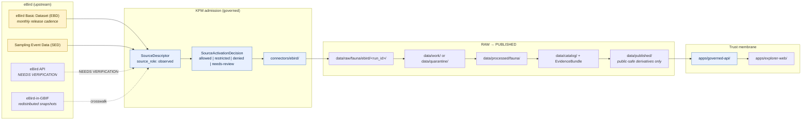

<!-- [KFM_META_BLOCK_V2]
doc_id: kfm://doc/sources/catalog/ebird
title: eBird — Source Profile
type: standard
version: v1
status: draft
owners: [PLACEHOLDER — biodiversity steward + source-registry steward; CODEOWNERS NEEDS VERIFICATION]
created: 2026-05-13
updated: 2026-05-13
policy_label: restricted
related:
  - docs/sources/SOURCE_DESCRIPTOR_STANDARD.md
  - docs/domains/fauna/README.md
  - docs/doctrine/directory-rules.md
  - docs/doctrine/truth-posture.md
  - schemas/contracts/v1/source/source-descriptor.schema.json
  - policy/sensitivity/
  - data/registry/sources/fauna/
tags: [kfm, source-profile, biodiversity, fauna, birds, ebird, restricted-use, observed]
notes:
  - "eBird EBD travels under restricted-use terms that limit republication; cite-or-abstain applies."
  - "All path claims herein are PROPOSED until verified against mounted-repo evidence."
[/KFM_META_BLOCK_V2] -->

# 🐦 eBird — Source Profile

> Human-facing companion to the eBird `SourceDescriptor`. Captures identity, role, rights posture, sensitivity treatment, cadence, KFM lifecycle, and public-release class for the eBird family — including the eBird Basic Dataset (EBD) and the eBird API.

**Status:** draft · **Owners:** *PLACEHOLDER — biodiversity steward + source-registry steward (NEEDS VERIFICATION)* · **Last updated:** 2026-05-13

---

## Quick jump

1. [Overview](#1-overview)
2. [Repo fit & authority](#2-repo-fit--authority)
3. [Source role & authority anchoring](#3-source-role--authority-anchoring)
4. [At-a-glance source profile](#4-at-a-glance-source-profile)
5. [Rights & restricted-use posture](#5-rights--restricted-use-posture)
6. [Sensitivity & C6 redaction mapping](#6-sensitivity--c6-redaction-mapping)
7. [Public release posture](#7-public-release-posture)
8. [KFM pipeline shape (RAW → PUBLISHED)](#8-kfm-pipeline-shape-raw--published)
9. [Connectors, cadence & smart-sync](#9-connectors-cadence--smart-sync)
10. [Validation, evidence & receipts](#10-validation-evidence--receipts)
11. [Open questions & verification backlog](#11-open-questions--verification-backlog)
12. [Related docs](#12-related-docs)
13. [Appendix](#13-appendix)

---

## 1. Overview

eBird is a community-observation dataset for bird occurrences, organized around effort-quantified checklists. KFM treats two surfaces under the eBird family:

- **eBird Basic Dataset (EBD)** — the bulk distribution of observation records, packaged with effort metadata (duration, distance, observer counts) and a Sampling Event Data (SED) companion. **CONFIRMED in KFM doctrine** as the canonical bird occurrence dataset for the biodiversity stack, traveling under **restricted-use terms that limit republication**.
- **eBird API** — programmatic access to recent, regional, and hotspot views. *Role and admissibility for KFM are **NEEDS VERIFICATION**; treat as `needs-review` until a `SourceActivationDecision` is issued.*

The corpus places eBird inside the **C10-06 Biodiversity Stack**, alongside GBIF, iNaturalist, NatureServe, USFWS, iDigBio, Symbiota, KU NHM, and FHSU Sternberg. KFM's biodiversity convention is to **anchor every occurrence to ITIS TSN** (or GBIF Backbone where ITIS is silent), preserve the originating institution, and **apply C6 redaction** for any species ranked S1/S2 by NatureServe or KDWP SINC.

> [!IMPORTANT]
> eBird EBD is a **restricted-use** source. KFM may *ingest* EBD into governed lanes for internal evidence resolution, but any **public derivative** must be evaluated against the current EBD terms and may require explicit approval. The default release class for EBD-derived public artifacts is **DENY** until an `EBD-derivative-release policy` is authored and an upstream `SourceActivationDecision` records the allowed scope.

---

## 2. Repo fit & authority

**Proposed canonical home:** `docs/sources/catalog/ebird.md` — under `docs/sources/`, which Directory Rules identify as the home for *source-descriptor standards and source families*.

> [!NOTE]
> The **`docs/sources/catalog/` subdirectory** is **PROPOSED** in this document. Directory Rules cite `docs/sources/` as the canonical lane and `docs/sources/SOURCE_DESCRIPTOR_STANDARD.md` as a known sibling, but the existence of a `catalog/` segment is **NEEDS VERIFICATION** against mounted-repo evidence. Confirm before merging, or open a drift entry in `docs/registers/DRIFT_REGISTER.md`.

### Adjacent authority surfaces (PROPOSED unless noted)

| Layer | Path | Authority | Status |
|---|---|---|---|
| Source-descriptor standard | `docs/sources/SOURCE_DESCRIPTOR_STANDARD.md` | Human-facing standard | PROPOSED |
| `SourceDescriptor` schema home | `schemas/contracts/v1/source/source-descriptor.schema.json` | Machine shape (per ADR-0001) | PROPOSED |
| Source authority register | `control_plane/source_authority_register.yaml` | Machine-readable register | PROPOSED |
| Sensitivity policy | `policy/sensitivity/` | Decision rules | PROPOSED |
| Registry entry | `data/registry/sources/fauna/ebird/` | Operational registry | PROPOSED |
| Connector | `connectors/ebird/` *(or `connectors/cornell-ebird/`)* | Source-specific fetcher | PROPOSED |
| Domain dossier | `docs/domains/fauna/README.md` | Domain landing | PROPOSED |
| Fauna pipeline | `pipelines/domains/fauna/` and `pipeline_specs/fauna/` | Executable + declarative | PROPOSED |

**Lifecycle invariant** (CONFIRMED doctrine): `RAW → WORK / QUARANTINE → PROCESSED → CATALOG / TRIPLET → PUBLISHED`. Promotion is a **governed state transition, not a file move.**

---

## 3. Source role & authority anchoring

### Source role assignment

`source_role = observed` (community / citizen-science observation).

- **Why `observed` and not `aggregate`** — checklists record per-observer detections in a defined effort window. The atomic record is an observation event with effort metadata, not a roll-up. KFM doctrine forbids inferring source role from convenience; this assignment is set at admission and persisted in the `SourceDescriptor`.
- **GBIF-redistributed EBD** — when eBird records reach KFM via the GBIF Occurrence API, the *provider* is GBIF and the *upstream source* is eBird. Both must be preserved in `EvidenceBundle` citations. Crosswalking via GBIF does **not** relax eBird's restricted-use posture.

### Authority anchoring (CONFIRMED KFM convention)

| Anchor | Role | Status |
|---|---|---|
| **ITIS TSN** | U.S.-canonical taxonomic authority; required anchor where ITIS has coverage | CONFIRMED doctrine |
| **GBIF Backbone Taxonomy** (DOI `10.15468/39omei`) | International crosswalk; second-line authority where ITIS is silent/stale | CONFIRMED doctrine |
| **Originating institution** | Preserved through admission and downstream catalog records | CONFIRMED doctrine |
| Sensitivity ranking | NatureServe + KDWP SINC drive C6 redaction posture | CONFIRMED doctrine |

> [!TIP]
> Where ITIS and GBIF disagree on accepted name, the KFM-wide tie-breaker policy is **NEEDS VERIFICATION** — the corpus flags this as an unresolved open question. Until the policy is authored, downstream consumers should treat such records as having two equally legitimate anchors and surface both.

---

## 4. At-a-glance source profile

**Field shape below is PROPOSED**, modeled on the doctrinal `SourceDescriptor` surface; **actual field names in the mounted schema are NEEDS VERIFICATION**.

| Field | Value | Truth label |
|---|---|---|
| `source_id` | `ebird` *(or `cornell-ebird` — choose at registry creation)* | PROPOSED |
| `source_family` | `biodiversity / fauna / birds` | CONFIRMED doctrine |
| `source_role` | `observed` | PROPOSED at admission |
| `provider` | Cornell Lab of Ornithology (operator) | NEEDS VERIFICATION |
| `role_authority` | Cornell Lab of Ornithology | NEEDS VERIFICATION |
| `surfaces` | `EBD` (bulk download), `SED`, `eBird API`, `eBird-in-GBIF` | NEEDS VERIFICATION (per-surface endpoints) |
| `access_method` | Bulk file download (EBD/SED); HTTP API (eBird API) | NEEDS VERIFICATION |
| `endpoint(s)` | *NEEDS VERIFICATION — record exact URLs in the descriptor, not here* | NEEDS VERIFICATION |
| `cadence` | EBD: **monthly release cadence** | CONFIRMED in corpus |
| `rights_posture` | **Restricted-use; redistribution limited** | CONFIRMED in corpus |
| `license` | *Not asserted here — record SPDX/text reference in the descriptor* | NEEDS VERIFICATION |
| `attribution_required` | `true` (assume yes; verify in current terms) | NEEDS VERIFICATION |
| `sensitivity_default` | Per-record, driven by NatureServe / KDWP SINC rank | CONFIRMED doctrine |
| `release_class` | **DENY** for public derivatives until terms reviewed | CONFIRMED doctrine posture |
| `taxonomic_anchor` | ITIS TSN (primary), GBIF Backbone (secondary) | CONFIRMED doctrine |
| `steward` | *NEEDS VERIFICATION — assign at admission* | NEEDS VERIFICATION |
| `activation_decision` | `needs-review` until policy + terms confirmed | PROPOSED default |

> [!NOTE]
> Per Directory Rules §2.3, **source identity, rights, and sensitivity are owned by `data/registry/` and `policy/sensitivity/`** — this document is the human-facing profile, not the authoritative descriptor. When this doc and the descriptor disagree, **the descriptor and policy bundle win.** Raise the conflict as a drift entry.

---

## 5. Rights & restricted-use posture

The KFM corpus records the following as **CONFIRMED**:

> *"eBird EBD restricted-use terms limit redistribution; the corpus warns that any KFM release derived from EBD must be checked against the EBD terms and may require approval."*
> *"Author an EBD-derivative-release policy that names what KFM can and cannot publish; pilot a request to eBird for KFM-specific terms."*

### Operational rules (PROPOSED, derived from CONFIRMED doctrine)

| Operation | Default | Required controls |
|---|---|---|
| **Ingest into governed lanes** (RAW/WORK) | ALLOW under access agreement | `SourceDescriptor` + `SourceActivationDecision`; rights text captured in `RunReceipt` |
| **Internal evidence resolution** | ALLOW | EvidenceRef → EvidenceBundle; no caching outside governed stores |
| **PROCESSED / CATALOG inside trust membrane** | ALLOW with provenance | Source preserved end-to-end; no source erasure during normalization |
| **Public download of EBD-derived records** | **DENY** by default | No EBD-derivative-release policy exists yet (PROPOSED in corpus) |
| **Public map of EBD-derived occurrence points** | **DENY** by default | C6 sensitivity overrides this anyway for many taxa |
| **Public aggregate (county roll-up, hex grid)** | RESTRICT pending policy | `AggregationReceipt` + matrix-cell semantics + DP receipt for aggregates if applied |
| **Republication to a third party** | **DENY** | Out-of-scope until upstream terms expressly allow it |
| **Citation of eBird as evidence in governed answers** | ALLOW | Citation must travel with the answer; cite-or-abstain default |

> [!WARNING]
> **Do not** publish exact-coordinate EBD-derived points on a public surface, in tiles, in published vector layers, or in evidence-drawer payloads. Trust-membrane discipline (CONFIRMED doctrine): public clients use governed APIs and **released public-safe** artifacts only — never RAW, WORK, QUARANTINE, candidates, or model-internal stores. A connector or watcher that bypasses this is a **SEVERE** drift event and must be reverted, not patched downstream.

---

## 6. Sensitivity & C6 redaction mapping

The KFM **C6 sensitivity rubric** (CONFIRMED) assigns each record a `sensitivity_rank` in 0–5. eBird records inherit rank from the species' published status (NatureServe, KDWP SINC) plus any per-record steward flag.

| Rank | Meaning | Default profile for eBird records | Public exposure |
|---|---|---|---|
| **0** | Public / open | `profile:none` | Allowed *— but EBD rights still gate downstream publication* |
| **1** | Common, non-sensitive | `profile:none` or coarse-cell summary | Allowed — *rights still apply* |
| **2** | Watchlist | Named profile (e.g., `point_10km_hex_seeded_v1`) | Generalized only |
| **3** | KDWP SINC / locally sensitive | `profile:sinc-obscure-10km` (corpus default) | Generalized cell or centroid; **NEEDS VERIFICATION** of exact profile |
| **4** | Threatened / rare (e.g., NatureServe S1/S2) | Strict mask or embargo | DENY exact; generalized public products only |
| **5** | Sacred / critical | Fail-closed | **No map or timeline exposure** |

Profile changes are versioned (`...@v1`) and each release of an EBD-derived public product **must** produce a `RedactionReceipt` recording `policy_ref`, `redaction_method`, `kept_fields`, `removed_fields`, `geometry_transform`, and `reviewer`.

> [!CAUTION]
> Even for rank-0/1 records, **eBird's restricted-use posture is a separate gate** from the C6 sensitivity gate. Both must pass. Passing C6 alone does not authorize an EBD-derived public release.

### Geoprivacy transform expectations

- **Display jitter** is *not* a substitute for actual geoprivacy. Use seeded, reproducible jitter only for display obfuscation, never as a privacy guarantee (CONFIRMED doctrine: C6-03).
- **Grid generalization** (H3 hex or PostGIS `ST_SnapToGrid`) is the recommended primary transform for biodiversity occurrences (CONFIRMED doctrine: C6-04).
- **Differential privacy** applies only to *aggregate* outputs (counts, heatmaps), never to raw points (CONFIRMED doctrine: C6-05).

---

## 7. Public release posture

| Class | Decision | Reason |
|---|---|---|
| **EBD raw checklists / records** | DENY | Restricted-use terms + cite-or-abstain default |
| **Per-record occurrence points** | DENY | Both rights gate and C6 sensitivity gate must clear |
| **Range-polygon products** | RESTRICT | Allowed only when derived without per-point exposure and approved by EBD-derivative policy |
| **Hex / county aggregates without per-point recovery** | RESTRICT pending policy | Needs an EBD-derivative-release policy and an `AggregationReceipt` |
| **Authoritative species lists for a region** | RESTRICT | Possible under attribution; verify against current terms |
| **Citation references to eBird** (without redistributing data) | ALLOW | Treat eBird as an evidence source via `EvidenceBundle` |
| **eBird-in-GBIF citations (where applicable)** | ALLOW | Cite GBIF distribution + DOI; rights still inherit from upstream eBird |

> [!IMPORTANT]
> **Required before any public derivative ships:** SourceActivationDecision = `allowed`, EBD-derivative-release policy authored and pinned in the policy bundle, attribution copy approved, evidence closure complete, sensitivity transforms applied where C6 demands, `RedactionReceipt` + `AggregationReceipt` (if applicable) emitted, ReleaseManifest produced, rollback target recorded, correction path defined.

---

## 8. KFM pipeline shape (RAW → PUBLISHED)

Per the Fauna domain's pipeline contract (CONFIRMED doctrine; PROPOSED lane application):

| Stage | Handling | Gate | Status |
|---|---|---|---|
| **RAW** | Capture immutable EBD/API payload (or reference) with `source_role`, rights text, sensitivity hint, citation, time, and content hash | `SourceDescriptor` exists; `SourceActivationDecision ∈ {allowed, restricted}` | PROPOSED |
| **WORK / QUARANTINE** | Normalize schema, geometry, time, taxon identity, evidence, rights, and policy; hold failures (malformed rows, missing effort fields, taxa without ITIS/GBIF anchor, rights ambiguity) | Validation + policy gate pass, or `QuarantineRecord` with reason | PROPOSED |
| **PROCESSED** | Emit validated normalized objects (`Occurrence Evidence`, `Occurrence Restricted`, `MonitoringEvent`), receipts, public-safe candidates where C6 + rights permit | `EvidenceRef` resolves, `ValidationReport`, digest closure | PROPOSED |
| **CATALOG / TRIPLET** | Emit catalog records, `EvidenceBundle`, graph/triplet projections, and release candidates | Catalog/proof closure passes; STAC × Darwin Core hybrid pattern for occurrence Items | PROPOSED |
| **PUBLISHED** | Serve **only** released public-safe artifacts through `apps/governed-api/`; no raw points; no restricted derivatives | `ReleaseManifest`, correction path, rollback target, review + policy state exist | PROPOSED |

### Trust-membrane reminders

- Public clients (`apps/explorer-web/`) and normal UI surfaces **MUST** use governed interfaces (`apps/governed-api/`), never canonical or internal stores.
- Connectors emit to `data/raw/...` or `data/quarantine/...` — **never** to `data/processed/`, `data/catalog/`, or `data/published/`.
- Watchers are non-publishing: they emit receipts and candidate decisions, not authoritative artifacts.

---

## 9. Connectors, cadence & smart-sync

| Aspect | Doctrine / posture | Notes |
|---|---|---|
| Connector location | `connectors/ebird/` *(name PROPOSED; final segment is registry's choice)* | Connector emits to `data/raw/fauna/<source_id>/<run_id>/` |
| Cadence — EBD | **Monthly release cadence** (CONFIRMED in corpus) | Capture `release_id` in `RunReceipt`; do not assume mid-cycle revisions |
| Cadence — eBird API | NEEDS VERIFICATION | Define separately when role is settled |
| Smart-sync | C3-01 Conditional GET (ETag / `If-None-Match`, `Last-Modified` / `If-Modified-Since`) is the default; pair with manifest SHA-256 verification (C3-02) when publisher exposes a checksums file | EBD bulk file SHOULD be content-hashed at intake |
| Rate-limit / concurrency | Treat as a **governed budget** constrained by upstream terms, stewardship posture, and politeness rules (PROPOSED) | Record rate-limit posture in `SourceDescriptor` |
| Quarantine triggers | Missing effort fields; incomplete checklist when downstream requires `complete = TRUE`; taxon without ITIS/GBIF anchor; rights ambiguity; schema drift; license posture change | Each produces a `QuarantineRecord` with a reason code |
| Receipt content | `spec_hash`, `source_head` (ETag, Last-Modified, content length, source commit), `source_url`, `license` (SPDX id + text ref), `evidence_refs[]`, `decision_log`, `runner_id`, `timestamp`, `kfm_spec_version`, `target_zone` | Canonical KFM `run_receipt.json` shape |

> [!NOTE]
> If EBD ships without a checksums manifest in a given release, fall back to publisher validator headers (ETag / Last-Modified). Track whether eBird exposes a manifest in the registry's `has_manifest` flag — and surface it on the Friday material-change check-in.

---

## 10. Validation, evidence & receipts

### Required objects (per KFM doctrine, PROPOSED implementation for this source)

| Object | Purpose | Required for eBird? |
|---|---|---|
| `SourceDescriptor` | Identity, role, rights, cadence, access, sensitivity, release posture | Yes — at admission |
| `SourceActivationDecision` | Gate deciding allowed / restricted / quarantined / denied / needs-review | Yes — before connector activates |
| `RunReceipt` | Auditable record of intake / transform / validation / catalog / release / rebuild | Yes — every connector run |
| `ValidationReport` | Schema, geometry, temporal, rights, sensitivity, evidence checks | Yes — at WORK gate |
| `EvidenceRef` → `EvidenceBundle` | Pointer from claim/feature/layer to evidence support; bundle returns source list, excerpts/records, provenance, policy/review/release state | Yes — for any consequential downstream claim |
| `RedactionReceipt` | Public-safe transformation record (masking, generalization, suppression) | Yes — whenever C6 transforms apply |
| `AggregationReceipt` | Pins geometry scope for aggregated outputs | Required for any aggregated public product |
| `PolicyDecision` | `allow | deny | restrict | abstain | error` envelope | Yes — at every gate |
| `PromotionReceipt` | Auditable representation of Promotion Gates A–G | Yes — at promotion |
| `ReleaseManifest` | Published artifact set, digests, policy posture, rollback target | Yes — at PUBLISHED |
| `CorrectionNotice` | When records change, are withdrawn, or shift sensitivity | On material change |

### Promotion Gate Matrix (A–G)

| Gate | Intent | What it checks for eBird |
|---|---|---|
| **A** — Structure & Metadata | MetaBlock presence and zone correctness | `SourceDescriptor` exists; `source_role = observed`; zones consistent |
| **B** — Schemas & Contracts | Schema and OpenAPI validation | Occurrence / event / checklist shapes valid; STAC × Darwin Core hybrid clean |
| **C** — Policy Parity | Conftest/OPA decisions match runtime | CI bundle digest pinned; same Rego runs at PDP |
| **D** — Security & Sensitivity | Sensitivity and license scans | C6 redaction profile applied; EBD rights text captured |
| **E** — Data Quality | DQ profilers/assertions with thresholds | Complete-checklist invariants where required; effort variables present; taxon anchored |
| **F** — Provenance & Lineage | Receipt and lineage validation | Run, source, content, geometry, spec hashes all closed |
| **G** — Reviewability | CODEOWNERS-enforced human + policy approval | Biodiversity steward + source-registry steward signoff |

---

## 11. Open questions & verification backlog

<b>Click to expand — eBird-specific open items derived from KFM corpus (PROPOSED / NEEDS VERIFICATION)</b>

| # | Item | Class |
|---|---|---|
| 1 | Author the **EBD-derivative-release policy** as a small machine-readable asset under the policy bundle | Writing |
| 2 | Pilot a request to eBird / Cornell Lab for **KFM-specific terms** that bound permissible derivatives | Process |
| 3 | Confirm current redistribution-terms posture of eBird EBD (corpus flags this as an evidence-needed question) | Verification |
| 4 | Record the eBird API role and admissibility — is it `observed`, `aggregate`, or out-of-scope? | Design |
| 5 | Determine the right cell size for KDWP SINC species in eBird-derived public layers; does it vary by county density? | Design |
| 6 | Document the **eBird-in-GBIF** crosswalk: when KFM ingests an EBD record via GBIF, how is upstream attribution preserved and how do rights propagate? | Design |
| 7 | Pin the exact endpoint URLs and access methods in the `SourceDescriptor` (do not pin them in this doc) | Verification |
| 8 | Confirm `has_manifest` posture (does eBird publish a SHA-256 manifest for EBD releases?) | Verification |
| 9 | Define the **monthly snapshot handler** — receipt must capture exact release identifier to prevent downstream double-counting | Implementation |
| 10 | Add CI check that flags any eBird-derived record lacking both an ITIS and a GBIF Backbone anchor | Implementation |
| 11 | Add a fixture suite: rank 0–5 examples, complete vs incomplete checklists, ambiguous taxon, rights-unknown | Implementation |
| 12 | Confirm `policy/sensitivity/` decision rules treat EBD restricted-use as a *separate* gate from C6 sensitivity | Verification |

---

## 12. Related docs

- [`docs/sources/SOURCE_DESCRIPTOR_STANDARD.md`](../SOURCE_DESCRIPTOR_STANDARD.md) — source-descriptor standard *(PROPOSED path)*
- [`docs/doctrine/directory-rules.md`](../../doctrine/directory-rules.md) — placement law *(PROPOSED path)*
- [`docs/doctrine/truth-posture.md`](../../doctrine/truth-posture.md) — cite-or-abstain *(PROPOSED path)*
- [`docs/doctrine/lifecycle-law.md`](../../doctrine/lifecycle-law.md) — RAW → PUBLISHED *(PROPOSED path)*
- [`docs/architecture/contract-schema-policy-split.md`](../../architecture/contract-schema-policy-split.md) — split of contracts / schemas / policy *(PROPOSED path)*
- [`docs/domains/fauna/README.md`](../../domains/fauna/README.md) — Fauna domain landing *(PROPOSED path)*
- [`docs/standards/SENSITIVITY_RUBRIC.md`](../../standards/SENSITIVITY_RUBRIC.md) — C6 rubric 0–5 *(PROPOSED path)*
- [`docs/standards/REDACTION_DETERMINISM.md`](../../standards/REDACTION_DETERMINISM.md) — seeded jitter & grid rules *(PROPOSED path)*
- [`docs/registers/DRIFT_REGISTER.md`](../../registers/DRIFT_REGISTER.md) — record any path drift uncovered while wiring eBird *(PROPOSED path)*
- *Sibling source profiles* (PROPOSED): `gbif.md`, `inaturalist.md`, `natureserve.md`, `usfws.md`, `idigbio.md`, `symbiota.md`

---

## 13. Appendix

<b>A. Why eBird is governed differently from the broader biodiversity stack</b>

The KFM corpus (CONFIRMED) treats biodiversity as the most plurally-sourced domain in the system. GBIF, iNaturalist, NatureServe, USFWS, iDigBio, Symbiota, KU NHM, and FHSU Sternberg all sit alongside eBird in the C10-06 stack. Most of those sources are **permissive** with respect to redistribution. eBird is the exception: EBD's restricted-use terms make it the canonical *restricted* biodiversity dataset in the corpus.

This is why eBird gets a dedicated source profile rather than living inside a generic "biodiversity aggregators" entry: its rights gate is materially different and must be enforced separately from the C6 sensitivity gate. Treating them as a single gate is a known anti-pattern.

<b>B. EvidenceBundle expectations for eBird-cited claims</b>

When a KFM answer, layer, or feature cites eBird as supporting evidence, the resolved `EvidenceBundle` SHOULD include:

- **Source list:** eBird (and GBIF if redistributed via GBIF), with stable identifiers.
- **Excerpts / records:** the record identifiers actually cited (never the full row when restricted-use applies; cite-or-abstain).
- **Provenance:** ingest receipt hash, EBD release identifier, run receipt reference.
- **Policy / review / release state:** current `SourceActivationDecision`, applicable `RedactionReceipt` reference, `ReleaseManifest` reference.
- **Temporal scope:** observed time, source time, retrieval time, release time, correction time — kept distinct where material.
- **Rights text:** SPDX identifier where applicable; otherwise reference to current upstream terms.

Generated text never substitutes for `EvidenceBundle`: bundles outrank fluent generation.

<b>C. STAC × Darwin Core hybrid for eBird occurrence Items (PROPOSED pattern)</b>

Per the corpus's STAC × DwC hybrid (CONFIRMED doctrine, PROPOSED for eBird):

- STAC envelope: `id`, `stac_version`, `type: Feature`, `geometry`, `bbox`, `properties.datetime`, `assets`, `links`, `collection`, `stac_extensions[]`.
- DwC payload lives in `properties.taxon` and `properties.event`:
  - `taxon`: `scientific_name`, `common_name`, `itis_tsn`, `gbif_taxon_id`, `kdwp_status`, `nature_serve_rank`, `sensitivity_rank`, `redaction_profile`.
  - `event`: `eventID`, `eventDate`, `samplingProtocol`, `sampleSizeValue` (effort), `samplingEffort` (duration), checklist completeness flag.
- KFM-namespaced enrichments: `kfm:evidence_bundle`, `kfm:policy_label`, `kfm:sensitivity`, `kfm:spec_hash`, `kfm:release_state`.
- Provenance via `links` with `derived_from` / `was_generated_by` rel values rather than inventing top-level fields.

Field names above are **PROPOSED**; the authoritative shapes live in `schemas/contracts/v1/...`. Verify before depending on any name.

<b>D. Anti-patterns to avoid</b>

- ❌ Publishing exact EBD-derived points on a public surface.
- ❌ Treating GBIF redistribution as relaxing eBird's upstream rights posture.
- ❌ Collapsing the rights gate and the C6 sensitivity gate into a single check.
- ❌ Naming the connector path after a topic (e.g., `connectors/birds/`) rather than the source (`connectors/ebird/`).
- ❌ Cache-storing EBD payloads outside governed lanes (e.g., in `artifacts/`, browser caches, public S3).
- ❌ Re-rolling jitter on each render of a sensitive point (triangulation risk; use seeded jitter).
- ❌ Citing eBird in a published artifact without an `EvidenceBundle` and rights text.

---

Last reviewed: 2026-05-13 · Doc version: v1 · [⬆ Back to top](#-ebird--source-profile)
