<!-- [KFM_META_BLOCK_V2]
doc_id: kfm://doc/docs-sources-catalog-ebird-ebird-api
title: eBird API — product page
type: product-page
version: v0.2
status: draft
owners: <PLACEHOLDER — Docs steward + Source steward for ebird>
created: 2026-05-20
updated: 2026-05-21
policy_label: public
related:
  - docs/sources/catalog/ebird/README.md
  - docs/sources/catalog/ebird/ebird-ebd.md
  - docs/sources/catalog/README.md
  - docs/sources/catalog/_template/SOURCE_PRODUCT_TEMPLATE.md
  - docs/sources/catalog/PROFILES.md
  - docs/sources/catalog/IDENTITY.md
  - docs/sources/catalog/RIGHTS-AND-SENSITIVITY-MAP.md
  - docs/sources/catalog/OPEN-QUESTIONS.md
  - docs/doctrine/directory-rules.md
  - policy/sensitivity/sensitive-species.rego
tags: [kfm, docs, sources, catalog, ebird, fauna, biodiversity, citizen-science, sensitive-species]
notes:
  - "PROPOSED product-page scaffold for the eBird API (Cornell Lab). The eBird Basic Dataset (EBD) is a separate product — see sibling page ebird-ebd.md."
  - "Family folder is PROPOSED beyond directory-rules.md §7.3 — eBird is not one of the nine §7.3 connector roots; see OPEN-DSC-14."
  - "eBird-as-canonical-avian-authority is CONFIRMED KFM doctrine (KFM-P2-IDEA-0020). Sensitive-species deny-by-default posture is PROPOSED KFM doctrine (KFM-P24-IDEA-0002, KFM-P24-PROG-0013)."
  - "External attribution: Cornell Lab of Ornithology / eBird API 2.0; API key required per ebird.org/api/keygen; rate-limit discipline required. [EXTERNAL]"
  - "All repo paths, identity strings, and catalog-profile yes/no assignments are PROPOSED until mounted-repo inspection, SourceDescriptor admission, and per-product validation runs."
[/KFM_META_BLOCK_V2] -->

# eBird API

> KFM product page for the **eBird API 2.0** — Cornell Lab's programmatic surface for recent, regional, hotspot, and notable bird-occurrence views. **PROPOSED scaffold** — distinct from the eBird Basic Dataset (EBD), which is a sibling product page. Sensitive-species records flow through deny-by-default policy gates; no record reaches a public layer without redaction, aggregation, or role-gated access.


> **Status:** PROPOSED — scaffold only · **Family:** [`ebird`](./README.md) · **Owners:** `<PLACEHOLDER — Docs steward + Source steward for ebird>` · **Last reviewed:** 2026-05-21
>
> Badge targets are placeholder Shields.io endpoints until CI, registry, and policy wiring are confirmed against a mounted repo.

---

## Quick jump

- [1. Product summary](#1-product-summary)
- [2. KFM stance — and the eBird API vs. EBD split](#2-kfm-stance--and-the-ebird-api-vs-ebd-split)
- [3. Repo fit](#3-repo-fit)
- [4. Source authority](#4-source-authority)
- [5. Catalog profiles used](#5-catalog-profiles-used)
- [6. Collection identity](#6-collection-identity)
- [7. Provenance fields](#7-provenance-fields)
- [8. Temporal handling](#8-temporal-handling)
- [9. Geometry, projection & redaction profiles](#9-geometry-projection--redaction-profiles)
- [10. Rights & sensitivity](#10-rights--sensitivity)
- [11. Validation & catalog closure](#11-validation--catalog-closure)
- [12. Related contracts & schemas](#12-related-contracts--schemas)
- [13. Related connectors & pipelines](#13-related-connectors--pipelines)
- [14. Examples](#14-examples)
- [15. Open questions](#15-open-questions)
- [16. Related docs](#16-related-docs)
- [17. Appendix — about the eBird API as a product](#17-appendix--about-the-ebird-api-as-a-product)

---

## 1. Product summary

| Field | Value | Status |
|---|---|---|
| Product | eBird API 2.0 — programmatic access to recent / regional / hotspot / notable observation views | EXTERNAL |
| Distinct from | eBird Basic Dataset (EBD) — monthly research-grade dump; see sibling page [`ebird-ebd.md`](./ebird-ebd.md) | PROPOSED sibling |
| Family | [`ebird`](./README.md) | PROPOSED — beyond `directory-rules.md` §7.3, see `OPEN-DSC-14` |
| Producer / host | Cornell Lab of Ornithology, Cornell University | [EXTERNAL, ebird.org] |
| Authentication | API key, registered at `ebird.org/api/keygen`; sent via `x-ebirdapitoken` header (or `key=` query parameter) | [EXTERNAL, eBird API 2.0 docs] |
| Default response format | JSON | [EXTERNAL, eBird API 2.0 docs] |
| Endpoint families | observations · hotspots · regions · species · statistics | [EXTERNAL, eBird API 2.0 docs] |
| Region code scheme | country (`US`) · subnational1 state/province (`US-KS`) · subnational2 county (`US-KS-XXX`) | [EXTERNAL, eBird API 2.0 docs] |
| Rate limits | Yes — *"Use the API with some restraint. Data costs money so don't go downloading all the checklists for the world…"* | [EXTERNAL, eBird API 2.0 docs] |
| KFM canonical-authority statement | "eBird (Cornell Lab) is treated as the canonical citizen-science avian authority" | CONFIRMED — `KFM-P2-IDEA-0020` |
| KFM admission status | NEEDS VERIFICATION — SourceDescriptor not yet observed in `data/registry/sources/` | PROPOSED |
| KFM domain reach | fauna (primary) · habitat (context) · hazards (bird-strike / disease only when applicable) | PROPOSED |
| Sensitive-species posture | DENY-by-default until redaction, aggregation, or role-gated access is explicitly approved | PROPOSED doctrine — `KFM-P24-IDEA-0002`, `KFM-P24-PROG-0013` |

> [!IMPORTANT]
> Values labeled **EXTERNAL** describe the eBird API as a public product. They are *not* evidence that KFM has admitted, redacted, validated, or published anything. KFM-side admission is governed by the SourceDescriptor in `data/registry/sources/` and the policy bundle in `policy/sensitivity/`.

[↑ back to top](#quick-jump)

---

## 2. KFM stance — and the eBird API vs. EBD split

CONFIRMED KFM doctrine (`KFM-P2-IDEA-0020`): "eBird (Cornell Lab) is treated as the canonical citizen-science avian authority, ingested via the eBird API with appropriate license and rate-limit handling. eBird data carries observer attribution that flows through the watcher into the EvidenceBundle."

PROPOSED KFM doctrine (`KFM-P2-PROG-0005`): a reproducible eBird ingest adapter "pulls citizen-science bird observations under Cornell Lab terms, runs ingest-time QA on basic-observation fields (location, date, taxon, count, observation type), maps eBird license and attribution metadata to the KFM license model, applies sensitivity rules for sensitive species, and emits an EvidenceBundle plus run receipt."

**Two distinct eBird products — two distinct KFM product pages:**

| Property | This page — **eBird API 2.0** | Sibling — **eBird Basic Dataset (EBD)** |
|---|---|---|
| Update model | Near-real-time, observation-by-observation | Monthly research-grade dump |
| Access | HTTP REST + API key | Cornell data-request portal, separate access agreement |
| Coverage | Recent (1–30 days back) and hotspot/regional summaries | All-time global eBird archive |
| Use within KFM | **Operational / coverage layer**, watcher-driven freshness signal, hotspot enrichment | **Research-grade authority** for historical occurrences |
| Catalog grain | STAC Items per region/window | STAC Items per monthly partition |
| Source descriptor card | (this page) | `KFM-P24-PROG-0001` ("eBird EBD source descriptor … monthly cadence, species_code, observation_id, checklist_id, effort fields, source_uri, terms, and sensitivity posture") |

> [!IMPORTANT]
> CONFIRMED rule (`KFM-P2-IDEA-0020`): eBird records are a **coverage / observation source, not specimen-backed evidence**. The ingest layer MUST annotate that distinction and MUST NOT let eBird records displace KANU/KSC specimen records in dedupe. Downstream UI MUST NOT render eBird points and specimen points with identical UI weight.

[↑ back to top](#quick-jump)

---

## 3. Repo fit

```mermaid
flowchart LR
  EXT["External · eBird API 2.0<br/>ebird.org · API key + rate limits"]
  SD["data/registry/sources/<br/>SourceDescriptor (PROPOSED)"]
  CONN["connectors/ebird/<br/>(PROPOSED — beyond §7.3)"]
  RAW["data/raw/fauna/ebird/&lt;run_id&gt;/"]
  WQ["data/quarantine/…<br/>(sensitive-species hold)"]
  PROC["data/processed/…"]
  CAT["data/catalog/<br/>STAC · DCAT · PROV-O · fauna projection"]
  PUB["data/published/layers/…<br/>(redacted / aggregated only)"]
  POL["policy/sensitivity/<br/>deny-by-default for sensitive taxa"]
  REL["release/manifests/<br/>ReleaseManifest digest"]

  EXT -- watcher --> CONN
  CONN -- ingest receipt --> RAW
  RAW -- normalize / QA / sensitivity check --> WQ
  WQ -- gate pass --> PROC
  PROC -- EvidenceBundle + ValidationReport --> CAT
  CAT -- catalog closure --> REL
  REL -- promotion (redacted only) --> PUB
  POL -. fails closed .-> WQ
  POL -. fails closed .-> CAT
  POL -. fails closed .-> PUB
  SD -. governs .-> CONN

  classDef ext fill:#6e7681,stroke:#30363d,color:#fff;
  classDef proposed fill:#bf8700,stroke:#5c4400,color:#fff;
  classDef gov fill:#1f6feb,stroke:#0a2e6b,color:#fff;
  classDef pol fill:#cf222e,stroke:#82071e,color:#fff;
  class EXT ext;
  class CONN,RAW,WQ,PROC,CAT,REL,PUB proposed;
  class SD gov;
  class POL pol;
```



> [!NOTE]
> The diagram is illustrative. Edges and lane labels are PROPOSED. NEEDS VERIFICATION against mounted-repo evidence.

**This file's home (PROPOSED)** — `docs/sources/catalog/ebird/ebird-api.md`. Sibling-doc references assume the PROPOSED `docs/sources/catalog/` lane substructure documented in [`README.md`](./README.md).

[↑ back to top](#quick-jump)

---

## 4. Source authority

The authoritative SourceDescriptor for this product lives in [`data/registry/sources/`](../../../../data/registry/sources/) — **PROPOSED** path. The SourceDescriptor is the single admission and authority-control surface (CONFIRMED doctrine — Unified Implementation Architecture Build Manual §11).

> [!CAUTION]
> **Do not duplicate SourceDescriptor fields on this page.** If anything here appears to contradict a SourceDescriptor field for the eBird API once one exists, the SourceDescriptor wins.

PROPOSED SourceDescriptor stub fields for the eBird API (illustrative — to be ratified in `data/registry/sources/`, not here):

| Field | Candidate value | Status |
|---|---|---|
| `source_id` | `ebird_api` *(or `ebird:api2`)* | PROPOSED — NEEDS VERIFICATION |
| `source_role` | `observation` (citizen-science coverage layer, **not** specimen authority) | CONFIRMED role per `KFM-P2-IDEA-0020` |
| `rights_posture` | requires Cornell Lab terms acceptance + API key; observer attribution required | EXTERNAL — see §17 |
| `access_method` | HTTPS REST; `x-ebirdapitoken` header; JSON responses | EXTERNAL — see §17 |
| `cadence` | near-real-time (per-observation); 1–30 day lookback windows | EXTERNAL — see §17 |
| `steward` | `<PLACEHOLDER>` (fauna steward) | UNKNOWN |
| `sensitivity` | **`sensitive` for taxa flagged in regional/federal lists** — deny-by-default | PROPOSED doctrine — `KFM-P24-IDEA-0002` |
| `attribution_required` | Cornell Lab of Ornithology · per-observation observer attribution | CONFIRMED — `KFM-P2-IDEA-0020` |
| `public_release_class` | candidate `public-redacted` (aggregated/H3-cell only) | PROPOSED — `KFM-P24-PROG-0015` |
| `secret_handling` | API key in vault / env; never committed to repo | PROPOSED — standard secrets discipline |

[↑ back to top](#quick-jump)

---

## 5. Catalog profiles used

PROPOSED profile assignments for the eBird API product. Lane-wide profile registry: [`PROFILES.md`](../PROFILES.md). All entries below are **PROPOSED** and **NEEDS VERIFICATION** against actual catalog artifacts in `data/catalog/`.

| Profile | Lane | Used by this product? | Why / Why-not |
|---|---|---|---|
| **STAC** | `data/catalog/stac/` | PROPOSED — **Yes** | Spatiotemporal coverage of observations; per-window STAC Items per region; native polygon for hotspots, point for observations. Items aggregated for public release; raw points remain in `processed/`. |
| **DCAT** | `data/catalog/dcat/` | PROPOSED — **Yes** | Public dataset discovery; distribution per redaction profile. NEEDS VERIFICATION whether redacted PMTiles is one `dcat:Distribution` or many. |
| **PROV-O** | `data/catalog/prov/` | PROPOSED — **Yes** | Per-observation observer attribution flows through to PROV `wasAttributedTo` (CONFIRMED — `KFM-P2-IDEA-0020`). KFM admission via EvidenceBundle requires PROV closure regardless. |
| **Domain projection — fauna** | `data/catalog/domain/fauna/` | PROPOSED — **Yes** | Avian taxa; Taxon and Taxon Crosswalk object families per atlas Fauna lane §E. Sensitivity controls fail closed. |
| **Domain projection — habitat** | `data/catalog/domain/habitat/` | PROPOSED — **conditional** | Hotspot polygons may inform habitat patches; NEEDS VERIFICATION. |
| **Domain projection — hazards** | `data/catalog/domain/hazards/` | PROPOSED — **conditional** | Bird-strike or disease surveillance contexts only; not a primary projection for the eBird API. |

> [!TIP]
> Catalog linkage across **STAC, DCAT, PROV, and the ReleaseManifest** is a **gate condition**, not best-effort documentation (`KFM-P22-IDEA-0003`, `KFM-P22-PROG-0005`). Catalog closure must cross-check digests across all four (`KFM-P22-PROG-0037`, `KFM-P22-PROG-0038`, `KFM-P22-PROG-0039`). Catalog writers MUST also emit license, rightsHolder, datasetID, harvest date, dataset version, and EvidenceBundle references (`KFM-P26-PROG-0025`).

[↑ back to top](#quick-jump)

---

## 6. Collection identity

Collection-id and namespace conventions for the eBird API follow [`IDENTITY.md`](../IDENTITY.md). The KFM namespace pin (`kfm:` vs. `ks-kfm:`) is unresolved — see `OPEN-DSC-03` in [`OPEN-QUESTIONS.md`](../OPEN-QUESTIONS.md).

PROPOSED identity skeleton (illustrative — do not adopt without ADR):

```text
# Collection (one per logical product surface)
<namespace>:collection:ebird:api2:<surface>:v<schema-version>
  where <surface> ∈ { recent, notable, hotspots, regions, species, statistics }

# Items (one per fetch window / region / cell)
<namespace>:item:ebird:api2:<surface>:<US-KS[-county]>:<YYYY-MM-DD>

# Source descriptor anchor
<namespace>:source:ebird:api2
```

**Asset roles** (PROPOSED — confirm against `schemas/contracts/v1/source/`):

| Asset role | Likely content | Status |
|---|---|---|
| `data-raw` | Native JSON response (RAW only; never published) | PROPOSED — restricted lane |
| `data` | Normalized + sensitivity-filtered records | PROPOSED |
| `data-aggregated-h3` | Public-safe H3-cell aggregation | PROPOSED — `KFM-P24-PROG-0015` HUC alternative; `C6-04` H3 default |
| `data-aggregated-huc12` | Public-safe HUC12 aggregation | PROPOSED — `KFM-P24-PROG-0015` |
| `metadata` | KFM-side normalized metadata blob | PROPOSED |
| `provenance` | PROV-O document with observer attribution | PROPOSED |
| `redaction-receipt` | Redaction-receipt envelope (policy_ref, redaction_method, kept/removed fields, geometry_transform, reviewer) | PROPOSED — Fauna lane redaction receipt shape |
| `thumbnail` | Static aggregated preview | PROPOSED |

> [!NOTE]
> The skeleton is illustrative only. Final identity strings must come from `IDENTITY.md` plus the ADR resolving `OPEN-DSC-03`. Asset-role names must match `schemas/contracts/v1/source/` per ADR-0001.

[↑ back to top](#quick-jump)

---

## 7. Provenance fields

PROPOSED STAC `properties.kfm:provenance` block — grounded in Pass-10 C4-01 (EvidenceBundle), the catalog-closure cards (`KFM-P22-PROG-0037`, `KFM-P22-PROG-0038`, `KFM-P22-PROG-0039`), and the eBird-specific observer-attribution rule (`KFM-P2-IDEA-0020`):

```json
{
  "properties": {
    "kfm:provenance": {
      "spec_hash":            "sha256:<canonical-record-digest>",
      "evidence_bundle_ref":  "kfm://evidence/<digest>",
      "run_record_ref":       "kfm://run/<run-id>",
      "audit_ref":            "kfm://audit/<attestation-id>",
      "policy_digest":        "sha256:<policy-bundle-digest>",
      "release_manifest_ref": "kfm://release/<manifest-digest>",
      "redaction_receipt_ref":"kfm://receipt/redaction/<digest>",
      "source_attribution": {
        "producer":     "Cornell Lab of Ornithology / eBird",
        "host":         "Cornell University",
        "api_version":  "eBird API 2.0",
        "observers":    "<flowed through per-observation per KFM-P2-IDEA-0020>"
      }
    }
  },
  "assets": {
    "data-aggregated-h3": {
      "href": "<published-href>",
      "file:checksum": "<multihash>"
    }
  }
}
```

> [!IMPORTANT]
> **Observer attribution MUST flow per-observation**, not be collapsed to a generic "eBird" credit (CONFIRMED — `KFM-P2-IDEA-0020`). At aggregation time (H3 / HUC12), observer lists become a flattened set field on the cell, but the original per-observation attribution remains in the RAW + PROCESSED lanes and in the EvidenceBundle.

Per-asset integrity uses `file:checksum` (STAC `file` extension). The chosen hash algorithm MUST follow the object-family hash policy in `KFM-P4-PROG-0003` ("define object-family-specific hash roles…").

[↑ back to top](#quick-jump)

---

## 8. Temporal handling

CONFIRMED doctrine — distinct **source / observed / valid / retrieval / release / correction** times where material. PROPOSED mapping for the eBird API:

| KFM time field | eBird source field | Notes | Status |
|---|---|---|---|
| `source_time` | `obsDt` (observation datetime, ISO 8601) | The observer's recorded sighting timestamp. | EXTERNAL — see §17 |
| `observed_time` | `obsDt` | Same as `source_time` for citizen-science observations. | PROPOSED |
| `valid_time` | Range begins at `obsDt`; no upper bound for an observation | Observations are points-in-time. Hotspot summaries valid for the lookback window (`back`, 1–30 days). | PROPOSED |
| `retrieval_time` | KFM watcher poll timestamp | Set by connector at fetch. Important for distinguishing late-arriving observations. | PROPOSED |
| `release_time` | Cornell Lab review / acceptance time (where exposed) | The eBird Review process can change a record's status post-submission. | NEEDS VERIFICATION — which fields expose this |
| `correction_time` | When eBird reviewers re-classify, suppress, or move a record | KFM MUST treat these as correction events. | NEEDS VERIFICATION |

> [!WARNING]
> Catalog patches for eBird review-driven corrections are **governed release events**, not silent metadata edits (`KFM-P12-IDEA-0004`). They require receipts, ETags, reconciliation artifacts, policy results, and rollback targets. A taxon that flips from "accepted" to "needs review" on the eBird side MUST trigger a KFM correction loop.

[↑ back to top](#quick-jump)

---

## 9. Geometry, projection & redaction profiles

PROPOSED — confirm CRS, generalization rules, and scale support against `data/catalog/` artifacts. NEEDS VERIFICATION.

| Property | Candidate / external value | Status |
|---|---|---|
| Native CRS | EPSG:4326 — `lat`/`lng` fields, decimal degrees, observation precision (up to several decimal places) | EXTERNAL — eBird API 2.0 |
| KFM canonical CRS for vector catalog | EPSG:4326 (likely) | PROPOSED |
| Point precision | Native — high (observer-reported) | EXTERNAL |
| Public-release precision | **NEVER native point precision for sensitive taxa**; aggregated only | PROPOSED doctrine — `KFM-P24-IDEA-0002` |
| STAC `proj:*` fields | `proj:code`, `proj:bbox`, `proj:geometry`, `proj:shape`, `proj:transform` | PROPOSED — lint via `KFM-P27-FEAT-0003` |

### 9.1 Redaction profiles available to public-release pipelines

CONFIRMED doctrine for biodiversity-occurrence sensitive-location redaction (Pass-10 C6 family). PROPOSED choice per eBird-API public release:

| Profile | Where it applies | Source doctrine |
|---|---|---|
| **Seeded reproducible jitter** | Optional display redaction. PRNG seeded by `spec_hash + occurrence_id` so the same record always receives the same offset; distributions uniform-in-radius or Laplace. | `C6-03` — CONFIRMED |
| **H3 hex cell generalization** | **Recommended default for public eBird release.** Snap points to H3 cells of documented size per sensitivity rank. | `C6-04` — CONFIRMED; H3 is the documented hex default |
| **Square-grid generalization (ST_SnapToGrid)** | Alternative to H3 where downstream tooling prefers square cells. | `C6-04` — CONFIRMED |
| **HUC12 aggregation** | For watershed-scale outputs. Sensitive occurrences should be aggregatable to HUC12 or coarser units as an alternative to point publication. | `KFM-P24-PROG-0015` — PROPOSED |
| **Differential privacy** | **Only for aggregate outputs** (counts, heatmaps). NEVER for raw points. Epsilon/delta recorded in receipts. | `C6-05` — CONFIRMED scope |
| **k-Anonymity** | Render-time check for living-people overlays; not a primary need for eBird (no living-person fields beyond observer ID) but relevant for joined views. | `C6-06` |

> [!CAUTION]
> **Random-each-render jitter is forbidden** — it is triangulable. Seeded deterministic jitter only (`C6-03`). And **DP applied to raw points is forbidden** — it can be undone and misleads users; DP applies to counts/heatmaps only (`C6-05`).

[↑ back to top](#quick-jump)

---

## 10. Rights & sensitivity

> [!IMPORTANT]
> This is the **highest-attention section** for this product. eBird sits inside Fauna's deny-by-default sensitive-species policy lane. Most KFM-side decisions on this page flow from §10.

### 10.1 Cornell Lab terms

External terms: API key required at `ebird.org/api/keygen`; data use governed by Cornell Lab terms; rate-limit discipline expected — [EXTERNAL, eBird API 2.0 docs]. The exact license string and machine-readable rights metadata applicable to **KFM derivative tiles/PMTiles** are NEEDS VERIFICATION.

Per KFM doctrine, **"license travels with deltas before map ingestion"** (`ML-062-016`, Master MapLibre Components, CONFIRMED). Map-layer admission MUST fail closed when license status is unknown.

### 10.2 Sensitive-species posture

PROPOSED doctrine — deny-by-default until redaction, aggregation, or role-gated access is explicitly approved:

> "Fauna occurrence records for sensitive taxa should default to DENY or ABSTAIN until redaction, aggregation, or role-gated access is explicitly approved." — `KFM-P24-IDEA-0002`
>
> "OPA policy should return ABSTAIN or DENY for sensitive fauna unless spatial generalization, aggregation, or access gating obligations are satisfied." — `KFM-P24-PROG-0013`

### 10.3 Required inputs to the policy decision

| Input | Source | Status |
|---|---|---|
| Sensitive-species list — Kansas | KDWP endangered, threatened, and SINC lists (atlas `KFM-P19-IDEA-0005` — CONFIRMED Kansas regulatory authority) | NEEDS VERIFICATION endpoint |
| Sensitive-species list — federal | USFWS ECOS-like federal sources (atlas Fauna lane §D) | NEEDS VERIFICATION |
| Sensitivity-rank-to-cell-size table | `policy/sensitivity/sensitive-species.rego` (PROPOSED path) | NEEDS VERIFICATION |
| Role-gated access list | `policy/sources/` access-gate rules | NEEDS VERIFICATION |

### 10.4 CARE applicability

- **CARE** (Collective Benefit, Authority to Control, Responsibility, Ethics — Indigenous data governance) is **conditional**.
- eBird itself is not Indigenous or community-derived data, but cross-walks into Indigenous-land overlays MAY invoke CARE through joined views.
- NEEDS VERIFICATION per per-product use case.

### 10.5 What this means in practice

- **No eBird record reaches a public layer at native point precision for any sensitive taxon.** Pre-publication aggregation to H3 cells or HUC12 polygons is required. (`C6-04`, `KFM-P24-PROG-0015`)
- **License travels with every record.** Records with missing license/attribution are rejected at QA (`KFM-P2-PROG-0005`).
- **Observer attribution is preserved** through ingest (`KFM-P2-IDEA-0020`); it is flattened only at aggregation time.
- **Policy reviews are receipts.** Every redaction decision emits a `RedactionReceipt` (`policy_ref, redaction_method, kept_fields, removed_fields, geometry_transform, reviewer`); every promotion decision emits a `ReviewRecord`.
- See [`policy/sensitivity/`](../../../../policy/sensitivity/) and [`RIGHTS-AND-SENSITIVITY-MAP.md`](../RIGHTS-AND-SENSITIVITY-MAP.md). **Do not restate policy here.**

[↑ back to top](#quick-jump)

---

## 11. Validation & catalog closure

CONFIRMED doctrinal sequence — every eBird-API artifact crosses these gates before reaching a public layer:

```mermaid
flowchart LR
  V1["License & attribution<br/>present (KFM-P2-PROG-0005)"]
  V2["SourceDescriptor admitted<br/>data/registry/sources/"]
  V3["Sensitive-species check<br/>policy/sensitivity/"]
  V4["Schema validation<br/>schemas/contracts/v1/source/"]
  V5["Coordinate-bounds &<br/>date-validity QA"]
  V6["Redaction profile applied<br/>(jitter / H3 / HUC12)"]
  V7["EvidenceBundle resolves<br/>(C4-01, observer attribution)"]
  V8["STAC Projection lint<br/>KFM-P27-FEAT-0003"]
  V9["Catalog linkage matrix<br/>KFM-P22-PROG-0005"]
  V10["Tri-checksum closure<br/>KFM-P22-PROG-0037/38/39"]
  V11["ReviewRecord<br/>sensitive-lane gate"]
  V12["PromotionDecision<br/>KFM-P1-IDEA-0056"]
  PUB["PUBLISHED<br/>(redacted only)"]

  V1 --> V2 --> V3 --> V4 --> V5 --> V6 --> V7 --> V8 --> V9 --> V10 --> V11 --> V12 --> PUB
  classDef gate fill:#1f6feb,stroke:#0a2e6b,color:#fff;
  classDef sens fill:#cf222e,stroke:#82071e,color:#fff;
  classDef pub fill:#2ea44f,stroke:#1a5e2f,color:#fff;
  class V1,V2,V4,V5,V7,V8,V9,V10,V12 gate;
  class V3,V6,V11 sens;
  class PUB pub;
```



| Gate | Source card / doctrine | Status |
|---|---|---|
| License & attribution check | `KFM-P2-PROG-0005` | PROPOSED |
| Sensitive-species deny-by-default | `KFM-P24-IDEA-0002` · `KFM-P24-PROG-0013` | PROPOSED |
| Redaction profile applied (jitter / H3 / HUC12) | `C6-03` · `C6-04` · `KFM-P24-PROG-0015` | PROPOSED |
| Catalog closure required before public release | `KFM-P1-IDEA-0020` · `KFM-P22-IDEA-0003` | PROPOSED |
| STAC Projection lint | `KFM-P27-FEAT-0003` | PROPOSED |
| Catalog linkage matrix validator | `KFM-P22-PROG-0005` | PROPOSED |
| STAC ↔ DCAT ↔ PROV digest closure | `KFM-P22-PROG-0037` · `KFM-P22-PROG-0038` · `KFM-P22-PROG-0039` | PROPOSED |
| Catalog QA CI surface | `KFM-P27-FEAT-0004` | PROPOSED |
| ReviewRecord for sensitive-lane publication | Fauna lane receipt shape | PROPOSED |
| Promotion as governed state transition | `KFM-P1-IDEA-0056` (CONFIRMED doctrine) | PROPOSED implementation |

[↑ back to top](#quick-jump)

---

## 12. Related contracts & schemas

- [`schemas/contracts/v1/source/`](../../../../schemas/contracts/v1/source/) — **PROPOSED** path; canonical machine shape for SourceDescriptor per `ADR-0001`.
- [`contracts/`](../../../../contracts/) — **PROPOSED** path; semantic meaning. Contracts own meaning; schemas own shape (CONFIRMED — `directory-rules.md` §2.3, §6.3, §6.4).
- `contracts/domains/fauna/` — Taxon, Taxon Crosswalk, Fauna Occurrence, Sensitive-Species Record, Geoprivacy transform, Public-safe derivative object families (atlas Fauna lane §C, §E).
- `contracts/domains/habitat/` — Hotspot ↔ habitat-patch crosswalk (PROPOSED, conditional per §5).
- `contracts/governance/redaction/` — RedactionReceipt envelope shape (PROPOSED, Fauna lane receipt shape).

[↑ back to top](#quick-jump)

---

## 13. Related connectors & pipelines

- **Connector** — `connectors/ebird/` — **PROPOSED**, beyond `directory-rules.md` §7.3. The §7.3 list names `gbif/` and `inaturalist/` but not `ebird/`.
  - Candidate alternate placements:
    - `connectors/cornell/ebird/` (requires §7.3 amendment for a new `cornell/` root)
    - **`connectors/gbif/ebird/`** as a subfolder — *discouraged.* The corpus favors direct eBird ingest over the GBIF eBird subset because the GBIF subset omits richer fields; flattening eBird under GBIF would misrepresent source identity. NEEDS ADR.
  - The corpus also names `KFM-P2-PROG-0005` as the connector pattern and `KFM-P24-PROG-0020` ("eBird EBD monthly parquet staging") as the EBD parallel pattern.
- **Watcher discipline** — rate limits are real. The watcher MUST respect them. Explicit rate-limit testing is doctrine (`KFM-P2-IDEA-0020`).
- **Pipeline lanes** (PROPOSED, §7.4 canonical):
  - [`pipelines/ingest/`](../../../../pipelines/ingest/) — watcher with rate-limit discipline; conditional GETs.
  - [`pipelines/normalize/`](../../../../pipelines/normalize/) — coordinate-bounds, date-validity, taxon resolution. Native classification preserved; no dedupe-with-specimen sources (`KFM-P2-IDEA-0020`).
  - [`pipelines/validate/`](../../../../pipelines/validate/) — gate sequence per §11.
  - [`pipelines/catalog/`](../../../../pipelines/catalog/) — STAC / DCAT / PROV writers (`KFM-P26-PROG-0025`).
  - [`pipelines/publish/`](../../../../pipelines/publish/) — PR-first fail-closed loop (`KFM-P13-PROG-0020`).
- **Pipeline specs** — `pipeline_specs/fauna/` (PROPOSED — declarative spec lives separately from executable code).

[↑ back to top](#quick-jump)

---

## 14. Examples

> [!NOTE]
> Examples below are **illustrative only** — do not treat as authoritative. Field names, digest formats, asset-role labels, redaction parameters, and aggregation cell sizes MUST match the SourceDescriptor, `schemas/contracts/v1/source/`, and the active redaction profile policy once those are live.

A minimal STAC + `kfm:provenance` shape for an aggregated eBird-API release is sketched at [`_examples/stac-item-example.json`](../_examples/stac-item-example.json) — **PROPOSED** sibling path; NEEDS VERIFICATION that the `_examples/` lane exists.

<details>
<summary><b>Click to expand — inline minimal STAC item sketch (illustrative, H3-aggregated)</b></summary>

```json
{
  "type": "Feature",
  "stac_version": "1.0.0",
  "stac_extensions": [
    "https://stac-extensions.github.io/projection/v1.1.0/schema.json",
    "https://stac-extensions.github.io/file/v2.1.0/schema.json"
  ],
  "id": "kfm:item:ebird:api2:recent:US-KS:2026-05-19",
  "collection": "kfm:collection:ebird:api2:recent:v1",
  "bbox": [-102.1, 36.9, -94.5, 40.1],
  "geometry": { "type": "Polygon", "coordinates": "<KS state polygon>" },
  "properties": {
    "datetime":            "2026-05-19T12:00:00Z",
    "start_datetime":      "2026-05-05T00:00:00Z",
    "end_datetime":        "2026-05-19T00:00:00Z",
    "providers": [
      { "name": "Cornell Lab of Ornithology / eBird", "roles": ["producer","host"] },
      { "name": "Kansas Frontier Matrix",             "roles": ["processor"] }
    ],
    "proj:code":  "EPSG:4326",
    "proj:bbox":  [-102.1, 36.9, -94.5, 40.1],
    "kfm:redaction": {
      "profile":         "h3-r6",
      "h3_resolution":   6,
      "applied_reason":  "sensitive-species deny-by-default + aggregation transform",
      "policy_ref":      "policy/sensitivity/sensitive-species@<digest>",
      "receipt_ref":     "kfm://receipt/redaction/<digest>"
    },
    "kfm:provenance": {
      "spec_hash":            "sha256:<canonical-record-digest>",
      "evidence_bundle_ref":  "kfm://evidence/<digest>",
      "run_record_ref":       "kfm://run/<run-id>",
      "audit_ref":            "kfm://audit/<attestation-id>",
      "policy_digest":        "sha256:<policy-bundle-digest>",
      "release_manifest_ref": "kfm://release/<manifest-digest>",
      "source_attribution": {
        "producer":    "Cornell Lab of Ornithology / eBird",
        "api_version": "eBird API 2.0"
      }
    }
  },
  "assets": {
    "data-aggregated-h3": {
      "href":  "https://<published-href>/ebird_h3r6_US-KS_2026-05-19.geojson",
      "type":  "application/geo+json",
      "roles": ["data", "aggregated"],
      "file:checksum": "1220<sha256-multihash>"
    }
  },
  "links": []
}
```

This block is illustrative — not validated against any live STAC profile, schema, or repository in this session. H3 resolution `r6` (~36 km² edge length ~3.2 km) is suggested as a placeholder only; the actual cell size MUST be set by the sensitivity-rank-to-cell-size table in `policy/sensitivity/`.

</details>

[↑ back to top](#quick-jump)

---

## 15. Open questions

- **OPEN** — Confirm the exact Cornell Lab license string and any redistribution constraints applicable to KFM derivative tiles/PMTiles. NEEDS VERIFICATION.
- **OPEN** — Confirm whether KFM should treat `connectors/ebird/` as a new §7.3 root, or place under `cornell/`, or anything else. ADR required. (`OPEN-DSC-14`).
- **OPEN** — Confirm sensitivity-rank-to-cell-size table values: H3 resolution by KDWP SINC tier? HUC12 vs. county roll-up? (`C6-04` notes "low-density regions, even a coarse cell may narrow location significantly".)
- **OPEN** — Confirm jitter salting policy. `C6-03` notes "if `occurrence_id` is leaked, the seed is guessable; jitter alone never substitutes for actual obfuscation." Server-side secret salt MAY be required.
- **OPEN** — Confirm whether eBird records ever reach a public layer at point precision (CONFIRMED **never for sensitive taxa**; OPEN for non-sensitive taxa). Atlas card `KFM-P2-IDEA-0020` flags this explicitly.
- **OPEN** — Confirm direct-eBird-API vs. GBIF-eBird-subset ingest. Corpus favors direct ingest. NEEDS VERIFICATION.
- **OPEN** — Confirm whether this product warrants **its own STAC Collection per surface** (recent / notable / hotspots / regions / species / statistics) or whether one Collection groups all API surfaces. PROPOSED: one Collection per surface.
- **OPEN-DSC-03** — Lane-wide namespace pin (`kfm:` vs. `ks-kfm:`).
- **OPEN** — Confirm CARE applicability for joined views with Indigenous-land overlays.
- **OPEN** — Confirm `source_id` lexeme (`ebird_api` vs. `ebird:api2` vs. `ebird-api`).
- **OPEN** — Confirm whether eBird Review-driven taxon re-classifications can be reliably surfaced via the API, or only via the EBD monthly dump (`correction_time` in §8).

[↑ back to top](#quick-jump)

---

## 16. Related docs

- [`docs/sources/catalog/ebird/README.md`](./README.md) — family README
- [`docs/sources/catalog/ebird/ebird-ebd.md`](./ebird-ebd.md) — sibling product page for the eBird Basic Dataset (PROPOSED)
- [`docs/sources/catalog/README.md`](../README.md) — catalog lane index
- [`docs/sources/catalog/_template/SOURCE_PRODUCT_TEMPLATE.md`](../_template/SOURCE_PRODUCT_TEMPLATE.md) — per-product page template
- [`docs/sources/catalog/PROFILES.md`](../PROFILES.md) — STAC / DCAT / PROV-O / domain-projection registry
- [`docs/sources/catalog/IDENTITY.md`](../IDENTITY.md) — identity & namespace conventions
- [`docs/sources/catalog/RIGHTS-AND-SENSITIVITY-MAP.md`](../RIGHTS-AND-SENSITIVITY-MAP.md) — rights & sensitivity mapping
- [`docs/sources/catalog/OPEN-QUESTIONS.md`](../OPEN-QUESTIONS.md) — lane-wide OPEN-DSC register
- [`docs/doctrine/directory-rules.md`](../../../doctrine/directory-rules.md) — §7.3 connectors, §7.4 pipelines, §9.1 source registry
- `docs/standards/PROV.md` — provenance standards profile
- `docs/standards/PMTILES.md` — PMTiles governance (relevant if eBird publishes as PMTiles)
- `docs/standards/REDACTION_DETERMINISM.md` — deterministic redaction seed concatenation rules (PROPOSED future doc, per `C6-03` expansion direction)
- `docs/domains/fauna/` — Fauna lane dossier (Taxon, Taxon Crosswalk, Geoprivacy transform, Public-safe derivative)
- `policy/sensitivity/` — sensitive-species deny-by-default policy bundle
- Sibling source families likely to cross-reference this page: `connectors/gbif/`, `connectors/inaturalist/` (both §7.3 CONFIRMED roots).

[↑ back to top](#quick-jump)

---

## 17. Appendix — about the eBird API as a product

<details>
<summary><b>Click to expand — eBird API 2.0 background (EXTERNAL)</b></summary>

> [!NOTE]
> Everything in this appendix is **EXTERNAL** — sourced from official eBird documentation and Cornell Lab materials. It is included to orient KFM readers to the product KFM is wrapping; it MUST NOT be cited as evidence of KFM repo state, schema content, or policy decisions. KFM-specific claims throughout the rest of this doc are PROPOSED unless explicitly labeled CONFIRMED.

**Producer / host** — The eBird API is operated by the **Cornell Lab of Ornithology** at Cornell University. eBird as a citizen-science platform has been collecting bird observations globally since 2002 (predecessor projects earlier). [EXTERNAL, ebird.org]

**API version** — The current public API is **eBird API 2.0**; the legacy 1.1 surface is retired. The 2.0 documentation lives at the Cornell Lab's Confluence/Postman pages. [EXTERNAL, eBird API 2.0 docs]

**Authentication** — All endpoints (with a few exceptions) require an **API key**. Keys are registered at `ebird.org/api/keygen` (linked to an eBird user account) and passed via the **`x-ebirdapitoken`** HTTP header — or as a `key=` query parameter. [EXTERNAL, eBird API 2.0 docs]

**Response format** — JSON by default. Some endpoints support CSV. Field naming convention: response fields with `ID` in all caps (e.g., `locID`, `subID`) are **deprecated**; lowercase-Id variants (`locId`, `subId`) are preferred. [EXTERNAL, eBird API 2.0 docs]

**Endpoint families** — Five functional groups:

| Family | Typical purpose |
|---|---|
| Observations | Recent / notable / nearby observations per region or coordinate |
| Hotspots | Hotspot listings per region or proximity |
| Regions | Region metadata, sub-region listings |
| Species | Taxonomy reference; species-code lookups |
| Statistics | Top-100 lists, checklist counts |

[EXTERNAL, eBird API 2.0 docs]

**Region code scheme** — Hierarchical:

| Level | Example | Notes |
|---|---|---|
| Country | `US` | ISO-3166-1 alpha-2 |
| Subnational1 (state/province) | `US-KS` (Kansas) | ISO-3166-2 |
| Subnational2 (county) | `US-KS-XXX` | Cornell-assigned county code |

[EXTERNAL, eBird API 2.0 docs + rebird ropensci docs]

**Lookback** — Many endpoints support a `back` parameter, **1–30 days**, default 14. [EXTERNAL, rebird ropensci docs]

**Rate limits and use policy** — Explicit Cornell Lab guidance: *"Use the API with some restraint. Data costs money so don't go downloading all the checklists for the world or other excessive behaviour or your account will get banned."* — [EXTERNAL, ebird-api-requests README]. KFM connector implementations MUST respect this; rate-limit-respect testing is doctrine (`KFM-P2-IDEA-0020`).

**Data quality framework** — eBird applies its own **data quality framework** (reviewer flags, hotspot vs. personal checklists, provisional vs. accepted records). KFM preserves this framework through the watcher so downstream consumers can filter appropriately (CONFIRMED — `KFM-P2-IDEA-0020`).

**eBird Basic Dataset (EBD) is a distinct product** — Monthly research-grade dumps with richer fields, accessed via a separate Cornell data-request portal. KFM models EBD separately (`KFM-P24-PROG-0001`, `KFM-P24-PROG-0020`). See sibling page [`ebird-ebd.md`](./ebird-ebd.md).

**What the eBird API is not**

- The eBird API is **not specimen-backed evidence**. Records are observer-reported, with quality variance that requires explicit downstream handling (CONFIRMED — `KFM-P2-IDEA-0020`).
- The eBird API is **not a substitute** for KANU/KSC specimen records in dedupe operations (CONFIRMED — `KFM-P2-IDEA-0020`).
- The eBird API is **not appropriate for native point precision public publication of sensitive taxa** (PROPOSED — `KFM-P24-IDEA-0002`, `C6-04`).

</details>

[↑ back to top](#quick-jump)

---

**Last reviewed:** 2026-05-21 *(docs-only session — product-page polished from prior scaffold; KFM-internal claims grounded in atlas cards KFM-P1-IDEA-0020, KFM-P1-IDEA-0056, KFM-P2-IDEA-0020, KFM-P2-PROG-0005, KFM-P4-PROG-0003, KFM-P12-IDEA-0004, KFM-P13-PROG-0020, KFM-P19-IDEA-0005, KFM-P22-IDEA-0003, KFM-P22-PROG-0005, KFM-P22-PROG-0037, KFM-P22-PROG-0038, KFM-P22-PROG-0039, KFM-P24-IDEA-0002, KFM-P24-PROG-0001, KFM-P24-PROG-0013, KFM-P24-PROG-0015, KFM-P24-PROG-0020, KFM-P26-PROG-0025, KFM-P27-FEAT-0003, KFM-P27-FEAT-0004 and Pass-10 C4-01, C6-02, C6-03, C6-04, C6-05, C6-06 and directory-rules.md §7.3, §7.4; eBird product facts grounded in official eBird API 2.0 documentation and Cornell Lab materials).*

[↑ back to top](#quick-jump)
