<!-- [KFM_META_BLOCK_V2]
doc_id: kfm://doc/docs-sources-catalog-ebird-ebird-basic-dataset
title: eBird Basic Dataset (EBD) — product page
type: product-page
version: v0.2
status: draft
owners: <PLACEHOLDER — Docs steward + Source steward for ebird>
created: 2026-05-20
updated: 2026-05-21
policy_label: public
related:
  - docs/sources/catalog/ebird/README.md
  - docs/sources/catalog/ebird/ebird-api.md
  - docs/sources/catalog/README.md
  - docs/sources/catalog/_template/SOURCE_PRODUCT_TEMPLATE.md
  - docs/sources/catalog/PROFILES.md
  - docs/sources/catalog/IDENTITY.md
  - docs/sources/catalog/RIGHTS-AND-SENSITIVITY-MAP.md
  - docs/sources/catalog/OPEN-QUESTIONS.md
  - docs/doctrine/directory-rules.md
  - policy/sensitivity/sensitive-species.rego
tags: [kfm, docs, sources, catalog, ebird, ebd, fauna, biodiversity, citizen-science, sensitive-species, bulk-dataset]
notes:
  - "PROPOSED product-page scaffold for the eBird Basic Dataset (EBD). EBD is distinct from the eBird API — see sibling page ebird-api.md."
  - "EBD doctrinal scaffold grounded in KFM-P24-PROG-0001 (source descriptor fields) and KFM-P24-PROG-0020 (monthly partitioned parquet staging). Canonical-authority statement (KFM-P2-IDEA-0020) and sensitive-species deny-by-default (KFM-P24-IDEA-0002) carry across from the API page."
  - "External attribution: Cornell Lab of Ornithology. EBD distributed by direct download after data-request approval (~7 day approval cycle); updated 15th of each month. EBD + SED (Sampling Event Data) are paired files — both required for zero-filled presence-absence analyses. [EXTERNAL, science.ebird.org]"
  - "Family folder is PROPOSED beyond directory-rules.md §7.3 — eBird is not one of the nine §7.3 connector roots (gbif and inaturalist are; ebird is not). See OPEN-DSC-14."
  - "All repo paths, identity strings, and catalog-profile yes/no assignments are PROPOSED until mounted-repo inspection, SourceDescriptor admission, and per-product validation runs."
[/KFM_META_BLOCK_V2] -->

# eBird Basic Dataset (EBD)

> KFM product page for the **eBird Basic Dataset (EBD)** — Cornell Lab's monthly research-grade bulk dataset of effort-quantified bird-observation checklist records under restricted-use terms. **PROPOSED scaffold** — distinct from the eBird API (sibling page). Sensitive-species records flow through deny-by-default policy gates; no record reaches a public layer at native point precision without redaction, aggregation, or role-gated access.


> **Status:** PROPOSED — scaffold only · **Family:** [`ebird`](./README.md) · **Sibling product:** [`ebird-api.md`](./ebird-api.md) · **Owners:** `<PLACEHOLDER — Docs steward + Source steward for ebird>` · **Last reviewed:** 2026-05-21
>
> Badge targets are placeholder Shields.io endpoints until CI, registry, and policy wiring are confirmed against a mounted repo.

---

## Quick jump

- [1. Product summary](#1-product-summary)
- [2. KFM stance — and the EBD vs. API split](#2-kfm-stance--and-the-ebd-vs-api-split)
- [3. Repo fit](#3-repo-fit)
- [4. Source authority](#4-source-authority)
- [5. Catalog profiles used](#5-catalog-profiles-used)
- [6. Collection identity](#6-collection-identity)
- [7. Provenance fields](#7-provenance-fields)
- [8. Temporal handling](#8-temporal-handling)
- [9. Geometry, projection & redaction profiles](#9-geometry-projection--redaction-profiles)
- [10. Rights & sensitivity](#10-rights--sensitivity)
- [11. Validation & catalog closure](#11-validation--catalog-closure)
- [12. Related contracts & schemas](#12-related-contracts--schemas)
- [13. Related connectors & pipelines](#13-related-connectors--pipelines)
- [14. Examples](#14-examples)
- [15. Open questions](#15-open-questions)
- [16. Related docs](#16-related-docs)
- [17. Appendix — about the EBD as a product](#17-appendix--about-the-ebd-as-a-product)

---

## 1. Product summary

| Field | Value | Status |
|---|---|---|
| Product | **eBird Basic Dataset (EBD)** — monthly research-grade bulk dataset of all eBird observations with effort metadata | EXTERNAL |
| Companion file | **Sampling Event Data (SED)** — checklist-level effort file; required for zero-filling presence-absence analyses | EXTERNAL — `KFM-P2-IDEA-0020` notes effort fields explicitly |
| Distinct from | eBird API 2.0 — near-real-time programmatic access. See sibling page [`ebird-api.md`](./ebird-api.md) | PROPOSED sibling |
| Family | [`ebird`](./README.md) | PROPOSED — beyond `directory-rules.md` §7.3, see `OPEN-DSC-14` |
| Producer / host | Cornell Lab of Ornithology, Cornell University | [EXTERNAL, science.ebird.org] |
| Access model | eBird account + completed **data-request form**; approval typically within ~7 days; free | [EXTERNAL, science.ebird.org] |
| Release cadence | **Monthly — 15th of each month** | [EXTERNAL, science.ebird.org] |
| Native format | Tab-separated text (`.txt` / `.tsv`); single observation per row in EBD; single checklist per row in SED | [EXTERNAL, ebird-best-practices] |
| Native size | World EBD ≈ 42 GB compressed / ≈ 210 GB uncompressed; SED ≈ 3.5 GB compressed / ≈ 11 GB uncompressed | [EXTERNAL, ebird-best-practices] |
| Reference tooling | Cornell-maintained `auk` R package (eBird Data Extraction with AWK) | [EXTERNAL, science.ebird.org] |
| Alternative distributions | Custom download (single species + region + date range); EOD (eBird Observation Dataset, annual via GBIF, occurrence-only — **no effort fields**) | [EXTERNAL, support.ebird.org] |
| KFM staging strategy | **Partitioned parquet by `event_date` month, before normalization and policy checks** | PROPOSED doctrine — `KFM-P24-PROG-0020` |
| KFM source-descriptor scope | monthly cadence · species_code · observation_id · checklist_id · effort fields · source_uri · terms · sensitivity posture | PROPOSED doctrine — `KFM-P24-PROG-0001` |
| KFM canonical-authority statement (carries from API page) | "eBird (Cornell Lab) is treated as the canonical citizen-science avian authority" | CONFIRMED — `KFM-P2-IDEA-0020` |
| KFM admission status | NEEDS VERIFICATION — SourceDescriptor not yet observed in `data/registry/sources/` | PROPOSED |
| KFM domain reach | fauna (primary) · habitat (context) · hazards (conditional) | PROPOSED |
| Sensitive-species posture | DENY-by-default until redaction, aggregation, or role-gated access is explicitly approved | PROPOSED doctrine — `KFM-P24-IDEA-0002`, `KFM-P24-PROG-0013` |

> [!IMPORTANT]
> Values labeled **EXTERNAL** describe the EBD as a public product. They are *not* evidence that KFM has admitted, redacted, validated, or published anything. KFM-side admission is governed by the SourceDescriptor in `data/registry/sources/` and the policy bundle in `policy/sensitivity/`.

[↑ back to top](#quick-jump)

---

## 2. KFM stance — and the EBD vs. API split

CONFIRMED KFM doctrine carries from the eBird API page (`KFM-P2-IDEA-0020`): "eBird (Cornell Lab) is treated as the canonical citizen-science avian authority… eBird data carries observer attribution that flows through the watcher into the EvidenceBundle." That statement applies equally to both the API and the EBD.

**What makes the EBD distinct within KFM:**

| Property | This page — **eBird EBD** | Sibling — **eBird API 2.0** |
|---|---|---|
| Distribution model | **Bulk monthly TSV download** + companion SED file | Near-real-time HTTP REST |
| Access gate | Cornell **data-request form**, manual approval (~7 days), restricted-use terms | API key (`x-ebirdapitoken`), automatic |
| Update frequency | Monthly (15th) | Continuous (per-observation) |
| Granularity | One row per species-on-checklist; SED gives one row per checklist | Per-endpoint shape (observations, hotspots, summaries) |
| Effort metadata | **Yes — full effort fields** (protocol, duration, distance, observers); SED required for zero-filling | Partial — included on detail responses but not the API's primary surface |
| KFM use within Fauna lane | **Research-grade authority** for historical occurrences and zero-filled presence-absence analyses | **Operational / coverage layer** for watcher-driven freshness signals |
| KFM source-descriptor card | `KFM-P24-PROG-0001` — "monthly cadence, species_code, observation_id, checklist_id, effort fields, source_uri, terms, and sensitivity posture" (PROPOSED) | (see sibling page) |
| KFM staging card | `KFM-P24-PROG-0020` — "should stage to partitioned parquet by `event_date` month before normalization and policy checks" (PROPOSED) | n/a |
| KFM-internal label | Specimen-equivalence rule still applies — see callout below | Same |

> [!IMPORTANT]
> CONFIRMED rule (`KFM-P2-IDEA-0020`): eBird records (EBD or API) are a **coverage / observation source, not specimen-backed evidence**. The ingest layer MUST annotate that distinction and MUST NOT let EBD records displace KANU/KSC specimen records in dedupe. Downstream UI MUST NOT render EBD points and specimen points with identical UI weight, even when the EBD provides effort-quantified high-quality records.

> [!TIP]
> The **effort fields are the EBD's distinguishing feature within KFM**. They are what make the EBD a "research-grade" source rather than just "more eBird data." Zero-filled presence-absence views (EBD + SED join) are the use case KFM doctrine implicitly anticipates by requiring `checklist_id` and `effort fields` in the source descriptor (`KFM-P24-PROG-0001`).

[↑ back to top](#quick-jump)

---

## 3. Repo fit

```mermaid
flowchart LR
  EXT["External · Cornell Lab EBD<br/>monthly 15th · TSV bulk + SED"]
  AGR["Data-request agreement<br/>Cornell-side gate"]
  SD["data/registry/sources/<br/>SourceDescriptor (PROPOSED)"]
  CONN["connectors/ebird/<br/>(PROPOSED — beyond §7.3)"]
  RAW["data/raw/fauna/ebird_ebd/&lt;run_id&gt;/<br/>TSV + SED"]
  STAGE["data/processed/fauna/ebird_ebd/<br/>partitioned parquet by event_date month<br/>(KFM-P24-PROG-0020)"]
  WQ["data/quarantine/…<br/>(sensitive-species hold)"]
  PROC["data/processed/…<br/>normalized + sensitivity-filtered"]
  CAT["data/catalog/<br/>STAC · DCAT · PROV-O · fauna projection"]
  PUB["data/published/layers/…<br/>(redacted / aggregated only)"]
  POL["policy/sensitivity/<br/>deny-by-default for sensitive taxa"]
  REL["release/manifests/<br/>ReleaseManifest digest"]

  EXT -- access via --> AGR
  AGR -- approved download --> CONN
  CONN -- ingest receipt --> RAW
  RAW -- parquet partition --> STAGE
  STAGE -- normalize / QA / sensitivity check --> WQ
  WQ -- gate pass --> PROC
  PROC -- EvidenceBundle + ValidationReport --> CAT
  CAT -- catalog closure --> REL
  REL -- promotion (redacted only) --> PUB
  POL -. fails closed .-> WQ
  POL -. fails closed .-> CAT
  POL -. fails closed .-> PUB
  SD -. governs .-> CONN

  classDef ext fill:#6e7681,stroke:#30363d,color:#fff;
  classDef agreement fill:#8250df,stroke:#3c1a78,color:#fff;
  classDef proposed fill:#bf8700,stroke:#5c4400,color:#fff;
  classDef gov fill:#1f6feb,stroke:#0a2e6b,color:#fff;
  classDef pol fill:#cf222e,stroke:#82071e,color:#fff;
  class EXT ext;
  class AGR agreement;
  class CONN,RAW,STAGE,WQ,PROC,CAT,REL,PUB proposed;
  class SD gov;
  class POL pol;
```



> [!NOTE]
> The diagram is illustrative. The **data-request agreement** (purple) is a Cornell-side gate that KFM must satisfy before any download is possible — distinct from the KFM-internal SourceDescriptor admission gate (blue). Edges and lane labels are PROPOSED. NEEDS VERIFICATION against mounted-repo evidence.

**This file's home (PROPOSED)** — `docs/sources/catalog/ebird/ebird-ebd.md` *(filename matches the sibling-page reference in the eBird API page; if the canonical filename is `ebird-basic-dataset.md`, this can be adjusted with an alias)*. NEEDS VERIFICATION against the chosen sibling filename.

[↑ back to top](#quick-jump)

---

## 4. Source authority

The authoritative SourceDescriptor for the EBD lives in [`data/registry/sources/`](../../../../data/registry/sources/) — **PROPOSED** path. The SourceDescriptor is the single admission and authority-control surface (CONFIRMED doctrine — Unified Implementation Architecture Build Manual §11).

> [!CAUTION]
> **Do not duplicate SourceDescriptor fields on this page.** If anything here appears to contradict a SourceDescriptor field for the EBD once one exists, the SourceDescriptor wins.

PROPOSED SourceDescriptor stub fields for the EBD, **anchored to the field list in `KFM-P24-PROG-0001`**:

| Field | Candidate value | Status |
|---|---|---|
| `source_id` | `ebird_ebd` *(or `ebird:ebd`)* | PROPOSED — NEEDS VERIFICATION |
| `cadence` | **monthly** (15th of each month) | PROPOSED — `KFM-P24-PROG-0001`; EXTERNAL anchor confirmed (§17) |
| `species_code` | eBird species-code field carried through normalization | PROPOSED — `KFM-P24-PROG-0001` |
| `observation_id` | eBird per-observation identifier | PROPOSED — `KFM-P24-PROG-0001` |
| `checklist_id` | eBird per-checklist identifier (joins EBD ↔ SED) | PROPOSED — `KFM-P24-PROG-0001` |
| `effort_fields` | survey protocol · duration · distance · area · number of observers · time of day · all-species flag | PROPOSED — `KFM-P24-PROG-0001` lists "effort fields"; specifics EXTERNAL (§17) |
| `source_uri` | Cornell EBD download URI per release | PROPOSED — `KFM-P24-PROG-0001` |
| `terms` | Cornell Lab EBD data-use agreement (restricted-use) — see §10 | PROPOSED — `KFM-P24-PROG-0001`; NEEDS VERIFICATION (exact license string) |
| `sensitivity_posture` | **`sensitive` for taxa flagged in regional/federal lists** — deny-by-default | PROPOSED doctrine — `KFM-P24-PROG-0001` + `KFM-P24-IDEA-0002` |
| `source_role` | `observation` — citizen-science coverage layer, **not** specimen authority | CONFIRMED role per `KFM-P2-IDEA-0020` |
| `attribution_required` | Cornell Lab of Ornithology · per-observation observer attribution | CONFIRMED — `KFM-P2-IDEA-0020` |
| `steward` | `<PLACEHOLDER>` (fauna steward) | UNKNOWN |
| `public_release_class` | candidate `public-redacted` (H3-cell / HUC12 aggregated only) | PROPOSED — `KFM-P24-PROG-0015` |
| `companion_file` | SED (Sampling Event Data) — required for zero-filling | PROPOSED extension to the `KFM-P24-PROG-0001` field set; NEEDS VERIFICATION as a SourceDescriptor field |
| `secret_handling` | Cornell account credentials in vault / env; never committed to repo | PROPOSED — standard secrets discipline |

[↑ back to top](#quick-jump)

---

## 5. Catalog profiles used

PROPOSED profile assignments for the EBD product. Lane-wide profile registry: [`PROFILES.md`](../PROFILES.md). All entries below are **PROPOSED** and **NEEDS VERIFICATION** against actual catalog artifacts in `data/catalog/`.

| Profile | Lane | Used by this product? | Why / Why-not |
|---|---|---|---|
| **STAC** | `data/catalog/stac/` | PROPOSED — **Yes** | Spatiotemporal coverage of monthly observation partitions; STAC Items per monthly partition per region. Items aggregated for public release. |
| **DCAT** | `data/catalog/dcat/` | PROPOSED — **Yes** | Public dataset discovery; one `dcat:Distribution` per redacted output. Restricted-use raw distribution is NOT published. |
| **PROV-O** | `data/catalog/prov/` | PROPOSED — **Yes** | Per-observation observer attribution flows through to PROV `wasAttributedTo`. The Cornell data-request agreement itself is recorded as a PROV `wasInformedBy` relation. KFM admission via EvidenceBundle requires PROV closure regardless. |
| **Domain projection — fauna** | `data/catalog/domain/fauna/` | PROPOSED — **Yes** | Avian taxa; Taxon, Taxon Crosswalk, Fauna Occurrence object families (atlas Fauna lane §C, §E). Sensitivity controls fail closed. |
| **Domain projection — habitat** | `data/catalog/domain/habitat/` | PROPOSED — **conditional** | Effort-weighted occupancy may inform habitat patches; NEEDS VERIFICATION. |
| **Domain projection — hazards** | `data/catalog/domain/hazards/` | PROPOSED — **conditional** | Disease surveillance / bird-strike contexts only; not a primary projection. |

> [!TIP]
> Catalog linkage across **STAC, DCAT, PROV, and the ReleaseManifest** is a **gate condition**, not best-effort documentation (`KFM-P22-IDEA-0003`, `KFM-P22-PROG-0005`). Catalog closure must cross-check digests across all four (`KFM-P22-PROG-0037/38/39`). Catalog writers MUST also emit license, rightsHolder, datasetID, harvest date, dataset version, and EvidenceBundle references (`KFM-P26-PROG-0025`).

[↑ back to top](#quick-jump)

---

## 6. Collection identity

Collection-id and namespace conventions for the EBD follow [`IDENTITY.md`](../IDENTITY.md). The KFM namespace pin (`kfm:` vs. `ks-kfm:`) is unresolved — see `OPEN-DSC-03` in [`OPEN-QUESTIONS.md`](../OPEN-QUESTIONS.md).

PROPOSED identity skeleton (illustrative — do not adopt without ADR):

```text
# Collections (separate collections for EBD observations and SED checklists)
<namespace>:collection:ebird:ebd:observations:v<schema-version>
<namespace>:collection:ebird:ebd:sed:v<schema-version>

# Items (one per monthly partition per region)
<namespace>:item:ebird:ebd:observations:<US-KS[-county]>:<YYYY-MM>
<namespace>:item:ebird:ebd:sed:<US-KS[-county]>:<YYYY-MM>

# Source descriptor anchors
<namespace>:source:ebird:ebd
<namespace>:source:ebird:ebd:sed
```

**Asset roles** (PROPOSED — confirm against `schemas/contracts/v1/source/`):

| Asset role | Likely content | Status |
|---|---|---|
| `data-raw-ebd` | Raw monthly EBD TSV partition (RAW only; never published) | PROPOSED — restricted lane |
| `data-raw-sed` | Raw monthly SED TSV partition (RAW only; never published) | PROPOSED — restricted lane |
| `data-staged-parquet` | Monthly partitioned parquet per `KFM-P24-PROG-0020` | PROPOSED |
| `data` | Normalized + sensitivity-filtered records | PROPOSED |
| `data-aggregated-h3` | Public-safe H3-cell aggregation | PROPOSED — `C6-04` + `KFM-P24-PROG-0015` |
| `data-aggregated-huc12` | Public-safe HUC12 aggregation | PROPOSED — `KFM-P24-PROG-0015` |
| `data-zero-filled` | Effort-aware presence-absence matrix (EBD ⨯ SED join) | PROPOSED — research-derived; NEEDS VERIFICATION whether public-safe variant exists |
| `metadata` | KFM-side normalized metadata blob | PROPOSED |
| `provenance` | PROV-O document with observer attribution + Cornell data-request agreement reference | PROPOSED |
| `redaction-receipt` | Redaction-receipt envelope | PROPOSED — Fauna lane receipt shape |

> [!NOTE]
> The skeleton is illustrative only. Final identity strings must come from `IDENTITY.md` plus the ADR resolving `OPEN-DSC-03`. Asset-role names must match `schemas/contracts/v1/source/` per ADR-0001.

[↑ back to top](#quick-jump)

---

## 7. Provenance fields

PROPOSED STAC `properties.kfm:provenance` block — grounded in Pass-10 C4-01 (EvidenceBundle), the catalog-closure cards (`KFM-P22-PROG-0037/38/39`), and the EBD-specific source-descriptor scope (`KFM-P24-PROG-0001`):

```json
{
  "properties": {
    "kfm:provenance": {
      "spec_hash":            "sha256:<canonical-record-digest>",
      "evidence_bundle_ref":  "kfm://evidence/<digest>",
      "run_record_ref":       "kfm://run/<run-id>",
      "audit_ref":            "kfm://audit/<attestation-id>",
      "policy_digest":        "sha256:<policy-bundle-digest>",
      "release_manifest_ref": "kfm://release/<manifest-digest>",
      "redaction_receipt_ref":"kfm://receipt/redaction/<digest>",
      "data_use_agreement_ref":"kfm://agreement/cornell-ebd/<digest>",
      "source_attribution": {
        "producer":     "Cornell Lab of Ornithology / eBird",
        "host":         "Cornell University",
        "dataset":      "eBird Basic Dataset (EBD) + Sampling Event Data (SED)",
        "release":      "<YYYY-MM-15>",
        "observers":    "<flowed through per-observation per KFM-P2-IDEA-0020>"
      },
      "effort_metadata": {
        "protocol":         "<eBird protocol code>",
        "duration_minutes": "<value>",
        "distance_km":      "<value>",
        "n_observers":      "<value>",
        "all_species":      "<true|false>"
      }
    }
  },
  "assets": {
    "data-aggregated-h3": {
      "href": "<published-href>",
      "file:checksum": "<multihash>"
    }
  }
}
```

> [!IMPORTANT]
> **Observer attribution MUST flow per-observation**, not be collapsed to a generic "eBird" credit (CONFIRMED — `KFM-P2-IDEA-0020`). At aggregation time (H3 / HUC12), observer lists become a flattened set field on the cell, but the original per-observation attribution remains in the RAW + PROCESSED lanes and in the EvidenceBundle.

> [!IMPORTANT]
> The **Cornell data-use agreement reference** (`data_use_agreement_ref`) is an EBD-specific provenance field — the EBD is gated behind a signed agreement that the eBird API does not require. PROPOSED — NEEDS VERIFICATION as a canonical provenance field in `schemas/contracts/v1/source/`.

Per-asset integrity uses `file:checksum` (STAC `file` extension). The chosen hash algorithm MUST follow the object-family hash policy in `KFM-P4-PROG-0003`.

[↑ back to top](#quick-jump)

---

## 8. Temporal handling

CONFIRMED doctrine — distinct **source / observed / valid / retrieval / release / correction** times where material. PROPOSED mapping for the EBD:

| KFM time field | EBD source field | Notes | Status |
|---|---|---|---|
| `source_time` | `OBSERVATION DATE` (observer's recorded date) | The observer's recorded sighting date. | EXTERNAL — see §17 |
| `observed_time` | `OBSERVATION DATE` + `TIME OBSERVATIONS STARTED` | Time field is observer-reported and may be absent. | EXTERNAL — see §17 |
| `valid_time` | Range begins at `observed_time`; no upper bound | Observations are points-in-time. | PROPOSED |
| `retrieval_time` | KFM staging timestamp for the monthly release | Set by connector at download. | PROPOSED |
| `release_time` | EBD release date — **15th of the publication month** | Each monthly EBD is a snapshot of the database at its release date. | EXTERNAL — see §17 |
| `correction_time` | Set when a later EBD release supersedes an earlier record (e.g., eBird Review re-classified the observation) | The EBD is **snapshot-based**: each month's release supersedes prior months. KFM MUST preserve prior partitions and emit correction events when records change between monthly snapshots. | NEEDS VERIFICATION — diff strategy across consecutive monthly partitions |

> [!WARNING]
> The EBD is a **monthly snapshot**, not a delta feed. Each month's release contains the entire database as of the 15th. Records can change between monthly snapshots — eBird Review may re-classify, suppress, or move records — and these changes are **only visible by comparing consecutive monthly partitions**. KFM doctrine treats catalog patches as governed release events (`KFM-P12-IDEA-0004`); the EBD correction-detection mechanism is partition-diff.

> [!TIP]
> Partition strategy is doctrine: **partitioned parquet by `event_date` month before normalization and policy checks** (`KFM-P24-PROG-0020`). This both serves the snapshot-diff use case and dramatically reduces the working-set cost of the ≈ 210 GB uncompressed World EBD.

[↑ back to top](#quick-jump)

---

## 9. Geometry, projection & redaction profiles

PROPOSED — confirm CRS, generalization rules, and scale support against `data/catalog/` artifacts. NEEDS VERIFICATION.

| Property | Candidate / external value | Status |
|---|---|---|
| Native CRS | EPSG:4326 — `LATITUDE`/`LONGITUDE` fields, decimal degrees | EXTERNAL — eBird Best Practices |
| KFM canonical CRS for vector catalog | EPSG:4326 (likely) | PROPOSED |
| Point precision | Native — high (observer-reported) | EXTERNAL |
| Public-release precision | **NEVER native point precision for sensitive taxa**; aggregated only | PROPOSED doctrine — `KFM-P24-IDEA-0002` |
| Locality strings | `LOCALITY`, `LOCALITY ID`, `LOCALITY TYPE` (hotspot vs. personal vs. town vs. county) | EXTERNAL — eBird Best Practices |
| STAC `proj:*` fields | `proj:code`, `proj:bbox`, `proj:geometry`, `proj:shape`, `proj:transform` | PROPOSED — lint via `KFM-P27-FEAT-0003` |

### 9.1 Redaction profiles available to public-release pipelines

The same Pass-10 C6 redaction-profile palette applies to the EBD as to the eBird API. CONFIRMED doctrine for biodiversity-occurrence sensitive-location redaction:

| Profile | Where it applies | Source doctrine |
|---|---|---|
| **Seeded reproducible jitter** | Optional display redaction. PRNG seeded by `spec_hash + occurrence_id` so the same record always receives the same offset. | `C6-03` — CONFIRMED |
| **H3 hex cell generalization** | **Recommended default for public EBD release.** Snap points to H3 cells of documented size per sensitivity rank. | `C6-04` — CONFIRMED; H3 is the documented hex default |
| **Square-grid generalization (ST_SnapToGrid)** | Alternative to H3 where downstream tooling prefers square cells. | `C6-04` — CONFIRMED |
| **HUC12 aggregation** | Watershed-scale outputs. Sensitive occurrences should be aggregatable to HUC12 or coarser. | `KFM-P24-PROG-0015` — PROPOSED |
| **Effort-weighted aggregation** | EBD-specific — aggregate cell counts MUST be effort-weighted (per-checklist hours, distance, observer count) for any analytic use; raw counts mislead. | PROPOSED — EBD's effort fields make this both possible and required for honest reporting |
| **Differential privacy** | **Only for aggregate outputs** (counts, heatmaps). NEVER for raw points. Epsilon/delta recorded in receipts. | `C6-05` — CONFIRMED scope |
| **k-Anonymity** | Render-time check; not a primary need for EBD beyond joined views. | `C6-06` |

> [!CAUTION]
> The EBD makes **effort-weighted aggregation** practical in a way the API does not — the effort fields are first-class in the EBD. Public-facing density / heatmap layers MUST be effort-weighted or they will systematically overstate density wherever birders concentrate (urban areas, hotspots) and understate density elsewhere. This is not a redaction concern — it is a correctness concern. Flag it on every published EBD-derived layer.

> [!CAUTION]
> **Random-each-render jitter is forbidden** (`C6-03`). **DP applied to raw points is forbidden** (`C6-05`).

[↑ back to top](#quick-jump)

---

## 10. Rights & sensitivity

> [!IMPORTANT]
> This is the **highest-attention section** for this product, and the section where the EBD diverges most sharply from the eBird API. The EBD is gated by a signed data-use agreement and contains a Cornell-side sensitive-species exclusion that the API does not.

### 10.1 Cornell EBD data-use agreement

The EBD is **not** an unrestricted public dataset:

- Access requires a Cornell **data-request form** describing intended use; approval typically within 7 days — [EXTERNAL, science.ebird.org].
- Access is **free** but subject to Cornell Lab's restricted-use terms — [EXTERNAL, science.ebird.org].
- The agreement governs derivative redistribution. KFM-derivative tiles/PMTiles are **subject to the agreement**, not exempted by transformation. NEEDS VERIFICATION (exact license string + derivative-redistribution clauses).
- The data-request agreement reference travels with every record in the EBD provenance block (see §7, `data_use_agreement_ref`).

> [!CAUTION]
> Per KFM doctrine, **"license travels with deltas before map ingestion"** (`ML-062-016`, Master MapLibre Components, CONFIRMED). Map-layer admission MUST fail closed when license/agreement status is unknown. The EBD agreement state is part of license status.

### 10.2 Cornell-side sensitive-species exclusion

The EBD as distributed by Cornell has its own sensitive-species handling: records flagged as sensitive at the Cornell layer are typically excluded from or modified in the standard EBD distribution. **This does not relieve KFM of its own sensitive-species duties.**

- The Cornell exclusion is a producer-side floor, not a KFM-side ceiling.
- Kansas-specific sensitive taxa (KDWP SINC, federal listings — `KFM-P19-IDEA-0005`) may exceed the Cornell list.
- KFM applies its own deny-by-default check (§10.3) regardless of Cornell-side handling.

### 10.3 KFM sensitive-species posture

PROPOSED doctrine — deny-by-default until redaction, aggregation, or role-gated access is explicitly approved:

> "Fauna occurrence records for sensitive taxa should default to DENY or ABSTAIN until redaction, aggregation, or role-gated access is explicitly approved." — `KFM-P24-IDEA-0002`
>
> "OPA policy should return ABSTAIN or DENY for sensitive fauna unless spatial generalization, aggregation, or access gating obligations are satisfied." — `KFM-P24-PROG-0013`

### 10.4 Required inputs to the policy decision

| Input | Source | Status |
|---|---|---|
| Cornell EBD data-use agreement state | `kfm://agreement/cornell-ebd/<digest>` | NEEDS VERIFICATION (agreement ingestion mechanism) |
| Sensitive-species list — Kansas | KDWP endangered, threatened, SINC lists (atlas `KFM-P19-IDEA-0005` — CONFIRMED Kansas regulatory authority) | NEEDS VERIFICATION endpoint |
| Sensitive-species list — federal | USFWS ECOS-like federal sources (atlas Fauna lane §D) | NEEDS VERIFICATION |
| Sensitivity-rank-to-cell-size table | `policy/sensitivity/sensitive-species.rego` (PROPOSED path) | NEEDS VERIFICATION |
| Role-gated access list | `policy/sources/` access-gate rules | NEEDS VERIFICATION |

### 10.5 CARE applicability

- **CARE** (Collective Benefit, Authority to Control, Responsibility, Ethics — Indigenous data governance) is **conditional**.
- The EBD is not Indigenous or community-derived data, but cross-walks into Indigenous-land overlays MAY invoke CARE through joined views.
- NEEDS VERIFICATION per per-product use case.

### 10.6 What this means in practice

- **No EBD record reaches a public layer at native point precision for any sensitive taxon.** Pre-publication aggregation to H3 cells or HUC12 polygons is required. (`C6-04`, `KFM-P24-PROG-0015`)
- **Raw monthly TSV partitions are RESTRICTED.** They live in `data/raw/` with role-gated access; they are never published.
- **License + agreement state travels with every record.** Records with missing/expired agreement state are rejected at QA (`KFM-P2-PROG-0005`).
- **Observer attribution is preserved** through ingest (`KFM-P2-IDEA-0020`); it is flattened only at aggregation time.
- **Density / heatmap layers MUST be effort-weighted** — see §9.1.
- See [`policy/sensitivity/`](../../../../policy/sensitivity/) and [`RIGHTS-AND-SENSITIVITY-MAP.md`](../RIGHTS-AND-SENSITIVITY-MAP.md). **Do not restate policy here.**

[↑ back to top](#quick-jump)

---

## 11. Validation & catalog closure

CONFIRMED doctrinal sequence — every EBD artifact crosses these gates before reaching a public layer:

```mermaid
flowchart LR
  V0["Cornell agreement valid<br/>(EBD-specific gate)"]
  V1["License & attribution<br/>present (KFM-P2-PROG-0005)"]
  V2["SourceDescriptor admitted<br/>data/registry/sources/"]
  V3["Sensitive-species check<br/>policy/sensitivity/"]
  V4["Schema validation<br/>schemas/contracts/v1/source/"]
  V5["Partition parquet staged<br/>KFM-P24-PROG-0020"]
  V6["Coordinate-bounds &<br/>date-validity QA"]
  V7["Redaction profile applied<br/>(H3 / HUC12 / effort-weighted)"]
  V8["EvidenceBundle resolves<br/>(C4-01, observer attribution)"]
  V9["STAC Projection lint<br/>KFM-P27-FEAT-0003"]
  V10["Catalog linkage matrix<br/>KFM-P22-PROG-0005"]
  V11["Tri-checksum closure<br/>KFM-P22-PROG-0037/38/39"]
  V12["ReviewRecord<br/>sensitive-lane gate"]
  V13["PromotionDecision<br/>KFM-P1-IDEA-0056"]
  PUB["PUBLISHED<br/>(redacted + effort-weighted only)"]

  V0 --> V1 --> V2 --> V3 --> V4 --> V5 --> V6 --> V7 --> V8 --> V9 --> V10 --> V11 --> V12 --> V13 --> PUB
  classDef agreement fill:#8250df,stroke:#3c1a78,color:#fff;
  classDef gate fill:#1f6feb,stroke:#0a2e6b,color:#fff;
  classDef sens fill:#cf222e,stroke:#82071e,color:#fff;
  classDef pub fill:#2ea44f,stroke:#1a5e2f,color:#fff;
  class V0 agreement;
  class V1,V2,V4,V5,V6,V8,V9,V10,V11,V13 gate;
  class V3,V7,V12 sens;
  class PUB pub;
```



| Gate | Source card / doctrine | Status |
|---|---|---|
| Cornell EBD agreement valid | EBD-specific — see §10.1 | PROPOSED |
| License & attribution check | `KFM-P2-PROG-0005` | PROPOSED |
| Sensitive-species deny-by-default | `KFM-P24-IDEA-0002` · `KFM-P24-PROG-0013` | PROPOSED |
| Monthly partitioned parquet staging | `KFM-P24-PROG-0020` | PROPOSED |
| Redaction profile applied (H3 / HUC12 / effort-weighted) | `C6-03` · `C6-04` · `KFM-P24-PROG-0015` · §9.1 effort-weighting | PROPOSED |
| Catalog closure required before public release | `KFM-P1-IDEA-0020` · `KFM-P22-IDEA-0003` | PROPOSED |
| STAC Projection lint | `KFM-P27-FEAT-0003` | PROPOSED |
| Catalog linkage matrix validator | `KFM-P22-PROG-0005` | PROPOSED |
| STAC ↔ DCAT ↔ PROV digest closure | `KFM-P22-PROG-0037/38/39` | PROPOSED |
| Catalog QA CI surface | `KFM-P27-FEAT-0004` | PROPOSED |
| ReviewRecord for sensitive-lane publication | Fauna lane receipt shape | PROPOSED |
| Promotion as governed state transition | `KFM-P1-IDEA-0056` (CONFIRMED doctrine) | PROPOSED implementation |

[↑ back to top](#quick-jump)

---

## 12. Related contracts & schemas

- [`schemas/contracts/v1/source/`](../../../../schemas/contracts/v1/source/) — **PROPOSED** path; canonical machine shape for SourceDescriptor per `ADR-0001`. EBD-specific extension: `companion_file`, `data_use_agreement_ref`, `effort_metadata` fields (PROPOSED).
- [`contracts/`](../../../../contracts/) — **PROPOSED** path; semantic meaning. Contracts own meaning; schemas own shape.
- `contracts/domains/fauna/` — Taxon, Taxon Crosswalk, Fauna Occurrence, Sensitive-Species Record, Geoprivacy transform, Public-safe derivative (atlas Fauna lane §C, §E).
- `contracts/domains/habitat/` — Hotspot / locality-type to habitat-patch crosswalk (PROPOSED, conditional per §5).
- `contracts/governance/redaction/` — RedactionReceipt envelope shape (PROPOSED — Fauna lane receipt shape).
- `contracts/governance/agreements/` — Data-use agreement envelope (PROPOSED — EBD-specific need; NEEDS VERIFICATION whether other restricted sources share this).

[↑ back to top](#quick-jump)

---

## 13. Related connectors & pipelines

- **Connector** — `connectors/ebird/` — **PROPOSED**, beyond `directory-rules.md` §7.3. The §7.3 list names `gbif/` and `inaturalist/` but not `ebird/`. See sibling [eBird API page](./ebird-api.md) §13 and `OPEN-DSC-14` for the placement discussion.
- **Connector pattern** — `KFM-P2-PROG-0005` ("eBird connector with built-in QA for citizen-science observations") applies to both EBD and API; the EBD path additionally requires:
  - Cornell agreement state-check at connector start.
  - Resumable download (the bulk EBD is large; partial failures are expected).
  - SED + EBD pair-coherence check (release date must match).
- **Staging strategy** (CONFIRMED PROPOSED doctrine — `KFM-P24-PROG-0020`):
  > "eBird EBD monthly dumps should stage to partitioned parquet by `event_date` month before normalization and policy checks."
- **Pipeline lanes** (PROPOSED, §7.4 canonical):
  - [`pipelines/ingest/`](../../../../pipelines/ingest/) — bulk-download + resume + verify; Cornell agreement-state check.
  - [`pipelines/normalize/`](../../../../pipelines/normalize/) — TSV → parquet partitioning; effort-field normalization; taxon resolution. Native classification preserved.
  - [`pipelines/validate/`](../../../../pipelines/validate/) — gate sequence per §11; EBD ↔ SED pair coherence; partition-diff for correction events.
  - [`pipelines/catalog/`](../../../../pipelines/catalog/) — STAC / DCAT / PROV writers (`KFM-P26-PROG-0025`); per-monthly-partition Items.
  - [`pipelines/publish/`](../../../../pipelines/publish/) — PR-first fail-closed loop (`KFM-P13-PROG-0020`); aggregated + effort-weighted only.
- **Pipeline specs** — `pipeline_specs/fauna/` (PROPOSED — declarative spec).
- **Tooling references** — Cornell's `auk` R package is the reference EBD-extraction tool [EXTERNAL, science.ebird.org]. KFM tooling choice (`auk` vs. native parquet+DuckDB vs. other) is NEEDS VERIFICATION; the partition-parquet doctrine (`KFM-P24-PROG-0020`) implies a DataFrame-/SQL-based path rather than AWK.

[↑ back to top](#quick-jump)

---

## 14. Examples

> [!NOTE]
> Examples below are **illustrative only** — do not treat as authoritative. Field names, digest formats, asset-role labels, redaction parameters, and aggregation cell sizes MUST match the SourceDescriptor, `schemas/contracts/v1/source/`, and the active redaction profile policy once those are live.

A minimal STAC + `kfm:provenance` shape for an aggregated EBD monthly partition is sketched at [`_examples/stac-item-example.json`](../_examples/stac-item-example.json) — **PROPOSED** sibling path; NEEDS VERIFICATION that the `_examples/` lane exists.

<details>
<summary><b>Click to expand — inline minimal STAC item sketch (illustrative, monthly Kansas partition)</b></summary>

```json
{
  "type": "Feature",
  "stac_version": "1.0.0",
  "stac_extensions": [
    "https://stac-extensions.github.io/projection/v1.1.0/schema.json",
    "https://stac-extensions.github.io/file/v2.1.0/schema.json"
  ],
  "id": "kfm:item:ebird:ebd:observations:US-KS:2026-04",
  "collection": "kfm:collection:ebird:ebd:observations:v1",
  "bbox": [-102.1, 36.9, -94.5, 40.1],
  "geometry": { "type": "Polygon", "coordinates": "<KS state polygon>" },
  "properties": {
    "datetime":            "2026-04-15T12:00:00Z",
    "start_datetime":      "2026-04-01T00:00:00Z",
    "end_datetime":        "2026-04-30T23:59:59Z",
    "providers": [
      { "name": "Cornell Lab of Ornithology / eBird", "roles": ["producer","host"] },
      { "name": "Kansas Frontier Matrix",             "roles": ["processor"] }
    ],
    "proj:code":  "EPSG:4326",
    "proj:bbox":  [-102.1, 36.9, -94.5, 40.1],
    "kfm:release": {
      "ebd_release_date": "2026-05-15",
      "partition_strategy": "parquet by event_date month (KFM-P24-PROG-0020)"
    },
    "kfm:redaction": {
      "profile":         "h3-r6 + effort-weighted",
      "h3_resolution":   6,
      "applied_reason":  "sensitive-species deny-by-default + aggregation transform + EBD effort-weighting",
      "policy_ref":      "policy/sensitivity/sensitive-species@<digest>",
      "receipt_ref":     "kfm://receipt/redaction/<digest>"
    },
    "kfm:provenance": {
      "spec_hash":            "sha256:<canonical-record-digest>",
      "evidence_bundle_ref":  "kfm://evidence/<digest>",
      "run_record_ref":       "kfm://run/<run-id>",
      "audit_ref":            "kfm://audit/<attestation-id>",
      "policy_digest":        "sha256:<policy-bundle-digest>",
      "release_manifest_ref": "kfm://release/<manifest-digest>",
      "data_use_agreement_ref":"kfm://agreement/cornell-ebd/<digest>",
      "source_attribution": {
        "producer":    "Cornell Lab of Ornithology / eBird",
        "dataset":     "eBird Basic Dataset (EBD) + Sampling Event Data (SED)",
        "release":     "2026-05-15"
      }
    }
  },
  "assets": {
    "data-aggregated-h3": {
      "href":  "https://<published-href>/ebird_ebd_h3r6_US-KS_2026-04.geojson",
      "type":  "application/geo+json",
      "roles": ["data", "aggregated", "effort-weighted"],
      "file:checksum": "1220<sha256-multihash>"
    },
    "provenance": {
      "href":  "https://<published-href>/ebird_ebd_US-KS_2026-04.prov.jsonld",
      "type":  "application/ld+json",
      "roles": ["metadata", "provenance"]
    }
  },
  "links": [
    { "rel": "via", "href": "https://science.ebird.org/...", "title": "Cornell EBD download portal (gated)" }
  ]
}
```

This block is illustrative — not validated against any live STAC profile, schema, or repository in this session. H3 resolution `r6` is a placeholder only; the actual value MUST come from `policy/sensitivity/` per sensitivity rank. The `via` link references the Cornell download portal but does NOT expose any restricted href.

</details>

[↑ back to top](#quick-jump)

---

## 15. Open questions

- **OPEN** — Confirm the exact Cornell EBD data-use agreement terms applicable to KFM derivative tiles/PMTiles. NEEDS VERIFICATION (license string + redistribution clauses).
- **OPEN** — Confirm whether KFM should treat `connectors/ebird/` as a new §7.3 root, or place under `cornell/`, or alternative. ADR required (`OPEN-DSC-14`).
- **OPEN** — Confirm Cornell account / credential custody for the bulk download. PROPOSED: secret-vault flow; NEEDS VERIFICATION.
- **OPEN** — Confirm sensitivity-rank-to-cell-size table values.
- **OPEN** — Confirm whether KFM mirrors the **full World EBD** (~210 GB uncompressed) or applies a custom-download narrowing (e.g., to US-KS subnational1 + relevant boundary counties). PROPOSED: filtered download for Kansas + adjacent state boundary buffer.
- **OPEN** — Confirm correction-detection strategy across consecutive monthly partitions. PROPOSED: partition-diff against the prior month's parquet; emit `CorrectionNotice` per record materially changed.
- **OPEN** — Confirm whether KFM produces public zero-filled presence-absence layers, and if so, at what aggregation level. PROPOSED: aggregated only (no zero-filled raw points public).
- **OPEN** — Confirm tooling choice — Cornell's `auk` (R / AWK) vs. native parquet + DuckDB / Polars. PROPOSED: parquet-native; `auk` referenced for cross-validation.
- **OPEN** — Confirm whether the SED gets its own SourceDescriptor or shares one with the EBD. PROPOSED: shared descriptor with `companion_file` field.
- **OPEN-DSC-03** — Lane-wide namespace pin (`kfm:` vs. `ks-kfm:`).
- **OPEN** — Confirm CARE applicability for joined views with Indigenous-land overlays.
- **OPEN** — Confirm `source_id` lexeme (`ebird_ebd` vs. `ebird:ebd`).
- **OPEN** — Confirm whether the canonical sibling filename is `ebird-ebd.md` (used here, matching the API page's sibling reference) or `ebird-basic-dataset.md` (used in the prior scaffold's doc_id).

[↑ back to top](#quick-jump)

---

## 16. Related docs

- [`docs/sources/catalog/ebird/README.md`](./README.md) — family README
- [`docs/sources/catalog/ebird/ebird-api.md`](./ebird-api.md) — sibling product page for the eBird API 2.0
- [`docs/sources/catalog/README.md`](../README.md) — catalog lane index
- [`docs/sources/catalog/_template/SOURCE_PRODUCT_TEMPLATE.md`](../_template/SOURCE_PRODUCT_TEMPLATE.md) — per-product page template
- [`docs/sources/catalog/PROFILES.md`](../PROFILES.md) — STAC / DCAT / PROV-O / domain-projection registry
- [`docs/sources/catalog/IDENTITY.md`](../IDENTITY.md) — identity & namespace conventions
- [`docs/sources/catalog/RIGHTS-AND-SENSITIVITY-MAP.md`](../RIGHTS-AND-SENSITIVITY-MAP.md) — rights & sensitivity mapping
- [`docs/sources/catalog/OPEN-QUESTIONS.md`](../OPEN-QUESTIONS.md) — lane-wide OPEN-DSC register
- [`docs/doctrine/directory-rules.md`](../../../doctrine/directory-rules.md) — §7.3 connectors, §7.4 pipelines, §9.1 source registry
- `docs/standards/PROV.md` — provenance standards profile
- `docs/standards/PMTILES.md` — PMTiles governance (relevant if EBD-derived layers publish as PMTiles)
- `docs/standards/REDACTION_DETERMINISM.md` — deterministic redaction seed concatenation rules (PROPOSED future doc per `C6-03` expansion direction)
- `docs/domains/fauna/` — Fauna lane dossier (Taxon, Taxon Crosswalk, Geoprivacy transform, Public-safe derivative)
- `policy/sensitivity/` — sensitive-species deny-by-default policy bundle
- Sibling source families likely to cross-reference this page: `connectors/gbif/`, `connectors/inaturalist/` (both §7.3 CONFIRMED roots) — note that **GBIF's eBird-subset (EOD) is occurrence-only and lacks the EBD's effort fields**, which is why the corpus favors direct EBD ingest (`KFM-P2-IDEA-0020` open question).

[↑ back to top](#quick-jump)

---

## 17. Appendix — about the EBD as a product

<details>
<summary><b>Click to expand — eBird Basic Dataset background (EXTERNAL)</b></summary>

> [!NOTE]
> Everything in this appendix is **EXTERNAL** — sourced from official Cornell Lab / eBird Science documentation. It is included to orient KFM readers to the product KFM is wrapping; it MUST NOT be cited as evidence of KFM repo state, schema content, or policy decisions. KFM-specific claims throughout the rest of this doc are PROPOSED unless explicitly labeled CONFIRMED.

**Producer / host** — The eBird Basic Dataset (EBD) is built and distributed by the **Cornell Lab of Ornithology** at Cornell University. The EBD is the *core dataset for accessing all raw eBird observations and associated metadata*. [EXTERNAL, science.ebird.org]

**Release cadence** — Updated **monthly on the 15th of each month**. Each release is a snapshot of the entire eBird database at the release date, not a delta. [EXTERNAL, science.ebird.org]

**Access model** — Free, but **gated by a data-request form**. Logged-in eBird users submit a form describing intended use; Cornell typically approves within ~7 days. The agreement governs both raw use and derivative redistribution. [EXTERNAL, science.ebird.org]

**Distribution shape** — Two paired files, both tab-separated text:

| File | Size (World) | Granularity | Purpose |
|---|---|---|---|
| **EBD** (eBird Basic Dataset) | ≈ 42 GB compressed / ≈ 210 GB uncompressed | One row per species-observation on a checklist | Observation-level data with associated metadata |
| **SED** (Sampling Event Data) | ≈ 3.5 GB compressed / ≈ 11 GB uncompressed | One row per checklist | Checklist-level effort fields; required for zero-filling to produce presence-absence data |

[EXTERNAL, ebird-best-practices]

**Two distinguishing characteristics** (per the Cornell Best Practices manual):

1. **The checklist structure enables non-detection to be inferred** — when a complete checklist appears in the SED but a given species does not appear in the EBD for that checklist, the count for that species can be inferred as zero.
2. **Effort information facilitates robust ecological analyses** by accounting for variation in the observation process (protocol, duration, distance, observer count, time of day).

These two properties are why the EBD is treated as "semi-structured citizen science" rather than "unstructured citizen science." [EXTERNAL, ebird-best-practices]

**Alternative download paths** — Cornell also offers:

- **Custom Download** — single species + single region + date range. Smaller, but: (a) supports a narrow set of filters compared to `auk`, and (b) provides observation data only, not the paired SED — so zero-filling is impossible from a custom download alone.
- **EOD (eBird Observation Dataset)** — annual release, distributed via the Global Biodiversity Information Facility (GBIF). **Occurrence-only — sampling event data (effort) is NOT included.** This is why the KFM corpus favors direct EBD ingest over the GBIF-eBird subset (`KFM-P2-IDEA-0020` open question).

[EXTERNAL, support.ebird.org]

**Reference tooling** — Cornell maintains the **`auk` R package** ("eBird Data Extraction and Processing with AWK") specifically for working with the EBD. Designed for the bulk file format; supports filtering before in-memory load. [EXTERNAL, science.ebird.org] · KFM tooling choice between `auk` and parquet-native (DuckDB / Polars) is open — see §15.

**EBD vs. ERD** — The historical *eBird Reference Dataset (ERD)* has been **replaced** by EBD + user-supplied habitat-covariate assignment. Any KFM documentation that references ERD should be updated. [EXTERNAL, support.ebird.org]

**Sensitive-species exclusion** — The standard EBD distribution applies its own Cornell-side sensitive-species handling (records flagged at the Cornell layer are typically excluded or modified). This is a producer-side floor; KFM applies its own deny-by-default check independently. See §10.2. [EXTERNAL, inferred from Cornell EBD documentation; NEEDS VERIFICATION for specific Cornell exclusion rules.]

**What the EBD is not**

- The EBD is **not specimen-backed evidence**. Records are observer-reported; quality varies (CONFIRMED — `KFM-P2-IDEA-0020`).
- The EBD is **not a substitute** for KANU/KSC specimen records in dedupe (CONFIRMED — `KFM-P2-IDEA-0020`).
- The EBD is **not appropriate for native point precision public publication** of sensitive taxa (PROPOSED — `KFM-P24-IDEA-0002`).
- The EBD is **not unweighted** — public-facing density / heatmap layers MUST be effort-weighted to avoid systematic spatial bias (correctness concern, not redaction concern; see §9.1).

</details>

[↑ back to top](#quick-jump)

---

**Last reviewed:** 2026-05-21 *(docs-only session — product-page polished from prior scaffold; KFM-internal claims grounded in atlas cards KFM-P1-IDEA-0020, KFM-P1-IDEA-0056, KFM-P2-IDEA-0020, KFM-P2-PROG-0005, KFM-P4-PROG-0003, KFM-P12-IDEA-0004, KFM-P13-PROG-0020, KFM-P19-IDEA-0005, KFM-P22-IDEA-0003, KFM-P22-PROG-0005, KFM-P22-PROG-0037, KFM-P22-PROG-0038, KFM-P22-PROG-0039, KFM-P24-IDEA-0002, KFM-P24-PROG-0001, KFM-P24-PROG-0013, KFM-P24-PROG-0015, KFM-P24-PROG-0020, KFM-P26-PROG-0025, KFM-P27-FEAT-0003, KFM-P27-FEAT-0004 and Pass-10 C4-01, C6-02, C6-03, C6-04, C6-05, C6-06 and directory-rules.md §7.3, §7.4; EBD product facts grounded in science.ebird.org, support.ebird.org, ebird-best-practices, and Cornell `auk` documentation).*

[↑ back to top](#quick-jump)
