<!-- [KFM_META_BLOCK_V2]
doc_id: kfm://doc/docs-sources-catalog-ebird-sampling-event-data
title: eBird Sampling Event Data (SED) — product page
type: product-page
version: v0.2
status: draft
owners: <PLACEHOLDER — Docs steward + Source steward for ebird>
created: 2026-05-20
updated: 2026-05-21
policy_label: public
related:
  - docs/sources/catalog/ebird/README.md
  - docs/sources/catalog/ebird/ebird-ebd.md
  - docs/sources/catalog/ebird/ebird-api.md
  - docs/sources/catalog/README.md
  - docs/sources/catalog/_template/SOURCE_PRODUCT_TEMPLATE.md
  - docs/sources/catalog/PROFILES.md
  - docs/sources/catalog/IDENTITY.md
  - docs/sources/catalog/RIGHTS-AND-SENSITIVITY-MAP.md
  - docs/sources/catalog/OPEN-QUESTIONS.md
  - docs/doctrine/directory-rules.md
  - policy/sensitivity/observer-privacy.rego
tags: [kfm, docs, sources, catalog, ebird, sed, fauna, biodiversity, citizen-science, effort, checklist-level]
notes:
  - "PROPOSED product-page scaffold for the eBird Sampling Event Data (SED). SED is the checklist-level companion to the eBird Basic Dataset (EBD) — it is required for zero-filled presence-absence analyses but has no standalone observational value (it contains no species-level records). See sibling pages ebird-ebd.md and ebird-api.md."
  - "Doctrinal anchors: KFM-P24-PROG-0001 (EBD source descriptor includes checklist_id + effort fields, implying SED scope is folded into the EBD source descriptor by default), KFM-P24-PROG-0020 (monthly partitioned parquet staging applies to both files), KFM-P27-PROG-0005 (eBird harvest normalizer dedupes by stable checklist keys). KFM-P2-IDEA-0020's canonical-authority + observer-attribution rules carry across the entire family."
  - "Sensitivity framing for SED is distinct from EBD: SED contains no species-level data, so taxonomic sensitivity does not apply. SED DOES contain observer identifiers, precise locations, and timestamps that — when joined with an EBD subset containing sensitive taxa — expose sensitive observations. SED is therefore treated as a high-value join key, not as a standalone safe product."
  - "Family folder is PROPOSED beyond directory-rules.md §7.3 — see OPEN-DSC-14."
  - "All repo paths, identity strings, and catalog-profile yes/no assignments are PROPOSED until mounted-repo inspection, SourceDescriptor admission, and per-product validation runs."
[/KFM_META_BLOCK_V2] -->

# eBird Sampling Event Data (SED)

> KFM product page for the **eBird Sampling Event Data (SED)** — Cornell Lab's checklist-level effort companion to the EBD. **PROPOSED scaffold.** SED contains no species observations; its KFM value is the **EBD ⨯ SED join** that enables effort-aware zero-filled presence-absence analyses. SED is treated as a high-value join key under the same Cornell EBD data-use agreement and the same sensitive-species deny-by-default posture as the EBD.


> **Status:** PROPOSED — scaffold only · **Family:** [`ebird`](./README.md) · **Companion product:** [`ebird-ebd.md`](./ebird-ebd.md) · **Other sibling:** [`ebird-api.md`](./ebird-api.md) · **Owners:** `<PLACEHOLDER — Docs steward + Source steward for ebird>` · **Last reviewed:** 2026-05-21
>
> Badge targets are placeholder Shields.io endpoints until CI, registry, and policy wiring are confirmed against a mounted repo.

---

## Quick jump

- [1. Product summary](#1-product-summary)
- [2. KFM stance — SED as the EBD's join key](#2-kfm-stance--sed-as-the-ebds-join-key)
- [3. Repo fit](#3-repo-fit)
- [4. Source authority](#4-source-authority)
- [5. Catalog profiles used](#5-catalog-profiles-used)
- [6. Collection identity](#6-collection-identity)
- [7. Provenance fields](#7-provenance-fields)
- [8. Temporal handling](#8-temporal-handling)
- [9. Geometry, projection & redaction profiles](#9-geometry-projection--redaction-profiles)
- [10. Rights & sensitivity](#10-rights--sensitivity)
- [11. Validation & catalog closure](#11-validation--catalog-closure)
- [12. Related contracts & schemas](#12-related-contracts--schemas)
- [13. Related connectors & pipelines](#13-related-connectors--pipelines)
- [14. Examples](#14-examples)
- [15. Open questions](#15-open-questions)
- [16. Related docs](#16-related-docs)
- [17. Appendix — about the SED as a product](#17-appendix--about-the-sed-as-a-product)

---

## 1. Product summary

| Field | Value | Status |
|---|---|---|
| Product | **eBird Sampling Event Data (SED)** — checklist-level effort metadata; one row per checklist | EXTERNAL |
| Paired product | **eBird Basic Dataset (EBD)** — observation-level data; one row per species-on-checklist. See [`ebird-ebd.md`](./ebird-ebd.md). | PROPOSED sibling |
| Other sibling | eBird API 2.0 — near-real-time programmatic access. See [`ebird-api.md`](./ebird-api.md). | PROPOSED sibling |
| Family | [`ebird`](./README.md) | PROPOSED — beyond `directory-rules.md` §7.3, see `OPEN-DSC-14` |
| Producer / host | Cornell Lab of Ornithology, Cornell University | [EXTERNAL, science.ebird.org] |
| Access model | Same as EBD: eBird account + Cornell data-request form; ~7-day approval | [EXTERNAL, science.ebird.org] |
| Release cadence | Same as EBD: monthly — **15th of each month**; SED MUST be downloaded paired with the EBD release of the same date | [EXTERNAL, science.ebird.org] |
| Native format | Tab-separated text (`.txt` / `.tsv`); one row per checklist | [EXTERNAL, ebird-best-practices] |
| Native size | World SED ≈ 3.5 GB compressed / ≈ 11 GB uncompressed | [EXTERNAL, ebird-best-practices] |
| Granularity | **Checklist-level** — no species records | EXTERNAL |
| KFM-internal role | **Join key for EBD** — required for zero-filled presence-absence analyses; provides effort, observer, and locality metadata | PROPOSED — corpus-consistent framing |
| KFM source-descriptor scope | The KFM corpus (`KFM-P24-PROG-0001`) folds `checklist_id` and `effort fields` into the **EBD source descriptor**, implying SED is governed by the EBD's SourceDescriptor by default | PROPOSED interpretation; see [§15](#15-open-questions) `OPEN` on shared-vs-separate descriptors |
| KFM staging strategy | Same as EBD: **partitioned parquet by `event_date` month** (`KFM-P24-PROG-0020`) | PROPOSED doctrine |
| KFM normalizer card | `KFM-P27-PROG-0005` — "dedupe by stable occurrence/checklist keys" applies to the SED's checklist key | PROPOSED |
| KFM canonical-authority statement (carries from family) | "eBird (Cornell Lab) is treated as the canonical citizen-science avian authority" | CONFIRMED — `KFM-P2-IDEA-0020` |
| KFM admission status | NEEDS VERIFICATION | PROPOSED |
| KFM domain reach | fauna (primary; only via EBD join) · habitat (context) | PROPOSED |
| Sensitive-species posture | Inherits EBD's deny-by-default. SED itself has no species data, but is a high-value join key — see [§10](#10-rights--sensitivity) | PROPOSED — `KFM-P24-IDEA-0002`, `KFM-P24-PROG-0013` |
| Observer-privacy posture | Observer identifiers, precise checklist locations, and timestamps require role-gated handling | PROPOSED — SED-specific |

> [!IMPORTANT]
> SED is not a standalone observational product. It contains **no species records**. Publishing the SED in isolation has limited analytic value — its KFM purpose is the **EBD ⨯ SED join** and the effort-aware analyses that join enables.

[↑ back to top](#quick-jump)

---

## 2. KFM stance — SED as the EBD's join key

The SED is positioned in KFM as a **companion product**, not an independent source. CONFIRMED KFM doctrine carries from the rest of the eBird family (`KFM-P2-IDEA-0020`): eBird is the canonical citizen-science avian authority; observer attribution flows through to the EvidenceBundle. The SED is where the observer attribution and effort fields actually live as first-class records.

**Why SED has its own product page even though it is subordinate to the EBD:**

| Dimension | SED-specific consideration | Why it deserves its own page |
|---|---|---|
| Granularity | Checklist-level (no species) | Distinct from EBD's observation-level shape; different STAC Item granularity |
| Identity | `checklist_id` is the primary key; `observation_id` is absent | Distinct identity skeleton (§6) |
| Sensitivity | No species → no taxonomic sensitivity; but **observer privacy + join-key value** | Distinct rights/sensitivity section (§10) |
| Validation | EBD ⨯ SED pair coherence (release date, checklist-key set inclusion) | SED-specific gate (§11 V0/V1) |
| Public release | SED alone is rarely the answer — joined / aggregated outputs are | Distinct catalog-publication framing (§5, §10) |

> [!IMPORTANT]
> CONFIRMED rule (`KFM-P2-IDEA-0020`, carries from family): eBird records (EBD/SED/API) are a **coverage / observation source, not specimen-backed evidence**. The SED inherits this framing. SED-derived effort layers (e.g., observer-effort heatmaps) MUST NOT be presented in UI with the same weight as agency monitoring or specimen-backed evidence.

> [!TIP]
> The **single most important SED-specific concept** is the *complete checklist*. A SED row with the `ALL SPECIES REPORTED` flag set is an observer's assertion that they recorded every species they detected on that visit. This is the basis for non-detection inference and the only honest way to compute presence-absence from eBird data. Public-facing absence claims based on incomplete checklists are misleading and MUST NOT pass validation.

[↑ back to top](#quick-jump)

---

## 3. Repo fit

```mermaid
flowchart LR
  EXT["External · Cornell Lab SED<br/>monthly 15th · TSV bulk<br/>paired with EBD release"]
  AGR["Data-request agreement<br/>(shared with EBD)"]
  SD["data/registry/sources/<br/>SourceDescriptor (PROPOSED — likely shared with EBD)"]
  CONN["connectors/ebird/<br/>(PROPOSED — beyond §7.3)"]
  RAW_EBD["data/raw/fauna/ebird_ebd/&lt;run_id&gt;/<br/>EBD TSV"]
  RAW_SED["data/raw/fauna/ebird_sed/&lt;run_id&gt;/<br/>SED TSV"]
  PAIR["EBD/SED pair-coherence<br/>(release_date match · checklist-key inclusion)"]
  STAGE["data/processed/fauna/ebird/<br/>partitioned parquet by event_date month"]
  JOIN["EBD ⨯ SED join<br/>(zero-filled presence-absence)"]
  WQ["data/quarantine/…<br/>(observer-privacy + sensitive-species hold)"]
  PROC["data/processed/…<br/>normalized + filtered"]
  CAT["data/catalog/<br/>STAC · DCAT · PROV-O · fauna projection"]
  PUB["data/published/layers/…<br/>(effort-weighted + redacted only)"]
  POL["policy/sensitivity/ + policy/privacy/<br/>deny-by-default for sensitive taxa AND observer PII"]

  EXT -- access via --> AGR
  AGR -- approved download --> CONN
  CONN --> RAW_EBD
  CONN --> RAW_SED
  RAW_EBD --> PAIR
  RAW_SED --> PAIR
  PAIR -- pair-coherent --> STAGE
  STAGE --> JOIN
  JOIN -- normalize / QA / sensitivity check --> WQ
  WQ -- gate pass --> PROC
  PROC --> CAT
  CAT --> PUB
  POL -. fails closed .-> PAIR
  POL -. fails closed .-> WQ
  POL -. fails closed .-> CAT
  POL -. fails closed .-> PUB
  SD -. governs .-> CONN

  classDef ext fill:#6e7681,stroke:#30363d,color:#fff;
  classDef agreement fill:#8250df,stroke:#3c1a78,color:#fff;
  classDef proposed fill:#bf8700,stroke:#5c4400,color:#fff;
  classDef gov fill:#1f6feb,stroke:#0a2e6b,color:#fff;
  classDef pol fill:#cf222e,stroke:#82071e,color:#fff;
  classDef join fill:#2da44e,stroke:#1a5e2f,color:#fff;
  class EXT ext;
  class AGR agreement;
  class CONN,RAW_EBD,RAW_SED,PAIR,STAGE,WQ,PROC,CAT,PUB proposed;
  class JOIN join;
  class SD gov;
  class POL pol;
```



> [!NOTE]
> The diagram is illustrative. The **EBD/SED pair-coherence** node (orange) is SED-specific — the SED's value is unlocked at the join (green). Edges and lane labels are PROPOSED. NEEDS VERIFICATION against mounted-repo evidence.

**This file's home (PROPOSED)** — `docs/sources/catalog/ebird/ebird-sed.md` *(filename matches the pattern set by `ebird-ebd.md` and `ebird-api.md` siblings; the prior scaffold's doc_id reads `ebird-sampling-event-data`, which would also be defensible — see [§15](#15-open-questions))*.

[↑ back to top](#quick-jump)

---

## 4. Source authority

The authoritative SourceDescriptor governing the SED lives in [`data/registry/sources/`](../../../../data/registry/sources/) — **PROPOSED** path.

> [!IMPORTANT]
> **Most likely shared with the EBD's SourceDescriptor.** The KFM corpus (`KFM-P24-PROG-0001`) explicitly folds `checklist_id` and `effort fields` into the EBD source descriptor — both of those are the SED's domain. This implies a single eBird-EBD-family SourceDescriptor with a `companion_file` field referencing the SED, rather than two parallel descriptors. The alternative (separate descriptors) is defensible if the pair-coherence requirement is encoded elsewhere. ADR decision — see [§15](#15-open-questions).

> [!CAUTION]
> **Do not duplicate SourceDescriptor fields on this page.** If anything here appears to contradict a SourceDescriptor field for the SED (whether shared or separate) once one exists, the SourceDescriptor wins.

PROPOSED SourceDescriptor stub fields **specific to the SED** if separate descriptors are chosen:

| Field | Candidate value | Status |
|---|---|---|
| `source_id` | `ebird_sed` *(or folded into `ebird_ebd` as `companion_file`)* | PROPOSED — NEEDS VERIFICATION |
| `cadence` | monthly (15th of each month) — **paired with EBD release** | PROPOSED — `KFM-P24-PROG-0020` |
| `companion_of` | `ebird_ebd` — pair-coherence required | PROPOSED extension |
| `checklist_id` | eBird sampling event identifier (e.g., `S22536787`) — **primary key** | EXTERNAL (§17) |
| `effort_fields` | survey protocol · duration · distance · area · number of observers · time of day · `ALL SPECIES REPORTED` flag · `GROUP IDENTIFIER` | EXTERNAL (§17) — anchored to `KFM-P24-PROG-0001` |
| `observer_fields` | `OBSERVER ID` · trip comments | EXTERNAL (§17) |
| `locality_fields` | `LOCALITY`, `LOCALITY ID`, `LOCALITY TYPE`, `LATITUDE`, `LONGITUDE` | EXTERNAL (§17) |
| `source_uri` | Cornell SED download URI per release (gated; paired with EBD URI) | PROPOSED |
| `terms` | Cornell EBD data-use agreement (same agreement governs SED) — see §10 | NEEDS VERIFICATION (exact license string) |
| `sensitivity_posture` | **observer-privacy** + **join-key sensitivity** (no taxonomic sensitivity on its own) | PROPOSED — SED-specific framing; see §10 |
| `source_role` | `effort_metadata` (NOT `observation` — there are no species records here) | PROPOSED — distinct role from EBD |
| `attribution_required` | Cornell Lab of Ornithology · per-checklist observer attribution | CONFIRMED (carries) — `KFM-P2-IDEA-0020` |
| `steward` | `<PLACEHOLDER>` (fauna steward) | UNKNOWN |
| `public_release_class` | candidate `restricted` for raw SED; `public-aggregated` for join-derived effort layers | PROPOSED |
| `secret_handling` | shared with EBD: Cornell account credentials in vault / env | PROPOSED |

[↑ back to top](#quick-jump)

---

## 5. Catalog profiles used

PROPOSED profile assignments for the SED. Lane-wide profile registry: [`PROFILES.md`](../PROFILES.md). All entries below are **PROPOSED** and **NEEDS VERIFICATION**.

| Profile | Lane | Used by this product? | Why / Why-not |
|---|---|---|---|
| **STAC** | `data/catalog/stac/` | PROPOSED — **Yes** | Spatiotemporal coverage of monthly checklist partitions; per-region STAC Items. **Items are intentionally NOT a public discovery surface for raw SED** — discovery flows through the joined EBD ⨯ SED catalog. |
| **DCAT** | `data/catalog/dcat/` | PROPOSED — **conditional** | Public discovery for **derivative effort layers** (effort heatmaps, observer-coverage layers), not for raw SED. Raw SED is restricted. |
| **PROV-O** | `data/catalog/prov/` | PROPOSED — **Yes** | Per-checklist observer attribution flows through to PROV `wasAttributedTo`. The shared Cornell data-use agreement is recorded as a PROV `wasInformedBy` relation. PROV closure is required regardless. |
| **Domain projection — fauna** | `data/catalog/domain/fauna/` | PROPOSED — **only via join** | SED alone has no species data → no native fauna projection. After EBD ⨯ SED join, effort-weighted fauna views project here. |
| **Domain projection — habitat** | `data/catalog/domain/habitat/` | PROPOSED — **conditional** | Locality-type and effort-density may inform observer-coverage maps relevant to habitat sampling design. NEEDS VERIFICATION. |

> [!TIP]
> The **catalog publication target for SED is the EBD ⨯ SED join**, not the SED in isolation. Catalog closure (`KFM-P22-IDEA-0003`, `KFM-P22-PROG-0005`, tri-checksum `KFM-P22-PROG-0037/38/39`) applies to the joined artifact. Raw SED partitions remain in `data/raw/` / `data/processed/` for join inputs only.

[↑ back to top](#quick-jump)

---

## 6. Collection identity

Collection-id and namespace conventions follow [`IDENTITY.md`](../IDENTITY.md). The KFM namespace pin (`kfm:` vs. `ks-kfm:`) is unresolved — see `OPEN-DSC-03` in [`OPEN-QUESTIONS.md`](../OPEN-QUESTIONS.md).

PROPOSED identity skeleton (illustrative — do not adopt without ADR):

```text
# Collections
<namespace>:collection:ebird:sed:checklists:v<schema-version>
<namespace>:collection:ebird:ebd_sed:joined:v<schema-version>     # the effort-aware join product

# Items (one per monthly partition per region)
<namespace>:item:ebird:sed:checklists:<US-KS[-county]>:<YYYY-MM>
<namespace>:item:ebird:ebd_sed:joined:<US-KS[-county]>:<YYYY-MM>

# Source descriptor anchor (likely shared with EBD)
<namespace>:source:ebird:ebd                                       # if shared
<namespace>:source:ebird:sed                                       # if separate (less likely)
```

**Asset roles** (PROPOSED — confirm against `schemas/contracts/v1/source/`):

| Asset role | Likely content | Status |
|---|---|---|
| `data-raw-sed` | Raw monthly SED TSV partition (RAW only; never published) | PROPOSED — restricted lane |
| `data-staged-parquet` | Monthly partitioned parquet (per `KFM-P24-PROG-0020`) | PROPOSED |
| `data-checklists` | Normalized + privacy-filtered checklist records (RESTRICTED — internal use) | PROPOSED |
| `data-effort-aggregated-h3` | Public-safe H3-cell effort aggregation (no observer IDs) | PROPOSED |
| `data-effort-coverage-grid` | Effort-coverage grid (observer-hours per cell per period) | PROPOSED |
| `metadata` | KFM-side normalized metadata blob | PROPOSED |
| `provenance` | PROV-O document with per-checklist observer attribution + Cornell data-use-agreement reference | PROPOSED |
| `redaction-receipt` | Redaction-receipt envelope (observer-PII removal records) | PROPOSED |

> [!NOTE]
> The skeleton is illustrative only. Final identity strings must come from `IDENTITY.md` plus the ADR resolving `OPEN-DSC-03`. The `ebd_sed:joined` identity is the most important — that is the SED's primary public surface.

[↑ back to top](#quick-jump)

---

## 7. Provenance fields

PROPOSED STAC `properties.kfm:provenance` block — grounded in Pass-10 C4-01 (EvidenceBundle), the catalog-closure cards (`KFM-P22-PROG-0037/38/39`), and SED-specific checklist-level observer attribution:

```json
{
  "properties": {
    "kfm:provenance": {
      "spec_hash":            "sha256:<canonical-record-digest>",
      "evidence_bundle_ref":  "kfm://evidence/<digest>",
      "run_record_ref":       "kfm://run/<run-id>",
      "audit_ref":            "kfm://audit/<attestation-id>",
      "policy_digest":        "sha256:<policy-bundle-digest>",
      "release_manifest_ref": "kfm://release/<manifest-digest>",
      "redaction_receipt_ref":"kfm://receipt/redaction/<digest>",
      "data_use_agreement_ref":"kfm://agreement/cornell-ebd/<digest>",
      "pair_coherence_ref":   "kfm://receipt/pair-coherence/<digest>",
      "source_attribution": {
        "producer":         "Cornell Lab of Ornithology / eBird",
        "host":             "Cornell University",
        "dataset":          "eBird Sampling Event Data (SED)",
        "companion":        "eBird Basic Dataset (EBD)",
        "release":          "<YYYY-MM-15>",
        "observers":        "<flowed through per-checklist; PII-redacted at aggregation per KFM-P2-IDEA-0020>"
      },
      "effort_summary": {
        "n_checklists":           "<value>",
        "n_complete_checklists":  "<value>",
        "total_duration_hours":   "<value>",
        "total_distance_km":      "<value>",
        "unique_observers":       "<value (anonymized count, not IDs)>"
      }
    }
  },
  "assets": {
    "data-effort-aggregated-h3": {
      "href": "<published-href>",
      "file:checksum": "<multihash>"
    }
  }
}
```

> [!IMPORTANT]
> **Per-checklist observer attribution MUST flow** per `KFM-P2-IDEA-0020`. For SED, this means each checklist preserves its `OBSERVER ID` link inside the RAW + PROCESSED lanes. At aggregation, observer IDs are replaced by an *anonymized observer count* (`unique_observers`); raw IDs are NEVER part of a public asset.

> [!IMPORTANT]
> The **`pair_coherence_ref`** is SED-specific provenance — every SED partition in PROCESSED MUST carry a receipt proving it was validated against the corresponding EBD release. PROPOSED — NEEDS VERIFICATION as a canonical provenance field in `schemas/contracts/v1/source/`.

Per-asset integrity uses `file:checksum` (STAC `file` extension). Hash algorithm follows `KFM-P4-PROG-0003`.

[↑ back to top](#quick-jump)

---

## 8. Temporal handling

CONFIRMED doctrine — distinct **source / observed / valid / retrieval / release / correction** times where material. PROPOSED mapping for the SED:

| KFM time field | SED source field | Notes | Status |
|---|---|---|---|
| `source_time` | `OBSERVATION DATE` | The observer's recorded checklist date. | EXTERNAL — see §17 |
| `observed_time` | `OBSERVATION DATE` + `TIME OBSERVATIONS STARTED` | Time field may be absent for incidental observations. | EXTERNAL — see §17 |
| `effort_window` | `TIME OBSERVATIONS STARTED` + `DURATION MINUTES` | The checklist's actual observation window — SED-specific addition to the standard time-field set. | PROPOSED |
| `valid_time` | Range begins at `observed_time`; ends at `observed_time + DURATION MINUTES` | A checklist is valid for inference about its specific observation window. | PROPOSED |
| `retrieval_time` | KFM staging timestamp for the monthly release | Set by connector at download; MUST match the EBD retrieval time. | PROPOSED — pair-coherence |
| `release_time` | SED release date — **15th of the publication month**; MUST equal the paired EBD release date | EXTERNAL — see §17 |
| `correction_time` | Set when a later SED release supersedes an earlier checklist record (eBird Review re-classified or removed a checklist) | The SED is **snapshot-based**; correction detection is partition-diff against the prior month's parquet. | NEEDS VERIFICATION |

> [!WARNING]
> SED is a **monthly snapshot**, not a delta feed (carries from EBD). Each month's release is the entire database as of the 15th. **The SED release date MUST equal the paired EBD release date** — mismatched pairs are inadmissible. Pair-coherence is a gate, not a warning.

> [!TIP]
> Partition strategy carries from the EBD: **partitioned parquet by `event_date` month before normalization** (`KFM-P24-PROG-0020`). The same partition keys apply, so SED and EBD parquet partitions can be joined directly without re-partitioning.

[↑ back to top](#quick-jump)

---

## 9. Geometry, projection & redaction profiles

PROPOSED — confirm CRS, generalization rules, and scale support against `data/catalog/` artifacts. NEEDS VERIFICATION.

| Property | Candidate / external value | Status |
|---|---|---|
| Native CRS | EPSG:4326 — `LATITUDE`/`LONGITUDE` fields, decimal degrees | EXTERNAL — eBird Best Practices |
| KFM canonical CRS for vector catalog | EPSG:4326 (likely) | PROPOSED |
| Point precision | Native — high (observer-reported checklist location) | EXTERNAL |
| Public-release precision | **Aggregated only** for any join with sensitive-taxa EBD subset; cell-level for effort-coverage layers | PROPOSED |
| Locality strings | `LOCALITY`, `LOCALITY ID`, `LOCALITY TYPE` (hotspot vs. personal vs. town vs. county) | EXTERNAL |
| STAC `proj:*` fields | `proj:code`, `proj:bbox`, `proj:geometry`, `proj:shape`, `proj:transform` | PROPOSED — lint via `KFM-P27-FEAT-0003` |

### 9.1 Redaction profiles available to SED publication pipelines

The same Pass-10 C6 redaction palette applies, with **two SED-specific concerns** that the EBD page does not face:

| Profile | SED-specific consideration | Source doctrine |
|---|---|---|
| **Seeded reproducible jitter** | Applies to checklist locations; PRNG seeded by `spec_hash + checklist_id` (substituting `checklist_id` for the EBD's `occurrence_id`). | `C6-03` — CONFIRMED |
| **H3 hex cell generalization** | Recommended default for public effort-coverage layers; snap checklist points to H3 cells. | `C6-04` — CONFIRMED |
| **Square-grid generalization (ST_SnapToGrid)** | Alternative to H3 for downstream tooling. | `C6-04` — CONFIRMED |
| **HUC12 aggregation** | Watershed-scale effort layers. | `KFM-P24-PROG-0015` — PROPOSED |
| **Effort-weighted aggregation** | Native to SED — cell counts MUST be effort-weighted. | PROPOSED — see EBD page §9.1 |
| **Observer-PII redaction** | **SED-specific.** Observer IDs and `TRIP COMMENTS` MUST be stripped from any aggregated public output; only anonymized observer counts published. | PROPOSED — SED-specific obligation |
| **Differential privacy (aggregates only)** | For effort-density heatmaps; NEVER for raw checklist points. | `C6-05` — CONFIRMED scope |
| **k-Anonymity** | **Critical for SED.** Cells with too few unique observers MUST be suppressed or merged to prevent identification of individual observers' birding patterns. | `C6-06` — CONFIRMED applicability extends to observer-pattern privacy |

> [!CAUTION]
> The SED carries **two privacy layers**, not one:
>
> 1. **Sensitive-species privacy** — applies when SED is joined with sensitive-taxa EBD records.
> 2. **Observer privacy** — applies independently of any join. A bad actor with SED alone could reconstruct a specific observer's birding patterns from `OBSERVER ID`, locations, and timestamps. **Observer-PII redaction is mandatory for every public SED-derived output**, regardless of whether the sensitive-species check is even active.
>
> Both gates must close before any SED-derived public artifact is released.

> [!CAUTION]
> **Random-each-render jitter is forbidden** (`C6-03`). **DP applied to raw checklist points is forbidden** (`C6-05`). **Observer-ID republication is forbidden** in any public asset.

[↑ back to top](#quick-jump)

---

## 10. Rights & sensitivity

> [!IMPORTANT]
> The SED inherits the Cornell EBD data-use agreement (§10.1) and the KFM sensitive-species deny-by-default posture (§10.3). The SED *adds* an **observer-privacy** dimension (§10.2) that the EBD page does not explicitly enumerate. This is the single most distinctive sensitivity feature of the SED within KFM.

### 10.1 Cornell EBD data-use agreement (shared with EBD)

The SED is distributed alongside the EBD under the same agreement:

- Access requires a Cornell **data-request form**; approval typically within ~7 days — [EXTERNAL, science.ebird.org].
- Free, subject to restricted-use terms.
- Derivative redistribution is subject to the agreement.
- The shared agreement reference travels with every record in the SED provenance block (§7, `data_use_agreement_ref`).

> [!CAUTION]
> "License travels with deltas before map ingestion" (`ML-062-016`, CONFIRMED). Map-layer admission fails closed when license/agreement status is unknown.

### 10.2 Observer privacy — SED-specific

The SED contains:

- `OBSERVER ID` — a stable identifier tied to an eBird user account.
- `OBSERVATION DATE` + `TIME OBSERVATIONS STARTED` — precise checklist timing.
- `LATITUDE`, `LONGITUDE`, `LOCALITY` — precise checklist location.
- `GROUP IDENTIFIER` — links checklists submitted by groups birding together.
- `TRIP COMMENTS` — free-text observer notes that may contain personally identifying information.

A bad actor with raw SED could:

- Reconstruct an individual observer's habitual birding patterns.
- Identify groups that bird together regularly.
- Triangulate observers' home/work locations from checklist clusters.
- Extract identifying information from trip-comment text.

**KFM-side obligations** (PROPOSED, SED-specific):

| Obligation | Required output |
|---|---|
| Strip `OBSERVER ID` from public assets | Replace with anonymized count per aggregation cell. |
| Strip `TRIP COMMENTS` from public assets | NEVER republish raw comment text; comments may contain PII even when ID is removed. |
| Apply k-anonymity at render time | Suppress or merge cells with fewer than `k` unique observers (`C6-06`). |
| Suppress small-group identification | Suppress `GROUP IDENTIFIER`-level joins below a configurable threshold. |
| Honor observer right-to-be-forgotten where applicable | See Pass-10 `C5-09` tombstone pattern; some erasure obligations may exceed tombstoning. |

> [!IMPORTANT]
> Cornell's own EBD distribution may already pre-redact some observer-identifying fields for non-account-holders. **This is not relied upon as the KFM safety floor.** KFM applies its own observer-privacy checks independently.

### 10.3 KFM sensitive-species posture (inherits from EBD)

PROPOSED doctrine — deny-by-default for sensitive taxa when SED is joined with EBD:

> "Fauna occurrence records for sensitive taxa should default to DENY or ABSTAIN until redaction, aggregation, or role-gated access is explicitly approved." — `KFM-P24-IDEA-0002`
>
> "OPA policy should return ABSTAIN or DENY for sensitive fauna unless spatial generalization, aggregation, or access gating obligations are satisfied." — `KFM-P24-PROG-0013`

Even though the SED itself has no species records, **SED + EBD joined views are sensitive-species-bearing**. The deny-by-default check applies at the join, not at the SED ingest.

### 10.4 Required inputs to the policy decision

| Input | Source | Status |
|---|---|---|
| Cornell EBD data-use agreement state (shared) | `kfm://agreement/cornell-ebd/<digest>` | NEEDS VERIFICATION |
| Sensitive-species lists (Kansas + federal) | KDWP SINC + USFWS ECOS (see EBD page §10.4) | NEEDS VERIFICATION |
| Observer-privacy policy | `policy/privacy/observer-privacy.rego` (PROPOSED path) | NEEDS VERIFICATION |
| k-anonymity threshold table | `policy/privacy/k-anon.yaml` (PROPOSED path) | NEEDS VERIFICATION |
| Sensitivity-rank-to-cell-size table (shared) | `policy/sensitivity/sensitive-species.rego` | NEEDS VERIFICATION |

### 10.5 CARE applicability

- CARE is **conditional** — same framing as EBD page. Joined views over Indigenous lands may invoke CARE.

### 10.6 What this means in practice

- **Raw SED partitions are RESTRICTED.** Never public.
- **`OBSERVER ID` and `TRIP COMMENTS` are stripped from every public asset.**
- **k-anonymity is enforced** at cell aggregation time for effort-coverage layers.
- **EBD ⨯ SED joins trigger the sensitive-species check** at the joined-record level, even when the SED side is clean.
- **Cornell agreement state travels** with every record.
- See [`policy/sensitivity/`](../../../../policy/sensitivity/), [`policy/privacy/`](../../../../policy/privacy/) (PROPOSED path), and [`RIGHTS-AND-SENSITIVITY-MAP.md`](../RIGHTS-AND-SENSITIVITY-MAP.md). **Do not restate policy here.**

[↑ back to top](#quick-jump)

---

## 11. Validation & catalog closure

CONFIRMED doctrinal sequence — every SED-derived artifact crosses these gates before reaching a public layer. **The SED-specific gates are V0 (pair-coherence) and V4 (observer-privacy).** Other gates inherit from the EBD page.

```mermaid
flowchart LR
  V0["EBD ⨯ SED pair coherence<br/>(release_date match + checklist-key inclusion)"]
  V1["Cornell agreement valid<br/>(shared with EBD)"]
  V2["License & attribution<br/>present (KFM-P2-PROG-0005)"]
  V3["SourceDescriptor admitted<br/>data/registry/sources/"]
  V4["Observer-privacy check<br/>policy/privacy/"]
  V5["Sensitive-species check<br/>(at join time)"]
  V6["Schema validation<br/>schemas/contracts/v1/source/"]
  V7["Partition parquet staged<br/>KFM-P24-PROG-0020"]
  V8["Redaction profile applied<br/>(H3 / HUC12 / effort-weighted / k-anon)"]
  V9["EvidenceBundle resolves<br/>(C4-01, observer attribution)"]
  V10["STAC Projection lint<br/>KFM-P27-FEAT-0003"]
  V11["Catalog linkage matrix<br/>KFM-P22-PROG-0005"]
  V12["Tri-checksum closure<br/>KFM-P22-PROG-0037/38/39"]
  V13["ReviewRecord<br/>sensitive + privacy lanes"]
  V14["PromotionDecision<br/>KFM-P1-IDEA-0056"]
  PUB["PUBLISHED<br/>(effort-weighted + redacted + k-anon)"]

  V0 --> V1 --> V2 --> V3 --> V4 --> V5 --> V6 --> V7 --> V8 --> V9 --> V10 --> V11 --> V12 --> V13 --> V14 --> PUB
  classDef pair fill:#2da44e,stroke:#1a5e2f,color:#fff;
  classDef agreement fill:#8250df,stroke:#3c1a78,color:#fff;
  classDef gate fill:#1f6feb,stroke:#0a2e6b,color:#fff;
  classDef sens fill:#cf222e,stroke:#82071e,color:#fff;
  classDef pub fill:#2ea44f,stroke:#1a5e2f,color:#fff;
  class V0 pair;
  class V1 agreement;
  class V2,V3,V6,V7,V9,V10,V11,V12,V14 gate;
  class V4,V5,V8,V13 sens;
  class PUB pub;
```



| Gate | Source card / doctrine | Status |
|---|---|---|
| **EBD ⨯ SED pair coherence** (SED-specific) | release-date match · checklist-key inclusion · `KFM-P27-PROG-0005` "dedupe by stable checklist keys" | PROPOSED |
| Cornell EBD agreement valid (shared) | EBD page §10.1 | PROPOSED |
| License & attribution check | `KFM-P2-PROG-0005` | PROPOSED |
| SourceDescriptor admitted (likely shared) | `data/registry/sources/` | PROPOSED |
| **Observer-privacy check** (SED-specific) | observer-PII removal · k-anonymity threshold | PROPOSED |
| Sensitive-species deny-by-default (at join) | `KFM-P24-IDEA-0002` · `KFM-P24-PROG-0013` | PROPOSED |
| Monthly partitioned parquet staging | `KFM-P24-PROG-0020` | PROPOSED |
| Redaction profile applied | `C6-03/04/05/06` · `KFM-P24-PROG-0015` · §9.1 effort-weighting | PROPOSED |
| Catalog closure required before public release | `KFM-P1-IDEA-0020` · `KFM-P22-IDEA-0003` | PROPOSED |
| STAC Projection lint | `KFM-P27-FEAT-0003` | PROPOSED |
| Catalog linkage matrix validator | `KFM-P22-PROG-0005` | PROPOSED |
| STAC ↔ DCAT ↔ PROV digest closure | `KFM-P22-PROG-0037/38/39` | PROPOSED |
| Catalog QA CI surface | `KFM-P27-FEAT-0004` | PROPOSED |
| ReviewRecord for sensitive/privacy lane publication | Fauna lane + privacy receipt shape | PROPOSED |
| Promotion as governed state transition | `KFM-P1-IDEA-0056` (CONFIRMED doctrine) | PROPOSED |

[↑ back to top](#quick-jump)

---

## 12. Related contracts & schemas

- [`schemas/contracts/v1/source/`](../../../../schemas/contracts/v1/source/) — **PROPOSED** path; canonical machine shape for SourceDescriptor per `ADR-0001`. SED-specific extension: `companion_of`, `pair_coherence_ref`, `effort_summary`, `observer_fields` (PROPOSED, none of these are explicit in `KFM-P24-PROG-0001` and need ADR review).
- [`contracts/`](../../../../contracts/) — **PROPOSED** path; semantic meaning. Contracts own meaning; schemas own shape.
- `contracts/domains/fauna/` — Taxon, Taxon Crosswalk, Fauna Occurrence (used after EBD ⨯ SED join only).
- `contracts/governance/effort/` — Effort-aware analytic surfaces (PROPOSED — SED-specific contract surface, NEEDS VERIFICATION whether this lives under `governance/` or `domains/fauna/effort/`).
- `contracts/governance/privacy/` — Observer-privacy envelope shape (PROPOSED — SED-specific; NEEDS VERIFICATION whether `governance/privacy/` is the canonical home or whether observer-PII rules live alongside sensitive-species in `governance/redaction/`).
- `contracts/governance/agreements/` — Shared Cornell EBD data-use agreement envelope (PROPOSED — shared with EBD).

[↑ back to top](#quick-jump)

---

## 13. Related connectors & pipelines

- **Connector** — `connectors/ebird/` — **PROPOSED**, beyond `directory-rules.md` §7.3. SED downloads MUST be paired with EBD downloads from the same release (atomic operation; if either download fails, both are abandoned).
- **Connector pattern** — extends `KFM-P2-PROG-0005`:
  - Pair-coherence check at connector exit (SED release_date == EBD release_date; SED checklist-key set ⊇ EBD checklist-key set).
  - `KFM-P27-PROG-0005` "eBird harvest normalizer" applies: "dedupe by stable occurrence/checklist keys" — for SED, the checklist key is the dedupe primary.
  - Cornell agreement state-check at connector start (shared with EBD).
- **Staging strategy** (`KFM-P24-PROG-0020`): partitioned parquet by `event_date` month, aligned with EBD partitions to enable direct join.
- **Pipeline lanes** (PROPOSED, §7.4 canonical):
  - [`pipelines/ingest/`](../../../../pipelines/ingest/) — paired bulk download; resume + verify; agreement state-check.
  - [`pipelines/normalize/`](../../../../pipelines/normalize/) — TSV → parquet; observer-ID hash policy (NEEDS VERIFICATION); checklist-key normalization.
  - [`pipelines/validate/`](../../../../pipelines/validate/) — gate sequence per §11; EBD ⨯ SED pair-coherence is V0.
  - [`pipelines/catalog/`](../../../../pipelines/catalog/) — STAC / DCAT / PROV writers (`KFM-P26-PROG-0025`). Per-monthly-partition Items.
  - [`pipelines/publish/`](../../../../pipelines/publish/) — PR-first fail-closed loop (`KFM-P13-PROG-0020`); only joined + aggregated + k-anon-passed outputs publish.
- **Pipeline specs** — `pipeline_specs/fauna/` (PROPOSED).
- **Tooling references** — Cornell `auk` R package handles EBD + SED jointly via `auk_ebd()` with `file_sampling` argument [EXTERNAL, auk docs]. KFM tooling choice between `auk` and parquet-native (DuckDB / Polars) is open — same as EBD page §15.

[↑ back to top](#quick-jump)

---

## 14. Examples

> [!NOTE]
> Examples below are **illustrative only** — do not treat as authoritative. Field names, digest formats, asset-role labels, redaction parameters, and aggregation cell sizes MUST match the SourceDescriptor, `schemas/contracts/v1/source/`, and the active redaction/privacy profile policy once those are live.

A minimal STAC + `kfm:provenance` shape for an aggregated SED effort-coverage layer is sketched at [`_examples/stac-item-example.json`](../_examples/stac-item-example.json) — **PROPOSED** sibling path.

<details>
<summary><b>Click to expand — inline minimal STAC item sketch (illustrative, monthly Kansas effort-coverage)</b></summary>

```json
{
  "type": "Feature",
  "stac_version": "1.0.0",
  "stac_extensions": [
    "https://stac-extensions.github.io/projection/v1.1.0/schema.json",
    "https://stac-extensions.github.io/file/v2.1.0/schema.json"
  ],
  "id": "kfm:item:ebird:sed:checklists:US-KS:2026-04",
  "collection": "kfm:collection:ebird:sed:checklists:v1",
  "bbox": [-102.1, 36.9, -94.5, 40.1],
  "geometry": { "type": "Polygon", "coordinates": "<KS state polygon>" },
  "properties": {
    "datetime":            "2026-04-15T12:00:00Z",
    "start_datetime":      "2026-04-01T00:00:00Z",
    "end_datetime":        "2026-04-30T23:59:59Z",
    "providers": [
      { "name": "Cornell Lab of Ornithology / eBird", "roles": ["producer","host"] },
      { "name": "Kansas Frontier Matrix",             "roles": ["processor"] }
    ],
    "proj:code":  "EPSG:4326",
    "proj:bbox":  [-102.1, 36.9, -94.5, 40.1],
    "kfm:release": {
      "sed_release_date":  "2026-05-15",
      "paired_ebd_release": "2026-05-15",
      "pair_coherence_ref": "kfm://receipt/pair-coherence/<digest>",
      "partition_strategy": "parquet by event_date month (KFM-P24-PROG-0020)"
    },
    "kfm:redaction": {
      "profile":             "h3-r6 + effort-weighted + k-anon-5",
      "h3_resolution":       6,
      "k_anonymity":         5,
      "observer_ids_stripped": true,
      "trip_comments_stripped": true,
      "applied_reason":      "observer-privacy + effort-weighting (no species data in this Item)",
      "policy_ref":          "policy/privacy/observer-privacy@<digest>",
      "receipt_ref":         "kfm://receipt/redaction/<digest>"
    },
    "kfm:provenance": {
      "spec_hash":            "sha256:<canonical-record-digest>",
      "evidence_bundle_ref":  "kfm://evidence/<digest>",
      "run_record_ref":       "kfm://run/<run-id>",
      "audit_ref":            "kfm://audit/<attestation-id>",
      "policy_digest":        "sha256:<policy-bundle-digest>",
      "release_manifest_ref": "kfm://release/<manifest-digest>",
      "data_use_agreement_ref":"kfm://agreement/cornell-ebd/<digest>",
      "source_attribution": {
        "producer":    "Cornell Lab of Ornithology / eBird",
        "dataset":     "eBird Sampling Event Data (SED)",
        "release":     "2026-05-15"
      }
    },
    "effort_summary": {
      "n_checklists":           1847,
      "n_complete_checklists":  1612,
      "total_duration_hours":   2934.5,
      "total_distance_km":      11283.2,
      "unique_observers":       412
    }
  },
  "assets": {
    "data-effort-aggregated-h3": {
      "href":  "https://<published-href>/ebird_sed_h3r6_US-KS_2026-04.geojson",
      "type":  "application/geo+json",
      "roles": ["data", "aggregated", "effort-weighted", "k-anon"],
      "file:checksum": "1220<sha256-multihash>"
    },
    "provenance": {
      "href":  "https://<published-href>/ebird_sed_US-KS_2026-04.prov.jsonld",
      "type":  "application/ld+json",
      "roles": ["metadata", "provenance"]
    }
  },
  "links": []
}
```

This block is illustrative — not validated against any live STAC profile, schema, or repository in this session. H3-r6 and k-anon-5 are placeholders; actual values MUST come from `policy/privacy/` and `policy/sensitivity/`. **Note the absence of any species fields** — this Item is SED-only effort coverage; species views project through the EBD ⨯ SED joined Collection.

</details>

[↑ back to top](#quick-jump)

---

## 15. Open questions

- **OPEN** — Confirm whether SED gets its own SourceDescriptor or is folded into the EBD's. PROPOSED: shared with `companion_file` extension (corpus-consistent reading of `KFM-P24-PROG-0001`).
- **OPEN** — Confirm canonical sibling filename — `ebird-sed.md` (used here, matches the API/EBD pattern) vs. `ebird-sampling-event-data.md` (matches the prior scaffold's doc_id). Coordinate with EBD page `OPEN` on its filename.
- **OPEN** — Confirm k-anonymity threshold per region/use case. PROPOSED placeholder `k=5`; NEEDS VERIFICATION.
- **OPEN** — Confirm `OBSERVER ID` hashing policy. PROPOSED: hash with server-side salt before any KFM-internal storage; never store raw IDs even in `data/raw/`. NEEDS VERIFICATION — this may exceed Cornell terms.
- **OPEN** — Confirm `TRIP COMMENTS` handling. PROPOSED: drop at normalize (V7 staging); never retained. NEEDS VERIFICATION — losing them may forfeit analytic value.
- **OPEN** — Confirm whether SED is mirrored at World scale (~11 GB uncompressed) or filtered (Kansas + buffer). PROPOSED: filtered, paired with EBD filter.
- **OPEN** — Confirm whether the **EBD ⨯ SED joined Collection** is its own product page or covered by the EBD page. PROPOSED: covered by EBD page §6 `data-zero-filled` asset role; this page covers the SED-alone Collection.
- **OPEN** — Confirm right-to-be-forgotten handling for observer-data requests. PROPOSED: tombstone via Pass-10 `C5-09`; NEEDS VERIFICATION whether erasure is required and how that interacts with snapshot-based monthly releases.
- **OPEN** — Confirm `GROUP IDENTIFIER` handling (suppression of small-group joins).
- **OPEN-DSC-03** — Lane-wide namespace pin.
- **OPEN-DSC-14** — Family placement under `directory-rules.md` §7.3.
- **OPEN** — Confirm tooling choice (Cornell `auk` vs. parquet-native).

[↑ back to top](#quick-jump)

---

## 16. Related docs

- [`docs/sources/catalog/ebird/README.md`](./README.md) — family README
- [`docs/sources/catalog/ebird/ebird-ebd.md`](./ebird-ebd.md) — paired product (eBird Basic Dataset)
- [`docs/sources/catalog/ebird/ebird-api.md`](./ebird-api.md) — sibling product (eBird API 2.0)
- [`docs/sources/catalog/README.md`](../README.md) — catalog lane index
- [`docs/sources/catalog/_template/SOURCE_PRODUCT_TEMPLATE.md`](../_template/SOURCE_PRODUCT_TEMPLATE.md) — per-product page template
- [`docs/sources/catalog/PROFILES.md`](../PROFILES.md) — STAC / DCAT / PROV-O / domain-projection registry
- [`docs/sources/catalog/IDENTITY.md`](../IDENTITY.md) — identity & namespace conventions
- [`docs/sources/catalog/RIGHTS-AND-SENSITIVITY-MAP.md`](../RIGHTS-AND-SENSITIVITY-MAP.md) — rights & sensitivity mapping
- [`docs/sources/catalog/OPEN-QUESTIONS.md`](../OPEN-QUESTIONS.md) — lane-wide OPEN-DSC register
- [`docs/doctrine/directory-rules.md`](../../../doctrine/directory-rules.md) — §7.3 connectors, §7.4 pipelines
- `docs/standards/PROV.md` — provenance standards profile
- `docs/standards/PMTILES.md` — PMTiles governance
- `docs/standards/REDACTION_DETERMINISM.md` — deterministic redaction seed concatenation rules (PROPOSED future doc)
- `docs/domains/fauna/` — Fauna lane dossier
- `policy/sensitivity/` — sensitive-species deny-by-default policy bundle
- `policy/privacy/` — observer-privacy policy bundle (PROPOSED path — SED-specific need)

[↑ back to top](#quick-jump)

---

## 17. Appendix — about the SED as a product

<details>
<summary><b>Click to expand — eBird Sampling Event Data background (EXTERNAL)</b></summary>

> [!NOTE]
> Everything in this appendix is **EXTERNAL** — sourced from official Cornell Lab / eBird Science documentation. It is included to orient KFM readers to the product KFM is wrapping; it MUST NOT be cited as evidence of KFM repo state, schema content, or policy decisions. KFM-specific claims throughout the rest of this doc are PROPOSED unless explicitly labeled CONFIRMED.

**Producer / host** — The Sampling Event Data (SED) is built and distributed by the **Cornell Lab of Ornithology** at Cornell University, paired with the EBD. [EXTERNAL, science.ebird.org]

**Role** — From the Cornell Best Practices manual: *"An additional file, the Sampling Event Data (SED), provides just the checklist data. In this file, each row corresponds to a checklist and only the checklist variables are included, not the associated species data."* [EXTERNAL, ebird-best-practices]

**Why both files are required for zero-filling** — From the Cornell Best Practices manual: *"For complete checklists, the SED provides the full set of checklists in the database, which is needed to zero-fill the data. In particular, if a checklist appears in the SED as complete, but has no records in the EBD for a given species, we can infer that there is a 0 count for that species on that checklist."* [EXTERNAL, ebird-best-practices]

**Release cadence and access** — Same as EBD: monthly on the 15th; same Cornell data-request agreement. Must be downloaded paired with the EBD release of the same date. [EXTERNAL, science.ebird.org]

**Distribution shape** — Tab-separated text. World SED ≈ **3.5 GB compressed / ≈ 11 GB uncompressed** (smaller than the EBD because there are fewer checklists than species-on-checklists). [EXTERNAL, ebird-best-practices]

**Key fields** (illustrative — verify against current Cornell documentation):

| Field family | Examples |
|---|---|
| Identifiers | `SAMPLING EVENT IDENTIFIER` (e.g., `S22536787`), `OBSERVER ID`, `GROUP IDENTIFIER` |
| Locality | `LOCALITY`, `LOCALITY ID`, `LOCALITY TYPE` (hotspot / personal / town / county), `LATITUDE`, `LONGITUDE` |
| Time | `OBSERVATION DATE`, `TIME OBSERVATIONS STARTED` |
| Effort | `PROTOCOL TYPE`, `PROTOCOL CODE`, `DURATION MINUTES`, `EFFORT DISTANCE KM`, `EFFORT AREA HA`, `NUMBER OBSERVERS` |
| Quality flags | `ALL SPECIES REPORTED` (the "complete checklist" flag), reviewer status |
| Free text | `TRIP COMMENTS` |

[EXTERNAL, ebird-best-practices + auk documentation]

**Two distinguishing characteristics** (carries from EBD; emphasized here because both originate in the SED):

1. **The checklist structure enables non-detection inference** — when a checklist appears in the SED as `ALL SPECIES REPORTED = TRUE` but a given species does not appear in the EBD for that checklist, the count for that species can be inferred as zero.
2. **Effort information facilitates robust ecological analyses** — protocol, duration, distance, observer count.

These are why eBird is "semi-structured citizen science" rather than "unstructured citizen science." [EXTERNAL, ebird-best-practices]

**Companion tooling** — Cornell's `auk` R package handles the SED via the `file_sampling` argument to `auk_ebd()`. The auk reference notes: *"This file should be downloaded at the same time as the basic dataset to ensure they are in sync."* [EXTERNAL, Cornell auk docs] — this matches KFM's pair-coherence gate (§11 V0).

**What the SED is not**

- The SED is **not species observation data**. It contains zero species records.
- The SED is **not usable in isolation** for biodiversity analysis. Its KFM value is the EBD ⨯ SED join.
- The SED is **not public-safe in raw form**. It contains observer identifiers and precise locations + times that pose privacy concerns even in the absence of species data.
- The SED is **not exempt from KFM's sensitive-species check** — the check applies at the join, not at SED ingest.

</details>

[↑ back to top](#quick-jump)

---

**Last reviewed:** 2026-05-21 *(docs-only session — product-page polished from prior scaffold; KFM-internal claims grounded in atlas cards KFM-P1-IDEA-0020, KFM-P1-IDEA-0056, KFM-P2-IDEA-0020, KFM-P2-PROG-0005, KFM-P4-PROG-0003, KFM-P12-IDEA-0004, KFM-P13-PROG-0020, KFM-P22-IDEA-0003, KFM-P22-PROG-0005, KFM-P22-PROG-0037, KFM-P22-PROG-0038, KFM-P22-PROG-0039, KFM-P24-IDEA-0002, KFM-P24-PROG-0001, KFM-P24-PROG-0013, KFM-P24-PROG-0015, KFM-P24-PROG-0020, KFM-P26-PROG-0025, KFM-P27-FEAT-0003, KFM-P27-FEAT-0004, KFM-P27-PROG-0005 and Pass-10 C4-01, C5-09, C6-02, C6-03, C6-04, C6-05, C6-06 and directory-rules.md §7.3, §7.4; SED product facts grounded in science.ebird.org, ebird-best-practices, and Cornell `auk` documentation).*

[↑ back to top](#quick-jump)
