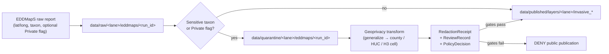
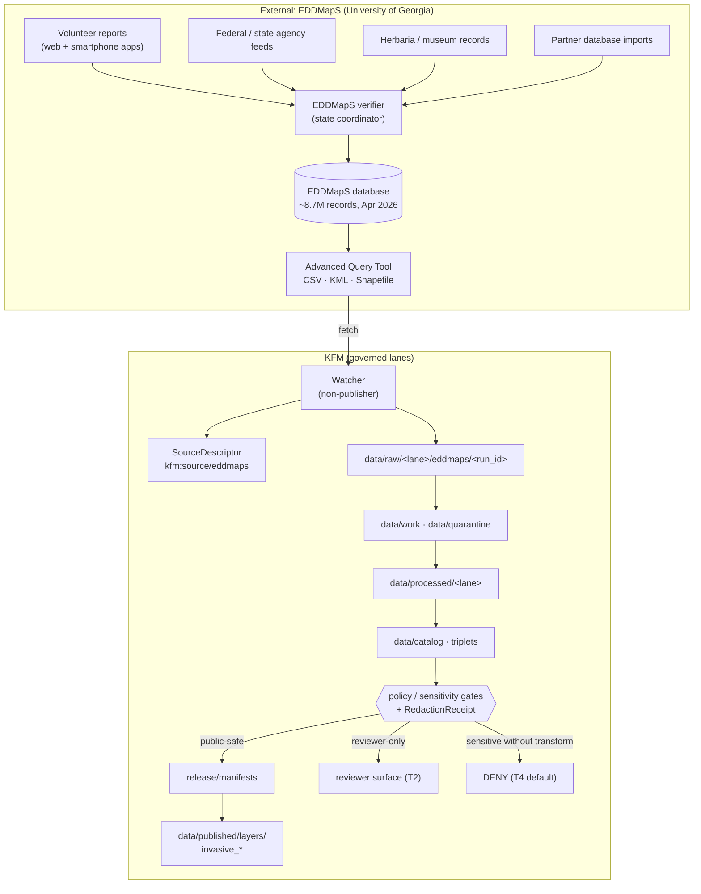

<!-- [KFM_META_BLOCK_V2]
doc_id: kfm://doc/source-catalog-eddmaps
title: Source Catalog — EDDMapS (Early Detection & Distribution Mapping System)
type: standard
version: v0.1
status: draft
owners: <kfm-source-stewards@TBD> · domain liaison: <flora-steward@TBD> + <fauna-steward@TBD>
created: 2026-05-20
updated: 2026-05-20
policy_label: public
related:
  - docs/sources/README.md                                 # PROPOSED — NEEDS VERIFICATION
  - docs/domains/flora/README.md                           # PROPOSED — NEEDS VERIFICATION
  - docs/domains/fauna/README.md                           # PROPOSED — NEEDS VERIFICATION
  - docs/standards/PROV.md                                 # CONFIRMED authored (prior session)
  - docs/standards/ISO-19115.md                            # CONFIRMED authored (prior session)
  - docs/runbooks/fauna/SOURCE_REFRESH_RUNBOOK.md          # CONFIRMED authored (prior session)
  - control_plane/source_authority_register.yaml          # PROPOSED — NEEDS VERIFICATION
  - schemas/contracts/v1/source/source-descriptor.json     # PROPOSED per ADR-0001
tags: [kfm, source-catalog, fauna, flora, invasive-species, sensitive-geometry, geoprivacy]
notes:
  - Placement (docs/sources/catalog/) is PROPOSED. The Directory Rules §6.1 tree lists
    docs/sources/ as the home for "source-descriptor standards, source families" but
    does not lock a catalog/ subfolder convention. Treat as parallel to OPEN-DR-02
    (docs/runbooks/<domain>/ vs flat).
  - All EDDMapS-specific facts (publisher, history, formats, access, citation) are
    EXTERNAL and cited inline. All KFM treatment of EDDMapS is PROPOSED until
    mounted-repo evidence (schemas, registry, validators, policy bundles) is checked.
[/KFM_META_BLOCK_V2] -->

# EDDMapS — Source Catalog Entry

> A compact, governed source-reference card for the **Early Detection & Distribution Mapping System**, used by KFM Flora and Fauna lanes as a volunteer- and aggregator-fed observation source for invasive species and pests.

<!-- Badge row -->


-orange)

-informational)


**Status:** draft · **Owners:** `<kfm-source-stewards@TBD>` · **Updated:** 2026-05-20

---

## Quick jump

- [1. Identity](#1-identity)
- [2. KFM source role and lane fit](#2-kfm-source-role-and-lane-fit)
- [3. What this source provides](#3-what-this-source-provides)
- [4. Access and data formats](#4-access-and-data-formats)
- [5. Rights, license, citation](#5-rights-license-citation)
- [6. Sensitivity and geoprivacy posture](#6-sensitivity-and-geoprivacy-posture)
- [7. KFM lifecycle behavior (RAW → PUBLISHED)](#7-kfm-lifecycle-behavior-raw--published)
- [8. Field surface and normalization notes](#8-field-surface-and-normalization-notes)
- [9. Allowed and denied uses inside KFM](#9-allowed-and-denied-uses-inside-kfm)
- [10. Open questions and verification backlog](#10-open-questions-and-verification-backlog)
- [11. Related docs](#11-related-docs)
- [Appendix A — Source profile diagram](#appendix-a--source-profile-diagram)
- [Appendix B — External references consulted](#appendix-b--external-references-consulted)

---

## 1. Identity

| Field | Value | Label |
|---|---|---|
| KFM canonical id | `kfm:source/eddmaps` | **PROPOSED** — pending entry in `control_plane/source_authority_register.yaml` |
| Common name | EDDMapS | **EXTERNAL** |
| Long name | Early Detection & Distribution Mapping System | **EXTERNAL** |
| Publisher | Center for Invasive Species and Ecosystem Health, University of Georgia | **EXTERNAL** |
| Home URL | <https://www.eddmaps.org/> | **EXTERNAL** |
| Geographic scope | United States and Canada | **EXTERNAL** |
| Initial launch | 2005 | **EXTERNAL** |
| KFM lane(s) | Flora (`InvasivePlantRecord`); Fauna (`Invasive Species Record`) | **CONFIRMED doctrine** (lane ownership); **PROPOSED** (route binding) |
| KFM source family | "EDDMapS and invasive feeds" | **CONFIRMED** in atlas as a recognized source family |

EDDMapS is a web-based mapping system for documenting invasive species and pest distribution, launched in 2005 by the Center for Invasive Species and Ecosystem Health at the University of Georgia, and has since expanded to cover the entire US and Canada.  The platform was formerly known as the Bugwood Network and now documents all taxa — insects and arthropods, plants, diseases, and wildlife — including invasive species, pests, and biocontrol agents across the United States and Canada. 

> [!NOTE]
> **Identity scope.** This source catalog entry treats EDDMapS as a *single logical source* even though the platform aggregates upstream feeds (federal and state agencies, herbaria/museums, other databases, and individual contributors). Per **CONFIRMED** KFM doctrine, aggregated sources are admitted with their aggregator identity preserved; upstream re-attribution is a downstream catalog/triplet concern, not a SourceDescriptor-merge concern.

[↑ back to top](#eddmaps--source-catalog-entry)

---

## 2. KFM source role and lane fit

> **PROPOSED — source-role assignment.** EDDMapS is best modeled as a **mixed observation + aggregator** source with **verifier-gated** admission. The aggregator dimension applies because EDDMapS aggregates data from federal and state agencies, herbaria/museums, other databases, and from individual contributors.  The observation dimension applies because the platform also accepts direct volunteer field reports.

### Lane and object binding

| KFM lane | KFM object (CONFIRMED ownership) | EDDMapS contribution | Label |
|---|---|---|---|
| Flora | `InvasivePlantRecord` | Volunteer + agency + herbarium-sourced invasive-plant occurrences | **PROPOSED** binding |
| Flora | `Flora Occurrence` (public/restricted variants) | Subset where source role permits | **PROPOSED** binding |
| Fauna | `Invasive Species Record` | Volunteer + agency-sourced invasive-animal/pest occurrences | **PROPOSED** binding |
| Fauna | `Occurrence Restricted` / `Occurrence Public` | Per geoprivacy transform and EDDMapS "Private" flag | **PROPOSED** binding |

### Source-role field surface

Per Directory Rules §24.1.3 (PROPOSED descriptor surface) and per the canonical `SourceDescriptor` schema-home convention (`schemas/contracts/v1/source/source-descriptor.json` per **ADR-0001**), EDDMapS would set:

```yaml
# PROPOSED — illustrative; field names NEEDS VERIFICATION against the mounted
# source_descriptor.schema.json (KFM-P28-PROG-0012).
source_id: kfm:source/eddmaps
source_role: observed              # primary; aggregator role recorded as secondary annotation
role_authority: "Center for Invasive Species and Ecosystem Health, University of Georgia"
access_method: download            # CSV / KML / Shapefile from Advanced Query Tool
cadence: continuous                # verifier-gated; no fixed release schedule
rights_posture: NEEDS_VERIFICATION # see §5
sensitivity_default: T4            # see §6; downgraded by allowed transforms
public_release_class: restricted   # default until per-taxon review
kfm_spec_hash: <pending JCS+SHA-256>
```

> [!IMPORTANT]
> **EDDMapS verifier review ≠ KFM steward verification.** EDDMapS only exposes records that have been reviewed by a verifier or have entered the database as expert data,  but inside KFM that upstream review is **candidate evidence**, not catalog truth. KFM gates (`validate`, `policy`, `EvidenceBundle`, `release`) still apply.

[↑ back to top](#eddmaps--source-catalog-entry)

---

## 3. What this source provides

### Coverage and scale

- **Taxa:** invasive plants, insects/arthropods, diseases/fungi, vertebrate and invertebrate wildlife, plus some native pest species and biological-control agents. As of April 2026, EDDMapS reports holding more than 8.7 million records.  Coverage has expanded beyond the original southeast US focus to include the entire US and Canada and to document certain native pest species. 
- **Geography:** continental US and Canada; forty US states and four Canadian provinces have active EDDMapS programs. 
- **Reporters:** volunteers, agency field staff, land managers, researchers; smartphone apps and a web form are the canonical entry surfaces.
- **Kansas relevance:** EDDMapS maintains state-scoped species lists for Kansas, including a Kansas EDDMapS One List and a Kansas Noxious Weeds list. (**EXTERNAL** — see <https://www.eddmaps.org/lists/state.cfm?id=us_ks>, document 29.)

### Record content (illustrative, not authoritative)

A typical EDDMapS record includes reporter identity, observation date, location (lat/long entered as decimal degrees in NAD83 or WGS84, with state and county fields), species, plant description, ownership/landowner category, optional photo(s), and optional voucher/herbarium specimen reference. (**EXTERNAL** — see documents 20, 32.)

[↑ back to top](#eddmaps--source-catalog-entry)

---

## 4. Access and data formats

### Read paths

| Surface | Format | Auth | Bulk-friendly | Notes | Label |
|---|---|---|---|---|---|
| Web Advanced Query Tool | CSV, KML, Shapefile (zipped) | EDDMapS account | Up to ~200,000 records | The advanced query tool allows downloading the publicly available data set as CSV, KML, or Shapefile; results over 200,000 records require contacting Rebekah D. Wallace at bekahwal@uga.edu.  | **EXTERNAL** |
| ArcGIS Hub partner site | ArcGIS Hub items | none (read) | varies | <https://eddmaps-data-usg.hub.arcgis.com/> (document 13) — surface and contents NEEDS VERIFICATION before use as a KFM connector | **EXTERNAL** (existence) / **NEEDS VERIFICATION** (KFM use) |
| Smartphone apps | report-side only | EDDMapS account | n/a | Report intake, not extraction; not a KFM read surface | **EXTERNAL** |
| Programmatic API (REST/OGC) | UNKNOWN | UNKNOWN | UNKNOWN | No first-party public-API page surfaced during research; **NEEDS VERIFICATION** | **UNKNOWN** |
| GBIF / DwC-A export | UNKNOWN | UNKNOWN | UNKNOWN | EDDMapS appearing in GBIF was not confirmed by an authoritative source during this pass; **NEEDS VERIFICATION** | **UNKNOWN** |

### Write paths (out of scope for KFM)

EDDMapS accepts user-side uploads in CSV, XLS/XLSX, KML/KMZ, and GIS/GDB file types. Data can be submitted through the My EDDMapS page via the Upload Data link; accepted file types are csv, xls/xlsx, kml/kmz, gbd, and gis files.  KFM **MUST NOT** write to EDDMapS; KFM is a downstream reader, not a contributor.

### Watcher contract (PROPOSED)

> [!NOTE]
> **PROPOSED watcher pattern.** A KFM EDDMapS watcher SHOULD record a `SourceDescriptor` plus per-query parameters (taxon, county, date window), capture ETag / Last-Modified equivalents where the platform exposes them, and emit a `SourceIntakeRecord` with retrieval time, query hash, and download checksum (see KFM-P28-PROG-0012 source_descriptor.schema.json). The watcher **MUST NOT** publish; per the Directory Rules watcher-as-non-publisher invariant, ingest goes to `data/raw/<flora|fauna>/eddmaps/<run_id>/` (PROPOSED path).

[↑ back to top](#eddmaps--source-catalog-entry)

---

## 5. Rights, license, citation

> [!CAUTION]
> **Rights posture for EDDMapS is NEEDS VERIFICATION.** A definitive terms-of-use / license page was not surfaced during this research pass. Until verified, KFM treats EDDMapS as **rights-NEEDS-VERIFICATION**, which under cite-or-abstain doctrine and §20.5 deny-by-default register means: **no public KFM release of EDDMapS-derived records** until rights are confirmed (per **CONFIRMED** ML-Q-080: unknown source rights block public promotion).

### What is publicly stated

- Only records that have been reviewed by a verifier or entered as expert data are available on maps and as downloads. 
- The data is made freely available to everyone, including scientists, researchers, land managers, land owners, educators, conservationists, ecologists, farmers, foresters, state and national parks. 
- "Freely available" is not a license name. KFM treats absence of an explicit license name as **NEEDS VERIFICATION**, not as a presumption of open license. Confirmation required before any KFM re-publication.

### Suggested citation (illustrative)

The widely used scholarly citation pattern names the platform, attributes the Center for Invasive Species and Ecosystem Health at the University of Georgia, and includes the website URL. (**EXTERNAL** — see USFS Treesearch listing for Bargeron et al. 2011, document 22.)

```text
EDDMapS. <YEAR>. Early Detection & Distribution Mapping System. The University of
Georgia — Center for Invasive Species and Ecosystem Health. Available online at
https://www.eddmaps.org/; last accessed <YYYY-MM-DD>.
```

> Use this only as an illustrative starting point. The authoritative citation form is whatever EDDMapS' current Terms / About page specifies at retrieval time. **NEEDS VERIFICATION** per query.

[↑ back to top](#eddmaps--source-catalog-entry)

---

## 6. Sensitivity and geoprivacy posture

### Tier assignment (PROPOSED)

Per KFM atlas §24.5.2 sensitivity matrix (**CONFIRMED doctrine**, **PROPOSED** field realization), EDDMapS-derived records intersect the most-restrictive lanes in two ways:

| Object class | Default tier | Allowed transforms | Required gates |
|---|---|---|---|
| EDDMapS report of a rare / culturally sensitive / protected plant at exact coordinate | **T4** | Generalization + `RedactionReceipt` → T1; ethnobotanical context governed | `RedactionReceipt` + `ReviewRecord` |
| EDDMapS report of a sensitive fauna occurrence (e.g., nest, den, roost, hibernaculum, spawning site) | **T4** | Geoprivacy generalization + `RedactionReceipt` → T1 | `RedactionReceipt` + `ReviewRecord` + `PolicyDecision` |
| EDDMapS report of a routine invasive plant or pest at non-sensitive landowner setting | **T1** (default) | Aggregation / county roll-up where geoprivacy demands it | `AggregationReceipt` *or* none if no transform required |

### "Private" flag handling

EDDMapS supports making certain data elements "Private" by contacting the site administrator, in order to accommodate confidentiality issues associated with public display of exact locations of certain regulated species.  A record arriving in KFM that carries an upstream "Private" indication **MUST** be admitted to `data/quarantine/...` and **MUST NOT** be promoted to a public KFM surface without a `RedactionReceipt`, `ReviewRecord`, and `PolicyDecision`.

> [!WARNING]
> **Style filters are not protection.** Per **CONFIRMED** ML-Q-082, MapLibre style filters MUST NOT be relied on to hide sensitive geometry. Sensitive EDDMapS records that are admitted at all are admitted **only** with geometry transformed at the data layer.

### Geoprivacy transform contract (illustrative)



> Diagram is **PROPOSED**; actual transform parameters (cell size, generalization scheme, per-taxon overrides) are not asserted here and remain `NEEDS VERIFICATION` against the mounted `policy/sensitivity/<lane>/` bundle.

[↑ back to top](#eddmaps--source-catalog-entry)

---

## 7. KFM lifecycle behavior (RAW → PUBLISHED)

Per **CONFIRMED doctrine** the EDDMapS source obeys the standard lifecycle invariant; **PROPOSED** application is as follows.

| Stage | Handling | Gate | KFM status |
|---|---|---|---|
| **RAW** | Watcher fetches Advanced Query Tool CSV / KML / Shapefile (or ArcGIS Hub asset). Immutable capture under `data/raw/<lane>/eddmaps/<run_id>/` with `SourceDescriptor`, retrieval time, query parameters, checksums. | `SourceDescriptor` exists; rights posture recorded (may be NEEDS_VERIFICATION) | **PROPOSED** |
| **WORK / QUARANTINE** | Normalize: schema → SourceDescriptor + candidate `InvasivePlantRecord` / `Invasive Species Record`; geometry → projected, validated; time → observed vs retrieval split; identity → taxon crosswalk; rights → propagated; "Private" or sensitive-taxon records routed to `quarantine/`. | Validation + policy gate pass, or quarantine reason recorded | **PROPOSED** |
| **PROCESSED** | Emit validated normalized objects with EvidenceRef; AggregationReceipt for any roll-up; RedactionReceipt for any geoprivacy transform. | `EvidenceRef`, `ValidationReport`, digest closure | **PROPOSED** |
| **CATALOG / TRIPLET** | STAC/DCAT/PROV catalog records; EvidenceBundles; graph projection (taxon, place, time); release candidate dossier. | Catalog/proof closure | **PROPOSED** |
| **PUBLISHED** | Public-safe invasive monitoring layer; species-level summary popups; aggregated invasive density layer. Restricted lanes serve through reviewer surface only. | `ReleaseManifest` + `PolicyDecision` + rollback target | **PROPOSED** |

> Promotion is a **governed state transition**, not a file move. A bytes-only copy from `raw/` to `published/` is a violation regardless of disk layout.

[↑ back to top](#eddmaps--source-catalog-entry)

---

## 8. Field surface and normalization notes

The mapping below is **PROPOSED** for the standard EDDMapS download surface (CSV/KML/Shapefile from the Advanced Query Tool). Exact column names from the EDDMapS export header are **NEEDS VERIFICATION** against a captured download.

| KFM field (target) | EDDMapS source (illustrative) | Notes | Label |
|---|---|---|---|
| `source_id` | constant `kfm:source/eddmaps` | n/a | **PROPOSED** |
| `source_record_id` | EDDMapS record/object id | preserve verbatim for round-trip | **PROPOSED** |
| `taxon_id` (canonical) | EDDMapS species code / scientific name | crosswalk via USDA PLANTS (Flora) or ITIS / GBIF (Fauna); see Flora intake doctrine for PLANTS authority | **PROPOSED** |
| `scientific_name` | EDDMapS scientificName | preserve verbatim; do not normalize away | **PROPOSED** |
| `observed_at` | EDDMapS observation date | timezone NEEDS VERIFICATION | **PROPOSED** |
| `retrieved_at` | watcher run time | KFM-side | **CONFIRMED** field, **PROPOSED** binding |
| `geometry` | EDDMapS lat/long (decimal degrees) | EDDMapS instructs reporters to set their GPS unit to NAD83 or WGS84 and to decimal degrees, with a negative sign before the longitude in the Western hemisphere  | **EXTERNAL** for source convention |
| `geometry_geoprivacy` | derived | absent in source; KFM derives per policy | **PROPOSED** |
| `state_admin` / `county_admin` | EDDMapS state / county fields | preserve for aggregate layers | **PROPOSED** |
| `reporter_authority` | EDDMapS user / verifier identity | KFM records authority, not personally identifying data; consult `policy/sensitivity/people/` before exposing reporter identities | **PROPOSED** |
| `upstream_verification_state` | EDDMapS verified vs. unverified flag | propagated as evidence annotation; **does not satisfy KFM gates** | **PROPOSED** |
| `media_refs` | EDDMapS photo URL(s) | rights NEEDS VERIFICATION; Bugwood Image Database has its own license terms | **NEEDS VERIFICATION** |
| `source_kfm_spec_hash` | computed (JCS+SHA-256) over the SourceDescriptor and per-run query parameters | n/a | **PROPOSED** |

> [!TIP]
> **Crosswalk caution.** Per **CONFIRMED** Flora doctrine, USDA PLANTS is the authoritative federal source for US plant checklist, state distribution, county distribution, symbol, and scientific-name fields in KFM flora intake. EDDMapS taxonomy should be **crosswalked to PLANTS**, not substituted for it. The same caution applies to the Fauna crosswalk (ITIS / GBIF), where EDDMapS provides observation evidence but does not provide taxonomic authority.

[↑ back to top](#eddmaps--source-catalog-entry)

---

## 9. Allowed and denied uses inside KFM

### Allowed (subject to gate closure)

- Public, county-level or HUC-level aggregated invasive-monitoring layers for non-sensitive taxa, with `AggregationReceipt`.
- Reviewer-only (T2) surfaces of full-resolution records under steward review.
- EvidenceBundle support for corroborating an `InvasivePlantRecord` or `Invasive Species Record` already grounded in a primary authority.
- Drift detection: comparing EDDMapS county-presence vs. USDA PLANTS county-presence (Flora) as a delta event candidate (cf. KFM-P29-IDEA-0004 "PLANTS taxon deltas as source events").
- Focus Mode citations explicitly attributing claims to EDDMapS as a source role (observed / aggregated, verifier-gated upstream) — never as a sovereign authority.

### Denied by default

- **DENY** — public exposure of EDDMapS records flagged "Private" upstream, in any form below county-level generalization.
- **DENY** — public exact-coordinate publication of any record whose taxon resolves to KFM Flora "Rare Plant Record" or Fauna "SensitiveSite" classes, regardless of upstream verification state.
- **DENY** — using EDDMapS as the **authoritative** source for taxonomic identity (use USDA PLANTS / ITIS / GBIF; EDDMapS is evidence, not authority).
- **DENY** — using EDDMapS as a regulatory source. Noxious-weed listing authority resides with the Kansas Department of Agriculture and other regulatory bodies; EDDMapS publishes a state list pointer but is not the regulator.
- **DENY** — using EDDMapS as an emergency-alert authority (per the cross-cutting hazards/alert boundary).
- **DENY** — AI summarization of EDDMapS records that have not passed the KFM EvidenceBundle + release gate. AI may summarize only released EvidenceBundles.

[↑ back to top](#eddmaps--source-catalog-entry)

---

## 10. Open questions and verification backlog

| # | Item | Evidence that would settle it | Status |
|---|---|---|---|
| Q1 | Exact text and version of the EDDMapS terms of use / data-use license. | Authoritative EDDMapS terms page (not surfaced during this pass) | **NEEDS VERIFICATION** |
| Q2 | Whether EDDMapS exposes a public REST or OGC API in addition to web download. | First-party developer documentation | **UNKNOWN** |
| Q3 | Whether EDDMapS data is published to GBIF as a DwC-A dataset (and if so, the dataset DOI and license). | GBIF dataset page; EDDMapS partner listing | **NEEDS VERIFICATION** |
| Q4 | The current Kansas state coordinator(s) and verifier(s), for steward-review escalation. | EDDMapS Kansas page (<https://www.eddmaps.org/lists/state.cfm?id=us_ks>) | **NEEDS VERIFICATION** |
| Q5 | Stable column / field schema of the Advanced Query Tool CSV / KML / Shapefile download. | A captured download and its header row | **NEEDS VERIFICATION** |
| Q6 | Exact list of taxa for which EDDMapS routinely applies the upstream "Private" generalization. | EDDMapS species-list metadata | **NEEDS VERIFICATION** |
| Q7 | Bugwood Image Database license that governs EDDMapS-attached photographs. | Bugwood license page | **NEEDS VERIFICATION** |
| Q8 | KFM-side schema home for the EDDMapS adapter / connector and the canonical `SourceDescriptor` instance file. | Mounted repo evidence; `control_plane/source_authority_register.yaml`; ADR-0001 confirmation. | **PROPOSED / NEEDS VERIFICATION** |
| Q9 | Placement convention for `docs/sources/catalog/` vs flat `docs/sources/`. | New ADR or `docs/sources/README.md` update | **OPEN** (parallel to §18 OPEN-DR-02) |

[↑ back to top](#eddmaps--source-catalog-entry)

---

## 11. Related docs

- [`docs/sources/README.md`](../README.md) — source-descriptor standards, source families (**PROPOSED** — NEEDS VERIFICATION)
- [`docs/domains/flora/README.md`](../../domains/flora/README.md) — Flora domain ownership of `InvasivePlantRecord` (**PROPOSED** — NEEDS VERIFICATION)
- [`docs/domains/fauna/README.md`](../../domains/fauna/README.md) — Fauna domain ownership of `Invasive Species Record` (**PROPOSED** — NEEDS VERIFICATION)
- [`docs/standards/PROV.md`](../../standards/PROV.md) — provenance standard profile (**CONFIRMED authored** prior session; naming variance vs `PROVENANCE.md` → OPEN-DR-01)
- [`docs/standards/ISO-19115.md`](../../standards/ISO-19115.md) — metadata standard profile (**CONFIRMED authored** prior session)
- [`docs/runbooks/fauna/SOURCE_REFRESH_RUNBOOK.md`](../../runbooks/fauna/SOURCE_REFRESH_RUNBOOK.md) — operational source-refresh runbook (**CONFIRMED authored** prior session)
- [`docs/adr/ADR-0001-schema-home.md`](../../adr/ADR-0001-schema-home.md) — schema-home rule for SourceDescriptor placement (**CONFIRMED** referenced in Directory Rules)
- `control_plane/source_authority_register.yaml` — register entry for `kfm:source/eddmaps` (**PROPOSED** — NEEDS VERIFICATION)
- `schemas/contracts/v1/source/source-descriptor.json` — SourceDescriptor schema home (**PROPOSED** path per ADR-0001; **NEEDS VERIFICATION**)

[↑ back to top](#eddmaps--source-catalog-entry)

---

## Appendix A — Source profile diagram



> Diagram is **PROPOSED** and reflects this catalog entry's design; route names, schema homes, and policy bundle ids remain `NEEDS VERIFICATION` against the mounted repo.

[↑ back to top](#eddmaps--source-catalog-entry)

---

## Appendix B — External references consulted

<details>
<summary><strong>Expand: EDDMapS reference URLs (all EXTERNAL)</strong></summary>

| # | URL | Used to inform |
|---|---|---|
| 1 | <https://www.eddmaps.org/about/> | Publisher identity, launch year, record-count claim (Apr 2026), aggregation model |
| 2 | <https://www.eddmaps.org/about/appropriate_data.cfm> | Verifier-gated public exposure of records |
| 3 | <https://www.eddmaps.org/about/collect_data.cfm> | Data aggregation and reporting workflow |
| 4 | <https://www.eddmaps.org/about/step_by_step.cfm> | Field surface (lat/long, GPS conventions, photos, voucher) |
| 5 | <https://www.eddmaps.org/tools/query/> | Advanced Query Tool; >200,000-record contact |
| 6 | <https://support.bugwood.org/eddmaps/download-eddmaps-records-advanced-query-tools> | CSV / KML / Shapefile download path |
| 7 | <https://www.eddmaps.org/project/usace/> | Active programs count; file-types accepted on upload |
| 8 | <https://wiki.bugwood.org/EDDMapS> | "Private" record handling; state coordinator role |
| 9 | <https://eddmaps-data-usg.hub.arcgis.com/> | ArcGIS Hub partner surface (existence noted; KFM use NEEDS VERIFICATION) |
| 10 | <https://www.eddmaps.org/lists/state.cfm?id=us_ks> | Kansas state lists pointer |
| 11 | <https://research.fs.usda.gov/treesearch/37561> | Scholarly citation pattern (Bargeron et al. 2011) |
| 12 | <https://extension.illinois.edu/blogs/everyday-environment/2026-04-02-community-reported-data-helps-eddmaps-inform-and-drive> | Aggregation source mix; native pest coverage |

</details>

---

### Footer

> [!NOTE]
> **Reviewer pointers.** Before promoting this entry from `status: draft` to `status: review`, please resolve Q1 (license) and Q8 (schema home), and verify that `docs/sources/catalog/` is the agreed placement (Q9). Without Q1 closed, EDDMapS-derived records remain blocked from public KFM release per **CONFIRMED** ML-Q-080.

---

**Related:** [Flora](../../domains/flora/README.md) · [Fauna](../../domains/fauna/README.md) · [PROV](../../standards/PROV.md) · [ISO-19115](../../standards/ISO-19115.md) · [Source-refresh runbook (fauna)](../../runbooks/fauna/SOURCE_REFRESH_RUNBOOK.md)

**Last updated:** 2026-05-20 · **Doc id:** `kfm://doc/source-catalog-eddmaps` · **Version:** v0.1

[↑ Back to top](#eddmaps--source-catalog-entry)
