<!-- [KFM_META_BLOCK_V2]
doc_id: kfm://doc/docs-sources-catalog-eddmaps-advanced-query-download
title: EDDMapS Advanced Query Tool
type: product-page
version: v0.2
status: draft
owners: <PLACEHOLDER — Docs steward + Source steward for eddmaps>
created: 2026-05-20
updated: 2026-05-21
policy_label: public
related:
  - docs/sources/catalog/eddmaps/README.md
  - docs/sources/catalog/README.md
  - docs/sources/catalog/eddmaps/IDENTITY.md
  - docs/sources/catalog/eddmaps/RIGHTS-AND-SENSITIVITY-MAP.md
  - docs/doctrine/directory-rules.md
  - docs/standards/STAC_KFM_PROFILE.md
  - docs/adr/ADR-0001-schema-home.md
tags: [kfm, docs, sources, catalog, eddmaps, fauna, flora, invasive]
notes:
  - "PROPOSED product-page scaffold; presentation lifted to standard v2."
  - "Most product-specific facts intentionally NEEDS VERIFICATION pending source admission."
[/KFM_META_BLOCK_V2] -->

<a id="top"></a>

# EDDMapS Advanced Query Tool

> Documentation page for the EDDMapS public **Advanced Query Tool** download surface as a candidate KFM source product. **Scaffold only — not yet admitted.**

<!-- Top-of-file badges (PLACEHOLDER targets; replace once Shields.io endpoints are pinned) -->


<!-- TODO: real Shields.io endpoints once owners and CI badges are decided. -->

**Status:** `PROPOSED` — scaffold only · **Family:** [`eddmaps`](./README.md) · **Owners:** `<PLACEHOLDER>` · **Last reviewed:** `2026-05-21`

> [!IMPORTANT]
> This page is a **product-level documentation scaffold** under `docs/sources/catalog/eddmaps/`. It does **not** create or amend any `SourceDescriptor`, policy decision, release manifest, or rights determination. Authority for those objects lives in their canonical roots ([§ Source authority](#source-authority)).

---

## Table of contents

- [Overview](#overview)
- [Source authority](#source-authority)
- [Product topology (PROPOSED)](#product-topology-proposed)
- [Catalog profiles used](#catalog-profiles-used)
- [Collection identity](#collection-identity)
- [Provenance fields](#provenance-fields)
- [Temporal handling](#temporal-handling)
- [Geometry and projection](#geometry-and-projection)
- [Rights and sensitivity](#rights-and-sensitivity)
- [Validation and catalog closure](#validation-and-catalog-closure)
- [Related contracts and schemas](#related-contracts-and-schemas)
- [Related connectors and pipelines](#related-connectors-and-pipelines)
- [Examples](#examples)
- [Open questions](#open-questions)
- [Related docs](#related-docs)

---

## Overview

`PROPOSED` scaffold. The **EDDMapS Advanced Query Tool** is documented here as the **web download surface** of the EDDMapS source family — a candidate biodiversity/invasive-species feed referenced by KFM doctrine under Fauna and Flora domain source families. `[DOM-FAUNA] [DOM-FLORA] [ENCY]`

> [!NOTE]
> The EDDMapS family is listed as a candidate source under Fauna `[DOM-FAUNA] [DOM-HF] [ENCY]` and is relevant to Flora as a plant-invasive feed. `CONFIRMED` doctrinal listing; **`NEEDS VERIFICATION`** for current endpoint, public dataset boundary, geographic coverage, refresh cadence, and operative terms of use.

| Attribute | Position |
|---|---|
| Scope (Kansas / national / continental) | `NEEDS VERIFICATION` |
| Refresh cadence | `NEEDS VERIFICATION` |
| Public download formats | `NEEDS VERIFICATION` *(scaffold currently positions CSV / KML / zipped Shapefile)* |
| Current endpoint URL | `NEEDS VERIFICATION` — pin via SourceDescriptor only |
| Rights / terms-of-use status | `NEEDS VERIFICATION` — see [§ Rights and sensitivity](#rights-and-sensitivity) |
| License classification | `UNKNOWN` |
| Source role *(KFM source-role vocabulary)* | `PROPOSED` — likely `observation` or `aggregate`; pin in descriptor |

[↑ back to top](#top)

---

## Source authority

> [!IMPORTANT]
> The **authoritative SourceDescriptor** for any EDDMapS product is owned in [`data/registry/sources/`](../../../../data/registry/sources/) (`PROPOSED` registry home consistent with Directory Rules). **Do not duplicate descriptor fields here.** This page references the descriptor; it does not author one.

`CONFIRMED` doctrine (KFM-P1-PROG-0007): every admitted source has a descriptor that records identity, role, rights posture, update cadence, authority scope, and verification obligations. `NEEDS VERIFICATION`: the actual EDDMapS descriptor file path, fields, and schema-home compatibility.

[↑ back to top](#top)

---

## Product topology (PROPOSED)

A documentation-level view of how this product is expected to flow through KFM lifecycle phases. `PROPOSED` per Directory Rules §5; **no claim is made that any of these paths exist in the mounted repository.**

```mermaid
flowchart LR
    A["EDDMapS<br/>Advanced Query Tool<br/>(external web surface)"] -->|fetch| B["connectors/eddmaps/<br/><i>PROPOSED</i>"]
    B --> C["data/raw/&lt;domain&gt;/eddmaps/&lt;run_id&gt;/<br/><i>PROPOSED</i>"]
    C --> D["pipelines/ingest/<br/>pipelines/normalize/<br/>pipelines/validate/<br/><i>PROPOSED</i>"]
    D --> E["data/processed/&lt;domain&gt;/<br/><i>PROPOSED</i>"]
    E --> F["pipelines/catalog/<br/><i>PROPOSED</i>"]
    F --> G["data/catalog/stac/<br/>data/catalog/dcat/<br/>data/catalog/prov/<br/><i>PROPOSED</i>"]
    G --> H["EvidenceBundle +<br/>ReleaseManifest<br/><i>PROPOSED</i>"]
    H --> I["data/published/layers/<br/><i>PROPOSED</i>"]

    classDef ext fill:#fde7d4,stroke:#c87a3e,color:#202020
    classDef prop fill:#fff7d6,stroke:#b8941f,color:#202020
    class A ext
    class B,C,D,E,F,G,H,I prop
```



> [!NOTE]
> The diagram reflects **doctrinal lifecycle** (`RAW → WORK/QUARANTINE → PROCESSED → CATALOG/TRIPLET → PUBLISHED`), not verified repository content. Promotion between stages is a governed state transition, not a file move. `[DIRRULES] [ENCY]`

[↑ back to top](#top)

---

## Catalog profiles used

`PROPOSED` per-profile applicability. Mark Yes/No in the descriptor and during catalog closure (Pass-10 / KFM-P1-IDEA-0020).

| Profile | Default lane *(PROPOSED)* | Used by this product? | Notes |
|---|---|---|---|
| **STAC** | `data/catalog/stac/` | `NEEDS VERIFICATION` | Spatiotemporal occurrence items; pairs with DwC hybrid (C4-03). |
| **DCAT** | `data/catalog/dcat/` | `NEEDS VERIFICATION` | Dataset-level metadata; required at catalog closure. |
| **PROV-O** | `data/catalog/prov/` | `NEEDS VERIFICATION` | Lineage; resolves from `kfm:provenance`. |
| **Darwin Core hybrid (STAC × DwC)** | inside `data/catalog/stac/` properties | `NEEDS VERIFICATION` | `CONFIRMED` doctrine pattern (C4-03) for biodiversity occurrences. |
| **Domain projection** | `data/catalog/domain/<domain>/` | `NEEDS VERIFICATION` | Domain assignment may be Fauna, Flora, or both. |

[↑ back to top](#top)

---

## Collection identity

- `PROPOSED` Collection id pattern: `kfm-<org>-<product>` — see [`IDENTITY.md`](./IDENTITY.md).
- `PROPOSED` namespace: `kfm:` *(see open item `OPEN-DSC-03`; `kfm:` vs `ks-kfm:` is unsettled per C4-01 corpus note).*
- Asset roles: `NEEDS VERIFICATION` — confirm against `schemas/contracts/v1/source/` per ADR-0001.

> [!CAUTION]
> Collection ids are **stable handles**. Renaming a Collection breaks links throughout the catalog (C4-02). Pin the id only after a written namespace and id-pattern decision is recorded against an ADR or against the eddmaps family `IDENTITY.md`.

[↑ back to top](#top)

---

## Provenance fields

`CONFIRMED` shape per C4-01 (KFM Provenance Namespace): every STAC Item carries an `item.properties.kfm:provenance` block. `PROPOSED` realization for EDDMapS products.

| Field | Resolves to | Status |
|---|---|---|
| `spec_hash` | `sha256` of the canonical record (JCS/URDNA2015 canonicalization). | `CONFIRMED` shape |
| `evidence_bundle_ref` | `kfm://evidence/<digest>` → JSON-LD EvidenceBundle. | `CONFIRMED` shape |
| `run_record_ref` | `kfm://run/<run-id>` → run receipt. | `CONFIRMED` shape |
| `audit_ref` | `kfm://audit/<attestation-id>` → SLSA / OPA attestation. | `CONFIRMED` shape |
| `policy_digest` | `sha256` of the policy bundle used at promotion. | `CONFIRMED` shape |
| `file:checksum` *(per asset)* | Per-asset integrity (STAC `file` extension). | `CONFIRMED` shape |

`NEEDS VERIFICATION`: which of these are actually produced for EDDMapS items today, and whether the connector emits a node receipt aligning with KFM-P15-PROG-0030 (spec_hash + artifact digests + audit_ref wrapped in in-toto/SLSA predicates).

[↑ back to top](#top)

---

## Temporal handling

`PROPOSED` — keep the six time axes distinct where material; never collapse them in catalog records. `[DOM-FAUNA] [DOM-FLORA] [ENCY]`

| Time axis | Definition (working) | Status |
|---|---|---|
| `source_time` | When the source system says the record was originally observed/reported. | `PROPOSED` |
| `observed_time` | When the underlying field observation occurred. | `PROPOSED` |
| `valid_time` | The time interval the record is presented as valid for. | `PROPOSED` |
| `retrieval_time` | When KFM fetched the record. | `PROPOSED` |
| `release_time` | When KFM promoted the record to PUBLISHED. | `PROPOSED` |
| `correction_time` | When a CorrectionNotice changed this record. | `PROPOSED` |

> [!NOTE]
> `NEEDS VERIFICATION` per product: which of the six axes EDDMapS exposes, and which KFM derives. Default posture: capture whatever the source exposes verbatim; do not synthesize missing axes.

[↑ back to top](#top)

---

## Geometry and projection

`PROPOSED` — confirm CRS, generalization rules, and scale support against `data/catalog/` artifacts and STAC Projection lint (KFM-P27-FEAT-0003). `NEEDS VERIFICATION`.

- Native CRS as published by EDDMapS: `NEEDS VERIFICATION`
- KFM canonical CRS for ingest: `NEEDS VERIFICATION` (default candidate: EPSG:4326)
- Generalization / public-safe geometry rule: `NEEDS VERIFICATION` (deny-default for sensitive taxa per Fauna / Flora doctrine)
- STAC Projection extension fields (`proj:code`, `proj:bbox`, `proj:geometry`, `proj:shape`, `proj:transform`): subject to **lint report compliance** (KFM-P27-FEAT-0003).

[↑ back to top](#top)

---

## Rights and sensitivity

> [!WARNING]
> **Do not restate policy on this page.** Rights and sensitivity authority lives in [`policy/sensitivity/`](../../../../policy/sensitivity/) and is summarized in the eddmaps family [`RIGHTS-AND-SENSITIVITY-MAP.md`](./RIGHTS-AND-SENSITIVITY-MAP.md). This page only **points to** those authorities.

`NEEDS VERIFICATION`:

- Rights status of EDDMapS public records (license terms, attribution requirements, redistribution constraints).
- **CARE applicability** for any culturally sensitive taxa or Indigenous-knowledge-derived occurrences.
- **Sensitive-species lane**: occurrence records for rare or persecution-vulnerable taxa **deny by default** at the public surface (Fauna / Flora sensitivity doctrine). `[DOM-FAUNA] [DOM-FLORA] [ENCY]`
- **Geoprivacy transform**: required generalization for sensitive taxa pre-publication.

> [!IMPORTANT]
> Unclear rights, unresolved source role, missing evidence, unresolved sensitivity, or absent release state **blocks public promotion**. `[ENCY] [DIRRULES]` Default-deny is the correct posture until the descriptor + policy decisions exist.

[↑ back to top](#top)

---

## Validation and catalog closure

`PROPOSED` validator surface for this product. Closure required before any public release (Pass-10 / KFM-P1-IDEA-0020).

| Gate | Reference | Status |
|---|---|---|
| Source descriptor present and validated | KFM-P1-PROG-0007 | `PROPOSED` |
| Source-role correctly typed (observation / aggregate / etc.) | KFM source-role vocabulary | `PROPOSED` |
| Rights bundle resolved (license, terms, attribution) | Policy gate | `PROPOSED` |
| Sensitivity tier assigned | `policy/sensitivity/` | `PROPOSED` |
| STAC Projection lint pass | KFM-P27-FEAT-0003 | `PROPOSED` |
| STAC checksum closure against ReleaseManifest digest | KFM-P22-PROG-0037 | `PROPOSED` |
| EvidenceBundle resolves from `kfm:provenance.evidence_bundle_ref` | C4-04 | `PROPOSED` |
| Catalog closure (DCAT / STAC / PROV) | Pass-10 / KFM-P1-IDEA-0020 | `PROPOSED` |
| Audit reference in gate outcome | KFM-P22-PROG-0049 | `PROPOSED` |

[↑ back to top](#top)

---

## Related contracts and schemas

- `contracts/eddmaps/` — semantic contract for EDDMapS object meaning. `NEEDS VERIFICATION`.
- `schemas/contracts/v1/source/source-descriptor.json` — default home per ADR-0001 / Directory Rules §6.4. `NEEDS VERIFICATION`: actual file presence.
- `schemas/contracts/v1/biodiversity/` *(or fauna/flora-specific subpath)* — consolidation home candidate for `OccurrenceEvidenceObject` per KFM-IDX-EVT-004 / KFM-P3-PROG-0001. `PROPOSED`.

[↑ back to top](#top)

---

## Related connectors and pipelines

- [`connectors/eddmaps/`](../../../../connectors/eddmaps/) — `PROPOSED` connector home.
- [`pipelines/ingest/`](../../../../pipelines/ingest/), [`pipelines/normalize/`](../../../../pipelines/normalize/), [`pipelines/validate/`](../../../../pipelines/validate/), [`pipelines/catalog/`](../../../../pipelines/catalog/), [`pipelines/watchers/`](../../../../pipelines/watchers/) — `PROPOSED` standard lanes.
- `pipeline_specs/<domain>/` — `PROPOSED`; domain assignment pending (Fauna and/or Flora).

[↑ back to top](#top)

---

## Examples

*(Illustrative only — not authoritative; do not treat the shapes below as proof of implementation.)*

<details>
<summary><strong>Minimal STAC Item with <code>kfm:provenance</code> (shape only)</strong></summary>

```json
{
  "type": "Feature",
  "stac_version": "1.0.0",
  "id": "kfm-eddmaps-advanced-query-<run_id>-<record_id>",
  "collection": "kfm-eddmaps-advanced-query",
  "geometry": { "type": "Point", "coordinates": [0, 0] },
  "bbox": [0, 0, 0, 0],
  "properties": {
    "datetime": "PROPOSED ISO-8601 observed_time",
    "kfm:provenance": {
      "spec_hash": "sha256:<JCS canonicalized record hash>",
      "evidence_bundle_ref": "kfm://evidence/<digest>",
      "run_record_ref": "kfm://run/<run-id>",
      "audit_ref": "kfm://audit/<attestation-id>",
      "policy_digest": "sha256:<policy-bundle-hash>"
    }
  },
  "assets": {
    "source_record": {
      "href": "PROPOSED — pin via SourceDescriptor",
      "type": "text/csv",
      "roles": ["data", "source"],
      "file:checksum": "1220<sha256-multihash>"
    }
  },
  "links": [
    { "rel": "self", "href": "./this-item.json" },
    { "rel": "collection", "href": "../collection.json" },
    { "rel": "attestation", "href": "kfm://evidence/<digest>" }
  ]
}
```

> [!CAUTION]
> Shape only. Field values are placeholders. The `attestation` link relation is `PROPOSED` per KFM-P7-PROG-0001 and is not a registered STAC `rel` value.

</details>

See also: [`../_examples/stac-item-example.json`](../_examples/stac-item-example.json) — sibling example asset; `NEEDS VERIFICATION` for presence.

[↑ back to top](#top)

---

## Open questions

| ID | Question | Disposition needed before |
|---|---|---|
| `OPEN-EDD-01` | Confirm current EDDMapS Advanced Query Tool endpoint URL and public dataset boundary. | RAW admission |
| `OPEN-EDD-02` | Confirm refresh cadence and material-change detection rules. | Watcher / RAW admission |
| `OPEN-EDD-03` | Confirm public download formats actually exposed (CSV / KML / Shapefile / others). | Connector design |
| `OPEN-EDD-04` | Confirm rights status, license text, attribution, redistribution terms. | Policy / public release |
| `OPEN-EDD-05` | Confirm CARE applicability for any culturally sensitive subset. | Policy / public release |
| `OPEN-EDD-06` | Decide source role: `observation` vs `aggregate` (or split into multiple descriptors). | Descriptor admission |
| `OPEN-EDD-07` | Decide whether EDDMapS warrants its own STAC Collection or shares one with sibling products in the family. | Catalog closure |
| `OPEN-EDD-08` | Decide Fauna vs Flora domain projection (or both) for cataloging. | Catalog closure |
| `OPEN-EDD-09` | Pin namespace choice (`kfm:` vs `ks-kfm:`) — coordinate with `OPEN-DSC-03`. | Catalog closure |
| `OPEN-EDD-10` | Decide sensitivity tier defaults; pin sensitive-species deny list intersect rule. | Policy / public release |

[↑ back to top](#top)

---

## Related docs

- [`./README.md`](./README.md) — eddmaps family overview
- [`./IDENTITY.md`](./IDENTITY.md) — eddmaps family Collection identity
- [`./RIGHTS-AND-SENSITIVITY-MAP.md`](./RIGHTS-AND-SENSITIVITY-MAP.md) — eddmaps family rights/sensitivity map
- [`../README.md`](../README.md) — sources catalog overview
- [`../../../doctrine/directory-rules.md`](../../../doctrine/directory-rules.md) — Directory Rules
- [`../../../standards/STAC_KFM_PROFILE.md`](../../../standards/STAC_KFM_PROFILE.md) — STAC × KFM provenance profile *(TODO: confirm path)*
- [`../../../adr/ADR-0001-schema-home.md`](../../../adr/ADR-0001-schema-home.md) — Schema home *(TODO: confirm filename)*

---

**Last reviewed:** `2026-05-21` *(Claude Code product-page polish pass; content stance unchanged.)*

[↑ back to top](#top)
