<!-- [KFM_META_BLOCK_V2]
doc_id: kfm://doc/docs-sources-catalog-eddmaps-invasive-species-observations
title: EDDMapS Invasive Species Records
type: product-page
version: v0.2
status: draft
owners: <PLACEHOLDER — Docs steward + Source steward for eddmaps>
created: 2026-05-20
updated: 2026-05-21
policy_label: public
related:
  - docs/sources/catalog/eddmaps/README.md
  - docs/sources/catalog/eddmaps/advanced-query-download.md
  - docs/sources/catalog/eddmaps/IDENTITY.md
  - docs/sources/catalog/eddmaps/RIGHTS-AND-SENSITIVITY-MAP.md
  - docs/sources/catalog/README.md
  - docs/doctrine/directory-rules.md
  - docs/standards/STAC_KFM_PROFILE.md
  - docs/adr/ADR-0001-schema-home.md
tags: [kfm, docs, sources, catalog, eddmaps, fauna, flora, invasive, observations]
notes:
  - "PROPOSED product-page scaffold; presentation lifted to standard v2."
  - "Most product-specific facts intentionally NEEDS VERIFICATION pending source admission."
  - "Sibling of advanced-query-download.md within the eddmaps family."
[/KFM_META_BLOCK_V2] -->

<a id="top"></a>

# EDDMapS Invasive Species Records

> Documentation page for **EDDMapS Invasive Species Records** — volunteer- and aggregator-fed observation records of invasive species and pests across the US and Canada — as a candidate KFM source product. **Scaffold only — not yet admitted.**

<!-- Top-of-file badges (PLACEHOLDER targets; replace once Shields.io endpoints are pinned) -->


<!-- TODO: real Shields.io endpoints once owners and CI badges are decided. -->

**Status:** `PROPOSED` — scaffold only · **Family:** [`eddmaps`](./README.md) · **Owners:** `<PLACEHOLDER>` · **Last reviewed:** `2026-05-21`

> [!IMPORTANT]
> This page is a **product-level documentation scaffold** under `docs/sources/catalog/eddmaps/`. It does **not** create or amend any `SourceDescriptor`, policy decision, release manifest, or rights determination. Authority for those objects lives in their canonical roots ([§ Source authority](#source-authority)).

---

## Table of contents

- [Overview](#overview)
- [Source authority](#source-authority)
- [Product topology (PROPOSED)](#product-topology-proposed)
- [Source role and anti-collapse note](#source-role-and-anti-collapse-note)
- [Catalog profiles used](#catalog-profiles-used)
- [Collection identity](#collection-identity)
- [Provenance fields](#provenance-fields)
- [Temporal handling](#temporal-handling)
- [Geometry and projection](#geometry-and-projection)
- [Rights and sensitivity](#rights-and-sensitivity)
- [Validation and catalog closure](#validation-and-catalog-closure)
- [Related contracts and schemas](#related-contracts-and-schemas)
- [Related connectors and pipelines](#related-connectors-and-pipelines)
- [Examples](#examples)
- [Open questions](#open-questions)
- [Related docs](#related-docs)

---

## Overview

`PROPOSED` scaffold. **EDDMapS Invasive Species Records** is the *record-level data product* of the EDDMapS source family — the actual occurrence rows of invasive species and pests, fed by volunteer field reporting and by aggregation of partner agency feeds across the US and Canada. EDDMapS appears as a candidate source family under Fauna domain doctrine `[DOM-FAUNA] [DOM-HF] [ENCY]` and is also relevant to Flora as a plant-invasive feed.

> [!NOTE]
> This page documents **the records** (observation data). The **web download surface** that exposes those records is documented separately in [`advanced-query-download.md`](./advanced-query-download.md). They share a SourceDescriptor family but are distinct product pages.

| Attribute | Position |
|---|---|
| Geographic scope | `PROPOSED` — US + Canada (per source family description); coverage map and bounding box `NEEDS VERIFICATION` |
| Domain projection | `PROPOSED` — Fauna **and** Flora (invasives span animal pests + plant invasives) |
| Observer / contributor types | `PROPOSED` — volunteers, citizen scientists, agency staff, aggregated partner programs; exact mix `NEEDS VERIFICATION` |
| Record granularity | `NEEDS VERIFICATION` — likely individual occurrence rows with taxon, date, location, observer attribution |
| Refresh cadence | `NEEDS VERIFICATION` — likely streaming/continuous with aggregator lag |
| Source role *(KFM source-role vocabulary)* | `PROPOSED` — `observation` (per-record) with `aggregate` posture at the aggregator boundary; see [§ Source role and anti-collapse note](#source-role-and-anti-collapse-note) |
| Rights / terms-of-use status | `NEEDS VERIFICATION` — see [§ Rights and sensitivity](#rights-and-sensitivity) |
| License classification | `UNKNOWN` |
| Sensitivity tier *(KFM T0–T4)* | `NEEDS VERIFICATION` — default-deny for any intersected sensitive-species lane |

[↑ back to top](#top)

---

## Source authority

> [!IMPORTANT]
> The **authoritative SourceDescriptor** for EDDMapS Invasive Species Records is owned in [`data/registry/sources/`](../../../../data/registry/sources/) (`PROPOSED` registry home consistent with Directory Rules). **Do not duplicate descriptor fields here.** This page references the descriptor; it does not author one.

`CONFIRMED` doctrine (KFM-P1-PROG-0007): every admitted source has a descriptor that records identity, role, rights posture, update cadence, authority scope, and verification obligations. `CONFIRMED` doctrine (KFM-IDX-SRC-002): `source_role` is a closed vocabulary; `source_family` for these records is `eddmaps` per the `OccurrenceEvidenceObject` source-family enum used in the corpus.

`NEEDS VERIFICATION`: the actual EDDMapS Invasive Species Records descriptor file path, fields, and schema-home compatibility against `schemas/contracts/v1/source/source-descriptor.json` per ADR-0001.

[↑ back to top](#top)

---

## Product topology (PROPOSED)

A documentation-level view of how these records are expected to flow through KFM lifecycle phases. `PROPOSED` per Directory Rules §5; **no claim is made that any of these paths exist in the mounted repository.**

```mermaid
flowchart LR
    V["Volunteers /<br/>citizen scientists"] --> A
    P["Aggregated partner<br/>programs / agencies"] --> A
    A["EDDMapS<br/>Invasive Species Records<br/>(external aggregator)"] -->|fetch via watcher| B["connectors/eddmaps/<br/><i>PROPOSED</i>"]
    B --> C["data/raw/&lt;domain&gt;/eddmaps/&lt;run_id&gt;/<br/><i>PROPOSED</i>"]
    C -->|policy / rights / sensitivity gate| Q["data/quarantine/&lt;domain&gt;/&lt;reason&gt;/<br/><i>PROPOSED</i>"]
    C --> D["pipelines/ingest/<br/>pipelines/normalize/<br/>pipelines/validate/<br/><i>PROPOSED</i>"]
    D --> E["data/processed/&lt;domain&gt;/<br/>OccurrenceEvidenceObject<br/><i>PROPOSED</i>"]
    E --> F["pipelines/catalog/<br/><i>PROPOSED</i>"]
    F --> G["data/catalog/stac/ (DwC hybrid)<br/>data/catalog/dcat/<br/>data/catalog/prov/<br/><i>PROPOSED</i>"]
    G --> H["EvidenceBundle +<br/>ReleaseManifest<br/><i>PROPOSED</i>"]
    H --> I["data/published/layers/<br/>Invasive monitoring public layer<br/><i>PROPOSED</i>"]

    classDef ext fill:#fde7d4,stroke:#c87a3e,color:#202020
    classDef contrib fill:#e6f0ff,stroke:#3e6dc8,color:#202020
    classDef prop fill:#fff7d6,stroke:#b8941f,color:#202020
    classDef quar fill:#ffd6d6,stroke:#b83030,color:#202020
    class A ext
    class V,P contrib
    class B,C,D,E,F,G,H,I prop
    class Q quar
```



> [!NOTE]
> The diagram reflects **doctrinal lifecycle** (`RAW → WORK/QUARANTINE → PROCESSED → CATALOG/TRIPLET → PUBLISHED`), not verified repository content. Promotion between stages is a governed state transition, not a file move. `[DIRRULES] [ENCY]` The QUARANTINE branch is shown because volunteer-fed records with unresolved rights, sensitivity, or identity issues fail closed pending steward review.

[↑ back to top](#top)

---

## Source role and anti-collapse note

> [!WARNING]
> EDDMapS Invasive Species Records carry a **two-layer source-role risk**: each row is an `observation` (the underlying field sighting) wrapped in `aggregate` posture at the aggregator boundary (EDDMapS as ingester of many partner feeds). The KFM doctrine explicitly forbids `source-role upgrade` by paraphrase — quoting an aggregate as a per-place fact, or stripping the aggregator's role from a citation. `[GAI] [DIRRULES]`

| Layer | Source role | Why it matters |
|---|---|---|
| Underlying field sighting | `observation` | The observer (volunteer, agency staff) saw the species at a place and time. |
| Aggregator framing | `aggregate` (in some contexts) | EDDMapS as a national aggregator may apply normalization, deduplication, and quality flags that change the meaning of the underlying observation. |
| AI / Focus Mode rendering | n/a — must **cite** both layers | A paraphrase that says "X is established at location Y" without naming the aggregator and the observer commits the role-collapse violation. |

`PROPOSED` posture: the descriptor sets `source_role=observation` at the row level and records the aggregator in a `role_authority` field where applicable. `NEEDS VERIFICATION`: actual descriptor field choices.

[↑ back to top](#top)

---

## Catalog profiles used

`PROPOSED` per-profile applicability. Mark Yes/No in the descriptor and during catalog closure (Pass-10 / KFM-P1-IDEA-0020).

| Profile | Default lane *(PROPOSED)* | Used by this product? | Notes |
|---|---|---|---|
| **STAC** | `data/catalog/stac/` | `PROPOSED — Yes` | Occurrence-level items; pairs with DwC hybrid. |
| **STAC × Darwin Core hybrid** | inside `data/catalog/stac/` properties | `PROPOSED — Yes` | `CONFIRMED` doctrine pattern (C4-03) for biodiversity occurrences. |
| **DCAT** | `data/catalog/dcat/` | `PROPOSED — Yes` | Dataset-level metadata; required at catalog closure. |
| **PROV-O** | `data/catalog/prov/` | `PROPOSED — Yes` | Lineage; resolves from `kfm:provenance`. |
| **Domain projection (Fauna)** | `data/catalog/domain/fauna/` | `NEEDS VERIFICATION` | Animal-invasive subset. |
| **Domain projection (Flora)** | `data/catalog/domain/flora/` | `NEEDS VERIFICATION` | Plant-invasive subset. |

> [!NOTE]
> The Fauna/Flora split is `PROPOSED`. Whether the records are projected into one combined domain folder or two (with a taxonomic-class split) is an open catalog-closure decision (`OPEN-EDD-ISR-08`).

[↑ back to top](#top)

---

## Collection identity

- `PROPOSED` Collection id pattern: `kfm-<org>-<product>` — see [`IDENTITY.md`](./IDENTITY.md).
- `PROPOSED` namespace: `kfm:` *(see family open item `OPEN-DSC-03`; `kfm:` vs `ks-kfm:` is unsettled per C4-01 corpus note).*
- Asset roles: `NEEDS VERIFICATION` — confirm against `schemas/contracts/v1/source/` per ADR-0001.

> [!CAUTION]
> Collection ids are **stable handles**. Renaming a Collection breaks links throughout the catalog (C4-02). Pin the id only after a written namespace and id-pattern decision is recorded against an ADR or against the eddmaps family `IDENTITY.md`.

[↑ back to top](#top)

---

## Provenance fields

`CONFIRMED` shape per C4-01 (KFM Provenance Namespace): every STAC Item carries an `item.properties.kfm:provenance` block. `PROPOSED` realization for EDDMapS Invasive Species Records.

| Field | Resolves to | Status |
|---|---|---|
| `spec_hash` | `sha256` of the canonical record (JCS/URDNA2015 canonicalization). | `CONFIRMED` shape |
| `evidence_bundle_ref` | `kfm://evidence/<digest>` → JSON-LD EvidenceBundle. | `CONFIRMED` shape |
| `run_record_ref` | `kfm://run/<run-id>` → run receipt. | `CONFIRMED` shape |
| `audit_ref` | `kfm://audit/<attestation-id>` → SLSA / OPA attestation. | `CONFIRMED` shape |
| `policy_digest` | `sha256` of the policy bundle used at promotion. | `CONFIRMED` shape |
| `file:checksum` *(per asset)* | Per-asset integrity (STAC `file` extension). | `CONFIRMED` shape |

Because these records are biodiversity occurrences, the catalog item is `CONFIRMED` doctrinally expected to also carry the `OccurrenceEvidenceObject` shape (KFM-P3-PROG-0001): `object_type=occurrence_evidence`, `source_record_id`, `source_family=eddmaps`, `source_role`, `taxon`, `observation`, `geometry`, `rights`, `sensitivity`, `provenance`, `validation`. `NEEDS VERIFICATION`: actual schema-home (corpus notes the consolidation under `schemas/contracts/v1/biodiversity/` is a near-term task; current home `schemas/occurrence_evidence/` is doctrinally inferior).

[↑ back to top](#top)

---

## Temporal handling

`PROPOSED` — keep the six time axes distinct where material; never collapse them in catalog records. `[DOM-FAUNA] [DOM-FLORA] [ENCY]`

| Time axis | Definition (working) | Status |
|---|---|---|
| `source_time` | When the EDDMapS aggregator says the record was first reported. | `PROPOSED` |
| `observed_time` | When the field observer actually saw the species (`event_date`). | `PROPOSED` |
| `valid_time` | The time interval the record is presented as valid for (often == observed). | `PROPOSED` |
| `retrieval_time` | When KFM fetched the record. | `PROPOSED` |
| `release_time` | When KFM promoted the record to PUBLISHED. | `PROPOSED` |
| `correction_time` | When a CorrectionNotice changed this record. | `PROPOSED` |

> [!NOTE]
> Volunteer-fed records frequently have a meaningful gap between `observed_time` and `source_time` (delayed reporting). The catalog SHOULD preserve both. `NEEDS VERIFICATION`: which axes EDDMapS exposes natively and which KFM derives.

[↑ back to top](#top)

---

## Geometry and projection

`PROPOSED` — confirm CRS, generalization rules, and scale support against `data/catalog/` artifacts and STAC Projection lint (KFM-P27-FEAT-0003). `NEEDS VERIFICATION`.

- Native CRS as published by EDDMapS: `NEEDS VERIFICATION`
- KFM canonical CRS for ingest: `NEEDS VERIFICATION` (default candidate: EPSG:4326)
- `precision_class` (per `OccurrenceEvidenceObject`): `NEEDS VERIFICATION` — record-level precision varies by submitter device and reporting policy.
- `geoprivacy_status` + `public_safe_geometry`: required where sensitivity rules apply. `PROPOSED` — invasives are *generally* public-encouraged (rapid response, biosecurity), but submitter-on-private-land and sensitive-host-species cases require generalization. `NEEDS VERIFICATION`.
- STAC Projection extension fields (`proj:code`, `proj:bbox`, `proj:geometry`, `proj:shape`, `proj:transform`): subject to **lint report compliance** (KFM-P27-FEAT-0003).

[↑ back to top](#top)

---

## Rights and sensitivity

> [!WARNING]
> **Do not restate policy on this page.** Rights and sensitivity authority lives in [`policy/sensitivity/`](../../../../policy/sensitivity/) and is summarized in the eddmaps family [`RIGHTS-AND-SENSITIVITY-MAP.md`](./RIGHTS-AND-SENSITIVITY-MAP.md). This page only **points to** those authorities.

`NEEDS VERIFICATION`:

- **Rights status** of EDDMapS records: license terms, attribution requirements (volunteer credit), redistribution constraints, downstream-derivative policy.
- **Submitter consent** posture: what volunteers agreed to at submission time, and how that flows into KFM rights bundles.
- **CARE applicability** where Indigenous-knowledge-derived sightings or culturally sensitive taxa appear.
- **Sensitive-species lane**: occurrence records for taxa with persecution risk, host-species exposure risk, or land-access sensitivity **deny by default** at the public surface. `[DOM-FAUNA] [DOM-FLORA] [ENCY]`
- **Geoprivacy transform** rules: invasives default to *public-encouraged*, but the rule must be evaluated per taxon and per submitter context, never blanket-applied.

> [!IMPORTANT]
> Unclear rights, unresolved source role, missing evidence, unresolved sensitivity, or absent release state **blocks public promotion**. `[ENCY] [DIRRULES]` Default-deny is the correct posture until the descriptor + policy decisions exist. The "invasives are public" intuition is **not** an automatic policy decision.

[↑ back to top](#top)

---

## Validation and catalog closure

`PROPOSED` validator surface for this product. Closure required before any public release (Pass-10 / KFM-P1-IDEA-0020).

| Gate | Reference | Status |
|---|---|---|
| Source descriptor present and validated | KFM-P1-PROG-0007 | `PROPOSED` |
| Source-role correctly typed (observation + aggregator framing) | KFM-IDX-SRC-002 | `PROPOSED` |
| `OccurrenceEvidenceObject` shape conforms | KFM-P3-PROG-0001 | `PROPOSED` |
| Taxon resolution against backbone (ITIS / GBIF) | C7-06 / C7-07 | `PROPOSED` |
| Rights bundle resolved (license, terms, attribution, submitter consent) | Policy gate | `PROPOSED` |
| Sensitivity tier assigned per taxon × jurisdiction | `policy/sensitivity/` | `PROPOSED` |
| `geoprivacy_status` and `public_safe_geometry` populated where required | Fauna / Flora sensitivity doctrine | `PROPOSED` |
| STAC Projection lint pass | KFM-P27-FEAT-0003 | `PROPOSED` |
| STAC checksum closure against ReleaseManifest digest | KFM-P22-PROG-0037 | `PROPOSED` |
| EvidenceBundle resolves from `kfm:provenance.evidence_bundle_ref` | C4-04 | `PROPOSED` |
| Catalog closure (DCAT / STAC / PROV / DwC hybrid) | Pass-10 / KFM-P1-IDEA-0020 | `PROPOSED` |
| Audit reference in gate outcome | KFM-P22-PROG-0049 | `PROPOSED` |

[↑ back to top](#top)

---

## Related contracts and schemas

- `contracts/eddmaps/` — semantic contract for EDDMapS object meaning. `NEEDS VERIFICATION`.
- `schemas/contracts/v1/source/source-descriptor.json` — default home per ADR-0001 / Directory Rules §6.4. `NEEDS VERIFICATION`: actual file presence.
- `schemas/contracts/v1/biodiversity/` *(or fauna/flora-specific subpath)* — consolidation home candidate for `OccurrenceEvidenceObject` per KFM-IDX-EVT-004 / KFM-P3-PROG-0001. `PROPOSED`.
- `contracts/fauna/`, `contracts/flora/` — domain-side contract surfaces these records feed into. `NEEDS VERIFICATION`.

[↑ back to top](#top)

---

## Related connectors and pipelines

- [`connectors/eddmaps/`](../../../../connectors/eddmaps/) — `PROPOSED` connector home.
- [`pipelines/ingest/`](../../../../pipelines/ingest/), [`pipelines/normalize/`](../../../../pipelines/normalize/), [`pipelines/validate/`](../../../../pipelines/validate/), [`pipelines/catalog/`](../../../../pipelines/catalog/), [`pipelines/watchers/`](../../../../pipelines/watchers/) — `PROPOSED` standard lanes.
- `pipeline_specs/fauna/` and `pipeline_specs/flora/` — `PROPOSED`; domain assignment pending.

[↑ back to top](#top)

---

## Examples

*(Illustrative only — not authoritative; do not treat the shapes below as proof of implementation.)*

<details>
<summary><strong>Minimal STAC × DwC Item with <code>kfm:provenance</code> (shape only)</strong></summary>

```json
{
  "type": "Feature",
  "stac_version": "1.0.0",
  "id": "kfm-eddmaps-invasive-<run_id>-<record_id>",
  "collection": "kfm-eddmaps-invasive-species",
  "geometry": { "type": "Point", "coordinates": [0, 0] },
  "bbox": [0, 0, 0, 0],
  "properties": {
    "datetime": "PROPOSED ISO-8601 observed_time",
    "taxon": {
      "scientific_name": "PROPOSED",
      "accepted_scientific_name": "PROPOSED — resolved via ITIS/GBIF backbone",
      "common_name": "PROPOSED",
      "taxon_rank": "PROPOSED"
    },
    "observation": {
      "event_date": "PROPOSED ISO-8601",
      "basis_of_record": "human_observation",
      "observation_method": "PROPOSED — e.g., photo, field_report",
      "observed_by": "PROPOSED — attribution per rights bundle"
    },
    "kfm:provenance": {
      "spec_hash": "sha256:<JCS canonicalized record hash>",
      "evidence_bundle_ref": "kfm://evidence/<digest>",
      "run_record_ref": "kfm://run/<run-id>",
      "audit_ref": "kfm://audit/<attestation-id>",
      "policy_digest": "sha256:<policy-bundle-hash>"
    }
  },
  "assets": {
    "source_record": {
      "href": "PROPOSED — pin via SourceDescriptor",
      "type": "application/json",
      "roles": ["data", "source"],
      "file:checksum": "1220<sha256-multihash>"
    }
  },
  "links": [
    { "rel": "self", "href": "./this-item.json" },
    { "rel": "collection", "href": "../collection.json" },
    { "rel": "attestation", "href": "kfm://evidence/<digest>" }
  ]
}
```

> [!CAUTION]
> Shape only. Field values are placeholders. The `attestation` link relation is `PROPOSED` per KFM-P7-PROG-0001 and is not a registered STAC `rel` value. The DwC `taxon` and `observation` blocks are illustrative of the STAC × DwC hybrid (C4-03).

</details>

See also: [`../_examples/stac-item-example.json`](../_examples/stac-item-example.json) — sibling example asset; `NEEDS VERIFICATION` for presence.

[↑ back to top](#top)

---

## Open questions

| ID | Question | Disposition needed before |
|---|---|---|
| `OPEN-EDD-ISR-01` | Confirm current EDDMapS Invasive Species Records endpoint(s) and public-record boundary (which subsets are public vs partner-restricted). | RAW admission |
| `OPEN-EDD-ISR-02` | Confirm refresh cadence and material-change detection (streaming vs batch; aggregator lag tolerance). | Watcher / RAW admission |
| `OPEN-EDD-ISR-03` | Confirm rights status, license text, attribution requirements, redistribution terms. | Policy / public release |
| `OPEN-EDD-ISR-04` | Confirm submitter consent posture — what volunteers agreed to and how that propagates into KFM rights bundles. | Policy / public release |
| `OPEN-EDD-ISR-05` | Confirm CARE applicability for any culturally sensitive taxa or Indigenous-knowledge-derived sightings. | Policy / public release |
| `OPEN-EDD-ISR-06` | Pin per-record `source_role` and aggregator `role_authority` field choices in the descriptor. | Descriptor admission |
| `OPEN-EDD-ISR-07` | Decide whether these records warrant a single STAC Collection or split by taxonomic class (Fauna / Flora). | Catalog closure |
| `OPEN-EDD-ISR-08` | Decide domain projection — combined or split into Fauna and Flora subfolders. | Catalog closure |
| `OPEN-EDD-ISR-09` | Pin sensitive-species deny list and per-taxon geoprivacy rules; document the "public-encouraged but not blanket" posture. | Policy / public release |
| `OPEN-EDD-ISR-10` | Pin namespace choice (`kfm:` vs `ks-kfm:`) — coordinate with family `OPEN-DSC-03`. | Catalog closure |
| `OPEN-EDD-ISR-11` | Decide taxon backbone authority for resolution (ITIS, GBIF, or both with crosswalk). | Validation / catalog closure |
| `OPEN-EDD-ISR-12` | Decide quarantine policy for records with unresolvable taxon, missing geometry, or rights ambiguity. | RAW admission |

[↑ back to top](#top)

---

## Related docs

- [`./README.md`](./README.md) — eddmaps family overview
- [`./advanced-query-download.md`](./advanced-query-download.md) — sibling product page (web download surface)
- [`./IDENTITY.md`](./IDENTITY.md) — eddmaps family Collection identity
- [`./RIGHTS-AND-SENSITIVITY-MAP.md`](./RIGHTS-AND-SENSITIVITY-MAP.md) — eddmaps family rights/sensitivity map
- [`../README.md`](../README.md) — sources catalog overview
- [`../../../doctrine/directory-rules.md`](../../../doctrine/directory-rules.md) — Directory Rules
- [`../../../standards/STAC_KFM_PROFILE.md`](../../../standards/STAC_KFM_PROFILE.md) — STAC × KFM provenance profile *(TODO: confirm path)*
- [`../../../adr/ADR-0001-schema-home.md`](../../../adr/ADR-0001-schema-home.md) — Schema home *(TODO: confirm filename)*

---

**Last reviewed:** `2026-05-21` *(Claude Code product-page polish pass; content stance unchanged.)*

[↑ back to top](#top)
