<!-- [KFM_META_BLOCK_V2]
doc_id: kfm://doc/docs-sources-catalog-eddmaps-state-species-lists
title: EDDMapS State Species Lists
type: product-page
version: v0.2
status: draft
owners: <PLACEHOLDER — Docs steward + Source steward for eddmaps>
created: 2026-05-20
updated: 2026-05-21
policy_label: public
related:
  - docs/sources/catalog/eddmaps/README.md
  - docs/sources/catalog/eddmaps/advanced-query-download.md
  - docs/sources/catalog/eddmaps/invasive-species-observations.md
  - docs/sources/catalog/eddmaps/IDENTITY.md
  - docs/sources/catalog/eddmaps/RIGHTS-AND-SENSITIVITY-MAP.md
  - docs/sources/catalog/README.md
  - docs/doctrine/directory-rules.md
  - docs/standards/STAC_KFM_PROFILE.md
  - docs/adr/ADR-0001-schema-home.md
tags: [kfm, docs, sources, catalog, eddmaps, fauna, flora, invasive, regulatory, administrative, kansas, checklist]
notes:
  - "PROPOSED product-page scaffold; presentation lifted to standard v2."
  - "Most product-specific facts intentionally NEEDS VERIFICATION pending source admission."
  - "Mixed source-role product: regulatory (Kansas Noxious Weeds) + administrative (Kansas EDDMapS One List)."
  - "Sibling of advanced-query-download.md and invasive-species-observations.md within the eddmaps family."
[/KFM_META_BLOCK_V2] -->

<a id="top"></a>

# EDDMapS State Species Lists

> Documentation page for **state-scoped species lists exposed through EDDMapS** — initially the **Kansas EDDMapS One List** (administrative compilation) and the **Kansas Noxious Weeds list** (state regulatory document) — as candidate KFM source products. **Scaffold only — not yet admitted.**

<!-- Top-of-file badges (PLACEHOLDER targets; replace once Shields.io endpoints are pinned) -->


<!-- TODO: real Shields.io endpoints once owners and CI badges are decided. -->

**Status:** `PROPOSED` — scaffold only · **Family:** [`eddmaps`](./README.md) · **Owners:** `<PLACEHOLDER>` · **Last reviewed:** `2026-05-21`

> [!IMPORTANT]
> This page is a **product-level documentation scaffold** under `docs/sources/catalog/eddmaps/`. It does **not** create or amend any `SourceDescriptor`, policy decision, release manifest, or rights determination. Authority for those objects lives in their canonical roots ([§ Source authority](#source-authority)).

> [!CAUTION]
> These products are **lists / checklists**, not occurrence observations. They tell you *which taxa appear on a regulatory or administrative list at the state level* — they do **not** prove any taxon is *present at a place*. Conflating the two is a doctrinal source-role violation. See [§ Source role and anti-collapse note](#source-role-and-anti-collapse-note).

---

## Table of contents

- [Overview](#overview)
- [Sub-products](#sub-products)
- [Source authority](#source-authority)
- [Product topology (PROPOSED)](#product-topology-proposed)
- [Source role and anti-collapse note](#source-role-and-anti-collapse-note)
- [Catalog profiles used](#catalog-profiles-used)
- [Collection identity](#collection-identity)
- [Provenance fields](#provenance-fields)
- [Temporal handling](#temporal-handling)
- [Geometry and projection](#geometry-and-projection)
- [Rights and sensitivity](#rights-and-sensitivity)
- [Validation and catalog closure](#validation-and-catalog-closure)
- [Related contracts and schemas](#related-contracts-and-schemas)
- [Related connectors and pipelines](#related-connectors-and-pipelines)
- [Examples](#examples)
- [Open questions](#open-questions)
- [Related docs](#related-docs)

---

## Overview

`PROPOSED` scaffold. **EDDMapS State Species Lists** is the *list-level data product* of the EDDMapS source family — state-scoped checklists of taxa that participating state agencies and partner programs have marked for prioritized attention. Two sub-products are in initial scope: the **Kansas EDDMapS One List** and the **Kansas Noxious Weeds list**.

| Attribute | Position |
|---|---|
| Geographic scope (initial) | `PROPOSED` — Kansas; product family **MAY** extend to other US states (`NEEDS VERIFICATION`) |
| Record granularity | `PROPOSED` — one row per taxon-on-list; state extent metadata; not point geometries |
| Domain projection | `PROPOSED` — **Fauna and Flora** (Noxious Weeds is plant-focused; One List may span both) |
| Refresh cadence | `NEEDS VERIFICATION` — list updates are episodic (regulatory amendment cycles + curator decisions) |
| Current endpoint URL(s) | `NEEDS VERIFICATION` — pin via SourceDescriptor only |
| Source role *(KFM source-role vocabulary)* | `PROPOSED` — **mixed**: `regulatory` (Noxious Weeds) + `administrative` (One List); see [§ Source role and anti-collapse note](#source-role-and-anti-collapse-note) |
| Rights / terms-of-use status | `NEEDS VERIFICATION` — see [§ Rights and sensitivity](#rights-and-sensitivity) |
| License classification | `UNKNOWN` — Kansas state government works posture pending verification |
| Sensitivity tier *(KFM T0–T4)* | `PROPOSED` — T0 (lists are inherently public regulatory transparency); confirm during admission |

[↑ back to top](#top)

---

## Sub-products

`PROPOSED` separation. Each sub-product **may** warrant its own SourceDescriptor and `role_authority` because the issuing authorities and source roles differ.

| Sub-product | Issuing authority *(PROPOSED)* | Source role | Nature | Status |
|---|---|---|---|---|
| **Kansas EDDMapS One List** | EDDMapS / Kansas state coordinators *(`role_authority` NEEDS VERIFICATION)* | `administrative` | Curated compilation of priority invasive taxa for Kansas reporting. | `PROPOSED` |
| **Kansas Noxious Weeds list** | Kansas Department of Agriculture *(`role_authority` NEEDS VERIFICATION)* | `regulatory` | State-issued legal designation under Kansas noxious-weed statutes. *(Statutory basis `NEEDS VERIFICATION`.)* | `PROPOSED` |
| *Future: other state lists* | various state agencies | `regulatory` / `administrative` mix | Out of initial scope. | `UNKNOWN` |

> [!IMPORTANT]
> `role_authority` is a **MUST-when-regulatory** descriptor field per KFM source-role doctrine. The Kansas Noxious Weeds list **cannot** be admitted without a pinned `role_authority` value that disambiguates the issuing agency.

[↑ back to top](#top)

---

## Source authority

> [!IMPORTANT]
> The **authoritative SourceDescriptor** for each sub-product is owned in [`data/registry/sources/`](../../../../data/registry/sources/) (`PROPOSED` registry home consistent with Directory Rules). **Do not duplicate descriptor fields here.** This page references the descriptor; it does not author one.

`CONFIRMED` doctrine (KFM-P1-PROG-0007): every admitted source has a descriptor that records identity, role, rights posture, update cadence, authority scope, and verification obligations. `CONFIRMED` doctrine (`role_authority` MUST when `source_role ∈ {regulatory, administrative, modeled, aggregate}`): both sub-products on this page require `role_authority`.

`NEEDS VERIFICATION`: actual descriptor file paths, fields, statutory citation handling, and schema-home compatibility against `schemas/contracts/v1/source/source-descriptor.json` per ADR-0001.

[↑ back to top](#top)

---

## Product topology (PROPOSED)

A documentation-level view of how these lists flow through KFM lifecycle phases. `PROPOSED` per Directory Rules §5; **no claim is made that any of these paths exist in the mounted repository.**

```mermaid
flowchart LR
    KDA["Kansas Department<br/>of Agriculture<br/>(regulatory authority)"] --> NW["Kansas Noxious<br/>Weeds list<br/>(regulatory)"]
    KSC["Kansas EDDMapS<br/>coordinators<br/>(curators)"] --> OL["Kansas EDDMapS<br/>One List<br/>(administrative)"]
    NW --> A["EDDMapS<br/>aggregator surface"]
    OL --> A
    A -->|fetch via watcher| B["connectors/eddmaps/<br/><i>PROPOSED</i>"]
    B --> C["data/raw/&lt;domain&gt;/eddmaps/&lt;run_id&gt;/<br/><i>PROPOSED</i>"]
    C -->|policy / rights / role gate| Q["data/quarantine/&lt;domain&gt;/&lt;reason&gt;/<br/><i>PROPOSED</i>"]
    C --> D["pipelines/ingest/<br/>pipelines/normalize/<br/>pipelines/validate/<br/><i>PROPOSED</i>"]
    D --> E["data/processed/&lt;domain&gt;/<br/>state-list rows<br/><i>PROPOSED</i>"]
    E --> F["pipelines/catalog/<br/><i>PROPOSED</i>"]
    F --> G["data/catalog/dcat/<br/>data/catalog/stac/ (Collection-level)<br/>data/catalog/prov/<br/><i>PROPOSED</i>"]
    G --> H["EvidenceBundle +<br/>ReleaseManifest<br/><i>PROPOSED</i>"]
    H --> I["data/published/layers/<br/>regulatory-list overlay<br/>(separate from observation lane)<br/><i>PROPOSED</i>"]

    classDef ext fill:#fde7d4,stroke:#c87a3e,color:#202020
    classDef auth fill:#e6f0ff,stroke:#3e6dc8,color:#202020
    classDef reg fill:#f3d4f7,stroke:#883e9a,color:#202020
    classDef adm fill:#d4f3e7,stroke:#3e9a6d,color:#202020
    classDef prop fill:#fff7d6,stroke:#b8941f,color:#202020
    classDef quar fill:#ffd6d6,stroke:#b83030,color:#202020
    class A ext
    class KDA,KSC auth
    class NW reg
    class OL adm
    class B,C,D,E,F,G,H,I prop
    class Q quar
```



> [!NOTE]
> The diagram reflects **doctrinal lifecycle** (`RAW → WORK/QUARANTINE → PROCESSED → CATALOG/TRIPLET → PUBLISHED`), not verified repository content. Promotion between stages is a governed state transition, not a file move. `[DIRRULES] [ENCY]` The PUBLISHED node is labeled "regulatory-list overlay (separate from observation lane)" because the cross-lane policy forbids publishing a regulatory layer as event evidence.

[↑ back to top](#top)

---

## Source role and anti-collapse note

> [!WARNING]
> State species lists carry **two distinct doctrinal anti-collapse risks** that AI surfaces, popups, and downstream renderers MUST respect. `[DIRRULES] [GAI] [ENCY]`

| Anti-collapse rule | What it forbids | Required guardrail |
|---|---|---|
| **Regulatory cited as observed** | Treating a taxon's appearance on the Kansas Noxious Weeds list as evidence the taxon is *present* at any specific place. | DENY publication that fuses regulatory layer with observation timelines; banner the regulatory layer in UI; preserve `source_role=regulatory` through every cite. |
| **Administrative compilation cited as observed** | Treating a taxon's appearance on the Kansas EDDMapS One List as a per-place observation. | DENY publication of the compilation as an observed event timeline; preserve `source_role=administrative`; named `LifeEvent` / `AdminEvent` types where downstream surfaces narrate. |

These risks are **listed explicitly** in the KFM corpus cross-lane anti-collapse rules `[DIRRULES] [ENCY]`. The mitigation is structural: the regulatory and administrative lanes do not share a PUBLISHED edge with the observation lane (see [§ Product topology](#product-topology-proposed)).

`PROPOSED` posture: per-sub-product descriptors set distinct `source_role` values with explicit `role_authority`. Joins between these list rows and the [`invasive-species-observations.md`](./invasive-species-observations.md) records require **steward review** per cross-lane join policy (ADR-S-14 candidate).

[↑ back to top](#top)

---

## Catalog profiles used

`PROPOSED` per-profile applicability. Mark Yes/No in the descriptor and during catalog closure (Pass-10 / KFM-P1-IDEA-0020).

| Profile | Default lane *(PROPOSED)* | Used by this product? | Notes |
|---|---|---|---|
| **DCAT** | `data/catalog/dcat/` | `PROPOSED — Yes (primary)` | Lists are dataset-level metadata; DCAT is the natural primary profile. |
| **STAC** | `data/catalog/stac/` | `PROPOSED — Collection-level only` | Items are taxon rows without spatiotemporal point geometry; state extent at the Collection level. |
| **PROV-O** | `data/catalog/prov/` | `PROPOSED — Yes` | Lineage back to issuing authority (KDA / state coordinators). |
| **Darwin Core checklist hybrid** | inside DCAT/STAC properties | `NEEDS VERIFICATION` | DwC Archive checklist patterns may apply; consolidate with sibling occurrence profile. |
| **Domain projection (Fauna)** | `data/catalog/domain/fauna/` | `NEEDS VERIFICATION` | Animal-invasive subset of One List, if any. |
| **Domain projection (Flora)** | `data/catalog/domain/flora/` | `NEEDS VERIFICATION` | Plant-invasive subset; Noxious Weeds is plant-only. |

> [!NOTE]
> Unlike sibling [`invasive-species-observations.md`](./invasive-species-observations.md), STAC is **not** the natural primary catalog profile here because list rows lack point geometries and per-record `datetime` semantics. DCAT carries the dataset-level metadata more cleanly; STAC may still be useful at the Collection level for state-extent discovery.

[↑ back to top](#top)

---

## Collection identity

- `PROPOSED` Collection id patterns:
  - `kfm-ks-noxious-weeds` (regulatory sub-product) — *illustrative; pin via [`IDENTITY.md`](./IDENTITY.md)*
  - `kfm-ks-eddmaps-one-list` (administrative sub-product) — *illustrative; pin via [`IDENTITY.md`](./IDENTITY.md)*
- `PROPOSED` namespace: `kfm:` *(see family open item `OPEN-DSC-03`; `kfm:` vs `ks-kfm:` is unsettled per C4-01 corpus note; the Kansas-scoped nature of these initial sub-products is **the strongest argument** for the `ks-kfm:` option).*
- Asset roles: `NEEDS VERIFICATION` — confirm against `schemas/contracts/v1/source/` per ADR-0001.

> [!CAUTION]
> Collection ids are **stable handles**. Renaming a Collection breaks links throughout the catalog (C4-02). Pin the id only after the namespace decision (`OPEN-DSC-03`) is recorded against an ADR or against the eddmaps family `IDENTITY.md`. **Do not pin Kansas-specific ids before the namespace is settled.**

[↑ back to top](#top)

---

## Provenance fields

`CONFIRMED` shape per C4-01 (KFM Provenance Namespace): every STAC Item or Collection carries an `item.properties.kfm:provenance` block. DCAT records carry the equivalent provenance refs via PROV-O. `PROPOSED` realization for state species lists.

| Field | Resolves to | Status |
|---|---|---|
| `spec_hash` | `sha256` of the canonical list snapshot (JCS/URDNA2015 canonicalization). | `CONFIRMED` shape |
| `evidence_bundle_ref` | `kfm://evidence/<digest>` → JSON-LD EvidenceBundle citing the issuing authority. | `CONFIRMED` shape |
| `run_record_ref` | `kfm://run/<run-id>` → run receipt. | `CONFIRMED` shape |
| `audit_ref` | `kfm://audit/<attestation-id>` → SLSA / OPA attestation. | `CONFIRMED` shape |
| `policy_digest` | `sha256` of the policy bundle used at promotion. | `CONFIRMED` shape |
| `file:checksum` *(per asset)* | Per-asset integrity (STAC `file` extension). | `CONFIRMED` shape |
| `role_authority` *(SourceDescriptor field)* | Issuing agency string — **MUST** for regulatory and administrative roles. | `CONFIRMED` doctrine |

> [!NOTE]
> Because list contents are stable artifacts (not streams of observations), the `spec_hash` of a list snapshot has unusually high audit value: any byte change in the canonicalized list bumps the hash, which surfaces in dashboards as a list-change event.

[↑ back to top](#top)

---

## Temporal handling

`PROPOSED` — list-level products use a different time axis set than observation records. Keep the relevant axes distinct; never collapse them. `[DIRRULES] [ENCY]`

| Time axis | Definition for state-list products | Status |
|---|---|---|
| `effective_time` | When the issuing authority's list becomes legally / operationally in effect. | `PROPOSED` |
| `source_time` | When the source system (EDDMapS) recorded this list version. | `PROPOSED` |
| `valid_time` | Interval during which this list snapshot is presented as authoritative. | `PROPOSED` |
| `retrieval_time` | When KFM fetched the list snapshot. | `PROPOSED` |
| `release_time` | When KFM promoted the snapshot to PUBLISHED. | `PROPOSED` |
| `correction_time` | When a CorrectionNotice changed this snapshot. | `PROPOSED` |
| `~~observed_time~~` | **Not applicable** — list rows are not observations. | n/a |

> [!IMPORTANT]
> The deliberate **absence** of `observed_time` is doctrinal, not an oversight. Surfacing an `observed_time` on a list row would be a source-role-upgrade by metadata leakage. `[DIRRULES] [GAI]`

[↑ back to top](#top)

---

## Geometry and projection

`PROPOSED` — list-level products typically lack per-row geometry. State extent applies at the Collection / DCAT level only.

- Native CRS of any geometry exposed: `NEEDS VERIFICATION`
- KFM canonical CRS for ingest: `NEEDS VERIFICATION` (default candidate: EPSG:4326)
- Per-row geometry: **expected absent**. Each row is a taxon × state-list assertion.
- Collection-level extent: `PROPOSED` — Kansas state polygon (or state bbox) at the Collection level for spatial discoverability.
- STAC Projection extension fields: applicable only if Collection-level geometry is published; subject to lint (KFM-P27-FEAT-0003).
- `geoprivacy_status`: **not applicable** at the row level; the list itself is public regulatory transparency.

[↑ back to top](#top)

---

## Rights and sensitivity

> [!WARNING]
> **Do not restate policy on this page.** Rights and sensitivity authority lives in [`policy/sensitivity/`](../../../../policy/sensitivity/) and is summarized in the eddmaps family [`RIGHTS-AND-SENSITIVITY-MAP.md`](./RIGHTS-AND-SENSITIVITY-MAP.md). This page only **points to** those authorities.

`NEEDS VERIFICATION`:

- **Rights status** of the Kansas Noxious Weeds list: state-government work; statutory text + administrative regulations. Treatment under Kansas public-records law `NEEDS VERIFICATION`.
- **Rights status** of the Kansas EDDMapS One List: curated administrative compilation; the underlying list is a Kansas administrative artifact, but EDDMapS curatorial authorship rights `NEEDS VERIFICATION`.
- **CARE applicability**: low for both sub-products (governmental administrative artifacts), but verify before public release.
- **Attribution requirement**: regulatory artifacts typically require accurate citation of issuing authority and effective version; administrative compilations may require curator attribution.

> [!IMPORTANT]
> Sensitivity for state species lists is structurally **public** (regulatory transparency, biosecurity rapid-response intent). However:
>
> - Unclear rights, unresolved source role, missing `role_authority`, or absent release state still **block public promotion**. `[ENCY] [DIRRULES]`
> - The "lists are public" intuition does not relax the **anti-collapse** rules in [§ Source role and anti-collapse note](#source-role-and-anti-collapse-note).

[↑ back to top](#top)

---

## Validation and catalog closure

`PROPOSED` validator surface for these products. Closure required before any public release (Pass-10 / KFM-P1-IDEA-0020).

| Gate | Reference | Status |
|---|---|---|
| Source descriptor present and validated (per sub-product) | KFM-P1-PROG-0007 | `PROPOSED` |
| `source_role` correctly typed (`regulatory` / `administrative`) | KFM-IDX-SRC-002 | `PROPOSED` |
| `role_authority` present (MUST when role ∈ regulatory / administrative) | KFM source-role doctrine | `PROPOSED` |
| Statutory citation present and resolvable (Noxious Weeds) | `NEEDS VERIFICATION` | `PROPOSED` |
| Taxon resolution against backbone (ITIS / GBIF) | C7-06 / C7-07 | `PROPOSED` |
| Rights bundle resolved (license, terms, attribution) | Policy gate | `PROPOSED` |
| Sensitivity tier assigned (default T0; confirmed at admission) | `policy/sensitivity/` | `PROPOSED` |
| DCAT closure (primary profile for list-level metadata) | C4-05 | `PROPOSED` |
| STAC Collection closure (extent, license, providers) | C4-02 | `PROPOSED` |
| STAC Projection lint pass (if Collection geometry published) | KFM-P27-FEAT-0003 | `PROPOSED` |
| STAC checksum closure against ReleaseManifest digest | KFM-P22-PROG-0037 | `PROPOSED` |
| EvidenceBundle resolves from `kfm:provenance.evidence_bundle_ref` | C4-04 | `PROPOSED` |
| Catalog closure (DCAT / STAC / PROV) | Pass-10 / KFM-P1-IDEA-0020 | `PROPOSED` |
| **Cross-lane anti-collapse test:** regulatory/administrative lists do not share PUBLISHED edges with observation lanes | `[DIRRULES] [ENCY]` | `PROPOSED` |
| Audit reference in gate outcome | KFM-P22-PROG-0049 | `PROPOSED` |

[↑ back to top](#top)

---

## Related contracts and schemas

- `contracts/eddmaps/` — semantic contract for EDDMapS object meaning. `NEEDS VERIFICATION`.
- `schemas/contracts/v1/source/source-descriptor.json` — default home per ADR-0001 / Directory Rules §6.4. `NEEDS VERIFICATION`: actual file presence.
- `schemas/contracts/v1/biodiversity/` *(or fauna/flora-specific subpath)* — consolidation home for list/checklist objects; `PROPOSED`.
- `contracts/fauna/`, `contracts/flora/` — domain-side contract surfaces these lists project into. `NEEDS VERIFICATION`.
- Cross-lane join policy contract (ADR-S-14 candidate) — governs how list rows may be joined with observation records. `PROPOSED`.

[↑ back to top](#top)

---

## Related connectors and pipelines

- [`connectors/eddmaps/`](../../../../connectors/eddmaps/) — `PROPOSED` connector home.
- [`pipelines/ingest/`](../../../../pipelines/ingest/), [`pipelines/normalize/`](../../../../pipelines/normalize/), [`pipelines/validate/`](../../../../pipelines/validate/), [`pipelines/catalog/`](../../../../pipelines/catalog/), [`pipelines/watchers/`](../../../../pipelines/watchers/) — `PROPOSED` standard lanes.
- `pipeline_specs/fauna/` and `pipeline_specs/flora/` — `PROPOSED`; domain assignment pending per sub-product.

[↑ back to top](#top)

---

## Examples

*(Illustrative only — not authoritative; do not treat the shapes below as proof of implementation.)*

<details>
<summary><strong>DCAT Dataset (primary profile) with <code>kfm:provenance</code> (shape only)</strong></summary>

```json
{
  "@context": "https://www.w3.org/ns/dcat",
  "@type": "dcat:Dataset",
  "@id": "kfm://catalog/dcat/kfm-ks-noxious-weeds/<snapshot-id>",
  "dct:title": "Kansas Noxious Weeds list — KFM snapshot",
  "dct:description": "PROPOSED — KFM-ingested snapshot of the Kansas state Noxious Weeds list as published by the issuing authority.",
  "dct:issued": "PROPOSED ISO-8601 effective_time",
  "dct:modified": "PROPOSED ISO-8601 source_time",
  "dct:publisher": {
    "@type": "foaf:Organization",
    "foaf:name": "PROPOSED — pin role_authority via SourceDescriptor"
  },
  "dct:license": "PROPOSED — NEEDS VERIFICATION (Kansas state-government works posture)",
  "dct:spatial": { "@type": "dct:Location", "locn:geometry": "PROPOSED — Kansas state polygon" },
  "kfm:provenance": {
    "spec_hash": "sha256:<JCS canonicalized list-snapshot hash>",
    "evidence_bundle_ref": "kfm://evidence/<digest>",
    "run_record_ref": "kfm://run/<run-id>",
    "audit_ref": "kfm://audit/<attestation-id>",
    "policy_digest": "sha256:<policy-bundle-hash>",
    "source_role": "regulatory",
    "role_authority": "PROPOSED — pin via SourceDescriptor"
  },
  "dcat:distribution": [
    {
      "@type": "dcat:Distribution",
      "dcat:accessURL": "PROPOSED — pin via SourceDescriptor",
      "dct:format": "PROPOSED",
      "file:checksum": "1220<sha256-multihash>"
    }
  ]
}
```

</details>

<details>
<summary><strong>STAC Collection (state-extent only) with <code>kfm:provenance</code> (shape only)</strong></summary>

```json
{
  "type": "Collection",
  "stac_version": "1.0.0",
  "id": "kfm-ks-eddmaps-one-list",
  "title": "Kansas EDDMapS One List — KFM snapshot",
  "description": "PROPOSED — Curated administrative compilation of priority invasive taxa for Kansas reporting (administrative source role; not an observation feed).",
  "license": "PROPOSED — NEEDS VERIFICATION",
  "extent": {
    "spatial": { "bbox": [[-102.05, 36.99, -94.59, 40.00]] },
    "temporal": { "interval": [["PROPOSED valid_time start", null]] }
  },
  "providers": [
    { "name": "PROPOSED — pin role_authority via SourceDescriptor", "roles": ["producer", "licensor"] }
  ],
  "summaries": {
    "kfm:source_role": ["administrative"],
    "kfm:role_authority": ["PROPOSED"]
  },
  "kfm:provenance": {
    "spec_hash": "sha256:<JCS canonicalized list-snapshot hash>",
    "evidence_bundle_ref": "kfm://evidence/<digest>",
    "run_record_ref": "kfm://run/<run-id>",
    "audit_ref": "kfm://audit/<attestation-id>",
    "policy_digest": "sha256:<policy-bundle-hash>"
  },
  "links": [
    { "rel": "self", "href": "./collection.json" },
    { "rel": "root", "href": "../catalog.json" },
    { "rel": "attestation", "href": "kfm://evidence/<digest>" }
  ]
}
```

> [!CAUTION]
> Shapes only. Field values are placeholders. The Kansas bbox above is **illustrative state extent**, not a verified KFM canonical extent. The `attestation` link relation is `PROPOSED` per KFM-P7-PROG-0001 and is not a registered STAC `rel` value.

</details>

See also: [`../_examples/stac-item-example.json`](../_examples/stac-item-example.json) — sibling example asset; `NEEDS VERIFICATION` for presence.

[↑ back to top](#top)

---

## Open questions

| ID | Question | Disposition needed before |
|---|---|---|
| `OPEN-EDD-SSL-01` | Confirm Kansas Noxious Weeds statutory citation, current effective text, and amendment cycle. | RAW admission |
| `OPEN-EDD-SSL-02` | Confirm `role_authority` value for Kansas Noxious Weeds (which Kansas agency, exact citation form). | Descriptor admission |
| `OPEN-EDD-SSL-03` | Confirm `role_authority` value for Kansas EDDMapS One List (EDDMapS curators vs Kansas program). | Descriptor admission |
| `OPEN-EDD-SSL-04` | Confirm refresh cadence and material-change detection for each sub-product. | Watcher / RAW admission |
| `OPEN-EDD-SSL-05` | Confirm rights / license / attribution for each sub-product. | Policy / public release |
| `OPEN-EDD-SSL-06` | Decide whether each sub-product gets its own STAC Collection / DCAT Dataset, or whether they share one with a sub-type discriminator. | Catalog closure |
| `OPEN-EDD-SSL-07` | Decide domain projection per sub-product (Fauna and/or Flora). | Catalog closure |
| `OPEN-EDD-SSL-08` | Pin namespace choice (`kfm:` vs `ks-kfm:`) — coordinate with family `OPEN-DSC-03`; state-scoped sub-products strengthen the `ks-kfm:` case. | Catalog closure |
| `OPEN-EDD-SSL-09` | Decide taxon backbone authority for resolution (ITIS, GBIF, or both with crosswalk). | Validation / catalog closure |
| `OPEN-EDD-SSL-10` | Decide cross-lane join policy: when may list rows be joined with observation records, and which joins require steward review? | ADR-S-14 candidate |
| `OPEN-EDD-SSL-11` | Decide whether the family extends to non-Kansas state lists in the near term; if so, the product page becomes a pattern and per-state pages may follow. | Family roadmap |
| `OPEN-EDD-SSL-12` | Decide whether **DCAT** is the primary catalog profile and STAC is Collection-level only, or both are co-primary. | Catalog closure |
| `OPEN-EDD-SSL-13` | Pin UI banner / source-role disclosure rules for the regulatory-list overlay so renderers cannot conflate with observations. | UI / Focus Mode |

[↑ back to top](#top)

---

## Related docs

- [`./README.md`](./README.md) — eddmaps family overview
- [`./advanced-query-download.md`](./advanced-query-download.md) — sibling product page (web download surface)
- [`./invasive-species-observations.md`](./invasive-species-observations.md) — sibling product page (observation records)
- [`./IDENTITY.md`](./IDENTITY.md) — eddmaps family Collection identity
- [`./RIGHTS-AND-SENSITIVITY-MAP.md`](./RIGHTS-AND-SENSITIVITY-MAP.md) — eddmaps family rights/sensitivity map
- [`../README.md`](../README.md) — sources catalog overview
- [`../../../doctrine/directory-rules.md`](../../../doctrine/directory-rules.md) — Directory Rules
- [`../../../standards/STAC_KFM_PROFILE.md`](../../../standards/STAC_KFM_PROFILE.md) — STAC × KFM provenance profile *(TODO: confirm path)*
- [`../../../adr/ADR-0001-schema-home.md`](../../../adr/ADR-0001-schema-home.md) — Schema home *(TODO: confirm filename)*

---

**Last reviewed:** `2026-05-21` *(Claude Code product-page polish pass; content stance unchanged.)*

[↑ back to top](#top)
