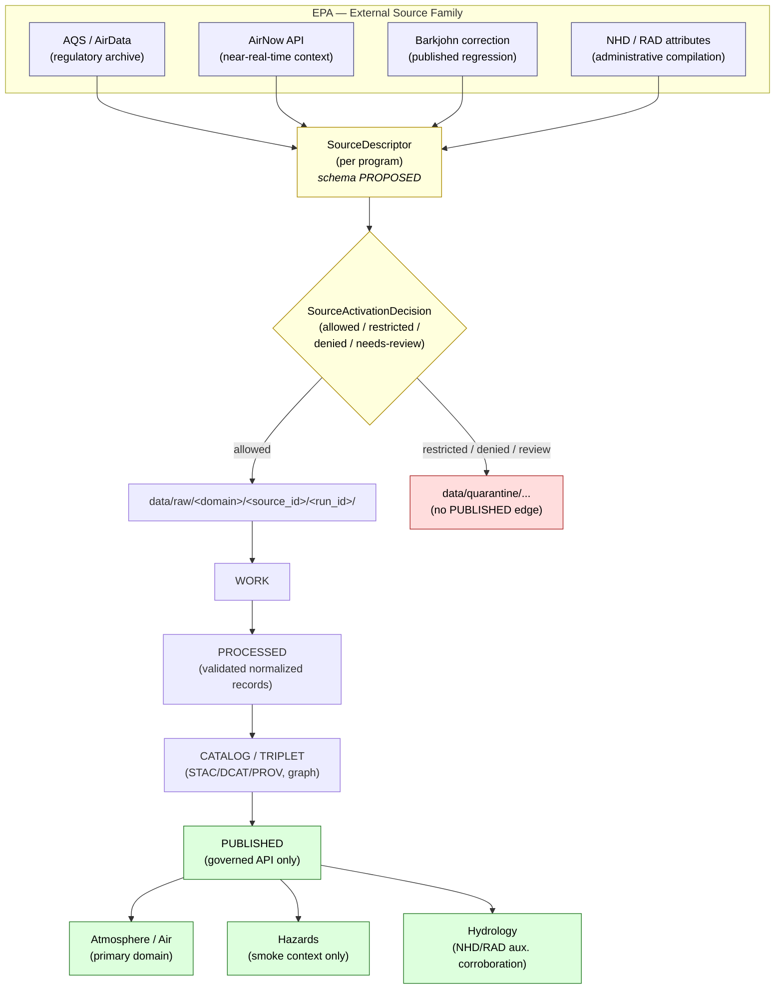

<!-- [KFM_META_BLOCK_V2]
doc_id: kfm://doc/source-family-brief-epa
title: EPA — Source Family Brief
type: standard
version: v1.1
status: draft
owners: TODO — Atmosphere/Air domain steward; Source registry steward
created: 2026-05-13
updated: 2026-05-21
policy_label: public
related:
  - docs/sources/SOURCE_DESCRIPTOR_STANDARD.md
  - docs/sources/catalog/README.md
  - docs/sources/catalog/noaa.md
  - docs/sources/catalog/usgs.md
  - docs/domains/atmosphere/README.md
  - docs/domains/hazards/README.md
  - docs/doctrine/directory-rules.md
  - docs/doctrine/lifecycle-law.md
  - docs/doctrine/truth-posture.md
  - docs/adr/ADR-0001-schema-home.md
  - docs/registers/DRIFT_REGISTER.md
  - docs/registers/VERIFICATION_BACKLOG.md
tags: [kfm, sources, source-family, epa, atmosphere-air, hazards]
notes:
  - "v1.1 polish pass: project-knowledge citations added (KFM-P2-IDEA-0022, KFM-P2-PROG-0003, C10-02); knowledge-character registry list aligned to [DOM-AIR]; watcher cadences pinned from corpus."
  - "Path docs/sources/catalog/ is PROPOSED grouping of per-agency source briefs under docs/sources/."
  - "All schema, policy, and registry paths are PROPOSED until mounted-repo evidence verifies them."
  - "'Catalog' in this path means a documentation catalog of source briefs; it is NOT the data/catalog/ lifecycle phase."
[/KFM_META_BLOCK_V2] -->

# EPA — Source Family Brief

> Source-admission and authority-control brief for U.S. Environmental Protection Agency (EPA) data programs used by Kansas Frontier Matrix (KFM). EPA is a **multi-program source family**, not a single source.

       

| Field | Value |
|---|---|
| **Status** | `draft` (review pending) |
| **Doc type** | Source family brief — informative, not normative |
| **Version** | v1.1 |
| **Owners** | TODO — Atmosphere/Air domain steward; Source registry steward |
| **Created** | 2026-05-13 |
| **Last updated** | 2026-05-21 |
| **Schema authority** | `schemas/contracts/v1/source/source-descriptor.json` per ADR-0001 (PROPOSED path; NEEDS VERIFICATION in mounted repo) |
| **Activation state** | NEEDS VERIFICATION — no mounted `SourceActivationDecision` confirmed in this session |
| **Primary domain anchor** | `[DOM-AIR]` (Atmosphere and Air, §11 of Domains Atlas v1.1) |
| **Cross-domain anchors** | `[DOM-HAZ]` (Hazards, §12); `[DOM-HYD]` (Hydrology, NHD/RAD auxiliary only) |
| **Key corpus cards** | KFM-P2-IDEA-0022 (CONFIRMED canonical authorities); KFM-P2-PROG-0003 (watcher pattern); C10-02 (Kansas air-quality stack) |

---

## Quick jump

- [1. Scope](#1-scope)
- [2. Repo fit](#2-repo-fit)
- [3. EPA in KFM at a glance](#3-epa-in-kfm-at-a-glance)
- [4. Programs covered](#4-programs-covered)
- [5. Source-role assignment](#5-source-role-assignment)
- [6. Cross-domain placement](#6-cross-domain-placement)
- [7. Lifecycle and admission flow](#7-lifecycle-and-admission-flow)
- [8. Rights, sensitivity, publication posture](#8-rights-sensitivity-publication-posture)
- [9. Anti-collapse rules](#9-anti-collapse-rules)
- [10. Schemas, contracts, and policy references](#10-schemas-contracts-and-policy-references)
- [11. Validators and tests (proposed)](#11-validators-and-tests-proposed)
- [12. Open verification items](#12-open-verification-items)
- [13. Related docs](#13-related-docs)
- [Appendix A — Field-level descriptor surface (illustrative)](#appendix-a--field-level-descriptor-surface-illustrative)
- [Appendix B — EvidenceBundle alignment (illustrative)](#appendix-b--evidencebundle-alignment-illustrative)
- [Appendix C — Glossary](#appendix-c--glossary)

---

## 1. Scope

**CONFIRMED** — This brief covers how KFM treats data programs published by the **U.S. Environmental Protection Agency (EPA)** as a source family, including admission gates, source-role assignment, rights/sensitivity posture, cross-domain placement, anti-collapse rules, and the lifecycle stages each program must traverse before public surfaces can cite it.

It does **not** define schemas, decide release admissibility, or replace the authoritative `SourceDescriptor` schema. Field-level shape belongs in `schemas/`; allow/deny logic belongs in `policy/`; release decisions belong in `release/`. (Directory Rules §2.3.)

> [!NOTE]
> **PROPOSED placement.** The `docs/sources/catalog/` subdirectory is a PROPOSED grouping of per-agency source briefs under the canonical `docs/sources/` lane (Directory Rules §6.1, which lists `sources/` as "source-descriptor standards, source families"). The word *catalog* here means a documentation catalog of source briefs and is **not** the `data/catalog/` lifecycle phase. If the mounted repo uses a different convention, open a `docs/registers/DRIFT_REGISTER.md` entry rather than silently re-homing.

[Back to top](#epa--source-family-brief)

---

## 2. Repo fit

**PROPOSED** — All paths below are placement proposals consistent with Directory Rules; none has been verified against a mounted repository in this session.

```text
docs/
└── sources/
    ├── SOURCE_DESCRIPTOR_STANDARD.md      # cross-family standard (PROPOSED)
    └── catalog/                            # per-agency source briefs (PROPOSED grouping)
        ├── README.md                       # PROPOSED index
        ├── epa.md                          # ← this file
        ├── noaa.md                         # PROPOSED sibling
        ├── usgs.md                         # PROPOSED sibling
        ├── fema.md                         # PROPOSED sibling
        ├── usda.md                         # PROPOSED sibling
        └── kdhe.md                         # PROPOSED sibling (state-level neighbour)
```

| Direction | Relationship | Truth label |
|---|---|---|
| **Upstream doctrine** | `docs/doctrine/directory-rules.md`, `docs/doctrine/lifecycle-law.md`, `docs/doctrine/truth-posture.md` | CONFIRMED doctrine; specific file paths PROPOSED |
| **Sibling standard** | `docs/sources/SOURCE_DESCRIPTOR_STANDARD.md` (canonical descriptor rules) | PROPOSED |
| **Domain consumers** | `docs/domains/atmosphere/README.md`, `docs/domains/hazards/README.md` | PROPOSED paths; CONFIRMED domain ownership per Atlas §11 ([DOM-AIR]) and §12 ([DOM-HAZ]) |
| **Schema home** | `schemas/contracts/v1/source/source-descriptor.json` per ADR-0001 | PROPOSED path; CONFIRMED schema-home convention |
| **Registry home** | `data/registry/sources/atmosphere/epa/` | PROPOSED — per Directory Rules §7.5 / §12 pattern |
| **Rights registry** | `data/registry/rights/atmosphere/epa/` | PROPOSED |
| **Policy home** | `policy/sensitivity/atmosphere/`, `policy/source/<…>/` | PROPOSED |

> [!IMPORTANT]
> **Watcher-as-non-publisher.** Connectors that pull EPA data MUST write only to `data/raw/atmosphere/<source_id>/<run_id>/` or `data/quarantine/...`, with source descriptors, checksums, and ingest receipts. Connectors MUST NOT publish, mutate canonical truth, or write under `data/processed/`, `data/catalog/`, or `data/published/`. (Directory Rules §7.3.)

[Back to top](#epa--source-family-brief)

---

## 3. EPA in KFM at a glance

**CONFIRMED doctrine / PROPOSED implementation.**

EPA appears in KFM primarily as the source authority behind regulatory air-quality archives, near-real-time public AQI services, smoke-trajectory contexts, and ancillary hydrography/regulatory-watershed attributes. The corpus card **KFM-P2-IDEA-0022** explicitly names *AQS (historical, validated)* and *AirNow (real-time)* as **canonical authorities for air quality data**, with explicit `observed_time` vs `ingested_time` separation required.

| KFM source ID | EPA product / service | Corpus posture | Note |
|---|---|---|---|
| `EXT-AQS` | EPA AQS / AirData | **CONFIRMED** canonical (KFM-P2-IDEA-0022) | Regulatory ambient air-quality archive. Validated; long latency. |
| `EXT-AIRNOW` | AirNow API | **CONFIRMED** canonical (KFM-P2-IDEA-0022) | Near-real-time public AQI context. Preliminary; not a regulatory record. |
| *(no project-knowledge ID)* | Barkjohn correction (PurpleAir reconciliation) | **CONFIRMED** required pattern (C10-02) | Published regression; version pin MUST be recorded in the receipt. |
| *(no project-knowledge ID)* | EPA NHD / RAD attributes | PROPOSED auxiliary | Joins to canonical USGS hydrography only; **never** replaces canonical hydrography. |
| *(NOAA-primary)* | HMS smoke (often co-cited with AirNow) | Cross-reference only | Owned in `noaa.md` (PROPOSED sibling); included here for cross-lane awareness. |

> [!NOTE]
> **Not a single source.** EPA is treated as a **source family** — each EPA program (AQS, AirNow, Barkjohn correction for low-cost sensors, smoke products, NHD/RAD attributes) receives its own `SourceDescriptor` and its own `SourceActivationDecision`. Source role cannot be inferred from convenience or shared agency identity. *(Source-role anti-collapse rule, CONFIRMED doctrine — Atlas §24.1.)*

[Back to top](#epa--source-family-brief)

---

## 4. Programs covered

The programs below are the EPA products referenced in current KFM project knowledge. Each is a distinct source under KFM admission rules.

| Program | What it is | Typical product shape | Primary KFM domain | KFM source ID | Status |
|---|---|---|---|---|---|
| **EPA AQS / AirData** | Validated, regulatory-grade ambient pollutant archive from federal/state/local monitors. | Row-level monitor records (PM2.5, ozone, NO₂, etc.), QA/QC flags, daily summaries. | Atmosphere/Air | `EXT-AQS` | CONFIRMED reference (KFM-P2-IDEA-0022); activation NEEDS VERIFICATION |
| **AirNow API** | Near-real-time public AQI service; not a regulatory record. | AQI values and preliminary criteria-pollutant readings. | Atmosphere/Air | `EXT-AIRNOW` | CONFIRMED reference (KFM-P2-IDEA-0022); activation NEEDS VERIFICATION |
| **EPA Barkjohn correction** | Published regression that reconciles PurpleAir low-cost sensors to regulatory monitors. | Versioned regression coefficients applied at processing. | Atmosphere/Air (modeled adjunct) | TODO (no project-knowledge ID) | PROPOSED — required before any PurpleAir reading is published (C10-02) |
| **EPA NHD / RAD attributes** | EPA-published service attributes attached to NHDPlus hydrography (e.g., HUC12 fields). | Tabular attributes joined to NHDPlus features. | Hydrology (auxiliary corroboration) | TODO (no project-knowledge ID) | PROPOSED — supports COMID↔HUC12 crosswalk QA |
| **HMS smoke (NOAA-led, EPA-adjacent reporting)** | Smoke-plume context products often co-cited with EPA AirNow. | Polygon/raster smoke products. | Hazards (smoke context) | TODO (NOAA-primary; included for cross-reference) | PROPOSED — see `noaa.md` (PROPOSED sibling) |

> [!TIP]
> **PurpleAir + Barkjohn pairing.** When a PurpleAir-derived value is published, KFM convention is to preserve **both** the corrected and the uncorrected reading, plus the Barkjohn regression version pin, so the correction is reversible and auditable. *(Encyclopedia C10-02, CONFIRMED.)*

[Back to top](#epa--source-family-brief)

---

## 5. Source-role assignment

**CONFIRMED doctrine.** Source role is a first-class identity attribute. An observed monitor reading is **not** interchangeable with a near-real-time AQI report, a regulatory determination, or a modeled adjustment. The lifecycle and the governed API both fail closed when these roles are conflated. (Master Source-Role Anti-Collapse Register §24.1.)

The canonical role classes are: `observed | regulatory | modeled | aggregate | administrative | candidate | synthetic`.

| EPA program | KFM source role(s) | Why |
|---|---|---|
| AQS monitor record (row-level) | `observed` | A direct, QA/QC-validated reading from a sited monitor. |
| AQS annual/decennial summary | `aggregate` | Published summary over a unit; loss of per-record fidelity. |
| AQS regulatory non-attainment ruling (if ingested) | `regulatory` | Authoritative determination with administrative force. |
| AirNow AQI value | `aggregate` *(category/index)* + `context` posture | AQI is an index, not a concentration; preliminary, not regulatory. |
| AirNow raw pollutant value | `observed` *(provisional)* | Direct reading, but preliminary; flag accordingly. |
| Barkjohn-corrected PurpleAir value | `modeled` | Derived via a fitted regression; uncertainty and version must be preserved. |
| EPA NHD/RAD attributes | `administrative` *(reference compilation)* | Compiled attribute joined to canonical hydrography. |
| HMS smoke polygon | `modeled` *(context)* | Derived smoke estimate; not observed inundation/exposure. |

The corpus knowledge-character vocabulary for `[DOM-AIR]` maps cleanly onto these roles:

| Knowledge character (`[DOM-AIR]` term) | Typical EPA program | Role implication |
|---|---|---|
| `OBSERVED_SENSOR` | AQS monitor; AirNow raw pollutant value | `observed` |
| `PUBLIC_AQI_REPORT` | AirNow AQI value | `aggregate` + `context` |
| `REGULATORY_ARCHIVE` | AQS validated archive | `observed` (row) / `regulatory` (ruling) |
| `LOW_COST_SENSOR` | PurpleAir (with EPA Barkjohn correction) | `observed` raw + `modeled` corrected |
| `ATMOSPHERIC_MODEL_FIELD` | HMS smoke, CAMS, HRRR-Smoke (cross-ref) | `modeled` |
| `REMOTE_SENSING_MASK` | GOES/ABI AOD, VIIRS hotspot (cross-ref) | `modeled` / `observed` per product |
| `ALERT_AND_ADVISORY_CONTEXT` | AirNow advisory carrier | `context` only — never life-safety authority |
| `NETWORK_AND_SITE_CONTEXT` | AQS/AirNow site metadata | metadata; not a substantive measurement |

> [!WARNING]
> **Never relabel a role to satisfy a join.** A community-science co-located sensor is not a regulatory authority; a smoke model is not an observed exposure; an AirNow AQI is not an AQS concentration. KFM denies publication that collapses these roles.

[Back to top](#epa--source-family-brief)

---

## 6. Cross-domain placement

EPA programs flow primarily into the **Atmosphere/Air** domain lane, with secondary placements in **Hazards** (smoke/wildfire context) and **Hydrology** (NHD/RAD auxiliary corroboration only — never as observed hydrologic truth).



| Domain | EPA contribution | Boundary |
|---|---|---|
| **Atmosphere, Air, and Climate** | Station observations (AQS), near-real-time context (AirNow), modeled adjuncts (Barkjohn) | KFM **does not** replace official advisories or emergency alerting. |
| **Hazards** | Smoke/wildfire context co-cited with EPA AirNow advisories | KFM **does not** act as a life-safety alerting system. Operational warnings are **context only**. |
| **Hydrology** | EPA NHD/RAD service attributes (e.g., HUC12 fields) for crosswalk QA | EPA NHD/RAD is **corroborative**, never the canonical hydrography source (USGS WBD/NHDPlus HR remain canonical). |

> [!CAUTION]
> **Domain boundary integrity.** EPA AirNow is *not* a hazards alerting system inside KFM. Hazards may quote AirNow as advisory **context** and MUST redirect life-safety action to official sources via the not-for-life-safety disclaimer.

[Back to top](#epa--source-family-brief)

---

## 7. Lifecycle and admission flow

**CONFIRMED invariant.** RAW → WORK / QUARANTINE → PROCESSED → CATALOG / TRIPLET → PUBLISHED. Promotion is a **governed state transition, not a file move.**

| Phase | What EPA data looks like here | Gate to next phase | Status |
|---|---|---|---|
| `raw/` | Immutable source-edge capture (raw AQS pull, AirNow JSON response), with retrieval metadata, ETag/Last-Modified, checksum, and source descriptor. | `SourceDescriptor` exists; `SourceActivationDecision` says allowed/restricted. | PROPOSED |
| `work/` / `quarantine/` | Normalized AQS row → `AirObservation` candidate; AirNow → provisional `PM25Observation`/`OzoneObservation`; Barkjohn applied as a `TransformReceipt`. Failed/ambiguous records routed to `quarantine/`. | Validation report + policy gate pass; otherwise quarantine reason recorded. | PROPOSED |
| `processed/` | Validated canonical `AirObservation`, `AirStation`, etc., with unit-conversion receipts and freshness tags. | `EvidenceRef`, `ValidationReport`, and digest closure exist. | PROPOSED |
| `catalog/` / `triplets/` | STAC items per AQS monitor-year; DCAT distribution per AirNow feed; PROV lineage; graph projections. | Catalog/proof closure; `EvidenceBundle` resolvable from claim. | PROPOSED |
| `published/` | Governed-API payloads for the Atmosphere/Air map layers, Evidence Drawer, and station time-series fixtures. | `ReleaseManifest`, correction path, rollback target, review/policy state all exist. | PROPOSED |

### 7.1 Watcher cadence (CONFIRMED from KFM-P2-PROG-0003)

The corpus pins source-specific cadences for the soil/air watcher pattern. EPA-relevant cadences:

| Source | Cadence | Detection pattern |
|---|---|---|
| **AirNow NowCast** | every **5–15 minutes** | HEAD-first detection with `If-None-Match` / `If-Modified-Since`; debounce/coalesce per C3-04. |
| **EPA AQS metadata** | **daily** | HEAD preflight; metadata-only check before payload fetch. |
| **EPA AQS finalized data** | **monthly** | Range-and-resume for large pulls; delta_manifest of added/modified/deleted records with hashes. |
| **EPA Barkjohn correction** | per-publication (irregular) | Pin regression version in receipt; re-process when EPA publishes a revised regression. |

**PROPOSED source-activation flow.** Create or update `SourceDescriptor`; review source role, rights, sensitivity, cadence, and access; issue `SourceActivationDecision` declaring `allowed | restricted | denied | needs-review`; keep connectors/watchers inactive until activation decision, fixtures, validators, and policy gates exist. *(Per Unified Implementation Manual §3.6; cadence per KFM-P2-PROG-0003.)*

[Back to top](#epa--source-family-brief)

---

## 8. Rights, sensitivity, publication posture

| Concern | Posture | Status |
|---|---|---|
| **License / terms** | EPA AQS and AirNow are public U.S. federal products; **specific current terms (key requirements, attribution clauses, redistribution constraints, rate limits) NEEDS VERIFICATION before connector activation.** | NEEDS VERIFICATION |
| **Attribution** | Cite the originating EPA program and the retrieval time. Distinct citations for AQS vs AirNow vs Barkjohn-derived values. | PROPOSED |
| **Sensitivity** | Air quality monitor locations are generally public. Sensitive joins (e.g., to private health data) fail closed by default. | CONFIRMED posture |
| **Freshness** | AQS validated data lags months; AirNow is near-real-time but **preliminary**. Freshness badge required on UI surfaces. | CONFIRMED doctrine (KFM-P2-IDEA-0022) |
| **Life-safety** | EPA AirNow operational warnings are **context**, never KFM emergency instructions. UI MUST redirect to official sources. | CONFIRMED doctrine ([DOM-HAZ]) |
| **Low-cost sensor publication** | Requires Barkjohn correction, caveats, confidence interval, and limitations text before publication; uncorrected reading retained alongside corrected. | CONFIRMED doctrine (C10-02) |
| **Revision tracking** | AirNow real-time data may be revised in subsequent AQS publications; revisions MUST be tracked with **supersedes** pointers. | CONFIRMED doctrine (KFM-P2-IDEA-0022 tensions note) |

> [!IMPORTANT]
> **Unknown rights fail closed.** Per the encyclopedia's sensitive / deny-by-default register, source-rights-limited records DENY public release until terms resolved. Until the explicit EPA terms and rate-limit posture are recorded in `data/registry/rights/atmosphere/epa/` (PROPOSED), connector activation must remain `needs-review`.

[Back to top](#epa--source-family-brief)

---

## 9. Anti-collapse rules

**CONFIRMED doctrine.** These are the EPA-specific anti-collapse rules drawn from project knowledge (Atlas §11.I, [DOM-AIR]). Violating any of them is a publication blocker.

| Anti-collapse rule | Rationale | Default outcome |
|---|---|---|
| **AQI is not concentration.** | AQI is a categorical index; mg/m³ or ppb concentrations are not AQI values. | DENY publication that labels AQI as concentration; ABSTAIN at Focus Mode. |
| **AOD is not PM2.5.** | Satellite aerosol optical depth is a column property; surface PM2.5 is a near-ground concentration. | DENY publication that equates them; require modeled-link receipt. |
| **AirNow is not AQS.** | AirNow is near-real-time preliminary; AQS is the validated regulatory archive. | DENY publication that cites AirNow as regulatory-grade. |
| **Low-cost sensor unadjusted ≠ regulatory monitor.** | PurpleAir raw readings systematically overstate PM. | DENY publication of uncorrected PurpleAir values; require Barkjohn version pin. |
| **Model output is not observation.** | HMS smoke / modeled adjustments must cite model identity, run receipt, and bounds. | Cite as modeled context; never relabel as observation. |
| **Advisory is not life-safety authority.** | EPA AirNow advisories are contextual. | UI MUST redirect to official source; not-for-life-safety disclaimer required. |
| **Aggregate is not per-place fact.** | AQS annual/decennial summaries lose per-record fidelity. | DENY join from aggregate cell to single record; ABSTAIN at AI. |

[Back to top](#epa--source-family-brief)

---

## 10. Schemas, contracts, and policy references

**PROPOSED — paths below are placement proposals per Directory Rules §6.1, §7.4, ADR-0001; NEEDS VERIFICATION in mounted repo.**

| Concern | Proposed path | Status |
|---|---|---|
| `SourceDescriptor` schema | `schemas/contracts/v1/source/source-descriptor.json` | PROPOSED per ADR-0001 |
| `SourceActivationDecision` schema | `schemas/contracts/v1/source/source-activation-decision.json` | PROPOSED |
| `AirStation` / `AirObservation` object meaning | `contracts/atmosphere/air-objects.md` | PROPOSED |
| `AirStation` / `AirObservation` schemas | `schemas/contracts/v1/domains/atmosphere/*.schema.json` | PROPOSED |
| EPA program rights registry | `data/registry/rights/atmosphere/epa/` | PROPOSED |
| EPA program source descriptors | `data/registry/sources/atmosphere/epa/` | PROPOSED |
| Atmosphere policy gates | `policy/domains/atmosphere/` | PROPOSED |
| Atmosphere sensitivity policy | `policy/sensitivity/atmosphere/` | PROPOSED |
| Atmosphere fixtures | `fixtures/domains/atmosphere/epa/` | PROPOSED |
| Knowledge-character registry | `contracts/atmosphere/knowledge-characters.md` (+ schema home TBD) | PROPOSED — see §5 mapping table |

> [!NOTE]
> **No parallel authority.** Creating a parallel home for schemas, contracts, policy, sources, registries, releases, or proofs requires an accepted ADR. (Directory Rules §2.4.)

[Back to top](#epa--source-family-brief)

---

## 11. Validators and tests (proposed)

**PROPOSED.** None of the validators below have been verified in a mounted repository in this session. They are the validator surface implied by the Atmosphere/Air dossier (`[DOM-AIR]` §K) and the EPA anti-collapse rules.

- Knowledge-character registry tests for the full `[DOM-AIR]` vocabulary: `OBSERVED_SENSOR`, `PUBLIC_AQI_REPORT`, `REGULATORY_ARCHIVE`, `LOW_COST_SENSOR`, `ATMOSPHERIC_MODEL_FIELD`, `REMOTE_SENSING_MASK`, `CLIMATE_ANOMALY_CONTEXT`, `DERIVED_FUSION`, `METEOROLOGICAL_CONTEXT`, `ALERT_AND_ADVISORY_CONTEXT`, `NETWORK_AND_SITE_CONTEXT`.
- Unit normalization tests (e.g., ppb ↔ µg/m³ where conversion is defined; reject where it isn't).
- **AQI-as-concentration denial test.**
- **AOD-as-PM2.5 denial test.**
- **Model-as-observed denial test.**
- **AirNow-as-regulatory denial test.**
- **Low-cost sensor caveat presence test** (Barkjohn version pin required; uncorrected pair retained).
- **Aggregate-to-per-place join denial test** (AQS annual/decennial → individual record).
- **Life-safety disclaimer presence test** for any AirNow advisory carrier on public surfaces.
- **Supersedes-pointer test** for AirNow records superseded by later AQS revisions (per KFM-P2-IDEA-0022 tensions).
- Dry-run no-live-fetch tests (offline fixtures only; no network calls in CI).
- HEAD-preflight watcher tests (`If-None-Match` / `If-Modified-Since` honored; no expensive payload fetch when unchanged).

[Back to top](#epa--source-family-brief)

---

## 12. Open verification items

These items remain `UNKNOWN` or `NEEDS VERIFICATION` until a mounted repository or runtime evidence is inspected.

- [ ] Does `schemas/contracts/v1/source/source-descriptor.json` exist? Fields and required-set NEEDS VERIFICATION.
- [ ] Does `data/registry/sources/atmosphere/epa/` contain any `SourceDescriptor` or `SourceActivationDecision` records? UNKNOWN.
- [ ] Current EPA AQS API key, rate-limit, and terms posture: NEEDS VERIFICATION.
- [ ] Current AirNow API terms and bulk-access constraints: NEEDS VERIFICATION.
- [ ] Barkjohn regression version in use (and its pin location): UNKNOWN.
- [ ] Atmosphere/Air `LayerManifest` entries that cite EPA sources: UNKNOWN.
- [ ] Are any EPA-citing layers currently in `data/published/layers/atmosphere/`? UNKNOWN.
- [ ] Is `policy/sensitivity/atmosphere/` configured with the AQI ≠ concentration denial rule? UNKNOWN.
- [ ] Is the not-for-life-safety disclaimer rendered for AirNow advisory carriers in the map UI? UNKNOWN.
- [ ] Is the knowledge-character registry (§5 mapping) implemented as a validated contract? UNKNOWN.
- [ ] **Open doctrinal question (KFM-P2-IDEA-0022):** corpus answer is "publish AQS and AirNow as **separate** artifacts for fidelity, with a reconciliation view as a **derived** artifact." NEEDS VERIFICATION that this is the implemented posture.
- [ ] Drift entry: confirm `docs/sources/catalog/` is the actual home or open a `DRIFT_REGISTER` entry. UNKNOWN.

> [!TIP]
> Open verification items belong in `docs/registers/VERIFICATION_BACKLOG.md` once that register exists. Move them there during the first review pass; keep a back-pointer in this brief.

[Back to top](#epa--source-family-brief)

---

## 13. Related docs

- `docs/sources/SOURCE_DESCRIPTOR_STANDARD.md` — cross-family descriptor standard *(PROPOSED)*
- `docs/sources/catalog/README.md` — catalog index of source briefs *(PROPOSED)*
- `docs/sources/catalog/noaa.md` — NOAA source family (HMS smoke, HRRR-Smoke cross-refs) *(PROPOSED sibling)*
- `docs/sources/catalog/usgs.md` — USGS source family (NHDPlus / WBD canonical hydrography) *(PROPOSED sibling)*
- `docs/sources/catalog/kdhe.md` — KDHE source family (state-level advisory neighbour) *(PROPOSED sibling)*
- `docs/domains/atmosphere/README.md` — Atmosphere, Air, and Climate domain dossier *(PROPOSED path; CONFIRMED domain in Atlas §11 [DOM-AIR])*
- `docs/domains/hazards/README.md` — Hazards domain dossier *(PROPOSED path; CONFIRMED domain in Atlas §12 [DOM-HAZ])*
- `docs/doctrine/directory-rules.md` — placement law *(CONFIRMED doctrine)*
- `docs/doctrine/lifecycle-law.md` — RAW → WORK/QUARANTINE → PROCESSED → CATALOG/TRIPLET → PUBLISHED invariant
- `docs/doctrine/truth-posture.md` — cite-or-abstain default
- `docs/adr/ADR-0001-schema-home.md` — schema-home decision
- `docs/registers/DRIFT_REGISTER.md` — for placement conflicts
- `docs/registers/VERIFICATION_BACKLOG.md` — for items in §12

[Back to top](#epa--source-family-brief)

---

<details>
<summary><strong>Appendix A — Field-level descriptor surface (illustrative)</strong></summary>

> **PROPOSED, illustrative only.** Reproduced and condensed from the Domains Atlas §24.1.3. Actual field presence and names are NEEDS VERIFICATION in the mounted `SourceDescriptor` schema.

| Field | Type / vocabulary | Required? | Notes for EPA programs |
|---|---|---|---|
| `source_id` | string (stable) | MUST | e.g., `EXT-AQS`, `EXT-AIRNOW`; per-program, not per-agency. |
| `source_role` | enum: `observed \| regulatory \| modeled \| aggregate \| administrative \| candidate \| synthetic` | MUST | See §5. Set at admission. Never edited in place; corrections produce a new descriptor + `CorrectionNotice`. |
| `role_authority` | string (issuing body / model identity) | MUST when role ∈ {`regulatory`, `modeled`, `aggregate`} | "U.S. EPA, AirNow Program Office", "Barkjohn et al. (regression vX)", etc. |
| `role_aggregation_unit` | geometry-scope token (county, HUC, tract, year, decade, …) | MUST when `source_role = aggregate` | AQI is an index aggregation; AQS annual summaries are temporal aggregates. |
| `role_model_run_ref` | `EvidenceRef` → `ModelRunReceipt` | MUST when `source_role = modeled` | Pin the Barkjohn regression version, HMS smoke run, etc. |
| `knowledge_character` | enum: `OBSERVED_SENSOR \| PUBLIC_AQI_REPORT \| REGULATORY_ARCHIVE \| LOW_COST_SENSOR \| ATMOSPHERIC_MODEL_FIELD \| REMOTE_SENSING_MASK \| ALERT_AND_ADVISORY_CONTEXT \| NETWORK_AND_SITE_CONTEXT \| …` | MUST in `[DOM-AIR]` | See §5 mapping table. |
| `rights_posture` | structured: license, attribution, redistribution, rate-limit | MUST | EPA terms NEEDS VERIFICATION before activation. |
| `cadence` | structured: poll interval, freshness expectation | MUST | AirNow ≈ 5–15 min NowCast; AQS metadata ≈ daily; AQS finalized ≈ monthly. (KFM-P2-PROG-0003) |
| `sensitivity_class` | enum | MUST | Default `public`; sensitive joins fail closed. |
| `release_class` | enum | MUST | Required before a `LayerManifest` may cite the source. |
| `supersedes_pointer` | reference to prior record(s) | MUST when revising | AirNow → AQS revision lineage. (KFM-P2-IDEA-0022) |

</details>

<details>
<summary><strong>Appendix B — EvidenceBundle alignment (illustrative)</strong></summary>

> **PROPOSED, illustrative only.** Reproduced and condensed from corpus card **KFM-P2-PROG-0003** ("Soil and air watcher pattern"). The EvidenceBundle fields below describe what a *delta_manifest + receipt* should carry for an EPA AQS or AirNow ingest run. Actual field presence is NEEDS VERIFICATION.

| EvidenceBundle field | What it carries for EPA programs |
|---|---|
| `spec_hash` | Deterministic hash over the canonical record set. |
| `run_receipt_uri` | DSSE / cosign receipt URI for the ingest run. |
| `source_uris` | EPA AQS / AirNow endpoint URLs at retrieval time. |
| `license_name` + `license_url` | Pinned at retrieval; NEEDS VERIFICATION for each program. |
| `dataset_version` | EPA program version (e.g., AirNow API version; AQS data vintage). |
| `extraction_timestamp` | `retrieval_time`; distinct from `observed_time`. |
| `station_ids` | AQS site IDs; AirNow reporting site IDs. |
| `qa_flags` | `preliminary` vs `final` for AQS; `NowCast preliminary` for AirNow. |
| `uncertainty_descriptors` | e.g., Barkjohn-correction residual bounds for PurpleAir-derived values. |
| `tile_chunk_hash_maps` | For raster / large-payload retrievals (HMS, AOD if cross-cited). |
| `delta_manifest_uri` | Added / modified / deleted records with hashes. |
| `signer` | DSSE / cosign signer identity. |
| `attribution_string` | EPA program-appropriate attribution. |
| `fail_closed_reason` | `null` when promotion can proceed; otherwise the gate that blocked. |

> [!NOTE]
> This appendix is **descriptive**, not normative — the EvidenceBundle schema is owned by `schemas/contracts/v1/` per ADR-0001 and Directory Rules §6.4, not by this brief.

</details>

<details>
<summary><strong>Appendix C — Glossary</strong></summary>

| Term | Definition |
|---|---|
| `SourceDescriptor` | Machine-readable source identity: role, rights, cadence, access, steward, sensitivity, release posture. |
| `SourceActivationDecision` | Gate record deciding whether a source may be `allowed`, `restricted`, `denied`, or `needs-review`. |
| `EvidenceRef` | Reference that must resolve to an `EvidenceBundle` before public claim authority. |
| `EvidenceBundle` | Resolved evidence package: sources, excerpts, provenance, policy/review/release state. **Outranks generated language.** |
| `PolicyDecision` | Explicit `allow \| deny \| restrict \| abstain \| error` decision. |
| `RuntimeResponseEnvelope` | Finite answer envelope for governed AI/API surfaces. |
| `AIReceipt` | Runtime accountability record for bounded AI use; **never** a substitute for `EvidenceBundle`. |
| `LayerManifest` | Binds a UI layer to governed source/evidence semantics. |
| `ReleaseManifest` | Defines a complete published release; carries rollback target. |
| `RollbackCard` | Rollback target/drill object that preserves history while repointing release state. |
| `Promotion` | Governed release **state transition**, not a file move. |
| **Source role** | First-class identity attribute distinguishing observed / regulatory / modeled / aggregate / administrative / candidate / synthetic content. |
| **Knowledge character** | `[DOM-AIR]` vocabulary distinguishing the *kind* of air-domain content (`OBSERVED_SENSOR`, `PUBLIC_AQI_REPORT`, `REGULATORY_ARCHIVE`, `LOW_COST_SENSOR`, etc.). |
| **NowCast** | AirNow's near-real-time AQI computation; preliminary; cadence 5–15 minutes (KFM-P2-PROG-0003). |
| **Barkjohn correction** | EPA-published regression that reconciles PurpleAir low-cost sensors to regulatory monitors; version pin MUST be recorded. |
| **AOD** | Aerosol Optical Depth — column property from remote sensing; **not** a surface PM2.5 concentration. |

</details>

---

**Related docs:** see [§13](#13-related-docs) · **Version:** v1.1 · **Last updated:** 2026-05-21 · [Back to top](#epa--source-family-brief)
