<!-- [KFM_META_BLOCK_V2]
doc_id: kfm://doc/docs-sources-catalog-epa-airnow-api
title: EPA AirNow API
type: product-page
version: v0.2
status: draft
owners: <PLACEHOLDER — Docs steward + Source steward for epa + Atmosphere/Air domain steward>
created: 2026-05-20
updated: 2026-05-21
policy_label: public
related:
  - docs/sources/catalog/epa/README.md
  - docs/sources/catalog/epa/aqs-airdata.md
  - docs/sources/catalog/epa/barkjohn-correction.md
  - docs/sources/catalog/epa/IDENTITY.md
  - docs/sources/catalog/epa/RIGHTS-AND-SENSITIVITY-MAP.md
  - docs/sources/catalog/README.md
  - docs/doctrine/directory-rules.md
  - docs/standards/STAC_KFM_PROFILE.md
  - docs/adr/ADR-0001-schema-home.md
  - docs/domains/atmosphere/README.md
  - docs/domains/hazards/README.md
tags: [kfm, docs, sources, catalog, epa, airnow, atmosphere, air, aqi, near-real-time, advisory]
notes:
  - "PROPOSED product-page scaffold; presentation lifted to standard v2."
  - "AirNow is preliminary near-real-time, NOT regulatory. Anti-collapse rules (AirNow≠AQS, AQI≠concentration, Advisory≠life-safety) are the doctrinal heart of this product."
  - "Cadence: NowCast every 5-15 minutes per KFM-P2-PROG-0003."
  - "Sibling of aqs-airdata.md and barkjohn-correction.md within the epa family."
  - "PROPOSED family folder docs/sources/catalog/epa/ may coexist with or supersede the prior single-file brief docs/sources/catalog/epa.md; reconciliation NEEDS VERIFICATION."
[/KFM_META_BLOCK_V2] -->

<a id="top"></a>

# EPA AirNow API

> Documentation page for the **EPA AirNow API** as a candidate KFM source product — a **near-real-time public AQI service**; **contextual, not a regulatory record**. Scaffold only — not yet admitted.

<!-- Top-of-file badges (PLACEHOLDER targets; replace once Shields.io endpoints are pinned) -->


<!-- TODO: real Shields.io endpoints once owners and CI badges are decided. -->

**Status:** `PROPOSED` — scaffold only · **Family:** [`epa`](./README.md) · **Owners:** `<PLACEHOLDER>` · **Last reviewed:** `2026-05-21`

> [!IMPORTANT]
> This page is a **product-level documentation scaffold** under `docs/sources/catalog/epa/`. It does **not** create or amend any `SourceDescriptor`, policy decision, release manifest, or rights determination. Authority for those objects lives in their canonical roots ([§ Source authority](#source-authority)).

> [!CAUTION]
> **AirNow is not three things.** It is **not** the validated AQS regulatory archive. It is **not** a concentration measurement when surfaced as AQI. It is **not** a life-safety alert authority. Conflating any of these is a publication blocker. See [§ Source role and anti-collapse note](#source-role-and-anti-collapse-note).

---

## Table of contents

- [Overview](#overview)
- [Source role and anti-collapse note](#source-role-and-anti-collapse-note)
- [Source authority](#source-authority)
- [Product topology (PROPOSED)](#product-topology-proposed)
- [Catalog profiles used](#catalog-profiles-used)
- [Collection identity](#collection-identity)
- [Provenance fields](#provenance-fields)
- [Temporal handling](#temporal-handling)
- [Geometry and projection](#geometry-and-projection)
- [Rights and sensitivity](#rights-and-sensitivity)
- [Validation and catalog closure](#validation-and-catalog-closure)
- [Related contracts and schemas](#related-contracts-and-schemas)
- [Related connectors and pipelines](#related-connectors-and-pipelines)
- [Examples](#examples)
- [Open questions](#open-questions)
- [Related docs](#related-docs)

---

## Overview

`PROPOSED` scaffold. The **EPA AirNow API** is a near-real-time public Air Quality Index service published by the EPA AirNow Program Office in cooperation with federal, state, local, and tribal partners. KFM-P2-IDEA-0022 names it (alongside AQS) as a **canonical authority for air quality data** — specifically for *real-time situational awareness*, with explicit `observed_time` vs `ingested_time` separation required. `CONFIRMED` doctrine.

| Attribute | Position |
|---|---|
| Primary KFM domain | **Atmosphere / Air** `[DOM-AIR]` (Atlas §11) |
| Cross-domain placement | **Hazards** `[DOM-HAZ]` — smoke/advisory **context only** (never life-safety authority) |
| Geographic scope | US + territories (per source family description); coverage detail `NEEDS VERIFICATION` |
| Refresh cadence *(CONFIRMED per KFM-P2-PROG-0003)* | **NowCast every 5–15 minutes** |
| Current endpoint URL | `NEEDS VERIFICATION` — pin via SourceDescriptor only |
| Source role *(KFM source-role vocabulary)* | **AQI value** → `aggregate (category/index)` + `context` posture · **raw pollutant value** → `observed (provisional)` |
| Knowledge characters *(`[DOM-AIR]` vocabulary)* | `PUBLIC_AQI_REPORT` (primary); `OBSERVED_SENSOR (provisional)` (for raw pollutant readings); `ALERT_AND_ADVISORY_CONTEXT`; `NETWORK_AND_SITE_CONTEXT` |
| Rights / terms-of-use status | `NEEDS VERIFICATION` — see [§ Rights and sensitivity](#rights-and-sensitivity) |
| License classification | `UNKNOWN` — public U.S. federal product; specific current terms NEEDS VERIFICATION |
| Sensitivity tier *(KFM T0–T4)* | `PROPOSED` — T0 at the data layer; sensitive joins to private health data fail closed |
| Relationship to sibling `EXT-AQS` | **AirNow may be superseded by later AQS revisions**; supersedes-pointers MUST be tracked (KFM-P2-IDEA-0022 tensions) |

> [!NOTE]
> Per the EPA Source Family Brief, AirNow is the `EXT-AIRNOW` source ID in the encyclopedia source register. Each EPA program (AQS, AirNow, Barkjohn correction) is a **distinct source** under KFM admission — not a single agency lump.

[↑ back to top](#top)

---

## Source role and anti-collapse note

> [!WARNING]
> AirNow carries **three distinct doctrinal anti-collapse risks** that AI surfaces, popups, and downstream renderers MUST respect. `[DIRRULES] [DOM-AIR] [GAI] [ENCY]`

| Anti-collapse rule | What it forbids | Required guardrail |
|---|---|---|
| **AQI ≠ concentration** | Treating an AirNow AQI category/index value as a µg/m³ or ppb concentration. | DENY publication that labels AQI as concentration; ABSTAIN at Focus Mode. |
| **AirNow ≠ AQS** | Citing AirNow's near-real-time, preliminary reading as the regulatory-grade AQS archive. | DENY publication that cites AirNow as regulatory-grade; preserve `freshness=preliminary` flag; track `supersedes_pointer` to later AQS revision. |
| **Advisory ≠ life-safety authority** | Treating an AirNow advisory carrier on a KFM surface as an emergency instruction. | UI MUST render not-for-life-safety disclaimer and redirect to official source; KFM Hazards is not an alerting system. |

> [!IMPORTANT]
> A **fourth implied rule** applies whenever AirNow is combined with PurpleAir or other low-cost sensors: low-cost sensor unadjusted ≠ regulatory monitor. AirNow does not *replace* the Barkjohn-correction requirement on PurpleAir — it operates alongside it. See sibling [`barkjohn-correction.md`](./barkjohn-correction.md).

`PROPOSED` posture: the SourceDescriptor records both source roles in play. Each AirNow record carries an explicit `knowledge_character` so downstream surfaces cannot conflate AQI with concentration or AirNow with AQS.

[↑ back to top](#top)

---

## Source authority

> [!IMPORTANT]
> The **authoritative SourceDescriptor** for AirNow is owned in [`data/registry/sources/`](../../../../data/registry/sources/) (`PROPOSED` registry home consistent with Directory Rules). **Do not duplicate descriptor fields here.** This page references the descriptor; it does not author one.

`CONFIRMED` doctrine (KFM-P1-PROG-0007): every admitted source has a descriptor that records identity, role, rights posture, update cadence, authority scope, and verification obligations.

`CONFIRMED` doctrine (KFM source-role enum): because AirNow's AQI value carries `source_role=aggregate`, the descriptor **MUST** carry a `role_authority` field (issuing body) and a `role_aggregation_unit` (the index aggregation, e.g., 1-hour or 8-hour NowCast window).

`NEEDS VERIFICATION`: actual AirNow descriptor file path, fields, and schema-home compatibility against `schemas/contracts/v1/source/source-descriptor.json` per ADR-0001.

[↑ back to top](#top)

---

## Product topology (PROPOSED)

A documentation-level view of how AirNow records are expected to flow through KFM lifecycle phases. `PROPOSED` per Directory Rules §5; **no claim is made that any of these paths exist in the mounted repository.**

```mermaid
flowchart LR
    APO["EPA AirNow<br/>Program Office<br/>(role_authority)"] --> A["EPA AirNow API<br/>(near-real-time)"]
    A -->|"HEAD preflight<br/>If-None-Match /<br/>If-Modified-Since"| B["connectors/epa/airnow/<br/><i>PROPOSED</i>"]
    B -->|"NowCast 5-15 min"| C["data/raw/atmosphere/airnow/&lt;run_id&gt;/<br/><i>PROPOSED</i>"]
    C -->|"policy / rights / role gate"| Q["data/quarantine/atmosphere/&lt;reason&gt;/<br/><i>PROPOSED</i>"]
    C --> D["pipelines/ingest/<br/>pipelines/normalize/<br/>pipelines/validate/<br/><i>PROPOSED</i>"]
    D --> E["data/processed/atmosphere/<br/>PM25Observation / OzoneObservation /<br/>AQIReport (provisional)<br/><i>PROPOSED</i>"]
    E --> F["pipelines/catalog/<br/><i>PROPOSED</i>"]
    F --> G["data/catalog/stac/ + dcat/ + prov/<br/>preliminary flag<br/><i>PROPOSED</i>"]
    G --> H["EvidenceBundle +<br/>ReleaseManifest<br/><i>PROPOSED</i>"]
    H --> I["data/published/layers/atmosphere/<br/>AQI overlay (context, not life-safety)<br/><i>PROPOSED</i>"]

    AQS["sibling AQS<br/>finalized archive<br/>(months later)"] -.->|"supersedes_pointer"| E

    classDef ext fill:#fde7d4,stroke:#c87a3e,color:#202020
    classDef auth fill:#e6f0ff,stroke:#3e6dc8,color:#202020
    classDef sibling fill:#f3e7d4,stroke:#9a883e,color:#202020
    classDef prop fill:#fff7d6,stroke:#b8941f,color:#202020
    classDef quar fill:#ffd6d6,stroke:#b83030,color:#202020
    class A ext
    class APO auth
    class AQS sibling
    class B,C,D,E,F,G,H,I prop
    class Q quar
```



> [!NOTE]
> The diagram reflects **doctrinal lifecycle** (`RAW → WORK/QUARANTINE → PROCESSED → CATALOG/TRIPLET → PUBLISHED`), not verified repository content. The dashed arrow from sibling AQS to PROCESSED encodes the supersedes-pointer doctrine from KFM-P2-IDEA-0022.

[↑ back to top](#top)

---

## Catalog profiles used

`PROPOSED` per-profile applicability. Mark Yes/No in the descriptor and during catalog closure (Pass-10 / KFM-P1-IDEA-0020).

| Profile | Default lane *(PROPOSED)* | Used by this product? | Notes |
|---|---|---|---|
| **STAC** | `data/catalog/stac/` | `PROPOSED — Yes` | Each AirNow record has point geometry (station lat/lon) and a `datetime`. |
| **DCAT** | `data/catalog/dcat/` | `PROPOSED — Yes` | Feed-level dataset metadata (cadence, terms, providers). |
| **PROV-O** | `data/catalog/prov/` | `PROPOSED — Yes` | Lineage; resolves from `kfm:provenance`. |
| **Domain projection (Atmosphere/Air)** | `data/catalog/domain/atmosphere/` | `PROPOSED — Yes` | Primary domain. |
| **Domain projection (Hazards)** | `data/catalog/domain/hazards/` | `PROPOSED — context only` | For smoke/advisory carriers; **never as life-safety alert**. |

> [!NOTE]
> Per KFM-P2-IDEA-0022, the corpus answer to "AQS and AirNow as separate artifacts or merged?" is **separate for fidelity, with a reconciliation view as a derived artifact**. AirNow has its **own** Collection; the AQS-revision overlay is a downstream derived product.

[↑ back to top](#top)

---

## Collection identity

- `PROPOSED` Collection id pattern: `kfm-epa-airnow` *(illustrative; pin via [`IDENTITY.md`](./IDENTITY.md))*.
- `PROPOSED` namespace: `kfm:` *(see family open item `OPEN-DSC-03`; `kfm:` vs `ks-kfm:` is unsettled per C4-01 corpus note; AirNow is multi-state so the `kfm:` (KFM-global) case is stronger than for Kansas-scoped lists).*
- Asset roles: `NEEDS VERIFICATION` — confirm against `schemas/contracts/v1/source/` per ADR-0001.

> [!CAUTION]
> Collection ids are **stable handles**. Renaming a Collection breaks links throughout the catalog (C4-02). Pin the id only after a written namespace and id-pattern decision is recorded against an ADR or against the epa family `IDENTITY.md`.

[↑ back to top](#top)

---

## Provenance fields

`CONFIRMED` shape per C4-01 (KFM Provenance Namespace): every STAC Item carries an `item.properties.kfm:provenance` block. `PROPOSED` realization for EPA AirNow records.

| Field | Resolves to | Status |
|---|---|---|
| `spec_hash` | `sha256` of the canonical record (JCS/URDNA2015 canonicalization). | `CONFIRMED` shape |
| `evidence_bundle_ref` | `kfm://evidence/<digest>` → JSON-LD EvidenceBundle. | `CONFIRMED` shape |
| `run_record_ref` | `kfm://run/<run-id>` → run receipt. | `CONFIRMED` shape |
| `audit_ref` | `kfm://audit/<attestation-id>` → SLSA / OPA attestation. | `CONFIRMED` shape |
| `policy_digest` | `sha256` of the policy bundle used at promotion. | `CONFIRMED` shape |
| `file:checksum` *(per asset)* | Per-asset integrity (STAC `file` extension). | `CONFIRMED` shape |
| `qa_flags` *(EvidenceBundle field per KFM-P2-PROG-0003)* | **MUST include `NowCast preliminary`** for AirNow. | `CONFIRMED` doctrine |
| `supersedes_pointer` *(SourceDescriptor field)* | Reference to later AQS revision once published. | `CONFIRMED` doctrine (KFM-P2-IDEA-0022) |
| `role_authority` *(SourceDescriptor field)* | "U.S. EPA, AirNow Program Office" *(illustrative; pin via descriptor)*. | `CONFIRMED` doctrine (MUST for `aggregate` role) |
| `knowledge_character` *(EvidenceBundle field; `[DOM-AIR]` vocabulary)* | `PUBLIC_AQI_REPORT` for AQI; `OBSERVED_SENSOR` for raw pollutant. | `CONFIRMED` doctrine |

[↑ back to top](#top)

---

## Temporal handling

`PROPOSED` — keep the time axes distinct where material; never collapse them. AirNow's near-real-time + preliminary nature makes the `observed_time` vs `ingested_time` distinction structurally important. `[DOM-AIR] [ENCY]`

| Time axis | Definition (working) | Status |
|---|---|---|
| `observed_time` | When the field sensor recorded the reading. | `CONFIRMED` doctrine (KFM-P2-IDEA-0022) |
| `ingested_time` / `retrieval_time` | When AirNow published it AND when KFM fetched it (kept distinct). | `CONFIRMED` doctrine (KFM-P2-IDEA-0022) |
| `source_time` | NowCast computation window timestamp at the AirNow source. | `PROPOSED` |
| `valid_time` | Interval the AQI/concentration value is presented as valid for. | `PROPOSED` |
| `release_time` | When KFM promoted the record to PUBLISHED. | `PROPOSED` |
| `correction_time` | When a CorrectionNotice changed this record (e.g., on AQS supersession). | `PROPOSED` |

> [!NOTE]
> **Cadence is doctrinal:** NowCast publishes every 5–15 minutes (KFM-P2-PROG-0003). Watchers MUST use HEAD-first detection (`If-None-Match` / `If-Modified-Since`) and debounce/coalesce per C3-04 before expensive payload fetches.

[↑ back to top](#top)

---

## Geometry and projection

`PROPOSED` — confirm CRS, generalization rules, and scale support against `data/catalog/` artifacts and STAC Projection lint (KFM-P27-FEAT-0003). `NEEDS VERIFICATION`.

- Native CRS as published by AirNow: `NEEDS VERIFICATION` (default expectation: WGS84 / EPSG:4326).
- KFM canonical CRS for ingest: `NEEDS VERIFICATION` (default candidate: EPSG:4326).
- Per-record geometry: **point** (reporting site lat/lon).
- `geoprivacy_status`: **not applicable** — air-quality monitor sites are generally public.
- STAC Projection extension fields (`proj:code`, `proj:bbox`, `proj:geometry`, `proj:shape`, `proj:transform`): subject to **lint report compliance** (KFM-P27-FEAT-0003).

[↑ back to top](#top)

---

## Rights and sensitivity

> [!WARNING]
> **Do not restate policy on this page.** Rights and sensitivity authority lives in [`policy/sensitivity/`](../../../../policy/sensitivity/) and is summarized in the epa family [`RIGHTS-AND-SENSITIVITY-MAP.md`](./RIGHTS-AND-SENSITIVITY-MAP.md). This page only **points to** those authorities.

`NEEDS VERIFICATION`:

- **Rights status** of AirNow records: public U.S. federal product; **specific current terms (API key requirements, attribution clauses, redistribution constraints, rate limits) NEEDS VERIFICATION** before connector activation.
- **Attribution requirement**: cite the EPA AirNow Program Office and the retrieval timestamp; distinct from AQS attribution.
- **Sensitive joins**: joining AirNow readings to private health data fails closed.
- **Life-safety posture**: KFM **does not** function as an emergency alerting system. Operational warnings carried via AirNow are **context only**; UI MUST render a not-for-life-safety disclaimer and redirect to the official source. `CONFIRMED` doctrine `[DOM-HAZ]`.
- **Freshness badge**: required on UI surfaces — every AirNow render carries a *preliminary / near-real-time* marker.

> [!IMPORTANT]
> Unknown rights, unresolved source role, missing `role_authority`, or absent release state **block public promotion** (deny-by-default). `[ENCY] [DIRRULES]` Until explicit AirNow terms and rate-limit posture are recorded in `data/registry/rights/atmosphere/epa/` (`PROPOSED`), activation remains `needs-review`.

[↑ back to top](#top)

---

## Validation and catalog closure

`PROPOSED` validator surface for this product. Closure required before any public release (Pass-10 / KFM-P1-IDEA-0020).

| Gate | Reference | Status |
|---|---|---|
| Source descriptor present and validated | KFM-P1-PROG-0007 | `PROPOSED` |
| `source_role` correctly typed (per-record: AQI=`aggregate`+`context`; raw=`observed`(provisional)) | KFM-IDX-SRC-002 | `PROPOSED` |
| `role_authority` present (MUST for `aggregate` role) | KFM source-role doctrine | `PROPOSED` |
| `knowledge_character` populated per record (`PUBLIC_AQI_REPORT` / `OBSERVED_SENSOR`) | `[DOM-AIR]` vocabulary | `PROPOSED` |
| Unit normalization (where conversion is defined; reject where it isn't) | `[DOM-AIR]` §K | `PROPOSED` |
| **AQI-as-concentration denial test** | `[DOM-AIR]` §K | `PROPOSED` |
| **AirNow-as-regulatory denial test** | `[DOM-AIR]` §K + EPA brief §9 | `PROPOSED` |
| **Life-safety disclaimer presence test** for advisory carriers on public surfaces | `[DOM-HAZ]` + EPA brief §9 | `PROPOSED` |
| Supersedes-pointer test (AirNow record updated when later AQS revision lands) | KFM-P2-IDEA-0022 | `PROPOSED` |
| HEAD-preflight watcher test (`If-None-Match` / `If-Modified-Since` honored) | KFM-P2-PROG-0003 | `PROPOSED` |
| `qa_flags` carries `NowCast preliminary` | KFM-P2-PROG-0003 | `PROPOSED` |
| Rights bundle resolved (license, terms, attribution, rate limits) | Policy gate | `PROPOSED` |
| Sensitivity tier assigned (default `public`; sensitive joins fail closed) | `policy/sensitivity/atmosphere/` | `PROPOSED` |
| STAC Projection lint pass | KFM-P27-FEAT-0003 | `PROPOSED` |
| STAC checksum closure against ReleaseManifest digest | KFM-P22-PROG-0037 | `PROPOSED` |
| EvidenceBundle resolves from `kfm:provenance.evidence_bundle_ref` | C4-04 | `PROPOSED` |
| Catalog closure (DCAT / STAC / PROV) | Pass-10 / KFM-P1-IDEA-0020 | `PROPOSED` |
| Audit reference in gate outcome | KFM-P22-PROG-0049 | `PROPOSED` |
| Dry-run no-live-fetch test (offline fixtures only in CI) | `[DOM-AIR]` §K | `PROPOSED` |

[↑ back to top](#top)

---

## Related contracts and schemas

- `contracts/atmosphere/air-objects.md` — semantic contract for `AirStation`, `AirObservation`, `AQIReport`. `NEEDS VERIFICATION`.
- `schemas/contracts/v1/source/source-descriptor.json` — default home per ADR-0001 / Directory Rules §6.4. `NEEDS VERIFICATION`: actual file presence.
- `schemas/contracts/v1/domains/atmosphere/*.schema.json` — domain object schemas. `PROPOSED`.
- `contracts/atmosphere/knowledge-characters.md` — `[DOM-AIR]` vocabulary contract (where `PUBLIC_AQI_REPORT` is canonically defined). `PROPOSED`.

[↑ back to top](#top)

---

## Related connectors and pipelines

- [`connectors/epa/airnow/`](../../../../connectors/epa/airnow/) — `PROPOSED` connector home (sub-folder under EPA family connector lane).
- [`pipelines/ingest/`](../../../../pipelines/ingest/), [`pipelines/normalize/`](../../../../pipelines/normalize/), [`pipelines/validate/`](../../../../pipelines/validate/), [`pipelines/catalog/`](../../../../pipelines/catalog/), [`pipelines/watchers/`](../../../../pipelines/watchers/) — `PROPOSED` standard lanes.
- `pipeline_specs/atmosphere/` — `PROPOSED`.

[↑ back to top](#top)

---

## Examples

*(Illustrative only — not authoritative; do not treat the shapes below as proof of implementation.)*

<details>
<summary><strong>Minimal STAC Item with <code>kfm:provenance</code> (AirNow AQI reading; shape only)</strong></summary>

```json
{
  "type": "Feature",
  "stac_version": "1.0.0",
  "id": "kfm-epa-airnow-<site_id>-<observed_time>",
  "collection": "kfm-epa-airnow",
  "geometry": { "type": "Point", "coordinates": [0, 0] },
  "bbox": [0, 0, 0, 0],
  "properties": {
    "datetime": "PROPOSED ISO-8601 observed_time",
    "kfm:ingested_time": "PROPOSED ISO-8601 retrieval_time",
    "kfm:knowledge_character": "PUBLIC_AQI_REPORT",
    "kfm:freshness": "preliminary",
    "kfm:parameter": "PM2.5",
    "kfm:aqi_value": 0,
    "kfm:aqi_category": "PROPOSED — categorical",
    "kfm:nowcast_window_hours": 1,
    "kfm:site_id": "PROPOSED — AirNow reporting site identifier",
    "kfm:provenance": {
      "spec_hash": "sha256:<JCS canonicalized record hash>",
      "evidence_bundle_ref": "kfm://evidence/<digest>",
      "run_record_ref": "kfm://run/<run-id>",
      "audit_ref": "kfm://audit/<attestation-id>",
      "policy_digest": "sha256:<policy-bundle-hash>",
      "source_role": "aggregate",
      "role_authority": "PROPOSED — pin via SourceDescriptor (e.g., 'U.S. EPA, AirNow Program Office')",
      "role_aggregation_unit": "1-hour NowCast",
      "qa_flags": ["NowCast preliminary"],
      "supersedes_pointer": null
    }
  },
  "assets": {
    "source_record": {
      "href": "PROPOSED — pin via SourceDescriptor",
      "type": "application/json",
      "roles": ["data", "source"],
      "file:checksum": "1220<sha256-multihash>"
    }
  },
  "links": [
    { "rel": "self", "href": "./this-item.json" },
    { "rel": "collection", "href": "../collection.json" },
    { "rel": "attestation", "href": "kfm://evidence/<digest>" },
    { "rel": "successor-version", "href": "PROPOSED — future AQS revision URI when published" }
  ]
}
```

> [!CAUTION]
> Shape only. Field values are placeholders. The `attestation` link relation is `PROPOSED` per KFM-P7-PROG-0001 and is not a registered STAC `rel` value. The `successor-version` link models the supersedes-pointer doctrine from KFM-P2-IDEA-0022 once a later AQS revision lands.

</details>

See also: [`../_examples/stac-item-example.json`](../_examples/stac-item-example.json) — sibling example asset; `NEEDS VERIFICATION` for presence.

[↑ back to top](#top)

---

## Open questions

| ID | Question | Disposition needed before |
|---|---|---|
| `OPEN-EPA-ANOW-01` | Confirm current AirNow API endpoint URL, version, and any planned deprecation. | RAW admission |
| `OPEN-EPA-ANOW-02` | Confirm current AirNow API terms: key requirements, attribution clauses, redistribution constraints, rate limits. | Policy / public release |
| `OPEN-EPA-ANOW-03` | Confirm refresh cadence in practice (5 min vs 15 min) and any per-parameter variation. | Watcher tuning |
| `OPEN-EPA-ANOW-04` | Pin `role_authority` string and `role_aggregation_unit` (1-hour NowCast vs 8-hour) in the SourceDescriptor. | Descriptor admission |
| `OPEN-EPA-ANOW-05` | Decide AirNow vs AQS Collection layout: corpus answer is **separate for fidelity, with a reconciliation view as derived artifact** (KFM-P2-IDEA-0022). Verify implementation. | Catalog closure |
| `OPEN-EPA-ANOW-06` | Decide supersedes-pointer mechanics: at what cadence is the AirNow→AQS reconciliation re-run, and how is correction propagated to downstream layers? | Correction-path design |
| `OPEN-EPA-ANOW-07` | Pin not-for-life-safety disclaimer UI rendering rules for any AirNow advisory carrier surface. | UI / Hazards lane |
| `OPEN-EPA-ANOW-08` | Decide whether the raw pollutant value (`OBSERVED_SENSOR` provisional) is exposed publicly separately from the AQI report (`PUBLIC_AQI_REPORT`), or only the AQI carrier surfaces publicly. | Public-DTO design (open per KFM-P2-PROG-0003) |
| `OPEN-EPA-ANOW-09` | Confirm namespace choice (`kfm:` vs `ks-kfm:`) — coordinate with family `OPEN-DSC-03`; AirNow's multi-state scope favors `kfm:`. | Catalog closure |
| `OPEN-EPA-ANOW-10` | Define quarantine policy for AirNow records with sensor outages, malformed payloads, or unit-conversion failures. | RAW admission |
| `OPEN-EPA-ANOW-11` | Reconcile the EPA family layout: prior single-file brief `docs/sources/catalog/epa.md` vs new family folder `docs/sources/catalog/epa/`. ADR or DRIFT_REGISTER entry. | Family-level structural decision |

[↑ back to top](#top)

---

## Related docs

- [`./README.md`](./README.md) — epa family overview
- [`./aqs-airdata.md`](./aqs-airdata.md) — sibling product page (validated regulatory archive)
- [`./barkjohn-correction.md`](./barkjohn-correction.md) — sibling product page (PurpleAir reconciliation regression)
- [`./IDENTITY.md`](./IDENTITY.md) — epa family Collection identity
- [`./RIGHTS-AND-SENSITIVITY-MAP.md`](./RIGHTS-AND-SENSITIVITY-MAP.md) — epa family rights/sensitivity map
- [`../README.md`](../README.md) — sources catalog overview
- [`../../../doctrine/directory-rules.md`](../../../doctrine/directory-rules.md) — Directory Rules
- [`../../../domains/atmosphere/README.md`](../../../domains/atmosphere/README.md) — Atmosphere/Air domain dossier (`[DOM-AIR]`, Atlas §11)
- [`../../../domains/hazards/README.md`](../../../domains/hazards/README.md) — Hazards domain dossier (`[DOM-HAZ]`, Atlas §12)
- [`../../../standards/STAC_KFM_PROFILE.md`](../../../standards/STAC_KFM_PROFILE.md) — STAC × KFM provenance profile *(TODO: confirm path)*
- [`../../../adr/ADR-0001-schema-home.md`](../../../adr/ADR-0001-schema-home.md) — Schema home *(TODO: confirm filename)*

---

**Last reviewed:** `2026-05-21` *(Claude Code product-page polish pass; content stance unchanged.)*

[↑ back to top](#top)
