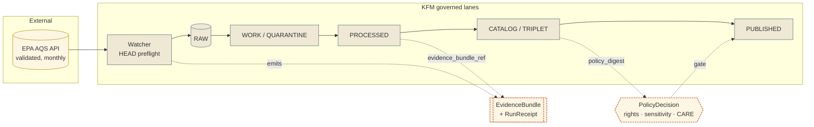

<!-- [KFM_META_BLOCK_V2]
doc_id: kfm://doc/docs-sources-catalog-epa-aqs-airdata
title: EPA AQS / AirData
type: product-page
version: v0.2
status: draft
owners: <PLACEHOLDER — Docs steward + Source steward for `epa`; assign before review>
created: 2026-05-20
updated: 2026-05-21
policy_label: public
related:
  - docs/sources/catalog/epa/README.md
  - docs/sources/catalog/README.md
  - docs/doctrine/directory-rules.md
  - data/registry/sources/
  - docs/standards/STAC_KFM_PROFILE.md
tags: [kfm, docs, sources, catalog, epa, atmosphere, air-quality]
notes:
  - "PROPOSED product-page scaffold. Path `docs/sources/catalog/epa/aqs-airdata.md` is PROPOSED; the `docs/sources/` root is observed in the target tree (kfm_repository_structure_guiding_document.md), but the `catalog/<family>/<product>` subfolder pattern is NEEDS VERIFICATION against Directory Rules and mounted repo evidence."
  - "Sibling links (`./README.md`, `../IDENTITY.md`, `../RIGHTS-AND-SENSITIVITY-MAP.md`, `../_examples/`) are PROPOSED placements only."
[/KFM_META_BLOCK_V2] -->

# EPA AQS / AirData

> Validated, regulatory-grade ambient air-quality monitor archive — the long-latency, full-QA/QC authority paired with AirNow for real-time observations.

[](#)
[](../../../doctrine/directory-rules.md)
[](../IDENTITY.md)
[](../../../domains/atmosphere/)
[](../RIGHTS-AND-SENSITIVITY-MAP.md)
[](#last-reviewed)

**Status:** PROPOSED — scaffold only ·
**Family:** [`epa`](./README.md) ·
**Domain:** Atmosphere / Air Quality (`DOM-AIR`) ·
**Owners:** `<PLACEHOLDER — Docs steward + Source steward for epa>` ·
**Last reviewed:** 2026-05-21

> [!IMPORTANT]
> This page is a **product-page scaffold**, not a SourceDescriptor. The authoritative source contract lives in [`data/registry/sources/`](../../../../data/registry/sources/). Fields here describe how the product is **catalogued, governed, and surfaced** — not the source's identity, rights, or cadence, which belong to the descriptor.

---

## 📑 On this page

- [Overview](#overview)
- [Doctrinal anchors](#doctrinal-anchors)
- [Source authority](#source-authority)
- [Lifecycle and product flow](#lifecycle-and-product-flow)
- [Catalog profiles used](#catalog-profiles-used)
- [Collection identity](#collection-identity)
- [Provenance fields (`kfm:provenance`)](#provenance-fields-kfmprovenance)
- [Temporal handling](#temporal-handling)
- [Geometry and projection](#geometry-and-projection)
- [Rights and sensitivity](#rights-and-sensitivity)
- [Validation and catalog closure](#validation-and-catalog-closure)
- [Related contracts and schemas](#related-contracts-and-schemas)
- [Related connectors and pipelines](#related-connectors-and-pipelines)
- [Examples](#examples)
- [Open questions](#open-questions)
- [Related docs](#related-docs)

---

## Overview

**CONFIRMED (doctrine):** EPA's AQS (Air Quality System) is the canonical authority for **historical, validated** ambient air-quality observations; AirNow is the paired authority for **real-time** observations. AQS provides validated observations with **long latency** and full QA/QC; both are ingested with explicit `observed_time` vs. `ingested_time` distinction (KFM-P2-IDEA-0022).

**PROPOSED (product page scope):** This page covers the AQS / AirData archive product family — daily metadata checks and monthly finalized-data refreshes per the watcher pattern (KFM-P2-PROG-0003). The AirNow real-time product, where retained, has its own product page.

**NEEDS VERIFICATION:** geographic coverage (Kansas-scoped vs. national), retained pollutant subset, current endpoint base URL, rights statement text, license terms, and whether AirNow shares a sibling product page or is folded into a reconciliation view (per KFM-P2-IDEA-0022 open question: *separate for fidelity, with a reconciliation view as a derived artifact*).

> [!NOTE]
> This product page describes **how AQS appears in the catalog and governance surfaces**. It does **not** restate the SourceDescriptor, the policy bundle, or the connector implementation. Each of those has its own home — see [Source authority](#source-authority), [Rights and sensitivity](#rights-and-sensitivity), and [Related connectors and pipelines](#related-connectors-and-pipelines).

---

## Doctrinal anchors

| Anchor | Source | Why it applies here |
|---|---|---|
| **KFM-P2-IDEA-0022** | AQS / AirNow as canonical air-quality authorities | Establishes AQS source role and temporal-discipline rule (CONFIRMED) |
| **KFM-P2-PROG-0003** | Soil and air watcher pattern | AQS-specific cadences: metadata daily, finalized monthly (PROPOSED) |
| **KFM-P10-PROG-0017** | EPA AQS hourly O3/NO2 and 8-hour ozone aggregation | Pollutant-code handling and rollup discipline (PROPOSED) |
| **KFM-P1-PROG-0007** | Source descriptors and source-role registry | Why the SourceDescriptor lives in `data/registry/sources/`, not here (PROPOSED) |
| **C4-01 / C4-02** | STAC `kfm:provenance` Item and Collection shape | Required provenance block on every promoted Item (CONFIRMED — corpus shape) |
| **C10-02** | Kansas air-quality stack | AQS as the regulatory-grade leg of the broader stack (CONFIRMED) |
| **Directory Rules** | `docs/doctrine/directory-rules.md` | Compatibility-root and schema-home discipline (CONFIRMED — see ADR-0001) |

---

## Lifecycle and product flow

> [!NOTE]
> The diagram below renders the **governed lifecycle** AQS records traverse from external pull to public surface. Internal node labels are PROPOSED; the lifecycle stages themselves (`RAW → WORK/QUARANTINE → PROCESSED → CATALOG/TRIPLET → PUBLISHED`) are CONFIRMED doctrine.



<sub>NEEDS VERIFICATION: actual connector/pipeline node names, route names, and stage transitions against mounted-repo evidence.</sub>

---

## Source authority

The authoritative SourceDescriptor for AQS lives in [`data/registry/sources/`](../../../../data/registry/sources/) per **ADR-0001** and Directory Rules §7.4. **Do not duplicate descriptor fields here.**

| Field on the descriptor | Where defined | Why it is **not** restated on this page |
|---|---|---|
| Identity, role, rights, cadence | SourceDescriptor | Single source of truth; restating drifts |
| Source role (authority / observation) | `source_role` enum on descriptor | Set at admission; never edited in place |
| Update cadence | descriptor + watcher spec | Watcher is the operational owner |
| Access method / endpoint | descriptor | Endpoints rotate; descriptor tracks them |
| Steward and obligations | descriptor + `policy/sources/` | Policy decisions, not catalog presentation |

> [!WARNING]
> If you find yourself wanting to add a "current endpoint URL" or a "rights statement" block to this page, **stop and update the SourceDescriptor instead.** A descriptor is the only place where source identity, role, and rights are authoritative. This page is downstream of it.

---

## Catalog profiles used

**PROPOSED — Pass-10 / C4 profiles.** Each lane is verified independently against `data/catalog/` artifacts before promotion.

| Profile | Lane (path) | Used by this product? | Notes |
|---|---|---|---|
| **STAC** with `kfm:provenance` | `data/catalog/stac/` | PROPOSED — Yes (NEEDS VERIFICATION) | C4-01 / C4-02 shape required |
| **DCAT** distribution | `data/catalog/dcat/` | PROPOSED — Yes (NEEDS VERIFICATION) | C4-05 dataset-level metadata |
| **PROV-O** lineage | `data/catalog/prov/` | PROPOSED — Yes (NEEDS VERIFICATION) | Bound via `kfm:provenance.run_record_ref` |
| **Domain projection** | `data/catalog/domain/atmosphere/` | PROPOSED — Yes (NEEDS VERIFICATION) | Atmosphere-specific projection for `AirStation` / `AirObservation` objects |
| **STAC × DwC hybrid** | `data/catalog/stac/` (extended) | **No** | Biodiversity-only (C4-03); not applicable |

---

## Collection identity

- **PROPOSED Collection id pattern:** `kfm-<org>-<product>` — e.g. `kfm-epa-aqs` (see [`IDENTITY.md`](../IDENTITY.md) and Pass-10 C4-02 Expansion Directions).
- **PROPOSED namespace:** `kfm:` — *(see OPEN-DSC-03; namespace choice between `kfm:` and `ks-kfm:` is an open Pass-10 question — C4-01).*
- **Asset roles:** NEEDS VERIFICATION — confirm against `schemas/contracts/v1/source/` and `contracts/domains/atmosphere/`.

> [!TIP]
> Renaming a Collection id breaks every Item that references it. Treat the Collection id as a **stable handle**, not a label — version the Collection's *contents* and *description*, but resist renaming the id itself once published (C4-02).

---

## Provenance fields (`kfm:provenance`)

Every promoted STAC Item carries an `item.properties.kfm:provenance` block. The shape below is **CONFIRMED** doctrine (Pass-10 C4-01); the specific field values for AQS Items are **PROPOSED** until mounted-repo evidence confirms them.

| Field | Resolves to | Required? | Notes |
|---|---|---|---|
| `spec_hash` | sha256 of the canonical record | MUST | C1-02 spec-hash gate (C5-04) |
| `evidence_bundle_ref` | `kfm://evidence/<digest>` → EvidenceBundle JSON-LD | MUST | C4-04 content-addressed bundle |
| `run_record_ref` | `kfm://run/<run-id>` → RunReceipt | MUST | Joins to PROV-O lineage |
| `audit_ref` | `kfm://audit/<attestation-id>` → SLSA / OPA attestation | MUST | C5-08 lineage-required gate |
| `policy_digest` | sha256 of the policy bundle at promotion | MUST | C5-03 policy-parity check |
| (per-asset) `file:checksum` | sha256 of the asset bytes | MUST | C3-02 manifest checksum |

<details>
<summary><b>Reference: minimal `kfm:provenance` block (illustrative — not authoritative)</b></summary>

```json
{
  "properties": {
    "kfm:provenance": {
      "spec_hash": "sha256:<…>",
      "evidence_bundle_ref": "kfm://evidence/<digest>",
      "run_record_ref": "kfm://run/<run-id>",
      "audit_ref": "kfm://audit/<attestation-id>",
      "policy_digest": "sha256:<…>"
    }
  },
  "assets": {
    "data": {
      "href": "<…>",
      "file:checksum": "sha256:<…>"
    }
  }
}
```

PROPOSED only. The authoritative shape lives in `schemas/contracts/v1/catalog/stac-item.kfm.json` (path NEEDS VERIFICATION).

</details>

---

## Temporal handling

**PROPOSED — multi-temporal discipline (KFM-P2-IDEA-0022, CONFIRMED).**

| Time | Meaning for AQS | Required? |
|---|---|---|
| `source_time` | EPA's published observation time | MUST |
| `observed_time` | When the monitor recorded the value | MUST |
| `valid_time` | Period the value is valid for (hourly, 8-hour rollup) | MUST when applicable |
| `retrieval_time` | When KFM watcher fetched the record | MUST |
| `release_time` | When KFM published the derived artifact | MUST at publication |
| `correction_time` | When a record was superseded (preliminary → final, late arrival) | MUST when a supersedes pointer is emitted |

> [!IMPORTANT]
> AQS finalizes data on a long-latency cycle and may publish corrections. KFM doctrine requires that **revisions be tracked explicitly with `supersedes` pointers**, not silent overwrites (KFM-P2-IDEA-0022 tensions). Eight-hour ozone rollups carry their own `valid_time` semantics distinct from the hourly samples (KFM-P10-PROG-0017).

---

## Geometry and projection

**PROPOSED — confirm against `data/catalog/` and `schemas/contracts/v1/source/` artifacts.**

| Concern | PROPOSED handling | Status |
|---|---|---|
| Geometry type | Point (monitor location) | NEEDS VERIFICATION |
| CRS | EPSG:4326 (WGS84) for catalog; native projection preserved in EvidenceBundle | NEEDS VERIFICATION |
| Generalization | None at monitor scale | NEEDS VERIFICATION |
| Scale support | All zoom levels (point density permitting) | NEEDS VERIFICATION |
| STAC Projection extension | Required on promotion (KFM-P27-FEAT-0003 PROPOSED) | NEEDS VERIFICATION |

---

## Rights and sensitivity

**NEEDS VERIFICATION.** See [`policy/sensitivity/`](../../../../policy/sensitivity/) and [`RIGHTS-AND-SENSITIVITY-MAP.md`](../RIGHTS-AND-SENSITIVITY-MAP.md). **Do not restate policy here.**

> [!CAUTION]
> Per [DOM-AIR] doctrine, "rights and current terms NEEDS VERIFICATION; sensitive joins fail closed" applies to all EPA AQS-like archives. CARE applicability is unlikely (federally-published regulatory monitor data), but **CARE applicability is a curatorial decision, not an engineering default** (C15-01). Confirm with the source steward before assuming CARE does not apply.

The policy bundle, not this page, decides:

- Whether AQS may be published as-is, generalized, or held;
- Which derived products (e.g., per-facility scores, joins to demographic layers) require additional review;
- How attribution text is rendered on public surfaces.

---

## Validation and catalog closure

| Gate | Source | Status |
|---|---|---|
| **Catalog closure** before public release | Pass-10 / KFM-P1-IDEA-0020 | Required (CONFIRMED doctrine) |
| **STAC Projection lint** | KFM-P27-FEAT-0003 | PROPOSED |
| **STAC checksum closure** against ReleaseManifest digest | KFM-P22-PROG-0037 | PROPOSED |
| **Spec-hash-match** gate | C5-04 | CONFIRMED doctrine |
| **Default-deny** promotion | C5-02 | CONFIRMED doctrine |
| **Lineage required** (OpenLineage → receipts) | C5-08 | CONFIRMED doctrine |

> [!TIP]
> Catalog closure is the moment the Collection's Items, EvidenceBundles, RunReceipts, and policy decisions all resolve and verify together. A Collection that cannot close does not promote — there is no "publish anyway" path.

---

## Related contracts and schemas

| Concern | PROPOSED home | Status |
|---|---|---|
| SourceDescriptor schema | `schemas/contracts/v1/source/source-descriptor.json` | PROPOSED per ADR-0001 §7.4; NEEDS VERIFICATION |
| Domain contracts (Atmosphere) | `contracts/domains/atmosphere/` | PROPOSED |
| STAC Item shape | `schemas/contracts/v1/catalog/stac-item.kfm.json` | PROPOSED; NEEDS VERIFICATION |
| EvidenceBundle schema | `schemas/contracts/v1/evidence/evidence-bundle.json` | PROPOSED (KFM-P26-PROG-0004) |
| EvidenceRef schema | `schemas/contracts/v1/evidence/evidence-ref.json` | PROPOSED (KFM-P26-PROG-0005) |

> [!NOTE]
> Per Directory Rules §7.4 and ADR-0001, schemas live under `schemas/contracts/v1/...`. **Do not propose a parallel schema home** for AQS-specific shapes. If AQS warrants a vocabulary extension, file an ADR; do not add files under `contracts/` or this docs tree.

---

## Related connectors and pipelines

- **Connector:** [`connectors/epa/`](../../../../connectors/epa/) — AQS fetch, admission, and SourceDescriptor binding.
- **Pipelines:**
  - [`pipelines/ingest/`](../../../../pipelines/ingest/) — RAW → WORK
  - [`pipelines/normalize/`](../../../../pipelines/normalize/) — temporal-field normalization, pollutant-code canonicalization
  - [`pipelines/validate/`](../../../../pipelines/validate/) — QA against AQS QA flags (preliminary vs. final)
  - [`pipelines/catalog/`](../../../../pipelines/catalog/) — STAC / DCAT / PROV emission
- **Watcher cadence (PROPOSED — KFM-P2-PROG-0003):**
  - Metadata: **daily** (HEAD with `If-None-Match` / `If-Modified-Since`)
  - Finalized data: **monthly**
- **Pipeline spec:** [`pipeline_specs/atmosphere/`](../../../../pipeline_specs/atmosphere/)

> [!WARNING]
> Connectors and pipeline specs are PROPOSED placements consistent with the repository structure guide. Mounted-repo evidence has not been inspected in this session; all linked paths are NEEDS VERIFICATION.

---

## Examples

*Illustrative only — do not treat as authoritative.*

See [`_examples/stac-item-example.json`](../_examples/stac-item-example.json) for the minimal STAC + `kfm:provenance` shape applied to an AQS hourly sample. The example must round-trip through:

1. Spec-hash recomputation (C5-04)
2. EvidenceBundle resolution
3. Policy-digest match (C5-03)
4. STAC validator + Projection lint (KFM-P27-FEAT-0003)

…before it counts as a valid AQS Item shape.

---

## Open questions

- **OPEN-DSC-03** — STAC namespace choice: `kfm:` (global) or `ks-kfm:` (Kansas-scoped)? Pass-10 C4-01.
- **OPEN-AQS-01** — Confirm cadence (metadata daily, finalized monthly) and current endpoint URL against the live SourceDescriptor.
- **OPEN-AQS-02** — Confirm rights statement, license terms, and CARE applicability.
- **OPEN-AQS-03** — Does AQS warrant its own STAC Collection, or share one with sibling EPA products (AirNow, ECHO, TRI)? Doctrine (KFM-P2-IDEA-0022) suggests **separate for fidelity** with a derived reconciliation view.
- **OPEN-AQS-04** — Where does the **8-hour ozone rollup** Collection live — alongside AQS hourly samples or as a derived product family with its own page?
- **OPEN-AQS-05** — How are AQS supersedes (preliminary → final corrections) surfaced in the catalog UI? Tombstone-style (C5-09), or a soft `supersedes` link?
- **OPEN-PATH-01** — Confirm that `docs/sources/catalog/epa/aqs-airdata.md` is the correct path; the `catalog/<family>/<product>` subfolder pattern is PROPOSED and NEEDS VERIFICATION against Directory Rules.

---

## Related docs

- [`docs/sources/catalog/epa/README.md`](./README.md) — `epa` family landing page (PROPOSED).
- [`docs/sources/catalog/README.md`](../../README.md) — Sources catalog index (PROPOSED).
- [`docs/sources/catalog/epa/IDENTITY.md`](../IDENTITY.md) — Collection-id and namespace conventions (PROPOSED placement).
- [`docs/sources/catalog/epa/RIGHTS-AND-SENSITIVITY-MAP.md`](../RIGHTS-AND-SENSITIVITY-MAP.md) — Family-level rights map (PROPOSED placement).
- [`docs/doctrine/directory-rules.md`](../../../doctrine/directory-rules.md) — Authority boundaries and schema-home discipline.
- [`docs/standards/STAC_KFM_PROFILE.md`](../../../standards/STAC_KFM_PROFILE.md) — STAC `kfm:provenance` profile (PROPOSED).
- [`data/registry/sources/`](../../../../data/registry/sources/) — Canonical SourceDescriptor home (ADR-0001).
- [`docs/adr/ADR-0001-schema-home.md`](../../../adr/ADR-0001-schema-home.md) — Schema-home rule.

---

## Last reviewed

**2026-05-21** — Claude product-page polish pass; KFM doctrine alignment; presentation-standard application. Prior scaffold dated 2026-05-20.

---

<sub>📄 Product page · v0.2 · PROPOSED scaffold · <a href="#epa-aqs--airdata">↑ Back to top</a></sub>
