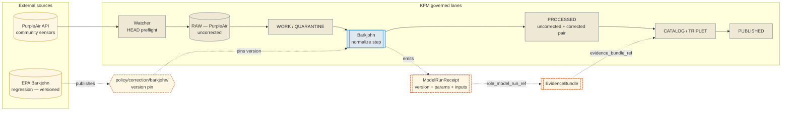

<!-- [KFM_META_BLOCK_V2]
doc_id: kfm://doc/docs-sources-catalog-epa-barkjohn-correction
title: EPA Barkjohn Correction
type: product-page
version: v0.2
status: draft
owners: <PLACEHOLDER — Docs steward + Source steward for `epa`; assign before review>
created: 2026-05-20
updated: 2026-05-21
policy_label: public
related:
  - docs/sources/catalog/epa/README.md
  - docs/sources/catalog/epa/aqs-airdata.md
  - docs/sources/catalog/purpleair/README.md
  - docs/sources/catalog/README.md
  - docs/doctrine/directory-rules.md
  - data/registry/sources/
  - policy/correction/barkjohn/
  - docs/standards/STAC_KFM_PROFILE.md
tags: [kfm, docs, sources, catalog, epa, atmosphere, air-quality, correction, model]
notes:
  - "PROPOSED product-page scaffold. Path `docs/sources/catalog/epa/barkjohn-correction.md` is PROPOSED; the `catalog/<family>/<product>` subfolder pattern is NEEDS VERIFICATION against Directory Rules."
  - "Doctrinal subtlety: Barkjohn is a *published correction regression*, not an observation source. Its SourceDescriptor carries `source_role: modeled` with a `role_model_run_ref`; it is *applied to* PurpleAir, not ingested in parallel with it. Placement under `docs/sources/catalog/epa/` is acceptable scaffolding but reviewers should consider whether a `docs/methods/` or `docs/models/` home is a better long-term fit (see OPEN-PATH-02)."
  - "Sibling-link placements (`./README.md`, `../IDENTITY.md`, `../RIGHTS-AND-SENSITIVITY-MAP.md`, `../_examples/`) are PROPOSED only."
[/KFM_META_BLOCK_V2] -->

# EPA Barkjohn Correction

> EPA-published regression that reconciles PurpleAir low-cost sensors to regulatory monitors — a versioned correction equation, not an observation feed. Required before any PurpleAir reading reaches publication.

[](#)
[](../../../doctrine/directory-rules.md)
[-informational)](../IDENTITY.md)
[](../../../domains/atmosphere/)
[](../purpleair/README.md)
[](#version-discipline)
[](#last-reviewed)

**Status:** PROPOSED — scaffold only ·
**Family:** [`epa`](./README.md) ·
**Kind:** Correction model (published regression) ·
**Domain:** Atmosphere / Air Quality (`DOM-AIR`) ·
**Owners:** `<PLACEHOLDER — Docs steward + Source steward for epa>` ·
**Last reviewed:** 2026-05-21

> [!IMPORTANT]
> **The Barkjohn correction is a model, not a source feed.** It is a published regression EPA emits to reconcile PurpleAir community-sensor PM2.5 readings to regulatory-grade monitors. KFM applies it as a transformation step inside `pipelines/normalize/`. The SourceDescriptor for Barkjohn carries `source_role: modeled` with a `role_model_run_ref` (KFM-P1-PROG-0007) — it is not an observation source. Its authoritative version, parameters, and provenance live in [`data/registry/sources/`](../../../../data/registry/sources/) and in the policy bundle at [`policy/correction/barkjohn/`](../../../../policy/correction/barkjohn/) (path PROPOSED).

---

## 📑 On this page

- [Overview](#overview)
- [Why this exists](#why-this-exists)
- [Doctrinal anchors](#doctrinal-anchors)
- [How Barkjohn fits the pipeline](#how-barkjohn-fits-the-pipeline)
- [Source authority](#source-authority)
- [Version discipline](#version-discipline)
- [Catalog profiles used](#catalog-profiles-used)
- [Collection identity](#collection-identity)
- [Provenance fields (`kfm:provenance`)](#provenance-fields-kfmprovenance)
- [Reversibility: the corrected/uncorrected pair](#reversibility-the-correcteduncorrected-pair)
- [Temporal handling](#temporal-handling)
- [Geometry and projection](#geometry-and-projection)
- [Validity guards](#validity-guards)
- [Rights and sensitivity](#rights-and-sensitivity)
- [Validation and catalog closure](#validation-and-catalog-closure)
- [Related contracts and schemas](#related-contracts-and-schemas)
- [Related connectors and pipelines](#related-connectors-and-pipelines)
- [Examples](#examples)
- [Open questions](#open-questions)
- [Related docs](#related-docs)

---

## Overview

**CONFIRMED (doctrine, C10-02).** PurpleAir is a community sensor network whose raw readings systematically overstate particulate concentration. The **EPA Barkjohn correction** is the published regression that reconciles PurpleAir to regulatory monitors, and **the corpus requires it before any PurpleAir reading is published.** The correction is itself versioned; the version in use must be recorded in the receipt. KFM convention is to **preserve the corrected-and-uncorrected pair** so the correction is reversible and auditable.

**PROPOSED (product page scope).** This page describes the Barkjohn correction as it appears in KFM as a **catalogued model artifact**: its SourceDescriptor (kind `modeled`), its version pin, its ModelRunReceipt shape, the validity guards that gate its application, and the way corrected PurpleAir Items reference it via `kfm:provenance.run_record_ref`.

**NEEDS VERIFICATION:** current Barkjohn version in use, exact regression form, smoke / high-PM2.5 regime guard parameters, meteorology-aware extension status, and policy-bundle pin location.

---

## Why this exists

> [!NOTE]
> A short "why" matters because Barkjohn is the hinge between an undercount risk and an overstatement risk.

Per **C10-02** (CONFIRMED): *"Kansas air-quality work that ignores PurpleAir undercounts the sensor footprint significantly; that ignores the Barkjohn correction overstates concentrations. Doing both correctly is the whole point."* This page is the public record of how KFM does both correctly: PurpleAir is admitted as a community-sensor source, Barkjohn is applied as a governed transformation, and the result is published with the model identity, version, and pre/post-correction values intact.

---

## Doctrinal anchors

| Anchor | Source | Why it applies here |
|---|---|---|
| **C10-02** | Kansas air-quality stack | CONFIRMED rule that Barkjohn is required before PurpleAir publication; corrected/uncorrected pair preservation; version-in-receipt rule |
| **KFM-P12-PROG-0028** | PurpleAir calibration and NowCast reconciliation | Preserve raw PurpleAir variants; document EPA or local calibration choices; align to AirNow NowCast buckets; compare to AQS validated history (PROPOSED) |
| **KFM-P14-PROG-0036** | PurpleAir smoke nonlinear correction guard | Flag nonlinear response at high PM2.5; require smoke-aware correction, uncertainty, and reference-collocation metadata before public fused surfaces (PROPOSED) |
| **KFM-P30-IDEA-0003** | Meteorology-aware PM correction | RH, T, P, and time-context predictors should be first-class features (PROPOSED) |
| **KFM-P30-IDEA-0005** | Low-concentration sensor safeguards | Near-zero classification and robust regression safeguards to avoid false positives (PROPOSED) |
| **KFM-P1-PROG-0007** | Source descriptors and source-role registry | Establishes `source_role: modeled` and `role_model_run_ref` for correction artifacts (PROPOSED) |
| **C12-03 / §34** | GENERATED\_RECEIPT / ModelRunReceipt discipline | Model identity, parameters, inputs, and validation gates required in every run (CONFIRMED — `ai-build-operating-contract.md`) |
| **C5-03** | Policy parity (CI = runtime) | Barkjohn version pin must match between CI and production (CONFIRMED) |
| **ML-061-051 / -052** | PurpleAir channel/variant semantics; sanity checks | Channel-divergence and impossible-PM detection before publishing corrected output (CONFIRMED evidence / NEW idea) |

---

## How Barkjohn fits the pipeline

> [!NOTE]
> The diagram shows Barkjohn as a **normalization step** applied to PurpleAir RAW input, emitting a ModelRunReceipt that the downstream STAC Item references via `kfm:provenance.run_record_ref`. Lifecycle stage names are CONFIRMED doctrine; specific node labels and routes are PROPOSED.



<sub>NEEDS VERIFICATION: actual normalize-step entry point, route names, and policy-bundle path against mounted-repo evidence.</sub>

---

## Source authority

The authoritative SourceDescriptor for the Barkjohn correction lives in [`data/registry/sources/`](../../../../data/registry/sources/) per **ADR-0001** and Directory Rules §7.4. **Do not duplicate descriptor fields here.**

| Field on the descriptor | Where defined | Why it is **not** restated here |
|---|---|---|
| Identity, role, rights, cadence | SourceDescriptor | Single source of truth |
| `source_role: modeled` | `source_role` enum on descriptor | Set at admission; never edited in place |
| `role_model_run_ref` (→ ModelRunReceipt) | descriptor field | Pins inputs/parameters/version per KFM-P1-PROG-0007 |
| `role_authority` (EPA, with publication citation) | descriptor field | Required when role is `modeled` (KFM-P1-PROG-0007) |
| Current published version | descriptor + `policy/correction/barkjohn/` | Policy pin owns the version; descriptor mirrors |
| Steward and obligations | descriptor + `policy/sources/` | Policy decisions, not catalog presentation |

> [!WARNING]
> **Do not paste the regression equation, coefficient values, or RH/T cutoffs into this page.** They belong in the SourceDescriptor, in the policy bundle, and inside the normalize step's pinned configuration. Restating them here invites silent drift — the page would be reviewed on its own cadence and could outlive a corrected version.

---

## Version discipline

**CONFIRMED (C10-02, Expansion Directions):** *"Publish a Barkjohn-correction-version pin in the policy bundle."*

| Concern | PROPOSED handling | Status |
|---|---|---|
| Version pin location | `policy/correction/barkjohn/VERSION` (or equivalent in the policy bundle) | PROPOSED — NEEDS VERIFICATION |
| Pin format | semantic version + EPA publication identifier + sha256 of the parameter blob | PROPOSED |
| CI / runtime parity | Same pin digest referenced in CI workflow and runtime PDP (C5-03) | CONFIRMED doctrine |
| Receipt requirement | Every applied correction emits a ModelRunReceipt carrying the pin (C12-03) | CONFIRMED doctrine |
| Rotation cadence | OPEN — see [Open questions](#open-questions) | UNKNOWN |
| Backfill policy | When EPA publishes a revised regression, historical corrected Items become candidates for re-correction; previous corrected Items are preserved with their original pin | PROPOSED |

> [!IMPORTANT]
> **A PurpleAir Item without a Barkjohn version pin in its `kfm:provenance.run_record_ref → ModelRunReceipt` must not reach `PUBLISHED`.** This is the operational form of the C10-02 rule and the C5-04 spec-hash-match gate. Default-deny applies.

---

## Catalog profiles used

**PROPOSED — Pass-10 / C4 profiles.** The Barkjohn correction itself is a method artifact; the **catalog Items are the corrected PurpleAir Items**, which reference Barkjohn through `run_record_ref`. Where this page lists "Used by this product?", the answer is whether the profile applies to the Barkjohn artifact record (the model itself), not to the downstream PurpleAir-corrected Items.

| Profile | Lane (path) | Used by this product? | Notes |
|---|---|---|---|
| **STAC** with `kfm:provenance` | `data/catalog/stac/` | PROPOSED — Yes for the corrected PurpleAir Items; **N/A** for the Barkjohn artifact record itself | Barkjohn is not a spatiotemporal asset |
| **DCAT** distribution | `data/catalog/dcat/` | PROPOSED — Yes (the regression publication is dataset-like at the DCAT level) | C4-05 |
| **PROV-O** lineage | `data/catalog/prov/` | PROPOSED — Yes; PROV `wasGeneratedBy` ties corrected Items back to a Barkjohn `prov:Activity` | C4-04 |
| **Domain projection** | `data/catalog/domain/atmosphere/` | PROPOSED — Yes (correction artifacts are part of the Atmosphere model surface) | NEEDS VERIFICATION |
| **STAC × DwC hybrid** | — | **No** | Biodiversity-only (C4-03); not applicable |

---

## Collection identity

- **PROPOSED Collection id pattern (for the corrected PurpleAir feed):** `kfm-purpleair-pm25-barkjohn-corrected` (see [`IDENTITY.md`](../IDENTITY.md)).
- **PROPOSED Barkjohn artifact id pattern:** `kfm-epa-barkjohn-correction` — a DCAT-anchored record, not a STAC Collection.
- **PROPOSED namespace:** `kfm:` *(see OPEN-DSC-03; namespace choice between `kfm:` and `ks-kfm:` remains open — Pass-10 C4-01).*
- **Asset roles:** NEEDS VERIFICATION — confirm against `schemas/contracts/v1/source/` and `contracts/domains/atmosphere/`.

> [!TIP]
> The Barkjohn artifact and the corrected PurpleAir Collection are **separate things**. Renaming a Collection breaks links (C4-02); renaming the Barkjohn artifact identifier breaks every ModelRunReceipt that references it. Treat both as stable handles.

---

## Provenance fields (`kfm:provenance`)

When a corrected PurpleAir STAC Item is emitted, its `item.properties.kfm:provenance` block carries the **Barkjohn ModelRunReceipt** via `run_record_ref`. The block shape is **CONFIRMED** doctrine (Pass-10 C4-01); the specific values are **PROPOSED** until mounted-repo evidence confirms them.

| Field | Resolves to | Required? | Notes for Barkjohn-corrected Items |
|---|---|---|---|
| `spec_hash` | sha256 of the canonical record | MUST | Includes the corrected PM2.5 value (C1-02 / C5-04) |
| `evidence_bundle_ref` | `kfm://evidence/<digest>` → EvidenceBundle | MUST | Bundle carries uncorrected + corrected pair |
| `run_record_ref` | `kfm://run/<run-id>` → **ModelRunReceipt** | MUST | **Must contain the Barkjohn version pin and parameters** |
| `audit_ref` | `kfm://audit/<attestation-id>` | MUST | SLSA / OPA attestation (C5-08) |
| `policy_digest` | sha256 of the policy bundle at promotion | MUST | **Must include the Barkjohn version pin** (C5-03 parity) |
| (per-asset) `file:checksum` | sha256 of asset bytes | MUST | C3-02 |

<details>
<summary><b>Reference: minimal ModelRunReceipt fields for a Barkjohn application (illustrative — not authoritative)</b></summary>

```text
receipt_id              ULID / UUIDv7
contract_version        "3.0.0"
artifact_paths          list of corrected PurpleAir Item paths
artifact_hashes         sha256 per path
model_identity          provider="EPA", model="Barkjohn-PM2.5-correction",
                        version=<pinned>, parameter_hash=<sha256>
inputs                  PurpleAir raw payload hashes; meteorology inputs (if used)
parameters              correction-equation form (linear, by-RH/T regime), regime cutoffs
truth_labels            CONFIRMED for the regression form; PROPOSED for parameter values
validation_gates        channel-divergence check, impossible-PM check,
                        smoke/high-PM regime guard (KFM-P14-PROG-0036),
                        low-concentration safeguard (KFM-P30-IDEA-0005)
policy_decisions        Barkjohn-version-pin allow decision (DecisionEnvelope id)
created_at              ISO-8601
emitter                 normalize-step identity
```

PROPOSED only. The authoritative shape lives in `schemas/contracts/v1/runtime/` (path NEEDS VERIFICATION) under the GENERATED\_RECEIPT / ModelRunReceipt family (`ai-build-operating-contract.md` §34).

</details>

---

## Reversibility: the corrected/uncorrected pair

> [!IMPORTANT]
> **CONFIRMED rule (C10-02):** *"The KFM convention is to preserve the corrected-and-uncorrected pair for PurpleAir so that the correction is reversible and auditable."*

| Item | What it holds | Lifecycle stage |
|---|---|---|
| **Uncorrected PurpleAir** | Raw PM2.5 channel(s), variant identifier, sensor metadata | RAW → PROCESSED (preserved) |
| **Corrected PurpleAir + Barkjohn** | Corrected PM2.5, ModelRunReceipt ref, Barkjohn version pin | PROCESSED → CATALOG → PUBLISHED |
| **Pair linkage** | `kfm:supersedes` and `kfm:applied_correction` cross-links between the two Items | PROCESSED onward |

This pair preservation is what makes the correction **inspectable and reversible** in the corpus's sense (KFM doctrine, Failure Rule). Stripping the uncorrected Item to save storage is a **doctrinal regression**, not a cost optimization.

---

## Temporal handling

Barkjohn introduces correction-specific time semantics on top of the standard six-role discipline (KFM-P2-IDEA-0022, applied here for the corrected Item):

| Time | Meaning for a Barkjohn-corrected PurpleAir Item | Required? |
|---|---|---|
| `source_time` | PurpleAir's published observation time | MUST |
| `observed_time` | When the sensor recorded the value | MUST |
| `valid_time` | Period the corrected value is valid for (often NowCast-aligned per KFM-P12-PROG-0028) | MUST when applicable |
| `retrieval_time` | When KFM watcher fetched the raw PurpleAir record | MUST |
| `correction_applied_time` | When the Barkjohn normalize step ran | MUST |
| `correction_version_time` | EPA's publication date of the pinned Barkjohn version | MUST |
| `release_time` | When KFM published the corrected artifact | MUST at publication |
| `correction_time` | When a corrected Item is superseded (e.g., re-correction under a new Barkjohn version) | MUST when emitted |

> [!NOTE]
> A backfill under a new Barkjohn version produces **new corrected Items** with new `correction_applied_time` / `correction_version_time`, and supersedes pointers from prior corrected Items — never silent overwrites.

---

## Geometry and projection

**PROPOSED — confirm against `data/catalog/` and `schemas/contracts/v1/source/` artifacts.**

| Concern | PROPOSED handling | Status |
|---|---|---|
| Geometry type | Point (PurpleAir sensor location) — Barkjohn does not change geometry | NEEDS VERIFICATION |
| CRS | EPSG:4326 in catalog; native projection preserved in EvidenceBundle | NEEDS VERIFICATION |
| Generalization | None at sensor scale; sensor-location sensitivity handled by policy, not by this page | NEEDS VERIFICATION |
| STAC Projection extension | Required on promotion (KFM-P27-FEAT-0003 PROPOSED) | NEEDS VERIFICATION |

---

## Validity guards

> [!CAUTION]
> Barkjohn is a regression with known regime limits. Applying it outside its validated regime can be **worse than not applying it at all**. The guards below are doctrinal requirements before any corrected value reaches `PUBLISHED`.

| Guard | Source | What it gates |
|---|---|---|
| **Channel divergence** | ML-061-052 | If PurpleAir channels A/B disagree beyond threshold, fail closed |
| **Impossible-PM detection** | ML-061-052 | Negative, NaN, or sensor-failure values fail closed |
| **High-PM2.5 / smoke regime** | KFM-P14-PROG-0036 | Nonlinear response at high concentrations → require smoke-aware correction + uncertainty + reference-collocation metadata; otherwise abstain on public fused surfaces |
| **Low-concentration safeguard** | KFM-P30-IDEA-0005 | Near-zero classification; robust regression to avoid false positives |
| **Meteorology applicability** | KFM-P30-IDEA-0003 | If RH/T/P inputs are required by the pinned Barkjohn variant and unavailable, fail closed |
| **Variant / channel semantics preserved** | ML-061-051 | Record which PurpleAir field and algorithm variant was corrected |
| **Reference collocation metadata** | KFM-P14-PROG-0036 | Where claimed, the AQS / AirNow collocation reference must be cited |

A `DecisionEnvelope` (KFM-P5-PROG-0001) records the outcome of each guard, with `outcome ∈ {ANSWER, ABSTAIN, DENY, ERROR}` and reasons.

---

## Rights and sensitivity

**NEEDS VERIFICATION.** See [`policy/sensitivity/`](../../../../policy/sensitivity/) and [`RIGHTS-AND-SENSITIVITY-MAP.md`](../RIGHTS-AND-SENSITIVITY-MAP.md). **Do not restate policy here.**

> [!WARNING]
> Rights concerns for Barkjohn fall in **two** distinct lanes, and conflating them is a documented failure mode:
>
> 1. **The Barkjohn correction itself** — a federally published EPA regression. Rights are typically permissive; **NEEDS VERIFICATION** for the current publication.
> 2. **The PurpleAir data Barkjohn is applied to** — community-sensor data whose terms of service have changed. The corpus warns explicitly that *"PurpleAir terms of service have changed; the corpus warns that the API access posture must be re-checked before bulk ingestion"* (C10-02). Rights for PurpleAir live on the **PurpleAir product page**, not here.

CARE applicability is unlikely for the Barkjohn artifact itself (it is a public regression), but the **PurpleAir** data the correction is applied to may have sensor-location and contributor-attribution implications. The policy bundle, not this page, decides.

---

## Validation and catalog closure

| Gate | Source | Status |
|---|---|---|
| **Catalog closure** before public release | Pass-10 / KFM-P1-IDEA-0020 | Required (CONFIRMED doctrine) |
| **Barkjohn-version-pin allow rule** | C10-02 Expansion + C5-02 default-deny | PROPOSED — pin lives in policy bundle |
| **STAC Projection lint** | KFM-P27-FEAT-0003 | PROPOSED |
| **STAC checksum closure** against ReleaseManifest digest | KFM-P22-PROG-0037 | PROPOSED |
| **Spec-hash-match** gate | C5-04 | CONFIRMED doctrine |
| **Policy parity** (CI = runtime, version pin matches) | C5-03 | CONFIRMED doctrine |
| **Replay verification** of corrected receipts | KFM-P5-PROG-0010 | PROPOSED |
| **Lineage required** (OpenLineage → receipts) | C5-08 | CONFIRMED doctrine |

> [!TIP]
> The single most useful CI test for Barkjohn is **replay verification**: given the same uncorrected PurpleAir input, the same Barkjohn version pin, and the same parameters, the corrected output must be byte-identical (KFM-P5-PROG-0010). Replay drift is a build break — and a sign that either the pin is wrong or the normalize step is non-deterministic.

---

## Related contracts and schemas

| Concern | PROPOSED home | Status |
|---|---|---|
| SourceDescriptor schema | `schemas/contracts/v1/source/source-descriptor.json` | PROPOSED per ADR-0001 §7.4; NEEDS VERIFICATION |
| ModelRunReceipt schema | `schemas/contracts/v1/runtime/model-run-receipt.json` (or under `evidence/`) | PROPOSED |
| GENERATED\_RECEIPT schema | `ai-build-operating-contract.md` §34 — CONFIRMED contract | CONFIRMED |
| DecisionEnvelope schema | `schemas/contracts/v1/runtime/decision_envelope.schema.json` (KFM-P5-PROG-0001) | PROPOSED |
| EvidenceBundle / EvidenceRef | `schemas/contracts/v1/evidence/` (KFM-P26-PROG-0004 / 0005) | PROPOSED |
| Atmosphere domain contracts | `contracts/domains/atmosphere/` | PROPOSED |

> [!NOTE]
> Per Directory Rules §7.4 and ADR-0001, schemas live under `schemas/contracts/v1/...`. **Do not propose a parallel schema home** for Barkjohn-specific shapes. The correction-version pin is a **policy** artifact (`policy/correction/barkjohn/`), not a schema.

---

## Related connectors and pipelines

- **Connector:** [`connectors/epa/`](../../../../connectors/epa/) — fetches the Barkjohn publication metadata and parameter blob; **does not** ingest air-quality observations (that is PurpleAir's connector).
- **Pipelines:**
  - [`pipelines/normalize/`](../../../../pipelines/normalize/) — **primary home for the Barkjohn application step**; emits ModelRunReceipt
  - [`pipelines/validate/`](../../../../pipelines/validate/) — validity guards (channel divergence, impossible-PM, regime checks)
  - [`pipelines/catalog/`](../../../../pipelines/catalog/) — STAC / DCAT / PROV emission for the corrected Items
- **Pipeline spec:** [`pipeline_specs/atmosphere/`](../../../../pipeline_specs/atmosphere/)
- **Policy:** [`policy/correction/barkjohn/`](../../../../policy/correction/barkjohn/) (path PROPOSED) — version pin, allow rule, remediation playbook

> [!WARNING]
> Linked paths are PROPOSED placements consistent with the repository structure guide. Mounted-repo evidence has not been inspected in this session; every path on this page is NEEDS VERIFICATION.

---

## Examples

*Illustrative only — do not treat as authoritative.*

See [`_examples/stac-item-example.json`](../_examples/stac-item-example.json) for the minimal STAC + `kfm:provenance` shape applied to a Barkjohn-corrected PurpleAir reading. The example must round-trip through:

1. Spec-hash recomputation (C5-04)
2. EvidenceBundle resolution (with uncorrected + corrected pair)
3. ModelRunReceipt resolution (with pinned Barkjohn version)
4. Policy-digest match including the Barkjohn version pin (C5-03)
5. STAC validator + Projection lint (KFM-P27-FEAT-0003)
6. Replay verification against a golden corrected payload (KFM-P5-PROG-0010)

…before it counts as a valid corrected-PurpleAir Item shape.

---

## Open questions

- **OPEN-BARK-01** — What is the right cadence for updating the Barkjohn pin when EPA publishes a revised regression? (C10-02 open question)
- **OPEN-BARK-02** — Where exactly does the version pin live: `policy/correction/barkjohn/VERSION`, `policy/correction/barkjohn/pin.yaml`, or inside a broader `policy/correction/registry`?
- **OPEN-BARK-03** — When EPA publishes a revised regression, are historical corrected Items re-corrected (backfilled with the new version, generating new Items with supersedes pointers), left under the original pin, or both?
- **OPEN-BARK-04** — Does Barkjohn warrant its own DCAT record (the artifact) as well as showing up in every corrected PurpleAir Item's provenance (the application)? Doctrine implies **both**, but the catalog layout is PROPOSED.
- **OPEN-BARK-05** — Should the meteorology-aware extension (RH/T/P inputs — KFM-P30-IDEA-0003) be applied by default, or only when validated locally? What evidence threshold gates the choice?
- **OPEN-BARK-06** — Smoke / high-PM2.5 regime: at what concentration does the regime guard switch from `ANSWER` to `ABSTAIN`? (KFM-P14-PROG-0036)
- **OPEN-DSC-03** — STAC namespace choice: `kfm:` (global) or `ks-kfm:` (Kansas-scoped)? Pass-10 C4-01.
- **OPEN-PATH-01** — Confirm `docs/sources/catalog/epa/barkjohn-correction.md` placement against Directory Rules and mounted-repo evidence.
- **OPEN-PATH-02** — Is `docs/sources/catalog/epa/` the right long-term home for a correction *model*, or should a `docs/methods/` or `docs/models/` lane exist? File an ADR if the latter.

---

## Related docs

- [`docs/sources/catalog/epa/README.md`](./README.md) — `epa` family landing page (PROPOSED).
- [`docs/sources/catalog/epa/aqs-airdata.md`](./aqs-airdata.md) — EPA AQS / AirData product page (regulatory-grade reference monitors that anchor the correction).
- [`docs/sources/catalog/purpleair/README.md`](../purpleair/README.md) — PurpleAir family (the data Barkjohn is applied to; PROPOSED placement).
- [`docs/sources/catalog/README.md`](../../README.md) — Sources catalog index (PROPOSED).
- [`docs/sources/catalog/epa/IDENTITY.md`](../IDENTITY.md) — Collection-id and namespace conventions (PROPOSED placement).
- [`docs/sources/catalog/epa/RIGHTS-AND-SENSITIVITY-MAP.md`](../RIGHTS-AND-SENSITIVITY-MAP.md) — Family-level rights map (PROPOSED placement).
- [`docs/doctrine/directory-rules.md`](../../../doctrine/directory-rules.md) — Authority boundaries and schema-home discipline.
- [`docs/standards/STAC_KFM_PROFILE.md`](../../../standards/STAC_KFM_PROFILE.md) — STAC `kfm:provenance` profile (PROPOSED).
- [`ai-build-operating-contract.md`](../../../../ai-build-operating-contract.md) — §34 GENERATED\_RECEIPT / ModelRunReceipt discipline (CONFIRMED contract).
- [`data/registry/sources/`](../../../../data/registry/sources/) — Canonical SourceDescriptor home (ADR-0001).
- [`policy/correction/barkjohn/`](../../../../policy/correction/barkjohn/) — Version pin and allow rule (PROPOSED).
- [`docs/adr/ADR-0001-schema-home.md`](../../../adr/ADR-0001-schema-home.md) — Schema-home rule.

---

## Last reviewed

**2026-05-21** — Claude product-page polish pass; KFM doctrine alignment; presentation-standard application; Barkjohn-as-model framing applied throughout. Prior scaffold dated 2026-05-20.

---

<sub>📄 Product page · v0.2 · PROPOSED scaffold · <a href="#epa-barkjohn-correction">↑ Back to top</a></sub>
