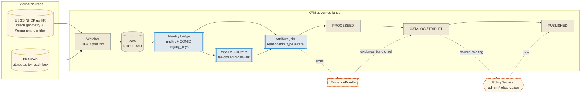

<!-- [KFM_META_BLOCK_V2]
doc_id: kfm://doc/docs-sources-catalog-epa-nhd-rad-attributes
title: EPA NHD / RAD Attributes
type: product-page
version: v0.2
status: draft
owners: <PLACEHOLDER — Docs steward + Source steward for `epa`; co-review with Source steward for `usgs` (reach identity)>
created: 2026-05-20
updated: 2026-05-21
policy_label: public
related:
  - docs/sources/catalog/epa/README.md
  - docs/sources/catalog/usgs/nhdplus-hr.md
  - docs/sources/catalog/README.md
  - docs/doctrine/directory-rules.md
  - data/registry/sources/
  - docs/standards/STAC_KFM_PROFILE.md
  - data/spatial/comid_huc12/
tags: [kfm, docs, sources, catalog, epa, usgs, hydrology, nhd, nhdplus, crosswalk, attributes]
notes:
  - "PROPOSED product-page scaffold. Path `docs/sources/catalog/epa/nhd-rad-attributes.md` is PROPOSED; the `catalog/<family>/<product>` subfolder pattern is NEEDS VERIFICATION against Directory Rules."
  - "Doctrinal subtlety: this is an *attribute join product* with **dual source authority** — NHD/NHDPlus geometry and reach identity are USGS-owned (KFM-P2-IDEA-0021, CONFIRMED); the RAD attributes are EPA-published administrative/regulatory addresses keyed on those reaches. The page lives under `epa/` because the attributes are EPA's, but every claim about reach identity, geometry, and Permanent Identifier defers to the USGS NHDPlus HR product page."
  - "RAD = EPA Reach Address Database (the WATERS service family). NEEDS VERIFICATION: corpus does not explicitly enumerate RAD endpoints; this page treats RAD as the EPA-published reach-attribute family per the scaffold title."
  - "Sibling-link placements (`./README.md`, `../IDENTITY.md`, `../RIGHTS-AND-SENSITIVITY-MAP.md`, `../_examples/`, `../usgs/nhdplus-hr.md`) are PROPOSED only."
[/KFM_META_BLOCK_V2] -->

# EPA NHD / RAD Attributes

> EPA-published reach attributes (HUC12 fields, water-quality reporting addresses, regulatory identifiers) joined to USGS NHDPlus hydrography — an attribute join product, not a geometry source.

[](#)
[](../../../doctrine/directory-rules.md)
[](../IDENTITY.md)
[](../../../domains/hydrology/)
[](../usgs/nhdplus-hr.md)
[](#crosswalk-discipline)
[](#last-reviewed)

**Status:** PROPOSED — scaffold only ·
**Family:** [`epa`](./README.md) ·
**Kind:** Attribute join product (EPA attributes on USGS reaches) ·
**Domain:** Hydrology (`DOM-HYD`) ·
**Owners:** `<PLACEHOLDER — Docs steward + Source steward for epa; co-review with usgs steward>` ·
**Last reviewed:** 2026-05-21

> [!IMPORTANT]
> **This product has dual source authority.** Reach geometry, reach identity, and Permanent Identifier semantics are **USGS-owned** (NHDPlus HR — KFM-P2-IDEA-0021, CONFIRMED). RAD attributes are **EPA-owned** administrative/regulatory addresses keyed on those reaches. Every claim about geometry or identity on this page defers to the [USGS NHDPlus HR product page](../usgs/nhdplus-hr.md). Every claim about an attribute's *meaning* belongs to EPA. **Do not let the `epa/` folder placement obscure the USGS-owned identity stack.**

---

## 📑 On this page

- [Overview](#overview)
- [Why this exists](#why-this-exists)
- [Doctrinal anchors](#doctrinal-anchors)
- [Dual source authority](#dual-source-authority)
- [How RAD attributes attach to NHD reaches](#how-rad-attributes-attach-to-nhd-reaches)
- [Source authority](#source-authority)
- [Identity stack](#identity-stack)
- [Crosswalk discipline](#crosswalk-discipline)
- [Catalog profiles used](#catalog-profiles-used)
- [Collection identity](#collection-identity)
- [Provenance fields (`kfm:provenance`)](#provenance-fields-kfmprovenance)
- [Temporal handling](#temporal-handling)
- [Geometry and projection](#geometry-and-projection)
- [Rights and sensitivity](#rights-and-sensitivity)
- [Validation and catalog closure](#validation-and-catalog-closure)
- [Related contracts and schemas](#related-contracts-and-schemas)
- [Related connectors and pipelines](#related-connectors-and-pipelines)
- [UI affordances](#ui-affordances)
- [Examples](#examples)
- [Open questions](#open-questions)
- [Related docs](#related-docs)

---

## Overview

**CONFIRMED (doctrine).** USGS is the canonical authority for stream-network identity via NHDPlus (KFM-P2-IDEA-0021). Within KFM, **NHDPlus HR Permanent Identifier is the preferred canonical hydrology identity, with COMID retained as legacy compatibility evidence** (KFM-P24-IDEA-0004). Hydrology features derive `kfm_id` from `nhdhr:` plus Permanent Identifier when available (KFM-P24-PROG-0037).

**PROPOSED (product page scope).** This page describes **EPA-published RAD-style attributes** — HUC12 fields, water-quality reporting addresses, regulatory reach identifiers — as they enter KFM by being **joined onto** USGS NHDPlus reaches. RAD itself does not own geometry. It owns the **administrative addressing layer**: which reach is identified by which EPA-side identifier, which HUC12 a reach belongs to, and which regulatory program addresses it.

**NEEDS VERIFICATION:** The corpus does not explicitly enumerate RAD endpoints. This page treats "RAD" as the EPA-published reach-attribute family (Reach Address Database / WATERS service) per the scaffold title. Confirm the precise attribute set, endpoint URL, cadence, license, and rights statement against the live SourceDescriptor before publication.

---

## Why this exists

> [!NOTE]
> Hydrography join keys are the most-used join keys in KFM (KFM-P5-PROG-0008, PROPOSED). If the EPA-attribute → NHD-reach join is non-deterministic, every downstream water-quality, regulatory, or HUC-context layer drifts silently. This page documents the join and its guards so the drift is visible.

The corpus is emphatic that hydrography identity is a **versioned bridge**, not a flat key (KFM-P23-PROG-0018): *"Model NHDPlus HR permanent IDs and legacy COMIDs as a versioned bridge rather than collapsing them into a single identifier."* EPA RAD attributes typically reference reaches by COMID (legacy) and/or Permanent Identifier (current); KFM bridges them through a deterministic crosswalk with explicit relationship typing.

---

## Doctrinal anchors

| Anchor | Source | Why it applies here |
|---|---|---|
| **KFM-P2-IDEA-0021** | USGS as canonical hydrology / streamgage authority | Establishes that reach identity is USGS-owned (CONFIRMED) |
| **KFM-P24-IDEA-0004** | Permanent Identifier over COMID | Canonical identity rule for hydrography (PROPOSED) |
| **KFM-P24-PROG-0037** | NHDHR canonical `kfm_id` rule | `nhdhr:` + Permanent Identifier (PROPOSED) |
| **KFM-P23-PROG-0018** | NHDPlus HR to COMID bridge | Versioned identity bridge (PROPOSED) |
| **KFM-P24-PROG-0033** | NHDPlus HR source descriptor | Framework role, DOI / ScienceBase version, HUC context (PROPOSED) |
| **KFM-P24-PROG-0034** | NHDPlus HR COMID crosswalk descriptor | Records Permanent Identifier, COMID, reach code, feature type, GNIS, HUC12, metrics (PROPOSED) |
| **KFM-P24-PROG-0036** | Crosswalk `relationship_type` enum | exact / split / merge / retired (PROPOSED) |
| **KFM-P24-PROG-0045** | HUC12 context field for hydrography joins | HUC12 preserved in crosswalk/metadata (PROPOSED) |
| **KFM-P24-PROG-0046** | Hydrography identity graph | Permanent IDs, legacy COMIDs, HUC12, reach codes, source versions as a graph with evidence refs (PROPOSED) |
| **KFM-P5-PROG-0008** | Fail-closed COMID-to-HUC12 crosswalk manifest | Deterministic algorithm with fallback order; DSSE-signed manifest (PROPOSED) |
| **KFM-P28-IDEA-0010** | HUC12/COMID crosswalk validation | Schema validation; deterministic relationship typing; fail-on-warning CLI (PROPOSED) |
| **KFM-P28-PROG-0008** | `comid_huc12_crosswalk.schema.json` | Crosswalk schema covering COMID, HUC12, permanent IDs, relationship types, valid time, source descriptor linkage (PROPOSED) |
| **KFM-P24-FEAT-0002** | Hydro identity bridge badge | UI exposes Permanent Identifier, COMID, `relationship_type`, disambiguation status (PROPOSED) |
| **KFM-P2-PROG-0017** | Waterbody crosswalks | NHDPlus + NWIS site + KGS + Mesonet (PROPOSED) |
| **DOM-HYD §24.4.2** | Hydrology owns reach/HUC identity edges | "Reach proximity and HUC context drive…" CONFIRMED doctrine |
| **Source role table (Pass 23)** | Administrative compilation cited as observation → **DENY** | RAD attributes are administrative; must not be cited as observed events (CONFIRMED rule) |

---

## Dual source authority

> [!CAUTION]
> The single most common failure mode for an attribute-join product is **identity-source confusion** — quoting EPA as the authority for reach geometry, or quoting USGS as the authority for a water-quality regulatory address. Each side owns what it owns; neither owns the join.

| Concern | Authority | Where it lives | This page can …? |
|---|---|---|---|
| Reach geometry (line, catchment, drainage) | **USGS** (NHDPlus HR) | [`docs/sources/catalog/usgs/nhdplus-hr.md`](../usgs/nhdplus-hr.md) | Reference only |
| Permanent Identifier / COMID semantics | **USGS** | NHDPlus HR product page + SourceDescriptor | Reference only |
| HUC12 polygon geometry | **USGS** (WBD) | USGS WBD product page (PROPOSED placement) | Reference only |
| RAD attribute values (regulatory addresses) | **EPA** | EPA RAD SourceDescriptor | Reference only |
| HUC12 attribute *value* on a reach | **EPA RAD** (the address) | EPA RAD SourceDescriptor | Reference only |
| The **join** between EPA attributes and USGS reaches | **KFM** (governed crosswalk) | [`data/spatial/comid_huc12/`](../../../../data/spatial/comid_huc12/) (PROPOSED) | Describe |
| Relationship-type semantics (exact/split/merge/retired) | **KFM** (`relationship_type` enum) | crosswalk schema | Describe |

---

## How RAD attributes attach to NHD reaches

> [!NOTE]
> The diagram below renders the **governed join** between an EPA-published attribute and a USGS-owned reach. Stages are CONFIRMED doctrine; specific node labels are PROPOSED.



<sub>NEEDS VERIFICATION: actual normalize/join entry points, route names, and policy-bundle path against mounted-repo evidence.</sub>

---

## Source authority

The authoritative SourceDescriptors **for both sides** of this join live in [`data/registry/sources/`](../../../../data/registry/sources/) per **ADR-0001** and Directory Rules §7.4. **Do not duplicate descriptor fields here.**

| Descriptor | Owner | Source role | What it owns |
|---|---|---|---|
| `usgs/nhdplus-hr` | USGS | `observed` (network identity) | Reach geometry, Permanent Identifier, HUC12 polygons (via WBD) |
| `epa/rad` (PROPOSED) | EPA | `administrative` (with `aggregate` flavor on HUC-scoped attributes) | RAD addresses, EPA reach identifiers, attribute values |

> [!WARNING]
> **Per the Pass-23 source-role table (CONFIRMED doctrine):** *"Administrative compilation cited as observation → DENY publication of compilation as observed event timeline."* RAD attributes describe regulatory or addressing relationships, not observed events. A KFM surface that cites an EPA RAD attribute as an observation is a doctrinal failure, not a UX choice.

---

## Identity stack

> [!IMPORTANT]
> Identity is **versioned and bridged**, not flat (KFM-P23-PROG-0018, KFM-P24-IDEA-0004).

| Identity element | KFM treatment | Source |
|---|---|---|
| **Canonical `kfm_id`** | `nhdhr:<PermanentIdentifier>` when available | KFM-P24-PROG-0037 |
| **Preferred identity** | NHDPlus HR Permanent Identifier | KFM-P24-IDEA-0004 |
| **Legacy compatibility** | COMID retained as `legacy_keys` | KFM-P23-PROG-0018 |
| **Watershed context** | HUC12 preserved in crosswalk / metadata | KFM-P24-PROG-0045 |
| **Reach code / GNIS** | Carried per crosswalk descriptor | KFM-P24-PROG-0034 |
| **Identity-graph projection** | Permanent IDs, COMIDs, HUC12 units, reach codes, source versions linked with evidence refs | KFM-P24-PROG-0046 |
| **NHDPlus version pin** | Recorded on every join Item | KFM-P5-PROG-0008 |

---

## Crosswalk discipline

> [!CAUTION]
> The corpus mandates a **fail-closed, deterministic** COMID → HUC12 crosswalk (KFM-P5-PROG-0008). This is the single most consequential rule for any product joining EPA RAD attributes to NHD reaches: a non-deterministic join produces silent drift across releases.

**PROPOSED — fallback order (per KFM-P5-PROG-0008):**

1. **USGS official crosswalk** for the NHDPlus version pair (when available).
2. **Polygon overlay**, area-weighted majority assignment.
3. **Centroid-in-polygon** assignment.
4. **Snap-to-pour-point** assignment.

Each step records an alignment score; below threshold the join **DENIES** unless a braided-geometry flag is set (KFM-P5-PROG-0008).

**Relationship-type discipline (KFM-P24-PROG-0036):**

| `relationship_type` | Meaning | KFM handling |
|---|---|---|
| `exact` | One reach maps to one reach across versions | Join proceeds |
| `split` | One legacy reach maps to multiple current reaches | Emit per-target Items with `supersedes` |
| `merge` | Multiple legacy reaches map to one current reach | Emit single target with merged `legacy_keys[]` |
| `retired` | Reach no longer exists in current NHD | Tombstone; deny publication on stale reach |

**Schema:** the crosswalk shape lives in `comid_huc12_crosswalk.schema.json` (KFM-P28-PROG-0008, PROPOSED) covering COMID, HUC12, permanent IDs, relationship types, **valid time**, and source descriptor linkage.

**Manifest:** the crosswalk artifact is a **DSSE-signed manifest** carrying both descriptor `spec_hash` and release content hash (KFM-P5-PROG-0008).

---

## Catalog profiles used

**PROPOSED — Pass-10 / C4 profiles.**

| Profile | Lane (path) | Used by this product? | Notes |
|---|---|---|---|
| **STAC** with `kfm:provenance` | `data/catalog/stac/` | PROPOSED — Yes for joined Items | Geometry deferred to NHDPlus HR Collection; this product's Items reference reach Items via STAC links |
| **DCAT** distribution | `data/catalog/dcat/` | PROPOSED — Yes for the RAD attribute distribution | C4-05 |
| **PROV-O** lineage | `data/catalog/prov/` | PROPOSED — Yes; PROV `wasGeneratedBy` ties joined attributes back to RAD + NHDPlus inputs | C4-04 |
| **Domain projection** | `data/catalog/domain/hydrology/` | PROPOSED — Yes (Hydrology domain model surfaces `ReachIdentity` + `HUCUnit`) | NEEDS VERIFICATION |
| **STAC × DwC hybrid** | — | **No** | Biodiversity-only (C4-03); not applicable |

---

## Collection identity

- **PROPOSED Collection id pattern (joined attributes):** `kfm-epa-nhd-rad-attributes` (see [`IDENTITY.md`](../IDENTITY.md)).
- **PROPOSED namespace:** `kfm:` *(see OPEN-DSC-03; namespace choice between `kfm:` and `ks-kfm:` remains open — Pass-10 C4-01).*
- **Identity rule** (per DOM-HYD): PROPOSED deterministic basis = source id + object role + temporal scope + normalized digest; `ReachIdentity` and `HUCUnit` are the relevant object families.
- **Asset roles:** NEEDS VERIFICATION — confirm against `schemas/contracts/v1/source/` and `contracts/domains/hydrology/`.

> [!TIP]
> If RAD publishes multiple distinct attribute families (e.g., HUC12 fields vs. water-quality reporting addresses), consider **separate Collections per family** rather than packing everything into one. Renaming a Collection breaks every Item that references it (C4-02).

---

## Provenance fields (`kfm:provenance`)

When a joined attribute STAC Item is emitted, its `item.properties.kfm:provenance` block carries provenance for **both** inputs (the EPA RAD source and the USGS NHDPlus version) plus the crosswalk used. Block shape is **CONFIRMED** doctrine (Pass-10 C4-01); specific values are **PROPOSED**.

| Field | Resolves to | Required? | Notes for joined Items |
|---|---|---|---|
| `spec_hash` | sha256 of the canonical record | MUST | Includes both EPA attribute payload and USGS identity bindings |
| `evidence_bundle_ref` | `kfm://evidence/<digest>` → EvidenceBundle | MUST | Bundle carries both source descriptors + crosswalk manifest |
| `run_record_ref` | `kfm://run/<run-id>` → RunReceipt | MUST | Records crosswalk version, fallback step used, alignment score |
| `audit_ref` | `kfm://audit/<attestation-id>` | MUST | SLSA / OPA attestation (C5-08) |
| `policy_digest` | sha256 of the policy bundle at promotion | MUST | Includes source-role + admin-not-observation rules |
| (per-asset) `file:checksum` | sha256 of asset bytes | MUST | C3-02 |

<details>
<summary><b>Reference: extra lineage fields specific to a joined RAD-on-NHD Item (illustrative — not authoritative)</b></summary>

```text
# Inside kfm:provenance or its run_record:
nhdplus_version            <version pin from USGS NHDPlus HR descriptor>
rad_publication_version    <version pin from EPA RAD descriptor>
crosswalk_manifest_digest  <sha256 of DSSE-signed crosswalk manifest>
crosswalk_method           "usgs_official" | "polygon_overlay" |
                           "centroid_in_polygon" | "snap_to_pour_point"
alignment_score            float
relationship_type          "exact" | "split" | "merge" | "retired"
legacy_keys                [ "comid:<id>", ... ]
permanent_identifier       "<NHDPlus HR PermanentIdentifier>"
huc12                      "<12-digit HUC>"
source_role                "administrative" (with aggregate flavor where applicable)
```

PROPOSED only. Authoritative shape lives in `schemas/contracts/v1/` (path NEEDS VERIFICATION).

</details>

---

## Temporal handling

A joined RAD-on-NHD Item has more time dimensions than a typical observation, because two version pins and a crosswalk version all participate.

| Time | Meaning | Required? |
|---|---|---|
| `source_time` (RAD) | EPA's publication time of the attribute snapshot | MUST |
| `source_time` (NHDPlus) | USGS's NHDPlus HR version reference time | MUST |
| `valid_time` | Period the attribute address is valid for | MUST when applicable |
| `retrieval_time` | When KFM watcher fetched the inputs | MUST |
| `crosswalk_applied_time` | When the deterministic crosswalk was computed for this Item | MUST |
| `release_time` | When KFM published the joined artifact | MUST at publication |
| `correction_time` | When a joined Item is superseded (new NHDPlus version, new RAD snapshot, or retired reach) | MUST when emitted |

> [!NOTE]
> When NHDPlus HR is re-versioned or RAD is re-published, joined Items are not silently overwritten. New Items are emitted with new `crosswalk_applied_time` and `supersedes` pointers; `retired` reaches emit tombstones (KFM-P24-PROG-0036 + C5-09).

---

## Geometry and projection

**PROPOSED — geometry is borrowed, not authored here.**

| Concern | PROPOSED handling | Status |
|---|---|---|
| Geometry type | LineString (reach) or Polygon (HUC12 / catchment) per NHDPlus HR | NEEDS VERIFICATION |
| CRS | EPSG:4326 in catalog; native projection preserved in EvidenceBundle | NEEDS VERIFICATION |
| Geometry source | **USGS NHDPlus HR** — never authored by this product | CONFIRMED rule |
| Generalization | Per-zoom rules live on NHDPlus HR product; this product inherits | NEEDS VERIFICATION |
| STAC Projection extension | Required on promotion (KFM-P27-FEAT-0003 PROPOSED) | NEEDS VERIFICATION |

> [!WARNING]
> **This product does not own geometry.** Any change to reach geometry, catchment polygon, or HUC12 polygon belongs to the USGS NHDPlus HR product page and the USGS WBD descriptor — not here. Items joined by this product reference upstream geometry by Permanent Identifier.

---

## Rights and sensitivity

**NEEDS VERIFICATION.** See [`policy/sensitivity/`](../../../../policy/sensitivity/) and [`RIGHTS-AND-SENSITIVITY-MAP.md`](../RIGHTS-AND-SENSITIVITY-MAP.md). **Do not restate policy here.**

> [!CAUTION]
> Rights concerns for this product fall in **three** distinct lanes:
>
> 1. **USGS NHDPlus HR** — federally published, typically CC0 / public domain. Rights live on the USGS product page.
> 2. **EPA RAD attributes** — federally published; rights typically permissive but NEEDS VERIFICATION for the current publication.
> 3. **Derived joined product** — KFM's join carries its own attribution: cite *both* source authorities, plus the crosswalk manifest digest, on any public surface.

The Pass-23 source-role table also flags two cross-domain risks that apply here:

- **"Administrative compilation cited as observation"** → **DENY** publication of compilation as observed event timeline. RAD is administrative; never present a RAD reach address as an observation.
- **"Aggregate cited as a per-place truth"** → **DENY** join from aggregate cell to single record; **ABSTAIN at AI**. HUC12-scoped attributes are aggregate; do not present a HUC12 value as a per-reach truth without explicit aggregation-receipt handling.

---

## Validation and catalog closure

| Gate | Source | Status |
|---|---|---|
| **Catalog closure** before public release | Pass-10 / KFM-P1-IDEA-0020 | Required (CONFIRMED doctrine) |
| **Crosswalk manifest verification** | KFM-P5-PROG-0008 | PROPOSED — fail-closed, DSSE-signed |
| **Schema validation** of crosswalk artifact | KFM-P28-IDEA-0010 / KFM-P28-PROG-0008 | PROPOSED |
| **`relationship_type` discipline** | KFM-P24-PROG-0036 | PROPOSED — exact/split/merge/retired all handled |
| **Alignment-score gate** | KFM-P5-PROG-0008 | PROPOSED — below threshold + no braided-flag → DENY |
| **STAC Projection lint** | KFM-P27-FEAT-0003 | PROPOSED |
| **STAC checksum closure** against ReleaseManifest digest | KFM-P22-PROG-0037 | PROPOSED |
| **Spec-hash-match** gate | C5-04 | CONFIRMED doctrine |
| **Source-role rule** (admin ≠ observation; aggregate ≠ per-place) | Pass-23 source-role table | CONFIRMED doctrine |
| **Lineage required** (OpenLineage → receipts) | C5-08 | CONFIRMED doctrine |

> [!TIP]
> A useful CI invariant is **release-pair replay**: for a fixed (NHDPlus version, RAD snapshot, crosswalk manifest digest) triple, re-running the join must produce byte-identical Items (KFM-P5-PROG-0010 replay verification, applied to crosswalk artifacts). Replay drift = build break.

---

## Related contracts and schemas

| Concern | PROPOSED home | Status |
|---|---|---|
| NHDPlus HR SourceDescriptor | `schemas/contracts/v1/source/source-descriptor.json` (USGS instance) | PROPOSED per ADR-0001; NEEDS VERIFICATION |
| RAD SourceDescriptor | `schemas/contracts/v1/source/source-descriptor.json` (EPA instance) | PROPOSED |
| `comid_huc12_crosswalk.schema.json` | `schemas/contracts/v1/spatial/` (KFM-P28-PROG-0008) | PROPOSED |
| NHDPlus HR COMID crosswalk descriptor | per KFM-P24-PROG-0034 | PROPOSED |
| Hydrology domain contracts | `contracts/domains/hydrology/` | PROPOSED |
| EvidenceBundle / EvidenceRef | `schemas/contracts/v1/evidence/` | PROPOSED |
| DecisionEnvelope | `schemas/contracts/v1/runtime/decision_envelope.schema.json` (KFM-P5-PROG-0001) | PROPOSED |

> [!NOTE]
> Per Directory Rules §7.4 and ADR-0001, schemas live under `schemas/contracts/v1/...`. **Do not propose a parallel schema home** for crosswalk shapes. The fail-closed crosswalk manifest lives under `data/spatial/comid_huc12/<NHDPlus_version>/<WBD_version>/manifest.json` per KFM-P5-PROG-0008.

---

## Related connectors and pipelines

- **Connectors:**
  - [`connectors/epa/`](../../../../connectors/epa/) — fetches RAD attribute payloads.
  - [`connectors/usgs/`](../../../../connectors/usgs/) — fetches NHDPlus HR identity, reach geometry, WBD HUC12 polygons.
- **Pipelines:**
  - [`pipelines/ingest/`](../../../../pipelines/ingest/) — RAW capture for both sides.
  - [`pipelines/normalize/`](../../../../pipelines/normalize/) — identity bridge (`nhdhr:` + COMID `legacy_keys`); attribute schema canonicalization.
  - [`pipelines/validate/`](../../../../pipelines/validate/) — crosswalk schema validation, alignment-score gate, `relationship_type` discipline.
  - [`pipelines/catalog/`](../../../../pipelines/catalog/) — STAC / DCAT / PROV emission for joined Items.
- **Pipeline spec:** [`pipeline_specs/hydrology/`](../../../../pipeline_specs/hydrology/)
- **Spatial artifact:** [`data/spatial/comid_huc12/`](../../../../data/spatial/comid_huc12/) — fail-closed manifest (KFM-P5-PROG-0008)

> [!WARNING]
> Linked paths are PROPOSED. Mounted-repo evidence has not been inspected; every path is NEEDS VERIFICATION.

---

## UI affordances

**PROPOSED — KFM-P24-FEAT-0002 (Hydro identity bridge badge):**

When a joined RAD-on-NHD Item is rendered in any public-facing surface (Evidence Drawer, layer popup, Focus Mode panel), the **identity bridge badge** must expose:

- The Permanent Identifier (canonical).
- The legacy COMID(s), if any (compatibility evidence).
- The `relationship_type` (exact / split / merge / retired).
- The disambiguation status (clean / contested / superseded).

This is doctrine, not decoration: it is the affordance that makes the dual-authority join inspectable to the reader (KFM-P24-FEAT-0002, PROPOSED).

---

## Examples

*Illustrative only — do not treat as authoritative.*

See [`_examples/stac-item-example.json`](../_examples/stac-item-example.json) for the minimal STAC + `kfm:provenance` shape applied to a Barkjohn-corrected … wait, see the RAD-on-NHD example specifically at the NHDPlus HR product page once it exists. Until then, the example must round-trip through:

1. Spec-hash recomputation (C5-04).
2. EvidenceBundle resolution including **both** source descriptors and the crosswalk manifest.
3. Crosswalk manifest signature verification (DSSE).
4. Schema validation against `comid_huc12_crosswalk.schema.json`.
5. `relationship_type` discipline (no silent collapses).
6. Source-role rule check (admin ≠ observation; aggregate ≠ per-place).
7. STAC validator + Projection lint.
8. Release-pair replay verification.

…before it counts as a valid joined-RAD-on-NHD Item shape.

---

## Open questions

- **OPEN-RAD-01** — What is the precise RAD attribute family scope KFM admits (HUC12 fields, water-quality reporting addresses, regulatory program codes, all of the above)? Confirm against the SourceDescriptor.
- **OPEN-RAD-02** — Should each RAD attribute family (HUC12 vs. water-quality reporting vs. regulatory codes) have its own Collection, or share one? Doctrine implies **separate where attribute semantics differ materially** (C4-02 Expansion).
- **OPEN-RAD-03** — How are split/merge events surfaced to readers — automatically via the identity bridge badge, or via a dedicated supersession history panel?
- **OPEN-RAD-04** — What is the threshold for the alignment-score gate (KFM-P5-PROG-0008)? The corpus notes <0.5 without braided-flag is common and may need tuning.
- **OPEN-HYD-01** — *(From KFM-P5-PROG-0008.)* When NHDPlus v2.1 is fully superseded by 3DHP, does the crosswalk become COMID → 3DHP `universal_reference_id` → HUC12, or does HUC12 itself get superseded? The corpus does not resolve this.
- **OPEN-DSC-03** — STAC namespace choice: `kfm:` (global) or `ks-kfm:` (Kansas-scoped)?
- **OPEN-PATH-01** — Confirm `docs/sources/catalog/epa/nhd-rad-attributes.md` placement against Directory Rules and mounted-repo evidence.
- **OPEN-PATH-02** — Is `docs/sources/catalog/epa/` the right home for an attribute-join product whose identity layer is USGS? Or should a `docs/sources/catalog/_joins/` lane exist for cross-authority products? File an ADR if the latter.

---

## Related docs

- [`docs/sources/catalog/epa/README.md`](./README.md) — `epa` family landing page (PROPOSED).
- [`docs/sources/catalog/usgs/nhdplus-hr.md`](../usgs/nhdplus-hr.md) — **USGS NHDPlus HR** product page (PROPOSED placement; the identity-and-geometry side of this join).
- [`docs/sources/catalog/usgs/nwis.md`](../usgs/nwis.md) — USGS NWIS streamgage product (PROPOSED placement; sibling waterbody crosswalk per KFM-P2-PROG-0017).
- [`docs/sources/catalog/epa/aqs-airdata.md`](./aqs-airdata.md) — EPA AQS / AirData (sibling EPA product page; different domain).
- [`docs/sources/catalog/README.md`](../../README.md) — Sources catalog index (PROPOSED).
- [`docs/sources/catalog/epa/IDENTITY.md`](../IDENTITY.md) — Collection-id and namespace conventions (PROPOSED placement).
- [`docs/sources/catalog/epa/RIGHTS-AND-SENSITIVITY-MAP.md`](../RIGHTS-AND-SENSITIVITY-MAP.md) — Family-level rights map (PROPOSED placement).
- [`docs/doctrine/directory-rules.md`](../../../doctrine/directory-rules.md) — Authority boundaries and schema-home discipline.
- [`docs/domains/hydrology/`](../../../domains/hydrology/) — Hydrology domain doctrine (DOM-HYD).
- [`docs/standards/STAC_KFM_PROFILE.md`](../../../standards/STAC_KFM_PROFILE.md) — STAC `kfm:provenance` profile (PROPOSED).
- [`data/registry/sources/`](../../../../data/registry/sources/) — Canonical SourceDescriptor home (ADR-0001).
- [`data/spatial/comid_huc12/`](../../../../data/spatial/comid_huc12/) — Fail-closed crosswalk manifest (KFM-P5-PROG-0008; PROPOSED placement).
- [`docs/adr/ADR-0001-schema-home.md`](../../../adr/ADR-0001-schema-home.md) — Schema-home rule.

---

## Last reviewed

**2026-05-21** — Claude product-page polish pass; dual-source-authority framing applied; identity-stack and crosswalk-discipline sections added; source-role rules surfaced. Prior scaffold dated 2026-05-20.

---

<sub>📄 Product page · v0.2 · PROPOSED scaffold · <a href="#epa-nhd--rad-attributes">↑ Back to top</a></sub>
