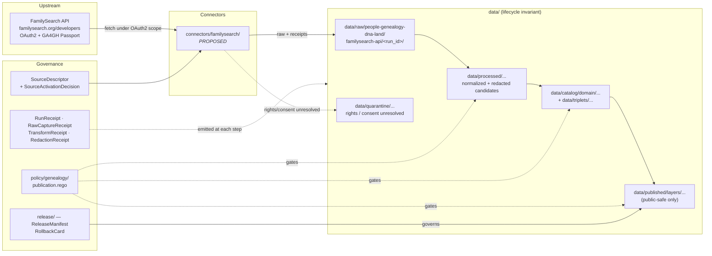
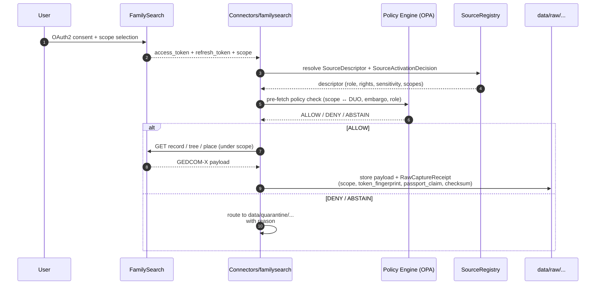
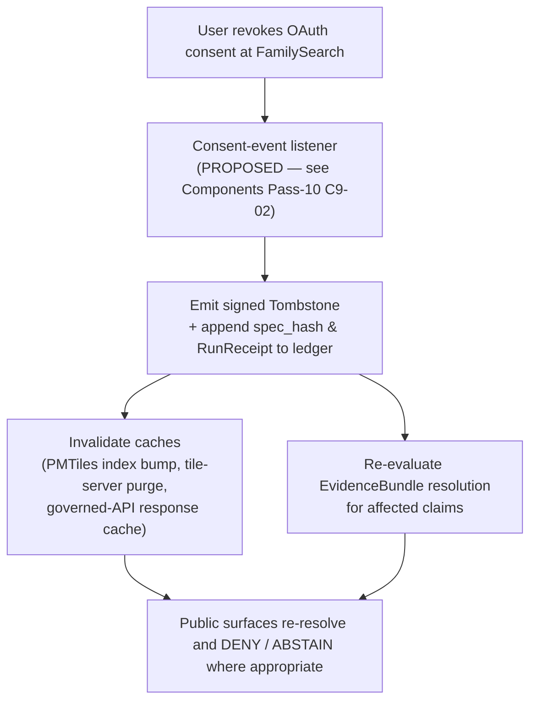

<!-- [KFM_META_BLOCK_V2]
doc_id: kfm://doc/source-catalog-familysearch
title: FamilySearch — Source Catalog Entry
type: standard
version: v0.2
status: draft
owners: Docs steward + People-Genealogy-DNA-Land domain owner + Source-registry steward
created: 2026-05-13
updated: 2026-05-21
policy_label: public
related:
  - docs/sources/SOURCE_DESCRIPTOR_STANDARD.md
  - docs/sources/catalog/README.md
  - docs/domains/people-genealogy-dna-land/README.md
  - docs/doctrine/directory-rules.md
  - schemas/contracts/v1/source/source-descriptor.schema.json
  - data/registry/sources/people-genealogy-dna-land/
  - connectors/familysearch/README.md
  - policy/genealogy/publication.rego
  - docs/standards/DUO_MAPPING.md
  - docs/policy/familysearch-retention.md
tags: [kfm, source-catalog, genealogy, c9-02, oauth2, ga4gh, gedcom-x, sensitive, dom-people]
notes:
  - "Path `docs/sources/catalog/familysearch.md` is PROPOSED; the `docs/sources/` subtree currently has only `docs/sources/SOURCE_DESCRIPTOR_STANDARD.md` as a PROPOSED file in prior reports — see §1 and Directory Rules §3. The `catalog/<source>` subfolder pattern is NEEDS VERIFICATION against mounted-repo state and may not match a sibling pattern of `docs/sources/catalog/<family>/<product>` used elsewhere."
  - "This doc is the human-readable per-source briefing. The machine-readable SourceDescriptor record lives under `data/registry/sources/<domain>/`; the JSON Schema lives under `schemas/contracts/v1/source/`."
  - "No claim is made that the FamilySearch connector, SourceActivationDecision, or any related schema is implemented in the current repo."
  - "v0.2 revision: added Doctrinal anchors table; cross-referenced Pass-23 atlas cards (KFM-P1-IDEA-0033, KFM-P15-PROG-0034) that carry the C9 posture forward; added C9-07 (23andMe Chapter 11) vendor-risk note; tightened §10 gates with explicit spec-hash-match (C5-04) and lineage-required (C5-08) items; cleaned badge encoding."
[/KFM_META_BLOCK_V2] -->

# 🧬 FamilySearch — Source Catalog Entry

> **Human-readable briefing for the FamilySearch upstream.** Tracks identity, source role, rights posture, access method, consent and revocation behavior, sensitivity class, lifecycle handling, and the governance gates that must be satisfied before any FamilySearch-derived material crosses the publication boundary. **Not authoritative for runtime decisions** — the machine-readable `SourceDescriptor` and the policy bundle govern admission, promotion, and release.

[](#)
[](#-doctrinal-anchors)
[](#-doctrinal-anchors)
[](../domains/people-genealogy-dna-land/README.md)
[-blue)](#3-what-this-source-is-what-it-is-not)
[](#6-sensitivity-rights-and-the-deny-by-default-posture)
[](#5-access-oauth2-and-the-ga4gh-overlay)
[](#10-gates-before-publication)

| Field | Value |
|---|---|
| **Doc type** | Standard doc — source catalog entry |
| **Status** | `draft` (v0.2) |
| **Owners** | Docs steward · People-Genealogy-DNA-Land domain owner · Source-registry steward |
| **Last updated** | 2026-05-21 |
| **Authority of this doc** | **Explains** the source. Does not decide admission. See `data/registry/sources/...` and `policy/genealogy/...` for decisions. |
| **Source ID (PROPOSED)** | `familysearch-api` |
| **Upstream** | FamilySearch Developer Platform — `https://www.familysearch.org/developers/` |
| **Governance category** | **C9 Genealogy and Genomics** → **C9.b Genealogical APIs** (per Components Pass-10 dossier) |

---

## 📚 Quick jump

- [Doctrinal anchors](#-doctrinal-anchors)
- [1. Scope and path posture](#1-scope-and-path-posture)
- [2. Repo fit and lifecycle](#2-repo-fit-and-lifecycle)
- [3. What this source is, what it is not](#3-what-this-source-is-what-it-is-not)
- [4. Source descriptor (PROPOSED shape)](#4-source-descriptor-proposed-shape)
- [5. Access, OAuth2, and the GA4GH overlay](#5-access-oauth2-and-the-ga4gh-overlay)
- [6. Sensitivity, rights, and the deny-by-default posture](#6-sensitivity-rights-and-the-deny-by-default-posture)
- [7. Lifecycle and run-receipt envelope](#7-lifecycle-and-run-receipt-envelope)
- [8. Revocation, tombstones, and cache invalidation](#8-revocation-tombstones-and-cache-invalidation)
- [9. Normalization, anchoring, and CIDOC-CRM projection](#9-normalization-anchoring-and-cidoc-crm-projection)
- [10. Gates before publication](#10-gates-before-publication)
- [11. Known tensions and open questions](#11-known-tensions-and-open-questions)
- [12. Related docs](#12-related-docs)
- [Appendix A — Field index and citations](#appendix-a--field-index-and-citations)

---

## 🧭 Doctrinal anchors

> [!NOTE]
> The cards below are the load-bearing project-knowledge entries this briefing depends on. Components Pass-10 is the C-series spine; Pass-23 / Pass-32 atlas IDs (`KFM-P*`) confirm the carry-forward into the current doctrinal layer.

| Anchor | Source | Why it applies here |
|---|---|---|
| **C9-01** | GEDCOM 5.5 and GEDCOM-X for genealogical interchange | Interchange formats; CIDOC-CRM E21 normalization (CONFIRMED Pass-10) |
| **C9-02** | FamilySearch API as genealogy upstream | This page's core source card (CONFIRMED Pass-10) |
| **C9-03** | DTC Raw-Genomic Exports (23andMe, Ancestry, MyHeritage) | Adjacent C9 sibling; consent overlap (CONFIRMED Pass-10) |
| **C9-04** | GA4GH AAI / Passports / DUO / MRCG | Consent and access-control framework (CONFIRMED Pass-10) |
| **C9-07** | 23andMe Chapter 11, March 2025 | Vendor-risk watchlist trigger; hardens consent / revocation posture (CONFIRMED Pass-10; see §11) |
| **C5-09** | Tombstones for revocation | Revocation → signed tombstone + ledger append (CONFIRMED Pass-10) |
| **C6-06** | k-anonymity for living-person overlays | Default profile `k=10`, `cell_m=500`, fallback `radius_mask=250m` (CONFIRMED Pass-10) |
| **C6-07** | Consent Tokens | JWT shape; OAuth introspection; PDP enforcement (CONFIRMED Pass-10) |
| **C6-08** | Revocation endpoints, embargo timestamps, cache invalidation | Render-time enforcement (CONFIRMED Pass-10) |
| **C8-01** | CIDOC-CRM core classes (E5/E7/E21/E53/E55/E74) | Graph backbone for persons, places, events (CONFIRMED Pass-10) |
| **C8-03** | PROV-O and PAV | Claim-level provenance (CONFIRMED Pass-10) |
| **C8-04** | Evidence-Bundle JSON-LD (content-addressed) | Wrapping graph fragments with evidence (CONFIRMED Pass-10) |
| **C7-09** | USGS GNIS for U.S. place authority | Place anchoring (CONFIRMED Pass-10) |
| **KFM-P1-IDEA-0033** | Living-person, DNA, and genomic restriction posture | Pass-23 carry-forward of the C9 sensitivity stance (PROPOSED) |
| **KFM-P15-PROG-0034** | Genealogy and genomics uploads governance | Auditable consent, policy-aware tokens, conservative aggregation, minimum cell sizes (PROPOSED) |
| **DOM-PEOPLE** | Domains Atlas People/Genealogy/DNA/Land | Object families (`Person Assertion`, `PersonCanonical`, `NameAssertion`); domain rules |
| **Directory Rules §§3, 4, 7.3, 7.4** | Placement law | `docs/` explains, `connectors/` fetches, `data/raw/` captures, schemas under `schemas/contracts/v1/...` |
| **ADR-0001** | Schema home rule | Establishes `schemas/contracts/v1/source/source-descriptor.schema.json` as canonical home |
| **`ai-build-operating-contract.md` §34** | RunReceipt / GENERATED_RECEIPT requirements | Receipt envelope and validation gates (CONFIRMED contract) |

[Back to top](#-familysearch--source-catalog-entry)

---

## 1. Scope and path posture

> [!NOTE]
> **Path is PROPOSED.** `docs/sources/catalog/familysearch.md` is a placement inference based on (a) prior reports proposing `docs/sources/SOURCE_DESCRIPTOR_STANDARD.md`, (b) Directory Rules §3 — `docs/` owns human explanation, and (c) the lane pattern that domain-specific docs live as **segments**, not roots. A `docs/sources/catalog/` subfolder has not been verified against mounted repo state. Sibling product pages elsewhere in this docs tree use `docs/sources/catalog/<family>/<product>.md` (e.g. EPA AQS); the choice between a flat `docs/sources/catalog/familysearch.md` placement and a nested `docs/sources/catalog/familysearch/README.md` placement is **NEEDS VERIFICATION** until codified by ADR.

This document is a **per-source briefing**, not a contract, schema, or policy. It explains:

- What FamilySearch is, from KFM's point of view;
- What role its records play in the People-Genealogy-DNA-Land domain;
- How access, consent, and revocation are governed;
- What lifecycle and gates apply before any derived material is released.

Authoritative artifacts live elsewhere:

| Concern | Authority |
|---|---|
| **Object meaning** of `SourceDescriptor` | `contracts/` |
| **Machine shape** of `SourceDescriptor` | `schemas/contracts/v1/source/source-descriptor.schema.json` (PROPOSED per ADR-0001 schema-home) |
| **Allow / deny / restrict / abstain** | `policy/genealogy/...` |
| **Concrete source record** for FamilySearch | `data/registry/sources/people-genealogy-dna-land/familysearch-api.<ext>` (PROPOSED) |
| **Fetch and admission** | `connectors/familysearch/` (PROPOSED) |
| **Activation gate** | `SourceActivationDecision` issued via the source-registry workflow |

Conformance words follow RFC 2119 style: **MUST**, **MUST NOT**, **SHOULD**, **MAY**.

[Back to top](#-familysearch--source-catalog-entry)

---

## 2. Repo fit and lifecycle



> [!IMPORTANT]
> **Connectors do not publish.** Per Directory Rules §7.3, the FamilySearch connector MUST write only to `data/raw/people-genealogy-dna-land/familysearch-api/<run_id>/` or `data/quarantine/...` — never to `data/processed/`, `data/catalog/`, or `data/published/`. Promotion is a **governed state transition, not a file move.**

The lifecycle invariant — **RAW → WORK / QUARANTINE → PROCESSED → CATALOG / TRIPLET → PUBLISHED** — applies in full to FamilySearch material. Skipping a phase is a doctrine violation regardless of how clean the upstream record appears to be.

[Back to top](#-familysearch--source-catalog-entry)

---

## 3. What this source is, what it is not

**CONFIRMED doctrine.** The FamilySearch API is KFM's **primary upstream for live genealogical data** (Components Pass-10, idea **C9-02**). It is selected for three reasons:

1. **Scale.** It holds the largest publicly-accessible genealogical record set in the U.S.; credible genealogical work in KFM is not possible without it.
2. **Native GEDCOM-X serialization.** It emits modern GEDCOM-X (JSON/XML) directly, avoiding lossy round-trips through legacy GEDCOM 5.5 (idea **C9-01**).
3. **Consent-aware API.** OAuth2 scopes and the GA4GH Passport overlay make consent **enforceable**, not aspirational (idea **C9-04**).

> [!CAUTION]
> **What FamilySearch is *not*.** It is **not** an authority for living-person identity, **not** a substitute for vital records, **not** a deeds/title authority, and **not** a DNA evidence source. Trees are **community-contributed hypotheses**, not assertions of fact, and the descriptor record MUST reflect that.

### Source-role mapping (PROPOSED)

The People-Genealogy-DNA-Land domain dossier and the Domains Atlas describe genealogical material as `authority / observation / context / model` "as source role requires" — i.e., the role depends on the specific record subset. The PROPOSED mapping is:

| FamilySearch record subset | PROPOSED `source_role` | Rationale |
|---|---|---|
| Indexed historical record images (census, vital, church, etc.) | `observation` (scoped) | Source-document evidence with a date and place — admissible as observation under People-domain rules. |
| Community-contributed tree nodes / Family Tree person records | `candidate` | Hypotheses authored by contributors; **must** carry `role_candidate_disposition` and **must not** appear on PUBLISHED edges until merged. |
| FamilySearch Places / authorities (place IDs) | `context` | Used for anchoring, not as the primary place authority — anchor against GNIS / TGN with confidence scoring (idea **C9-06**, **C7-09**). |
| Aggregated record counts / index summaries | `aggregate` | If used, MUST carry `role_aggregation_unit` to prevent geometry-scope drift on join. |

> [!NOTE]
> The `source_role` enum and its required co-fields are described in the Domains Atlas §24.1.3 (PROPOSED descriptor surface) and remain **PROPOSED** until the mounted `source_descriptor.schema.json` is verified. The Pass-23 source-role table additionally rules: *"Administrative compilation cited as observation → DENY publication of compilation as observed event timeline"* — FamilySearch tree records are **administrative compilations** and must not be cited as observed events.

[Back to top](#-familysearch--source-catalog-entry)

---

## 4. Source descriptor (PROPOSED shape)

The descriptor below is the **human-readable view** of the record that lives under `data/registry/sources/people-genealogy-dna-land/familysearch-api.<ext>`. Fields and their normative shapes belong to `schemas/contracts/v1/source/source-descriptor.schema.json` — **this doc does not define them**.

| Field | PROPOSED value for FamilySearch | Notes |
|---|---|---|
| `source_id` | `familysearch-api` | Stable. Renames require a new descriptor + `CorrectionNotice`. |
| `source_role` | per-subset (see §3) | Set at admission. Never edited in place. |
| `role_authority` | `FamilySearch International` (when `aggregate` or `administrative`) | Disambiguates downstream citation text. |
| `role_candidate_disposition` | `pending` (default for tree records) | `pending \| merged \| rejected \| quarantined`. PUBLISHED edge forbidden until `merged`. |
| `authority` | Org: FamilySearch International; cooperative steward: KFM People-Genealogy domain owner | Disambiguates issuing body. |
| `rights` | Per FamilySearch Developer Terms of Use + per-record license metadata returned by the API | **NEEDS VERIFICATION:** current terms must be re-checked at every connector revision. |
| `access` | OAuth 2.0 authorization-code flow; per-user consent scopes; GA4GH Passport overlay | See §5. |
| `cadence` | On-demand per user request; no bulk crawl | Bulk fetch is **out of scope** under default rights posture. |
| `sensitivity` | High — living-person fields, location precision, family-graph relationships | See §6. |
| `citation_rules` | Cite the FamilySearch record URL or persistent identifier plus contributor attribution; preserve raw record under `data/raw/...` for re-examination | Verbatim original strings preserved per idea **C9-06**. |
| `freshness_expectations` | Records can change as contributors edit trees; treat tree subsets as snapshot-in-time. | Snapshot timestamp MUST appear in the receipt. |
| `public_release_class` | **default DENY for living-person fields**; aggregated / k-anonymized derivations only after policy + review pass | See §6 and §10. |
| `vendor_risk_class` | **watchlist** — see C9-07 (23andMe Chapter 11) precedent; vendor-solvency or terms-of-service shifts may change posture without notice | NEEDS VERIFICATION |

> [!TIP]
> Treat this table as a worked example, not as the schema. The authoritative field list and types live in the schema file. Discrepancies are tracked in `docs/registers/DRIFT_REGISTER.md`.

[Back to top](#-familysearch--source-catalog-entry)

---

## 5. Access, OAuth2, and the GA4GH overlay

**CONFIRMED doctrine (idea C9-02).** Access uses **OAuth2 with consent scopes**. KFM **MUST**:

- Register an OAuth2 client with FamilySearch and store credentials in `infra/` / secret stores — never in `configs/` (Directory Rules §5).
- Operate a **token-refresh agent** so long-running sessions do not silently expire.
- Map FamilySearch OAuth2 scopes to **GA4GH Data Use Ontology (DUO)** codes (idea **C9-04**) so the policy engine can reason about consent uniformly across genealogy and genomics.
- Record on every fetch:
  - the **OAuth2 grant scope** that was active;
  - the **`access_token` fingerprint** — a one-way hash of the token, **never** the token itself;
  - the **GA4GH Passport claim** used at fetch time;
  - the **response checksum**.



> [!WARNING]
> **The `access_token` is a secret. The token fingerprint is not.** The receipt MUST record only the fingerprint. Storing the bearer token in any receipt, log, or descriptor is a hard violation of the trust-membrane posture.

[Back to top](#-familysearch--source-catalog-entry)

---

## 6. Sensitivity, rights, and the deny-by-default posture

**CONFIRMED doctrine (Encyclopedia §13 Sensitive / Deny-by-Default Register).** Living-person identity and DNA/genomic linkage are **DENY by default** for public release. FamilySearch material commonly contains both, so the catalog entry inherits the strictest posture.

The Pass-23 atlas carries this stance forward:

- **KFM-P1-IDEA-0033** (Pass-23, PROPOSED): *"Living-person and DNA/genomic information should be restricted by default and exposed only through evidence-bound, consent-aware, policy-approved surfaces."*
- **KFM-P15-PROG-0034** (Pass-23, PROPOSED): *"Genealogy and genomics uploads should be treated as user assets requiring auditable consent, policy-aware access tokens, conservative aggregation, and minimum cell-size controls."*

| Risk class | Default | Required controls |
|---|---|---|
| **Living persons** — names, residences, identity assertions | **DENY** public exact / identifying output | privacy review · redaction · aggregate · staged access |
| **Family graph involving living persons** | **DENY** clear-view publication unless **k-anonymity** is met (idea **C6-06**, default profile `density_k_anonymity_grid` with `k=10`, `cell_m=500`, fallback `radius_mask=250m`) | PDP gate + receipt |
| **Place strings tied to living-person residences** | **DENY** exact public location | geographic generalization receipt |
| **Tree records as "evidence"** | **DENY** publication of tree-only assertions as observed events | preserve `source_role=candidate`; require corroborating `observation` |
| **Rights-limited or unclear-rights records** | **DENY** public release until terms resolved | rights register entry; `RightsDecision` |
| **Aggregate cited as a per-place truth** | **DENY** join from aggregate cell to single record; **ABSTAIN at AI** | aggregation receipt; geometry-scope guard (Pass-23 source-role table) |

> [!CAUTION]
> **No public-safe rendering of a FamilySearch record is automatic.** Every transform that crosses the publication boundary MUST emit a `RedactionReceipt` (sensitive transforms) or `AggregationReceipt` (geometry-scope aggregations), and the `EvidenceBundle` MUST resolve before publication. The renderer never invents truth; the AI surface never substitutes for evidence.

[Back to top](#-familysearch--source-catalog-entry)

---

## 7. Lifecycle and run-receipt envelope

Every fetch from FamilySearch is a **governed operation** and produces a **receipt**. Per the Encyclopedia Feature Index and `ai-build-operating-contract.md` §34, the receipt family for this source includes:

| Receipt | When emitted | Required content (PROPOSED shape) |
|---|---|---|
| `RawCaptureReceipt` | On every successful fetch | `source_id`, `run_id`, `fetch_time`, `source_url`, `oauth_scope`, `passport_claim`, `access_token_fingerprint`, `response_checksum`, `media_type`, `content_length` |
| `TransformReceipt` | On normalization (e.g., GEDCOM-X → CIDOC-CRM projection) | `input_hash`, `output_hash`, `transform`, `parameters`, `loss_notes`, `timestamp`, `actor` |
| `RedactionReceipt` | On any sensitivity transform | `policy_ref`, `redaction_method`, `kept_fields`, `removed_fields`, `geometry_transform`, `reviewer` |
| `AggregationReceipt` | On any aggregation crossing the publication boundary | `aggregation_unit`, `geometry_scope`, `epsilon` (if DP), `record_count` |
| `RunReceipt` | Wrapping every governed run | inputs, outputs, decisions, signatures (DSSE / cosign as configured) |

> [!NOTE]
> **No receipt → the operation did not happen in the governed sense.** Reviewers and CI MUST treat missing receipts as a release blocker, not a paperwork omission.

[Back to top](#-familysearch--source-catalog-entry)

---

## 8. Revocation, tombstones, and cache invalidation

**CONFIRMED doctrine (ideas C5-09, C6-07, C6-08).** A FamilySearch user may revoke OAuth consent at any time. KFM treats revocation as a **first-class operation**, not a cleanup task.



| Trigger | Required action | Owning artifact |
|---|---|---|
| User revokes consent | Issue `Tombstone`; invalidate every cache layer that may hold derived content | `Tombstone` (signed) |
| Embargo timestamp passes / extends | Re-evaluate gate; deny if `now < embargo_until` regardless of other approvals | `PolicyDecision` |
| Revocation endpoint unreachable | **Fail closed.** Rendering MUST deny even if it inconveniences users | `PolicyDecision` (DENY with reason) |
| FamilySearch user deceased; consent becomes ambiguous | **UNKNOWN default.** Components Pass-10 explicitly flags this as an open question — embargo vs. surface vs. escalate has not been decided | open question, see §11 |
| Vendor solvency event affecting upstream (cf. C9-07 23andMe Chapter 11) | Re-evaluate consent posture; escalate to steward; **fail closed** while reviewing | `PolicyDecision` + steward review |

> [!IMPORTANT]
> **Revocation that does not invalidate caches is incomplete.** Stale tiles, stale JSON responses, stale graph projections, and stale AI cache entries can all leak retracted content. Invalidation hooks MUST be tested before relying on the revocation pathway.

[Back to top](#-familysearch--source-catalog-entry)

---

## 9. Normalization, anchoring, and CIDOC-CRM projection

**CONFIRMED doctrine (ideas C9-01, C9-06, C8-01, C8-03, C8-04).** FamilySearch payloads are normalized at ingest but the original is preserved verbatim under `data/raw/...` so scholarly work can re-examine interpretation.

| Aspect | Treatment |
|---|---|
| **Dates** | GEDCOM-X qualifiers (`ABT`, `BEF`, `AFT`, `BET`, `FROM`, `TO`, `CAL`, `EST`) normalized to **ISO 8601 structured intervals**; original string preserved. |
| **Places** | Hierarchical strings anchored to **GNIS** (preferred for U.S. — idea **C7-09**) or **TGN**, with a **confidence score** on the anchoring decision; ambiguous matches enter a curator-review queue rather than auto-deciding silently. |
| **Persons** | Projected to **CIDOC-CRM E21** (idea **C8-01**) with all source-document attributions intact; **E13 Attribute Assignment** carries the evidence per claim. |
| **Names** | Multiple `NameAssertion` records over time, each tied to its source (DOM-PEOPLE object family). |
| **Events** | Projected as CIDOC-CRM **E5 Event** with timespan, place anchor, and source attribution. |
| **Provenance** | **PROV-O** Activity/Entity/Agent + **PAV** Authoring/Versioning per idea **C8-03**; wrapped in content-addressed **Evidence-Bundle JSON-LD** per idea **C8-04**. |
| **Web surface** | Schema.org Person / Place / Event for discoverability, with `sameAs` to Wikidata / VIAF / LCNAF / FAST where confidence permits (idea **C7-01**). |

> [!NOTE]
> **Non-conforming GEDCOM-X** does occur in practice. The parser **MUST** be tolerant of common deviations without silently mis-interpreting them. The threshold between "accepted with warning" and "rejected at the gate" is, per Components Pass-10, an **open policy question** — see §11.

[Back to top](#-familysearch--source-catalog-entry)

---

## 10. Gates before publication

Before any FamilySearch-derived material crosses the publication boundary, **all** of the following MUST hold:

- [ ] **SourceActivationDecision** issued: `allowed | restricted` (not `denied`, not `needs-review`).
- [ ] **SourceDescriptor** present and matches the descriptor in `data/registry/sources/...`.
- [ ] **OAuth scope and GA4GH Passport claim** present in the originating `RawCaptureReceipt`.
- [ ] **Revocation status** checked at render time; tombstone absent.
- [ ] **Sensitivity transforms** applied where required, with `RedactionReceipt` or `AggregationReceipt` attached.
- [ ] **k-anonymity** satisfied for living-person overlays (default `k=10`, `cell_m=500`, fallback `radius_mask=250m`), or fallback mask applied with a receipt.
- [ ] **EvidenceRef** resolves to a real `EvidenceBundle`; cite-or-abstain holds for all claims that depend on FamilySearch.
- [ ] **No tree-only assertion** is rendered as an `observed` event. `source_role=candidate` is preserved through the projection.
- [ ] **Spec-hash-match** gate (C5-04): receipt's `spec_hash` matches a freshly recomputed JCS+SHA-256 of the checked-in spec.
- [ ] **Lineage required** (C5-08): every published asset has an OpenLineage trail back to receipts.
- [ ] **ReleaseManifest** binds the artifact and **RollbackCard** exists.
- [ ] **Policy bundle version** pinned; CI / runtime parity verified (C5-03).
- [ ] **Vendor-risk posture** current (no unresolved C9-07-class vendor event affecting FamilySearch).

> [!WARNING]
> **Fail-closed is the default.** If any gate is unresolved, the answer is `DENY` or `ABSTAIN` — not "proceed and document later." A `RuntimeResponseEnvelope` with finite outcome `ABSTAIN` is preferred to a fluent answer that bypasses governance.

[Back to top](#-familysearch--source-catalog-entry)

---

## 11. Known tensions and open questions

Carried forward from Components Pass-10 (idea **C9-02**, with vendor-risk context from **C9-07**) and the Domains Atlas. None of these are resolved by this doc; they are **flagged for ADR or policy work**.

| # | Question | Why it matters | Suggested resolution |
|---|---|---|---|
| 1 | **Retention policy** — how long may KFM keep a FamilySearch response in `data/raw/...` after the user revokes consent? Is a tombstone sufficient, or must the underlying object be physically purged? | Tombstones invalidate caches but do not by themselves delete RAW. The corpus does not yet codify retention. | Author `docs/policy/familysearch-retention.md`; align with GA4GH consent-revocation semantics; consider physical-purge timeline tied to embargo and legal-basis class. |
| 2 | **Deceased-user consent ambiguity** — when a FamilySearch user dies, what is the default — embargo, surface, or escalate? | Living-person posture no longer cleanly applies; estate or jurisdictional rules vary. | ADR-class. Coordinate with People-domain owner and policy steward. |
| 3 | **Non-conforming GEDCOM-X threshold** — when does a non-conforming response fail the gate vs. accept with a warning? | The parser must be tolerant without silently mis-interpreting. | Publish a GEDCOM-conformance test corpus; codify thresholds in `policy/genealogy/...`. |
| 4 | **Bulk fetch posture** — current default is on-demand per user. Are there approved bulk pathways (e.g., FamilySearch partner agreements) and what is the gating procedure? | Bulk fetch changes the rights and consent posture materially. | Requires a documented rights review and ADR before any bulk pathway is enabled. |
| 5 | **DUO mapping completeness** — are all FamilySearch scopes mapped to DUO codes? | Without coverage, some scopes fall through to a default DENY or unsafe ALLOW. | Build and publish a `docs/standards/DUO_MAPPING.md`; pin policy bundle version. |
| 6 | **Vendor-risk lessons from C9-07 (23andMe Chapter 11, March 2025)** — what is the playbook if FamilySearch's terms of use, ownership, or operational solvency materially change? | The C9-07 precedent established that vendor solvency itself is a consent-relevant variable for DTC data; the same logic applies to a single-vendor genealogy upstream. | Run a vendor-loss tabletop using the C9-07 scenario as a template; document a FamilySearch contingency in `docs/runbooks/`. |

[Back to top](#-familysearch--source-catalog-entry)

---

## 12. Related docs

> [!NOTE]
> Several of these targets are **PROPOSED** in prior reports and have not been verified against mounted repo state. Treat absence as "not yet created," not "not intended."

- [`docs/sources/SOURCE_DESCRIPTOR_STANDARD.md`](./SOURCE_DESCRIPTOR_STANDARD.md) — Standard descriptor fields and intake posture (PROPOSED)
- [`docs/sources/catalog/README.md`](./catalog/README.md) — Sources catalog index (PROPOSED placement)
- [`docs/domains/people-genealogy-dna-land/README.md`](../domains/people-genealogy-dna-land/README.md) — Domain README (PROPOSED)
- [`docs/doctrine/directory-rules.md`](../doctrine/directory-rules.md) — Placement law (CONFIRMED doctrine; concrete paths PROPOSED)
- [`docs/doctrine/lifecycle-law.md`](../doctrine/lifecycle-law.md), [`docs/doctrine/trust-membrane.md`](../doctrine/trust-membrane.md), [`docs/doctrine/authority-ladder.md`](../doctrine/authority-ladder.md) — Adjacent doctrine
- [`schemas/contracts/v1/source/source-descriptor.schema.json`](../../schemas/contracts/v1/source/source-descriptor.schema.json) — Machine shape (PROPOSED per ADR-0001)
- [`policy/genealogy/publication.rego`](../../policy/genealogy/publication.rego) — OPA publication gate (PROPOSED, draft outlined in New-Ideas packet)
- [`connectors/familysearch/README.md`](../../connectors/familysearch/README.md) — Connector docs (PROPOSED)
- [`tools/validators/source_descriptor/`](../../tools/validators/source_descriptor/) — Descriptor validator (PROPOSED)
- [`docs/standards/DUO_MAPPING.md`](../standards/DUO_MAPPING.md) — DUO ↔ FamilySearch scope mapping (PROPOSED; see §11.5)
- [`docs/policy/familysearch-retention.md`](../policy/familysearch-retention.md) — Retention policy (PROPOSED; see §11.1)
- [`docs/registers/DRIFT_REGISTER.md`](../registers/DRIFT_REGISTER.md) — Drift entries for any conflict between this catalog entry and repo state
- [`docs/adr/`](../adr/) — `ADR-familysearch-retention`, `ADR-duo-mapping`, `ADR-deceased-user-consent` (PROPOSED, not yet drafted)
- [`ai-build-operating-contract.md`](../../ai-build-operating-contract.md) §34 — RunReceipt / GENERATED_RECEIPT contract (CONFIRMED)

---

## Appendix A — Field index and citations

<details>
<summary><strong>A.1 Source-role enum (PROPOSED, per Domains Atlas §24.1.3)</strong></summary>

| Value | Description (illustrative) |
|---|---|
| `observed` | Source-document evidence with date and place. |
| `regulatory` | Issued by a regulatory authority; not an observation. |
| `modeled` | Output of a model run; requires `role_model_run_ref`. |
| `aggregate` | Pre-aggregated value; requires `role_aggregation_unit`. |
| `administrative` | Administrative compilation; not an observed event. |
| `candidate` | Hypothesis under review; PUBLISHED edge forbidden until merged. |
| `synthetic` | Synthetic content; requires `role_synthetic_basis` and a Reality Boundary Note. |

</details>

<details>
<summary><strong>A.2 Sensitive / Deny-by-Default register (excerpt relevant to FamilySearch)</strong></summary>

Carried verbatim in posture (not text) from Encyclopedia §13 and reinforced by Pass-23 KFM-P1-IDEA-0033:

- **Living persons** — DENY public exact / identifying output unless legal basis, consent / review, and release state are proven.
- **DNA / genomics** — DENY by default; restricted steward / research only with policy approval.
- **Source-rights-limited records** — DENY public release until terms are resolved.
- **Administrative compilations** — DENY citation as observed events (Pass-23 source-role table).
- **Aggregate values** — DENY join from aggregate cell to single record; ABSTAIN at AI.

</details>

<details>
<summary><strong>A.3 Citation map — which project documents support which claims here</strong></summary>

| Claim in this doc | Project source(s) |
|---|---|
| FamilySearch as primary upstream; OAuth2 + GA4GH Passport; user revocation triggers tombstone + cache invalidation | Components Pass-10, idea **C9-02** |
| GA4GH AAI / Passports / DUO / MRCG framework | Components Pass-10, idea **C9-04** |
| Tombstones, revocation endpoints, embargo behavior | Components Pass-10, ideas **C5-09**, **C6-07**, **C6-08** |
| k-anonymity for living-person overlays (`k=10`, `cell_m=500`, fallback `250m`) | Components Pass-10, idea **C6-06** |
| GEDCOM 5.5 / GEDCOM-X normalization; CIDOC-CRM projection; verbatim string preservation | Components Pass-10, ideas **C9-01**, **C9-06**, **C8-01**, **C8-03**, **C8-04** |
| Place anchoring against GNIS | Components Pass-10, idea **C7-09** |
| Vendor-risk watchlist; 23andMe Chapter 11 precedent | Components Pass-10, idea **C9-07** |
| Spec-hash-match gate | Components Pass-10, idea **C5-04** |
| Policy parity (CI = runtime) | Components Pass-10, idea **C5-03** |
| Lineage required (OpenLineage → receipts) | Components Pass-10, idea **C5-08** |
| Source-role enum and required co-fields | Domains Atlas §24.1.3 |
| Source-role table (admin ≠ observation; aggregate ≠ per-place) | Domains Atlas Pass-23 source-role rules table |
| Sensitive / Deny-by-Default Register | Encyclopedia §13 |
| Pass-23 carry-forward of living-person/DNA/genomic restriction | Atlas **KFM-P1-IDEA-0033** |
| Pass-23 carry-forward of genealogy/genomics uploads governance | Atlas **KFM-P15-PROG-0034** |
| Source registry as admission surface; SourceActivationDecision | Unified Build Manual §3.6 |
| Directory Rules — `docs/` for explanation, `connectors/` for fetch, `data/raw/...` for capture, schema-home convention | Directory Rules §§3, 4, 7.3, 7.4 |
| Receipt families (RawCapture, Transform, Redaction, Aggregation, RunReceipt) | Encyclopedia Feature Index; Domains Atlas §24.2; `ai-build-operating-contract.md` §34 |
| Doc-path placement reference (`docs/sources/SOURCE_DESCRIPTOR_STANDARD.md`) | UI + Governed-AI Expansion Report, Appendix A |

</details>

<details>
<summary><strong>A.4 PROPOSED activation checklist (for the source-registry steward)</strong></summary>

This is a draft and **not** a substitute for the `SourceActivationDecision` workflow.

```text
[ ] SourceDescriptor record created at data/registry/sources/people-genealogy-dna-land/familysearch-api.<ext>
[ ] Source-role mapping reviewed per record subset (see §3)
[ ] OAuth2 client registered; secrets in infra/ secret store; no credentials in configs/
[ ] DUO mapping documented (see §11, open question 5)
[ ] Token-refresh agent configured
[ ] Connector emits to data/raw/people-genealogy-dna-land/familysearch-api/<run_id>/ only
[ ] Receipt envelope verified (scope, passport, token fingerprint, checksum)
[ ] Revocation listener wired; tombstone path exercised end-to-end
[ ] Cache-invalidation hooks tested (PMTiles index, tile server, governed-API cache)
[ ] Policy bundle pinned; CI parity with runtime verified (C5-03)
[ ] Spec-hash-match gate exercised on a fixture (C5-04)
[ ] Lineage trail verified end-to-end (C5-08)
[ ] Validator and fixture coverage present in tools/validators/source_descriptor/ and tests/fixtures/...
[ ] Rights review recorded; retention policy linked
[ ] Vendor-risk posture noted (C9-07-class events tracked in runbook)
[ ] SourceActivationDecision issued: allowed | restricted | denied | needs-review
```

</details>

<details>
<summary><strong>A.5 Anchor-stability notes (v0.2 revision)</strong></summary>

Numeric section headings (`§1` through `§12`) and Appendix anchors are **preserved unchanged** from v0.1. The new "Doctrinal anchors" section is unnumbered to avoid renumbering. Inbound deep-links targeting `#1-scope-and-path-posture` through `#12-related-docs` and `#appendix-a--field-index-and-citations` remain valid. The top-of-doc anchor `#-familysearch--source-catalog-entry` (leading hyphen from stripped emoji + double hyphen from stripped em-dash) is preserved.

</details>

---

<sub>**Last updated:** 2026-05-21 (v0.2) · **Truth labels:** doctrine CONFIRMED; concrete paths and schema field names PROPOSED / NEEDS VERIFICATION until mounted-repo inspection. · **Doc class:** standard / source-catalog briefing. · [Back to top](#-familysearch--source-catalog-entry)</sub>
