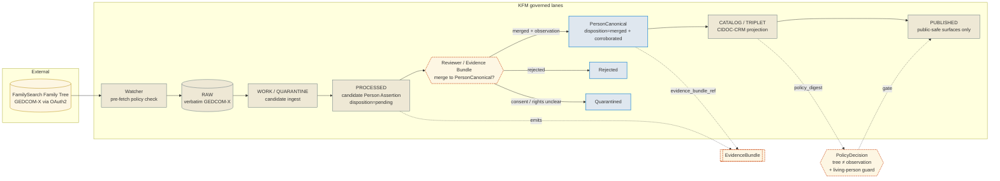

<!-- [KFM_META_BLOCK_V2]
doc_id: kfm://doc/docs-sources-catalog-familysearch-family-tree
title: FamilySearch Family Tree
type: product-page
version: v0.2
status: draft
owners: <PLACEHOLDER — Docs steward + People-Genealogy-DNA-Land domain owner + Source steward for familysearch; assign before review>
created: 2026-05-20
updated: 2026-05-21
policy_label: public
related:
  - docs/sources/catalog/familysearch/README.md
  - docs/sources/catalog/familysearch.md
  - docs/sources/catalog/README.md
  - docs/domains/people-genealogy-dna-land/README.md
  - docs/doctrine/directory-rules.md
  - data/registry/sources/people-genealogy-dna-land/
  - policy/genealogy/publication.rego
  - schemas/contracts/v1/source/source-descriptor.schema.json
tags: [kfm, docs, sources, catalog, familysearch, family-tree, genealogy, dom-people, candidate, c9-02]
notes:
  - "PROPOSED product-page scaffold. Path `docs/sources/catalog/familysearch/family-tree.md` is PROPOSED; the `catalog/<family>/<product>.md` nested pattern is used by sibling product pages (e.g. EPA AQS) but **conflicts** with the parent FamilySearch source catalog standard doc at `docs/sources/catalog/familysearch.md` (flat pattern). This inconsistency is flagged for ADR resolution — see OPEN-PATH-01."
  - "Doctrinal subtlety: Family Tree records are **community-contributed candidate hypotheses**, not observations. Their SourceDescriptor carries `source_role: candidate` with `role_candidate_disposition: pending` by default. PUBLISHED edge is forbidden until `merged` AND corroborated by an `observation`-role source (per KFM-P1-PROG-0007 and Pass-23 source-role rules)."
  - "Catalog profile note: Family Tree records are person-graph nodes (CIDOC-CRM E21 / DOM-PEOPLE object families), not spatiotemporal assets. STAC may not be the primary catalog profile; CIDOC-CRM projection in `data/catalog/domain/people-genealogy-dna-land/` is. Person events (E5) with date + place MAY surface as STAC Items, but this is OPEN — see OPEN-FT-02."
  - "Sibling-link placements (`./README.md`, `../IDENTITY.md`, `../RIGHTS-AND-SENSITIVITY-MAP.md`, `../_examples/`, `./historical-records.md`) are PROPOSED only."
[/KFM_META_BLOCK_V2] -->

# 🌳 FamilySearch Family Tree

> Community-contributed tree nodes and person records admitted as **candidate hypotheses** — never as observed events. PUBLISHED edge forbidden until merged and corroborated.

[](#)
[](../../../doctrine/directory-rules.md)
[](#source-role-candidate-only)
[](#disposition-lifecycle)
[](../../../domains/people-genealogy-dna-land/)
[](#rights-and-sensitivity)
[](#consent-and-revocation)
[](#last-reviewed)

**Status:** PROPOSED — scaffold only ·
**Family:** [`familysearch`](./README.md) ·
**Kind:** Community-contributed candidate hypotheses ·
**Domain:** People / Genealogy / DNA / Land (`DOM-PEOPLE`) ·
**Owners:** `<PLACEHOLDER — Docs steward + People-Genealogy-DNA-Land domain owner + Source steward for familysearch>` ·
**Last reviewed:** 2026-05-21

> [!IMPORTANT]
> **Family Tree records are candidates, not observations.** Per the source-role enum (KFM-P1-PROG-0007) and the Pass-23 source-role rules table, *"Administrative compilation cited as observation → DENY publication of compilation as observed event timeline."* Family Tree person records, relationship assertions, and tree-derived claims **MUST NOT** appear on a PUBLISHED edge until two conditions are met: (1) `role_candidate_disposition: merged`, and (2) a corroborating `observation`-role source (e.g., an indexed historical record from [`historical-records.md`](./historical-records.md)) is bound to the merged record. Every public surface that renders a tree-derived claim without these two conditions is a doctrinal failure.

---

## 📑 On this page

- [Overview](#overview)
- [Why this product is special](#why-this-product-is-special)
- [Doctrinal anchors](#doctrinal-anchors)
- [Source-role: candidate only](#source-role-candidate-only)
- [Disposition lifecycle](#disposition-lifecycle)
- [Source authority](#source-authority)
- [Catalog profiles used](#catalog-profiles-used)
- [Collection identity](#collection-identity)
- [Provenance fields (`kfm:provenance`)](#provenance-fields-kfmprovenance)
- [CIDOC-CRM projection](#cidoc-crm-projection)
- [Temporal handling](#temporal-handling)
- [Geometry and projection](#geometry-and-projection)
- [Consent and revocation](#consent-and-revocation)
- [Rights and sensitivity](#rights-and-sensitivity)
- [DNA-adjacent guards](#dna-adjacent-guards)
- [Validation and catalog closure](#validation-and-catalog-closure)
- [Related contracts and schemas](#related-contracts-and-schemas)
- [Related connectors and pipelines](#related-connectors-and-pipelines)
- [UI affordances](#ui-affordances)
- [Examples](#examples)
- [Open questions](#open-questions)
- [Related docs](#related-docs)

---

## Overview

**CONFIRMED (doctrine, C9-02).** FamilySearch is KFM's primary upstream for live genealogical data, accessed via OAuth2 with consent scopes. Within FamilySearch, the **Family Tree** subset consists of **community-contributed** person records and relationship assertions. Per the parent source catalog entry, these are admitted under `source_role: candidate` and MUST carry `role_candidate_disposition`.

**PROPOSED (product page scope).** This page describes how Family Tree records are admitted, normalized, validated, and gated for publication — without exposing community-contributed claims as observations and without exposing living-person data without consent and review.

**NEEDS VERIFICATION:** Current FamilySearch Family Tree API endpoint URLs; exact GEDCOM-X conformance level emitted; per-record license metadata semantics; community-contributor attribution rules; the precise merge workflow into `PersonCanonical`.

> [!NOTE]
> This page is the **product-specific briefing** for Family Tree. The broader FamilySearch upstream — OAuth2 / GA4GH framing, full receipt envelope, vendor-risk posture — lives in the parent source catalog entry at [`docs/sources/catalog/familysearch.md`](../familysearch.md). **Do not duplicate** that material here; reference it.

---

## Why this product is special

Family Tree is the single highest-sensitivity, highest-uncertainty product family on the FamilySearch upstream:

- **Authorship is community, not institutional.** Records are authored by contributors with variable rigor; KFM treats them as hypotheses, not as authority.
- **Living persons appear.** Tree records frequently include living individuals — names, residences, family graphs — which sit under the DENY-by-default register (KFM-P1-IDEA-0033, CONFIRMED Pass-23 carry-forward).
- **DNA-adjacency is common.** Tree nodes are routinely augmented by contributors with DNA-match observations; raw genotype data **MUST NOT** enter the public person layer (KFM-P17-PROG-0032, PROPOSED).
- **Hypothesis ≠ truth.** Two contributors can disagree about the same person; the resolution is **evidence**, not **majority opinion**. The corpus's evidence-first posture is enforced here through the candidate → merge gate.

> [!CAUTION]
> A common failure mode is treating a FamilySearch tree node as a "person of record" because it has a stable identifier and a Schema.org-shaped projection. **The stability of the identifier does not make the claim true.** The candidate disposition is what protects this distinction.

---

## Doctrinal anchors

| Anchor | Source | Why it applies here |
|---|---|---|
| **C9-02** | FamilySearch API as genealogy upstream | Parent CONFIRMED doctrine (Pass-10) |
| **C9-01** | GEDCOM 5.5 / GEDCOM-X | Native serialization; CIDOC-CRM projection (CONFIRMED) |
| **C8-01** | CIDOC-CRM core classes (E5/E7/E21/E53/E55/E74) | Person-graph projection backbone (CONFIRMED) |
| **C8-03** | PROV-O + PAV | Claim-level provenance (CONFIRMED) |
| **C8-04** | Evidence-Bundle JSON-LD | Content-addressed wrapping (CONFIRMED) |
| **C9-04** | GA4GH AAI / Passports / DUO / MRCG | Consent and access-control framework (CONFIRMED) |
| **C5-09** | Tombstones for revocation | Revocation discipline (CONFIRMED) |
| **C6-06** | k-anonymity for living-person overlays | `k=10`, `cell_m=500`, fallback `radius_mask=250m` (CONFIRMED) |
| **C6-07** | Consent tokens | JWT, OAuth introspection, PDP enforcement (CONFIRMED) |
| **C6-08** | Revocation endpoints, embargo, cache invalidation | Render-time enforcement (CONFIRMED) |
| **C7-09** | USGS GNIS | U.S. place anchor for tree-record places (CONFIRMED) |
| **KFM-P1-PROG-0007** | Source descriptors and source-role registry | Establishes `candidate` role + `role_candidate_disposition` (PROPOSED) |
| **KFM-P1-IDEA-0033** | Living-person / DNA / genomic restriction posture | Pass-23 carry-forward of C9 sensitivity stance (PROPOSED) |
| **KFM-P15-PROG-0034** | Genealogy/genomics uploads governance | Auditable consent, conservative aggregation, minimum cell sizes (PROPOSED) |
| **KFM-P17-IDEA-0006** | Consent-first genetic genealogy overlay | Client-side tokens, signed consent manifests, retention TTLs, no raw genotype persistence (PROPOSED) |
| **KFM-P17-PROG-0032** | Genealogy person extension with genotype prohibition | Raw genotype kept outside public person layer (PROPOSED) |
| **Pass-23 source-role table** | Admin compilation ≠ observation; aggregate ≠ per-place truth | Family Tree is administrative + candidate (CONFIRMED rules) |
| **DOM-PEOPLE** | Domains Atlas People/Genealogy/DNA/Land | Object families: Person Assertion, PersonCanonical, NameAssertion |
| **Directory Rules §§3, 4, 7.3, 7.4** | Placement law | Connectors don't publish; schemas under `schemas/contracts/v1/...` |
| **ADR-0001** | Schema home rule | Establishes `schemas/contracts/v1/source/source-descriptor.schema.json` as canonical home |

---

## Source-role: candidate only

**CONFIRMED rule (KFM-P1-PROG-0007 + Domains Atlas §24.1.3).** Family Tree person records and relationship assertions are admitted under `source_role: candidate` with the descriptor field `role_candidate_disposition` set at admission. The enum is:

| `role_candidate_disposition` | Meaning | PUBLISHED edge allowed? |
|---|---|---|
| `pending` | Awaiting evidence review and merge into canonical Person | **No** |
| `merged` | Merged into `PersonCanonical` with corroborating observation | **Yes**, with caveats below |
| `rejected` | Reviewed and not promoted | **No** — record retained as audit trail |
| `quarantined` | Held pending rights, consent, or evidence resolution | **No** |

> [!IMPORTANT]
> **`merged` is necessary but not sufficient.** Even after merge, publication of the merged `PersonCanonical` record additionally requires:
>
> 1. A corroborating `observation`-role source bound to the merged record (e.g., an indexed historical record from the sibling `historical-records.md` product).
> 2. Living-person guards passed (k-anonymity or full redaction for any living individual implicated).
> 3. No active revocation tombstone on any contributing FamilySearch grant.
> 4. CARE / consent posture clean across the full ancestry chain referenced by the rendered surface.

---

## Disposition lifecycle

> [!NOTE]
> The diagram below renders the **candidate-to-canonical** path. Stages are CONFIRMED doctrine; specific node labels and review-step names are PROPOSED.



<sub>NEEDS VERIFICATION: actual review-step entry point, route names, and policy-bundle paths against mounted-repo evidence.</sub>

---

## Source authority

The authoritative SourceDescriptor lives in [`data/registry/sources/people-genealogy-dna-land/`](../../../../data/registry/sources/people-genealogy-dna-land/) per **ADR-0001** and Directory Rules §7.4. **Do not duplicate** descriptor fields here.

| Field on the descriptor | Where defined | Why it is **not** restated here |
|---|---|---|
| Identity, role, rights, cadence | SourceDescriptor | Single source of truth |
| `source_role: candidate` | `source_role` enum on descriptor | Set at admission; never edited in place |
| `role_candidate_disposition` | descriptor field on each record (per KFM-P1-PROG-0007) | Tracks promotion state |
| `role_authority` | `FamilySearch International` plus contributor identifier where attribution applies | Disambiguates issuing body |
| Rights and license metadata | descriptor + per-record license field | Rights vary per record; NEEDS VERIFICATION current terms |
| Steward and obligations | descriptor + `policy/genealogy/...` | Policy decisions, not catalog presentation |

> [!WARNING]
> **Do not paste contributor identifiers, contributor email patterns, FamilySearch user IDs, or community-tree linkage metadata into this page.** They belong in the SourceDescriptor and EvidenceBundle, not in human-readable docs.

---

## Catalog profiles used

**PROPOSED — Pass-10 / C4 + C8 profiles.** Family Tree records are person-graph nodes (DOM-PEOPLE object families), not spatiotemporal assets. The **primary catalog form is CIDOC-CRM projection**, not STAC. DCAT applies at dataset granularity; PROV-O carries lineage.

| Profile | Lane (path) | Used by this product? | Notes |
|---|---|---|---|
| **CIDOC-CRM projection** (E21 Person, E5 Event, E53 Place, E13 Attribute Assignment) | `data/catalog/domain/people-genealogy-dna-land/` | **PROPOSED — Yes (primary)** | C8-01; the canonical projection for Family Tree records |
| **PROV-O + PAV** lineage | `data/catalog/prov/` | PROPOSED — Yes | C8-03 |
| **Evidence-Bundle JSON-LD** (content-addressed) | `data/catalog/evidence/` (PROPOSED) | PROPOSED — Yes | C8-04 |
| **STAC** with `kfm:provenance` | `data/catalog/stac/` | **PROPOSED — Conditional**; only for E5 Events that have a date + place anchor | OPEN-FT-02; STAC × CIDOC-CRM hybrid not explicitly described in the corpus |
| **DCAT** distribution | `data/catalog/dcat/` | PROPOSED — Yes (dataset-level only) | C4-05 |
| **Schema.org** web surface | (web layer; not a `data/catalog/` lane) | PROPOSED — Yes (Person / Place / Event) | C8-02; `sameAs` to Wikidata / VIAF / LCNAF / FAST where confidence permits |
| **STAC × DwC hybrid** | — | **No** | Biodiversity-only (C4-03); not applicable |

> [!NOTE]
> The STAC question (`OPEN-FT-02`) is doctrinally important: STAC was designed for spatiotemporal assets. A FamilySearch tree's E5 *birth event in Lawrence, Kansas, 1873* technically has date + place, but the surrounding tree is a graph, not a tiled raster or feature collection. The corpus does not commit either way; this page records the openness.

---

## Collection identity

- **PROPOSED Collection id pattern (for the candidate-tree projection):** `kfm-familysearch-family-tree-candidates`.
- **PROPOSED Collection id pattern (for any STAC-projected events):** `kfm-familysearch-family-tree-events` *(conditional on OPEN-FT-02 resolution)*.
- **PROPOSED namespace:** `kfm:` *(see OPEN-DSC-03; namespace choice between `kfm:` and `ks-kfm:` remains open — Pass-10 C4-01).*
- **Asset roles:** NEEDS VERIFICATION — confirm against `schemas/contracts/v1/source/` and `contracts/domains/people-genealogy-dna-land/`.

> [!TIP]
> Whatever Collection ids the source registry chooses, **the candidate pool and the canonical pool must be distinguishable from the Collection id alone**. A reader who sees `kfm-familysearch-family-tree-canonical` understands they are looking at merged records; a reader who sees `kfm-familysearch-family-tree-candidates` understands they are looking at hypotheses.

---

## Provenance fields (`kfm:provenance`)

When a Family Tree-derived artifact is emitted (whether as a CIDOC-CRM projection, a STAC E5 Event, or a DCAT record), its `kfm:provenance` block follows the Pass-10 C4-01 shape. Specific values are **PROPOSED**.

| Field | Resolves to | Required? | Notes for Family Tree |
|---|---|---|---|
| `spec_hash` | sha256 of the canonical record | MUST | Includes the candidate disposition and merge state |
| `evidence_bundle_ref` | `kfm://evidence/<digest>` → EvidenceBundle | MUST | Bundle MUST list both the FamilySearch source + any corroborating observation sources |
| `run_record_ref` | `kfm://run/<run-id>` → RunReceipt | MUST | Records OAuth scope, GA4GH Passport claim, access-token fingerprint |
| `audit_ref` | `kfm://audit/<attestation-id>` | MUST | SLSA / OPA attestation (C5-08) |
| `policy_digest` | sha256 of the policy bundle at promotion | MUST | Includes `tree-not-observation` rule + living-person guards |
| (per-asset) `file:checksum` | sha256 of asset bytes | MUST | C3-02 |

<details>
<summary><b>Reference: extra Family Tree–specific provenance fields (illustrative — not authoritative)</b></summary>

```text
# Inside kfm:provenance or the bound EvidenceBundle:
source_role                    "candidate"
role_candidate_disposition     "pending" | "merged" | "rejected" | "quarantined"
merged_into                    kfm://person/<PersonCanonical-id>  (when merged)
corroborating_observation_refs [ kfm://evidence/<digest>, ... ]   (≥1 when published)
contributor_attribution_ref    kfm://contributor/<opaque-id>      (never bare contributor IDs)
oauth_scope                    <scope-string>
passport_claim                 <GA4GH Passport claim ref>
access_token_fingerprint       sha256:<...>  (NEVER the token itself)
revocation_status              "active" | "revoked" | "embargoed"
living_person_redaction_ref    kfm://receipt/redaction/<id>       (when applicable)
gedcom_x_conformance           "conforming" | "tolerated_deviation" | "rejected"
```

PROPOSED only. Authoritative shape lives in `schemas/contracts/v1/` (path NEEDS VERIFICATION).

</details>

---

## CIDOC-CRM projection

**CONFIRMED doctrine (C8-01).** Family Tree records project to CIDOC-CRM E21 Person + E5 Event + E53 Place, with **E13 Attribute Assignment** carrying the evidence-per-claim attribution.

| GEDCOM-X concept | CIDOC-CRM target | Notes |
|---|---|---|
| Person | **E21 Person** | Canonical KFM `kfm_id` per identity rule (PROPOSED) |
| Name (over time) | **E82 Actor Appellation** | Multiple `NameAssertion` records, each tied to its source |
| Birth / death / marriage / event | **E5 Event** | Date as ISO 8601 interval; place anchored to GNIS or TGN |
| Place reference | **E53 Place** with anchor → GNIS / TGN | Confidence score on anchoring decision (C7-09; ambiguous → curator queue) |
| Relationship assertion (parent/child/spouse) | **E7 Activity** linking E21 nodes | Carries source attribution per assertion |
| Source attribution for a claim | **E13 Attribute Assignment** | Evidence-per-claim discipline (C8-01 core feature) |
| Group affiliation (family / household) | **E74 Group** | Membership timespan preserved |

> [!NOTE]
> **Verbatim source strings are preserved alongside the projection.** A GEDCOM-X record never replaces its raw form; the raw is retained under `data/raw/people-genealogy-dna-land/familysearch-api/<run_id>/` so scholarly work can re-examine interpretation (C9-01, C9-06).

---

## Temporal handling

Family Tree records bring two flavors of time: **GEDCOM-X date qualifiers** (which require normalization) and the standard six-role temporal discipline.

| Time | Meaning for a Family Tree record | Required? |
|---|---|---|
| `source_time` | When FamilySearch's snapshot of the tree was returned | MUST |
| `observed_time` | When the underlying event (birth, marriage, etc.) is asserted to have occurred — typically an ISO 8601 interval from a GEDCOM-X qualifier | MUST when applicable |
| `valid_time` | Period the claim is asserted to be valid (e.g., a residence span) | MUST when applicable |
| `retrieval_time` | When KFM watcher fetched the record | MUST |
| `release_time` | When KFM published the (merged + corroborated) artifact | MUST at publication |
| `correction_time` | When a tree node is superseded (contributor edit, re-merge, retraction) | MUST when emitted |

**GEDCOM-X date qualifier normalization (CONFIRMED — C9-01):** `ABT`, `BEF`, `AFT`, `BET`, `FROM`, `TO`, `CAL`, `EST` all map to **structured ISO 8601 intervals** with the original string preserved.

> [!CAUTION]
> A tree node frequently undergoes **silent edits** by community contributors. Each refetch can produce a different snapshot. KFM treats this as a **supersession event** — never as a silent overwrite — and emits a new candidate Item with a `supersedes` pointer.

---

## Geometry and projection

**PROPOSED — geometry is incidental, not primary.**

| Concern | PROPOSED handling | Status |
|---|---|---|
| Geometry type | None on the Person node itself; Point on E53 Place anchors after GNIS / TGN resolution | NEEDS VERIFICATION |
| CRS | EPSG:4326 in catalog where geometry is present; native projection preserved in EvidenceBundle | NEEDS VERIFICATION |
| Place anchoring | GNIS (U.S. preferred per C7-09) or TGN; **ambiguous matches route to curator queue, not silent decision** | CONFIRMED doctrine; thresholds PROPOSED |
| Living-person residence geometry | **DENY** exact public coordinates; redact or generalize via `density_k_anonymity_grid` with `k=10`, `cell_m=500`, fallback `radius_mask=250m` | CONFIRMED (C6-06) |
| STAC Projection extension | Conditional on OPEN-FT-02 (does this product surface STAC Items at all?) | OPEN |

---

## Consent and revocation

**CONFIRMED doctrine (C9-02, C9-04, C5-09, C6-08).** Every fetch from the FamilySearch Family Tree API operates under an OAuth2 scope plus a GA4GH Passport claim. KFM records the scope, the **access-token fingerprint** (one-way hash; never the token itself), and the Passport claim on every `RawCaptureReceipt`.

| Event | Required action | Owning artifact |
|---|---|---|
| User revokes OAuth consent | Issue signed `Tombstone`; invalidate caches (PMTiles index, tile-server, governed-API response cache); re-evaluate `EvidenceBundle` resolution | `Tombstone` (signed) |
| Embargo timestamp passes / extends | Re-evaluate gate; deny if `now < embargo_until` regardless of other approvals | `PolicyDecision` |
| Revocation endpoint unreachable | **Fail closed**; rendering DENIES | `PolicyDecision` (DENY with reason) |
| Contributor edits a tree node | Emit new candidate Item with `supersedes` pointer; do not silently overwrite | `CorrectionNotice` |
| User dies; consent becomes ambiguous | **UNKNOWN default** — open question (see Open questions) | open question |

> [!WARNING]
> **Revocation that does not invalidate caches is incomplete.** Stale tiles, stale JSON responses, stale graph projections, and stale AI cache entries can all leak retracted Family Tree material. Invalidation hooks MUST be tested before relying on the revocation pathway.

---

## Rights and sensitivity

**NEEDS VERIFICATION.** See [`policy/sensitivity/`](../../../../policy/sensitivity/) and [`RIGHTS-AND-SENSITIVITY-MAP.md`](../RIGHTS-AND-SENSITIVITY-MAP.md). **Do not restate policy here.**

The Pass-23 carry-forward (KFM-P1-IDEA-0033, PROPOSED) reinforces the C9 stance: *"Living-person and DNA/genomic information should be restricted by default and exposed only through evidence-bound, consent-aware, policy-approved surfaces."*

| Risk class | Default | Required controls |
|---|---|---|
| **Living persons** — names, residences, identity assertions | **DENY** public exact / identifying output | privacy review · redaction · aggregate · staged access |
| **Family graph involving living persons** | **DENY** clear-view publication unless k-anonymity is met (C6-06) | PDP gate + receipt |
| **Place strings tied to living-person residences** | **DENY** exact public location | geographic generalization receipt |
| **Tree records as "evidence"** | **DENY** publication of tree-only assertions as observed events | preserve `source_role=candidate`; require corroborating `observation` (see [Source-role: candidate only](#source-role-candidate-only)) |
| **Rights-limited / unclear-rights records** | **DENY** public release until terms resolved | rights register entry; `RightsDecision` |
| **Aggregate cited as a per-place truth** | **DENY** join from aggregate cell to single record; **ABSTAIN at AI** | aggregation receipt; geometry-scope guard (Pass-23 source-role table) |
| **Administrative compilation cited as observation** | **DENY** publication of compilation as observed event timeline | source-role tag preserved; named LifeEvent / AdminEvent types (Pass-23 source-role table) |

> [!CAUTION]
> No public-safe rendering of a Family Tree record is automatic. Every transform that crosses the publication boundary MUST emit a `RedactionReceipt` (for sensitive transforms) or `AggregationReceipt` (for geometry-scope aggregations), and the `EvidenceBundle` MUST resolve before publication. The renderer never invents truth; the AI surface never substitutes for evidence.

---

## DNA-adjacent guards

> [!IMPORTANT]
> Family Tree records frequently link to DNA-match observations and contributor-supplied genotype context. The **C9-03 (DTC raw exports)** doctrine applies whenever this happens.

| Guard | Source | What it gates |
|---|---|---|
| **No raw genotype in public person layer** | KFM-P17-PROG-0032 (PROPOSED) | Raw genotype kept outside the public Person layer; only k-anonymized / DP-aggregated derivations cross the publication boundary |
| **Consent-first overlay** | KFM-P17-IDEA-0006 (PROPOSED) | Client-side tokens, signed consent manifests, retention TTLs, revocation ledgers, no raw genotype persistence |
| **k-anonymity for living-person overlays** | C6-06 (CONFIRMED) | Default `k=10`, `cell_m=500`, fallback `radius_mask=250m` |
| **DP for aggregates** | C6-05 (CONFIRMED) | Aggregate statistics crossing the publication boundary pass through differential privacy |
| **GA4GH DUO mapping** | C9-04 (CONFIRMED) | Every consent scope maps to a DUO code; PDP reasons against DUO uniformly |
| **Vendor-risk awareness** | C9-07 (CONFIRMED — 23andMe Chapter 11) | Vendor solvency is a consent-relevant variable; same logic applies to FamilySearch contingency planning |

---

## Validation and catalog closure

| Gate | Source | Status |
|---|---|---|
| **`source_role = candidate`** at admission | KFM-P1-PROG-0007 | CONFIRMED rule |
| **PUBLISHED edge forbidden until `disposition = merged`** | KFM-P1-PROG-0007 + Domains Atlas §24.1.3 | CONFIRMED rule |
| **Corroborating `observation`-role source** bound at merge | C9-02 + Pass-23 source-role table | CONFIRMED rule |
| **Tree-not-observation** gate | Pass-23 source-role table | CONFIRMED rule |
| **Living-person guard** (k-anonymity or full redaction) | C6-06 + KFM-P1-IDEA-0033 | CONFIRMED |
| **Raw-genotype prohibition** in public person layer | KFM-P17-PROG-0032 | PROPOSED |
| **Revocation status** check at render time; tombstone absent | C5-09 + C6-08 | CONFIRMED |
| **OAuth scope + GA4GH Passport claim** present in RawCaptureReceipt | C9-02 + C9-04 | CONFIRMED |
| **Catalog closure** before public release | Pass-10 / KFM-P1-IDEA-0020 | CONFIRMED doctrine |
| **Spec-hash-match** gate | C5-04 | CONFIRMED doctrine |
| **Policy parity** (CI = runtime, including living-person rules) | C5-03 | CONFIRMED doctrine |
| **Lineage required** (OpenLineage → receipts) | C5-08 | CONFIRMED doctrine |
| **ReleaseManifest** binds artifact; **RollbackCard** exists | KFM doctrine | CONFIRMED |
| **GEDCOM-X conformance** disposition (`conforming` / `tolerated_deviation` / `rejected`) | C9-01 (threshold OPEN) | OPEN |

> [!WARNING]
> **Fail-closed is the default.** If any gate is unresolved, the answer is `DENY` or `ABSTAIN`. A `RuntimeResponseEnvelope` with finite outcome `ABSTAIN` is preferred to a fluent answer that bypasses governance.

---

## Related contracts and schemas

| Concern | PROPOSED home | Status |
|---|---|---|
| SourceDescriptor schema | `schemas/contracts/v1/source/source-descriptor.schema.json` | PROPOSED per ADR-0001; NEEDS VERIFICATION |
| CIDOC-CRM projection schema | `schemas/contracts/v1/catalog/cidoc-crm-person.json` (PROPOSED) | NEEDS VERIFICATION |
| EvidenceBundle / EvidenceRef schemas | `schemas/contracts/v1/evidence/` (KFM-P26-PROG-0004 / 0005) | PROPOSED |
| DecisionEnvelope | `schemas/contracts/v1/runtime/decision_envelope.schema.json` (KFM-P5-PROG-0001) | PROPOSED |
| GENERATED_RECEIPT / RunReceipt | `ai-build-operating-contract.md` §34 | CONFIRMED contract content |
| Domain contracts (DOM-PEOPLE) | `contracts/domains/people-genealogy-dna-land/` | PROPOSED |
| `policy/genealogy/publication.rego` | OPA publication gate for genealogy products | PROPOSED |

> [!NOTE]
> Per Directory Rules §7.4 and ADR-0001, schemas live under `schemas/contracts/v1/...`. **Do not propose a parallel schema home** for Family Tree-specific shapes. CIDOC-CRM projection schemas live under the catalog branch; the candidate-disposition enum lives on the SourceDescriptor.

---

## Related connectors and pipelines

- **Connector:** [`connectors/familysearch/`](../../../../connectors/familysearch/) — OAuth2-gated fetch under per-user scope; emits to `data/raw/people-genealogy-dna-land/familysearch-api/<run_id>/` only (Directory Rules §7.3).
- **Pipelines:**
  - [`pipelines/ingest/`](../../../../pipelines/ingest/) — RAW capture with full receipt envelope.
  - [`pipelines/normalize/`](../../../../pipelines/normalize/) — GEDCOM-X → CIDOC-CRM projection; date-qualifier normalization; place anchoring.
  - [`pipelines/validate/`](../../../../pipelines/validate/) — `source_role = candidate` enforcement; living-person guard; disposition tracking.
  - [`pipelines/catalog/`](../../../../pipelines/catalog/) — CIDOC-CRM + PROV-O emission; conditional STAC emission for E5 Events (OPEN-FT-02).
- **Pipeline spec:** [`pipeline_specs/people-genealogy-dna-land/`](../../../../pipeline_specs/people-genealogy-dna-land/) (PROPOSED).
- **Policy:** [`policy/genealogy/publication.rego`](../../../../policy/genealogy/publication.rego) (PROPOSED, draft outlined in New-Ideas packet).

> [!WARNING]
> Linked paths are PROPOSED placements consistent with the repository structure guide. Mounted-repo evidence has not been inspected in this session; every linked path is NEEDS VERIFICATION.

---

## UI affordances

> [!IMPORTANT]
> A public surface that renders a Family Tree-derived person record without **clearly signaling its candidate / merged disposition** is a doctrinal failure. The Evidence Drawer is the affordance that protects this distinction.

| Affordance | Behavior | Status |
|---|---|---|
| **Candidate badge** | Every tree-derived person record renders with an explicit candidate / merged disposition badge | PROPOSED — per DOM-PEOPLE UIX patterns |
| **Evidence Drawer** | Exposes `source_role`, `role_candidate_disposition`, corroborating observations (if any), and any redactions applied | CONFIRMED affordance class; specific binding PROPOSED |
| **Consent / sensitivity panel** | Shows revocation status, living-person redaction, and consent scope summary | PROPOSED (per KFM-P25-FEAT-0002 family) |
| **Cite-or-abstain on AI surfaces** | AI cannot summarize, narrate, or assert a tree node as fact without resolving its EvidenceBundle and respecting candidate disposition | CONFIRMED doctrine |
| **"Living person" mask** | Default mask for any record whose subject is or might be living; explicit override only via policy + consent | CONFIRMED (C6-06) |

---

## Examples

*Illustrative only — do not treat as authoritative.*

See [`_examples/`](../_examples/) for the minimal CIDOC-CRM projection + EvidenceBundle shape applied to a Family Tree person record. The example must round-trip through:

1. Spec-hash recomputation (C5-04).
2. `source_role = candidate` + `role_candidate_disposition` discipline.
3. EvidenceBundle resolution including the FamilySearch source descriptor.
4. (For PUBLISHED examples only) corroborating observation source bound + living-person guard applied + revocation status check.
5. CIDOC-CRM projection validator.
6. PROV-O / PAV lineage resolution.
7. Policy-digest match including the tree-not-observation rule and living-person guards.

…before it counts as a valid Family Tree projection.

---

## Open questions

- **OPEN-FT-01** — What is the precise merge workflow into `PersonCanonical`? Curator-driven, ER-pipeline-driven, or hybrid? Who has merge authority?
- **OPEN-FT-02** — Does Family Tree warrant any STAC presence at all (for E5 Events with date + place), or is CIDOC-CRM + DCAT + PROV-O the complete catalog footprint? A STAC × CIDOC-CRM hybrid is not explicitly described in the corpus.
- **OPEN-FT-03** — At what threshold of contributor edits does a tree node trigger an automatic supersession event vs. a curator-review queue?
- **OPEN-FT-04** — How are contributor identifiers handled in published EvidenceBundles? Opaque tokens, hashed identifiers, or no attribution at all? The corpus does not codify this.
- **OPEN-FT-05** — Does a "merged + corroborated" record require **two** independent corroborating observations, or is one sufficient? The corpus implies the latter but does not codify a threshold.
- **OPEN-C9-01** — *(From C9-01.)* When does a non-conforming GEDCOM-X response fail the gate vs. accept with a warning?
- **OPEN-C9-02** — *(From C9-02.)* Deceased-user consent ambiguity — embargo, surface, or escalate?
- **OPEN-C9-03** — *(From C9-02.)* Retention policy — how long may KFM keep a FamilySearch response in `data/raw/...` after the user revokes consent? Tombstone sufficient, or physical purge required?
- **OPEN-DSC-03** — STAC namespace choice: `kfm:` (global) or `ks-kfm:` (Kansas-scoped)?
- **OPEN-PATH-01** — Confirm `docs/sources/catalog/familysearch/family-tree.md` placement against Directory Rules. The nested `<family>/<product>.md` pattern used here is **inconsistent** with the parent FamilySearch source catalog standard doc at `docs/sources/catalog/familysearch.md` (flat). File an ADR if the inconsistency persists.

---

## Related docs

- [`docs/sources/catalog/familysearch/README.md`](./README.md) — `familysearch` family landing page (PROPOSED).
- [`docs/sources/catalog/familysearch.md`](../familysearch.md) — **Parent FamilySearch source catalog entry** (standard doc; covers OAuth2, GA4GH overlay, full receipt envelope, retention, vendor risk).
- [`docs/sources/catalog/familysearch/historical-records.md`](./historical-records.md) — Sibling product: indexed historical record images (`source_role: observation`; the corroborating-evidence side of merge gates) — PROPOSED placement.
- [`docs/sources/catalog/README.md`](../../README.md) — Sources catalog index (PROPOSED).
- [`docs/sources/catalog/familysearch/IDENTITY.md`](../IDENTITY.md) — Collection-id and namespace conventions (PROPOSED placement).
- [`docs/sources/catalog/familysearch/RIGHTS-AND-SENSITIVITY-MAP.md`](../RIGHTS-AND-SENSITIVITY-MAP.md) — Family-level rights map (PROPOSED placement).
- [`docs/doctrine/directory-rules.md`](../../../doctrine/directory-rules.md) — Authority boundaries and schema-home discipline.
- [`docs/domains/people-genealogy-dna-land/README.md`](../../../domains/people-genealogy-dna-land/README.md) — DOM-PEOPLE domain doctrine.
- [`docs/standards/CIDOC_CRM_PROFILE.md`](../../../standards/CIDOC_CRM_PROFILE.md) — KFM CRM application profile (PROPOSED).
- [`docs/standards/DUO_MAPPING.md`](../../../standards/DUO_MAPPING.md) — DUO ↔ FamilySearch scope mapping (PROPOSED).
- [`docs/policy/familysearch-retention.md`](../../../policy/familysearch-retention.md) — Retention policy (PROPOSED).
- [`data/registry/sources/people-genealogy-dna-land/`](../../../../data/registry/sources/people-genealogy-dna-land/) — Canonical SourceDescriptor home (ADR-0001).
- [`policy/genealogy/publication.rego`](../../../../policy/genealogy/publication.rego) — OPA publication gate (PROPOSED).
- [`ai-build-operating-contract.md`](../../../../ai-build-operating-contract.md) — §34 RunReceipt / GENERATED_RECEIPT discipline (CONFIRMED).
- [`docs/adr/ADR-0001-schema-home.md`](../../../adr/ADR-0001-schema-home.md) — Schema-home rule.

---

## Last reviewed

**2026-05-21** — Claude product-page polish pass; candidate-only framing applied; disposition-lifecycle diagram added; DNA-adjacent guards section added; CIDOC-CRM projection section added; Pass-23 carry-forward atlas cards cross-referenced. Prior scaffold dated 2026-05-20.

---

<sub>📄 Product page · v0.2 · PROPOSED scaffold · <a href="#-familysearch-family-tree">↑ Back to top</a></sub>
