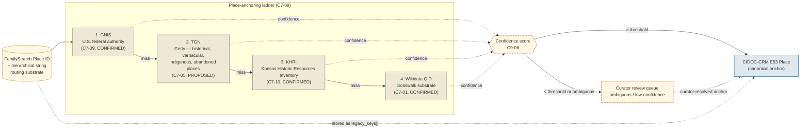

<!-- [KFM_META_BLOCK_V2]
doc_id: kfm://doc/docs-sources-catalog-familysearch-places-authorities
title: FamilySearch Places
type: product-page
version: v0.2
status: draft
owners: <PLACEHOLDER — Docs steward + People-Genealogy-DNA-Land domain owner + Source steward for familysearch; co-review with Place-authority steward; assign before review>
created: 2026-05-20
updated: 2026-05-21
policy_label: public
related:
  - docs/sources/catalog/familysearch/README.md
  - docs/sources/catalog/familysearch/family-tree.md
  - docs/sources/catalog/familysearch/historical-record-images.md
  - docs/sources/catalog/familysearch.md
  - docs/sources/catalog/README.md
  - docs/sources/catalog/usgs/gnis.md
  - docs/domains/people-genealogy-dna-land/README.md
  - docs/doctrine/directory-rules.md
  - data/registry/sources/people-genealogy-dna-land/
  - schemas/contracts/v1/source/source-descriptor.schema.json
tags: [kfm, docs, sources, catalog, familysearch, places, authorities, dom-people, context, c7-09, c9-06]
notes:
  - "PROPOSED product-page scaffold. Path `docs/sources/catalog/familysearch/places-authorities.md` is PROPOSED; the `catalog/<family>/<product>.md` nested pattern conflicts with the parent FamilySearch source catalog standard doc at `docs/sources/catalog/familysearch.md` (flat). Inconsistency flagged for ADR (OPEN-PATH-01)."
  - "Doctrinal subtlety: this product is the **context-role / routing substrate** sibling to Family Tree (candidate) and Historical Record Images (observation). FamilySearch Places provides PLACE IDENTIFIERS used to anchor records, **NOT a primary place authority**. The canonical anchor ladder (per C7-09 expansion direction) is GNIS → TGN → KHRI → Wikidata; FamilySearch Places is a routing layer that helps locate where to anchor — like a place-side analog of COMID legacy_keys in hydrography."
  - "Doctrinal subtlety 2 — historical and Indigenous place names: C7-09 explicitly warns that 'exclusive reliance on GNIS encodes a colonial-era naming layer.' Pre-statehood places, Indigenous place names, ghost towns, and abandoned places route to TGN / KHRI / community authority — and may require CARE consideration (C15-01). See [Indigenous place names and CARE applicability](#indigenous-place-names-and-care-applicability)."
  - "Sibling-link placements (`./README.md`, `./family-tree.md`, `./historical-record-images.md`, `../IDENTITY.md`, `../RIGHTS-AND-SENSITIVITY-MAP.md`, `../_examples/`, `../usgs/gnis.md`) are PROPOSED only."
[/KFM_META_BLOCK_V2] -->

# 🗺️ FamilySearch Places

> FamilySearch place identifiers and place-authority records used as **anchoring substrate** — never as a primary place authority. The canonical anchors are GNIS, TGN, KHRI, and Wikidata; FamilySearch Places helps KFM locate which canonical anchor to bind to.

[](#)
[](../../../doctrine/directory-rules.md)
[-success)](#source-role-context-anchoring-substrate)
[](#place-anchoring-ladder)
[](../../../domains/people-genealogy-dna-land/)
[](#indigenous-place-names-and-care-applicability)
[](#temporal-handling)
[](#last-reviewed)

**Status:** PROPOSED — scaffold only ·
**Family:** [`familysearch`](./README.md) ·
**Kind:** Place-authority routing substrate (`source_role: context`) ·
**Domain:** People / Genealogy / DNA / Land (`DOM-PEOPLE`); cross-cuts Settlements / Infrastructure and Frontier Matrix ·
**Owners:** `<PLACEHOLDER — Docs steward + People-Genealogy-DNA-Land domain owner + Source steward for familysearch; co-review with Place-authority steward>` ·
**Last reviewed:** 2026-05-21

> [!IMPORTANT]
> **FamilySearch Places is a routing identifier, not a place authority.** The corpus is unambiguous on this point (C7-09, CONFIRMED Pass-10): the USGS Geographic Names Information System (**GNIS**) is the federal authority for U.S. place names and is the **required anchor** for in-scope KFM place records. Getty TGN, KHRI, and Wikidata serve as cultural-heritage, Kansas-first, and crosswalk layers respectively. FamilySearch Places does not appear on the canonical place-anchoring ladder. Its role is to help KFM **locate which GNIS / TGN / KHRI / Wikidata identifier a FamilySearch-referenced place corresponds to**, with a confidence score on every anchoring decision (C9-06).

---

## 📑 On this page

- [Overview](#overview)
- [Role in the genealogy stack](#role-in-the-genealogy-stack)
- [Doctrinal anchors](#doctrinal-anchors)
- [Source-role: context (anchoring substrate)](#source-role-context-anchoring-substrate)
- [Place-anchoring ladder](#place-anchoring-ladder)
- [Source authority](#source-authority)
- [Confidence scoring and curator review](#confidence-scoring-and-curator-review)
- [Indigenous place names and CARE applicability](#indigenous-place-names-and-care-applicability)
- [Catalog profiles used](#catalog-profiles-used)
- [Collection identity](#collection-identity)
- [Provenance fields (`kfm:provenance`)](#provenance-fields-kfmprovenance)
- [CIDOC-CRM projection](#cidoc-crm-projection)
- [Temporal handling](#temporal-handling)
- [Geometry and projection](#geometry-and-projection)
- [Consent and revocation](#consent-and-revocation)
- [Rights and sensitivity](#rights-and-sensitivity)
- [Validation and catalog closure](#validation-and-catalog-closure)
- [Related contracts and schemas](#related-contracts-and-schemas)
- [Related connectors and pipelines](#related-connectors-and-pipelines)
- [UI affordances](#ui-affordances)
- [Examples](#examples)
- [Open questions](#open-questions)
- [Related docs](#related-docs)

---

## Overview

**CONFIRMED (doctrine, C9-02 + C7-09).** FamilySearch's Places service exposes a hierarchical place-authority dataset (e.g., *Liberty, Marshall, Kansas, USA*) keyed by FamilySearch place identifiers. KFM admits this data under `source_role: context` — useful as a routing substrate for anchoring genealogy place strings against the canonical authorities (GNIS / TGN / KHRI / Wikidata), but **not** as the authority itself.

**PROPOSED (product page scope).** This page describes how FamilySearch Place IDs flow through the place-anchoring ladder, how confidence is scored on each anchoring decision, how ambiguous matches route to curator review rather than silent first-match, and how Indigenous, pre-statehood, and ghost-town place names route through TGN / KHRI rather than GNIS.

**NEEDS VERIFICATION:** Current FamilySearch Places API endpoint URLs; exact hierarchical structure returned; how FamilySearch represents historical / pre-statehood / abandoned places; per-record license metadata; cadence of place-record updates.

> [!NOTE]
> This page is the **product-specific briefing** for FamilySearch Places. The broader FamilySearch upstream — OAuth2 / GA4GH framing, full receipt envelope, vendor-risk posture — lives in the parent source catalog entry at [`docs/sources/catalog/familysearch.md`](../familysearch.md). The canonical place-authority briefings live separately (per [Source authority](#source-authority)). **Do not duplicate** either material here; reference them.

---

## Role in the genealogy stack

This product is the third leg of the FamilySearch sibling family. Together with [Family Tree](./family-tree.md) and [Historical Record Images](./historical-record-images.md), it spans the doctrinal source-role enum for the genealogy domain:

| Product | `source_role` | Role in stack | PUBLISHED edge? |
|---|---|---|---|
| [Family Tree](./family-tree.md) | `candidate` | Community-contributed hypothesis | **No** — until `merged` + corroborated |
| [Historical Record Images](./historical-record-images.md) | `observation` (scoped) | Source-document evidence | **Yes**, subject to gates |
| **FamilySearch Places** (this page) | `context` | Routing substrate for place anchoring | **No edge of its own**; contributes anchors used by sibling products |

> [!IMPORTANT]
> **FamilySearch Places does not publish records of its own.** It contributes **place anchors** that are consumed by Family Tree records and Historical Record Image records as part of their CIDOC-CRM E53 Place projection. The publication gate that matters for this product is downstream — at the consuming record's promotion — and what this product MUST provide is a **trustworthy anchoring decision** (confidence-scored, ladder-resolved, curator-reviewed where ambiguous).

---

## Doctrinal anchors

| Anchor | Source | Why it applies here |
|---|---|---|
| **C7-09** | USGS GNIS for U.S. Place Authorities | **Required anchor** for in-scope U.S. place records (CONFIRMED Pass-10) |
| **C7-05** | Getty ULAN / TGN for cultural heritage | Authority for historical / vernacular / pre-statehood / Indigenous / abandoned places (PROPOSED Pass-10) |
| **C7-10** | Kansas-First Domain Authorities (KSHS, KHRI, KU NHM, KBS NHI, KDWP SINC) | Kansas-specific authority of last resort; KHRI on place ladder (CONFIRMED Pass-10) |
| **C7-01** | Wikidata as universal crosswalk substrate | Identifier router across authorities; not a sole-source-of-truth (CONFIRMED Pass-10) |
| **C7-02** | LCNAF | U.S. published-name authority; adjacent for named places that appear in published cataloging (CONFIRMED) |
| **C7-06** | SNAC and EAC-CPF for archival context | Place-of-record for archived materials (CONFIRMED) |
| **C9-06** | Place and date precision normalization | Confidence-scored anchoring; verbatim preservation; curator-review queue for ambiguous matches (CONFIRMED Pass-10) |
| **C9-02** | FamilySearch API as genealogy upstream | Parent CONFIRMED doctrine; this product's upstream |
| **C8-01** | CIDOC-CRM core classes (E53 Place) | Graph projection target (CONFIRMED) |
| **C8-03** | PROV-O + PAV | Lineage including anchoring-decision provenance (CONFIRMED) |
| **C8-04** | Evidence-Bundle JSON-LD | Content-addressed wrapping (CONFIRMED) |
| **C15-01** | CARE applicability (curatorial decision) | Indigenous place names may trigger CARE review (CONFIRMED — adjacent) |
| **KFM-P20-PROG-0012** | Frontier graph authority resolver | "Resolve QIDs and authority references into entity graph nodes while checking duplicate collapse, place links, coordinate validity, and temporal uncertainty" (PROPOSED Pass-23/32) |
| **DOM-Frontier Matrix object families** | `GeographyVersion`, `AdminBoundaryChange`, `County-Year Panel`, `Frontier Definition` | Time-aware place modeling (CONFIRMED term / PROPOSED field realization) |
| **DOM-Settlements/Infrastructure object families** | `Settlement`, `Municipality`, `CensusPlace`, `Townsite`, `GhostTown`, `Fort`, `Mission`, `ReservationCommunity` | Place-related object families that consume these anchors (CONFIRMED spine / PROPOSED implementation) |
| **DOM-PEOPLE object families** | NameAssertion + place-anchor evidence | Adjacent consumer (CONFIRMED spine) |
| **Pass-23 source-role table** | Admin compilation ≠ observation; aggregate ≠ per-place truth | Reinforces that this product is `context`, not authority (CONFIRMED rules) |
| **Directory Rules §§3, 4, 7.3, 7.4** | Placement law | Connectors don't publish; schemas under `schemas/contracts/v1/...` |
| **ADR-0001** | Schema home rule | Canonical schema home |

---

## Source-role: context (anchoring substrate)

**CONFIRMED rule (KFM-P1-PROG-0007 + Pass-23 source-role table).** FamilySearch Place records are admitted under `source_role: context` with an explicit **routing scope**.

| Concern | Posture |
|---|---|
| What FamilySearch Places **is** | A hierarchical place-identifier service with names, parent-place pointers, and (sometimes) coordinates — useful for resolving the place string in a FamilySearch tree node or record to a stable identifier |
| What FamilySearch Places **is not** | A primary place authority (that is GNIS / TGN / KHRI / Wikidata depending on the place class); a coordinate-of-truth source; a substitute for a temporally-versioned place graph |
| Use rule | Every anchoring decision that consumes a FamilySearch Place ID MUST emit a `place_anchor_decision` record with confidence, ladder step used, and decision rationale |
| Persistence rule | The FamilySearch Place ID is stored as a `legacy_keys[]` / `external_id[]` entry on the canonical E53 Place — **never** as the canonical identifier |

> [!CAUTION]
> Treating a FamilySearch Place ID as a primary identifier is the canonical failure mode for this product. It produces a graph that joins cleanly to FamilySearch and to nothing else. The corpus is explicit (C7-09 + KFM-P20-PROG-0012, PROPOSED): the canonical place identifier in the KFM graph is the one from the **authority** (GNIS FID, TGN ID, KHRI ID, or Wikidata QID), with FamilySearch's identifier preserved alongside as a crosswalk entry.

---

## Place-anchoring ladder

**CONFIRMED doctrine (C7-09 expansion direction).** The corpus defines a four-step ladder:



<sub>NEEDS VERIFICATION: exact ladder routing logic, threshold values, and curator-review entry-point against mounted-repo evidence.</sub>

| Ladder step | Authority | When to use | Source card |
|---|---|---|---|
| **1** | **GNIS** | Any in-scope U.S. populated place, water feature, or topographic feature with a current GNIS FID | C7-09 (CONFIRMED) |
| **2** | **Getty TGN** | Historical, vernacular, pre-statehood, Indigenous, or abandoned places that GNIS does not capture | C7-05 (PROPOSED) |
| **3** | **KHRI** | Kansas historic-resource places (buildings, sites, districts) recorded by the Kansas Historical Resources Inventory | C7-10 (CONFIRMED) |
| **4** | **Wikidata QID** | Crosswalk substrate; routing identifier across the other authorities; **not** a sole-source-of-truth | C7-01 (CONFIRMED) |
| **(none)** | curator review | Ambiguous or low-confidence resolutions | C9-06 |

> [!IMPORTANT]
> **The ladder is ordered.** A FamilySearch place anchor MUST first attempt GNIS resolution; only on miss does it fall to TGN, then KHRI, then Wikidata. Going out of order ("just use Wikidata because it's easier") inverts the doctrinal hierarchy and is a documented failure mode.

> [!NOTE]
> **Where the ladder bends:** for Indigenous, pre-statehood, and abandoned places, GNIS often returns a miss or returns a colonial-era replacement name. The ladder is doctrinally designed to handle this — TGN and KHRI are *expected* anchors for these classes, not fallbacks. See [Indigenous place names and CARE applicability](#indigenous-place-names-and-care-applicability).

---

## Source authority

The authoritative SourceDescriptor for FamilySearch Places lives in [`data/registry/sources/people-genealogy-dna-land/`](../../../../data/registry/sources/people-genealogy-dna-land/) per **ADR-0001** and Directory Rules §7.4. **Do not duplicate** descriptor fields here.

Place-authority SourceDescriptors live alongside in their own files (PROPOSED placements):

| Descriptor | Owner | Source role | What it owns |
|---|---|---|---|
| `familysearch/places` (PROPOSED) | FamilySearch International | `context` | Hierarchical place-identifier service; routing substrate |
| `usgs/gnis` | USGS | `authority` | Canonical U.S. place names + FIDs + coordinates (C7-09) |
| `getty/tgn` (PROPOSED) | The Getty Research Institute | `authority` | Historical / vernacular / pre-statehood / Indigenous / abandoned places (C7-05) |
| `kshs/khri` (PROPOSED) | Kansas State Historical Society | `authority` | Kansas historic-resource inventory (C7-10) |
| `wikidata` (PROPOSED) | Wikimedia Foundation | `context` (router) | QID crosswalk substrate; not a sole-source-of-truth (C7-01) |
| KFM crosswalk artifact | KFM | `context` (derived) | Per-place-ID resolution record with confidence + ladder step |

> [!WARNING]
> **This product has dual standing.** It is itself `source_role: context`, but the canonical place-authority entries (GNIS, TGN, KHRI, Wikidata) it routes to are `source_role: authority`. Citation text on any public surface MUST name the **authority** (GNIS FID / TGN ID / KHRI ID / Wikidata QID), with FamilySearch's place ID as a crosswalk entry. Misattributing the authority is a doctrinal failure.

---

## Confidence scoring and curator review

**CONFIRMED rule (C9-06).** Every place-anchoring decision MUST carry a confidence score; ambiguous matches MUST route to a curator-review queue rather than auto-deciding silently.

| Concern | PROPOSED handling | Status |
|---|---|---|
| **Confidence score** | Float 0.0–1.0 attached to every anchoring decision | C9-06 (CONFIRMED rule); threshold values **OPEN** |
| **Threshold for auto-acceptance** | NEEDS VERIFICATION; corpus does not codify | C9-06 open question |
| **Ambiguous-match disposition** | Routes to curator queue; default-DENY publication of consuming records until resolved | C9-06 (CONFIRMED rule) |
| **Verbatim preservation** | Original FamilySearch place-string preserved alongside the resolved anchor | C9-06 + C8-01 (CONFIRMED) |
| **Decision rationale** | Recorded on the `place_anchor_decision` record (ladder step used, candidates considered, tie-breaker applied) | KFM-P20-PROG-0012 (PROPOSED) |
| **Tie-breaker policy for sameAs disagreement** | "Default: trust the upstream authority and flag the Wikidata claim for review" | C7-01 (CONFIRMED expansion direction) |
| **Coverage smoke test** | Periodic CI run against a county inventory; reports per-class coverage | C7-09 (PROPOSED — "place-anchoring smoke test") |

> [!IMPORTANT]
> **A silent first-match anchoring is the canonical doctrinal failure for this product.** "Liberty, KS" matches multiple GNIS features; picking the first one without confidence scoring and curator review violates C9-06 directly.

---

## Indigenous place names and CARE applicability

> [!CAUTION]
> **C7-09 is explicit:** *"GNIS does not capture deep historical or Indigenous place names well; ... exclusive reliance on GNIS encodes a colonial-era naming layer and recommends layering TGN and KHRI on top."* This is not an edge case — it is a load-bearing rule for KFM's frontier-history scope.

| Concern | PROPOSED handling | Status |
|---|---|---|
| **Indigenous place name in source string** | Route to TGN first (historical / Indigenous coverage), then KHRI; do **not** silently substitute the colonial-era GNIS name | C7-09 (CONFIRMED rule); routing PROPOSED |
| **Place outside Indigenous control but covering Indigenous land** | Preserve both names (colonial + Indigenous) as parallel NameAssertions on the same E53 Place; preserve community attribution where known | C8-01 + C9-06 (CONFIRMED) |
| **Place inside Indigenous community authority** | **CARE applicability triggered** — the curatorial-decision SOP under C15-01 governs whether and how the name surfaces publicly | C15-01 (CONFIRMED — adjacent) |
| **Reservation, mission, or boarding-school place** | DOM-Settlements/Infrastructure `ReservationCommunity` / `Mission` object family; cross-domain rule with cultural-review controls | KFM-P1-IDEA-0034 cultural / archaeological review controls (CONFIRMED carry-forward) |
| **Pre-statehood / pre-territorial names** | TGN preferred; preserve the temporal validity of the name (e.g., "Indian Territory" valid pre-1907) | C7-05 + GeographyVersion (PROPOSED) |
| **Vernacular and abandoned place names** | TGN preferred; preserve as NameAssertion variants with their period of use | C7-05 |
| **Ghost town** | DOM-Settlements/Infrastructure `GhostTown` object family; anchor to KHRI or TGN; preserve dates-of-existence | C7-10 (CONFIRMED) |

> [!NOTE]
> CARE (Collective benefit, Authority to control, Responsibility, Ethics) applicability is **not** automatic for every place that touches Indigenous history. It is a **curatorial decision** per C15-01: the curator weighs community-authority signals, the source archive's posture, and the specific use. The doctrinally correct posture is "consider CARE; consult the curator's review SOP," not "assume CARE applies" or "ignore CARE."

---

## Catalog profiles used

**PROPOSED — Pass-10 / C4 + C7 + C8 profiles.** FamilySearch Places contributes anchors used by other catalog forms; it does not surface a primary STAC Collection of its own.

| Profile | Lane (path) | Used by this product? | Notes |
|---|---|---|---|
| **CIDOC-CRM projection** (E53 Place + E82 Actor Appellation per name variant) | `data/catalog/domain/people-genealogy-dna-land/` (PROPOSED placement) | **PROPOSED — Yes (primary)** | Place anchors live in the graph |
| **PROV-O + PAV** lineage | `data/catalog/prov/` | PROPOSED — Yes | Anchoring-decision provenance per C9-06 |
| **Evidence-Bundle JSON-LD** | `data/catalog/evidence/` (PROPOSED) | PROPOSED — Yes | C8-04 |
| **DCAT** distribution (dataset-level) | `data/catalog/dcat/` | PROPOSED — Yes | Crosswalk artifact published as a dataset distribution |
| **STAC** with `kfm:provenance` | `data/catalog/stac/` | PROPOSED — Conditional | Only for KFM-published place-anchor artifacts that carry geometry; place identifiers themselves are not spatiotemporal assets |
| **Schema.org** web surface | (web layer) | PROPOSED — Yes (Place) | C8-02; `sameAs` to GNIS / TGN / KHRI / Wikidata IRIs |
| **Crosswalk artifact** (KFM-derived) | `data/crosswalks/places/` (PROPOSED) | PROPOSED — Yes | Per-FamilySearch-Place-ID resolution record with confidence + ladder step + decision rationale |
| **STAC × DwC hybrid** | — | **No** | Biodiversity-only (C4-03); not applicable |

---

## Collection identity

- **PROPOSED Collection id pattern for the crosswalk artifact:** `kfm-familysearch-places-crosswalk`.
- **PROPOSED namespace:** `kfm:` *(see OPEN-DSC-03; namespace choice between `kfm:` and `ks-kfm:` remains open — Pass-10 C4-01).*
- **Identity rule** (per DOM-PEOPLE / DOM-Frontier Matrix): PROPOSED deterministic basis = source id + object role + temporal scope + normalized digest; canonical E53 Place identity derives from the **anchor authority** (GNIS FID, TGN ID, KHRI ID, or Wikidata QID), not from the FamilySearch Place ID.
- **Asset roles:** NEEDS VERIFICATION — confirm against `schemas/contracts/v1/source/` and `contracts/domains/people-genealogy-dna-land/`.

> [!TIP]
> The crosswalk artifact (FamilySearch Place ID → resolved authority anchor) is itself a publishable artifact under `data/crosswalks/places/`. It should be versioned, signed (DSSE), and carry both the FamilySearch place-record snapshot hash and the resolved-anchor identifier. This is the place-authority analog of the COMID-to-HUC12 fail-closed crosswalk pattern (KFM-P5-PROG-0008) in hydrography.

---

## Provenance fields (`kfm:provenance`)

When a place-anchor artifact is emitted (whether as a CIDOC-CRM E53 projection, a crosswalk record, or a DCAT-published dataset), its `kfm:provenance` block follows the Pass-10 C4-01 shape. Specific values are **PROPOSED**.

| Field | Resolves to | Required? | Notes for this product |
|---|---|---|---|
| `spec_hash` | sha256 of the canonical record | MUST | Includes anchor authority + FamilySearch place ID + confidence score |
| `evidence_bundle_ref` | `kfm://evidence/<digest>` → EvidenceBundle | MUST | Bundle lists FamilySearch Places source descriptor + canonical anchor authority descriptor |
| `run_record_ref` | `kfm://run/<run-id>` → RunReceipt | MUST | Records OAuth scope, GA4GH Passport claim, access-token fingerprint |
| `audit_ref` | `kfm://audit/<attestation-id>` | MUST | SLSA / OPA attestation (C5-08) |
| `policy_digest` | sha256 of the policy bundle at promotion | MUST | Includes ladder-ordering rule + curator-review threshold |
| (per-asset) `file:checksum` | sha256 of asset bytes | MUST | C3-02 |

<details>
<summary><b>Reference: extra place-anchor-specific provenance fields (illustrative — not authoritative)</b></summary>

```text
# Inside kfm:provenance or the bound EvidenceBundle:
source_role                    "context"
ladder_step                    "gnis" | "tgn" | "khri" | "wikidata" | "curator_resolved"
canonical_anchor_iri           <e.g., https://geonames.usgs.gov/apex/f?p=gnis:3:::NO:3:P3_FID:...>
canonical_anchor_authority     "GNIS" | "TGN" | "KHRI" | "Wikidata" | "KFM-curator"
familysearch_place_id          <FamilySearch place ID — preserved as crosswalk entry>
verbatim_place_string          <original string from the consuming record>
confidence_score               <float 0.0–1.0>
disambiguation_candidates      [ { iri, score, reason }, ... ]
curator_review_id              <curator-decision ID, when ladder step = "curator_resolved">
tie_breaker_applied            "upstream_trusted" | "wikidata_flagged_for_review" | "none" (per C7-01)
care_review_status             "not_applicable" | "considered_not_required" | "applied"
temporal_validity              ISO 8601 interval (when place name validity is bounded)
admin_boundary_change_refs     [ kfm://event/<id>, ... ] (when this anchor crosses a boundary change)
oauth_scope                    <FamilySearch OAuth scope>
passport_claim                 <GA4GH Passport claim ref>
access_token_fingerprint       sha256:<...>  (NEVER the token itself)
```

PROPOSED only. Authoritative shape lives in `schemas/contracts/v1/` (path NEEDS VERIFICATION).

</details>

---

## CIDOC-CRM projection

**CONFIRMED doctrine (C8-01).** Places project to CIDOC-CRM E53 Place, with E82 Actor Appellations for name variants over time and E13 Attribute Assignments for evidence-per-claim attribution.

| Element | CIDOC-CRM target | Notes |
|---|---|---|
| The resolved place (canonical) | **E53 Place** | Identified by the anchor authority's IRI (GNIS FID, TGN ID, KHRI ID, or Wikidata QID) |
| Name variants over time | **E82 Actor Appellation** | Each name carries its period-of-use + source + (when applicable) community attribution |
| The FamilySearch Place ID | crosswalk entry on E53 Place | Stored as `legacy_keys[]` / `external_id[]`; **never** as the canonical identifier |
| Verbatim source-string (from the consuming record) | preserved on E13 Attribute Assignment | C9-06 verbatim preservation rule |
| The resolution decision | **E7 Activity** with PROV-O `wasGeneratedBy` | The anchoring decision is itself an event with timestamp, actor, and inputs |
| Parent-place pointers (the hierarchical string) | E53 Place `P89 falls within` E53 Place | Hierarchical anchoring per C8-01 |
| Admin-boundary-change events | **E5 Event** linking before/after E53 Places | DOM-Frontier Matrix `AdminBoundaryChange` term (CONFIRMED) |
| Indigenous / community attribution | E82 NameAssertion with community-source attribution; CARE-review state recorded | C7-09 + C15-01 |

> [!NOTE]
> **The CIDOC-CRM E53 Place identity is derived from the anchor authority, not from FamilySearch.** This is the structural rule that prevents the graph from collapsing into FamilySearch's identifier space. A consuming record's place edge points to the E53 Place keyed by the authority IRI; the FamilySearch Place ID is a navigation aid attached to that E53 Place, not the E53 Place itself.

---

## Temporal handling

Place identifiers are not timeless. A place name has a period of use; an administrative boundary has a period of currency; a ghost town has a period of existence. KFM tracks all three explicitly through **GeographyVersion** and **AdminBoundaryChange** (DOM-Frontier Matrix, CONFIRMED terms / PROPOSED field realization).

| Time | Meaning for a FamilySearch Place anchor | Required? |
|---|---|---|
| `place_name_validity` | Period during which the place name was in use (e.g., "Indian Territory" valid pre-1907) | MUST when name validity is bounded |
| `boundary_validity` | Period during which the administrative boundary was current (e.g., county boundary between two re-orderings) | MUST when boundary validity is bounded |
| `geography_version` | Reference to the `GeographyVersion` snapshot the anchor was resolved against | MUST |
| `source_time` | When FamilySearch's snapshot of the Places record was returned | MUST |
| `retrieval_time` | When KFM watcher fetched the record | MUST |
| `resolution_time` | When the anchoring decision was computed | MUST |
| `release_time` | When the resolved anchor was published as a crosswalk artifact | MUST at publication |
| `correction_time` | When the anchor is superseded (re-resolution, boundary change, authority retraction) | MUST when emitted |

> [!CAUTION]
> **GNIS FIDs can be retired or merged.** C7-09 explicitly raises this as an open question: *"How are removed or merged GNIS features handled in long-running graphs?"* KFM's posture is to **never silently re-anchor** an existing E53 Place; instead, emit a new E53 Place keyed by the new FID, link the prior E53 Place by supersession, and preserve the prior anchor decision in the audit trail. The same posture applies to TGN, KHRI, and Wikidata churn.

---

## Geometry and projection

**PROPOSED.**

| Concern | PROPOSED handling | Status |
|---|---|---|
| Geometry type | Point (from the anchor authority's coordinates) on populated places; Polygon where the authority publishes one (KHRI districts, TGN historical territories) | NEEDS VERIFICATION |
| CRS | EPSG:4326 in catalog; native projection preserved in EvidenceBundle | NEEDS VERIFICATION |
| Geometry source | **Always the anchor authority** (GNIS / TGN / KHRI), never FamilySearch | CONFIRMED rule per C7-09 |
| Living-person residence redaction | Applied at the **consuming record** level (Family Tree / Historical Records), not at the place level | CONFIRMED separation of concerns |
| Coordinate validity check | Resolver validates the coordinate against the country boundary, county boundary, and GeographyVersion | KFM-P20-PROG-0012 (PROPOSED) |
| Historical-place geometry | TGN historical-place polygons preserved with their period-of-validity | C7-05 (PROPOSED) |
| Indigenous / ceded territory polygons | Treated with CARE consideration; community-authority signals respected per C15-01 | C7-09 + C15-01 (CONFIRMED — adjacent) |

> [!WARNING]
> **This product does not author geometry.** Any change to a place's coordinates or boundary belongs to the anchor authority (GNIS, TGN, KHRI). FamilySearch's coordinate hint, if present, is treated as additional evidence routed into the confidence-scoring layer — not as a coordinate-of-truth.

---

## Consent and revocation

**CONFIRMED doctrine (C9-02, C9-04, C5-09, C6-08).** Every fetch operates under an OAuth2 scope plus a GA4GH Passport claim. KFM records the scope, the **access-token fingerprint** (one-way hash; never the token itself), and the Passport claim on every `RawCaptureReceipt`.

| Event | Required action | Owning artifact |
|---|---|---|
| FamilySearch retires or merges a Place record | Re-evaluate all anchoring decisions that consumed it; emit `CorrectionNotice` for affected E53 Places | `CorrectionNotice` |
| Anchor-authority retires a record (GNIS FID retired, TGN ID merged, KHRI deprecated) | Per C7-09 open question; KFM emits new E53 Place + supersession link; prior anchor preserved in audit | `CorrectionNotice` + supersession |
| Indigenous community withdraws consent for a name's public surface | Issue signed `Tombstone`; invalidate caches; emit redaction receipt for affected renderings | `Tombstone` + `RedactionReceipt` |
| Embargo timestamp passes | Re-evaluate gate | `PolicyDecision` |
| Wikidata-vs-upstream sameAs disagreement detected | Trust upstream authority; flag Wikidata claim for curator review (C7-01 tie-breaker) | `CorrectionNotice` for the Wikidata side |

> [!IMPORTANT]
> Revocation of a place anchor cascades. Every Family Tree merged person record and every Historical Record Image Item that consumed the anchor must be re-evaluated. Cache invalidation hooks MUST be tested before relying on the revocation pathway.

---

## Rights and sensitivity

**NEEDS VERIFICATION.** See [`policy/sensitivity/`](../../../../policy/sensitivity/) and [`RIGHTS-AND-SENSITIVITY-MAP.md`](../RIGHTS-AND-SENSITIVITY-MAP.md). **Do not restate policy here.**

> [!NOTE]
> Place identifiers are **doctrinally lighter** than person records or living-person residences. They typically do not carry the DENY-by-default posture that Family Tree and Historical Record Images do, **with explicit exceptions**:

| Risk class | Default | Required controls |
|---|---|---|
| **Indigenous place names** (community-controlled) | CARE consideration triggered per C15-01 curatorial SOP | Community-authority review where applicable |
| **Place strings tied to living-person residences** | Sensitivity applies at the **consuming record** (Family Tree / Historical Record Image), not at the place level | C6-06 at consumer |
| **Restricted-archaeological-site coordinates** | DENY public exact coordinates; route to KSHS / KU Anthropology for site-protection review | KFM-P1-IDEA-0034 (CONFIRMED carry-forward) |
| **Sacred sites, burial sites, ceremonial sites** | CARE consideration triggered; community-authority review | C15-01 (CONFIRMED) |
| **Sensitive infrastructure** (dam control points, pump stations, etc.) | DENY public exact location; generalize per sensitivity policy | KFM-P2-PROG-0008 (PROPOSED) — adjacent rule |
| **Place names with no current authority record** (vanishing / disputed places) | Hold in `quarantined` state pending curator review | C9-06 |

> [!CAUTION]
> Rights and sensitivity for **places** are different in shape from rights and sensitivity for **records of people**. Do not assume the place-level posture is uniformly low: a coordinate that pinpoints a sacred site or a sensitive archaeological site is high-sensitivity even though it is "just a place." The policy bundle decides per place class.

---

## Validation and catalog closure

| Gate | Source | Status |
|---|---|---|
| **`source_role = context`** at admission | KFM-P1-PROG-0007 | CONFIRMED rule |
| **Anchor authority resolved via ladder order** (GNIS → TGN → KHRI → Wikidata) | C7-09 expansion direction | CONFIRMED rule; PROPOSED implementation |
| **Confidence score present** on every anchoring decision | C9-06 | CONFIRMED rule |
| **Curator-review queue** for ambiguous or below-threshold matches | C9-06 | CONFIRMED rule |
| **Verbatim string preservation** | C9-06 + C8-01 | CONFIRMED rule |
| **FamilySearch Place ID stored as `legacy_keys[]`** on canonical E53 Place | C7-09 + KFM-P20-PROG-0012 | PROPOSED — but doctrinally required |
| **`canonical_anchor_authority` field** matches the IRI's authority namespace | KFM-P20-PROG-0012 | PROPOSED |
| **Coordinate validity** checked against country / county / GeographyVersion | KFM-P20-PROG-0012 | PROPOSED |
| **Temporal validity** (`place_name_validity`, `boundary_validity`) present when bounded | DOM-Frontier Matrix GeographyVersion | CONFIRMED term; PROPOSED implementation |
| **CARE applicability considered** for Indigenous / sensitive places | C15-01 | CONFIRMED — adjacent |
| **Tie-breaker rule** for Wikidata-vs-upstream sameAs disagreement | C7-01 | CONFIRMED |
| **GeographyVersion pin** on every anchoring decision | DOM-Frontier Matrix | PROPOSED |
| **Spec-hash-match** gate | C5-04 | CONFIRMED doctrine |
| **Policy parity** (CI = runtime) | C5-03 | CONFIRMED doctrine |
| **Lineage required** (OpenLineage → receipts) | C5-08 | CONFIRMED doctrine |
| **Catalog closure** before public release | Pass-10 / KFM-P1-IDEA-0020 | CONFIRMED doctrine |
| **DSSE-signed crosswalk artifact** | Analogous to KFM-P5-PROG-0008 fail-closed crosswalk manifest | PROPOSED |

> [!WARNING]
> **Fail-closed is the default.** If any gate is unresolved, the answer is `DENY` or `ABSTAIN`. A consuming record that depends on an unresolved place anchor cannot publish.

---

## Related contracts and schemas

| Concern | PROPOSED home | Status |
|---|---|---|
| SourceDescriptor schema | `schemas/contracts/v1/source/source-descriptor.schema.json` | PROPOSED per ADR-0001; NEEDS VERIFICATION |
| CIDOC-CRM E53 Place projection schema | `schemas/contracts/v1/catalog/cidoc-crm-place.json` (PROPOSED) | NEEDS VERIFICATION |
| Place-anchor decision schema | `schemas/contracts/v1/spatial/place_anchor_decision.schema.json` (PROPOSED) | NEEDS VERIFICATION |
| FamilySearch Places crosswalk schema | `schemas/contracts/v1/spatial/familysearch_places_crosswalk.schema.json` (PROPOSED) | NEEDS VERIFICATION |
| AdminBoundaryChange schema | `schemas/contracts/v1/frontier/admin_boundary_change.schema.json` (PROPOSED) | DOM-Frontier Matrix term (CONFIRMED) |
| GeographyVersion schema | `schemas/contracts/v1/frontier/geography_version.schema.json` (PROPOSED) | DOM-Frontier Matrix term (CONFIRMED) |
| EvidenceBundle / EvidenceRef | `schemas/contracts/v1/evidence/` (KFM-P26-PROG-0004 / 0005) | PROPOSED |
| DecisionEnvelope | `schemas/contracts/v1/runtime/decision_envelope.schema.json` (KFM-P5-PROG-0001) | PROPOSED |
| Domain contracts (DOM-PEOPLE + DOM-Settlements/Infrastructure + DOM-Frontier Matrix) | `contracts/domains/...` | PROPOSED |
| `policy/genealogy/publication.rego` | OPA publication gate for genealogy products | PROPOSED |
| `policy/places/anchoring.rego` (PROPOSED) | OPA gate for place-anchor validity | NEEDS VERIFICATION |

> [!NOTE]
> Per Directory Rules §7.4 and ADR-0001, schemas live under `schemas/contracts/v1/...`. The place-anchor crosswalk artifact lives under `data/crosswalks/places/` (PROPOSED), parallel to `data/spatial/comid_huc12/` for hydrography (KFM-P5-PROG-0008).

---

## Related connectors and pipelines

- **Connector:** [`connectors/familysearch/`](../../../../connectors/familysearch/) — OAuth2-gated fetch of Place records (typically as part of fetching the consuming Family Tree / Record Image).
- **Adjacent connectors:**
  - [`connectors/usgs/`](../../../../connectors/usgs/) — GNIS authority feed.
  - [`connectors/getty/`](../../../../connectors/getty/) (PROPOSED) — TGN authority feed.
  - [`connectors/kshs/`](../../../../connectors/kshs/) (PROPOSED) — KHRI authority feed.
  - [`connectors/wikidata/`](../../../../connectors/wikidata/) (PROPOSED) — Wikidata crosswalk substrate.
- **Pipelines:**
  - [`pipelines/ingest/`](../../../../pipelines/ingest/) — RAW capture of FamilySearch Place records + per-authority snapshots.
  - [`pipelines/normalize/`](../../../../pipelines/normalize/) — Ladder execution; confidence scoring; verbatim preservation.
  - [`pipelines/validate/`](../../../../pipelines/validate/) — Coordinate validity, GeographyVersion pin, ladder-order discipline, curator-queue routing.
  - [`pipelines/catalog/`](../../../../pipelines/catalog/) — Crosswalk artifact emission; CIDOC-CRM E53 projection; PROV-O lineage.
- **Pipeline spec:** [`pipeline_specs/people-genealogy-dna-land/`](../../../../pipeline_specs/people-genealogy-dna-land/) (PROPOSED).
- **Crosswalk artifact:** [`data/crosswalks/places/`](../../../../data/crosswalks/places/) (PROPOSED placement; doctrinal analog of `data/spatial/comid_huc12/` per KFM-P5-PROG-0008).

> [!WARNING]
> Linked paths are PROPOSED placements consistent with the repository structure guide. Mounted-repo evidence has not been inspected in this session; every linked path is NEEDS VERIFICATION.

---

## UI affordances

> [!IMPORTANT]
> A public surface that renders a place anchored only by a FamilySearch Place ID — without exposing the canonical anchor authority (GNIS / TGN / KHRI / Wikidata IRI), the confidence score, and the verbatim source-string — has dropped the doctrinal scaffolding that makes anchoring inspectable. The Evidence Drawer is the affordance that preserves this.

| Affordance | Behavior | Status |
|---|---|---|
| **Place-anchor badge** | Every place rendered with a badge showing the canonical anchor authority (GNIS / TGN / KHRI / Wikidata) and confidence score | PROPOSED |
| **Evidence Drawer** | Exposes canonical anchor IRI, ladder step used, FamilySearch Place ID (as crosswalk entry), verbatim source-string, confidence score, curator-review state | CONFIRMED affordance class |
| **Curator-queue surface** | Internal-only UI for resolving ambiguous anchor decisions; emits resolution events with reviewer attribution | PROPOSED per C9-06 |
| **Name-variant panel** | Multiple NameAssertions over time; period-of-use; community attribution where applicable | CONFIRMED rule (C8-01) |
| **GeographyVersion toggle** | Where a place's boundary or name validity is bounded, the reader can toggle through historical versions | DOM-Frontier Matrix (PROPOSED) |
| **CARE-applicability indicator** | For places where CARE consideration applies, a visible indicator + link to the curator-review SOP | C15-01 (CONFIRMED — adjacent) |
| **Cite-or-abstain on AI surfaces** | AI never asserts a place anchor without resolving its EvidenceBundle and citing the canonical authority (not FamilySearch) | CONFIRMED doctrine |

---

## Examples

*Illustrative only — do not treat as authoritative.*

See [`_examples/`](../_examples/) for the minimal place-anchor decision record + crosswalk entry + CIDOC-CRM E53 projection shape. The example must round-trip through:

1. Spec-hash recomputation (C5-04).
2. Ladder order verification (GNIS first; fall to TGN/KHRI/Wikidata only on documented miss).
3. Confidence score present + threshold check.
4. Verbatim string preservation.
5. FamilySearch Place ID stored as crosswalk entry on the canonical E53 Place — **not** as the canonical identifier.
6. GeographyVersion pin present.
7. Coordinate validity check passes.
8. Temporal-validity intervals present where name or boundary validity is bounded.
9. CARE-applicability consideration recorded (even if outcome is "considered_not_required").
10. Wikidata sameAs tie-breaker applied where relevant.

…before it counts as a valid place-anchor decision.

---

## Open questions

- **OPEN-PLA-01** — What confidence-score threshold separates auto-acceptance from curator review? Uniform across all place classes, or per-class? *(Carries C9-06 open question forward.)*
- **OPEN-PLA-02** — How does the resolver handle a FamilySearch Place that returns multiple plausible GNIS FIDs (e.g., multiple "Liberty, Kansas") with similar confidence scores? Default-DENY publication of the consuming record, or surface both as candidates?
- **OPEN-PLA-03** — When GNIS retires or merges an FID, what is KFM's re-anchoring SOP? Emit a supersession event automatically, or queue for curator review? *(Carries C7-09 open question forward.)*
- **OPEN-PLA-04** — Should the KFM-derived place-crosswalk artifact be published back upstream (contribution-back to FamilySearch or to OpenHistoricalMap)?
- **OPEN-PLA-05** — When the FamilySearch place hierarchy disagrees with GNIS's parent-place pointer (e.g., FamilySearch says "Marshall County, Kansas" but GNIS places a populated place in a different county due to historical-boundary issue), which wins?
- **OPEN-PLA-06** — CARE applicability threshold: at what point in the anchoring decision does a place trigger CARE review? At the resolver, at the curator queue, or only at the consuming record's promotion?
- **OPEN-C9-01** — *(From C9-01.)* When does a non-conforming GEDCOM-X place-string format fail the gate vs. accept with a warning?
- **OPEN-C9-02** — *(From C9-02.)* Deceased-user consent ambiguity — applicable here if a place anchor is associated with a now-deceased user's tree.
- **OPEN-C9-03** — *(From C9-02.)* Retention policy — how long may KFM keep a FamilySearch Place record in `data/raw/...` after the user revokes consent?
- **OPEN-DSC-03** — STAC namespace choice: `kfm:` (global) or `ks-kfm:` (Kansas-scoped)?
- **OPEN-PATH-01** — Confirm `docs/sources/catalog/familysearch/places-authorities.md` placement. The nested `<family>/<product>.md` pattern conflicts with the parent FamilySearch source catalog standard doc at `docs/sources/catalog/familysearch.md` (flat). File an ADR if the inconsistency persists.

---

## Related docs

- [`docs/sources/catalog/familysearch/README.md`](./README.md) — `familysearch` family landing page (PROPOSED).
- [`docs/sources/catalog/familysearch/family-tree.md`](./family-tree.md) — Sibling product: community-contributed tree nodes (`source_role: candidate`).
- [`docs/sources/catalog/familysearch/historical-record-images.md`](./historical-record-images.md) — Sibling product: indexed historical record images (`source_role: observation`).
- [`docs/sources/catalog/familysearch.md`](../familysearch.md) — **Parent FamilySearch source catalog entry** (standard doc; covers OAuth2, GA4GH overlay, full receipt envelope, retention, vendor risk).
- [`docs/sources/catalog/usgs/gnis.md`](../usgs/gnis.md) — **USGS GNIS** product page (the canonical anchor authority for U.S. places; C7-09).
- [`docs/sources/catalog/getty/tgn.md`](../getty/tgn.md) — Getty TGN product page (historical / vernacular / Indigenous places; C7-05) — PROPOSED placement.
- [`docs/sources/catalog/kshs/khri.md`](../kshs/khri.md) — KHRI product page (Kansas historic resources; C7-10) — PROPOSED placement.
- [`docs/sources/catalog/wikidata/`](../wikidata/) — Wikidata as crosswalk substrate (C7-01) — PROPOSED placement.
- [`docs/sources/catalog/README.md`](../../README.md) — Sources catalog index (PROPOSED).
- [`docs/sources/catalog/familysearch/IDENTITY.md`](../IDENTITY.md) — Collection-id and namespace conventions (PROPOSED placement).
- [`docs/sources/catalog/familysearch/RIGHTS-AND-SENSITIVITY-MAP.md`](../RIGHTS-AND-SENSITIVITY-MAP.md) — Family-level rights map (PROPOSED placement).
- [`docs/doctrine/directory-rules.md`](../../../doctrine/directory-rules.md) — Authority boundaries and schema-home discipline.
- [`docs/domains/people-genealogy-dna-land/README.md`](../../../domains/people-genealogy-dna-land/README.md) — DOM-PEOPLE domain doctrine.
- [`docs/domains/settlements-infrastructure/README.md`](../../../domains/settlements-infrastructure/README.md) — DOM-Settlements/Infrastructure doctrine (PROPOSED).
- [`docs/domains/frontier-matrix/README.md`](../../../domains/frontier-matrix/README.md) — DOM-Frontier Matrix doctrine (PROPOSED; GeographyVersion + AdminBoundaryChange home).
- [`docs/standards/CIDOC_CRM_PROFILE.md`](../../../standards/CIDOC_CRM_PROFILE.md) — KFM CRM application profile (PROPOSED).
- [`docs/standards/PLACE_ANCHORING_LADDER.md`](../../../standards/PLACE_ANCHORING_LADDER.md) — Ladder discipline + smoke-test (PROPOSED per C7-09 expansion direction).
- [`docs/standards/CARE_FAIR_PROFILE.md`](../../../standards/CARE_FAIR_PROFILE.md) — CARE / FAIR applicability profile (PROPOSED).
- [`data/registry/sources/people-genealogy-dna-land/`](../../../../data/registry/sources/people-genealogy-dna-land/) — Canonical SourceDescriptor home (ADR-0001).
- [`data/crosswalks/places/`](../../../../data/crosswalks/places/) — Place-anchor crosswalk artifact (PROPOSED placement).
- [`policy/genealogy/publication.rego`](../../../../policy/genealogy/publication.rego) — OPA publication gate (PROPOSED).
- [`ai-build-operating-contract.md`](../../../../ai-build-operating-contract.md) — §34 RunReceipt / GENERATED_RECEIPT discipline (CONFIRMED).
- [`docs/adr/ADR-0001-schema-home.md`](../../../adr/ADR-0001-schema-home.md) — Schema-home rule.

---

## Last reviewed

**2026-05-21** — Claude product-page polish pass; context-role / routing framing applied; place-anchoring ladder Mermaid + table added; Indigenous place names and CARE applicability section added; sibling relationship to Family Tree and Historical Record Images made explicit; doctrinal anchors table added. Prior scaffold dated 2026-05-20.

---

<sub>📄 Product page · v0.2 · PROPOSED scaffold · <a href="#-familysearch-places">↑ Back to top</a></sub>
