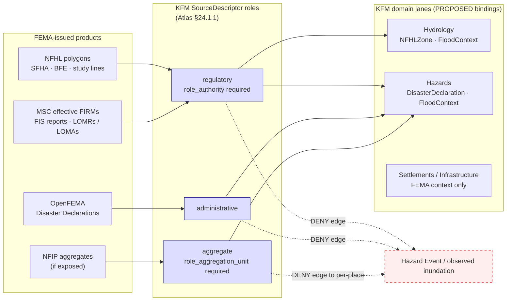
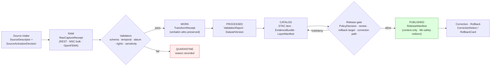
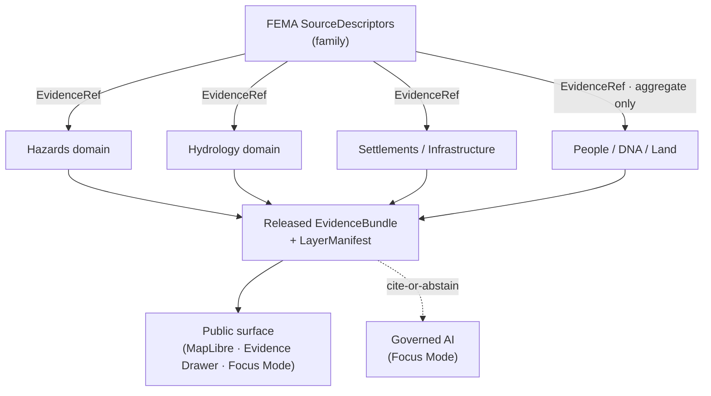
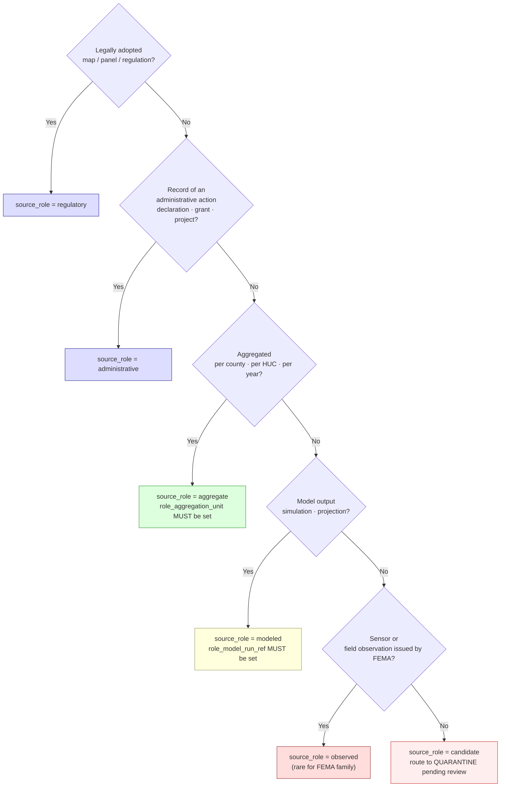

<!-- [KFM_META_BLOCK_V2]
doc_id: kfm://doc/sources/catalog/fema
title: FEMA — Source Family (NFHL, OpenFEMA, MSC)
type: standard
version: v1
status: draft
owners:
  - source-steward: <TODO>
  - hazards-domain-steward: <TODO>
  - hydrology-domain-steward: <TODO>
created: 2026-05-13
updated: 2026-05-21
policy_label: public-context-only; not-for-life-safety
related:
  - docs/doctrine/directory-rules.md
  - docs/doctrine/trust-membrane.md
  - docs/doctrine/lifecycle-law.md
  - docs/sources/README.md
  - docs/sources/SOURCE_DESCRIPTOR_STANDARD.md
  - docs/domains/hazards/README.md
  - docs/domains/hydrology/README.md
  - contracts/domains/hazards/
  - contracts/domains/hydrology/
  - schemas/contracts/v1/source/source-descriptor.json
  - connectors/fema/
  - docs/adr/ADR-0001-schema-home.md
  - docs/adr/ADR-S-04-source-role-vocabulary-v1.md
corpus_ids:
  - KFM-P2-IDEA-0026  # FEMA NFHL / USACE NLD,NID as flood/infrastructure authorities
  - KFM-P2-PROG-0008  # FEMA NFHL + USACE NLD/NID pipeline ingest spec
  - ML-061-017..024   # MapLibre Master FEMA-specific evidence
tags: [kfm, sources, hazards, hydrology, regulatory, fema, nfhl, openfema, msc]
notes:
  - This page is the FEMA *family* catalog entry; each family member still requires its own SourceDescriptor.
  - File path `docs/sources/catalog/FEMA.md` is PROPOSED. `docs/sources/` is CONFIRMED at commit b6a279… per Directory Rules v1.2 §6.1; the `catalog/` subfolder convention is NEEDS VERIFICATION (no ADR observed).
  - All schema, registry, validator, fixture, and connector path claims remain PROPOSED until verified against mounted-repo evidence.
[/KFM_META_BLOCK_V2] -->

# FEMA — Source Family Catalog Entry

*Regulatory flood hazard, federal disaster declaration, and Map Service Center sources from the U.S. Federal Emergency Management Agency, governed under KFM source-role, evidence, sensitivity, and trust-membrane rules.*

[](#status--ownership)
[](#1-overview)
[](#10-verification-backlog)
[](#4-source-roles-and-trust-boundaries)
[](#3-non-ownership-and-life-safety-boundary)
[](#7-rights-attribution-and-redistribution)
[](#9-lifecycle-validators-and-tests)
[](#status--ownership)

> [!IMPORTANT]
> KFM is **not an emergency alerting system.** Every FEMA product on this page is governed as **regulatory** or **administrative** context, never as observed inundation, life-safety guidance, or a real-time warning surface. Public surfaces MUST redirect life-safety action to official FEMA / NWS / state and local emergency channels. CONFIRMED doctrine: [DOM-HAZ] §B (Hazards explicit non-ownership) and [DOM-HYD] §B (Hydrology explicit non-ownership).

---

## Status & Ownership

| Field | Value |
|---|---|
| **Doc status** | `draft` — PROPOSED catalog entry awaiting steward review. |
| **Doctrine basis** | **CONFIRMED.** Sources: KFM-P2-IDEA-0026, KFM-P2-PROG-0008, ML-061-017..024, Domains Atlas §12.D, §24.1; Directory Rules v1.2 §6.1, §7.3. |
| **Implementation basis** | **PROPOSED / NEEDS VERIFICATION.** No mounted repo inspected this session. Schema, registry, validator, fixture, and connector claims default to PROPOSED. |
| **Source steward** | `<TODO: name>` — owns SourceDescriptor lifecycle and admission gate. |
| **Hazards-domain steward** | `<TODO: name>` — owns `DisasterDeclaration` / `FloodContext` (Hazards) meaning. |
| **Hydrology-domain steward** | `<TODO: name>` — owns `NFHLZone` meaning vs. `Observed Flood Event` evidence. |
| **Reviewers required** | Source steward + Hazards-domain steward + Hydrology-domain steward. Federal-public-records source family; no rights-holder review required, but **terms-of-use snapshot** is required. |
| **Schema-home convention** | `schemas/contracts/v1/source/source-descriptor.json` per Directory Rules §7.4 / ADR-0001 (PROPOSED file presence; CONFIRMED convention). |
| **Open ADR dependency** | ADR-S-04 (Source-role vocabulary v1) — PROPOSED in Domains Atlas §24.12; freezes the role enum this page binds to. |
| **Last updated** | 2026-05-21 |

---

## Quick jump

- [1. Overview](#1-overview)
- [2. Source family members](#2-source-family-members)
- [3. Non-ownership and life-safety boundary](#3-non-ownership-and-life-safety-boundary)
- [4. Source roles and trust boundaries](#4-source-roles-and-trust-boundaries)
- [5. Access methods — analytics vs. visualization](#5-access-methods--analytics-vs-visualization)
- [6. Temporal model and version locking](#6-temporal-model-and-version-locking)
- [7. Rights, attribution, and redistribution](#7-rights-attribution-and-redistribution)
- [8. SourceDescriptor field map (PROPOSED)](#8-sourcedescriptor-field-map-proposed)
- [9. Lifecycle, validators, and tests](#9-lifecycle-validators-and-tests)
- [10. Verification backlog](#10-verification-backlog)
- [11. Cross-domain consumers](#11-cross-domain-consumers)
- [12. Related docs](#12-related-docs)
- [Appendix A. NFHL attribute preservation](#appendix-a-nfhl-attribute-preservation)
- [Appendix B. Source-role decision aid](#appendix-b-source-role-decision-aid)
- [Appendix C. Corpus and doctrine references](#appendix-c-corpus-and-doctrine-references)

---

## 1. Overview

The **Federal Emergency Management Agency (FEMA)** publishes several distinct data products that KFM ingests as *context evidence*, never as primary observation of physical events. The corpus is unambiguous on this:

> CONFIRMED doctrine (KFM-P2-IDEA-0026): "FEMA's National Flood Hazard Layer (NFHL) is the canonical flood-hazard authority … ingested with explicit version handling and license posture."

KFM treats every FEMA-issued layer or table as a member of one or more of the **canonical source roles** named in the Master Source-Role Anti-Collapse Register (Domains Atlas §24.1.1):

```text
observed | regulatory | modeled | aggregate | administrative | candidate | synthetic
```

For FEMA, the operative roles are **`regulatory`** (NFHL, MSC) and **`administrative`** (OpenFEMA declarations). The defining rule for this family:

> [!NOTE]
> **Regulatory designation, administrative compilation, and observed event are three different truth classes.**
> A FEMA Special Flood Hazard Area is a **regulatory** designation.
> A FEMA Disaster Declaration is an **administrative** compilation.
> Neither one is an **observed flood event**.
> Domains Atlas §24.1.2 names these collapses as DENY conditions: *regulatory-zone-as-event* and *administrative-compilation-as-observation*. CONFIRMED doctrine.

This page is the **family-level catalog entry**, so that downstream domains (Hazards, Hydrology, Settlements/Infrastructure) bind to one governed admission record set instead of re-deriving rights and source-role decisions per consumer.

---

## 2. Source family members

The table below enumerates the FEMA products KFM has identified for admission or candidacy. **Each row is a separate `SourceDescriptor`** — they share an authority (FEMA) but differ in role, cadence, schema, access method, and validator burden.

| Family member | Issuing authority | Primary product | KFM source role | Status this session |
|---|---|---|---|---|
| **NFHL — National Flood Hazard Layer** | FEMA, via federally adopted Flood Insurance Rate Maps | Regulatory floodplain polygons (SFHAs, BFEs, study lines) | `regulatory` | CONFIRMED doctrine / PROPOSED implementation. Evidence: KFM-P2-IDEA-0026; ML-061-018..024; Domains Atlas §12.D. |
| **MSC — FEMA Map Service Center** | FEMA | Authoritative distribution of effective FIRM panels, FIS reports, LOMRs/LOMAs | `regulatory` (companion to NFHL) | PROPOSED admission. Referenced in Encyclopedia §7.2 ("FEMA NFHL / MSC flood hazard context") and Domains Atlas §12.D. No descriptor verified. |
| **OpenFEMA — Disaster Declarations** | FEMA, via OpenFEMA API | Federal disaster declaration records (DR/EM/FM numbers, declared dates, declared counties) | `administrative` | CONFIRMED doctrine / PROPOSED implementation. Evidence: Domains Atlas §12.D ("FEMA Disaster Declarations / OpenFEMA"). |
| **OpenFEMA — auxiliary tables** (registrations, public-assistance projects, hazard-mitigation grants) | FEMA, via OpenFEMA API | Programmatic administrative tables | `administrative` and/or `aggregate` (per table) | PROPOSED. Not enumerated in attached doctrine; each table needs its own descriptor and rights/sensitivity review. |
| **NFIP — claim and policy aggregates** (if exposed) | FEMA | Aggregated insurance claim/policy data | `aggregate` (`role_aggregation_unit` MUST be set) | UNKNOWN admission. Aggregate-cell-as-truth joins to per-place records are explicitly DENIED (Domains Atlas §24.1.2). |

> [!CAUTION]
> **Each row above is a separate admission decision.** Per the Unified Manual §3.6 (CONFIRMED): *"source role cannot be inferred from convenience."* A change to one family member (cadence, rights, access method, schema, sensitivity) does **not** propagate to the others without a fresh `SourceDescriptor` revision and a new `SourceActivationDecision`.

---

## 3. Non-ownership and life-safety boundary

What FEMA sources in KFM **MUST NOT** do, per KFM doctrine. Each item is paired with its doctrine anchor and the failure-closed control.

| Boundary (MUST NOT) | Doctrine source | Failure-closed control |
|---|---|---|
| Be used as a life-safety alert or emergency warning replacement | [DOM-HAZ] §B; [DOM-HYD] §B (explicit non-ownership) | `not-for-life-safety` banner; official-source redirection on all hazard surfaces |
| NFHL polygons published as *observed* flood extent or forecast | ML-061-018; Domains Atlas §24.1.2 (regulatory-zone-as-event) | Separate `regulatory` and `observed` lanes; renderer-boundary test; DENY at publication gate |
| Disaster Declaration rows published as an observed event timeline | Domains Atlas §24.1.2 (administrative-compilation-as-observation) | Source-role tag preserved through publication; `DisasterDeclaration` object type distinct from `Hazard Event` |
| NFIP aggregate cells cited as per-place / per-parcel truth | Domains Atlas §24.1.2 (aggregate-cell-as-per-place-truth) | Aggregation receipt; geometry-scope guard; AI ABSTAIN on per-place reads of aggregate cells |
| WMS-rasterized FEMA tiles used for analytical joins | ML-061-021 | Analytics-not-visualization test; analytic joins MUST route via vector REST or archived source data |
| BFE / elevation values used in engineering claims without datum/units check | ML-061-022 | Vertical datum validation in `TransformReceipt`; ABSTAIN if datum mismatch unresolved |
| Resale-like flood determinations exported as official KFM products | ML-061-024 | Export language MUST reference FEMA directly; no derivative determination export without rights review |

> [!WARNING]
> **Life-safety redirection is non-negotiable.** Any KFM surface displaying FEMA hazard or declaration content MUST present the official-source-redirection link prominently. This is enforced by the Hazards domain non-ownership rule and the trust-membrane anti-pattern *"KFM used as alert / instruction authority"* (Domains Atlas §24.9.2). Removing or weakening that redirection requires an ADR amending the Hazards boundary rule.

---

## 4. Source roles and trust boundaries

FEMA products span several KFM source roles. Roles are admitted at SourceDescriptor creation and **never edited in place** — corrections issue a new descriptor and a `CorrectionNotice` (Domains Atlas §24.1.3, CONFIRMED).



*Diagram intent.* FEMA products feed `regulatory`, `administrative`, or `aggregate` slots and **MUST NOT** be promoted into a `Hazard Event` / observed-inundation slot without independent observation evidence. Dotted DENY edges are policy-enforced denials (Domains Atlas §24.1.2), not styling.

> [!NOTE]
> The role enum is taken from Domains Atlas §24.1.1 (CONFIRMED). The enum's canonical vocabulary version is governed by **ADR-S-04** (PROPOSED in Domains Atlas §24.12). PROPOSED: actual field names and presence in `schemas/contracts/v1/source/source-descriptor.json` are NEEDS VERIFICATION until the mounted repo is inspected.

---

## 5. Access methods — analytics vs. visualization

FEMA exposes its products through several technical surfaces. KFM treats them differently because the trust-membrane consequences differ. CONFIRMED basis: ML-061-017 (vector REST vs WMS), ML-061-021 (visualization-only), KFM-P2-PROG-0008 (FMSC bulk preferred over WFS).

| Access method | Suitable for | Not suitable for | KFM treatment |
|---|---|---|---|
| **NFHL ArcGIS REST / FeatureServer** | Vector queries, attribute reads, analytical joins, version detection via service metadata | Cosmetic raster rendering at small scale | Primary admission path for NFHL. Watcher polls REST metadata for `VERSION_ID` / `EFFECTIVE_DATE` changes; changed geometries ingested with provenance (ML-061-017, ML-061-023). PROPOSED. |
| **NFHL WMS / WMTS** | Visual overlays on the map shell | Analytics; regulatory interpretation; pixel-level joins | Visualization-only. Analytics-not-visualization test required at admission and at `LayerManifest` emission (ML-061-021). PROPOSED. |
| **FMSC bulk downloads (FIRM panels, FIS reports)** | Authoritative effective-date snapshots, LOMR/LOMA traceability; **preferred over WFS** (KFM-P2-PROG-0008) | Live runtime queries | Periodic archival capture under RAW with retrieval receipt; never a public direct-read path. PROPOSED. |
| **OpenFEMA API** (JSON / CSV) | Declaration records, programmatic tables | Real-time emergency notification | Watcher with rate-limit policy; rights/terms NEEDS VERIFICATION before first public claim. PROPOSED. |

> [!TIP]
> If a downstream consumer asks to *"use the FEMA map for analysis,"* route them to the vector REST endpoint with an `EvidenceRef` resolving to the matching `SourceDescriptor` revision. WMS pixels are a presentation layer, never the answer to a question. (ML-061-021, CONFIRMED.)

**Derived layer delivery format.** KFM-P2-PROG-0008 (PROPOSED) specifies compact **MVT / PMTiles** with per-zoom generalization and minimal attributes as the standard derived-layer format for FEMA hazard data, with sensitive infrastructure generalized or marked restricted per policy.

---

## 6. Temporal model and version locking

NFHL is **not released as a single national vintage** — it changes locally and event-by-event through LOMRs (Letters of Map Revision), LOMAs (Letters of Map Amendment), and panel-by-panel revisions. CONFIRMED in ML-061-019.

KFM tracks the following times distinctly for every FEMA family member (Encyclopedia Appendix E; Domains Atlas §24.1 reading note: "source, observed, valid, retrieval, release, and correction times stay distinct where material"):

| KFM time field | What it means for FEMA sources | DENY / ABSTAIN trigger if missing |
|---|---|---|
| `source_time` | The FEMA-issued `EFFECTIVE_DATE` / declaration date | ABSTAIN at AI; mark candidate stale |
| `observed_time` | **Not applicable** — FEMA products are regulatory or administrative | n/a — leaving `observed_time` unset is *correct* for these roles |
| `valid_time` | The interval during which a panel / declaration is operative | ABSTAIN if `valid_time` end is in the past and surface is presented as current |
| `retrieval_time` | When KFM fetched the artifact from FEMA | DENY if missing — admission cannot complete |
| `release_time` | When KFM released its derived product | DENY at publication gate if missing |
| `correction_time` | If KFM has corrected a prior release | Required on every `CorrectionNotice` |

NFHL identity attributes that KFM **MUST preserve verbatim** when carrying the layer forward (ML-061-020, CONFIRMED):

- `DFIRM_ID` — the digital FIRM identifier
- `VERSION_ID` — the panel version
- `EFFECTIVE_DATE` — the regulatory effective date
- Flood zone designation (e.g., `AE`, `X`, `VE`)
- Study references / FIS docket pointers
- LOMR / LOMA references where carried

> [!WARNING]
> Do not normalize, recode, or summarize these attributes before they reach an `EvidenceBundle`. Their regulatory meaning depends on their exact issued form. Recoding is acceptable in a *derived* layer only, with a `TransformReceipt` and the original values preserved in the catalog record (Encyclopedia Appendix E, CONFIRMED).

---

## 7. Rights, attribution, and redistribution

FEMA is a U.S. federal agency and its data is generally treated as U.S. public records. However, KFM doctrine refuses to **infer** rights from convenience (Unified Manual §3.6, CONFIRMED) — every FEMA family member needs a recorded terms-of-use snapshot before the first public emit.

| Question | Status this session | Required action |
|---|---|---|
| Is bulk redistribution permitted? | NEEDS VERIFICATION — confirm current FEMA / OpenFEMA terms of use at admission | Source steward records terms in `SourceDescriptor`; `SourceActivationDecision` issued before any public emit |
| Is attribution required? | NEEDS VERIFICATION — assume YES until terms confirmed | `LayerManifest` carries a FEMA attribution string; export language references FEMA directly (ML-061-024) |
| Are downstream derivatives permitted? | NEEDS VERIFICATION — likely YES for analytic derivatives, NEEDS VERIFICATION for resale-like determinations | DENY public derivative if terms barred; resale-like flood determinations DENIED regardless |
| Are NFIP claim/policy details public? | UNKNOWN — varies by aggregation level | Aggregate-only at admission; per-place / per-parcel exposure DENIED |
| Is API key required for OpenFEMA? | NEEDS VERIFICATION at admission | If yes, credentials live behind a no-public-path adapter; never embedded in client code |

> [!IMPORTANT]
> **Unknown rights fail closed.** Per Encyclopedia Appendix E and the synthesis doctrine: *"public-safe source admitted only with role and rights known or explicitly held."* Until rights are recorded in a `SourceDescriptor` revision and a `SourceActivationDecision` is issued, no FEMA-derived artifact may transition from CATALOG to PUBLISHED.

---

## 8. SourceDescriptor field map (PROPOSED)

The fields below are **PROPOSED** field-intent expectations for FEMA-family `SourceDescriptor` records. The canonical schema home is `schemas/contracts/v1/source/source-descriptor.json` per Directory Rules §7.4 / ADR-0001 (CONFIRMED convention; PROPOSED file presence). **Actual field names and presence in the mounted schema are NEEDS VERIFICATION** (Domains Atlas §24.1.3).

<details>
<summary><b>NFHL SourceDescriptor — proposed field intent</b></summary>

| Field | Proposed value | Required? | Notes |
|---|---|---|---|
| `source_id` | `fema-nfhl` (or domain-scoped variant) | MUST | Stable across admissions; lower-kebab-case suggested |
| `source_role` | `regulatory` | MUST | Enum from Domains Atlas §24.1.1; vocabulary v1 governed by ADR-S-04 |
| `role_authority` | `FEMA` | MUST (role = regulatory) | Disambiguates citation language |
| `provider` | `FEMA NFHL` | MUST | Public-facing display name |
| `endpoint` | `<TODO: confirm current ArcGIS REST FeatureServer base URL>` | MUST | Anchored at admission; not edited in place |
| `access_method` | `arcgis-rest-featureserver` | MUST | One descriptor per service surface (REST vs WMS = separate descriptors) |
| `rights` | `<TODO: confirm current FEMA terms snapshot>` | MUST | Unknown rights fail closed |
| `attribution_required` | `true` (PROPOSED until confirmed) | MUST | Carried into `LayerManifest` and exports |
| `sensitivity` | `public-context` with life-safety-DENY flag | MUST | Per §3 of this page |
| `cadence` | `event-driven; localized; LOMR/LOMA-based` | MUST | Not a single national release (ML-061-019) |
| `temporal_anchor_fields` | `DFIRM_ID, VERSION_ID, EFFECTIVE_DATE` | MUST | Verbatim preservation rule (ML-061-020) |
| `analytics_visualization_class` | `vector-rest-analytics; wms-visualization-only` | SHOULD | Enforces ML-061-021 |
| `vertical_datum_required` | `true` | MUST | BFE / elevation use blocked without datum receipt (ML-061-022) |
| `public_release_class` | `context-only; not-for-life-safety` | MUST | Drives UI banner and AI cite-or-abstain logic |
| `connector_home` | `connectors/fema/` | SHOULD | CONFIRMED (at commit) per Directory Rules v1.2 §7.3; specific module path NEEDS VERIFICATION |

</details>

<details>
<summary><b>OpenFEMA Disaster Declarations SourceDescriptor — proposed field intent</b></summary>

| Field | Proposed value | Required? | Notes |
|---|---|---|---|
| `source_id` | `fema-openfema-disaster-declarations` | MUST | One descriptor per OpenFEMA dataset |
| `source_role` | `administrative` | MUST | Compilation of issued declarations; NOT observation |
| `role_authority` | `FEMA` | MUST | |
| `provider` | `OpenFEMA` | MUST | |
| `endpoint` | `<TODO: confirm current OpenFEMA API base URL and dataset slug>` | MUST | |
| `access_method` | `openfema-rest-json` | MUST | |
| `rights` | `<TODO: confirm current OpenFEMA terms snapshot>` | MUST | |
| `sensitivity` | `public; aggregate-cell-as-truth DENY` | MUST | |
| `cadence` | `event-driven; declaration-based` | MUST | |
| `temporal_anchor_fields` | `declarationDate, incidentBeginDate, incidentEndDate, disasterNumber` | MUST | Field names PROPOSED; NEEDS VERIFICATION against current OpenFEMA schema |
| `object_lane` | `DisasterDeclaration` (Hazards) | MUST | NOT `Hazard Event` (Domains Atlas §24.1.2) |
| `public_release_class` | `context-only` | MUST | |

</details>

<details>
<summary><b>FEMA MSC SourceDescriptor — proposed field intent</b></summary>

| Field | Proposed value | Required? | Notes |
|---|---|---|---|
| `source_id` | `fema-msc` | MUST | |
| `source_role` | `regulatory` | MUST | |
| `role_authority` | `FEMA` | MUST | |
| `access_method` | `bulk-download; manual-curation` | MUST | Not a live API in the typical sense |
| `cadence` | `panel-by-panel; event-driven` | MUST | Mirrors NFHL changes |
| `archival_class` | `effective-FIRM-snapshot` | SHOULD | Companion to NFHL for LOMR/LOMA traceability |

</details>

[↑ Back to top](#fema--source-family-catalog-entry)

---

## 9. Lifecycle, validators, and tests

FEMA family members flow through the KFM lifecycle invariant (CONFIRMED in Directory Rules v1.2 §0):

> **RAW → WORK / QUARANTINE → PROCESSED → CATALOG / TRIPLET → PUBLISHED**

Promotion is a **governed state transition, not a file move**. The diagram shows the gates each FEMA admission must clear; arrows do not represent storage moves.



**Validator coverage** that FEMA sources MUST trigger (PROPOSED minimums; doctrinal anchors in [DOM-HAZ] §K, [DOM-HYD] §K, Encyclopedia Appendix E, and ML-061-017..024):

| Validator | What it checks for FEMA | DENY-closed outcome |
|---|---|---|
| Source descriptor validator | `source_role`, `role_authority`, `endpoint`, `cadence`, `rights`, `sensitivity` present and well-formed | Reject admission |
| Rights / terms-snapshot validator | Recorded terms snapshot exists; `SourceActivationDecision` records redistribution / attribution | Block publication |
| Sensitivity validator | `public_release_class` set; life-safety flag honored | Block publication; surface banner |
| Temporal validator | `source_time` / `valid_time` / `retrieval_time` present; `VERSION_ID` / `EFFECTIVE_DATE` parsed | Stale-state policy fires |
| Vertical-datum validator (NFHL elevation) | Datum / units recorded; matching `TransformReceipt` for any elevation use | ABSTAIN on engineering claim |
| Attribute-preservation validator (NFHL) | `DFIRM_ID`, `VERSION_ID`, `EFFECTIVE_DATE`, zone, study refs intact in catalog record | Reject normalization that drops them |
| Source-role anti-collapse test | Reject any edge from a `regulatory` or `administrative` descriptor to a `Hazard Event` / observed-inundation object | Test fails closed (Domains Atlas §24.1.2) |
| Analytics-vs-visualization test | WMS endpoint never queried for analytical join | Reject `LayerManifest` (ML-061-021) |
| Renderer-boundary test | No public client reads FEMA from RAW / WORK / QUARANTINE | Test fails closed (Directory Rules §0; trust membrane) |
| Citation validator | Every public claim resolves an `EvidenceRef` to an `EvidenceBundle` whose source is a current FEMA descriptor revision | ABSTAIN at AI; DENY at publication |
| No-network fixture | Validator suite passes on synthetic FEMA fixtures with no live calls | CI gate fails closed |
| Emergency-alert denial | FEMA-derived layers cannot be returned as life-safety alerts ([DOM-HAZ] §K) | Test fails closed |

**Test fixtures** the FEMA family SHOULD ship (PROPOSED home: `tests/fixtures/sources/fema/` or `fixtures/sources/fema/` — NEEDS VERIFICATION against mounted-repo fixture-home convention; Directory Rules v1.2 §6.6 permits fixture split only when README declares differences).

1. A **valid NFHL feature fixture** with intact `DFIRM_ID` / `VERSION_ID` / `EFFECTIVE_DATE`.
2. A **negative fixture** that drops `EFFECTIVE_DATE` — validator MUST DENY.
3. A **negative fixture** asserting a `regulatory` → `Hazard Event` edge — validator MUST DENY.
4. A **WMS-rendered raster** cited as analytic input — validator MUST DENY.
5. A **Disaster Declaration row labeled as `Hazard Event`** — validator MUST DENY.
6. An **NFIP aggregate cell joined to a per-parcel claim** — validator MUST DENY (geometry-scope guard).
7. A **BFE elevation used without datum** — validator MUST ABSTAIN.

[↑ Back to top](#fema--source-family-catalog-entry)

---

## 10. Verification backlog

Items that cannot be confirmed without mounted-repo evidence, current FEMA terms of use, or a steward decision.

| Item | Evidence that would settle it | Status |
|---|---|---|
| Current FEMA NFHL ArcGIS REST FeatureServer URL and field list | Mounted `SourceDescriptor` record + validator fixture | NEEDS VERIFICATION |
| Current OpenFEMA Disaster Declarations API URL, dataset slug, field names | Mounted `SourceDescriptor` record + validator fixture | NEEDS VERIFICATION |
| Current FEMA terms of use / redistribution / attribution language | Dated FEMA terms snapshot recorded in `SourceActivationDecision` | NEEDS VERIFICATION |
| Whether `schemas/contracts/v1/source/source-descriptor.json` exists at that path | Mounted-repo file inspection | NEEDS VERIFICATION |
| Whether `connectors/fema/` modules exist for NFHL, MSC, OpenFEMA | Mounted-repo inspection — root presence CONFIRMED at commit per Directory Rules v1.2 §7.3 | NEEDS VERIFICATION |
| Whether the `docs/sources/catalog/` subfolder is the established convention | Adjacent README in `docs/sources/`, or an ADR | PROPOSED (this page's placement; see Notes) |
| Where FEMA test fixtures actually live (`tests/fixtures/sources/fema/` vs `fixtures/sources/fema/`) | Mounted-repo file inspection | NEEDS VERIFICATION |
| Whether NFIP claim/policy aggregates are admitted at all | Source steward decision + sensitivity review | UNKNOWN |
| Hazard-domain ↔ Hydrology-domain shared-edge handling for NFHL | ADR or shared domain contract | NEEDS VERIFICATION |
| Acceptance of ADR-S-04 (Source-role vocabulary v1) | Accepted ADR in `docs/adr/` | PROPOSED in Domains Atlas §24.12 |

---

## 11. Cross-domain consumers

Domains that bind to FEMA-family `SourceDescriptor` revisions. Each consumer takes the **descriptor revision** as evidence; descriptors are versioned and cited by `EvidenceRef`.

| Consumer domain | Uses | Object families bound to FEMA | Boundary reminder |
|---|---|---|---|
| **Hazards** | NFHL flood context, Disaster Declarations, exposure overlays, hazard timelines | `FloodContext`, `DisasterDeclaration`, `Hazard Timeline`, `ImpactArea`, `Exposure Summary` | Not a life-safety alert system ([DOM-HAZ] §B) |
| **Hydrology** | NFHL regulatory floodplain context, NFHL exposure overlay against hydrography | `NFHLZone`, `Flood Context` (regulatory-context-only); distinct from `Observed Flood Event` | NFHL ≠ observed inundation ([DOM-HYD] §B) |
| **Settlements / Infrastructure** | Disaster Declaration context against townsites; infrastructure exposure | FEMA context bound to settlement and infrastructure objects | Sensitive infrastructure precision DENIED by default (Encyclopedia §7; KFM-P2-PROG-0008) |
| **People / DNA / Land** | Disaster Declaration context against population — **aggregate only** | Aggregate context on settlement / place rollups | Aggregate-cell-as-truth DENY (Domains Atlas §24.1.2) |



> [!NOTE]
> Cross-domain edges go through `EvidenceBundle`, not directly from descriptor to UI. The renderer never reads FEMA bytes from RAW / WORK / QUARANTINE — this is enforced by the trust-membrane invariant (Directory Rules v1.2 §0; Domains Atlas §24.9.2 *"Public client reads RAW / WORK / QUARANTINE"* anti-pattern).

---

## 12. Related docs

- [`docs/doctrine/directory-rules.md`](../../../doctrine/directory-rules.md) — Placement and lifecycle law *(CONFIRMED authored; v1.2 evidence basis)*
- [`docs/doctrine/trust-membrane.md`](../../../doctrine/trust-membrane.md) — Trust-membrane doctrine *(PROPOSED path per Directory Rules §0)*
- [`docs/sources/README.md`](../../README.md) — Sources landing page *(NEEDS VERIFICATION)*
- [`docs/sources/SOURCE_DESCRIPTOR_STANDARD.md`](../../SOURCE_DESCRIPTOR_STANDARD.md) — Standard `SourceDescriptor` field intent *(PROPOSED — not verified in mounted repo)*
- [`docs/domains/hazards/README.md`](../../../domains/hazards/README.md) — Hazards domain consumer *(PROPOSED path)*
- [`docs/domains/hydrology/README.md`](../../../domains/hydrology/README.md) — Hydrology domain consumer *(PROPOSED path)*
- [`contracts/domains/hazards/`](../../../../contracts/domains/hazards/) — Hazards object-family meaning *(PROPOSED path)*
- [`contracts/domains/hydrology/`](../../../../contracts/domains/hydrology/) — Hydrology object-family meaning *(PROPOSED path)*
- [`schemas/contracts/v1/source/source-descriptor.json`](../../../../schemas/contracts/v1/source/source-descriptor.json) — SourceDescriptor schema (per ADR-0001) *(PROPOSED file)*
- [`connectors/fema/`](../../../../connectors/fema/) — FEMA source-specific fetch + admission code *(root CONFIRMED at commit per Directory Rules v1.2 §7.3; module contents NEEDS VERIFICATION)*
- [`docs/adr/ADR-0001-schema-home.md`](../../../adr/ADR-0001-schema-home.md) — Schema home rule *(PROPOSED path)*
- `<TODO>` `docs/adr/ADR-S-04-source-role-vocabulary-v1.md` — Source-role enum vocabulary v1 *(PROPOSED in Domains Atlas §24.12)*
- `<TODO>` `docs/sources/catalog/README.md` — Catalog landing page *(if/when the `catalog/` subfolder is formalized via ADR)*
- `<TODO>` `docs/adr/ADR-####-fema-source-family-admission.md` — Admission ADR for the FEMA family

---

## Appendix A. NFHL attribute preservation

Attributes from NFHL features that MUST be preserved verbatim in the catalog record and propagated to the `EvidenceBundle`. Derivation is permitted; deletion is not. Source: **ML-061-020** (CONFIRMED).

| Attribute | Reason for verbatim preservation |
|---|---|
| `DFIRM_ID` | Identifies the digital FIRM panel; required for any regulatory citation |
| `VERSION_ID` | Version lock; enables stale-state detection (ML-061-019) |
| `EFFECTIVE_DATE` | Regulatory effective date; required for `source_time` |
| Flood zone designation | E.g., `AE`, `X`, `VE`, `A99`; meaning is regulatory and not interpretable from polygon geometry alone |
| Base flood elevation (BFE), where present | Regulatory elevation; engineering use requires vertical datum (ML-061-022) |
| Study reference / FIS docket pointer | Traceability to underlying flood insurance study |
| LOMR / LOMA references where carried | Lineage of map revisions and amendments |

---

## Appendix B. Source-role decision aid

When a new FEMA-issued artifact appears, the steward walks this decision tree before assigning a `source_role`. The tree implements the doctrine that role cannot be inferred from convenience (Unified Manual §3.6, CONFIRMED) and uses the canonical vocabulary from Domains Atlas §24.1.1.



> [!TIP]
> When two roles seem to apply (e.g., a FEMA-published table that summarizes regulatory designations), prefer the **narrower, lower-trust** role. A roll-up of regulatory designations is `aggregate`, not `regulatory`, because the aggregation unit changes how the value may be cited (Domains Atlas §24.1.1 reading note).

---

## Appendix C. Corpus and doctrine references

Stable identifiers and short-names cited on this page. Each is CONFIRMED in the attached doctrine corpus; implementation status remains PROPOSED until mounted-repo evidence is inspected.

| Reference | What it anchors | Evidence basis |
|---|---|---|
| **KFM-P2-IDEA-0026** | NFHL as canonical flood-hazard authority; explicit version handling and license posture | Domains Atlas Pass 32 baseline (CONFIRMED) |
| **KFM-P2-PROG-0008** | Pipeline ingest spec: FMSC bulk preferred over WFS; MVT/PMTiles delivery; sensitive-infrastructure generalization | Domains Atlas Pass 32 baseline (PROPOSED programming) |
| **ML-061-017** | NFHL has analytic vector endpoints distinct from visualization WMS paths | MapLibre Master v1.6 SRC-061 (CONFIRMED evidence) |
| **ML-061-018** | NFHL is regulatory baseline, not a predictive flood model | MapLibre Master v1.6 (CONFIRMED evidence) |
| **ML-061-019** | NFHL updates are localized and event-driven, not one national release date | MapLibre Master v1.6 (CONFIRMED evidence) |
| **ML-061-020** | Flood hazard features carry regulatory attributes that must be preserved verbatim | MapLibre Master v1.6 (CONFIRMED evidence) |
| **ML-061-021** | NFHL WMS is visualization-only for KFM analytics purposes | MapLibre Master v1.6 (CONFIRMED evidence) |
| **ML-061-022** | BFE / elevation use requires datum/units verification | MapLibre Master v1.6 (CONFIRMED evidence) |
| **ML-061-024** | Resale-like determinations are export-language denied | MapLibre Master v1.6 (CONFIRMED evidence) |
| **Domains Atlas §24.1.1–24.1.3** | Source-role anti-collapse register; role enum; descriptor field intent | CONFIRMED doctrine |
| **Directory Rules v1.2** | Placement law; `connectors/fema/` (CONFIRMED at commit `b6a27916…`); `schemas/contracts/v1/` as default schema home per ADR-0001 | CONFIRMED doctrine |
| **[DOM-HAZ] §B** | Hazards explicit non-ownership: not an emergency alert system | CONFIRMED doctrine |
| **[DOM-HYD] §B** | Hydrology explicit non-ownership: NFHL regulatory context ≠ observed inundation | CONFIRMED doctrine |
| **ADR-S-04 (PROPOSED)** | Source-role enum canonical vocabulary v1 | Domains Atlas §24.12 backlog |

---

<sub>**Related docs**: [Directory Rules](../../../doctrine/directory-rules.md) · [Hazards domain](../../../domains/hazards/README.md) · [Hydrology domain](../../../domains/hydrology/README.md) · [SourceDescriptor Standard](../../SOURCE_DESCRIPTOR_STANDARD.md) · [connectors/fema/](../../../../connectors/fema/)</sub>
<sub>**Last updated**: 2026-05-21 · **Doc status**: draft · **Doctrine basis**: CONFIRMED · **Implementation basis**: PROPOSED / NEEDS VERIFICATION</sub>
<sub>[↑ Back to top](#fema--source-family-catalog-entry)</sub>
