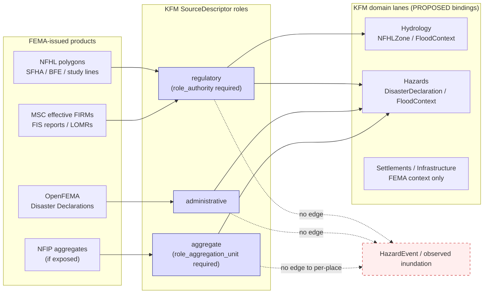
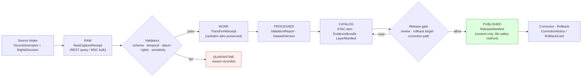
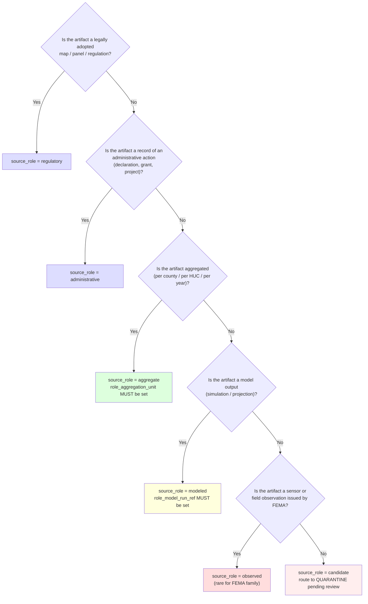

<!-- [KFM_META_BLOCK_V2]
doc_id: kfm://doc/source-catalog/fema
title: FEMA — Source Family (NFHL, OpenFEMA Disaster Declarations, MSC)
type: standard
version: v1
status: draft
owners: <source-steward: TODO> + <hazards-domain-steward: TODO> + <hydrology-domain-steward: TODO>
created: 2026-05-13
updated: 2026-05-13
policy_label: public-context-only; not-for-life-safety
related:
  - docs/doctrine/directory-rules.md
  - docs/sources/SOURCE_DESCRIPTOR_STANDARD.md
  - docs/domains/hazards/README.md
  - docs/domains/hydrology/README.md
  - contracts/source/source_descriptor.md
  - schemas/contracts/v1/source/source-descriptor.json
  - control_plane/source_authority_register.yaml
tags: [kfm, sources, hazards, hydrology, regulatory, fema, nfhl, openfema, msc]
notes:
  - All paths in this block are PROPOSED per Directory Rules until verified against mounted-repo evidence.
  - Page covers a *family* of FEMA-issued sources; each family member needs its own SourceDescriptor.
[/KFM_META_BLOCK_V2] -->

# FEMA — Source Family Catalog Entry

*Regulatory flood hazard, federal disaster declaration, and map-service-center sources from the U.S. Federal Emergency Management Agency, governed under KFM source-role, evidence, and trust-membrane rules.*

> [!IMPORTANT]
> KFM is **not an emergency alerting system**. Every FEMA product on this page is governed as **regulatory** or **administrative** context, never as observed inundation, life-safety guidance, or a real-time warning surface. Public surfaces MUST redirect life-safety action to official FEMA / NWS / local emergency channels.

---

## Status & Ownership

| Field | Value |
|---|---|
| **Doc status** | `draft` — PROPOSED catalog entry awaiting steward review |
| **Doctrine status** | CONFIRMED in attached KFM materials (Encyclopedia §7.10, §7.2; Domains Atlas §12; MapLibre Master v1.6 SRC-061; Directory Rules) |
| **Implementation status** | UNKNOWN — no mounted repo inspected this session; all schema, registry, validator, fixture, and connector claims are PROPOSED |
| **Source steward** | `<TODO: name>` — owns SourceDescriptor lifecycle and admission gate |
| **Hazards-domain steward** | `<TODO: name>` — owns DisasterDeclaration / FloodContext meaning |
| **Hydrology-domain steward** | `<TODO: name>` — owns NFHLZone meaning vs. observed flood evidence |
| **Reviewers required** | Source steward + Hazards-domain steward + Hydrology-domain steward; rights-holder review not required (federal public-records source family) |
| **Schema-home convention** | `schemas/contracts/v1/source/source-descriptor.json` per Directory Rules §7.4 / ADR-0001 (PROPOSED) |
| **Last updated** | 2026-05-13 |

---

## Quick jump

- [1. Overview](#1-overview)
- [2. Source family members](#2-source-family-members)
- [3. Non-ownership and life-safety boundary](#3-non-ownership-and-life-safety-boundary)
- [4. Source roles and trust boundaries](#4-source-roles-and-trust-boundaries)
- [5. Access methods and analytics vs. visualization](#5-access-methods-and-analytics-vs-visualization)
- [6. Temporal model and version locking](#6-temporal-model-and-version-locking)
- [7. Rights, attribution, and redistribution](#7-rights-attribution-and-redistribution)
- [8. SourceDescriptor field map (PROPOSED)](#8-sourcedescriptor-field-map-proposed)
- [9. Lifecycle, validators, and tests](#9-lifecycle-validators-and-tests)
- [10. Verification backlog](#10-verification-backlog)
- [11. Cross-domain consumers](#11-cross-domain-consumers)
- [12. Related docs](#12-related-docs)
- [Appendix A. NFHL attribute preservation](#appendix-a-nfhl-attribute-preservation)
- [Appendix B. Source role decision aid](#appendix-b-source-role-decision-aid)

---

## 1. Overview

The **Federal Emergency Management Agency (FEMA)** publishes several distinct data products that KFM ingests as *context evidence*, never as primary observation of physical events. KFM treats every FEMA-issued layer or table as a member of one or more of the following source roles, drawn from the KFM SourceDescriptor role vocabulary: `regulatory`, `administrative`, `observed` (rare and narrow), `aggregate`. CONFIRMED in KFM Domains Atlas §24.1 and Encyclopedia §3.

The defining KFM rule for FEMA is this:

> [!NOTE]
> **Regulatory designation, administrative compilation, and observed event are three different truth classes.** A FEMA Special Flood Hazard Area is a regulatory designation. A FEMA Disaster Declaration is an administrative compilation. Neither one is an observed flood event. KFM Domains Atlas §24.1 explicitly forbids publishing a regulatory layer as event evidence (DENY) and forbids publishing an administrative compilation as an observed event timeline (DENY). CONFIRMED.

This page collects the FEMA source family in one place so that downstream domains (Hazards, Hydrology, Settlements) can bind to a single, governed admission record set instead of re-deriving rights and source-role decisions per consumer.

---

## 2. Source family members

The table below enumerates the FEMA products KFM admits or has identified as candidates. Each row represents a **separate SourceDescriptor** — they share an authority (FEMA) but differ in role, cadence, schema, access method, and validator burden.

| Family member | Issuing authority | Primary product | KFM source role | Status in this session |
|---|---|---|---|---|
| **NFHL — National Flood Hazard Layer** | FEMA, via federally adopted Flood Insurance Rate Maps | Regulatory floodplain polygons (SFHAs, BFEs, study lines) | `regulatory` | CONFIRMED doctrine / PROPOSED implementation. Attached evidence: Encyclopedia EXT-NFHL; Domains Atlas §12.D; MapLibre Master ML-061-018..024 |
| **MSC — FEMA Map Service Center** | FEMA | Authoritative distribution of effective FIRM panels, FIS reports, LOMRs/LOMAs | `regulatory` (companion to NFHL) | PROPOSED admission — referenced in Encyclopedia §7.2 ("FEMA NFHL / MSC flood hazard context"); no SourceDescriptor verified |
| **OpenFEMA — Disaster Declarations** | FEMA, via OpenFEMA API | Federal disaster declaration records (DR/EM/FM numbers, declared dates, declared counties) | `administrative` | CONFIRMED doctrine / PROPOSED implementation. Attached evidence: Encyclopedia §7.10; Domains Atlas §12.D |
| **OpenFEMA — auxiliary tables** (registrations, public-assistance projects, hazard-mitigation grants) | FEMA, via OpenFEMA API | Programmatic administrative tables | `administrative` / `aggregate` (per table) | PROPOSED — not yet enumerated in attached doctrine; each table needs its own descriptor and rights/sensitivity review |
| **NFIP — claim and policy aggregates (if exposed)** | FEMA | Aggregated insurance claim/policy data | `aggregate` | UNKNOWN admission — sensitive joins from aggregate to per-place truth are explicitly DENIED in Domains Atlas §24.1 (aggregate-cell-as-truth pattern) |

> [!CAUTION]
> Each row in this table is a **separate admission decision** under KFM source-intake doctrine (Encyclopedia §6, Appendix E). No FEMA product is admitted, retired, or quarantined as a group. A change to one family member (cadence, rights, access method, schema, sensitivity) does not propagate to the others without a fresh SourceDescriptor revision. CONFIRMED doctrine; PROPOSED enforcement.

---

## 3. Non-ownership and life-safety boundary

What FEMA sources in KFM **MUST NOT** do, per KFM doctrine. Each item is paired with the doctrine that establishes the boundary and the failure-closed control.

| Boundary (MUST NOT) | Doctrine source | Failure-closed control |
|---|---|---|
| Be used as a life-safety alert or emergency warning replacement | Encyclopedia §7.10; Domains Atlas §12.B | `not-for-life-safety` disclaimer banner; official-source redirection on all hazard surfaces |
| NFHL polygons published as *observed* flood extent or forecast | MapLibre Master ML-061-018; Domains Atlas §24.1 (regulatory-layer-as-event pattern) | Separate `regulatory` and `observed` lanes; renderer-boundary test; DENY at publication gate |
| Disaster Declaration rows published as an observed event timeline | Domains Atlas §24.1 (administrative-compilation-as-observation pattern) | Source-role tag preserved through publication; named `DisasterDeclaration` object type distinct from `HazardEvent` |
| NFIP aggregate cells cited as per-place / per-parcel truth | Domains Atlas §24.1 (aggregate-cell-as-truth pattern) | Aggregation receipt; geometry-scope guard; AI ABSTAIN on per-place reads of aggregate cells |
| WMS-rasterized FEMA tiles used for analytical joins | MapLibre Master ML-061-021 | Analytics-not-visualization test; analytic joins MUST route via vector REST or archived source data |
| BFE / elevation values used in engineering claims without datum/units check | MapLibre Master ML-061-022 | Vertical datum validation in TransformReceipt; ABSTAIN if datum mismatch unresolved |
| Resale-like flood determinations exported as official KFM products | MapLibre Master ML-061-024 | Export language MUST reference FEMA directly; no derivative determination export without rights review |

> [!WARNING]
> **Life-safety redirection is non-negotiable.** Any KFM surface displaying FEMA hazard or declaration content MUST present the official-source-redirection link prominently. This is a CONFIRMED invariant from the Hazards domain (Encyclopedia §7.10.A). Removing or weakening that redirection requires an ADR amending the Hazards boundary rule.

---

## 4. Source roles and trust boundaries

FEMA products span several KFM source roles. Roles are admitted at SourceDescriptor creation and **never edited in place** — corrections issue a new descriptor and a CorrectionNotice (CONFIRMED in Domains Atlas §24.1.3).

*Diagram intent: FEMA products feed regulatory, administrative, or aggregate slots and **MUST NOT** be promoted into a HazardEvent / observed-inundation slot without independent observation evidence. Dotted "no edge" lines are policy-enforced denials, not styling.*

> [!NOTE]
> The role enum (`observed | regulatory | modeled | aggregate | administrative | candidate | synthetic`) is taken from KFM Domains Atlas §24.1.3. PROPOSED: actual file presence and field names in `schemas/contracts/v1/source/source-descriptor.json` are NEEDS VERIFICATION until the mounted repo is inspected.

---

## 5. Access methods and analytics vs. visualization

FEMA exposes its products through several technical surfaces. KFM treats them differently because the trust-membrane consequences differ.

| Access method | Suitable for | Not suitable for | KFM treatment |
|---|---|---|---|
| **NFHL ArcGIS REST / FeatureServer** | Vector queries, attribute reads, analytical joins, version detection via service metadata | Cosmetic raster rendering at small scale | Primary admission path for NFHL. Watcher polls REST metadata for `VERSION_ID` / `EFFECTIVE_DATE` changes; changed geometries ingested with provenance (MapLibre Master ML-061-017, ML-061-023). PROPOSED. |
| **NFHL WMS / WMTS** | Visual overlays on the map shell | Analytics; regulatory interpretation; pixel-level joins | Visualization-only. Analytics-not-visualization test required at admission and at layer-manifest emission (MapLibre Master ML-061-021). PROPOSED. |
| **MSC bulk downloads (FIRM panels, FIS reports)** | Authoritative effective-date snapshots, LOMR/LOMA traceability | Live runtime queries | Periodic archival capture under RAW with retrieval receipt; never a public direct-read path. PROPOSED. |
| **OpenFEMA API** (JSON / CSV) | Declaration records, programmatic tables | Real-time emergency notification | Watcher with rate-limit policy; rights/terms NEEDS VERIFICATION before first public claim. PROPOSED. |

> [!TIP]
> If a downstream consumer wants to "use the FEMA map for analysis," route them to the vector REST endpoint with an `EvidenceRef` to the matching SourceDescriptor revision. WMS pixels are a presentation layer, never the answer to a question.

---

## 6. Temporal model and version locking

NFHL is **not released as a single national vintage** — it changes locally and event-by-event through LOMRs (Letters of Map Revision), LOMAs (Letters of Map Amendment), and panel-by-panel revisions. CONFIRMED in MapLibre Master ML-061-019.

KFM tracks the following times distinctly for every FEMA family member (Encyclopedia §7.2.D and Appendix E):

| KFM time field | What it means for FEMA sources | DENY / ABSTAIN trigger if missing |
|---|---|---|
| `source_time` | The FEMA-issued `EFFECTIVE_DATE` / declaration date | ABSTAIN at AI; mark candidate stale |
| `observed_time` | Not applicable (FEMA products are regulatory or administrative) | n/a — leaving `observed_time` unset is *correct* for these roles |
| `valid_time` | The interval during which a panel / declaration is operative | ABSTAIN if `valid_time` end is in the past and surface is presented as current |
| `retrieval_time` | When KFM fetched the artifact from FEMA | DENY if missing — admission cannot complete |
| `release_time` | When KFM released its derived product | DENY at publication gate if missing |
| `correction_time` | If KFM has corrected a prior release | Required on every CorrectionNotice |

NFHL identity attributes that KFM **MUST preserve verbatim** when carrying the layer forward (MapLibre Master ML-061-020):

- `DFIRM_ID` — the digital FIRM identifier
- `VERSION_ID` — the panel version
- `EFFECTIVE_DATE` — the regulatory effective date
- Flood zone designation (e.g., `AE`, `X`, `VE`)
- Study references / FIS docket pointers

> [!WARNING]
> Do not normalize, recode, or summarize these attributes before they reach an `EvidenceBundle`. Their regulatory meaning depends on their exact issued form. Recoding is acceptable in a *derived* layer only, with a TransformReceipt and the original values preserved in the catalog record.

---

## 7. Rights, attribution, and redistribution

FEMA is a U.S. federal agency and its data is generally treated as U.S. public records. However, KFM doctrine refuses to **infer** rights from convenience (Unified Manual §3.6, CONFIRMED).

| Question | Status in this session | Required action |
|---|---|---|
| Is bulk redistribution permitted? | NEEDS VERIFICATION — confirm current FEMA / OpenFEMA terms of use at admission | Source steward records terms in SourceDescriptor; `RightsDecision` issued before any public emit |
| Is attribution required? | NEEDS VERIFICATION — assume YES until terms confirmed | Layer manifest carries a FEMA attribution string; export language references FEMA directly (ML-061-024) |
| Are downstream derivatives permitted? | NEEDS VERIFICATION — likely YES for analytic derivatives, NEEDS VERIFICATION for resale-like determinations | DENY public derivative if terms barred; resale-like flood determinations DENIED regardless |
| Are NFIP claim/policy details public? | UNKNOWN — varies by aggregation level | Aggregate-only at admission; per-place / per-parcel exposure DENIED |
| Is API key required for OpenFEMA? | NEEDS VERIFICATION at admission | If yes, credentials live behind a no-public-path adapter; never embedded in client code |

> [!IMPORTANT]
> Per KFM doctrine, **unknown rights fail closed** (Encyclopedia Appendix E; Sensitive / Deny-by-Default Register class `Source-rights-limited records`). Until rights are recorded in a SourceDescriptor revision and a `RightsDecision` is issued, no FEMA-derived artifact may transition from CATALOG to PUBLISHED.

---

## 8. SourceDescriptor field map (PROPOSED)

The fields below are **PROPOSED** intent expectations for FEMA-family SourceDescriptors. The canonical schema home is `schemas/contracts/v1/source/source-descriptor.json` per Directory Rules §7.4 / ADR-0001; **actual field presence in the mounted schema is NEEDS VERIFICATION** (Domains Atlas §24.1.3).

<b>NFHL SourceDescriptor — proposed field intent</b>

| Field | Proposed value | Required? | Notes |
|---|---|---|---|
| `source_id` | `fema-nfhl` (or domain-scoped variant) | MUST | Stable across admissions; lower-kebab-case suggested |
| `source_role` | `regulatory` | MUST | Enum from Domains Atlas §24.1.3 |
| `role_authority` | `FEMA` | MUST (role = regulatory) | Disambiguates citation language |
| `provider` | `FEMA NFHL` | MUST | Public-facing display name |
| `endpoint` | `<TODO: confirm current ArcGIS REST FeatureServer base URL>` | MUST | Anchored at admission; not edited in place |
| `access_method` | `arcgis-rest-featureserver` | MUST | One descriptor per service surface (REST vs WMS = separate descriptors) |
| `rights` | `<TODO: confirm current FEMA terms>` | MUST | Unknown rights fail closed |
| `attribution_required` | `true` (PROPOSED until confirmed) | MUST | Carried into LayerManifest and exports |
| `sensitivity` | `public-context` with life-safety-DENY flag | MUST | Per §3 of this page |
| `cadence` | `event-driven; localized; LOMR/LOMA-based` | MUST | Not a single national release |
| `temporal_anchor_fields` | `DFIRM_ID, VERSION_ID, EFFECTIVE_DATE` | MUST | Verbatim preservation rule (ML-061-020) |
| `analytics_visualization_class` | `vector-rest-analytics; wms-visualization-only` | SHOULD | Enforces ML-061-021 |
| `vertical_datum_required` | `true` | MUST | BFE / elevation use blocked without datum receipt (ML-061-022) |
| `public_release_class` | `context-only; not-for-life-safety` | MUST | Drives UI banner and AI cite-or-abstain logic |

<b>OpenFEMA Disaster Declarations SourceDescriptor — proposed field intent</b>

| Field | Proposed value | Required? | Notes |
|---|---|---|---|
| `source_id` | `fema-openfema-disaster-declarations` | MUST | One descriptor per OpenFEMA dataset |
| `source_role` | `administrative` | MUST | Compilation of issued declarations; NOT observation |
| `role_authority` | `FEMA` | MUST | |
| `provider` | `OpenFEMA` | MUST | |
| `endpoint` | `<TODO: confirm current OpenFEMA API base URL and dataset slug>` | MUST | |
| `access_method` | `openfema-rest-json` | MUST | |
| `rights` | `<TODO: confirm current OpenFEMA terms>` | MUST | |
| `sensitivity` | `public; aggregate-cell-as-truth DENY` | MUST | |
| `cadence` | `event-driven; declaration-based` | MUST | |
| `temporal_anchor_fields` | `declarationDate, incidentBeginDate, incidentEndDate, disasterNumber` | MUST | Field names PROPOSED; NEEDS VERIFICATION against current OpenFEMA schema |
| `object_lane` | `DisasterDeclaration` (Hazards) | MUST | NOT `HazardEvent` |
| `public_release_class` | `context-only` | MUST | |

<b>FEMA MSC SourceDescriptor — proposed field intent</b>

| Field | Proposed value | Required? | Notes |
|---|---|---|---|
| `source_id` | `fema-msc` | MUST | |
| `source_role` | `regulatory` | MUST | |
| `role_authority` | `FEMA` | MUST | |
| `access_method` | `bulk-download; manual-curation` | MUST | Not a live API in the typical sense |
| `cadence` | `panel-by-panel; event-driven` | MUST | Mirrors NFHL changes |
| `archival_class` | `effective-FIRM-snapshot` | SHOULD | Companion to NFHL for LOMR/LOMA traceability |

---

## 9. Lifecycle, validators, and tests

FEMA family members flow through the KFM lifecycle invariant (CONFIRMED in Directory Rules §0):

> **RAW → WORK / QUARANTINE → PROCESSED → CATALOG / TRIPLET → PUBLISHED**

Promotion is a **governed state transition, not a file move**. The diagram shows the gates each FEMA admission must clear; arrows do not represent storage moves.

Validator coverage that FEMA sources MUST trigger (PROPOSED minimums, derived from Encyclopedia Appendix E and MapLibre Master ML-061-017..024):

| Validator | What it checks for FEMA | DENY-closed outcome |
|---|---|---|
| Source descriptor validator | `source_role`, `role_authority`, `endpoint`, `cadence`, `rights`, `sensitivity` present and well-formed | Reject admission |
| Rights validator | `RightsDecision` exists; redistribution / attribution recorded | Block publication |
| Sensitivity validator | `public_release_class` set; life-safety flag honored | Block publication; surface banner |
| Temporal validator | `source_time` / `valid_time` / `retrieval_time` present; `VERSION_ID` / `EFFECTIVE_DATE` parsed | Stale-state policy fires |
| Vertical-datum validator (NFHL elevation) | Datum / units recorded; matching transform receipt for any elevation use | ABSTAIN on engineering claim |
| Attribute-preservation validator (NFHL) | `DFIRM_ID`, `VERSION_ID`, `EFFECTIVE_DATE`, zone, study refs intact in catalog record | Reject normalization that drops them |
| Source-role-mismatch denial | Reject any edge from a `regulatory` or `administrative` descriptor to a `HazardEvent` / observed-inundation object | Test fails closed |
| Analytics-vs-visualization test | WMS endpoint never queried for analytical join | Reject layer manifest |
| Renderer-boundary test | No public client reads FEMA from RAW/WORK/QUARANTINE | Test fails closed |
| Citation validator | Every public claim resolves an `EvidenceRef` to an `EvidenceBundle` whose source is a current FEMA descriptor revision | ABSTAIN at AI; DENY at publication |
| No-network fixture | The validator suite passes on synthetic FEMA fixtures with no live calls | CI gate fails closed |

Test fixtures the FEMA family SHOULD ship (PROPOSED home: `tests/fixtures/sources/fema/` or `fixtures/sources/fema/` depending on mounted-repo convention — NEEDS VERIFICATION):

1. A valid NFHL feature fixture with intact `DFIRM_ID` / `VERSION_ID` / `EFFECTIVE_DATE`.
2. A negative fixture that drops `EFFECTIVE_DATE` — validator MUST DENY.
3. A negative fixture asserting a `regulatory` → `HazardEvent` edge — validator MUST DENY.
4. A WMS-rendered raster cited as analytic input — validator MUST DENY.
5. A Disaster Declaration row labeled as `HazardEvent` — validator MUST DENY.
6. An NFIP aggregate cell joined to a per-parcel claim — validator MUST DENY (geometry-scope guard).
7. A BFE elevation used without datum — validator MUST ABSTAIN.

---

## 10. Verification backlog

Items that cannot be confirmed without mounted-repo evidence, current FEMA terms of use, or a steward decision.

| Item | Evidence that would settle it | Status |
|---|---|---|
| Current FEMA NFHL ArcGIS REST FeatureServer URL and field list | Mounted SourceDescriptor record + validator fixture | NEEDS VERIFICATION |
| Current OpenFEMA Disaster Declarations API URL, dataset slug, field names | Mounted SourceDescriptor record + validator fixture | NEEDS VERIFICATION |
| Current FEMA terms of use / redistribution / attribution language | Recorded `RightsDecision` referencing a dated FEMA terms snapshot | NEEDS VERIFICATION |
| Whether `schemas/contracts/v1/source/source-descriptor.json` exists at that path | Mounted-repo file inspection | NEEDS VERIFICATION |
| Whether `contracts/source/source_descriptor.md` exists | Mounted-repo file inspection | NEEDS VERIFICATION |
| Whether `control_plane/source_authority_register.yaml` carries FEMA entries | Mounted-repo file inspection | NEEDS VERIFICATION |
| Where FEMA test fixtures actually live (`tests/fixtures/sources/fema/` vs other) | Mounted-repo file inspection | NEEDS VERIFICATION |
| Whether the `docs/sources/catalog/` subfolder is the established convention | Adjacent README in `docs/sources/`, or an ADR | PROPOSED (this page's placement choice; see Notes) |
| Whether NFIP claim/policy aggregates are admitted at all | Source steward decision + sensitivity review | UNKNOWN |
| Hazard-domain ↔ Hydrology-domain shared-edge handling for NFHL | ADR or shared domain contract | NEEDS VERIFICATION |

---

## 11. Cross-domain consumers

Domains that bind to FEMA-family SourceDescriptors. Each consumer takes the **descriptor revision** as evidence; descriptors are versioned and cited by `EvidenceRef`.

| Consumer domain | Uses | Object families bound to FEMA | Boundary reminder |
|---|---|---|---|
| **Hazards** | NFHL flood context, Disaster Declarations, exposure overlays, hazard timelines | `FloodContext`, `DisasterDeclaration`, `HazardTimeline`, `ImpactArea`, `ExposureSummary` | Not a life-safety alert system (Encyclopedia §7.10.A) |
| **Hydrology** | NFHL regulatory floodplain context, NFHL exposure overlay against hydrography | `NFHLZone`, `FloodContext` (regulatory-context-only); separate from `Observed Flood Event` | NFHL ≠ observed inundation (Domains Atlas §4.B) |
| **Settlements / Infrastructure** | Disaster Declaration context against townsites, infrastructure exposure | FEMA context bound to `Settlement` and infrastructure objects | Sensitive infrastructure precision DENIED by default (Encyclopedia §7) |
| **People / DNA / Land** | Disaster Declaration context against population — aggregate only | Aggregate context on `Settlement` / `Place` rollups | Aggregate-cell-as-truth DENY (Domains Atlas §24.1) |

> [!NOTE]
> Cross-domain edges go through `EvidenceBundle`, not directly from descriptor to UI. The renderer never reads FEMA bytes from RAW / WORK / QUARANTINE — this is enforced by the trust-membrane invariant (Directory Rules §3; Encyclopedia §1 invariants).

---

## 12. Related docs

- [`docs/doctrine/directory-rules.md`](../../../doctrine/directory-rules.md) — Placement and lifecycle law *(target verified in attached file; relative path PROPOSED)*
- [`docs/sources/SOURCE_DESCRIPTOR_STANDARD.md`](../../SOURCE_DESCRIPTOR_STANDARD.md) — Standard SourceDescriptor field intent *(PROPOSED — not verified in mounted repo)*
- [`docs/domains/hazards/README.md`](../../../domains/hazards/README.md) — Hazards domain consumer *(PROPOSED path)*
- [`docs/domains/hydrology/README.md`](../../../domains/hydrology/README.md) — Hydrology domain consumer *(PROPOSED path)*
- [`contracts/source/source_descriptor.md`](../../../../contracts/source/source_descriptor.md) — SourceDescriptor semantic contract *(PROPOSED path)*
- [`schemas/contracts/v1/source/source-descriptor.json`](../../../../schemas/contracts/v1/source/source-descriptor.json) — SourceDescriptor schema (per ADR-0001) *(PROPOSED path)*
- [`control_plane/source_authority_register.yaml`](../../../../control_plane/source_authority_register.yaml) — Authority register *(PROPOSED path)*
- `<TODO>` `docs/sources/catalog/README.md` — Catalog landing page *(if/when the catalog/ subfolder is formalized)*
- `<TODO>` `docs/adr/ADR-####-fema-source-family-admission.md` — Admission ADR for the FEMA family

---

## Appendix A. NFHL attribute preservation

Attributes from NFHL features that MUST be preserved verbatim in the catalog record and propagated to the EvidenceBundle. Derivation is permitted; deletion is not. Source: MapLibre Master ML-061-020 (CONFIRMED).

| Attribute | Reason for verbatim preservation |
|---|---|
| `DFIRM_ID` | Identifies the digital FIRM panel; required for any regulatory citation |
| `VERSION_ID` | Version lock; enables stale-state detection (ML-061-019) |
| `EFFECTIVE_DATE` | Regulatory effective date; required for `source_time` |
| Flood zone designation | E.g., `AE`, `X`, `VE`, `A99`; meaning is regulatory and not interpretable from polygon geometry alone |
| Base flood elevation (BFE), where present | Regulatory elevation; engineering use requires vertical datum (ML-061-022) |
| Study reference / FIS docket pointer | Traceability to underlying flood insurance study |
| LOMR / LOMA references where carried | Lineage of map revisions and amendments |

---

## Appendix B. Source role decision aid

When a new FEMA-issued artifact appears, the steward walks this decision tree before assigning a SourceDescriptor role. The tree implements the doctrine that role cannot be inferred from convenience (Unified Manual §3.6, CONFIRMED).

> [!TIP]
> When two roles seem to apply (e.g., a FEMA-published table that summarizes regulatory designations), prefer the **narrower, lower-trust** role. A roll-up of regulatory designations is `aggregate`, not `regulatory`, because the aggregation unit changes how the value may be cited.

---

**Related docs**: [Directory Rules](../../../doctrine/directory-rules.md) · [Hazards domain](../../../domains/hazards/README.md) · [Hydrology domain](../../../domains/hydrology/README.md) · [SourceDescriptor Standard](../../SOURCE_DESCRIPTOR_STANDARD.md)
**Last updated**: 2026-05-13 · **Doc status**: draft · **Doctrine basis**: CONFIRMED · **Implementation basis**: PROPOSED / NEEDS VERIFICATION
[↑ Back to top](#fema--source-family-catalog-entry)
