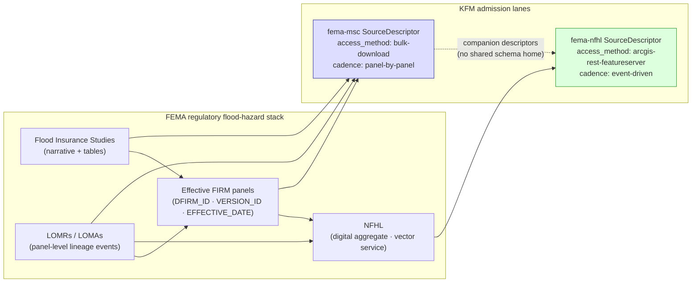

<!-- [KFM_META_BLOCK_V2]
doc_id: kfm://doc/docs-sources-catalog-fema-map-service-center
title: FEMA Map Service Center (MSC)
type: product-page
version: v0.2
status: draft
owners:
  - <PLACEHOLDER — Docs steward>
  - <PLACEHOLDER — Source steward for fema>
  - <PLACEHOLDER — Hazards-domain steward>
  - <PLACEHOLDER — Hydrology-domain steward>
created: 2026-05-20
updated: 2026-05-21
policy_label: public-context-only; not-for-life-safety
related:
  - docs/sources/catalog/fema/README.md
  - docs/sources/catalog/fema/NATIONAL-FLOOD-HAZARD-LAYER.md
  - docs/sources/catalog/README.md
  - docs/sources/catalog/IDENTITY.md
  - docs/sources/catalog/RIGHTS-AND-SENSITIVITY-MAP.md
  - docs/sources/catalog/_examples/stac-item-example.json
  - docs/doctrine/directory-rules.md
  - docs/doctrine/lifecycle-law.md
  - data/registry/sources/
  - connectors/fema/
  - schemas/contracts/v1/source/source-descriptor.json
  - docs/adr/ADR-0001-schema-home.md
corpus_anchors:
  - KFM-P2-IDEA-0026   # NFHL/USACE NLD,NID as flood/infrastructure authorities
  - KFM-P2-PROG-0008   # FMSC bulk extracts preferred over WFS feature-count caps
  - ML-061-019         # NFHL updates localized & event-driven via LOMR/LOMA
  - ML-061-020         # Regulatory attributes preserved verbatim
tags: [kfm, docs, sources, catalog, fema, msc, regulatory]
notes:
  - "PROPOSED product-page; sibling-link presence verified in prior Claude Code session."
  - "MSC is the authoritative distribution channel for effective FIRM panels; NFHL is the digital aggregate of those panels. The two are companion descriptors, not duplicates."
  - "Path `docs/sources/catalog/fema/MAP-SERVICE-CENTER.md` is PROPOSED. `docs/sources/` is CONFIRMED at commit per Directory Rules v1.2 §6.1; `catalog/` subfolder convention is NEEDS VERIFICATION (no ADR observed)."
[/KFM_META_BLOCK_V2] -->

# FEMA Map Service Center (MSC)

> Authoritative distribution channel for effective FIRM panels, Flood Insurance Studies (FIS), Letters of Map Revision (LOMRs), and Letters of Map Amendment (LOMAs).

[](#status--ownership)
[](./README.md)
[](#3-msc-vs-nfhl--the-canonical-distinction)
[](#1-overview)
[](#open-questions)
[](#rights-and-sensitivity)
[](#validation-and-catalog-closure)
[](#last-reviewed)

> [!IMPORTANT]
> MSC artifacts are governed as **regulatory context**, never as observed inundation or life-safety guidance. Effective FIRMs are *legally adopted* flood-hazard maps, but they are not real-time warnings. Public surfaces displaying MSC-derived content MUST redirect life-safety action to official FEMA / NWS / state and local emergency channels. CONFIRMED doctrine: [DOM-HAZ] §B, [DOM-HYD] §B.

---

## Status & Ownership

| Field | Value |
|---|---|
| **Doc status** | `draft` — PROPOSED product page; sibling-link references verified, content scope PROPOSED |
| **Family page** | [`./README.md`](./README.md) — the FEMA family-level catalog entry |
| **Sibling page** | [`./NATIONAL-FLOOD-HAZARD-LAYER.md`](./NATIONAL-FLOOD-HAZARD-LAYER.md) — companion NFHL descriptor *(NEEDS VERIFICATION — sibling presence)* |
| **Doctrine basis** | **CONFIRMED.** Sources: KFM-P2-IDEA-0026, KFM-P2-PROG-0008, ML-061-019, ML-061-020, Encyclopedia §7.2 ("FEMA NFHL / MSC flood hazard context"), Domains Atlas §12.D |
| **Implementation basis** | **PROPOSED / NEEDS VERIFICATION** — no mounted repo inspected this session; all schema, registry, validator, and connector path claims default to PROPOSED |
| **Source role** | `regulatory` (companion to NFHL); enum governed by Domains Atlas §24.1.1 and proposed ADR-S-04 |
| **Schema-home convention** | `schemas/contracts/v1/source/source-descriptor.json` per ADR-0001 (CONFIRMED convention; PROPOSED file presence) |
| **Last reviewed** | 2026-05-21 |

---

## Quick jump

- [1. Overview](#1-overview)
- [2. MSC artifact types](#2-msc-artifact-types)
- [3. MSC vs NFHL — the canonical distinction](#3-msc-vs-nfhl--the-canonical-distinction)
- [Source authority](#source-authority)
- [Catalog profiles used](#catalog-profiles-used)
- [Collection identity](#collection-identity)
- [Provenance fields](#provenance-fields)
- [Access method and cadence](#access-method-and-cadence)
- [Temporal handling](#temporal-handling)
- [Geometry and projection](#geometry-and-projection)
- [Rights and sensitivity](#rights-and-sensitivity)
- [Validation and catalog closure](#validation-and-catalog-closure)
- [Related contracts and schemas](#related-contracts-and-schemas)
- [Related connectors and pipelines](#related-connectors-and-pipelines)
- [Examples](#examples)
- [Open questions](#open-questions)
- [Related docs](#related-docs)
- [Last reviewed](#last-reviewed)

---

## 1. Overview

The **FEMA Map Service Center (MSC)** is the authoritative distribution surface for the effective Flood Insurance Rate Maps (FIRMs) that comprise the U.S. National Flood Insurance Program (NFIP). Where the **National Flood Hazard Layer (NFHL)** offers the digital, query-able aggregate of those panels, MSC offers the **panel-by-panel snapshots and their underlying engineering studies** — the artifacts a flood-insurance officer, mortgage underwriter, or local floodplain administrator would cite as the legally effective regulatory product.

KFM ingests MSC as a **`regulatory`** source-role descriptor (Domains Atlas §24.1.1, CONFIRMED), companion to NFHL, for three reasons:

1. **LOMR / LOMA traceability** — Effective FIRMs change panel-by-panel through Letters of Map Revision (LOMRs) and Letters of Map Amendment (LOMAs); MSC is where those lineage events are first authoritatively published. CONFIRMED basis: ML-061-019.
2. **Effective-FIRM snapshots** — MSC supplies the legally adopted panel image / GIS package corresponding to a specific `EFFECTIVE_DATE`; NFHL polygons must trace back to one. CONFIRMED basis: ML-061-020 (regulatory attributes preserved verbatim).
3. **Bulk preferred over WFS** — KFM doctrine PROPOSED in KFM-P2-PROG-0008 prefers MSC-style bulk extracts over WFS feature-count-capped queries for any backfill or archival use.

> [!NOTE]
> MSC is a **distribution channel**, not an interactive analytics service. Analytical queries belong to the NFHL ArcGIS REST FeatureServer (see [`./NATIONAL-FLOOD-HAZARD-LAYER.md`](./NATIONAL-FLOOD-HAZARD-LAYER.md)). MSC content reaches KFM through periodic archival capture under RAW, never through a public direct-read path. PROPOSED implementation; CONFIRMED doctrine ([DOM-HAZ] trust-membrane; Directory Rules v1.2 §0).

---

## 2. MSC artifact types

The MSC distributes several distinct artifact families. Each warrants its own validator coverage and may need its own `SourceDescriptor` revision if cadence or rights differ.

| MSC artifact | What it is | KFM treatment | Status |
|---|---|---|---|
| **Effective FIRM panel** | The legally adopted printed/GIS flood-hazard map for a specific community or countywide area, identified by `DFIRM_ID` + `VERSION_ID` + `EFFECTIVE_DATE` | Verbatim attribute preservation in catalog record; `regulatory` source role; bound to `NFHLZone` (Hydrology) or `FloodContext` (Hazards) | CONFIRMED doctrine / PROPOSED implementation |
| **Flood Insurance Study (FIS)** | The narrative engineering study and tables (profiles, floodway data, hydrology summaries) backing one or more FIRM panels | Archival under RAW; FIS docket pointers preserved per ML-061-020 | PROPOSED |
| **LOMR — Letter of Map Revision** | Official revision of an effective FIRM (typically after levee certification, channel work, or new study) | Lineage event tracked through `correction_time`; supersedes prior panel version where it applies | CONFIRMED doctrine (ML-061-019) / PROPOSED implementation |
| **LOMA — Letter of Map Amendment** | Formal exclusion of a specific property (typically by elevation) from a Special Flood Hazard Area | Per-property scope; **MUST NOT** be used to imply a regulatory change to the surrounding panel | PROPOSED |
| **Preliminary FIRM** | Proposed flood-hazard map issued before formal adoption; not yet legally effective | Admitted as `candidate` source role until effective, then re-issued as `regulatory` with a new descriptor revision | PROPOSED; see Domains Atlas §24.1.1 "Candidate" |

> [!CAUTION]
> A **preliminary FIRM** is not a regulatory product yet. Publishing it under the `regulatory` role would be a source-role-collapse anti-pattern (Domains Atlas §24.1.2). It must enter through the `candidate` lane and graduate via a fresh `SourceDescriptor` + `SourceActivationDecision` on the date of formal adoption.

[↑ Back to top](#fema-map-service-center-msc)

---

## 3. MSC vs NFHL — the canonical distinction

MSC and NFHL are **companions, not duplicates.** They represent the same regulatory truth at different layers of the FEMA stack.



| Aspect | **MSC (this page)** | **NFHL (sibling page)** |
|---|---|---|
| Primary artifact | Effective FIRM panels, FIS reports, LOMRs, LOMAs | Vector floodplain polygons (SFHAs, BFEs, study lines) |
| Source role | `regulatory` (snapshot / archival) | `regulatory` (live vector service) |
| Access method | `bulk-download; manual-curation` | `arcgis-rest-featureserver` (analytics) and `wms` (visualization-only) |
| Cadence | Panel-by-panel; event-driven via LOMR/LOMA | Event-driven; reflected through service metadata (`VERSION_ID`) |
| KFM admission lane | Periodic archival capture under RAW | REST watcher polling for `VERSION_ID` / `EFFECTIVE_DATE` changes |
| Citation pattern | Cites a specific panel + LOMR lineage | Cites the current NFHL vintage at retrieval time |
| KFM role | Effective-FIRM snapshot + traceability | Digital aggregate for analytical joins |

> [!NOTE]
> When a downstream Evidence Drawer wants to **prove** that a feature lies in an SFHA, the bundle should cite **both**: the NFHL polygon (for the geometry and zone designation) and the MSC FIRM panel (for the effective-date snapshot the polygon was derived from). This is the corpus's *regulatory-attributes-preserved-verbatim* posture (ML-061-020, CONFIRMED).

---

## Source authority

See [`data/registry/sources/`](../../../../data/registry/sources/) for the authoritative `SourceDescriptor`. **Do not duplicate descriptor fields here.** The fields below are *intent* expectations only; binding values live in the registry.

| Field | Proposed intent for `fema-msc` | Required? |
|---|---|---|
| `source_id` | `fema-msc` | MUST |
| `source_role` | `regulatory` | MUST |
| `role_authority` | `FEMA` | MUST (role = regulatory) |
| `provider` | `FEMA Map Service Center` | MUST |
| `access_method` | `bulk-download; manual-curation` | MUST |
| `cadence` | `panel-by-panel; event-driven` | MUST |
| `archival_class` | `effective-FIRM-snapshot` | SHOULD |
| `endpoint` | `<PLACEHOLDER — confirm current MSC URL>` | MUST |
| `rights` | `<PLACEHOLDER — confirm current FEMA terms snapshot>` | MUST |
| `public_release_class` | `context-only; not-for-life-safety` | MUST |
| `connector_home` | `connectors/fema/` | SHOULD |

> [!TIP]
> Schema home is `schemas/contracts/v1/source/source-descriptor.json` per **ADR-0001** (CONFIRMED convention; PROPOSED file presence). Vocabulary for `source_role` is governed by proposed **ADR-S-04** (Source-role vocabulary v1; PROPOSED in Domains Atlas §24.12).

---

## Catalog profiles used

| Profile | Lane | Used by this product? |
|---|---|---|
| STAC | `data/catalog/stac/` | PROPOSED — likely Yes (panel-as-item; FIS-as-attached-asset) — NEEDS VERIFICATION |
| DCAT | `data/catalog/dcat/` | PROPOSED — Yes / No (NEEDS VERIFICATION) |
| PROV-O | `data/catalog/prov/` | PROPOSED — Yes (LOMR/LOMA lineage maps to `prov:wasRevisionOf`) — NEEDS VERIFICATION |
| Domain projection | `data/catalog/domain/hazards/` and `data/catalog/domain/hydrology/` | PROPOSED — both domains bind to MSC for regulatory context — NEEDS VERIFICATION |

---

## Collection identity

- PROPOSED Collection id pattern: `kfm-fema-msc` (see [`../IDENTITY.md`](../IDENTITY.md) for the family-level pattern).
- PROPOSED namespace: `kfm:` *(see OPEN-DSC-03)*.
- PROPOSED item id pattern: `kfm-fema-msc-<dfirm_id>-<version_id>` to encode the FIRM panel identity verbatim (ML-061-020, CONFIRMED).
- Asset roles: NEEDS VERIFICATION — confirm against `schemas/contracts/v1/source/` once mounted.

---

## Provenance fields

STAC `properties.kfm:provenance` block (PROPOSED — Pass-10 C4-01):

- `spec_hash` — sha256 of the canonical record.
- `evidence_bundle_ref` — `kfm://evidence/<digest>`.
- `run_record_ref` — `kfm://run/<run-id>`.
- `audit_ref` — `kfm://audit/<attestation-id>`.
- `policy_digest` — sha256 of the policy bundle.

Per-asset integrity: `file:checksum` on each panel / FIS PDF / LOMR document.

> [!NOTE]
> For MSC specifically, `prov:wasRevisionOf` is the right shape to encode a LOMR or LOMA's relationship to a prior panel version. Preserve `DFIRM_ID`, `VERSION_ID`, and `EFFECTIVE_DATE` verbatim in every revision link (ML-061-020, CONFIRMED).

---

## Access method and cadence

CONFIRMED basis: KFM-P2-PROG-0008 (PROPOSED programming), ML-061-019 (CONFIRMED evidence).

| Aspect | MSC posture |
|---|---|
| Preferred access | **Bulk download** of effective FIRM panels and FIS reports; manual or scripted retrieval keyed by community / county / FIRM panel id |
| Why not WFS? | WFS endpoints are feature-count-capped and unsuitable for bulk archival (KFM-P2-PROG-0008, PROPOSED) |
| Polling cadence | Event-driven; new LOMRs/LOMAs trigger fetch; periodic sweep for missed events |
| Watcher class | Periodic archival watcher; **not** a real-time alert watcher |
| Public read path | **None.** MSC content reaches the public via the released `LayerManifest` / Evidence Drawer surface, not by direct fetch (renderer-boundary rule, CONFIRMED in Directory Rules v1.2 §0) |

---

## Temporal handling

PROPOSED — keep source / observed / valid / retrieval / release / correction times distinct where material (Domains Atlas §24.1 reading note, CONFIRMED).

| KFM time field | What it means for MSC | Notes |
|---|---|---|
| `source_time` | The panel's `EFFECTIVE_DATE` (or LOMR effective date) | Required for citation |
| `observed_time` | **Not applicable** — MSC products are regulatory, not observed | Leave unset (correct posture) |
| `valid_time` | Interval during which the panel / LOMR is operative — open-ended until superseded | Must close out when a LOMR or new panel supersedes it |
| `retrieval_time` | When KFM fetched the panel / FIS / LOMR document | DENY admission if missing |
| `release_time` | When KFM released its derived product citing this MSC artifact | DENY publication if missing |
| `correction_time` | If KFM has corrected a prior release | Required on every `CorrectionNotice` |

---

## Geometry and projection

PROPOSED — confirm CRS, generalization rules, and scale support against `data/catalog/` artifacts. NEEDS VERIFICATION.

MSC FIRM panels are typically distributed as authoritative GIS packages or rasterized panels; KFM treats panel geometry as **archival reference** only. Live cartographic generalization belongs to the NFHL vector pipeline, not to MSC.

> [!WARNING]
> Base flood elevation (BFE) values from MSC documents MUST NOT be used in engineering claims without a recorded vertical datum and `TransformReceipt` (ML-061-022, CONFIRMED). Datum mismatch is an ABSTAIN condition.

---

## Rights and sensitivity

NEEDS VERIFICATION — see [`../../../../policy/sensitivity/`](../../../../policy/sensitivity/) and [`../RIGHTS-AND-SENSITIVITY-MAP.md`](../RIGHTS-AND-SENSITIVITY-MAP.md). **Do not restate policy here.**

Family-level rights posture is summarized in [`./README.md` §7](./README.md). Key MSC-specific reminders:

- FEMA is a U.S. federal agency; MSC content is generally treated as U.S. public records. **Current terms of use snapshot remains NEEDS VERIFICATION** before first public emit (Unified Manual §3.6, CONFIRMED: rights cannot be inferred from convenience).
- **Resale-like flood determinations** based on MSC FIRMs are DENIED as KFM export products regardless of upstream rights (ML-061-024, CONFIRMED).
- Attribution to FEMA is required in any `LayerManifest` and any export language (assume YES until terms confirmed).

---

## Validation and catalog closure

- **Catalog closure required before public release** (Pass-10 / KFM-P1-IDEA-0020) — PROPOSED.
- **STAC Projection lint** (KFM-P27-FEAT-0003) — PROPOSED.
- **STAC checksum closure** against the `ReleaseManifest` digest (KFM-P22-PROG-0037) — PROPOSED.
- **Verbatim-attribute-preservation validator** — `DFIRM_ID`, `VERSION_ID`, `EFFECTIVE_DATE`, zone, study refs intact in catalog record (ML-061-020, CONFIRMED basis).
- **LOMR/LOMA lineage validator** — every revision links via `prov:wasRevisionOf` to its prior panel version (PROPOSED).
- **Source-role anti-collapse test** — reject any edge from this `regulatory` descriptor to a `Hazard Event` / observed-inundation object (Domains Atlas §24.1.2, CONFIRMED).
- **Renderer-boundary test** — no public client reads MSC bytes from RAW / WORK / QUARANTINE (Directory Rules v1.2 §0, CONFIRMED).
- **No-network fixture** — validator suite passes on synthetic MSC fixtures with no live calls (PROPOSED).

---

## Related contracts and schemas

- `contracts/domains/hazards/` — `DisasterDeclaration` / `FloodContext` (Hazards) — NEEDS VERIFICATION.
- `contracts/domains/hydrology/` — `NFHLZone` / `Flood Context` (Hydrology) — NEEDS VERIFICATION.
- `schemas/contracts/v1/source/source-descriptor.json` — per **ADR-0001** (CONFIRMED convention; PROPOSED file presence).
- `schemas/contracts/v1/receipts/` — `TransformReceipt`, `CorrectionNotice`, `RawCaptureReceipt` — NEEDS VERIFICATION.

---

## Related connectors and pipelines

- [`connectors/fema/`](../../../../connectors/fema/) — root **CONFIRMED at commit** per Directory Rules v1.2 §7.3; specific MSC module path NEEDS VERIFICATION.
- `pipelines/ingest/`, `pipelines/normalize/`, `pipelines/validate/`, `pipelines/catalog/` — phase-canonical paths CONFIRMED in Directory Rules v1.2 §7.4; MSC bindings NEEDS VERIFICATION.
- `pipeline_specs/hazards/` and `pipeline_specs/hydrology/` — declarative specs for MSC-bound pipelines — NEEDS VERIFICATION.

---

## Examples

*(Illustrative only — do not treat as authoritative.)*

<details>
<summary><b>Minimal STAC + <code>kfm:provenance</code> shape for an MSC panel</b></summary>

See [`../_examples/stac-item-example.json`](../_examples/stac-item-example.json) for the canonical example file.

```json
{
  "type": "Feature",
  "id": "kfm-fema-msc-<DFIRM_ID>-<VERSION_ID>",
  "collection": "kfm-fema-msc",
  "properties": {
    "datetime": "<EFFECTIVE_DATE>",
    "kfm:provenance": {
      "spec_hash": "sha256:<placeholder>",
      "evidence_bundle_ref": "kfm://evidence/<digest>",
      "run_record_ref": "kfm://run/<run-id>",
      "audit_ref": "kfm://audit/<attestation-id>",
      "policy_digest": "sha256:<placeholder>"
    },
    "kfm:source_role": "regulatory",
    "kfm:role_authority": "FEMA",
    "fema:DFIRM_ID": "<DFIRM_ID>",
    "fema:VERSION_ID": "<VERSION_ID>",
    "fema:EFFECTIVE_DATE": "<YYYY-MM-DD>"
  },
  "assets": {
    "firm_panel": {
      "href": "<archival URI under data/raw/hazards/fema-msc/...>",
      "type": "application/pdf",
      "roles": ["data", "regulatory-snapshot"],
      "file:checksum": "1220<sha256-multihash>"
    },
    "fis_report": {
      "href": "<archival URI>",
      "type": "application/pdf",
      "roles": ["metadata", "study"]
    }
  }
}
```

</details>

> [!NOTE]
> The example above is **illustrative**. Field names under `fema:` and the exact `kfm:provenance` shape remain PROPOSED until the canonical schema is verified in the mounted repo.

---

## Open questions

| # | Question | Status |
|---|---|---|
| OPEN-MSC-01 | Confirm current MSC bulk-download endpoint URL and API surface (if any) | PROPOSED |
| OPEN-MSC-02 | Confirm rights status, terms-of-use snapshot, and CARE applicability (CARE is unlikely relevant for federal flood maps but should be checked) | PROPOSED |
| OPEN-MSC-03 | Confirm whether MSC products warrant their own STAC Collection (`kfm-fema-msc`) or share one with NFHL (`kfm-fema-flood-regulatory`) | PROPOSED |
| OPEN-MSC-04 | Confirm LOMR/LOMA lineage encoding — `prov:wasRevisionOf` vs. a KFM-native `correction_lineage` field | PROPOSED |
| OPEN-MSC-05 | Confirm whether preliminary FIRMs are admitted as `candidate` or held at intake until effective | PROPOSED |
| OPEN-MSC-06 | Confirm fixture home (`tests/fixtures/sources/fema/msc/` vs `fixtures/sources/fema/msc/`) per Directory Rules v1.2 §6.6 | NEEDS VERIFICATION |
| OPEN-MSC-07 | Verify `connectors/fema/msc/` module exists and emits to `data/raw/<domain>/fema-msc/<run_id>/` | NEEDS VERIFICATION |

---

## Related docs

- [`./README.md`](./README.md) — FEMA family-level catalog entry
- [`./NATIONAL-FLOOD-HAZARD-LAYER.md`](./NATIONAL-FLOOD-HAZARD-LAYER.md) — companion NFHL descriptor *(NEEDS VERIFICATION — sibling presence)*
- [`../README.md`](../README.md) — Source catalog landing page
- [`../IDENTITY.md`](../IDENTITY.md) — Collection / item identity patterns
- [`../RIGHTS-AND-SENSITIVITY-MAP.md`](../RIGHTS-AND-SENSITIVITY-MAP.md) — Rights and sensitivity registry
- [`../_examples/stac-item-example.json`](../_examples/stac-item-example.json) — Reference STAC + `kfm:provenance` shape
- [`../../../doctrine/directory-rules.md`](../../../doctrine/directory-rules.md) — Placement and lifecycle law (v1.2)
- [`../../../doctrine/lifecycle-law.md`](../../../doctrine/lifecycle-law.md) — Lifecycle invariant *(PROPOSED path)*
- [`../../../adr/ADR-0001-schema-home.md`](../../../adr/ADR-0001-schema-home.md) — Schema home rule
- `<TODO>` `../../../adr/ADR-S-04-source-role-vocabulary-v1.md` — Source-role vocabulary v1 (PROPOSED in Domains Atlas §24.12)

---

## Last reviewed

2026-05-21 *(Claude Code product-page evidence-grounded revision; doctrine basis CONFIRMED, implementation basis PROPOSED / NEEDS VERIFICATION until mounted-repo inspection).*

---

<sub>**Related docs**: [FEMA family](./README.md) · [NFHL sibling](./NATIONAL-FLOOD-HAZARD-LAYER.md) · [Directory Rules](../../../doctrine/directory-rules.md) · [connectors/fema/](../../../../connectors/fema/)</sub>
<sub>**Last updated**: 2026-05-21 · **Doc status**: draft · **Doctrine basis**: CONFIRMED · **Implementation basis**: PROPOSED / NEEDS VERIFICATION</sub>
<sub>[↑ Back to top](#fema-map-service-center-msc)</sub>
