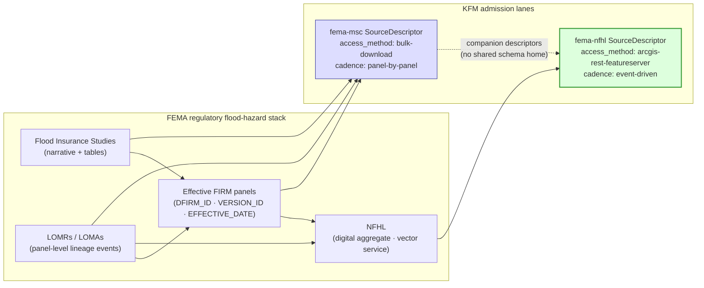
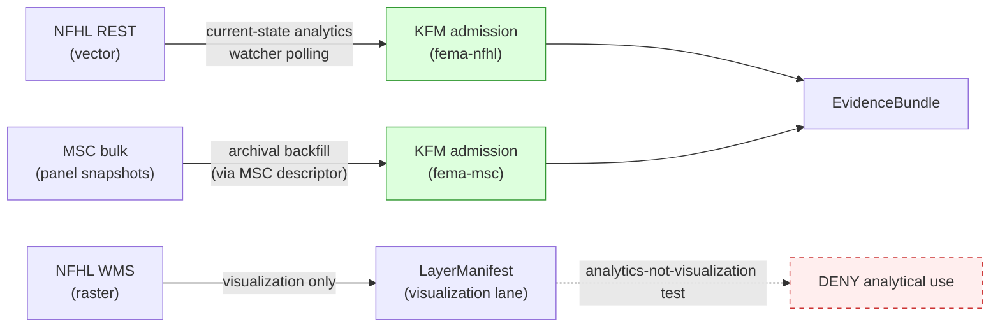

<!-- [KFM_META_BLOCK_V2]
doc_id: kfm://doc/docs-sources-catalog-fema-nfhl-flood-hazard
title: FEMA National Flood Hazard Layer (NFHL)
type: product-page
version: v0.2
status: draft
owners:
  - <PLACEHOLDER — Docs steward>
  - <PLACEHOLDER — Source steward for fema>
  - <PLACEHOLDER — Hazards-domain steward>
  - <PLACEHOLDER — Hydrology-domain steward>
created: 2026-05-20
updated: 2026-05-21
policy_label: public-context-only; not-for-life-safety
related:
  - docs/sources/catalog/fema/README.md
  - docs/sources/catalog/fema/MAP-SERVICE-CENTER.md
  - docs/sources/catalog/README.md
  - docs/sources/catalog/IDENTITY.md
  - docs/sources/catalog/RIGHTS-AND-SENSITIVITY-MAP.md
  - docs/sources/catalog/_examples/stac-item-example.json
  - docs/doctrine/directory-rules.md
  - docs/doctrine/lifecycle-law.md
  - docs/domains/hydrology/README.md
  - docs/domains/hazards/README.md
  - data/registry/sources/
  - connectors/fema/
  - schemas/contracts/v1/source/source-descriptor.json
  - docs/adr/ADR-0001-schema-home.md
corpus_anchors:
  - KFM-P2-IDEA-0026   # NFHL/USACE NLD,NID as flood/infrastructure authorities (CONFIRMED doctrine)
  - KFM-P2-PROG-0008   # FMSC bulk preferred over WFS; MVT/PMTiles delivery
  - ML-061-017         # NFHL: analytic vector endpoints distinct from visualization WMS
  - ML-061-018         # NFHL is regulatory baseline, NOT predictive flood model
  - ML-061-019         # NFHL updates localized & event-driven, not one national release
  - ML-061-020         # Regulatory attributes preserved verbatim (DFIRM_ID, VERSION_ID, EFFECTIVE_DATE, zone, study refs)
  - ML-061-021         # NFHL WMS is visualization-only for KFM analytics
  - ML-061-022         # BFE / elevation requires datum / units verification
  - ML-061-024         # Resale-like determinations: export-language denial
tags: [kfm, docs, sources, catalog, fema, nfhl, regulatory, hazards, hydrology]
notes:
  - "PROPOSED product-page; sibling-link presence verified in prior Claude Code session."
  - "NFHL is the digital, query-able vector aggregate of effective FIRM panels; MSC is the panel-by-panel distribution channel. The two are companion descriptors, not duplicates."
  - "Path `docs/sources/catalog/fema/NATIONAL-FLOOD-HAZARD-LAYER.md` is PROPOSED. `docs/sources/` is CONFIRMED at commit per Directory Rules v1.2 §6.1; `catalog/` subfolder convention is NEEDS VERIFICATION (no ADR observed)."
[/KFM_META_BLOCK_V2] -->

# FEMA National Flood Hazard Layer (NFHL)

> Regulatory floodplain polygons (SFHAs, BFEs, study lines) from federally adopted Flood Insurance Rate Maps — KFM's primary analytic surface for regulatory flood hazard context.

[](#status--ownership)
[](./README.md)
[](#3-nfhl-vs-msc--the-canonical-distinction)
[](#1-overview)
[](#open-questions)
[](#rights-and-sensitivity)
[](#4-access-surfaces--analytics-vs-visualization)
[](#4-access-surfaces--analytics-vs-visualization)
[](#validation-and-catalog-closure)
[](#last-reviewed)

> [!IMPORTANT]
> **NFHL is regulatory context, not observed inundation.** [DOM-HYD] §B states explicitly: *"NFHL regulatory context is not observed inundation."* Publishing NFHL polygons as *observed* flood extent, forecast, or real-time warning is a DENY-closed anti-pattern (Domains Atlas §24.1.2; ML-061-018). Public surfaces displaying NFHL content MUST redirect life-safety action to official FEMA / NWS / state and local emergency channels. CONFIRMED doctrine.

---

## Status & Ownership

| Field | Value |
|---|---|
| **Doc status** | `draft` — PROPOSED product page; sibling-link references verified, content scope PROPOSED |
| **Family page** | [`./README.md`](./README.md) — FEMA family-level catalog entry |
| **Sibling page** | [`./MAP-SERVICE-CENTER.md`](./MAP-SERVICE-CENTER.md) — companion MSC descriptor *(NEEDS VERIFICATION — sibling presence)* |
| **Doctrine basis** | **CONFIRMED.** Sources: KFM-P2-IDEA-0026 (NFHL canonical authority); ML-061-017 through ML-061-024 (MapLibre Master FEMA-specific rules); Encyclopedia §7.2; Domains Atlas §12.D, §24.1; [DOM-HYD] §B (NFHLZone vs Observed Flood Event); [DOM-HAZ] §B (FloodContext vs Hazard Event). |
| **Implementation basis** | **PROPOSED / NEEDS VERIFICATION** — no mounted repo inspected this session; schema, registry, validator, fixture, and connector path claims default to PROPOSED. |
| **Source role** | `regulatory` (companion to MSC); enum governed by Domains Atlas §24.1.1 and proposed ADR-S-04 |
| **Domain consumers** | Hydrology (`NFHLZone`, `Flood Context`); Hazards (`FloodContext`, `Hazard Timeline`); Settlements/Infrastructure (exposure overlays) |
| **Schema-home convention** | `schemas/contracts/v1/source/source-descriptor.json` per ADR-0001 (CONFIRMED convention; PROPOSED file presence) |
| **Last reviewed** | 2026-05-21 |

---

## Quick jump

- [1. Overview](#1-overview)
- [2. NFHL feature classes and attributes](#2-nfhl-feature-classes-and-attributes)
- [3. NFHL vs MSC — the canonical distinction](#3-nfhl-vs-msc--the-canonical-distinction)
- [4. Access surfaces — analytics vs visualization](#4-access-surfaces--analytics-vs-visualization)
- [Source authority](#source-authority)
- [Catalog profiles used](#catalog-profiles-used)
- [Collection identity](#collection-identity)
- [Provenance fields](#provenance-fields)
- [Temporal handling and version locking](#temporal-handling-and-version-locking)
- [Geometry and projection](#geometry-and-projection)
- [Rights and sensitivity](#rights-and-sensitivity)
- [Validation and catalog closure](#validation-and-catalog-closure)
- [Related contracts and schemas](#related-contracts-and-schemas)
- [Related connectors and pipelines](#related-connectors-and-pipelines)
- [Examples](#examples)
- [Open questions](#open-questions)
- [Related docs](#related-docs)
- [Last reviewed](#last-reviewed)

---

## 1. Overview

The **National Flood Hazard Layer (NFHL)** is FEMA's digital, query-able vector aggregate of the effective Flood Insurance Rate Maps (FIRMs) that comprise the U.S. National Flood Insurance Program. Where the [Map Service Center (MSC)](./MAP-SERVICE-CENTER.md) distributes effective FIRM panels and their backing Flood Insurance Studies as authoritative snapshots, **NFHL is the live regulatory vector surface KFM uses for analytical joins** — exposure overlays, in-or-out-of-SFHA tests, regulatory citation, and Evidence Drawer claims.

KFM admits NFHL as a **`regulatory`** source-role descriptor (Domains Atlas §24.1.1, CONFIRMED) for these reasons:

1. **NFHL is the canonical flood-hazard authority** (KFM-P2-IDEA-0026, CONFIRMED): *"FEMA's National Flood Hazard Layer (NFHL) is the canonical flood-hazard authority … ingested with explicit version handling and license posture."*
2. **NFHL is a regulatory baseline, not a flood model** (ML-061-018, CONFIRMED): the layer represents legally effective flood-hazard determinations, not real-time inundation, climate projection, or hydraulic model output.
3. **NFHL updates are localized and event-driven** (ML-061-019, CONFIRMED): there is no single "national release date." Changes arrive panel-by-panel through LOMRs (Letters of Map Revision) and LOMAs (Letters of Map Amendment) and are tracked through `VERSION_ID`, `EFFECTIVE_DATE`, `DFIRM_ID`, and service metadata.
4. **NFHL carries regulatory attributes that MUST be preserved verbatim** (ML-061-020, CONFIRMED): see [§2](#2-nfhl-feature-classes-and-attributes) and [§Temporal handling](#temporal-handling-and-version-locking).

> [!NOTE]
> The single most consequential operational rule on this page: **NFHL has two access surfaces with different trust postures** — vector REST for analytics, WMS for visualization. They are not interchangeable. See [§4](#4-access-surfaces--analytics-vs-visualization). CONFIRMED basis: ML-061-017, ML-061-021.

---

## 2. NFHL feature classes and attributes

NFHL is published as a federated set of feature classes (flood hazard polygons, base-flood-elevation lines, study lines, FIRM panel indexes, and others). The exact feature-class enumeration is FEMA-versioned and lives in the upstream NFHL data dictionary (NEEDS VERIFICATION against the current FEMA release at admission). What KFM doctrine fixes is the **subset of attributes that MUST be preserved verbatim** in every catalog record and `EvidenceBundle`.

### Verbatim-preservation attributes (ML-061-020, CONFIRMED)

| Attribute | Why verbatim | DENY/ABSTAIN condition if missing |
|---|---|---|
| `DFIRM_ID` | Identifies the digital FIRM panel; required for any regulatory citation | Reject normalization that drops it |
| `VERSION_ID` | Version lock; enables stale-state detection (ML-061-019) | Reject normalization that drops it |
| `EFFECTIVE_DATE` | Regulatory effective date; required for `source_time` | DENY admission |
| Flood zone designation | E.g., `AE`, `X`, `VE`, `A99`, `AO`; the *regulatory meaning* of the polygon — geometry alone is insufficient | DENY publication of polygon without zone |
| Base flood elevation (BFE), where present | Regulatory elevation; **engineering use requires vertical datum** (ML-061-022) | ABSTAIN on engineering claim without datum |
| Study reference / FIS docket pointer | Traceability to the underlying Flood Insurance Study (MSC sibling) | NEEDS VERIFICATION on each panel |
| LOMR / LOMA references, where carried | Lineage of map revisions and amendments | Required for correction-time tracking |

> [!WARNING]
> Do **not** normalize, recode, or summarize these attributes before they reach an `EvidenceBundle`. Their regulatory meaning depends on their exact issued form. Recoding is acceptable in a *derived* layer only, with a `TransformReceipt` and the original values preserved in the catalog record (Encyclopedia Appendix E, CONFIRMED).

### Feature class taxonomy (illustrative, NEEDS VERIFICATION against current NFHL data dictionary)

| Feature class family | What it carries | KFM treatment |
|---|---|---|
| **Flood Hazard Areas (polygons)** | SFHAs and non-SFHA zones (e.g., `AE`, `VE`, `X`) | Primary regulatory polygon set; bound to `NFHLZone` (Hydrology) and `FloodContext` (Hazards) |
| **Base Flood Elevations (lines/points)** | Elevation references for the 1%-annual-chance flood | MUST be paired with vertical datum + `TransformReceipt` before any engineering claim (ML-061-022) |
| **Profile baselines / study lines** | Geometry from the engineering study cross-sections | Archival reference; analytical use requires cross-citation to MSC FIS |
| **FIRM panel index** | Links polygons back to MSC FIRM panel ids (`DFIRM_ID`) | Cross-references the [MSC sibling](./MAP-SERVICE-CENTER.md) for effective-date snapshots |
| **Political / community boundaries (as carried)** | Community ids tied to NFIP participation | Context only; not a substitute for canonical place data |

[↑ Back to top](#fema-national-flood-hazard-layer-nfhl)

---

## 3. NFHL vs MSC — the canonical distinction

NFHL and MSC are **companions, not duplicates.** They represent the same regulatory truth at different layers of the FEMA stack and warrant **separate `SourceDescriptor` records** (Unified Manual §3.6, CONFIRMED: source role cannot be inferred from convenience).



| Aspect | **NFHL (this page)** | **MSC (sibling page)** |
|---|---|---|
| Primary artifact | Vector floodplain polygons (SFHAs, BFEs, study lines) | Effective FIRM panels, FIS reports, LOMRs, LOMAs |
| Source role | `regulatory` (live vector service) | `regulatory` (snapshot / archival) |
| Access method | `arcgis-rest-featureserver` (analytics) **and** `wms` (visualization-only) | `bulk-download; manual-curation` |
| Cadence | Event-driven; reflected through service metadata (`VERSION_ID`) | Panel-by-panel; event-driven via LOMR/LOMA |
| KFM admission lane | REST watcher polling for `VERSION_ID` / `EFFECTIVE_DATE` changes | Periodic archival capture under RAW |
| Primary use | Analytical joins, exposure overlays, regulatory citation | Effective-FIRM snapshot, LOMR/LOMA traceability |

> [!NOTE]
> When a downstream Evidence Drawer wants to **prove** that a feature lies in an SFHA, the bundle should cite **both**: the NFHL polygon (for geometry and zone designation) and the MSC FIRM panel (for the effective-date snapshot the polygon was derived from). This is the corpus's *regulatory-attributes-preserved-verbatim* posture (ML-061-020, CONFIRMED).

---

## 4. Access surfaces — analytics vs visualization

NFHL exposes **two technical surfaces**, and KFM treats them very differently because the trust-membrane consequences differ. This distinction is the most operationally consequential rule on this page.

| Access surface | Suitable for | **Not** suitable for | KFM treatment |
|---|---|---|---|
| **ArcGIS REST / FeatureServer** (vector) | Vector queries, attribute reads, analytical joins, version detection via service metadata | Cosmetic raster rendering at small scale | **Primary admission path.** Watcher polls REST metadata for `VERSION_ID` / `EFFECTIVE_DATE` changes; changed geometries ingested with provenance (ML-061-017, ML-061-023). PROPOSED. |
| **WMS / WMTS** (raster) | Visual overlays on the map shell | Analytics; regulatory interpretation; pixel-level joins | **Visualization-only.** Analytics-not-visualization test required at admission and at `LayerManifest` emission (ML-061-021). PROPOSED. |

> [!CAUTION]
> **WMS pixels are never the answer to a question.** Using rasterized WMS tiles for analytical joins (in-or-out-of-SFHA tests, BFE reads, zone classifications) is an anti-pattern called out explicitly in ML-061-021 (CONFIRMED). If a downstream consumer asks to *"use the FEMA map for analysis,"* route them to the vector REST endpoint with an `EvidenceRef` resolving to the matching `fema-nfhl` `SourceDescriptor` revision.

### Bulk vs live for backfill

For historical or archival use, **bulk extracts from MSC are preferred over WFS feature-count-capped queries** (KFM-P2-PROG-0008, PROPOSED programming). The NFHL REST service is for current-state analytics and watcher polling, not for full-history backfill.



### Delivery format for derived layers

For derived KFM layers downstream of NFHL admission, **compact MVT / PMTiles with per-zoom generalization** is the standard delivery format (KFM-P2-PROG-0008, PROPOSED). Sensitive infrastructure attributes are generalized or marked restricted in line with the family-level sensitivity policy.

---

## Source authority

See [`data/registry/sources/`](../../../../data/registry/sources/) for the authoritative `SourceDescriptor`. **Do not duplicate descriptor fields here.** The fields below are *intent* expectations; binding values live in the registry.

| Field | Proposed intent for `fema-nfhl` (REST) | Required? |
|---|---|---|
| `source_id` | `fema-nfhl` (or domain-scoped variant) | MUST |
| `source_role` | `regulatory` | MUST |
| `role_authority` | `FEMA` | MUST (role = regulatory) |
| `provider` | `FEMA NFHL` | MUST |
| `endpoint` | `<PLACEHOLDER — confirm current ArcGIS REST FeatureServer base URL>` | MUST |
| `access_method` | `arcgis-rest-featureserver` | MUST |
| `cadence` | `event-driven; localized; LOMR/LOMA-based` | MUST |
| `temporal_anchor_fields` | `DFIRM_ID, VERSION_ID, EFFECTIVE_DATE` | MUST |
| `analytics_visualization_class` | `vector-rest-analytics` | SHOULD |
| `vertical_datum_required` | `true` | MUST |
| `rights` | `<PLACEHOLDER — confirm current FEMA terms snapshot>` | MUST |
| `public_release_class` | `context-only; not-for-life-safety` | MUST |
| `connector_home` | `connectors/fema/` | SHOULD |

> [!TIP]
> The WMS endpoint is a **separate `SourceDescriptor`** with `access_method: wms` and `analytics_visualization_class: wms-visualization-only`. One descriptor per service surface — REST and WMS are not interchangeable for governance purposes (ML-061-021, CONFIRMED).

---

## Catalog profiles used

| Profile | Lane | Used by this product? |
|---|---|---|
| STAC | `data/catalog/stac/` | PROPOSED — likely Yes (NFHL vintage-as-item; feature classes as attached assets or sub-collections) — NEEDS VERIFICATION |
| DCAT | `data/catalog/dcat/` | PROPOSED — Yes / No (NEEDS VERIFICATION) |
| PROV-O | `data/catalog/prov/` | PROPOSED — Yes (LOMR/LOMA lineage maps to `prov:wasRevisionOf`; NFHL aggregate maps to `prov:wasDerivedFrom` MSC panels) — NEEDS VERIFICATION |
| Domain projection | `data/catalog/domain/hydrology/` and `data/catalog/domain/hazards/` | PROPOSED — both domains bind to NFHL — NEEDS VERIFICATION |

---

## Collection identity

- PROPOSED Collection id pattern: `kfm-fema-nfhl` (see [`../IDENTITY.md`](../IDENTITY.md) for the family-level pattern).
- PROPOSED namespace: `kfm:` *(see OPEN-DSC-03)*.
- PROPOSED item id pattern: `kfm-fema-nfhl-<DFIRM_ID>-<VERSION_ID>` to encode panel-level identity verbatim (ML-061-020, CONFIRMED basis).
- Asset roles: NEEDS VERIFICATION — confirm against `schemas/contracts/v1/source/` once mounted.

---

## Provenance fields

STAC `properties.kfm:provenance` block (PROPOSED — Pass-10 C4-01):

- `spec_hash` — sha256 of the canonical record.
- `evidence_bundle_ref` — `kfm://evidence/<digest>`.
- `run_record_ref` — `kfm://run/<run-id>`.
- `audit_ref` — `kfm://audit/<attestation-id>`.
- `policy_digest` — sha256 of the policy bundle.

Per-asset integrity: `file:checksum` on each NFHL feature export / vector snapshot.

> [!NOTE]
> For NFHL specifically:
> - `prov:wasRevisionOf` encodes a LOMR or LOMA's relationship to a prior panel version.
> - `prov:wasDerivedFrom` (or KFM-native equivalent) MAY encode the NFHL vintage's derivation from the corresponding MSC FIRM panels.
> Both shapes are PROPOSED until the PROV-O profile is verified in the mounted repo.

---

## Temporal handling and version locking

PROPOSED — keep source / observed / valid / retrieval / release / correction times distinct where material (Domains Atlas §24.1 reading note, CONFIRMED). The version-lock posture is **mandatory** for NFHL because the layer has no single national release date (ML-061-019, CONFIRMED).

| KFM time field | What it means for NFHL | DENY / ABSTAIN trigger if missing |
|---|---|---|
| `source_time` | The polygon's `EFFECTIVE_DATE` (regulatory effective date) | ABSTAIN at AI; mark candidate stale |
| `observed_time` | **Not applicable** — NFHL is regulatory, not observed | n/a — leaving `observed_time` unset is *correct* for this role |
| `valid_time` | Interval during which the polygon is operative — closes when superseded by a LOMR or new panel | ABSTAIN if `valid_time` end is past and surface is presented as current |
| `retrieval_time` | When KFM fetched the polygon from the NFHL REST service | DENY admission if missing |
| `release_time` | When KFM released its derived product citing this NFHL vintage | DENY publication if missing |
| `correction_time` | If KFM has corrected a prior release | Required on every `CorrectionNotice` |

### Version-lock detection

Per ML-061-023 (CONFIRMED): version detection uses service metadata. A KFM NFHL watcher MUST:

- Poll the FeatureServer service metadata for `VERSION_ID` / `EFFECTIVE_DATE` changes.
- Treat a `VERSION_ID` change as a change-detection signal (re-ingest with full provenance).
- Treat a missing or unparseable `VERSION_ID` / `EFFECTIVE_DATE` as a stale-state DENY.
- Carry the detected vintage forward in every downstream `LayerManifest` and `EvidenceBundle`.

> [!WARNING]
> Comparing NFHL vintages without datum or QA controls is a named anti-pattern (ML-061-017, CONFIRMED): *"Comparing vintages without datum or QA controls."* Vintage diffs must travel with `TransformReceipt` and validator coverage.

---

## Geometry and projection

PROPOSED — confirm CRS, generalization rules, and scale support against `data/catalog/` artifacts. NEEDS VERIFICATION against the current NFHL upstream CRS.

| Aspect | NFHL posture | KFM treatment |
|---|---|---|
| Upstream CRS | NEEDS VERIFICATION against current NFHL service metadata | Recorded in `SourceDescriptor`; not inferred |
| KFM canonical CRS | PROPOSED per Spatial Foundation domain (Encyclopedia §3) | `CoordinateReferenceProfile` + `ProjectionTransformReceipt` per Encyclopedia Appendix E |
| Generalization | Per-zoom generalization for tile delivery (KFM-P2-PROG-0008, PROPOSED) | `GeneralizationTransform` receipt records the rule applied |
| Geometry fingerprint | Required for deterministic identity (Domains Atlas §4 E) | `GeometryFingerprint` canonicalization NEEDS VERIFICATION |

> [!WARNING]
> Base flood elevation (BFE) values **MUST NOT** be used in engineering claims without a recorded vertical datum and `TransformReceipt` (ML-061-022, CONFIRMED). Datum mismatch is an ABSTAIN condition at the AI surface and a DENY at publication.

---

## Rights and sensitivity

NEEDS VERIFICATION — see [`../../../../policy/sensitivity/`](../../../../policy/sensitivity/) and [`../RIGHTS-AND-SENSITIVITY-MAP.md`](../RIGHTS-AND-SENSITIVITY-MAP.md). **Do not restate policy here.**

Family-level rights posture is summarized in [`./README.md` §7](./README.md). Key NFHL-specific reminders:

- FEMA is a U.S. federal agency; NFHL content is generally treated as U.S. public records. **Current terms-of-use snapshot remains NEEDS VERIFICATION** before first public emit (Unified Manual §3.6, CONFIRMED: rights cannot be inferred from convenience).
- **Resale-like flood determinations** based on NFHL polygons are DENIED as KFM export products regardless of upstream rights (ML-061-024, CONFIRMED). Export language MUST reference FEMA directly; no derivative determination export without rights review.
- Attribution to FEMA is required in any `LayerManifest` and any export language (assume YES until terms confirmed).
- Sensitive infrastructure precision is DENIED by default; generalization or restriction applies per KFM-P2-PROG-0008.

---

## Validation and catalog closure

- **Catalog closure required before public release** (Pass-10 / KFM-P1-IDEA-0020) — PROPOSED.
- **STAC Projection lint** (KFM-P27-FEAT-0003) — PROPOSED.
- **STAC checksum closure** against the `ReleaseManifest` digest (KFM-P22-PROG-0037) — PROPOSED.
- **Verbatim-attribute-preservation validator** — `DFIRM_ID`, `VERSION_ID`, `EFFECTIVE_DATE`, zone, study refs intact in catalog record (ML-061-020, CONFIRMED basis).
- **Source-role anti-collapse test** — reject any edge from this `regulatory` descriptor to a `Hazard Event` / observed-inundation object (Domains Atlas §24.1.2, CONFIRMED).
- **Analytics-vs-visualization test** — WMS endpoint never queried for analytical join (ML-061-021, CONFIRMED).
- **Renderer-boundary test** — no public client reads NFHL bytes from RAW / WORK / QUARANTINE (Directory Rules v1.2 §0, CONFIRMED).
- **Version-lock test** — missing or unparseable `VERSION_ID` / `EFFECTIVE_DATE` fails closed (ML-061-019, CONFIRMED basis).
- **Vintage-diff guard** — no diff of NFHL vintages without datum / QA receipt (ML-061-017, CONFIRMED basis).
- **Vertical-datum guard** — BFE / elevation use blocked without datum receipt (ML-061-022, CONFIRMED).
- **No-network fixture** — validator suite passes on synthetic NFHL fixtures with no live calls (PROPOSED).

### Suggested test fixtures

PROPOSED home: `tests/fixtures/sources/fema/nfhl/` or `fixtures/sources/fema/nfhl/` — NEEDS VERIFICATION against mounted-repo convention; Directory Rules v1.2 §6.6 permits fixture split only when README declares differences.

1. A **valid NFHL feature fixture** with intact `DFIRM_ID` / `VERSION_ID` / `EFFECTIVE_DATE`.
2. A **negative fixture** that drops `EFFECTIVE_DATE` — validator MUST DENY.
3. A **negative fixture** asserting a `regulatory` → `Hazard Event` edge — validator MUST DENY.
4. A **WMS-rendered raster** cited as analytic input — validator MUST DENY (ML-061-021).
5. A **BFE elevation used without datum** — validator MUST ABSTAIN (ML-061-022).
6. A **stale-vintage fixture** (`VERSION_ID` missing or unparseable) — watcher MUST DENY.
7. A **vintage-diff without `TransformReceipt`** — validator MUST DENY.

---

## Related contracts and schemas

- `contracts/domains/hydrology/` — `NFHLZone`, `Flood Context`, `Observed Flood Event` (distinct from NFHL) — NEEDS VERIFICATION.
- `contracts/domains/hazards/` — `FloodContext`, `Hazard Timeline` (distinct from `Hazard Event`) — NEEDS VERIFICATION.
- `schemas/contracts/v1/source/source-descriptor.json` — per **ADR-0001** (CONFIRMED convention; PROPOSED file presence).
- `schemas/contracts/v1/receipts/` — `TransformReceipt`, `CorrectionNotice`, `RawCaptureReceipt`, `ProjectionTransformReceipt` — NEEDS VERIFICATION.

---

## Related connectors and pipelines

- [`connectors/fema/`](../../../../connectors/fema/) — root **CONFIRMED at commit** per Directory Rules v1.2 §7.3; specific NFHL module path NEEDS VERIFICATION.
- `pipelines/ingest/`, `pipelines/normalize/`, `pipelines/validate/`, `pipelines/catalog/` — phase-canonical paths CONFIRMED in Directory Rules v1.2 §7.4; NFHL bindings NEEDS VERIFICATION.
- `pipeline_specs/hydrology/` and `pipeline_specs/hazards/` — declarative specs for NFHL-bound pipelines — NEEDS VERIFICATION.
- `pipelines/watchers/` — NFHL REST watcher polling for `VERSION_ID` / `EFFECTIVE_DATE` changes — PROPOSED.

---

## Examples

*(Illustrative only — do not treat as authoritative.)*

See [`../_examples/stac-item-example.json`](../_examples/stac-item-example.json) for the family-level reference shape.

<details>
<summary><b>Minimal STAC + <code>kfm:provenance</code> shape for an NFHL polygon vintage</b></summary>

```json
{
  "type": "Feature",
  "id": "kfm-fema-nfhl-<DFIRM_ID>-<VERSION_ID>",
  "collection": "kfm-fema-nfhl",
  "properties": {
    "datetime": "<EFFECTIVE_DATE>",
    "kfm:provenance": {
      "spec_hash": "sha256:<placeholder>",
      "evidence_bundle_ref": "kfm://evidence/<digest>",
      "run_record_ref": "kfm://run/<run-id>",
      "audit_ref": "kfm://audit/<attestation-id>",
      "policy_digest": "sha256:<placeholder>"
    },
    "kfm:source_role": "regulatory",
    "kfm:role_authority": "FEMA",
    "kfm:analytics_visualization_class": "vector-rest-analytics",
    "fema:DFIRM_ID": "<DFIRM_ID>",
    "fema:VERSION_ID": "<VERSION_ID>",
    "fema:EFFECTIVE_DATE": "<YYYY-MM-DD>",
    "fema:flood_zone": "<AE|X|VE|...>"
  },
  "assets": {
    "nfhl_features": {
      "href": "<archival URI under data/raw/hydrology/fema-nfhl/...>",
      "type": "application/geo+json",
      "roles": ["data", "regulatory"],
      "file:checksum": "1220<sha256-multihash>"
    }
  }
}
```

</details>

<details>
<summary><b>NFHL REST query intent (illustrative — NEEDS VERIFICATION against current FEMA service)</b></summary>

```text
GET <fema-nfhl-rest-endpoint>/<layer-id>/query
  ?where=DFIRM_ID='<dfirm_id>'
  &outFields=DFIRM_ID,VERSION_ID,EFFECTIVE_DATE,FLD_ZONE,STATIC_BFE
  &returnGeometry=true
  &outSR=<KFM canonical CRS>
  &f=geojson
```

KFM connector posture:
- Watcher polls `<endpoint>?f=json` for service metadata (`VERSION_ID`, `EFFECTIVE_DATE`) before bulk pulls.
- Bulk pulls write to `data/raw/<domain>/fema-nfhl/<run_id>/` with a `RawCaptureReceipt`.
- WMS endpoint is **never** queried for analytics.

</details>

> [!NOTE]
> The examples above are **illustrative**. Field names under `fema:` and the exact `kfm:provenance` shape remain PROPOSED until the canonical schema is verified in the mounted repo. Exact REST query parameters depend on the current NFHL service version.

---

## Open questions

| # | Question | Status |
|---|---|---|
| OPEN-NFHL-01 | Confirm current NFHL ArcGIS REST FeatureServer base URL and feature-class enumeration | PROPOSED |
| OPEN-NFHL-02 | Confirm current NFHL WMS / WMTS endpoint URLs (separate `SourceDescriptor`) | PROPOSED |
| OPEN-NFHL-03 | Confirm rights status, terms-of-use snapshot, and CARE applicability (CARE is unlikely relevant for federal flood maps but should be checked) | PROPOSED |
| OPEN-NFHL-04 | Confirm STAC Collection scope — `kfm-fema-nfhl` vs shared `kfm-fema-flood-regulatory` with MSC | PROPOSED |
| OPEN-NFHL-05 | Confirm upstream NFHL CRS and the KFM canonical-CRS reprojection rule | NEEDS VERIFICATION |
| OPEN-NFHL-06 | Confirm vertical-datum recording convention for BFE assets | NEEDS VERIFICATION |
| OPEN-NFHL-07 | Confirm watcher polling cadence and back-off policy for the REST service | PROPOSED |
| OPEN-NFHL-08 | Confirm fixture home (`tests/fixtures/sources/fema/nfhl/` vs `fixtures/sources/fema/nfhl/`) per Directory Rules v1.2 §6.6 | NEEDS VERIFICATION |
| OPEN-NFHL-09 | Verify `connectors/fema/nfhl/` module exists and emits to `data/raw/<domain>/fema-nfhl/<run_id>/` | NEEDS VERIFICATION |
| OPEN-NFHL-10 | Confirm how Hydrology and Hazards domains share the NFHL binding (single descriptor with multiple consumers vs domain-scoped descriptor variants) | PROPOSED |

---

## Related docs

- [`./README.md`](./README.md) — FEMA family-level catalog entry
- [`./MAP-SERVICE-CENTER.md`](./MAP-SERVICE-CENTER.md) — companion MSC descriptor *(NEEDS VERIFICATION — sibling presence)*
- [`../README.md`](../README.md) — Source catalog landing page
- [`../IDENTITY.md`](../IDENTITY.md) — Collection / item identity patterns
- [`../RIGHTS-AND-SENSITIVITY-MAP.md`](../RIGHTS-AND-SENSITIVITY-MAP.md) — Rights and sensitivity registry
- [`../_examples/stac-item-example.json`](../_examples/stac-item-example.json) — Reference STAC + `kfm:provenance` shape
- [`../../../doctrine/directory-rules.md`](../../../doctrine/directory-rules.md) — Placement and lifecycle law (v1.2)
- [`../../../doctrine/lifecycle-law.md`](../../../doctrine/lifecycle-law.md) — Lifecycle invariant *(PROPOSED path)*
- [`../../../domains/hydrology/README.md`](../../../domains/hydrology/README.md) — Hydrology domain consumer *(PROPOSED path)*
- [`../../../domains/hazards/README.md`](../../../domains/hazards/README.md) — Hazards domain consumer *(PROPOSED path)*
- [`../../../adr/ADR-0001-schema-home.md`](../../../adr/ADR-0001-schema-home.md) — Schema home rule
- `<TODO>` `../../../adr/ADR-S-04-source-role-vocabulary-v1.md` — Source-role vocabulary v1 (PROPOSED in Domains Atlas §24.12)

---

## Last reviewed

2026-05-21 *(Claude Code product-page evidence-grounded revision; doctrine basis CONFIRMED, implementation basis PROPOSED / NEEDS VERIFICATION until mounted-repo inspection).*

---

<sub>**Related docs**: [FEMA family](./README.md) · [MSC sibling](./MAP-SERVICE-CENTER.md) · [Directory Rules](../../../doctrine/directory-rules.md) · [connectors/fema/](../../../../connectors/fema/)</sub>
<sub>**Last updated**: 2026-05-21 · **Doc status**: draft · **Doctrine basis**: CONFIRMED · **Implementation basis**: PROPOSED / NEEDS VERIFICATION</sub>
<sub>[↑ Back to top](#fema-national-flood-hazard-layer-nfhl)</sub>
