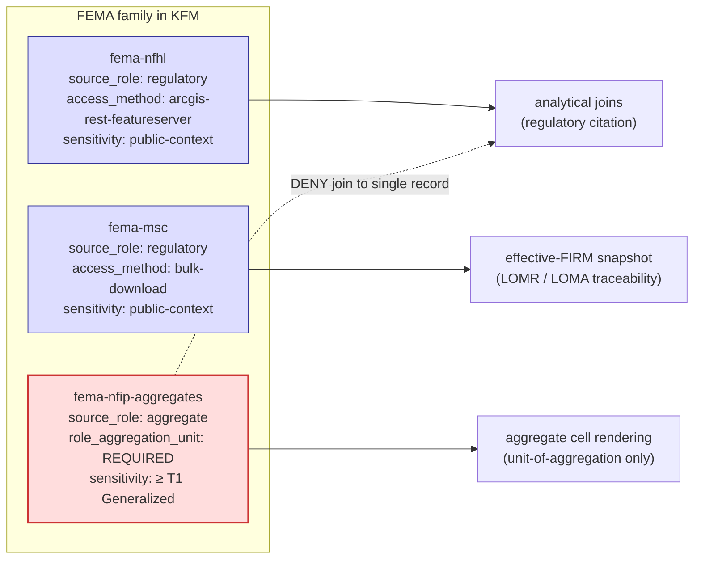

<!-- [KFM_META_BLOCK_V2]
doc_id: kfm://doc/docs-sources-catalog-fema-nfip-claim-policy-aggregates
title: FEMA NFIP Claim and Policy Aggregates
type: product-page
version: v0.2
status: draft
owners:
  - <PLACEHOLDER — Docs steward>
  - <PLACEHOLDER — Source steward for fema>
  - <PLACEHOLDER — Sensitivity steward>
  - <PLACEHOLDER — Hazards-domain steward>
  - <PLACEHOLDER — People/DNA/Land-domain steward>
created: 2026-05-20
updated: 2026-05-21
policy_label: public-context-aggregate-only; per-place-DENY; not-for-life-safety
admission_status: UNKNOWN — admission decision pending steward + sensitivity review (family README §2)
related:
  - docs/sources/catalog/fema/README.md
  - docs/sources/catalog/fema/NATIONAL-FLOOD-HAZARD-LAYER.md
  - docs/sources/catalog/fema/MAP-SERVICE-CENTER.md
  - docs/sources/catalog/README.md
  - docs/sources/catalog/IDENTITY.md
  - docs/sources/catalog/RIGHTS-AND-SENSITIVITY-MAP.md
  - docs/sources/catalog/_examples/stac-item-example.json
  - docs/doctrine/directory-rules.md
  - docs/doctrine/lifecycle-law.md
  - docs/standards/SENSITIVITY_RUBRIC.md
  - docs/standards/REDACTION_DETERMINISM.md
  - docs/standards/DP_BUDGETS.md
  - data/registry/sources/
  - connectors/fema/
  - schemas/contracts/v1/source/source-descriptor.json
  - policy/sensitivity/
  - docs/adr/ADR-0001-schema-home.md
corpus_anchors:
  - Domains Atlas §24.1.1   # source-role enum (aggregate role definition)
  - Domains Atlas §24.1.2   # DENY: aggregate cited as per-place truth
  - Domains Atlas §24.1.3   # role_aggregation_unit MUST be set when source_role = aggregate
  - Domains Atlas §24.9.2   # trust-membrane anti-pattern: aggregate-as-per-place observation
  - Pass-10 C6-05           # Differential privacy for aggregates only (CONFIRMED)
  - Pass-10 C6-04           # Grid generalization for sensitive density data
  - Pass-10 C6-06           # k-anonymity for living-people overlays
tags: [kfm, docs, sources, catalog, fema, nfip, aggregate, sensitive, privacy]
notes:
  - "PROPOSED product-page; sibling-link presence verified in prior Claude Code session."
  - "NFIP differs from its FEMA siblings: source_role is `aggregate`, not `regulatory`. Sensitivity posture is T1 (Generalized) at minimum; per-place exposure is DENIED by default."
  - "Family README §2 lists this product's admission status as UNKNOWN — this page is intentionally bounded to candidate / pre-admission scope until a steward decision is recorded."
  - "Path `docs/sources/catalog/fema/NFIP-CLAIM-POLICY-AGGREGATES.md` is PROPOSED. `docs/sources/` is CONFIRMED at commit per Directory Rules v1.2 §6.1; `catalog/` subfolder convention is NEEDS VERIFICATION (no ADR observed)."
[/KFM_META_BLOCK_V2] -->

# FEMA NFIP Claim and Policy Aggregates

> Aggregated U.S. National Flood Insurance Program claim and policy records — published only at unit-of-aggregation scale (county / census tract / ZIP-3 / similar), never as per-place truth.

[](#status--ownership)
[](./README.md)
[](#3-why-nfip-differs-from-nfhl-and-msc)
[](#status--ownership)
[](#4-aggregate-cell-as-truth-deny-condition)
[](#sensitivity-and-privacy-techniques)
[](#1-overview)
[](#open-questions)
[](#rights-and-sensitivity)
[](#last-reviewed)

> [!CAUTION]
> **NFIP aggregates are not per-place truth.** A claim count for a county is a statement *about the county at the unit of aggregation*, not about any specific address, parcel, or household within it. Joining an aggregate cell back to a single record is a **DENY-closed anti-pattern** in KFM doctrine (Domains Atlas §24.1.2: *"Aggregate cited as a per-place truth"*). This is the single most consequential rule on this page.

> [!IMPORTANT]
> NFIP claim/policy aggregates contain financial and exposure information about insured households and businesses. Even at aggregate scale, low-count cells can de-anonymize sparsely populated communities. The sensitivity floor for this product is **T1 (Generalized)** with a recorded aggregation receipt; lower-count cells may require T2 (Reviewer) suppression, differential privacy noise, or denial outright. CONFIRMED basis: Domains Atlas §24.1.2; Pass-10 C6-05 (DP for aggregates only); Pass-10 C6-06 (k-anonymity).

---

## Status & Ownership

| Field | Value |
|---|---|
| **Doc status** | `draft` — PROPOSED product page; admission decision pending |
| **Family admission status** | **UNKNOWN** — explicitly flagged in the family README §2 ("NFIP — claim and policy aggregates (if exposed)"). No admission decision recorded this session. |
| **Family page** | [`./README.md`](./README.md) — FEMA family-level catalog entry |
| **Sibling pages** | [`./NATIONAL-FLOOD-HAZARD-LAYER.md`](./NATIONAL-FLOOD-HAZARD-LAYER.md), [`./MAP-SERVICE-CENTER.md`](./MAP-SERVICE-CENTER.md) — companion descriptors (different source roles) |
| **Doctrine basis** | **CONFIRMED.** Sources: Domains Atlas §24.1.1 (aggregate role definition); §24.1.2 (aggregate-cell-as-per-place-truth DENY); §24.1.3 (`role_aggregation_unit` requirement); §24.9.2 (trust-membrane anti-pattern); Pass-10 C6-04 / C6-05 / C6-06 (geoprivacy). |
| **Implementation basis** | **PROPOSED / NEEDS VERIFICATION** — no mounted repo inspected this session; admission status remains UNKNOWN. |
| **Source role** | `aggregate` (NOT `regulatory`, NOT `administrative`); `role_aggregation_unit` **MUST** be set |
| **Sensitivity tier (floor)** | **T1 (Generalized)** at minimum; per-cell thresholds may push individual cells to T2 (Reviewer) or DENY |
| **Schema-home convention** | `schemas/contracts/v1/source/source-descriptor.json` per ADR-0001 (CONFIRMED convention; PROPOSED file presence) |
| **Last reviewed** | 2026-05-21 |

---

## Quick jump

- [1. Overview](#1-overview)
- [2. What NFIP publishes (illustrative)](#2-what-nfip-publishes-illustrative)
- [3. Why NFIP differs from NFHL and MSC](#3-why-nfip-differs-from-nfhl-and-msc)
- [4. Aggregate-cell-as-truth: DENY condition](#4-aggregate-cell-as-truth-deny-condition)
- [5. Sensitivity and privacy techniques](#5-sensitivity-and-privacy-techniques)
- [Source authority](#source-authority)
- [Catalog profiles used](#catalog-profiles-used)
- [Collection identity](#collection-identity)
- [Provenance fields](#provenance-fields)
- [Temporal handling](#temporal-handling)
- [Geometry and projection](#geometry-and-projection)
- [Rights and sensitivity](#rights-and-sensitivity)
- [Validation and catalog closure](#validation-and-catalog-closure)
- [Related contracts and schemas](#related-contracts-and-schemas)
- [Related connectors and pipelines](#related-connectors-and-pipelines)
- [Examples](#examples)
- [Open questions](#open-questions)
- [Related docs](#related-docs)
- [Last reviewed](#last-reviewed)

---

## 1. Overview

The **National Flood Insurance Program (NFIP)** is a U.S. federal flood-insurance program administered by FEMA. As part of its public-records posture, FEMA periodically publishes **aggregated tables** describing program activity — claim counts, dollar totals, policy counts, policies-in-force — typically at the unit of county, census tract, ZIP-3, or community.

KFM, if it admits this product at all, admits it as an **`aggregate`** source-role descriptor (Domains Atlas §24.1.1, CONFIRMED). This is the **most sensitive of the three FEMA family members** because:

1. **It is not regulatory.** NFHL polygons and MSC FIRM panels are legally adopted regulatory products. NFIP aggregates are *summaries of program activity* — informative, but not authoritative determinations.
2. **It is not observation.** Each row is a count or total over a unit of aggregation, never a per-place reading.
3. **It is privacy-adjacent.** Aggregated insurance data can re-identify households in sparsely populated cells. Treating an aggregate as per-place truth is a DENY-closed anti-pattern.
4. **Family admission is UNKNOWN.** The FEMA family-level page explicitly does *not* recommend admission until a sensitivity review is on record.

> [!NOTE]
> This page is intentionally bounded to **candidate / pre-admission scope.** It documents what admission *would* look like — descriptor fields, validators, fixtures, sensitivity controls — without claiming the product is admitted, configured, or releasable in the current repo state.

---

## 2. What NFIP publishes (illustrative)

The exact NFIP public-aggregate product slate is FEMA-versioned and **NEEDS VERIFICATION** against the current OpenFEMA dataset listing. The taxonomy below is illustrative — drawn from publicly known FEMA program shapes — and is **not** a binding KFM admission list.

| Candidate aggregate | What it counts / sums | Typical aggregation unit | Source role |
|---|---|---|---|
| **NFIP Claims Aggregates** | Paid claim counts, dollar totals, loss types | County / census tract / community / ZIP-3 | `aggregate` |
| **NFIP Policies-in-Force Aggregates** | Active policy counts, insured exposure totals | County / community / ZIP-3 | `aggregate` |
| **NFIP Historical Claims Roll-ups** | Long-running claim totals by jurisdiction | County / state | `aggregate` |
| **NFIP Redacted Claims (record-level, sensitive)** | Per-claim records with PII removed but addresses / locations retained at varying precision | Record-level (PII-redacted) | `aggregate` **only if** geometry is generalized; otherwise PROPOSED `restricted` and likely **DENY** for public release |

> [!CAUTION]
> If FEMA's *Redacted Claims* product (or any successor that exposes record-level rows) is admitted, it **MUST NOT** be admitted as `aggregate` unless geometry has been generalized to a coarse cell with a recorded transform receipt. Record-level data with location precision finer than the aggregation unit is a separate product class and should be its own `SourceDescriptor`, likely **HOLD** or **DENY** under T2 / T3. (Domains Atlas §24.1.1 reading note; Unified Manual §3.6 CONFIRMED: *"source role cannot be inferred from convenience."*)

Each candidate above warrants a **separate `SourceDescriptor`** because cadence, granularity, and sensitivity differ.

---

## 3. Why NFIP differs from NFHL and MSC

NFIP is the *outlier* in the FEMA family. The siblings live in different source-role lanes and consequently different sensitivity, validator, and publication regimes.



| Aspect | **NFIP aggregates (this page)** | **NFHL** | **MSC** |
|---|---|---|---|
| Source role | `aggregate` | `regulatory` | `regulatory` |
| What it tells you | Program activity at unit-of-aggregation scale | Regulatory floodplain designation per polygon | Effective FIRM panel + study lineage |
| Per-place join | **DENIED** (Domains Atlas §24.1.2) | Allowed; polygon is the unit | Allowed; panel is the unit |
| Cited as | "X-county had Y claims in time-period T" | "This polygon is in flood zone AE as of effective date D" | "FIRM panel <DFIRM_ID> v<VERSION_ID> effective <DATE>" |
| Required descriptor field | `role_aggregation_unit` MUST be set | `role_authority` MUST be set | `role_authority` MUST be set |
| Sensitivity floor | **≥ T1 (Generalized)** | T0 (public-context) | T0 (public-context) |
| Admission status | **UNKNOWN** | CONFIRMED doctrine / PROPOSED impl | PROPOSED |

> [!NOTE]
> When a downstream Evidence Drawer wants to **contextualize** a feature with NFIP data, the only safe pattern is: *"In <aggregation-unit> X, the NFIP recorded Y claims during period T."* It is never safe to say *"This address had a claim"* unless and until a separate, record-level, properly governed source is admitted with explicit consent and a `RedactionReceipt` — and even then it would be a different product class, not this one.

---

## 4. Aggregate-cell-as-truth: DENY condition

This is the doctrine that defines this page. Quoting Domains Atlas §24.1.2 verbatim (CONFIRMED):

| Collapse pattern | Domains most at risk | Denied outcome | Required guardrail |
|---|---|---|---|
| **Aggregate cited as a per-place truth** | Agriculture; People; Geology; Air *(NFIP applies here as well — Hazards + People)* | **DENY** join from aggregate cell to single record; **ABSTAIN** at AI | **Aggregation receipt; geometry-scope guard; matrix-cell semantics** |

And from Domains Atlas §24.9.2 (CONFIRMED trust-membrane anti-pattern):

| Anti-pattern | What goes wrong | DENY surface |
|---|---|---|
| **Aggregate cited as per-place observation** | Source-role collapse; matrix-cell semantics violated | Validator; Focus Mode citation evaluator |

### What this means operationally

For every NFIP aggregate ingested:

1. **`role_aggregation_unit` is required** (Domains Atlas §24.1.3, CONFIRMED). The descriptor MUST record the geometry-scope token (`county`, `tract`, `zip3`, `community`, etc.). Without it, admission is rejected.
2. **An `AggregationReceipt` is required** on every released artifact, identifying the aggregation unit, the count threshold (if any cells were suppressed), and any DP / k-anonymity parameters applied.
3. **The renderer MUST NOT** style aggregate cells as if they were per-place points. Choropleth at the aggregation unit is acceptable; a dot-density rendering that implies per-address presence is not.
4. **Focus Mode (governed AI) MUST ABSTAIN** when a user asks a per-place question over an aggregate source. The AIReceipt records the abstain reason: *"aggregate-cell-as-per-place-query."*
5. **The trust membrane fails closed** at three layers:
   - **Validator** rejects joins from aggregate `EvidenceBundle` to single-record claims.
   - **PolicyDecision** returns DENY when geometry scope of the query is finer than `role_aggregation_unit`.
   - **Renderer-boundary test** rejects map styles that contradict the unit of aggregation.

> [!WARNING]
> Reducing the visual cell size below the `role_aggregation_unit` is a **prohibited rendering transform**, not just a styling choice. A county-aggregate cell shown as a parcel-precision dot is the same anti-pattern as showing it in a popup labeled with an address. Both fail the geometry-scope guard.

[↑ Back to top](#fema-nfip-claim-and-policy-aggregates)

---

## 5. Sensitivity and privacy techniques

NFIP aggregates carry financial / exposure information. Even at aggregate scale, **low-count cells can de-anonymize** sparsely populated communities (e.g., a single-policy county). KFM doctrine provides three complementary techniques, all CONFIRMED in the Pass-10 corpus:

| Technique | When it applies | KFM corpus anchor |
|---|---|---|
| **k-anonymity for low-count cells** | Suppress / merge cells whose count falls below a threshold (commonly k ≥ 5) before public release | Pass-10 C6-06 (k-anonymity for living-people overlays) — generalized to any privacy-sensitive aggregate |
| **Differential privacy on counts** | Apply DP noise (epsilon-delta) to claim counts / dollar totals; **raw points never DP-noised** | Pass-10 C6-05: *"Differential privacy (epsilon-delta) is applied only to aggregate outputs… DP parameters (epsilon, delta) are recorded in receipts."* CONFIRMED |
| **Grid generalization** | If finer geography is unavoidable, snap to a documented grid (square via PostGIS `ST_SnapToGrid`, hex via H3) with cell size matched to sensitivity rank | Pass-10 C6-04 (grid generalization) |

### Sensitivity tier map (PROPOSED)

| NFIP aggregate cell shape | Tier (PROPOSED) | Treatment |
|---|---|---|
| High-count county/tract cell, well above k threshold | **T1 (Generalized)** | Public via governed API + `AggregationReceipt` |
| Low-count cell at or below k threshold | **T2 (Reviewer)** or **suppressed** | Hold for sensitivity steward; merge into a coarser cell or apply DP |
| Record-level redacted claim with location precision finer than aggregation unit | **T3 (Restricted)** or **DENY** | Not this product; route to a separate descriptor |

> [!IMPORTANT]
> DP parameters (epsilon, delta) are themselves policy decisions and **MUST be recorded in receipts** (Pass-10 C6-05, CONFIRMED). The corpus does not commit to specific epsilon values; a per-dataset budget should be documented in `docs/standards/DP_BUDGETS.md` *(PROPOSED standard; not yet authored — see family README open items)*.

[↑ Back to top](#fema-nfip-claim-and-policy-aggregates)

---

## Source authority

See [`data/registry/sources/`](../../../../data/registry/sources/) for the authoritative `SourceDescriptor`. **Do not duplicate descriptor fields here.** The fields below are *intent* expectations only; binding values live in the registry.

| Field | Proposed intent for `fema-nfip-aggregates` | Required? |
|---|---|---|
| `source_id` | `fema-nfip-claims-aggregates` and/or `fema-nfip-policies-aggregates` (separate descriptors per dataset) | MUST |
| `source_role` | `aggregate` | MUST |
| `role_authority` | `FEMA` | MUST |
| `role_aggregation_unit` | `county` \| `tract` \| `zip3` \| `community` (one value per descriptor) | **MUST** — admission rejected if missing (Domains Atlas §24.1.3) |
| `provider` | `OpenFEMA` (or `FEMA NFIP`, NEEDS VERIFICATION) | MUST |
| `endpoint` | `<PLACEHOLDER — confirm current OpenFEMA dataset URL and slug>` | MUST |
| `access_method` | `openfema-rest-json` (or `bulk-csv`, per dataset) | MUST |
| `cadence` | `<PLACEHOLDER — confirm FEMA publication cadence; typically periodic, not event-driven>` | MUST |
| `rights` | `<PLACEHOLDER — confirm current FEMA terms snapshot>` | MUST |
| `sensitivity_tier` | `T1` (floor); individual cells may escalate to T2 / DENY | MUST |
| `k_anonymity_threshold` | `<PROPOSED — e.g. k ≥ 5>` | SHOULD |
| `dp_budget_ref` | `<TODO — DP_BUDGETS.md entry once authored>` | SHOULD if DP applied |
| `public_release_class` | `aggregate-context-only; per-place-DENY; not-for-life-safety` | MUST |
| `connector_home` | `connectors/fema/` | SHOULD |

> [!TIP]
> A single FEMA NFIP page may publish multiple datasets at multiple aggregation units. Each combination of (dataset × aggregation unit) is a separate `SourceDescriptor` — NFIP-claims-by-county is not the same descriptor as NFIP-claims-by-tract. The Unified Manual §3.6 rule (CONFIRMED: *"source role cannot be inferred from convenience"*) applies in spirit here too: aggregation unit cannot be inferred either.

---

## Catalog profiles used

| Profile | Lane | Used by this product? |
|---|---|---|
| STAC | `data/catalog/stac/` | PROPOSED — Yes (aggregate snapshot as item; aggregation-unit geometry as the spatial extent) — NEEDS VERIFICATION |
| DCAT | `data/catalog/dcat/` | PROPOSED — Yes (DCAT is well-matched to tabular aggregate datasets) — NEEDS VERIFICATION |
| PROV-O | `data/catalog/prov/` | PROPOSED — Yes (`prov:wasDerivedFrom` for derivation from underlying NFIP records; `prov:wasGeneratedBy` for the aggregation transform) — NEEDS VERIFICATION |
| Domain projection | `data/catalog/domain/hazards/` and `data/catalog/domain/people-dna-land/` | PROPOSED — both domains may bind to NFIP aggregates — NEEDS VERIFICATION |

---

## Collection identity

- PROPOSED Collection id pattern: `kfm-fema-nfip-<dataset>-<aggregation_unit>` (e.g., `kfm-fema-nfip-claims-county`).
- PROPOSED namespace: `kfm:` *(see OPEN-DSC-03)*.
- PROPOSED item id pattern: `kfm-fema-nfip-<dataset>-<aggregation_unit>-<period>-<unit_id>` (encoding the time period and aggregation unit identifier together).
- Asset roles: NEEDS VERIFICATION — confirm against `schemas/contracts/v1/source/` once mounted.

> [!NOTE]
> Encoding `<aggregation_unit>` into the collection id is intentional: it surfaces the unit-of-aggregation at every cite point, making source-role-collapse harder to commit accidentally.

---

## Provenance fields

STAC `properties.kfm:provenance` block (PROPOSED — Pass-10 C4-01):

- `spec_hash` — sha256 of the canonical record.
- `evidence_bundle_ref` — `kfm://evidence/<digest>`.
- `run_record_ref` — `kfm://run/<run-id>`.
- `audit_ref` — `kfm://audit/<attestation-id>`.
- `policy_digest` — sha256 of the policy bundle.

NFIP-specific additions (PROPOSED):

- `kfm:aggregation_receipt` — `kfm://aggregation-receipt/<digest>` — records aggregation unit, count threshold, suppression rule, DP epsilon/delta (if any).
- `kfm:source_role` — fixed at `"aggregate"`.
- `kfm:role_aggregation_unit` — token (`county`, `tract`, `zip3`, `community`).
- `kfm:k_anonymity_applied` — boolean + threshold value.
- `kfm:dp_applied` — boolean; if true, link to DP budget receipt.

Per-asset integrity: `file:checksum` on each released CSV / GeoJSON / Parquet.

---

## Temporal handling

PROPOSED — distinct source / observed / valid / retrieval / release / correction times where material (Domains Atlas §24.1 reading note, CONFIRMED).

| KFM time field | What it means for NFIP aggregates | Notes |
|---|---|---|
| `source_time` | FEMA's publication date of the aggregate snapshot | Required for citation |
| `observed_time` | **Not applicable directly** — the underlying claims have observation dates, but the aggregate itself does not. The *period* the aggregate covers is captured in `valid_time`. | Leave unset (correct posture) |
| `valid_time` | Interval the aggregate covers (e.g., `2020-01-01/2023-12-31`) | DENY if missing — aggregates without a period are uncitable |
| `retrieval_time` | When KFM fetched the snapshot | DENY admission if missing |
| `release_time` | When KFM released its derived product | DENY publication if missing |
| `correction_time` | If KFM has corrected a prior release | Required on every `CorrectionNotice` |

> [!WARNING]
> NFIP aggregates can be **revised retroactively** as claims are settled or reclassified. Treat any aggregate snapshot as a vintage, not a permanent fact: cite by `source_time` + `valid_time` pair, and watch the upstream publisher for revisions that would trigger a `CorrectionNotice`.

---

## Geometry and projection

PROPOSED — confirm CRS, generalization rules, and scale support against `data/catalog/` artifacts. NEEDS VERIFICATION.

The "geometry" of an NFIP aggregate is **the aggregation unit's boundary**, not the locations of underlying claims. KFM doctrine treats this strictly:

- **Polygon source** — county / tract / community boundaries are sourced from a canonical place authority (TIGER/Line for counties and tracts; NEEDS VERIFICATION for community boundaries), not invented.
- **Geometry-scope guard** — the validator rejects any geometry attached to the aggregate that is finer than `role_aggregation_unit`.
- **Choropleth rendering only** — dot-density or per-point rendering is a prohibited transform (see §4).
- **No interpolation** — aggregate values are NOT spatially interpolated to produce per-point estimates (that would be a *modeled* product requiring its own descriptor + `role_model_run_ref`).

---

## Rights and sensitivity

NEEDS VERIFICATION — see [`../../../../policy/sensitivity/`](../../../../policy/sensitivity/) and [`../RIGHTS-AND-SENSITIVITY-MAP.md`](../RIGHTS-AND-SENSITIVITY-MAP.md). **Do not restate policy here.**

Family-level rights posture is summarized in [`./README.md` §7](./README.md). Key NFIP-specific reminders:

- FEMA is a U.S. federal agency; NFIP aggregates are generally treated as U.S. public records. **Current terms-of-use snapshot remains NEEDS VERIFICATION** before first public emit (Unified Manual §3.6, CONFIRMED).
- **Sensitivity floor is T1 (Generalized)**, not T0 (Open). The data is public, but the *transform* required for safe public release (aggregation, k-anonymity, optional DP) must be reviewed and recorded.
- **Per-cell escalation**: individual cells with low counts may require T2 (Reviewer) handling or outright suppression.
- **Per-place exposure is DENIED** — see §4. This is enforced at validator, policy, and renderer layers.
- **Cross-domain joins to People/DNA/Land are restricted by default** — NFIP aggregate context against population-derived per-place data is a category of join that fails closed unless both sides are aggregate at compatible units.

---

## Validation and catalog closure

- **Catalog closure required before public release** (Pass-10 / KFM-P1-IDEA-0020) — PROPOSED.
- **STAC Projection lint** (KFM-P27-FEAT-0003) — PROPOSED.
- **STAC checksum closure** against the `ReleaseManifest` digest (KFM-P22-PROG-0037) — PROPOSED.
- **Source-role anti-collapse test** — reject any edge from this `aggregate` descriptor to a per-place `Observation`, `Hazard Event`, or single-record object (Domains Atlas §24.1.2, CONFIRMED).
- **Geometry-scope guard** — reject any feature whose geometry is finer than `role_aggregation_unit` (Domains Atlas §24.1.2 guardrail, CONFIRMED).
- **k-anonymity validator** — verify every released cell meets the configured `k_anonymity_threshold`; suppress or merge below threshold (Pass-10 C6-06 basis).
- **DP receipt validator** — if DP is applied, verify epsilon/delta are recorded and within the documented budget (Pass-10 C6-05, CONFIRMED).
- **Aggregation-receipt presence** — every released artifact carries an `AggregationReceipt` referencing the aggregation unit, suppression rule, and DP parameters (PROPOSED).
- **Renderer-boundary test** — public renderer cannot style aggregate cells as per-point dots; choropleth at `role_aggregation_unit` is the only allowed visualization shape (PROPOSED).
- **No-network fixture** — validator suite passes on synthetic NFIP aggregate fixtures with no live calls (PROPOSED).

### Suggested test fixtures

PROPOSED home: `tests/fixtures/sources/fema/nfip/` or `fixtures/sources/fema/nfip/` — NEEDS VERIFICATION against mounted-repo convention.

1. A **valid county-aggregate fixture** with `role_aggregation_unit: county`, intact period, and counts above the k threshold.
2. A **negative fixture** with `role_aggregation_unit` missing — validator MUST DENY.
3. A **negative fixture** with a join from aggregate cell to a per-parcel record — validator MUST DENY (geometry-scope guard).
4. A **low-count cell fixture** at or below k threshold — validator MUST suppress or escalate to reviewer.
5. A **DP-applied fixture** missing epsilon/delta — validator MUST DENY.
6. A **dot-density rendering manifest** for an aggregate layer — renderer-boundary test MUST reject the style.
7. A **Focus Mode per-place query against an aggregate source** — runtime MUST ABSTAIN with reason `aggregate-cell-as-per-place-query`.

---

## Related contracts and schemas

- `contracts/domains/hazards/` — `Exposure Summary` and `Resilience Summary` may bind to NFIP aggregates at compatible units — NEEDS VERIFICATION.
- `contracts/domains/people-dna-land/` — aggregate context on settlement / place rollups — NEEDS VERIFICATION.
- `contracts/governance/` — `AggregationReceipt` shape (PROPOSED; not yet authored) — NEEDS VERIFICATION.
- `schemas/contracts/v1/source/source-descriptor.json` — per **ADR-0001** (CONFIRMED convention; PROPOSED file presence).
- `schemas/contracts/v1/receipts/` — `AggregationReceipt`, `DPReceipt`, `CorrectionNotice` — NEEDS VERIFICATION.

---

## Related connectors and pipelines

- [`connectors/fema/`](../../../../connectors/fema/) — root **CONFIRMED at commit** per Directory Rules v1.2 §7.3; specific NFIP module path NEEDS VERIFICATION.
- `pipelines/ingest/`, `pipelines/normalize/`, `pipelines/validate/`, `pipelines/catalog/` — phase-canonical paths CONFIRMED in Directory Rules v1.2 §7.4; NFIP bindings NEEDS VERIFICATION.
- `pipeline_specs/hazards/` and/or `pipeline_specs/people-dna-land/` — declarative specs for NFIP-bound pipelines — NEEDS VERIFICATION.
- `policy/sensitivity/` — k-anonymity thresholds, DP budgets, suppression rules — NEEDS VERIFICATION.

---

## Examples

*(Illustrative only — do not treat as authoritative.)*

See [`../_examples/stac-item-example.json`](../_examples/stac-item-example.json) for the family-level reference shape.

<details>
<summary><b>Minimal STAC + <code>kfm:provenance</code> shape for an NFIP claims-by-county aggregate</b></summary>

```json
{
  "type": "Feature",
  "id": "kfm-fema-nfip-claims-county-2020Q1-20-085",
  "collection": "kfm-fema-nfip-claims-county",
  "properties": {
    "datetime": "<source_time>",
    "start_datetime": "2020-01-01T00:00:00Z",
    "end_datetime": "2020-03-31T23:59:59Z",
    "kfm:provenance": {
      "spec_hash": "sha256:<placeholder>",
      "evidence_bundle_ref": "kfm://evidence/<digest>",
      "run_record_ref": "kfm://run/<run-id>",
      "audit_ref": "kfm://audit/<attestation-id>",
      "policy_digest": "sha256:<placeholder>"
    },
    "kfm:source_role": "aggregate",
    "kfm:role_authority": "FEMA",
    "kfm:role_aggregation_unit": "county",
    "kfm:aggregation_receipt": "kfm://aggregation-receipt/<digest>",
    "kfm:k_anonymity_applied": true,
    "kfm:k_anonymity_threshold": 5,
    "kfm:dp_applied": false,
    "fema:dataset": "fima-nfip-claims",
    "fema:aggregation_unit_id": "<state-fips>-<county-fips>"
  },
  "geometry": {
    "type": "Polygon",
    "coordinates": ["<county boundary at canonical CRS>"]
  },
  "assets": {
    "aggregate_table": {
      "href": "<archival URI under data/raw/hazards/fema-nfip/...>",
      "type": "application/json",
      "roles": ["data", "aggregate"],
      "file:checksum": "1220<sha256-multihash>"
    }
  }
}
```

</details>

<details>
<summary><b>Focus Mode ABSTAIN posture for a per-place query against an aggregate source</b></summary>

```text
User query: "How many flood-insurance claims has 123 Main Street had?"

Focus Mode resolves EvidenceRef → EvidenceBundle.
EvidenceBundle source_role: aggregate
EvidenceBundle role_aggregation_unit: county
Query geometry scope: per-address (finer than county)

PolicyDecision: DENY
DecisionEnvelope: ABSTAIN
AIReceipt.reason: "aggregate-cell-as-per-place-query"
AIReceipt.suggested_reframe: "Try asking at the county level."
```

</details>

> [!NOTE]
> The examples above are **illustrative**. Field names under `fema:` and the exact `kfm:provenance` shape (including the NFIP-specific aggregate fields) remain PROPOSED until the canonical schema is verified in the mounted repo.

---

## Open questions

| # | Question | Status |
|---|---|---|
| OPEN-NFIP-01 | Confirm whether KFM admits NFIP aggregates at all (family README §2 lists admission as UNKNOWN) | PROPOSED — steward decision required |
| OPEN-NFIP-02 | Confirm current OpenFEMA NFIP aggregate dataset URLs, slugs, and field names | PROPOSED |
| OPEN-NFIP-03 | Confirm publication cadence and revision behavior (retroactive revisions handling) | PROPOSED |
| OPEN-NFIP-04 | Confirm rights status, terms-of-use snapshot, and any state-level overlays | PROPOSED |
| OPEN-NFIP-05 | Confirm canonical aggregation-unit polygon sources (TIGER/Line, FEMA-issued, or other) | NEEDS VERIFICATION |
| OPEN-NFIP-06 | Confirm k-anonymity threshold value for NFIP cells (corpus suggests k ≥ 5; no committed value) | PROPOSED |
| OPEN-NFIP-07 | Confirm DP budget for NFIP if applied; author `docs/standards/DP_BUDGETS.md` | PROPOSED standard (not yet authored) |
| OPEN-NFIP-08 | Confirm whether `AggregationReceipt` is a separate contract / schema or a sub-shape of an existing receipt | PROPOSED |
| OPEN-NFIP-09 | Decide whether NFIP "Redacted Claims" (record-level, PII-removed) is in scope for this page or warrants its own product page under a different role | PROPOSED — almost certainly a separate page |
| OPEN-NFIP-10 | Confirm fixture home (`tests/fixtures/sources/fema/nfip/` vs `fixtures/sources/fema/nfip/`) | NEEDS VERIFICATION |
| OPEN-NFIP-11 | Confirm cross-domain join policy: which Hazards / People-Land joins to NFIP are allowed, restricted, or denied (relates to ADR-S-14 Cross-lane join policy) | PROPOSED |

---

## Related docs

- [`./README.md`](./README.md) — FEMA family-level catalog entry (admission status reference)
- [`./NATIONAL-FLOOD-HAZARD-LAYER.md`](./NATIONAL-FLOOD-HAZARD-LAYER.md) — sibling NFHL descriptor (regulatory)
- [`./MAP-SERVICE-CENTER.md`](./MAP-SERVICE-CENTER.md) — sibling MSC descriptor (regulatory)
- [`../README.md`](../README.md) — Source catalog landing page
- [`../IDENTITY.md`](../IDENTITY.md) — Collection / item identity patterns
- [`../RIGHTS-AND-SENSITIVITY-MAP.md`](../RIGHTS-AND-SENSITIVITY-MAP.md) — Rights and sensitivity registry
- [`../_examples/stac-item-example.json`](../_examples/stac-item-example.json) — Reference STAC + `kfm:provenance` shape
- [`../../../doctrine/directory-rules.md`](../../../doctrine/directory-rules.md) — Placement and lifecycle law (v1.2)
- [`../../../standards/SENSITIVITY_RUBRIC.md`](../../../standards/SENSITIVITY_RUBRIC.md) — Sensitivity rubric *(PROPOSED in Pass-10 C6-01; not yet authored)*
- [`../../../standards/REDACTION_DETERMINISM.md`](../../../standards/REDACTION_DETERMINISM.md) — Redaction determinism standard *(PROPOSED in Pass-10 C6-03; not yet authored)*
- [`../../../standards/DP_BUDGETS.md`](../../../standards/DP_BUDGETS.md) — DP budgets per dataset *(PROPOSED; not yet authored)*
- [`../../../adr/ADR-0001-schema-home.md`](../../../adr/ADR-0001-schema-home.md) — Schema home rule
- `<TODO>` `../../../adr/ADR-S-04-source-role-vocabulary-v1.md` — Source-role vocabulary v1 (PROPOSED in Domains Atlas §24.12)
- `<TODO>` `../../../adr/ADR-S-14-cross-lane-join-policy.md` — Cross-lane join policy (PROPOSED in Domains Atlas §24.12)

---

## Last reviewed

2026-05-21 *(Claude Code product-page evidence-grounded revision; doctrine basis CONFIRMED, admission status UNKNOWN, implementation basis PROPOSED / NEEDS VERIFICATION until mounted-repo inspection and a recorded steward decision).*

---

<sub>**Related docs**: [FEMA family](./README.md) · [NFHL sibling](./NATIONAL-FLOOD-HAZARD-LAYER.md) · [MSC sibling](./MAP-SERVICE-CENTER.md) · [Directory Rules](../../../doctrine/directory-rules.md) · [connectors/fema/](../../../../connectors/fema/)</sub>
<sub>**Last updated**: 2026-05-21 · **Doc status**: draft · **Admission status**: UNKNOWN · **Doctrine basis**: CONFIRMED · **Implementation basis**: PROPOSED / NEEDS VERIFICATION</sub>
<sub>[↑ Back to top](#fema-nfip-claim-and-policy-aggregates)</sub>
