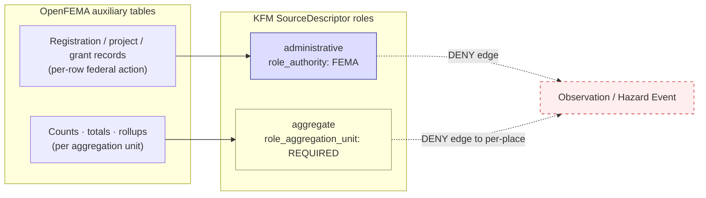
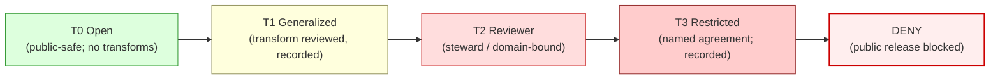

<!-- [KFM_META_BLOCK_V2]
doc_id: kfm://doc/docs-sources-catalog-fema-openfema-auxiliary-tables
title: OpenFEMA Auxiliary Tables
type: product-page
version: v0.2
status: draft
owners:
  - <PLACEHOLDER — Docs steward>
  - <PLACEHOLDER — Source steward for fema>
  - <PLACEHOLDER — Sensitivity steward>
  - <PLACEHOLDER — Hazards-domain steward>
  - <PLACEHOLDER — Settlements/Infrastructure-domain steward>
created: 2026-05-20
updated: 2026-05-21
policy_label: public-context-administrative; per-table-rights-snapshot-required; not-for-life-safety
admission_status: PROPOSED — per-table admission; no umbrella decision
related:
  - docs/sources/catalog/fema/README.md
  - docs/sources/catalog/fema/DISASTER-DECLARATIONS.md
  - docs/sources/catalog/fema/NATIONAL-FLOOD-HAZARD-LAYER.md
  - docs/sources/catalog/fema/MAP-SERVICE-CENTER.md
  - docs/sources/catalog/fema/NFIP-CLAIM-POLICY-AGGREGATES.md
  - docs/sources/catalog/README.md
  - docs/sources/catalog/IDENTITY.md
  - docs/sources/catalog/RIGHTS-AND-SENSITIVITY-MAP.md
  - docs/sources/catalog/_examples/stac-item-example.json
  - docs/doctrine/directory-rules.md
  - docs/doctrine/lifecycle-law.md
  - docs/standards/SENSITIVITY_RUBRIC.md
  - data/registry/sources/
  - connectors/fema/
  - schemas/contracts/v1/source/source-descriptor.json
  - policy/sensitivity/
  - docs/adr/ADR-0001-schema-home.md
corpus_anchors:
  - Domains Atlas §24.1.1   # canonical source-role classes (administrative + aggregate definitions)
  - Domains Atlas §24.1.2   # DENY: administrative compilation cited as observation
  - Domains Atlas §24.1.3   # role_authority + role_aggregation_unit field requirements
  - Domains Atlas §24.9.2   # trust-membrane anti-patterns
  - Encyclopedia §7.10      # FEMA Disaster Declarations / OpenFEMA hazards context
  - Pass-10 C6-05           # Differential privacy for aggregates only
  - Pass-10 C6-06           # k-anonymity for living-people-touching overlays
tags: [kfm, docs, sources, catalog, fema, openfema, administrative, aggregate, multi-table]
notes:
  - "PROPOSED product-page; sibling-link presence verified in prior Claude Code session."
  - "This page is a **bag of tables**, not a single product. Each OpenFEMA auxiliary table is its own SourceDescriptor with its own source_role, rights snapshot, sensitivity tier, and admission decision."
  - "Source role across this product family is **mixed**: predominantly `administrative` (records of federal actions), sometimes `aggregate` (totals/counts). Never `regulatory` and never `observed`."
  - "Path `docs/sources/catalog/fema/OPENFEMA-AUXILIARY-TABLES.md` is PROPOSED. `docs/sources/` is CONFIRMED at commit per Directory Rules v1.2 §6.1; `catalog/` subfolder convention is NEEDS VERIFICATION (no ADR observed)."
[/KFM_META_BLOCK_V2] -->

# OpenFEMA Auxiliary Tables

> A heterogeneous family of OpenFEMA programmatic tables — registrations, public-assistance projects, hazard-mitigation grants, mission assignments, disaster costs, and adjacent administrative datasets. **Each table is a separate `SourceDescriptor`.**

[](#status--ownership)
[](./README.md)
[](#3-source-role-mix--administrative-vs-aggregate)
[](#status--ownership)
[](#2-candidate-tables-illustrative)
[](#1-overview)
[](#open-questions)
[](#rights-and-sensitivity)
[](#validation-and-catalog-closure)
[](#last-reviewed)

> [!IMPORTANT]
> **This page describes a family of tables, not a single product.** Each OpenFEMA auxiliary dataset (IHP registrations, PA project details, HMGP project summaries, mission assignments, disaster costs, etc.) requires its **own `SourceDescriptor` with its own source role, rights snapshot, sensitivity tier, cadence, and admission decision**. There is no umbrella admission. Per the Unified Manual §3.6 (CONFIRMED): *"source role cannot be inferred from convenience."*

> [!CAUTION]
> **Administrative ≠ Observed.** An OpenFEMA record of a *grant award*, *project funding*, or *registration* is evidence that the federal action occurred — not evidence that anything happened *on the ground*. Treating an administrative compilation as an observed event timeline is a **DENY-closed anti-pattern** (Domains Atlas §24.1.2: *"Administrative compilation cited as observation"*).

---

## Status & Ownership

| Field | Value |
|---|---|
| **Doc status** | `draft` — PROPOSED product page; admission is per-table, no umbrella decision |
| **Family page** | [`./README.md`](./README.md) — FEMA family-level catalog entry |
| **Sibling pages** | [`./NATIONAL-FLOOD-HAZARD-LAYER.md`](./NATIONAL-FLOOD-HAZARD-LAYER.md), [`./MAP-SERVICE-CENTER.md`](./MAP-SERVICE-CENTER.md), [`./NFIP-CLAIM-POLICY-AGGREGATES.md`](./NFIP-CLAIM-POLICY-AGGREGATES.md), [`./DISASTER-DECLARATIONS.md`](./DISASTER-DECLARATIONS.md) *(last NEEDS VERIFICATION — sibling presence)* |
| **Doctrine basis** | **CONFIRMED.** Sources: Domains Atlas §24.1.1 (administrative + aggregate role definitions); §24.1.2 (administrative-compilation-as-observation DENY); §24.1.3 (descriptor fields); §24.9.2 (trust-membrane anti-patterns); Encyclopedia §7.10 (FEMA OpenFEMA hazards context). |
| **Implementation basis** | **PROPOSED / NEEDS VERIFICATION** — no mounted repo inspected this session; per-table admission decisions remain pending steward + sensitivity review. |
| **Predominant source role** | `administrative` (records of federal actions); some tables admit as `aggregate` (totals/counts). Never `regulatory`, never `observed`. |
| **Sensitivity range** | T0 (Open) for project-summary aggregates; T1 (Generalized) for project details with location precision; T2 (Reviewer) or DENY for tables with PII or precise sensitive geometry |
| **Schema-home convention** | `schemas/contracts/v1/source/source-descriptor.json` per ADR-0001 (CONFIRMED convention; PROPOSED file presence) |
| **Last reviewed** | 2026-05-21 |

---

## Quick jump

- [1. Overview](#1-overview)
- [2. Candidate tables (illustrative)](#2-candidate-tables-illustrative)
- [3. Source-role mix — administrative vs aggregate](#3-source-role-mix--administrative-vs-aggregate)
- [4. PII, precision, and sensitivity gradient](#4-pii-precision-and-sensitivity-gradient)
- [5. Why this page is a bag of tables](#5-why-this-page-is-a-bag-of-tables)
- [Source authority](#source-authority)
- [Catalog profiles used](#catalog-profiles-used)
- [Collection identity](#collection-identity)
- [Provenance fields](#provenance-fields)
- [Temporal handling](#temporal-handling)
- [Geometry and projection](#geometry-and-projection)
- [Rights and sensitivity](#rights-and-sensitivity)
- [Validation and catalog closure](#validation-and-catalog-closure)
- [Related contracts and schemas](#related-contracts-and-schemas)
- [Related connectors and pipelines](#related-connectors-and-pipelines)
- [Examples](#examples)
- [Open questions](#open-questions)
- [Related docs](#related-docs)
- [Last reviewed](#last-reviewed)

---

## 1. Overview

The **OpenFEMA API** is FEMA's primary programmatic distribution channel for non-spatial (or lightly spatial) administrative and aggregate datasets. The flagship product on this surface — **Disaster Declarations** — has its own dedicated descriptor and page ([`./DISASTER-DECLARATIONS.md`](./DISASTER-DECLARATIONS.md)). This page covers the remainder: a heterogeneous bag of tables whose content describes federal program activity around disasters but does not constitute the declaration record itself.

These tables share four properties:

1. **They are programmatic** — served as JSON / CSV through OpenFEMA REST endpoints with stable dataset slugs.
2. **They are administrative or aggregate, not observational** — each row records a federal action (a registration, an award, a project) or summarizes a set of such actions.
3. **They are FEMA-issued** — `role_authority: FEMA` applies family-wide.
4. **They are heterogeneous in cadence, granularity, and sensitivity** — and therefore require per-table admission.

> [!NOTE]
> This page exists as a **family overview**, not as an admission decision. The actual admitted SourceDescriptors live in `data/registry/sources/`. The role of this page is to keep the heterogeneity visible so reviewers can spot per-table differences before they harden into accidental homogeneity.

---

## 2. Candidate tables (illustrative)

The table below enumerates OpenFEMA datasets KFM has identified as **candidates** for admission. The list is **illustrative**, drawn from publicly known FEMA program shapes, and **NEEDS VERIFICATION** against the current OpenFEMA dataset listing. **No row below is admitted** until a per-table `SourceDescriptor` + `SourceActivationDecision` exists in `data/registry/sources/`.

| Candidate dataset | What it records | Proposed source role | Sensitivity tier (PROPOSED) | Cross-domain consumers |
|---|---|---|---|---|
| **Individuals and Households Program (IHP) — Valid Registrations** | Per-registration records of household assistance applicants | `administrative` (with **PII risk**) | **T2 (Reviewer)** or DENY — household identifiability concerns | Hazards (impact context only); Settlements |
| **IHP — Aggregates by disaster / county** | Counts and dollar totals at unit-of-aggregation | `aggregate` (`role_aggregation_unit` MUST be set) | T1 (Generalized) | Hazards |
| **Public Assistance (PA) — Funded Project Details** | Per-project records of public-infrastructure repair grants (location, applicant, scope, amount) | `administrative` | T1 (Generalized) — sensitive infrastructure precision generalized | Hazards; Settlements/Infrastructure |
| **Public Assistance (PA) — Funded Project Summaries** | Disaster-level rollups of PA program activity | `aggregate` | T0 (Open) — typical | Hazards |
| **Hazard Mitigation Grant Program (HMGP) — Project Summaries** | Mitigation project records (acquisition, elevation, retrofit, etc.) | `administrative` (often `aggregate` at summary level) | T0–T1 per table | Hazards; Settlements/Infrastructure |
| **Hazard Mitigation Assistance (HMA) — Mitigated Properties** | Per-property mitigation records, possibly with addresses | `administrative` (with **address-precision risk**) | **T2 (Reviewer)** or DENY for precise locations; T1 with generalization | Settlements/Infrastructure; People/DNA/Land |
| **Pre-Disaster Mitigation (PDM) — Funded Projects** | Per-project grant records for pre-event mitigation | `administrative` | T1 (Generalized) | Hazards |
| **Mission Assignments** | Federal interagency tasking records during disaster response | `administrative` | T0–T1 | Hazards |
| **Emergency Management Performance Grants (EMPG)** | State/local emergency-management grants | `administrative` | T0 (Open) — typical | Settlements/Infrastructure |
| **Disaster Costs** | Federal cost totals per disaster | `aggregate` | T0 (Open) — typical | Hazards |
| **Web Disaster Summaries / Declarations Summaries** | Disaster-level summary tables (declaration counts, summary fields) | `aggregate` | T0 (Open) — typical | Hazards |
| **NFIP claim and policy aggregates** | *(See dedicated sibling page)* | `aggregate` | ≥ T1 | *covered in* [`./NFIP-CLAIM-POLICY-AGGREGATES.md`](./NFIP-CLAIM-POLICY-AGGREGATES.md) |
| **Disaster Declarations** | *(See dedicated sibling page)* | `administrative` | T0 (Open) — typical | *covered in* [`./DISASTER-DECLARATIONS.md`](./DISASTER-DECLARATIONS.md) |

> [!CAUTION]
> **Dataset names above are descriptive English, not OpenFEMA slugs.** Exact OpenFEMA endpoint slugs and field names are version-sensitive and explicitly NEEDS VERIFICATION at admission time. Do not treat the names above as binding identifiers.

[↑ Back to top](#openfema-auxiliary-tables)

---

## 3. Source-role mix — administrative vs aggregate

OpenFEMA auxiliary tables split into two source-role lanes. The split is not optional: per Domains Atlas §24.1.1 (CONFIRMED), source role is a first-class identity attribute and never inferred from convenience.



### `administrative` lane

**Definition (Domains Atlas §24.1.1, CONFIRMED):** *"A compiled record produced by an agency for administration, registration, or accounting purposes — not necessarily an observation or a regulation."*

| What it tells you | What it does NOT tell you |
|---|---|
| "FEMA awarded grant G to applicant A for project P, in amount X, on date D, citing disaster declaration DR-####" | "The damage actually happened at the project's location" — the grant record is evidence of the *administrative action*, not of the underlying physical event |
| "Household H registered for IHP assistance for disaster DR-####" | "Household H was actually damaged" — registration ≠ verified loss |
| "Mission Assignment M tasked agency Z with response activity Y" | "Activity Y actually occurred as described" |

**Required descriptor field:** `role_authority: FEMA` (CONFIRMED in Atlas §24.1.3 for `regulatory | modeled | aggregate`; PROPOSED extension to `administrative` for citation clarity).

### `aggregate` lane

**Definition (Domains Atlas §24.1.1, CONFIRMED):** *"A published summary, total, or average over a unit (county, year, watershed); irreversible loss of individual record fidelity."*

When an OpenFEMA table publishes counts or dollar totals at a unit-of-aggregation scale (disaster-level, county-level, etc.), it admits as `aggregate`, not `administrative`. The same DENY conditions that govern [NFIP aggregates](./NFIP-CLAIM-POLICY-AGGREGATES.md) apply:

- `role_aggregation_unit` **MUST be set** (Domains Atlas §24.1.3, CONFIRMED).
- Aggregate-cell-as-per-place truth is **DENIED** (§24.1.2).
- Geometry-scope guard at validator + policy + renderer layers.

> [!NOTE]
> Some OpenFEMA datasets straddle the line. A "Funded Project Details" table is mostly `administrative` (per-project records) but may contain aggregate fields (cumulative obligation totals). The descriptor picks the **dominant role** of the table and validators enforce the lane-specific DENY conditions per field.

[↑ Back to top](#openfema-auxiliary-tables)

---

## 4. PII, precision, and sensitivity gradient

Unlike the other FEMA siblings (regulatory floodplains, FIRM panels) which carry no household-level identifiability risk, **some OpenFEMA auxiliary tables touch personal information**. The sensitivity range across this product family is wider than for any other FEMA sibling.



### Sensitivity assignment matrix (PROPOSED)

| Table characteristic | Sensitivity tier (PROPOSED) | Required transform |
|---|---|---|
| Disaster-level rollups; aggregate counts; dollar totals at state or larger | **T0 (Open)** | None beyond standard release |
| County-level or finer aggregates with adequate cell counts | **T1 (Generalized)** | `AggregationReceipt`; k-anonymity threshold check |
| Per-project records with **non-precise** location (city / county) | **T1 (Generalized)** | Source-role tag preservation; review state |
| Per-project records with **precise** sensitive-infrastructure location (e.g., pump station, gate control) | **T2 (Reviewer)** or generalize | Coordinate generalization or restriction per family-level sensitivity policy (basis: KFM-P2-PROG-0008, CONFIRMED: *"sensitive infrastructure (pump stations, gate controls) generalized or marked restricted"*) |
| Per-property mitigation records with addresses | **T2 (Reviewer)** or DENY | `RedactionReceipt`; address generalization; consider k-anonymity (Pass-10 C6-06 basis) |
| Per-registration household records (IHP applicants) | **T2 (Reviewer)** or DENY | PII redaction; per-record review; living-person privacy controls |

> [!WARNING]
> **Low-count cells de-anonymize.** Even at aggregate scale, a county with only a handful of IHP registrations can re-identify individual households. Apply k-anonymity at admission (Pass-10 C6-06, CONFIRMED basis); apply differential privacy if DP epsilon/delta budgets are recorded (Pass-10 C6-05, CONFIRMED for aggregates only).

### Cross-domain joins that fail closed

- **Per-property HMA records joined to People/DNA/Land per-place data** → DENY (PII + address precision).
- **PA project location joined to sensitive-infrastructure object family** → DENY unless precision is generalized.
- **IHP registration counts joined to per-parcel records** → DENY (aggregate-as-per-place; see §3).

[↑ Back to top](#openfema-auxiliary-tables)

---

## 5. Why this page is a bag of tables

A reasonable reviewer might ask: *why not split this page into one per table?*

The answer is governance ergonomics. The other FEMA sibling pages — NFHL, MSC, NFIP aggregates, Disaster Declarations — each describe a **named product** with a stable identity and a homogeneous treatment. The OpenFEMA "auxiliary" surface is different:

| Property | NFHL / MSC / NFIP / Declarations | OpenFEMA auxiliary tables |
|---|---|---|
| Number of underlying datasets | One per page | Many — open-ended; FEMA adds and retires tables |
| Stable identity? | Yes — each product is a named FEMA program output | No — table slugs and schemas evolve |
| Homogeneous source role? | Yes | No — mixed `administrative` and `aggregate` |
| Homogeneous sensitivity tier? | Yes (per page) | No — spans T0 through DENY |
| Homogeneous cadence? | Yes (per page) | No — varies per table |

Creating one product page per OpenFEMA table would create dozens of near-empty stubs that go stale as FEMA's offerings shift. Keeping the family **collected** on one page lets stewards:

1. See the heterogeneity in one place.
2. Add a row to §2 when a new candidate dataset appears.
3. Migrate a row out to a dedicated page if a table grows important enough to deserve its own descriptor + page (e.g., the way NFIP aggregates already did).

> [!TIP]
> When does an auxiliary table graduate to its own page? Rule of thumb: when its admission decision becomes structurally distinct from the family default — different rights snapshot, different cadence policy, different cross-domain consumers, or a sensitivity escalation that requires its own validator coverage. Use an ADR to record the graduation.

[↑ Back to top](#openfema-auxiliary-tables)

---

## Source authority

See [`data/registry/sources/`](../../../../data/registry/sources/) for the authoritative `SourceDescriptor` *per table*. **Do not duplicate descriptor fields here.** The fields below are *intent* expectations only; binding values live in the registry.

### Family-wide descriptor intent

| Field | Family-wide intent | Per-table override |
|---|---|---|
| `source_id` | `fema-openfema-<dataset-slug>` (one descriptor per OpenFEMA dataset) | MUST — different per table |
| `provider` | `OpenFEMA` | Unified |
| `role_authority` | `FEMA` | Unified |
| `access_method` | `openfema-rest-json` (or `bulk-csv`) | Per-table |
| `endpoint` | `<PLACEHOLDER — confirm current OpenFEMA dataset URL and slug>` | MUST — different per table |
| `rights` | `<PLACEHOLDER — confirm current OpenFEMA terms snapshot>` | One snapshot may cover the family if FEMA terms are unified; otherwise per-table |
| `connector_home` | `connectors/fema/` | Unified |
| `public_release_class` | `context-only; not-for-life-safety` | Unified for this family |

### Per-table mandatory fields

| Field | Required when | Notes |
|---|---|---|
| `source_role` | Always | `administrative` or `aggregate` per table (see §3) |
| `role_aggregation_unit` | `source_role = aggregate` | MUST be set; admission rejected if missing (Atlas §24.1.3, CONFIRMED) |
| `sensitivity_tier` | Always | T0–T2 typical; T3 / DENY possible for PII-bearing tables |
| `cadence` | Always | Differs per table; OpenFEMA cadence is dataset-specific |
| `pii_class` | If table has any per-person rows | NEEDS VERIFICATION schema field |
| `k_anonymity_threshold` | If `source_role = aggregate` and low-count cells possible | Pass-10 C6-06 basis |
| `dp_budget_ref` | If DP applied | Pass-10 C6-05 CONFIRMED |

> [!IMPORTANT]
> Per Unified Manual §3.6 (CONFIRMED): *"source role cannot be inferred from convenience."* A table that *feels* like it might be aggregate (because it has rollup-shaped fields) is still admitted as `administrative` if its rows are per-action records. Field shape is not role.

---

## Catalog profiles used

| Profile | Lane | Used by this product family? |
|---|---|---|
| STAC | `data/catalog/stac/` | PROPOSED — Yes per table (table snapshot as item; aggregation-unit geometry where applicable) — NEEDS VERIFICATION |
| DCAT | `data/catalog/dcat/` | PROPOSED — Yes (DCAT is well-matched to tabular admin datasets) — NEEDS VERIFICATION |
| PROV-O | `data/catalog/prov/` | PROPOSED — Yes (`prov:wasGeneratedBy` for the federal action; `prov:wasAttributedTo` FEMA) — NEEDS VERIFICATION |
| Domain projection | `data/catalog/domain/hazards/` and `data/catalog/domain/settlements-infrastructure/` | PROPOSED — both domains bind to OpenFEMA auxiliary tables — NEEDS VERIFICATION |

---

## Collection identity

- PROPOSED Collection id pattern: `kfm-fema-openfema-<dataset-slug>` (one Collection per OpenFEMA dataset).
- PROPOSED namespace: `kfm:` *(see OPEN-DSC-03)*.
- PROPOSED item id pattern: depends on table shape:
  - Administrative per-row tables: `kfm-fema-openfema-<dataset-slug>-<record-id>`.
  - Aggregate tables: `kfm-fema-openfema-<dataset-slug>-<aggregation_unit>-<period>-<unit_id>`.
- Asset roles: NEEDS VERIFICATION — confirm against `schemas/contracts/v1/source/` once mounted.

> [!NOTE]
> Encoding both `<dataset-slug>` and (where applicable) `<aggregation_unit>` into the collection id is intentional: it surfaces the table identity *and* the role-class at every cite point.

---

## Provenance fields

STAC `properties.kfm:provenance` block (PROPOSED — Pass-10 C4-01):

- `spec_hash` — sha256 of the canonical record.
- `evidence_bundle_ref` — `kfm://evidence/<digest>`.
- `run_record_ref` — `kfm://run/<run-id>`.
- `audit_ref` — `kfm://audit/<attestation-id>`.
- `policy_digest` — sha256 of the policy bundle.

OpenFEMA-auxiliary-specific additions (PROPOSED):

- `kfm:source_role` — `"administrative"` or `"aggregate"` per table.
- `kfm:role_authority` — `"FEMA"`.
- `kfm:role_aggregation_unit` — token, only when `source_role = aggregate`.
- `kfm:openfema_dataset_slug` — the upstream OpenFEMA dataset identifier (verbatim).
- `kfm:openfema_dataset_version` — version metadata from the OpenFEMA API where exposed.
- `kfm:redaction_receipt` — `kfm://redaction-receipt/<digest>`, where redaction applied.

Per-asset integrity: `file:checksum` on each released JSON / CSV / Parquet.

---

## Temporal handling

PROPOSED — distinct source / observed / valid / retrieval / release / correction times where material (Domains Atlas §24.1 reading note, CONFIRMED).

Temporal handling differs by role:

### Administrative (per-row) tables

| KFM time field | What it means | Notes |
|---|---|---|
| `source_time` | OpenFEMA's last-updated timestamp for the record / dataset | Required |
| `observed_time` | **Not applicable** — administrative records describe federal actions, not observations | Leave unset |
| `valid_time` | Where the record carries an effective period (e.g., grant period of performance), record it; otherwise unset | Per-table |
| `retrieval_time` | When KFM fetched the record | DENY admission if missing |
| `release_time` | When KFM released its derived product | DENY publication if missing |
| `correction_time` | If KFM has corrected a prior release | Required on every `CorrectionNotice` |

### Aggregate tables

Same as administrative, plus:

| KFM time field | What it means | Notes |
|---|---|---|
| `valid_time` | Period the aggregate covers (e.g., `2020-01-01/2023-12-31`) | DENY if missing — uncitable without a period |

> [!WARNING]
> **OpenFEMA tables can be revised retroactively.** Grant amounts get amended, registrations get reclassified, project obligations get adjusted. Cite by `source_time` + dataset version; watch the upstream publisher for revisions that would trigger a `CorrectionNotice`. (The same retroactive-revision posture that applies to NFIP aggregates and to compliance data more broadly — basis: Domains Atlas EPA-compliance card "Compliance data is occasionally revised retroactively; supersedes tracking is essential.")

---

## Geometry and projection

PROPOSED — confirm CRS, generalization rules, and scale support against `data/catalog/` artifacts. NEEDS VERIFICATION.

Geometry handling depends on table shape:

| Table shape | Geometry treatment |
|---|---|
| **Disaster-level rollup, no geometry** | No geometry; STAC extent uses the disaster's declared geography from the linked Disaster Declaration |
| **County / state / community aggregate** | Geometry from canonical place authority (TIGER/Line for counties; NEEDS VERIFICATION for community boundaries); the validator's geometry-scope guard rejects finer geometries |
| **Per-project records with coordinates** | Treat as the project's *funded* location; coordinate precision may require generalization if it would reveal sensitive infrastructure (KFM-P2-PROG-0008 basis, CONFIRMED) |
| **Per-property records (addresses)** | Address geometry MUST be generalized before public release; precise addresses are T2 or DENY |

> [!WARNING]
> A funded-project coordinate is **not** an observation of damage — it is the location where the federal action applies (where the grant funds were spent, where the property is registered). Cite it as administrative context, never as evidence of an event having occurred at that point.

---

## Rights and sensitivity

NEEDS VERIFICATION — see [`../../../../policy/sensitivity/`](../../../../policy/sensitivity/) and [`../RIGHTS-AND-SENSITIVITY-MAP.md`](../RIGHTS-AND-SENSITIVITY-MAP.md). **Do not restate policy here.**

Family-level rights posture is summarized in [`./README.md` §7](./README.md). OpenFEMA-auxiliary-specific reminders:

- **OpenFEMA terms-of-use snapshot is required** per table family at minimum; per-table snapshots if FEMA terms diverge (Unified Manual §3.6, CONFIRMED).
- **PII risk is per-table** — not all auxiliary tables carry PII, but several do. IHP registrations and HMA mitigated properties are the most sensitive.
- **Sensitive-infrastructure precision is generalized or restricted** at admission (KFM-P2-PROG-0008, CONFIRMED).
- **Cross-domain joins to People/DNA/Land are restricted by default** for tables that touch household-level data.
- **Attribution** to FEMA / OpenFEMA is required in `LayerManifest` and export language (assume YES until terms confirmed).
- **API key requirements** — OpenFEMA's rate-limit / API-key posture is NEEDS VERIFICATION; if keys are required, credentials live behind a no-public-path adapter, never embedded in client code.

---

## Validation and catalog closure

- **Catalog closure required before public release** (Pass-10 / KFM-P1-IDEA-0020) — PROPOSED.
- **STAC Projection lint** (KFM-P27-FEAT-0003) — PROPOSED.
- **STAC checksum closure** against the `ReleaseManifest` digest (KFM-P22-PROG-0037) — PROPOSED.
- **Source-role anti-collapse test** — reject any edge from an `administrative` or `aggregate` descriptor to an `Observation` or `Hazard Event` (Domains Atlas §24.1.2, CONFIRMED).
- **Administrative-as-observation DENY** — reject any release that types an OpenFEMA per-row record as an observed event (Atlas §24.1.2, CONFIRMED).
- **Aggregate geometry-scope guard** — for tables admitted as `aggregate`, reject features whose geometry is finer than `role_aggregation_unit` (Atlas §24.1.2 guardrail, CONFIRMED).
- **PII redaction validator** — for tables flagged with PII risk, verify `RedactionReceipt` is present and complete; per-record review for unmitigated PII.
- **k-anonymity validator** (aggregate tables) — verify cell counts meet the configured threshold; suppress or merge below threshold (Pass-10 C6-06 basis).
- **DP receipt validator** (aggregate tables, when DP applied) — verify epsilon/delta recorded within documented budget (Pass-10 C6-05, CONFIRMED).
- **Sensitive-infrastructure precision guard** — reject release of project locations at sensitive precision (e.g., pump stations, gate controls) without generalization receipt (KFM-P2-PROG-0008, CONFIRMED).
- **Renderer-boundary test** — no public client reads OpenFEMA bytes from RAW / WORK / QUARANTINE (Directory Rules v1.2 §0, CONFIRMED).
- **Per-table no-network fixture** — validator suite passes on synthetic OpenFEMA fixtures with no live calls (PROPOSED).
- **Retroactive-revision watcher test** — when an upstream record is revised, watcher emits a candidate `CorrectionNotice` rather than silently overwriting (PROPOSED).

### Suggested test fixtures

PROPOSED home: `tests/fixtures/sources/fema/openfema/<dataset-slug>/` or equivalent — NEEDS VERIFICATION against mounted-repo fixture-home convention.

1. A **valid administrative per-row fixture** (e.g., a PA project record) with intact `source_role` and `role_authority`.
2. A **valid aggregate fixture** (e.g., a disaster-level rollup) with `role_aggregation_unit` set.
3. A **negative fixture** typing an administrative record as `Hazard Event` — validator MUST DENY.
4. A **negative fixture** joining an aggregate cell to a per-parcel record — validator MUST DENY.
5. A **PII fixture** (IHP-shaped) without redaction — validator MUST DENY public release.
6. A **sensitive-infrastructure precision fixture** without generalization — validator MUST DENY (KFM-P2-PROG-0008).
7. A **retroactive-revision fixture** — watcher MUST emit a candidate `CorrectionNotice`.

---

## Related contracts and schemas

- `contracts/domains/hazards/` — `Hazard Timeline`, `Exposure Summary`, `Resilience Summary` may bind to OpenFEMA tables as administrative context — NEEDS VERIFICATION.
- `contracts/domains/settlements-infrastructure/` — infrastructure objects may bind to PA / HMGP project context (precision-generalized) — NEEDS VERIFICATION.
- `contracts/governance/` — `AggregationReceipt`, `RedactionReceipt` shapes — PROPOSED, not yet authored.
- `schemas/contracts/v1/source/source-descriptor.json` — per **ADR-0001** (CONFIRMED convention; PROPOSED file presence).
- `schemas/contracts/v1/receipts/` — `RedactionReceipt`, `AggregationReceipt`, `CorrectionNotice` — NEEDS VERIFICATION.

---

## Related connectors and pipelines

- [`connectors/fema/`](../../../../connectors/fema/) — root **CONFIRMED at commit** per Directory Rules v1.2 §7.3; specific OpenFEMA module path NEEDS VERIFICATION.
- `pipelines/ingest/`, `pipelines/normalize/`, `pipelines/validate/`, `pipelines/catalog/` — phase-canonical paths CONFIRMED in Directory Rules v1.2 §7.4; OpenFEMA bindings NEEDS VERIFICATION.
- `pipeline_specs/hazards/` and `pipeline_specs/settlements-infrastructure/` — declarative specs for OpenFEMA-bound pipelines — NEEDS VERIFICATION.
- `pipelines/watchers/` — per-table OpenFEMA REST watcher with retroactive-revision detection — PROPOSED.
- `policy/sensitivity/` — PII redaction rules, k-anonymity thresholds, sensitive-infrastructure precision rules — NEEDS VERIFICATION.

---

## Examples

*(Illustrative only — do not treat as authoritative.)*

See [`../_examples/stac-item-example.json`](../_examples/stac-item-example.json) for the family-level reference shape.

<details>
<summary><b>Administrative per-row shape: Public Assistance funded project</b></summary>

```json
{
  "type": "Feature",
  "id": "kfm-fema-openfema-pa-funded-projects-<project-id>",
  "collection": "kfm-fema-openfema-pa-funded-projects",
  "properties": {
    "datetime": "<source_time>",
    "kfm:provenance": {
      "spec_hash": "sha256:<placeholder>",
      "evidence_bundle_ref": "kfm://evidence/<digest>",
      "run_record_ref": "kfm://run/<run-id>",
      "audit_ref": "kfm://audit/<attestation-id>",
      "policy_digest": "sha256:<placeholder>"
    },
    "kfm:source_role": "administrative",
    "kfm:role_authority": "FEMA",
    "kfm:openfema_dataset_slug": "<PLACEHOLDER — confirm upstream slug>",
    "fema:disaster_number": "<DR-####>",
    "fema:project_id": "<project-id>"
  },
  "geometry": {
    "type": "Point",
    "coordinates": ["<generalized coordinate, sensitive-infrastructure precision guarded>"]
  },
  "assets": {
    "openfema_record": {
      "href": "<archival URI under data/raw/hazards/fema-openfema/pa-funded-projects/...>",
      "type": "application/json",
      "roles": ["data", "administrative"],
      "file:checksum": "1220<sha256-multihash>"
    }
  }
}
```

</details>

<details>
<summary><b>Aggregate shape: Disaster Costs rollup</b></summary>

```json
{
  "type": "Feature",
  "id": "kfm-fema-openfema-disaster-costs-disaster-DR-####",
  "collection": "kfm-fema-openfema-disaster-costs",
  "properties": {
    "datetime": "<source_time>",
    "start_datetime": "<incident-begin-date>",
    "end_datetime": "<incident-end-date>",
    "kfm:provenance": {
      "spec_hash": "sha256:<placeholder>",
      "evidence_bundle_ref": "kfm://evidence/<digest>",
      "run_record_ref": "kfm://run/<run-id>",
      "audit_ref": "kfm://audit/<attestation-id>",
      "policy_digest": "sha256:<placeholder>"
    },
    "kfm:source_role": "aggregate",
    "kfm:role_authority": "FEMA",
    "kfm:role_aggregation_unit": "disaster",
    "kfm:openfema_dataset_slug": "<PLACEHOLDER — confirm upstream slug>",
    "fema:disaster_number": "<DR-####>"
  }
}
```

</details>

<details>
<summary><b>Focus Mode ABSTAIN posture: administrative-as-observation query</b></summary>

```text
User query: "When did the flooding happen at <PA-funded project location>?"

Focus Mode resolves EvidenceRef → EvidenceBundle.
EvidenceBundle source_role: administrative
EvidenceBundle bound object: PA funded project record
Query intent: observed event at the project location

PolicyDecision: DENY
DecisionEnvelope: ABSTAIN
AIReceipt.reason: "administrative-record-cited-as-observation"
AIReceipt.suggested_reframe: "I have records that FEMA awarded a PA grant
  for a project at this location, citing disaster DR-#### declared on D.
  The grant record is not direct evidence that flooding occurred at that
  exact point or on that exact day. Try citing the underlying Disaster
  Declaration and NFHL flood context for the area instead."
```

</details>

> [!NOTE]
> Examples above are **illustrative**. Field names under `fema:` and the exact `kfm:provenance` shape (including the OpenFEMA-specific fields) remain PROPOSED until the canonical schema is verified in the mounted repo.

---

## Open questions

| # | Question | Status |
|---|---|---|
| OPEN-AUX-01 | Confirm the current enumeration of OpenFEMA auxiliary datasets in scope (§2 is illustrative, not authoritative) | PROPOSED |
| OPEN-AUX-02 | Confirm current OpenFEMA API base URL and per-dataset slugs | NEEDS VERIFICATION |
| OPEN-AUX-03 | Confirm rights status, terms-of-use snapshot, and whether terms are unified family-wide or per-table | PROPOSED |
| OPEN-AUX-04 | Confirm OpenFEMA cadence per table (some are quarterly, some monthly, some on-incident) | NEEDS VERIFICATION |
| OPEN-AUX-05 | Confirm whether OpenFEMA requires API keys and the credential-storage convention | NEEDS VERIFICATION |
| OPEN-AUX-06 | Decide which tables warrant graduation to their own product page (see §5 graduation rule of thumb) | PROPOSED |
| OPEN-AUX-07 | Decide IHP-Valid-Registrations admission posture — admit as `administrative` with T2 review, or DENY | PROPOSED — sensitivity steward decision required |
| OPEN-AUX-08 | Decide HMA Mitigated Properties admission posture given address precision | PROPOSED — sensitivity steward decision required |
| OPEN-AUX-09 | Confirm sensitive-infrastructure generalization rules per KFM-P2-PROG-0008 (pump stations, gate controls) — and whether they apply to PA-funded-project records | NEEDS VERIFICATION |
| OPEN-AUX-10 | Confirm retroactive-revision watcher behavior — how does the watcher emit candidate `CorrectionNotice` rather than silently overwriting? | PROPOSED |
| OPEN-AUX-11 | Confirm cross-domain join policy: which Hazards / Settlements / People-Land joins to OpenFEMA tables are allowed, restricted, or denied (relates to ADR-S-14 Cross-lane join policy) | PROPOSED |
| OPEN-AUX-12 | Confirm fixture home convention per dataset (`tests/fixtures/sources/fema/openfema/<dataset-slug>/`) | NEEDS VERIFICATION |

---

## Related docs

- [`./README.md`](./README.md) — FEMA family-level catalog entry (family admission posture)
- [`./DISASTER-DECLARATIONS.md`](./DISASTER-DECLARATIONS.md) — sibling: the named flagship OpenFEMA product *(NEEDS VERIFICATION — sibling presence)*
- [`./NATIONAL-FLOOD-HAZARD-LAYER.md`](./NATIONAL-FLOOD-HAZARD-LAYER.md) — sibling NFHL descriptor (regulatory)
- [`./MAP-SERVICE-CENTER.md`](./MAP-SERVICE-CENTER.md) — sibling MSC descriptor (regulatory)
- [`./NFIP-CLAIM-POLICY-AGGREGATES.md`](./NFIP-CLAIM-POLICY-AGGREGATES.md) — sibling NFIP aggregates (aggregate, high-sensitivity)
- [`../README.md`](../README.md) — Source catalog landing page
- [`../IDENTITY.md`](../IDENTITY.md) — Collection / item identity patterns
- [`../RIGHTS-AND-SENSITIVITY-MAP.md`](../RIGHTS-AND-SENSITIVITY-MAP.md) — Rights and sensitivity registry
- [`../_examples/stac-item-example.json`](../_examples/stac-item-example.json) — Reference STAC + `kfm:provenance` shape
- [`../../../doctrine/directory-rules.md`](../../../doctrine/directory-rules.md) — Placement and lifecycle law (v1.2)
- [`../../../standards/SENSITIVITY_RUBRIC.md`](../../../standards/SENSITIVITY_RUBRIC.md) — Sensitivity rubric *(PROPOSED in Pass-10 C6-01; not yet authored)*
- [`../../../adr/ADR-0001-schema-home.md`](../../../adr/ADR-0001-schema-home.md) — Schema home rule
- `<TODO>` `../../../adr/ADR-S-04-source-role-vocabulary-v1.md` — Source-role vocabulary v1 (PROPOSED in Domains Atlas §24.12)
- `<TODO>` `../../../adr/ADR-S-14-cross-lane-join-policy.md` — Cross-lane join policy (PROPOSED in Domains Atlas §24.12)

---

## Last reviewed

2026-05-21 *(Claude Code product-page evidence-grounded revision; doctrine basis CONFIRMED, per-table admission PROPOSED, implementation basis NEEDS VERIFICATION until mounted-repo inspection and recorded per-table steward decisions).*

---

<sub>**Related docs**: [FEMA family](./README.md) · [Disaster Declarations](./DISASTER-DECLARATIONS.md) · [NFHL](./NATIONAL-FLOOD-HAZARD-LAYER.md) · [MSC](./MAP-SERVICE-CENTER.md) · [NFIP aggregates](./NFIP-CLAIM-POLICY-AGGREGATES.md) · [Directory Rules](../../../doctrine/directory-rules.md) · [connectors/fema/](../../../../connectors/fema/)</sub>
<sub>**Last updated**: 2026-05-21 · **Doc status**: draft · **Admission**: per-table · **Doctrine basis**: CONFIRMED · **Implementation basis**: PROPOSED / NEEDS VERIFICATION</sub>
<sub>[↑ Back to top](#openfema-auxiliary-tables)</sub>
