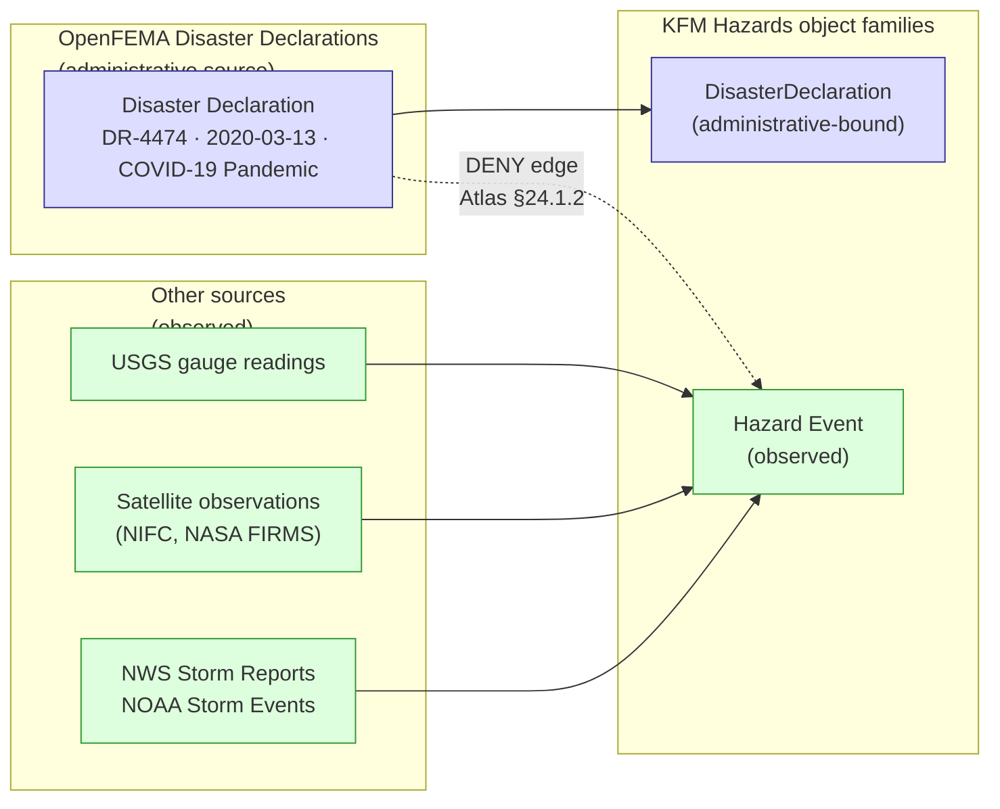
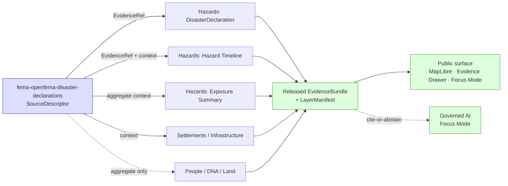

<!-- [KFM_META_BLOCK_V2]
doc_id: kfm://doc/docs-sources-catalog-fema-openfema-disaster-declarations
title: OpenFEMA Disaster Declarations
type: product-page
version: v0.2
status: draft
owners:
  - <PLACEHOLDER — Docs steward>
  - <PLACEHOLDER — Source steward for fema>
  - <PLACEHOLDER — Hazards-domain steward>
created: 2026-05-20
updated: 2026-05-21
policy_label: public-context-administrative; not-for-life-safety
admission_status: PROPOSED — CONFIRMED doctrine basis; implementation pending mounted-repo verification
related:
  - docs/sources/catalog/fema/README.md
  - docs/sources/catalog/fema/NATIONAL-FLOOD-HAZARD-LAYER.md
  - docs/sources/catalog/fema/MAP-SERVICE-CENTER.md
  - docs/sources/catalog/fema/NFIP-CLAIM-POLICY-AGGREGATES.md
  - docs/sources/catalog/fema/OPENFEMA-AUXILIARY-TABLES.md
  - docs/sources/catalog/README.md
  - docs/sources/catalog/IDENTITY.md
  - docs/sources/catalog/RIGHTS-AND-SENSITIVITY-MAP.md
  - docs/sources/catalog/_examples/stac-item-example.json
  - docs/doctrine/directory-rules.md
  - docs/doctrine/lifecycle-law.md
  - docs/domains/hazards/README.md
  - contracts/domains/hazards/
  - data/registry/sources/
  - connectors/fema/
  - schemas/contracts/v1/source/source-descriptor.json
  - docs/adr/ADR-0001-schema-home.md
corpus_anchors:
  - Domains Atlas §12.D        # Hazards: FEMA Disaster Declarations / OpenFEMA source family
  - Domains Atlas §24.1.1      # canonical source-role classes (administrative definition)
  - Domains Atlas §24.1.2      # DENY: administrative compilation cited as observation
  - Domains Atlas §24.1.3      # role_authority MUST be set
  - Domains Atlas §24.9.2      # trust-membrane anti-patterns
  - Encyclopedia §7.10         # FEMA Disaster Declarations / OpenFEMA hazards context
tags: [kfm, docs, sources, catalog, fema, openfema, disaster-declarations, administrative, hazards]
notes:
  - "PROPOSED product-page; sibling-link presence verified in prior Claude Code session."
  - "Source role is `administrative`, not `regulatory` and not `observed`. A Disaster Declaration is a record of a federal action — never an observed flood / fire / storm / earthquake event."
  - "This is the canonical FEMA source for the Hazards-domain `DisasterDeclaration` object family (Domains Atlas §12.E)."
  - "Path `docs/sources/catalog/fema/DISASTER-DECLARATIONS.md` is PROPOSED. `docs/sources/` is CONFIRMED at commit per Directory Rules v1.2 §6.1; `catalog/` subfolder convention is NEEDS VERIFICATION (no ADR observed)."
[/KFM_META_BLOCK_V2] -->

# OpenFEMA Disaster Declarations

> Federal disaster declaration records (DR / EM / FM numbers, declaration dates, incident periods, declared counties) published through the OpenFEMA API — the canonical KFM source for the Hazards-domain `DisasterDeclaration` object family.

[](#status--ownership)
[](./README.md)
[](#3-disaster-declarations-vs-hazard-events--the-canonical-distinction)
[](#status--ownership)
[](#1-overview)
[](#open-questions)
[](#rights-and-sensitivity)
[](#3-disaster-declarations-vs-hazard-events--the-canonical-distinction)
[](#rights-and-sensitivity)
[](#validation-and-catalog-closure)
[](#last-reviewed)

> [!IMPORTANT]
> **A Disaster Declaration is a federal action, not an observed event.** It records that the President of the United States issued a Major Disaster Declaration (DR), Emergency Declaration (EM), or Fire Management Assistance Declaration (FM) — citing the incident type and the dates/counties FEMA assistance applies to. It is **not** observed inundation, observed wildfire perimeter, observed storm damage, or any other physical-world reading. CONFIRMED doctrine: Domains Atlas §24.1.2 (*"Administrative compilation cited as observation"* DENY); §24.9.2 (trust-membrane anti-pattern); [DOM-HAZ] §B (Hazards explicit non-ownership: not an emergency alert system).

---

## Status & Ownership

| Field | Value |
|---|---|
| **Doc status** | `draft` — PROPOSED product page; admission decision pending steward review |
| **Family page** | [`./README.md`](./README.md) — FEMA family-level catalog entry |
| **Sibling pages** | [`./NATIONAL-FLOOD-HAZARD-LAYER.md`](./NATIONAL-FLOOD-HAZARD-LAYER.md), [`./MAP-SERVICE-CENTER.md`](./MAP-SERVICE-CENTER.md), [`./NFIP-CLAIM-POLICY-AGGREGATES.md`](./NFIP-CLAIM-POLICY-AGGREGATES.md), [`./OPENFEMA-AUXILIARY-TABLES.md`](./OPENFEMA-AUXILIARY-TABLES.md) |
| **Doctrine basis** | **CONFIRMED.** Sources: Domains Atlas §12.D (Hazards source family: *"FEMA Disaster Declarations / OpenFEMA"*); §12.E (Hazards `Disaster Declaration` object family); §24.1.1 (administrative role definition); §24.1.2 (administrative-compilation-as-observation DENY); §24.9.2 (trust-membrane anti-patterns); Encyclopedia §7.10 (FEMA Disaster Declarations / OpenFEMA hazards context). |
| **Implementation basis** | **PROPOSED / NEEDS VERIFICATION** — no mounted repo inspected this session; schema, registry, validator, fixture, and connector path claims default to PROPOSED. |
| **Source role** | `administrative` (NOT `regulatory`, NOT `observed`); `role_authority: FEMA` |
| **Bound object family** | `DisasterDeclaration` (Hazards domain, CONFIRMED in Domains Atlas §12.E) |
| **Sensitivity tier** | **T0 (Open)** — public federal record; no PII; no precise sensitive geometry |
| **Schema-home convention** | `schemas/contracts/v1/source/source-descriptor.json` per ADR-0001 (CONFIRMED convention; PROPOSED file presence) |
| **Last reviewed** | 2026-05-21 |

---

## Quick jump

- [1. Overview](#1-overview)
- [2. What a Disaster Declaration record contains](#2-what-a-disaster-declaration-record-contains)
- [3. Disaster Declarations vs Hazard Events — the canonical distinction](#3-disaster-declarations-vs-hazard-events--the-canonical-distinction)
- [4. Declaration types — DR / EM / FM](#4-declaration-types--dr--em--fm)
- [5. Role in the Hazards domain](#5-role-in-the-hazards-domain)
- [Source authority](#source-authority)
- [Catalog profiles used](#catalog-profiles-used)
- [Collection identity](#collection-identity)
- [Provenance fields](#provenance-fields)
- [Temporal handling](#temporal-handling)
- [Geometry and projection](#geometry-and-projection)
- [Rights and sensitivity](#rights-and-sensitivity)
- [Validation and catalog closure](#validation-and-catalog-closure)
- [Related contracts and schemas](#related-contracts-and-schemas)
- [Related connectors and pipelines](#related-connectors-and-pipelines)
- [Examples](#examples)
- [Open questions](#open-questions)
- [Related docs](#related-docs)
- [Last reviewed](#last-reviewed)

---

## 1. Overview

The **OpenFEMA Disaster Declarations** dataset is the federal record of formal disaster declarations issued by the President of the United States and processed by FEMA. Each row in the dataset describes one declaration: its number (e.g., `DR-4474`), type (Major Disaster, Emergency, Fire Management Assistance), incident type (severe storms, flooding, tornado, wildfire, hurricane, pandemic, etc.), declaration date, incident period, and the geographic units (states, tribal nations, counties) the declaration applies to.

KFM admits this dataset as the **canonical `administrative` source for the Hazards-domain `DisasterDeclaration` object family** (Domains Atlas §12.D and §12.E, CONFIRMED). It is the cleanest of the FEMA siblings to admit:

| Property | Value |
|---|---|
| **Source role** | `administrative` (Domains Atlas §24.1.1, CONFIRMED) |
| **PII risk** | None — declarations are about jurisdictions, not individuals |
| **Sensitivity tier** | T0 (Open) — typical |
| **Cadence** | Event-driven; declarations are issued as needed (a few per month nationally, with surges during major events) |
| **Geometric scope** | Declared at state, tribal-nation, and/or county granularity — never finer |
| **Bound object** | `DisasterDeclaration` (Hazards) — **not** `Hazard Event` |

> [!NOTE]
> This page describes the **Disaster Declarations summary dataset** — the canonical declaration record. Related OpenFEMA datasets (PA project details, IHP aggregates, HMGP summaries, disaster costs) admit as separate `SourceDescriptor` records and are covered on [`./OPENFEMA-AUXILIARY-TABLES.md`](./OPENFEMA-AUXILIARY-TABLES.md). Per the Unified Manual §3.6 (CONFIRMED): *"source role cannot be inferred from convenience"* — adjacency in the OpenFEMA API does not imply shared admission.

---

## 2. What a Disaster Declaration record contains

The OpenFEMA Disaster Declarations dataset publishes records with the following intent fields. **Exact field names are NEEDS VERIFICATION** against the current OpenFEMA schema; the names below are descriptive intent, not binding.

| Intent field | What it records | KFM treatment |
|---|---|---|
| **Declaration number** (e.g., `DR-4474`, `EM-3554`, `FM-5345`) | The federal declaration identifier; type prefix encodes declaration class | Stable identity field; preserved verbatim in catalog records |
| **Declaration type** | `DR` (Major Disaster), `EM` (Emergency), `FM` (Fire Management Assistance) | Enum; bound to `DisasterDeclaration` object subtype (see §4) |
| **Incident type** | The hazard class FEMA cites (e.g., severe storms, flooding, tornado, wildfire, hurricane, earthquake, pandemic) | Carries through to the `DisasterDeclaration` record; **does not** become a `Hazard Event` (see §3) |
| **Declaration date** | When the President / FEMA formally declared the disaster | `source_time` anchor |
| **Incident begin date / incident end date** | The period the declaration applies to | `valid_time` interval |
| **Designated areas (state / tribal nation / county)** | Geographic units the declaration applies to | Geometry sourced from canonical place authority (TIGER/Line for states/counties; NEEDS VERIFICATION for tribal nations); never finer than declared unit |
| **Disaster name / title** | FEMA's title for the declaration (e.g., *"Severe Storms, Tornadoes, And Flooding"*) | Preserved verbatim |
| **Program activations** | Which FEMA assistance programs were activated (IA, PA, HMGP) for this declaration | Cross-reference to auxiliary tables ([sibling page](./OPENFEMA-AUXILIARY-TABLES.md)) |

> [!CAUTION]
> The **incident type** field is the most common source-role-collapse risk. A declaration with `incident_type: "Severe Storms, Tornadoes, And Flooding"` is **not** evidence that any specific tornado touched down on a specific date at a specific location. It is evidence that FEMA declared a disaster *citing* tornadoes as the incident type. Observed tornado events come from other source families (NOAA Storm Events, NWS, etc.).

[↑ Back to top](#openfema-disaster-declarations)

---

## 3. Disaster Declarations vs Hazard Events — the canonical distinction

This is the doctrine that defines this page. Quoting Domains Atlas §24.1.2 (CONFIRMED) verbatim:

| Collapse pattern | Domains most at risk | Denied outcome | Required guardrail |
|---|---|---|---|
| **Administrative compilation cited as observation** | People/Land; Settlements; Roads; *(Hazards by extension)* | **DENY** publication of compilation as observed event timeline | Source-role tag preserved; named `LifeEvent` / `AdminEvent` types — for Hazards: named `DisasterDeclaration` type distinct from `Hazard Event` |

And from Domains Atlas §24.9.2 (CONFIRMED trust-membrane anti-pattern): *"Administrative compilation cited as observation. … Source-role collapse; matrix-cell semantics violated."*

### The two object families are distinct



| Aspect | **DisasterDeclaration** | **Hazard Event** |
|---|---|---|
| Source role | `administrative` | `observed` |
| What it asserts | "FEMA declared a disaster on date D citing incident type T for areas A" | "A physical event occurred at time t at location L with measured/observed properties" |
| What it does NOT assert | That a specific physical event happened at a specific time/place | That a federal declaration was issued |
| Canonical source | OpenFEMA Disaster Declarations (this page) | NOAA Storm Events, NWS, USGS, NASA FIRMS, NOAA HMS, Kansas/local emergency context, etc. (sibling source families) |
| Domain home | Hazards (`DisasterDeclaration`) | Hazards (`Hazard Event`); also Hydrology (`Observed Flood Event`), Atmosphere/Air (various) |

> [!NOTE]
> A clicked feature in an Evidence Drawer that wants to **explain a disaster's footprint** should resolve **two distinct `EvidenceBundle`s**: one for the `DisasterDeclaration` (this page's source) and one or more for `Hazard Event` observations (sibling sources). Compositing them into a single bundle would collapse the source-role boundary — DENY.

[↑ Back to top](#openfema-disaster-declarations)

---

## 4. Declaration types — DR / EM / FM

FEMA issues three principal declaration types. Each is admitted under the same `SourceDescriptor` (Disaster Declarations dataset is unified upstream) but the **declaration-type enum is preserved verbatim** so downstream consumers can filter and contextualize correctly.

| Type prefix | Full name | What it authorizes | KFM citation pattern |
|---|---|---|---|
| **DR** | Major Disaster Declaration | The broadest federal assistance — Individual Assistance (IA), Public Assistance (PA), and/or Hazard Mitigation (HM) programs | "Major Disaster Declaration `DR-<####>` declared on `<DECLARATION_DATE>` citing `<INCIDENT_TYPE>` for `<AREAS>`" |
| **EM** | Emergency Declaration | More limited, time-sensitive federal assistance — typically Public Assistance plus emergency protective measures | "Emergency Declaration `EM-<####>` declared on `<DECLARATION_DATE>` for `<AREAS>`" |
| **FM** | Fire Management Assistance Declaration | Specific to wildfire response cost-sharing | "Fire Management Assistance Declaration `FM-<####>` declared on `<DECLARATION_DATE>` for `<AREAS>`" |

> [!TIP]
> When citing a declaration, KFM citation language **always** includes the declaration number, declaration date, and either the incident type (for `DR`) or the explicit type name (for `EM`/`FM`). This preserves the administrative posture and prevents downstream readers from inferring observation. Field-name examples above use placeholder casing; exact OpenFEMA field names remain NEEDS VERIFICATION.

---

## 5. Role in the Hazards domain

Disaster Declarations are explicitly listed in the Hazards domain's source family roster (Domains Atlas §12.D, CONFIRMED):

> *"FEMA Disaster Declarations / OpenFEMA — authority / observation / context / model as source role requires — rights and current terms NEEDS VERIFICATION; sensitive joins fail closed — source-vintage or cadence specific"*

In KFM's terms: the source family is registered to Hazards, the source role is **administrative** (the *"context"* tier in the Atlas-level loose language), and joins to per-place observed data require the role-preserving guardrails in §3.

### Downstream KFM consumers

| Consumer | What it uses Disaster Declarations for | Boundary |
|---|---|---|
| **Hazards — `DisasterDeclaration` object family** | Direct binding: the declaration record is the object | None — this is the source-bound object family |
| **Hazards — `Hazard Timeline`** | Context overlay: declarations as labeled time-period anchors alongside observed events | Declarations rendered as administrative markers, never merged into observation-class time bins |
| **Hazards — `Exposure Summary` / `Resilience Summary`** | Cross-reference: declarations counted per jurisdiction over time | Aggregate posture; `role_aggregation_unit` applies when used |
| **Settlements / Infrastructure** | Context: declarations affecting infrastructure-bearing jurisdictions | Declaration ≠ damage; pair with observed sources for impact claims |
| **People / DNA / Land** | Aggregate context only (declarations per county per year) | Aggregate-cell-as-truth DENY applies (Domains Atlas §24.1.2); never per-household |



[↑ Back to top](#openfema-disaster-declarations)

---

## Source authority

See [`data/registry/sources/`](../../../../data/registry/sources/) for the authoritative `SourceDescriptor`. **Do not duplicate descriptor fields here.** The fields below are *intent* expectations; binding values live in the registry.

| Field | Proposed intent for `fema-openfema-disaster-declarations` | Required? |
|---|---|---|
| `source_id` | `fema-openfema-disaster-declarations` | MUST |
| `source_role` | `administrative` | MUST |
| `role_authority` | `FEMA` | MUST |
| `provider` | `OpenFEMA` | MUST |
| `endpoint` | `<PLACEHOLDER — confirm current OpenFEMA Disaster Declarations dataset URL and slug>` | MUST |
| `access_method` | `openfema-rest-json` (and/or `bulk-csv`) | MUST |
| `cadence` | `event-driven; declaration-based` | MUST |
| `temporal_anchor_fields` | `declarationDate, incidentBeginDate, incidentEndDate, disasterNumber` *(field names PROPOSED — NEEDS VERIFICATION)* | MUST |
| `object_lane` | `DisasterDeclaration` (Hazards); **NOT** `Hazard Event` | MUST |
| `rights` | `<PLACEHOLDER — confirm current OpenFEMA terms snapshot>` | MUST |
| `sensitivity_tier` | `T0` (Open) | MUST |
| `public_release_class` | `context-only; not-for-life-safety` | MUST |
| `connector_home` | `connectors/fema/` | SHOULD |

> [!TIP]
> The `object_lane: DisasterDeclaration` field is the operational lock that prevents source-role-collapse. A validator that finds a release manifest binding `fema-openfema-disaster-declarations` to a `Hazard Event` object should fail closed before the manifest is admitted. See [Validation §](#validation-and-catalog-closure).

---

## Catalog profiles used

| Profile | Lane | Used by this product? |
|---|---|---|
| STAC | `data/catalog/stac/` | PROPOSED — Yes (each declaration as a STAC item with declared-areas geometry as the spatial extent and incident period as the temporal extent) — NEEDS VERIFICATION |
| DCAT | `data/catalog/dcat/` | PROPOSED — Yes (DCAT is well-matched to tabular administrative records) — NEEDS VERIFICATION |
| PROV-O | `data/catalog/prov/` | PROPOSED — Yes (`prov:wasAttributedTo` FEMA; `prov:wasGeneratedBy` the declaration action) — NEEDS VERIFICATION |
| Domain projection | `data/catalog/domain/hazards/` | PROPOSED — Yes — this is a Hazards-bound product — NEEDS VERIFICATION |

---

## Collection identity

- PROPOSED Collection id pattern: `kfm-fema-openfema-disaster-declarations` (single collection; one item per declaration).
- PROPOSED namespace: `kfm:` *(see OPEN-DSC-03)*.
- PROPOSED item id pattern: `kfm-fema-openfema-disaster-declarations-<declaration-number>` (e.g., `kfm-fema-openfema-disaster-declarations-DR-4474`) — the declaration number is the natural stable identifier.
- Asset roles: NEEDS VERIFICATION — confirm against `schemas/contracts/v1/source/` once mounted.

> [!NOTE]
> Encoding the declaration number verbatim in the item id (including the `DR-` / `EM-` / `FM-` prefix) preserves the declaration-type signal at every cite point and protects against accidental cross-type aggregation.

---

## Provenance fields

STAC `properties.kfm:provenance` block (PROPOSED — Pass-10 C4-01):

- `spec_hash` — sha256 of the canonical record.
- `evidence_bundle_ref` — `kfm://evidence/<digest>`.
- `run_record_ref` — `kfm://run/<run-id>`.
- `audit_ref` — `kfm://audit/<attestation-id>`.
- `policy_digest` — sha256 of the policy bundle.

Disaster-Declaration-specific additions (PROPOSED):

- `kfm:source_role` — fixed at `"administrative"`.
- `kfm:role_authority` — `"FEMA"`.
- `kfm:object_lane` — `"DisasterDeclaration"` (binds the record to its Hazards object family at provenance time).
- `kfm:openfema_dataset_slug` — the upstream OpenFEMA dataset identifier (verbatim).
- `fema:disaster_number` — the declaration number (`DR-####`, `EM-####`, `FM-####`).
- `fema:declaration_type` — `"DR" | "EM" | "FM"`.
- `fema:incident_type` — the FEMA-issued incident type string (verbatim).

Per-asset integrity: `file:checksum` on each released JSON / CSV / GeoJSON.

---

## Temporal handling

PROPOSED — distinct source / observed / valid / retrieval / release / correction times where material (Domains Atlas §24.1 reading note, CONFIRMED).

| KFM time field | What it means for a Disaster Declaration | DENY / ABSTAIN trigger if missing |
|---|---|---|
| `source_time` | The declaration date — when FEMA / the President formally declared the disaster | DENY admission |
| `observed_time` | **Not applicable** — declarations are administrative actions, not observations | n/a — leaving unset is *correct* for this role |
| `valid_time` | The incident period (incident begin → incident end), where the declaration is operative | DENY publication if missing |
| `retrieval_time` | When KFM fetched the record from OpenFEMA | DENY admission if missing |
| `release_time` | When KFM released its derived product | DENY publication if missing |
| `correction_time` | If KFM has corrected a prior release | Required on every `CorrectionNotice` |

> [!WARNING]
> **OpenFEMA records can be revised retroactively** as declarations are amended, designated areas are added, or program activations are updated. Treat each declaration record as a vintage; cite by `source_time` + dataset version; watch the upstream publisher for revisions that would trigger a `CorrectionNotice`. (Same retroactive-revision posture as the [OpenFEMA auxiliary tables sibling](./OPENFEMA-AUXILIARY-TABLES.md).)

---

## Geometry and projection

PROPOSED — confirm CRS, generalization rules, and scale support against `data/catalog/` artifacts. NEEDS VERIFICATION.

The "geometry" of a Disaster Declaration is **the union of designated areas** — never finer than the declared unit (state, tribal nation, county). KFM doctrine treats this strictly:

| Aspect | Disaster Declaration posture | KFM treatment |
|---|---|---|
| Geometry source | Canonical place authority (TIGER/Line for US states and counties; NEEDS VERIFICATION for tribal-nation polygons) | Recorded in `SourceDescriptor`; not invented |
| KFM canonical CRS | PROPOSED per Spatial Foundation domain | `ProjectionTransformReceipt` per Encyclopedia Appendix E |
| Geometry-scope guard | Geometry MUST NOT be rendered finer than the declared-area unit | Renderer-boundary test fails closed |
| Aggregation pattern | The union of declared areas is the natural envelope; per-area cells may be rendered as choropleth (declaration count, time-since-declaration) | When rendered as a count surface, treat as `aggregate` with `role_aggregation_unit` set |

> [!WARNING]
> Rendering a Disaster Declaration as a precise per-point footprint inside a declared county is a **prohibited rendering transform**. The declaration applies to the *county as a unit*, not to specific addresses or features within it. This is the same geometry-scope guard that governs aggregate sources (see [NFIP aggregates sibling](./NFIP-CLAIM-POLICY-AGGREGATES.md) §4), applied to administrative geometry.

---

## Rights and sensitivity

NEEDS VERIFICATION — see [`../../../../policy/sensitivity/`](../../../../policy/sensitivity/) and [`../RIGHTS-AND-SENSITIVITY-MAP.md`](../RIGHTS-AND-SENSITIVITY-MAP.md). **Do not restate policy here.**

Family-level rights posture is summarized in [`./README.md` §7](./README.md). Disaster-Declarations-specific reminders:

- FEMA is a U.S. federal agency; OpenFEMA Disaster Declarations are generally treated as U.S. public records. **Current terms-of-use snapshot remains NEEDS VERIFICATION** before first public emit (Unified Manual §3.6, CONFIRMED).
- **No PII risk.** Declarations are about jurisdictions, not individuals. This is what makes the product cleaner than NFIP aggregates or IHP registrations.
- **No precise sensitive geometry.** Declarations are at state/tribal-nation/county granularity. No sensitive-infrastructure precision risk.
- **Sensitivity tier is T0 (Open)** as the default. Per-cell escalation is unlikely but the family-level `not-for-life-safety` flag still applies.
- **Attribution** to FEMA / OpenFEMA is required in `LayerManifest` and export language (assume YES until terms confirmed).
- **API key requirements** — OpenFEMA's rate-limit / API-key posture is NEEDS VERIFICATION; if keys are required, credentials live behind a no-public-path adapter, never embedded in client code.
- **Life-safety redirection still applies** even though the data is jurisdictional, because Hazards-surface display of any declaration MUST not appear to direct end-users' life-safety decisions ([DOM-HAZ] §B, CONFIRMED).

---

## Validation and catalog closure

- **Catalog closure required before public release** (Pass-10 / KFM-P1-IDEA-0020) — PROPOSED.
- **STAC Projection lint** (KFM-P27-FEAT-0003) — PROPOSED.
- **STAC checksum closure** against the `ReleaseManifest` digest (KFM-P22-PROG-0037) — PROPOSED.
- **Source-role anti-collapse test** — reject any release manifest binding `fema-openfema-disaster-declarations` to a `Hazard Event` or per-place `Observation` (Domains Atlas §24.1.2, CONFIRMED).
- **Administrative-as-observation DENY** — reject any catalog record that types a declaration as observed inundation, observed wildfire, observed storm, or similar (Atlas §24.1.2, CONFIRMED).
- **Object-lane lock** — validator verifies `object_lane: DisasterDeclaration` is present on every release manifest tied to this source.
- **Geometry-scope guard** — reject any geometry attached to the declaration finer than state / tribal nation / county.
- **Renderer-boundary test** — no public client reads declaration records from RAW / WORK / QUARANTINE (Directory Rules v1.2 §0, CONFIRMED).
- **Declaration-type-preservation validator** — `DR` / `EM` / `FM` enum preserved verbatim through catalog and publication.
- **Retroactive-revision watcher test** — when an upstream record is revised, watcher emits a candidate `CorrectionNotice` rather than silently overwriting (PROPOSED).
- **Citation validator** — every public claim resolves an `EvidenceRef` to an `EvidenceBundle` whose source is a current declaration descriptor revision; citations include declaration number, declaration date, and (for DR) incident type or (for EM/FM) the explicit type name.
- **No-network fixture** — validator suite passes on synthetic declaration fixtures with no live calls.

### Suggested test fixtures

PROPOSED home: `tests/fixtures/sources/fema/openfema/disaster-declarations/` or equivalent — NEEDS VERIFICATION against mounted-repo fixture-home convention.

1. A **valid DR declaration fixture** (e.g., `DR-4474`) with intact `declarationDate`, `incidentBeginDate`, `incidentEndDate`, declared-areas list, and incident type.
2. A **valid EM declaration fixture** with the same shape but `EM-` prefix.
3. A **valid FM declaration fixture** (Fire Management Assistance) with the `FM-` prefix.
4. A **negative fixture** that types a declaration as a `Hazard Event` — validator MUST DENY.
5. A **negative fixture** with geometry finer than the declared unit (e.g., a point inside a county) — validator MUST DENY.
6. A **negative fixture** that drops the declaration type prefix from the identifier — validator MUST DENY.
7. A **retroactive-revision fixture** (declared-areas added after initial publication) — watcher MUST emit a candidate `CorrectionNotice`.

---

## Related contracts and schemas

- [`contracts/domains/hazards/`](../../../../contracts/domains/hazards/) — `DisasterDeclaration` object family (CONFIRMED in Domains Atlas §12.E; PROPOSED path).
- `schemas/contracts/v1/source/source-descriptor.json` — per **ADR-0001** (CONFIRMED convention; PROPOSED file presence).
- `schemas/contracts/v1/receipts/` — `RawCaptureReceipt`, `TransformReceipt`, `CorrectionNotice` — NEEDS VERIFICATION.

---

## Related connectors and pipelines

- [`connectors/fema/`](../../../../connectors/fema/) — root **CONFIRMED at commit** per Directory Rules v1.2 §7.3; specific OpenFEMA module path NEEDS VERIFICATION.
- `pipelines/ingest/`, `pipelines/normalize/`, `pipelines/validate/`, `pipelines/catalog/` — phase-canonical paths CONFIRMED in Directory Rules v1.2 §7.4; declaration bindings NEEDS VERIFICATION.
- `pipeline_specs/hazards/` — declarative specs for declaration-bound pipelines — NEEDS VERIFICATION.
- `pipelines/watchers/` — OpenFEMA Disaster Declarations watcher polling for new declarations and retroactive revisions — PROPOSED.

---

## Examples

*(Illustrative only — do not treat as authoritative.)*

See [`../_examples/stac-item-example.json`](../_examples/stac-item-example.json) for the family-level reference shape.

<details>
<summary><b>Minimal STAC + <code>kfm:provenance</code> shape for a Disaster Declaration</b></summary>

```json
{
  "type": "Feature",
  "id": "kfm-fema-openfema-disaster-declarations-DR-4474",
  "collection": "kfm-fema-openfema-disaster-declarations",
  "properties": {
    "datetime": "<declaration_date>",
    "start_datetime": "<incident_begin_date>",
    "end_datetime": "<incident_end_date>",
    "kfm:provenance": {
      "spec_hash": "sha256:<placeholder>",
      "evidence_bundle_ref": "kfm://evidence/<digest>",
      "run_record_ref": "kfm://run/<run-id>",
      "audit_ref": "kfm://audit/<attestation-id>",
      "policy_digest": "sha256:<placeholder>"
    },
    "kfm:source_role": "administrative",
    "kfm:role_authority": "FEMA",
    "kfm:object_lane": "DisasterDeclaration",
    "kfm:openfema_dataset_slug": "<PLACEHOLDER — confirm upstream slug>",
    "fema:disaster_number": "DR-4474",
    "fema:declaration_type": "DR",
    "fema:incident_type": "<verbatim FEMA incident type>",
    "fema:disaster_title": "<verbatim FEMA disaster title>"
  },
  "geometry": {
    "type": "MultiPolygon",
    "coordinates": ["<union of declared counties / states / tribal nations at canonical CRS>"]
  },
  "assets": {
    "openfema_record": {
      "href": "<archival URI under data/raw/hazards/fema-openfema/disaster-declarations/...>",
      "type": "application/json",
      "roles": ["data", "administrative"],
      "file:checksum": "1220<sha256-multihash>"
    }
  }
}
```

</details>

<details>
<summary><b>Focus Mode ABSTAIN posture: declaration-cited-as-observation query</b></summary>

```text
User query: "When did the tornado hit on March 1st in Sedgwick County?"

Focus Mode resolves EvidenceRef → EvidenceBundle.
EvidenceBundle source_role: administrative
EvidenceBundle object_lane: DisasterDeclaration
Bound record: DR-#### "Severe Storms, Tornadoes, And Flooding" declared 2024-03-15,
              incident period 2024-03-01 to 2024-03-03, designated areas include Sedgwick County.
Query intent: observed tornado event at a specific time/place.

PolicyDecision: DENY (source-role-collapse: administrative-as-observation)
DecisionEnvelope: ABSTAIN
AIReceipt.reason: "disaster-declaration-cited-as-observation"
AIReceipt.suggested_reframe: "I have a federal Disaster Declaration (DR-####) citing
  'Severe Storms, Tornadoes, And Flooding' with an incident period covering March 1-3, 2024,
  applying to Sedgwick County among others. That's a record of the federal action, not a
  per-event observation. For observed tornado timing and tracks, NOAA Storm Events or the
  NWS storm reports for that period are the right sources."
```

</details>

<details>
<summary><b>Citation language template (PROPOSED)</b></summary>

```text
For DR: "Major Disaster Declaration DR-<####>, declared <DECLARATION_DATE>,
        citing <INCIDENT_TYPE>, applies to <AREAS>; incident period <INCIDENT_BEGIN> to <INCIDENT_END>."

For EM: "Emergency Declaration EM-<####>, declared <DECLARATION_DATE>,
        applies to <AREAS>; incident period <INCIDENT_BEGIN> to <INCIDENT_END>."

For FM: "Fire Management Assistance Declaration FM-<####>, declared <DECLARATION_DATE>,
        applies to <AREAS>; incident period <INCIDENT_BEGIN> to <INCIDENT_END>."
```

</details>

> [!NOTE]
> The examples above are **illustrative**. Field names under `fema:` and the exact `kfm:provenance` shape (including the declaration-specific fields) remain PROPOSED until the canonical schema is verified in the mounted repo.

---

## Open questions

| # | Question | Status |
|---|---|---|
| OPEN-DD-01 | Confirm current OpenFEMA Disaster Declarations dataset URL and slug | NEEDS VERIFICATION |
| OPEN-DD-02 | Confirm current OpenFEMA terms-of-use snapshot | NEEDS VERIFICATION |
| OPEN-DD-03 | Confirm OpenFEMA cadence and revision behavior (declarations are issued event-driven; amendments occur retroactively) | NEEDS VERIFICATION |
| OPEN-DD-04 | Confirm whether OpenFEMA requires API keys | NEEDS VERIFICATION |
| OPEN-DD-05 | Confirm canonical polygon source for declared areas — TIGER/Line for US states/counties; **what about tribal nations?** | NEEDS VERIFICATION |
| OPEN-DD-06 | Confirm exact OpenFEMA field names (`declarationDate`, `incidentBeginDate`, `incidentEndDate`, `disasterNumber`, `incidentType` and others) for the descriptor's `temporal_anchor_fields` | NEEDS VERIFICATION |
| OPEN-DD-07 | Decide whether `EM` (Emergency) and `FM` (Fire Management) declarations admit under the same descriptor as `DR` or warrant separate descriptors | PROPOSED — same descriptor, type preserved verbatim |
| OPEN-DD-08 | Confirm Hazard Timeline rendering pattern: declarations as labeled markers, not as observation bins | PROPOSED — see §5 |
| OPEN-DD-09 | Confirm citation language template (see Examples) is consistent with `docs/sources/catalog/IDENTITY.md` patterns | NEEDS VERIFICATION |
| OPEN-DD-10 | Confirm fixture home (`tests/fixtures/sources/fema/openfema/disaster-declarations/` vs alternative) | NEEDS VERIFICATION |
| OPEN-DD-11 | Confirm cross-domain join policy for declarations — what joins with Settlements / Infrastructure / People-Land are allowed, restricted, or denied (relates to ADR-S-14) | PROPOSED |
| OPEN-DD-12 | Confirm retroactive-revision watcher behavior — how does the watcher emit candidate `CorrectionNotice` rather than silently overwriting? | PROPOSED |

---

## Related docs

- [`./README.md`](./README.md) — FEMA family-level catalog entry
- [`./NATIONAL-FLOOD-HAZARD-LAYER.md`](./NATIONAL-FLOOD-HAZARD-LAYER.md) — sibling NFHL descriptor (regulatory)
- [`./MAP-SERVICE-CENTER.md`](./MAP-SERVICE-CENTER.md) — sibling MSC descriptor (regulatory)
- [`./NFIP-CLAIM-POLICY-AGGREGATES.md`](./NFIP-CLAIM-POLICY-AGGREGATES.md) — sibling NFIP aggregates (aggregate, high-sensitivity)
- [`./OPENFEMA-AUXILIARY-TABLES.md`](./OPENFEMA-AUXILIARY-TABLES.md) — sibling auxiliary OpenFEMA tables (administrative + aggregate mix)
- [`../README.md`](../README.md) — Source catalog landing page
- [`../IDENTITY.md`](../IDENTITY.md) — Collection / item identity patterns
- [`../RIGHTS-AND-SENSITIVITY-MAP.md`](../RIGHTS-AND-SENSITIVITY-MAP.md) — Rights and sensitivity registry
- [`../_examples/stac-item-example.json`](../_examples/stac-item-example.json) — Reference STAC + `kfm:provenance` shape
- [`../../../doctrine/directory-rules.md`](../../../doctrine/directory-rules.md) — Placement and lifecycle law (v1.2)
- [`../../../domains/hazards/README.md`](../../../domains/hazards/README.md) — Hazards domain consumer *(PROPOSED path)*
- [`../../../adr/ADR-0001-schema-home.md`](../../../adr/ADR-0001-schema-home.md) — Schema home rule
- `<TODO>` `../../../adr/ADR-S-04-source-role-vocabulary-v1.md` — Source-role vocabulary v1 (PROPOSED in Domains Atlas §24.12)
- `<TODO>` `../../../adr/ADR-S-14-cross-lane-join-policy.md` — Cross-lane join policy (PROPOSED in Domains Atlas §24.12)

---

## Last reviewed

2026-05-21 *(Claude Code product-page evidence-grounded revision; doctrine basis CONFIRMED, admission PROPOSED, implementation basis NEEDS VERIFICATION until mounted-repo inspection).*

---

<sub>**Related docs**: [FEMA family](./README.md) · [NFHL](./NATIONAL-FLOOD-HAZARD-LAYER.md) · [MSC](./MAP-SERVICE-CENTER.md) · [NFIP aggregates](./NFIP-CLAIM-POLICY-AGGREGATES.md) · [Auxiliary tables](./OPENFEMA-AUXILIARY-TABLES.md) · [Directory Rules](../../../doctrine/directory-rules.md) · [connectors/fema/](../../../../connectors/fema/)</sub>
<sub>**Last updated**: 2026-05-21 · **Doc status**: draft · **Admission**: PROPOSED · **Doctrine basis**: CONFIRMED · **Implementation basis**: PROPOSED / NEEDS VERIFICATION</sub>
<sub>[↑ Back to top](#openfema-disaster-declarations)</sub>
