<!-- [KFM_META_BLOCK_V2]
doc_id: kfm://doc/sources/catalog/ftdna
title: Source Catalog — Family Tree DNA (FTDNA)
type: standard
version: v0.1
status: draft
owners: source-steward (TODO), people-dna-land domain steward (TODO)
created: 2026-05-13
updated: 2026-05-13
policy_label: public
related:
  - docs/sources/SOURCE_DESCRIPTOR_STANDARD.md
  - docs/doctrine/directory-rules.md
  - docs/domains/people-dna-land/README.md
tags: [kfm, source-catalog, dtc, genealogy, dna, watchlist]
notes:
  - PROPOSED catalog entry; FTDNA is not named in the KFM corpus DTC list (C9-03 names 23andMe/AncestryDNA/MyHeritage).
  - All vendor-specific operational facts (products, formats, terms, ownership, retention) are NEEDS VERIFICATION until confirmed at admission time.
[/KFM_META_BLOCK_V2] -->

# Source Catalog — Family Tree DNA (FTDNA)

> Proposed source-catalog entry for the FTDNA direct-to-consumer (DTC) genetic-genealogy vendor. Frames FTDNA as a candidate addition to the C9.c DTC Genomic Inputs lane and the C9.f Vendor-Risk Watchlist, by analogy with the named DTC vendors in `C9-03`. **No data are admitted by this document.** Admission requires a completed SourceDescriptor, rights resolution, sensitivity tagging, and steward review.

  
  
  
  
  
  
  

| Field | Value |
|---|---|
| **Status** | PROPOSED (draft) |
| **Owners** | Source steward *(TODO)* · People/DNA/Land domain steward *(TODO)* · Rights-holder representative for living-person/DNA *(TODO)* |
| **Default tier** | **T4 — Denied** for raw DNA data, DNAMatchEvidence, DNASegment, living-person fields |
| **Domain** | People, Genealogy, DNA, and Land Ownership |
| **Corpus mapping** | C9.c DTC Genomic Inputs (analogous to C9-03) · C9.f Vendor-Risk Watchlist (C9-07) |
| **Path basis** | `docs/sources/` is the canonical home for source-descriptor standards and source families per Directory Rules §6.1; the `catalog/` subdirectory itself is a **PROPOSED convention** of this document |

---

## Quick Jump

- [1. Scope and Boundary](#1-scope-and-boundary)
- [2. Corpus Position and Status](#2-corpus-position-and-status)
- [3. Source Role and Identity](#3-source-role-and-identity)
- [4. Rights, Terms, and Consent Posture](#4-rights-terms-and-consent-posture)
- [5. Sensitivity Tier and Allowed Transforms](#5-sensitivity-tier-and-allowed-transforms)
- [6. Lifecycle Flow](#6-lifecycle-flow)
- [7. Admission and Promotion Gates](#7-admission-and-promotion-gates)
- [8. Object Family Mapping](#8-object-family-mapping)
- [9. Vendor-Risk Watch](#9-vendor-risk-watch)
- [10. Cross-Lane Relations](#10-cross-lane-relations)
- [11. Open Verification Items](#11-open-verification-items)
- [12. Related Docs](#12-related-docs)

---

## 1. Scope and Boundary

This catalog entry describes the **intended source role, rights posture, sensitivity tier, gate requirements, and watchlist obligations** for any future admission of FTDNA-originated data into the Kansas Frontier Matrix pipeline. It does **not** authorize ingestion, claim that any FTDNA data is present in the repository, or describe runtime behavior.

**In scope.** Source-descriptor scaffold; tier defaults; admission and promotion gates; allowed transforms; cross-references to consent, redaction, and revocation doctrine; vendor-risk watchlist obligations.

**Out of scope.** Field-level schema shape (`schemas/contracts/v1/source/...`); admissibility decisions (`policy/`); per-record sensitivity decisions (`data/registry/sensitivity/`); release manifests (`release/`); rendering or API surface (`apps/governed-api/`). This file **explains**; it does not **decide**.

> [!IMPORTANT]
> **FTDNA is not named in the KFM corpus.** The corpus's C9-03 DTC entry names only *23andMe, AncestryDNA, and MyHeritage*. This document treats FTDNA as a structurally analogous candidate vendor and inherits the C9.c posture by analogy. The mapping is **PROPOSED** and must be ratified by an accepted ADR or an explicit decision in `control_plane/source_authority_register.yaml` before any FTDNA payload may be admitted.

---

## 2. Corpus Position and Status

| Element | Value | Truth label |
|---|---|---|
| Domain home | People, Genealogy, DNA, and Land Ownership | CONFIRMED doctrine |
| Sub-lane | DTC Genomic Inputs (C9.c) | INFERRED (by analogy with C9-03) |
| Watchlist sub-lane | Vendor-Risk Watchlist (C9.f) | INFERRED (extends C9-07 pattern) |
| Default disposition | DENY by default; admission requires rights + consent + sensitivity tagging | CONFIRMED doctrine |
| Vendor named in corpus | No | CONFIRMED absence |
| Path placement | `docs/sources/catalog/ftDNA.md` | PROPOSED *(see §11 and Notes)* |

**Doctrine reminders that govern this entry.** Living-person and DNA-derived outputs are denied or restricted by default; the trust membrane prevents raw, unreviewed, restricted, or generated state from becoming public truth; promotion is a **governed state transition**, not a file move; EvidenceBundle outranks generated text; cite-or-abstain is the default truth posture.

---

## 3. Source Role and Identity

The corpus's PROPOSED SourceDescriptor surface (Atlas §24.1.3) requires `source_role` to be set at admission and never edited in place. The realistic role values for FTDNA payloads are listed below; each prospective product line is a separate admission event with its own descriptor.

> [!NOTE]
> The fields below mirror the PROPOSED SourceDescriptor surface. **NEEDS VERIFICATION:** actual field names and presence in the mounted `schemas/contracts/v1/source/source-descriptor.json` are not asserted by this document. See ADR-0001 (schema home) and Directory Rules §7.4.

| SourceDescriptor field | Proposed value for FTDNA admission | Required? | Notes |
|---|---|---|---|
| `source_id` | `ftdna` *(slug; final spelling NEEDS VERIFICATION against `control_plane/source_authority_register.yaml`)* | MUST | Stable identifier; never re-used after retirement. |
| `source_name` | `Family Tree DNA` | MUST | Vendor display name. |
| `source_family` | DTC genetic-genealogy vendor | MUST | Aligns with C9.c. |
| `source_role` | `candidate` at admission; `observation` once promoted | MUST | Promotion to `observation` requires rights resolution + consent + sensitivity tagging. |
| `role_authority` | Vendor of record (corporate parent / ToS issuer) | MUST when role ≠ `candidate` | Disambiguates authorship for cite text. **NEEDS VERIFICATION**: current corporate parent and ToS issuer. |
| `role_candidate_disposition` | `pending` until merged or rejected | MUST when role = `candidate` | No PUBLISHED edge until merged. |
| `rights_class` | `vendor-terms-bound-user-controlled-export` *(PROPOSED label)* | MUST | Final value depends on a current reading of the vendor ToS. **NEEDS VERIFICATION.** |
| `sensitivity_default` | T4 — Denied | MUST | Matches Atlas §24.5.2 for DNAMatchEvidence / DNASegment / raw segment data. |
| `consent_model` | User-controlled export with explicit consent token (GA4GH DUO codes via C6-07) | MUST | Vendor consent does not satisfy KFM consent; a KFM-side consent receipt is also required (see §4). |
| `update_cadence` | Per-user, on-demand export | INFERRED | DTC vendors do not push; users initiate exports. |
| `retrieval_plan` | Manual user upload to a quarantine-only intake; no automated vendor pull | PROPOSED | Connectors must not pull DTC payloads on behalf of users without an attested per-user grant. |

---

## 4. Rights, Terms, and Consent Posture

DTC raw data is among the most sensitive content KFM admits. The corpus is explicit that the legal-risk posture for each vendor must be re-checked before bulk ingestion (`C9-03`). Until that check is completed for FTDNA and recorded in the source registry, **admission must fail closed**.

> [!CAUTION]
> **Unknown rights fail closed.** Per Encyclopedia Appendix E and Directory Rules §3, "DENY if rights/source role unknown for public use." A SourceDescriptor without a resolved `rights_class` MUST NOT progress past `data/raw/` and MUST NOT contribute to PROCESSED, CATALOG, TRIPLET, or PUBLISHED.

**Consent stack to be satisfied at admission (PROPOSED, mirrors C9-04 / C6-07 / C6-08):**

1. **User attestation** that the uploader is the data subject or holds a documented authorization.
2. **KFM consent receipt** carrying GA4GH DUO codes, expressed in machine-readable form per MRCG.
3. **Vendor terms snapshot** — content-hashed copy of the vendor ToS in force at admission, stored under the run-receipt envelope.
4. **Revocation endpoint** wired to the consent token; embargo and cache-invalidation hooks per C6-08.
5. **Tombstone path** active before any derivative crosses the publication boundary (C5-09).

**Publication doctrine reminder.** Consent does **not** publish data. A valid consent token is a *precondition* for evaluation, never a license to expose raw genotype, segment-level matches, or living-person joins.

---

## 5. Sensitivity Tier and Allowed Transforms

The KFM tier scheme (Atlas §24.5) governs what is publishable and how. For FTDNA-class inputs the defaults are strict.

| FTDNA-class object | Default tier | Allowed transforms | Required gates |
|---|---|---|---|
| Raw genotype / array call file | **T4 — Denied** | No transform releases to a public tier; T3 only under explicit named research agreement | Named consent + ReviewRecord + PolicyDecision |
| DNAMatchEvidence (match list) | **T4 — Denied** | Aggregate-only derivatives may move to T1 after AggregationReceipt + k-anonymity | RedactionReceipt + ReviewRecord + PolicyDecision |
| DNASegment (IBD segment data) | **T4 — Denied** | No transform releases to T0/T1 for an identifiable living individual | Named consent + ReviewRecord + PolicyDecision |
| Y-DNA / mtDNA haplogroup *(if admitted)* | T2 by default; T1 possible after generalization to deep haplogroup level | Generalize to coarse haplogroup; suppress STR/SNP detail; living-person screen | RedactionReceipt + ReviewRecord |
| Relationship hypothesis derived from DNA | T2 (reviewer-only) until evidence + consent permit T1 | Express as RelationshipHypothesis with confidence and EvidenceBundle | ReviewRecord; cite-or-abstain at AI surfaces |

> [!WARNING]
> **No tier upgrade without paired artifacts.** Atlas §24.5.3: a tier upgrade toward more public always requires *both* a transform receipt and a review record. Any FTDNA-derived artifact that lacks a RedactionReceipt **and** a ReviewRecord MUST remain at its default tier.

---

## 6. Lifecycle Flow

```mermaid
flowchart LR
    A["User-initiated upload<br/>(attested consent)"] --> B["data/raw/people/ftdna/&lt;run_id&gt;<br/>Immutable capture + RawCaptureReceipt"]
    B --> C{"Admission gate<br/>rights · role · sensitivity"}
    C -- "DENY / UNKNOWN" --> Q["data/quarantine/<br/>QuarantineRecord"]
    C -- "ALLOW (candidate)" --> W["data/work/<br/>Normalized candidate · TransformReceipt"]
    W --> V{"Validation gate<br/>schema · geometry · temporal · rights · sensitivity · evidence"}
    V -- "FAIL" --> Q
    V -- "PASS" --> P["data/processed/<br/>DatasetVersion + RedactionReceipt"]
    P --> K{"Catalog closure<br/>EvidenceRef resolves · CatalogMatrix complete"}
    K -- "HOLD" --> P
    K -- "PASS" --> CAT["data/catalog/people/<br/>CatalogRecord · EvidenceBundle"]
    CAT --> R{"Release gate<br/>ReviewRecord · RollbackCard · release authority"}
    R -- "HOLD" --> CAT
    R -- "PASS (aggregate / generalized only)" --> PUB["data/published/<br/>ReleaseManifest · LayerManifest"]
    PUB -.->|"Consent revoked"| T["Tombstone + cache invalidation<br/>C5-09 · C6-08"]

    classDef deny fill:#fde2e2,stroke:#b42318,color:#7a271a;
    classDef gov fill:#e0f2fe,stroke:#0369a1,color:#0c4a6e;
    class Q,T deny;
    class C,V,K,R gov;
```

> [!NOTE]
> Diagram structure is governed by the CONFIRMED lifecycle invariant **RAW → WORK / QUARANTINE → PROCESSED → CATALOG / TRIPLET → PUBLISHED** (Directory Rules §0; Encyclopedia §6). Path strings inside the diagram are **PROPOSED** and **NEEDS VERIFICATION** against the mounted repo.

---

## 7. Admission and Promotion Gates

Atlas §24.6.1 consolidates the universal lifecycle gates. The table below restates the gates as they apply to an FTDNA admission, with FTDNA-specific fail-closed reasons.

| Gate (transition) | Required artifacts (PROPOSED minimum) | FTDNA-specific fail-closed reason |
|---|---|---|
| Admission (— → RAW) | SourceDescriptor (role, authority, rights, sensitivity, cadence); payload hash; vendor-terms snapshot; user consent attestation | Vendor terms unverified; consent attestation absent; subject-of-data not established |
| Normalization (RAW → WORK / QUARANTINE) | TransformReceipt; ValidationReport (working); PolicyDecision | Unknown export format version; suspected non-uploader-authored payload; mixed-subject file |
| Validation (WORK → PROCESSED) | ValidationReport pass; RedactionReceipt; AggregationReceipt (if applies) | Living-person fields detected without consent scope; segment-level data present in a payload routed for T1 release |
| Catalog closure (PROCESSED → CATALOG / TRIPLET) | CatalogMatrix entry; EvidenceBundle; triplet projection (if applicable) | EvidenceRef unresolved; catalog identity collision with prior admission |
| Release (CATALOG → PUBLISHED) | ReleaseManifest; rollback target; correction path; ReviewRecord; sensitivity reviewer + rights-holder approval | Release authority same person as author for a T1 transition; rollback target missing |
| Correction (PUBLISHED → PUBLISHED′) | CorrectionNotice; derivative invalidation plan; downstream tombstones if revocation | Downstream derivatives unenumerated; cache-invalidation hook not exercised in the last drill |

---

## 8. Object Family Mapping

The corpus assigns DTC payloads to a small set of object families inside People, Genealogy, DNA, and Land Ownership (Atlas §B; Encyclopedia §7.14).

| Object family | Owner domain | FTDNA-class realization | Default tier |
|---|---|---|---|
| `DNAMatchEvidence` | People/Genealogy | Match list (kit-to-kit similarity records) | T4 |
| `DNASegment` | People/Genealogy | IBD or segment-level data with chromosome coordinates | T4 |
| `RelationshipHypothesis` | People/Genealogy | DNA-supported relationship inference with confidence | T2 default |
| `PersonAssertion` | People/Genealogy | Identity assertion linked to a DNA kit *(living-person fields denied)* | T1 / T2 (aggregate T0) |
| `EvidenceBundle` | Cross-cutting | Bundle backing any claim derived from FTDNA payload | Mirrors claim's tier |
| `SourceDescriptor` | Cross-cutting (source steward) | This document's subject record | T0 (descriptor) |

> [!NOTE]
> Identity rule (PROPOSED, per Atlas E): deterministic basis = `source_id + object_role + temporal_scope + normalized_digest`. Source, observed, valid, retrieval, release, and correction times remain distinct where material.

---

## 9. Vendor-Risk Watch

Per `C9-07`, a DTC vendor's **solvency, ownership, and ToS** are consent-relevant variables. The corpus uses 23andMe's March 2025 Chapter 11 filing as the reference incident demonstrating why a watchlist is necessary. FTDNA should be added to the same watchlist with the same operational posture.

<strong>Watchlist obligations (click to expand)</strong>

| Watch item | Cadence (PROPOSED) | Trigger action |
|---|---|---|
| Corporate ownership / parent entity | Quarterly review; ad-hoc on news signal | Suspend admission; re-attest consent scope; ReviewRecord |
| Terms of Service revisions | On detection (e.g., changelog watcher) | Snapshot new ToS; re-validate active consent receipts against scope; embargo any record whose scope is now ambiguous |
| Solvency / bankruptcy filing | On detection | Trigger consent-revalidation drill; freeze new admissions; user notification per `C9-07` |
| Data-breach disclosure | On detection | Treat as material event; suspend admission; review prior admissions for affected fields |
| Law-enforcement access policy change | On detection | Re-attest consent scope; review whether the change requires user re-consent under current DUO codes |

**NEEDS VERIFICATION** — values for each watch item (current parent entity, ToS hash, last review date) are not asserted by this document. They are filled in by the source steward at admission and tracked in `control_plane/source_authority_register.yaml` *(path PROPOSED)*.

> [!WARNING]
> **Vendor distress propagates silently into KFM as stale consent and creates exactly the privacy violations the rest of the consent machinery is designed to prevent.** Without a documented watch cadence and an exercised revocation drill, the FTDNA lane MUST NOT be opened.

---

## 10. Cross-Lane Relations

| To lane | Allowed relations | Forbidden by default |
|---|---|---|
| Settlements / Frontier Matrix | Aggregate-level genealogical context for deceased persons in historical periods | Per-place living-person joins; segment-level joins to any populated place |
| Archaeology | None unless mediated by rights-holder representative; sacred / ancestral remains contexts are T4 forever | Direct DNA-to-site joins of any kind |
| Land (People/Land internal) | Deceased-person residence and migration linked to land instruments | Living-person parcel join (T4) |
| Governed AI / Focus Mode | AI may read released EvidenceBundles only; never RAW or WORK | AI text treated as evidence; uncited DNA-derived claims |
| Public map surfaces | Public-safe deceased-person story map; aggregate migration overlays | Restricted DNA review view exposed via public route |

---

## 11. Open Verification Items

This document carries deliberate gaps. Each item below blocks promotion of this catalog entry from PROPOSED to active.

- [ ] **Path ratification.** Confirm `docs/sources/catalog/` as the per-source catalog home, or relocate per Directory Rules §6.1. **PROPOSED** — no ADR currently authorizes the `catalog/` subdirectory.
- [ ] **Filename casing.** `ftDNA.md` is the requested filename; confirm against any repo casing convention for `docs/sources/catalog/*.md`. *(Variants: `ftdna.md`, `FTDNA.md`.)*
- [ ] **Vendor identity.** Current corporate parent / ToS issuer for FTDNA — record in `control_plane/source_authority_register.yaml` *(path PROPOSED)*.
- [ ] **Rights class.** Confirm whether vendor ToS permits third-party ingestion of user-exported payloads, even with user consent.
- [ ] **Consent-scope mapping.** Map FTDNA consent surfaces to GA4GH DUO codes per `C9-04`; document gaps as exceptions.
- [ ] **Export format profile.** Versioned compatibility matrix for FTDNA's user-export formats (Y-DNA, mtDNA, autosomal). Parser must record format version in the run receipt. **NEEDS VERIFICATION.**
- [ ] **Retention policy.** Retention window for raw FTDNA payloads in `data/raw/` and what `data/quarantine/` retention applies on failed validation; align with C9-02-style retention policy.
- [ ] **Tombstone-vs-erasure boundary.** Clarify whether tombstoning (C5-09) is sufficient or whether physical erasure is required upon revocation; align with applicable jurisdictional rules. Reference `docs/runbooks/revocation.md` *(PROPOSED)*.
- [ ] **Schema home.** Confirm SourceDescriptor field set against `schemas/contracts/v1/source/source-descriptor.json` per ADR-0001. **NEEDS VERIFICATION** — schema not inspected in this session.
- [ ] **Policy bundle.** Confirm that the OPA bundle includes an FTDNA-aware rule path (or a DTC-generic rule that covers FTDNA by analogy) and that the bundle is the same in CI and at runtime.
- [ ] **Steward assignment.** Name the source steward, domain steward, sensitivity reviewer, and rights-holder representative responsible for any FTDNA admission. *(Currently TODO.)*

---

## 12. Related Docs

- [`docs/doctrine/directory-rules.md`](../../doctrine/directory-rules.md) — placement and lifecycle invariants *(path PROPOSED; final location TBD)*
- [`docs/sources/SOURCE_DESCRIPTOR_STANDARD.md`](../SOURCE_DESCRIPTOR_STANDARD.md) — descriptor field set and conventions *(TODO — link target NEEDS VERIFICATION)*
- [`docs/domains/people-dna-land/README.md`](../../domains/people-dna-land/README.md) — domain doctrine for People, Genealogy, DNA, and Land Ownership *(path PROPOSED)*
- [`docs/standards/`](../../standards/) — STAC, DCAT, PROV-O, GA4GH AAI/Passports/DUO/MRCG, NIST SP 800-226, EDPB 01/2025 *(folder PROPOSED)*
- [`docs/runbooks/revocation.md`](../../runbooks/revocation.md) — tombstone, embargo, cache-invalidation runbook *(PROPOSED — referenced in C5-09 expansion)*
- `control_plane/source_authority_register.yaml` — source-of-truth for source identity, rights, and steward assignments *(path PROPOSED)*
- ADR-0001 — schema-home rule *(referenced; presence NEEDS VERIFICATION)*

---

Last updated: 2026-05-13 · Status: PROPOSED draft · Owners: source-steward *(TODO)* + people-dna-land domain steward *(TODO)*

<a href="#source-catalog--family-tree-dna-ftdna">↑ Back to top</a>

