<!-- [KFM_META_BLOCK_V2]
doc_id: kfm://doc/sources/catalog/ftdna
title: Source Catalog — Family Tree DNA (FTDNA)
type: standard
version: v0.2
status: draft
owners: source-steward (TODO), people-dna-land domain steward (TODO), rights-holder representative (TODO)
created: 2026-05-13
updated: 2026-05-21
policy_label: public
related:
  - docs/sources/SOURCE_DESCRIPTOR_STANDARD.md
  - docs/doctrine/directory-rules.md
  - docs/domains/people-dna-land/README.md
  - docs/standards/SENSITIVITY_RUBRIC.md
  - docs/runbooks/revocation.md
tags: [kfm, source-catalog, dtc, genealogy, dna, watchlist, people-dna-land]
notes:
  - PROPOSED catalog entry; FTDNA is not named in the KFM corpus DTC list (C9-03 names 23andMe, AncestryDNA, MyHeritage).
  - The `docs/sources/catalog/` subdirectory is itself a PROPOSED convention not yet ratified by Directory Rules §6.1; the term `catalog` collides with the lifecycle phase noun and the `data/catalog/` root — see §11.
  - All vendor-specific operational facts (products, formats, terms, ownership, retention) are NEEDS VERIFICATION until confirmed at admission time.
  - No data are admitted by this document. Admission requires a completed SourceDescriptor, rights resolution, sensitivity tagging, and steward review.
[/KFM_META_BLOCK_V2] -->

# Source Catalog — Family Tree DNA (FTDNA)

> **PROPOSED source-catalog entry** for the FTDNA direct-to-consumer (DTC) genetic-genealogy vendor. Frames FTDNA as a candidate addition to the C9.c DTC Genomic Inputs lane and the C9.f Vendor-Risk Watchlist, by analogy with the named DTC vendors in `C9-03`. **No data are admitted by this document.** Admission requires a completed SourceDescriptor, rights resolution, sensitivity tagging, and reviewer sign-off.

<p>
  
  
  
  
  
  
  
  
  
</p>

| Field | Value |
|---|---|
| **Status** | PROPOSED (draft, v0.2) |
| **Owners** | Source steward *(TODO)* · People/DNA/Land domain steward *(TODO)* · Sensitivity reviewer *(TODO)* · Rights-holder representative for living-person / DNA *(TODO)* |
| **Default tier** | **T4 — Denied** for raw DNA data, DNAMatchEvidence, DNASegment, and any living-person fields |
| **Domain** | People, Genealogy, DNA, and Land Ownership (`docs/domains/people-dna-land/`) |
| **Corpus mapping** | C9.c DTC Genomic Inputs (analogous to `C9-03`) · C9.f Vendor-Risk Watchlist (`C9-07`) · KFM-P19-PROG-0024 DNA vendor TOS watcher |
| **Path basis** | `docs/sources/` is the canonical home for "source-descriptor standards, source families" per Directory Rules tree (line 291, **CONFIRMED**). The `catalog/` subdirectory is a **PROPOSED convention** of this document and has not been ratified — see §11 for the open ADR item. |
| **Schema home (referenced)** | `schemas/contracts/v1/source/source-descriptor.json` per ADR-0001 (default) — **NEEDS VERIFICATION** in the mounted repo |

---

## Quick Jump

- [1. Scope and Boundary](#1-scope-and-boundary)
- [2. Corpus Position and Status](#2-corpus-position-and-status)
- [3. Source Role and Identity](#3-source-role-and-identity)
- [4. Rights, Terms, and Consent Posture](#4-rights-terms-and-consent-posture)
- [5. Sensitivity Tier and Allowed Transforms](#5-sensitivity-tier-and-allowed-transforms)
- [6. Lifecycle Flow](#6-lifecycle-flow)
- [7. Admission and Promotion Gates](#7-admission-and-promotion-gates)
- [8. Receipts and Artifacts](#8-receipts-and-artifacts)
- [9. Object Family Mapping](#9-object-family-mapping)
- [10. Vendor-Risk Watch](#10-vendor-risk-watch)
- [11. Separation of Duties](#11-separation-of-duties)
- [12. Cross-Lane Relations](#12-cross-lane-relations)
- [13. Open Verification Items](#13-open-verification-items)
- [14. Related Docs](#14-related-docs)

---

## 1. Scope and Boundary

This catalog entry describes the **intended source role, rights posture, sensitivity tier, gate requirements, receipts surface, and watchlist obligations** for any future admission of FTDNA-originated data into the Kansas Frontier Matrix pipeline. It does **not** authorize ingestion, claim that any FTDNA payload is present in the repository, or describe runtime behavior.

**In scope.** Source-descriptor scaffold, tier defaults, admission and promotion gates, allowed transforms, receipts mapping, separation-of-duties expectations, and watchlist obligations.

**Out of scope.** Field-level schema shape (`schemas/contracts/v1/source/...`); admissibility decisions (`policy/...`); per-record sensitivity decisions (`data/registry/sensitivity/`); release manifests (`release/`); rendering or API surface (`apps/governed-api/`, `packages/maplibre/`). This file **explains**; it does not **decide**.

> [!IMPORTANT]
> **FTDNA is not named in the KFM corpus.** `C9-03` (CONFIRMED) names only *23andMe, AncestryDNA, and MyHeritage*. This document treats FTDNA as a structurally analogous candidate vendor and inherits the C9.c posture by analogy. The mapping is **PROPOSED** and must be ratified by an accepted ADR or an explicit decision in `control_plane/source_authority_register.yaml` *(path PROPOSED)* before any FTDNA payload may be admitted.

**Lifecycle position.** This document is a doctrine artifact under `docs/`. It explains policy; it does **not** participate in the **RAW → WORK / QUARANTINE → PROCESSED → CATALOG / TRIPLET → PUBLISHED** lifecycle (Directory Rules §0, CONFIRMED). Any FTDNA payload that eventually moves through that lifecycle will be governed by a separate SourceDescriptor in `data/catalog/sources/` *(path PROPOSED per Directory Rules §13.1)*, not by this Markdown.

---

## 2. Corpus Position and Status

| Element | Value | Truth label |
|---|---|---|
| Domain home | People, Genealogy, DNA, and Land Ownership | CONFIRMED doctrine |
| Sub-lane | DTC Genomic Inputs (C9.c) | INFERRED (by analogy with `C9-03`) |
| Watchlist sub-lane | Vendor-Risk Watchlist (C9.f) | INFERRED (extends `C9-07` pattern) |
| Related corpus card | KFM-P19-PROG-0024 — DNA vendor TOS watcher | CONFIRMED (atlas presence); PROPOSED for FTDNA scope |
| Default disposition | DENY by default; admission requires rights + consent + sensitivity tagging | CONFIRMED doctrine |
| Vendor named in corpus | No | CONFIRMED absence |
| Path placement | `docs/sources/catalog/ftdna.md` | PROPOSED — see §13 |
| Filename casing | `ftdna.md` chosen for this revision; variants `FTDNA.md`, `ftDNA.md` flagged | PROPOSED |

**Doctrine reminders that govern this entry.**

- Living-person and DNA-derived outputs are **denied or restricted by default** (Atlas §24.5.2; CONFIRMED).
- The **trust membrane** prevents raw, unreviewed, restricted, or generated state from becoming public truth (Encyclopedia §6; CONFIRMED).
- **Promotion is a governed state transition, not a file move** (Directory Rules §0, lifecycle invariant; CONFIRMED).
- **EvidenceBundle outranks generated text**; cite-or-abstain is the default truth posture (Doctrine Synthesis §29.3; CONFIRMED).
- **Source role is fixed at admission**; never upgraded by promotion (Doctrine Synthesis §29.3; CONFIRMED).

[↑ Back to top](#source-catalog--family-tree-dna-ftdna)

---

## 3. Source Role and Identity

The corpus's PROPOSED SourceDescriptor surface (Atlas §24.1.3) requires `source_role` to be set at admission and never edited in place. The realistic role values for FTDNA payloads are listed below; **each prospective product line is a separate admission event with its own descriptor.**

> [!NOTE]
> The fields below mirror the PROPOSED SourceDescriptor surface in Atlas §24.1.3. **NEEDS VERIFICATION:** actual field names and presence in the mounted `schemas/contracts/v1/source/source-descriptor.json` are not asserted by this document. The default schema home is `schemas/contracts/v1/<…>` per ADR-0001 (Directory Rules §0; CONFIRMED).

| SourceDescriptor field | Proposed value for FTDNA admission | Required? | Notes |
|---|---|---|---|
| `source_id` | `ftdna` *(slug; final spelling NEEDS VERIFICATION against `control_plane/source_authority_register.yaml`)* | MUST | Stable identifier; never re-used after retirement. |
| `source_name` | `Family Tree DNA` | MUST | Vendor display name. |
| `source_family` | DTC genetic-genealogy vendor | MUST | Aligns with C9.c. |
| `source_role` | `candidate` at admission; promotion to `observation` only after gate clearance | MUST | Enum from Atlas §24.1.3: `observed \| regulatory \| modeled \| aggregate \| administrative \| candidate \| synthetic`. PROPOSED. |
| `role_authority` | Vendor of record (corporate parent / ToS issuer) | MUST when role ≠ `candidate` | Disambiguates authorship for cite text. **NEEDS VERIFICATION**: current corporate parent and ToS issuer. |
| `role_candidate_disposition` | `pending` until merged or rejected | MUST when role = `candidate` | Atlas §24.1.3; PUBLISHED edge forbidden until `merged`. |
| `rights_class` | `vendor-terms-bound-user-controlled-export` *(PROPOSED label)* | MUST | Final value depends on a current reading of the vendor ToS. **NEEDS VERIFICATION.** |
| `sensitivity_default` | T4 — Denied | MUST | Matches Atlas §24.5.2 for DNAMatchEvidence / DNASegment / raw segment data. |
| `consent_model` | User-controlled export with explicit consent token (GA4GH DUO codes via `C6-07` / `C9-04`) | MUST | Vendor consent does not satisfy KFM consent; a KFM-side consent receipt is also required (see §4). |
| `update_cadence` | Per-user, on-demand export | INFERRED | DTC vendors do not push; users initiate exports. |
| `retrieval_plan` | Manual user upload to a quarantine-only intake; no automated vendor pull | PROPOSED | Connectors MUST NOT pull DTC payloads on behalf of users without an attested per-user grant (Directory Rules §7.3, CONFIRMED). |
| `freshness_expectation` | Episodic (re-export on user demand) | INFERRED | Records the cadence reviewers should expect; not a binding SLA. |

> [!CAUTION]
> **Source-role collapse is an anti-pattern.** Doctrine Synthesis §29.3 (CONFIRMED): "Promotion that 'upgrades' a source role (modeled → observed) — source role is fixed at admission; never upgraded by promotion." A DTC export is, at most, an **administrative** carrier of an inferred genetic relationship, not an **observed** event timeline. Any pipeline step that treats an FTDNA match list as an "observation" of a relationship violates the anti-collapse rule.

[↑ Back to top](#source-catalog--family-tree-dna-ftdna)

---

## 4. Rights, Terms, and Consent Posture

DTC raw data is among the most sensitive content KFM admits. The corpus is explicit that **vendor solvency itself is a consent-relevant variable** (`C9-07`, CONFIRMED) and that **the legal-risk posture for each vendor must be re-checked before bulk ingestion** (`C9-03`, CONFIRMED). Until that check is completed for FTDNA and recorded in the source registry, **admission must fail closed.**

> [!CAUTION]
> **Unknown rights fail closed.** Per Encyclopedia Appendix E and Directory Rules §3 (CONFIRMED), DENY-if-rights-or-source-role-unknown is the default for public use. A SourceDescriptor without a resolved `rights_class` MUST NOT progress past `data/raw/people-dna-land/ftdna/<run_id>/` *(path PROPOSED per Directory Rules §13.1)* and MUST NOT contribute to PROCESSED, CATALOG, TRIPLET, or PUBLISHED.

**Consent stack to be satisfied at admission** (PROPOSED, mirrors `C9-04`, `C6-07`, `C6-08`):

1. **User attestation** that the uploader is the data subject or holds documented authorization (PROPOSED form).
2. **KFM consent receipt** carrying GA4GH DUO codes, expressed in machine-readable form per MRCG (`C9-04`, CONFIRMED).
3. **Vendor terms snapshot** — content-hashed copy of the vendor ToS in force at admission, stored under the run-receipt envelope.
4. **Revocation endpoint** wired to the consent token; embargo and cache-invalidation hooks per `C6-08` (CONFIRMED).
5. **Tombstone path** active before any derivative crosses the publication boundary (`C5-09`, CONFIRMED).

> [!IMPORTANT]
> **Consent does not publish data.** A valid consent token is a *precondition* for evaluation, never a license to expose raw genotype, segment-level matches, or living-person joins. The publication boundary remains governed by the tier table in §5 and by the release gate in §7.

### Revocation propagation (CONFIRMED doctrine, PROPOSED for FTDNA)

```mermaid
sequenceDiagram
    participant U as Data subject
    participant K as KFM consent steward
    participant L as Ledger / spec_hash chain
    participant C as Tile / cache layer
    participant P as Public surface

    U->>K: Revoke consent (token jti)
    K->>L: Append signed tombstone (C5-09)
    K->>L: Append new run_receipt + spec_hash
    K->>C: Invalidate PMTiles index / tile cache (C6-08)
    K->>P: Filter tombstoned items from public views
    Note over L,P: Lineage and audit remain explorable;<br/>public reads route around tombstone.
```

> [!NOTE]
> Diagram structure follows `C5-09` (tombstones), `C6-07` (consent tokens), and `C6-08` (revocation endpoints + cache invalidation), all CONFIRMED in the Pass 10 atlas. Implementation depth is **PROPOSED** and **NEEDS VERIFICATION** against the mounted repo.

[↑ Back to top](#source-catalog--family-tree-dna-ftdna)

---

## 5. Sensitivity Tier and Allowed Transforms

The KFM tier scheme (Atlas §24.5, CONFIRMED) governs what is publishable and how. For FTDNA-class inputs the defaults are strict and the corpus is explicit (Atlas §24.5.2): **raw DNA segment data is T4 by default; no transform releases it to a public tier; T3 only under explicit research agreement.**

| FTDNA-class object | Default tier | Allowed transforms | Required gates |
|---|---|---|---|
| Raw genotype / array call file | **T4 — Denied** | No transform releases to T0/T1; T3 only under explicit named research agreement | Named consent + ReviewRecord + PolicyDecision |
| DNAMatchEvidence (match list) | **T4 — Denied** | Aggregate-only derivatives may move to T1 after AggregationReceipt + k-anonymity (`C6-06`) | RedactionReceipt + ReviewRecord + PolicyDecision |
| DNASegment (IBD segment data) | **T4 — Denied** | No transform releases to T0/T1 for an identifiable living individual | Named consent + ReviewRecord + PolicyDecision |
| Y-DNA / mtDNA haplogroup *(if admitted)* | T2 by default; T1 possible after generalization to deep haplogroup level | Generalize to coarse haplogroup; suppress STR/SNP detail; living-person screen | RedactionReceipt + ReviewRecord |
| Relationship hypothesis derived from DNA | T2 (reviewer-only) until evidence + consent permit T1 | Express as RelationshipHypothesis with confidence and EvidenceBundle | ReviewRecord; cite-or-abstain at AI surfaces |
| Aggregate cohort statistic | T1 only after DP (`C6-05`) + k-anonymity (`C6-06`) | DP epsilon recorded in AggregationReceipt; geometry scope pinned | AggregationReceipt + ReviewRecord |

### Tier transitions (allowed motion, FTDNA scope)

Per Atlas §24.5.3 (CONFIRMED tier transitions):

| From → To | Required artifact | Required reviewer | Reversibility |
|---|---|---|---|
| T4 → T3 | PolicyDecision + ReviewRecord + named agreement | Source steward + rights-holder representative | Reversible: agreement revocation returns object to T4 with CorrectionNotice |
| T4 → T2 | PolicyDecision + ReviewRecord | Sensitivity reviewer | Reversible: review revocation returns object to T4 |
| T4 → T1 | RedactionReceipt + AggregationReceipt + ReviewRecord | Sensitivity reviewer + release authority | Reversible: redaction may be re-evaluated; correction may demote a published T1 back to T4 |
| T1 → T0 | ReleaseManifest + ReviewRecord | Release authority *(separated from author)* | Reversible via RollbackCard |

> [!WARNING]
> **No tier upgrade without paired artifacts.** Atlas §24.5.3 (CONFIRMED): a tier upgrade toward more public always requires *both* a transform receipt and a review record. Any FTDNA-derived artifact that lacks both a **RedactionReceipt** and a **ReviewRecord** MUST remain at its default tier. Style-only hiding (CSS, MapLibre opacity) **fails the sensitivity test** (Doctrine Synthesis §30 risk register, CONFIRMED) — public-client devtools can reveal "hidden" data.

[↑ Back to top](#source-catalog--family-tree-dna-ftdna)

---

## 6. Lifecycle Flow

```mermaid
flowchart LR
    A["User-initiated upload<br/>(attested consent)"] --> B["data/raw/people-dna-land/ftdna/&lt;run_id&gt;<br/>Immutable capture + RawCaptureReceipt"]
    B --> C{"Admission gate<br/>rights · role · sensitivity"}
    C -- "DENY / UNKNOWN" --> Q["data/quarantine/people-dna-land/<reason>/<run_id>/<br/>QuarantineRecord"]
    C -- "ALLOW (candidate)" --> W["data/work/people-dna-land/&lt;run_id&gt;<br/>Normalized candidate + TransformReceipt"]
    W --> V{"Validation gate<br/>schema · geometry · temporal · rights · sensitivity · evidence"}
    V -- "FAIL" --> Q
    V -- "PASS" --> P["data/processed/people-dna-land/&lt;dataset_id&gt;/&lt;version&gt;/<br/>DatasetVersion + RedactionReceipt"]
    P --> K{"Catalog closure<br/>EvidenceRef resolves · CatalogMatrix complete"}
    K -- "HOLD" --> P
    K -- "PASS" --> CAT["data/catalog/domain/people-dna-land/<br/>CatalogRecord + EvidenceBundle"]
    CAT --> R{"Release gate<br/>ReviewRecord · RollbackCard · separated release authority"}
    R -- "HOLD" --> CAT
    R -- "PASS (aggregate / generalized only)" --> PUB["data/published/<br/>ReleaseManifest + LayerManifest"]
    PUB -.->|"Consent revoked"| T["Tombstone + cache invalidation<br/>C5-09 + C6-08"]

    classDef deny fill:#fde2e2,stroke:#b42318,color:#7a271a;
    classDef gov fill:#e0f2fe,stroke:#0369a1,color:#0c4a6e;
    class Q,T deny;
    class C,V,K,R gov;
```



> [!NOTE]
> Diagram structure is governed by the **CONFIRMED** lifecycle invariant **RAW → WORK / QUARANTINE → PROCESSED → CATALOG / TRIPLET → PUBLISHED** (Directory Rules §0; Encyclopedia §6). Path strings inside the diagram are **PROPOSED** and **NEEDS VERIFICATION** against the mounted repo — see Directory Rules §13.1 for the canonical `data/<phase>/<domain>/...` skeleton. The `people-dna-land` segment matches the domain folder name in `docs/domains/` (CONFIRMED at the directory-rules level).

[↑ Back to top](#source-catalog--family-tree-dna-ftdna)

---

## 7. Admission and Promotion Gates

Atlas §24.6.1 consolidates the universal lifecycle gates. The table below restates the gates as they apply to an FTDNA admission, with FTDNA-specific fail-closed reasons.

| Gate (transition) | Required artifacts (PROPOSED minimum) | FTDNA-specific fail-closed reason |
|---|---|---|
| Admission (— → RAW) | SourceDescriptor (role, authority, rights, sensitivity, cadence); payload hash; vendor-terms snapshot; user consent attestation | Vendor terms unverified; consent attestation absent; subject-of-data not established |
| Normalization (RAW → WORK / QUARANTINE) | TransformReceipt; ValidationReport (working); PolicyDecision | Unknown export format version; suspected non-uploader-authored payload; mixed-subject file |
| Validation (WORK → PROCESSED) | ValidationReport pass; RedactionReceipt; AggregationReceipt (if applies) | Living-person fields detected without consent scope; segment-level data present in a payload routed for T1 release |
| Catalog closure (PROCESSED → CATALOG / TRIPLET) | CatalogMatrix entry; EvidenceBundle; triplet projection (if applicable) | EvidenceRef unresolved; catalog identity collision with prior admission |
| Release (CATALOG → PUBLISHED) | ReleaseManifest; rollback target; correction path; ReviewRecord; sensitivity reviewer + rights-holder approval | Release authority same person as author for a T1 transition (see §11); rollback target missing |
| Correction (PUBLISHED → PUBLISHED′) | CorrectionNotice; derivative invalidation plan; downstream tombstones if revocation | Downstream derivatives unenumerated; cache-invalidation hook not exercised in the last drill |

> [!IMPORTANT]
> **Gate failures route to QUARANTINE, not to retry-in-place.** Per Doctrine Synthesis §29 (CONFIRMED), a candidate record exposed on a public surface is a trust-membrane breach; the response is DENY at the trust membrane and route to QUARANTINE — never "fix and re-promote silently."

[↑ Back to top](#source-catalog--family-tree-dna-ftdna)

---

## 8. Receipts and Artifacts

Atlas §24.2.1 (CONFIRMED doctrine) is unambiguous: **a receipt is never optional when the operation is consequential; if no receipt exists, the operation did not happen in the governed sense.** The table below lists the receipts an FTDNA pipeline run is expected to emit, mapped to the canonical schema home convention (`schemas/contracts/v1/receipts/...`, PROPOSED per ADR-0001).

<details>
<summary><strong>Receipts expected for an FTDNA pipeline run (click to expand)</strong></summary>

| Receipt | Purpose (CONFIRMED doctrine) | Triggered by | Mandatory for FTDNA? |
|---|---|---|---|
| `SourceDescriptor` | Records source identity, rights, role, sensitivity, cadence at admission | Source admission | **Yes** (anchors every downstream receipt) |
| `RawCaptureReceipt` | Hash + timestamp + size of the immutable RAW payload | RAW landing | **Yes** |
| `TransformReceipt` | Records normalization, projection, generalization | WORK normalization | **Yes** for every transform |
| `ValidationReport` | Schema, geometry, temporal, rights, sensitivity, evidence checks | WORK → PROCESSED | **Yes** |
| `RedactionReceipt` | Public-safe transformation; removed / masked / fuzzed fields | T4 → T1 transition | **Yes** for any release-class derivative |
| `AggregationReceipt` | Aggregation step; geometry scope; DP epsilon if applicable | Aggregate derivative | **Yes** when releasing aggregates |
| `EvidenceBundle` | Backing artifact for any claim derived from the payload | Catalog closure | **Yes** (anchors cite-or-abstain) |
| `PolicyDecision` | Allow / deny / restrict / abstain decision from the policy layer | Every gate | **Yes** |
| `ReviewRecord` | Sensitivity / rights-holder reviewer sign-off | T4 → T2 / T1 transitions | **Yes** |
| `ReleaseManifest` | Authorizes PUBLISHED transition | Release gate | **Yes** for any public derivative |
| `RollbackCard` | Names rollback target before publication | Release gate | **Yes** for any public derivative |
| `CorrectionNotice` | Amends a published claim; lists invalidated derivatives | Post-publication correction | Yes on any correction |
| `AIReceipt` | Required when a Focus Mode / AI surface reads an EvidenceBundle | AI surface use | **Yes** when AI is in the loop (CONFIRMED, `[GAI]`) |

</details>

> [!NOTE]
> **Schema home.** Each receipt class is **PROPOSED** to live under `schemas/contracts/v1/receipts/` per Directory Rules §6.4 / ADR-0001. Names above mirror Atlas §24.2.1; presence in the mounted repo is **NEEDS VERIFICATION**.

[↑ Back to top](#source-catalog--family-tree-dna-ftdna)

---

## 9. Object Family Mapping

The corpus assigns DTC payloads to a small set of object families inside People, Genealogy, DNA, and Land Ownership (Atlas §B; Encyclopedia §7.14; CONFIRMED).

| Object family | Owner domain | FTDNA-class realization | Default tier |
|---|---|---|---|
| `DNAMatchEvidence` | People/Genealogy | Match list (kit-to-kit similarity records) | T4 |
| `DNASegment` | People/Genealogy | IBD or segment-level data with chromosome coordinates | T4 |
| `RelationshipHypothesis` *(implied via Genealogy Relationship)* | People/Genealogy | DNA-supported relationship inference with confidence | T2 default |
| `PersonAssertion` | People/Genealogy | Identity assertion linked to a DNA kit *(living-person fields denied)* | T1 / T2 (aggregate T0) |
| `EvidenceBundle` | Cross-cutting (owned by ENCY doctrine) | Bundle backing any claim derived from FTDNA payload | Mirrors claim's tier |
| `SourceDescriptor` | Cross-cutting (source steward) | This document's subject record | T0 (descriptor) |

> [!NOTE]
> **Identity rule (PROPOSED, per Atlas §E).** Deterministic basis = `source_id + object_role + temporal_scope + normalized_digest`. **CONFIRMED:** source, observed, valid, retrieval, release, and correction times remain distinct where material.

[↑ Back to top](#source-catalog--family-tree-dna-ftdna)

---

## 10. Vendor-Risk Watch

Per `C9-07` (CONFIRMED), a DTC vendor's **solvency, ownership, and ToS** are consent-relevant variables. The corpus uses 23andMe's March 2025 Chapter 11 filing as the reference incident demonstrating why a watchlist is necessary. FTDNA is added to the same watchlist with the same operational posture. The mechanism is described abstractly by KFM-P19-PROG-0024 (DNA vendor TOS watcher, CONFIRMED carry-forward): **poll vendor TOS / privacy / change-log / export pages with ETag / Last-Modified, preserving normalized text, screenshots, headers, timestamp, and spec_hash.**

<details>
<summary><strong>Watchlist obligations (click to expand)</strong></summary>

| Watch item | Cadence (PROPOSED) | Trigger action |
|---|---|---|
| Corporate ownership / parent entity | Quarterly review; ad-hoc on news signal | Suspend admission; re-attest consent scope; ReviewRecord |
| Terms of Service revisions | On detection (ETag / Last-Modified change) | Snapshot new ToS; re-validate active consent receipts against scope; embargo any record whose scope is now ambiguous |
| Solvency / bankruptcy filing | On detection | Trigger consent-revalidation drill; freeze new admissions; user notification per `C9-07` |
| Data-breach disclosure | On detection | Treat as material event; suspend admission; review prior admissions for affected fields |
| Law-enforcement access policy change | On detection | Re-attest consent scope; review whether the change requires user re-consent under current DUO codes |
| Export-format schema change | On detection | Bump parser version pin; replay normalization in a canary lane; record format version in run receipt (`C9-03` expansion direction) |

**NEEDS VERIFICATION** — values for each watch item (current parent entity, ToS hash, last review date) are not asserted by this document. They are filled in by the source steward at admission and tracked in `control_plane/source_authority_register.yaml` *(path PROPOSED)*.

</details>

> [!WARNING]
> **Vendor distress propagates silently into KFM as stale consent and creates exactly the privacy violations the rest of the consent machinery is designed to prevent** (`C9-07` rationale, CONFIRMED). Without a documented watch cadence and an exercised revocation drill, the FTDNA lane MUST NOT be opened.

[↑ Back to top](#source-catalog--family-tree-dna-ftdna)

---

## 11. Separation of Duties

Atlas §24.7 (CONFIRMED operating-law invariant 9): **KFM separates policy-significant release duties when maturity justifies it.** For FTDNA-class lanes the materiality is high, so separation is required at the release gate.

| Action | May the author also approve? | Required separation (PROPOSED) |
|---|---|---|
| Source admission (— → RAW) | Yes for routine; **No** when source has unresolved rights / sovereignty (FTDNA: **No**) | Source steward authors; sensitivity reviewer approves |
| Validation (WORK → PROCESSED) | Yes | — |
| Catalog closure (PROCESSED → CATALOG) | Yes | — |
| **Release (CATALOG → PUBLISHED)** for any FTDNA-derived T1 | **No** | Release authority distinct from author; rights-holder representative consulted for any living-person aggregate |
| Correction (PUBLISHED → PUBLISHED′) | No | Correction reviewer distinct from original author |

> [!CAUTION]
> **"Approving one's own release on a sensitive lane" is a named anti-pattern** (Doctrine Synthesis §29.3, CONFIRMED). For FTDNA-derived release candidates, the author of the redaction MUST NOT be the release authority. This requirement holds even when the author is the source steward.

[↑ Back to top](#source-catalog--family-tree-dna-ftdna)

---

## 12. Cross-Lane Relations

| To lane | Allowed relations | Forbidden by default |
|---|---|---|
| Settlements / Frontier Matrix | Aggregate-level genealogical context for deceased persons in historical periods | Per-place living-person joins; segment-level joins to any populated place |
| Archaeology | None unless mediated by rights-holder representative; sacred / ancestral remains contexts are **T4 forever** (Atlas §24.5.2, CONFIRMED) | Direct DNA-to-site joins of any kind |
| Land (People/Land internal) | Deceased-person residence and migration linked to land instruments | Living-person parcel join (**T4** per Atlas §24.5.2) |
| Roads / Rail | Migration corridor context for deceased persons in historical periods | Living-person movement-pattern reconstruction |
| Governed AI / Focus Mode | AI may read released EvidenceBundles only; never RAW or WORK (Atlas §24.5.2, CONFIRMED: "AI never reads RAW or WORK content; only released EvidenceBundle") | AI text treated as evidence; uncited DNA-derived claims |
| Public map surfaces | Public-safe deceased-person story map; aggregate migration overlays | Restricted DNA review view exposed via public route |

[↑ Back to top](#source-catalog--family-tree-dna-ftdna)

---

## 13. Open Verification Items

This document carries deliberate gaps. Each item below blocks promotion of this catalog entry from PROPOSED to active.

- [ ] **Path ratification — `docs/sources/catalog/`.** Confirm whether `docs/sources/catalog/` is the correct per-source catalog home, or relocate. Directory Rules tree (line 291, CONFIRMED) shows `docs/sources/` as the canonical home for "source-descriptor standards, source families" but does **not** establish a `catalog/` subdirectory. **PROPOSED**.
- [ ] **Terminology collision — `catalog`.** The word `catalog` is the KFM lifecycle phase noun (RAW → WORK / QUARANTINE → PROCESSED → **CATALOG** / TRIPLET → PUBLISHED) and the name of the canonical lifecycle root (`data/catalog/`). Using `catalog/` as a `docs/` subfolder for vendor pages risks reader confusion. **PROPOSED alternatives:** `docs/sources/vendors/ftdna.md`, `docs/sources/families/ftdna.md`, or flat `docs/sources/ftdna.md`. Resolve via ADR.
- [ ] **Filename casing.** `ftdna.md` is used in this revision (matches `doc_id` slug and `source_id` slug). Variants `FTDNA.md` (matches `docs/standards/PROV.md`, `PMTILES.md` ALL-CAPS pattern) and `ftDNA.md` (original path) flagged. Pick one per convention or ADR.
- [ ] **Vendor identity.** Current corporate parent / ToS issuer for FTDNA — record in `control_plane/source_authority_register.yaml` *(path PROPOSED)*.
- [ ] **Rights class.** Confirm whether vendor ToS permits third-party ingestion of user-exported payloads, even with user consent.
- [ ] **Consent-scope mapping.** Map FTDNA consent surfaces to GA4GH DUO codes per `C9-04`; document gaps as exceptions.
- [ ] **Export format profile.** Versioned compatibility matrix for FTDNA's user-export formats (Y-DNA, mtDNA, autosomal). Parser must record format version in the run receipt per the `C9-03` expansion direction. **NEEDS VERIFICATION.**
- [ ] **Retention policy.** Retention window for raw FTDNA payloads in `data/raw/` and what `data/quarantine/` retention applies on failed validation; align with the `C9-03` open question on solvent-vs-distressed retention.
- [ ] **Tombstone-vs-erasure boundary.** `C5-09` open question (CONFIRMED): "Where is the boundary between tombstone and erasure for personal data?" Clarify whether tombstoning is sufficient for FTDNA-class data or whether physical erasure is required upon revocation; align with applicable jurisdictional rules. Reference `docs/runbooks/revocation.md` *(PROPOSED — referenced in `C5-09` and `C6-08` expansion directions)*.
- [ ] **Schema home.** Confirm SourceDescriptor field set against `schemas/contracts/v1/source/source-descriptor.json` per ADR-0001. **NEEDS VERIFICATION** — schema not inspected in this session.
- [ ] **Policy bundle.** Confirm that the OPA bundle includes an FTDNA-aware rule path (or a DTC-generic rule that covers FTDNA by analogy) and that the bundle is the same in CI and at runtime.
- [ ] **TOS watcher wiring.** Confirm whether KFM-P19-PROG-0024 (DNA vendor TOS watcher) is implemented and includes FTDNA in its target list. **NEEDS VERIFICATION.**
- [ ] **Steward assignment.** Name the source steward, domain steward, sensitivity reviewer, and rights-holder representative responsible for any FTDNA admission. *(Currently TODO.)*
- [ ] **Revocation drill.** Confirm that the revocation propagation drill has been exercised at least once on a non-FTDNA lane and that the cache-invalidation hook for PMTiles is wired (`C6-08`).

[↑ Back to top](#source-catalog--family-tree-dna-ftdna)

---

## 14. Related Docs

- [`docs/doctrine/directory-rules.md`](../../doctrine/directory-rules.md) — placement and lifecycle invariants (canonical home; CONFIRMED in current edition)
- [`docs/sources/SOURCE_DESCRIPTOR_STANDARD.md`](../SOURCE_DESCRIPTOR_STANDARD.md) — descriptor field set and conventions *(TODO — file presence NEEDS VERIFICATION)*
- [`docs/domains/people-dna-land/README.md`](../../domains/people-dna-land/README.md) — domain doctrine for People, Genealogy, DNA, and Land Ownership *(path PROPOSED)*
- [`docs/standards/SENSITIVITY_RUBRIC.md`](../../standards/SENSITIVITY_RUBRIC.md) — Pass-10 `C6-01` 0–5 rubric *(PROPOSED in corpus; not yet authored per Directory Rules tree)*
- [`docs/standards/REDACTION_DETERMINISM.md`](../../standards/REDACTION_DETERMINISM.md) — Pass-10 `C6-03` seeded jitter *(PROPOSED in corpus; not yet authored)*
- [`docs/runbooks/revocation.md`](../../runbooks/revocation.md) — tombstone, embargo, cache-invalidation runbook *(PROPOSED — referenced in `C5-09` / `C6-08` expansion directions)*
- `control_plane/source_authority_register.yaml` — source-of-truth for source identity, rights, and steward assignments *(path PROPOSED)*
- ADR-0001 — schema-home rule *(referenced in Directory Rules §0; CONFIRMED authority, file presence NEEDS VERIFICATION)*

---

<sub>Last updated: 2026-05-21 · Status: PROPOSED draft (v0.2) · Owners: source-steward *(TODO)* + people-dna-land domain steward *(TODO)*</sub>

<p align="right"><a href="#source-catalog--family-tree-dna-ftdna">↑ Back to top</a></p>
