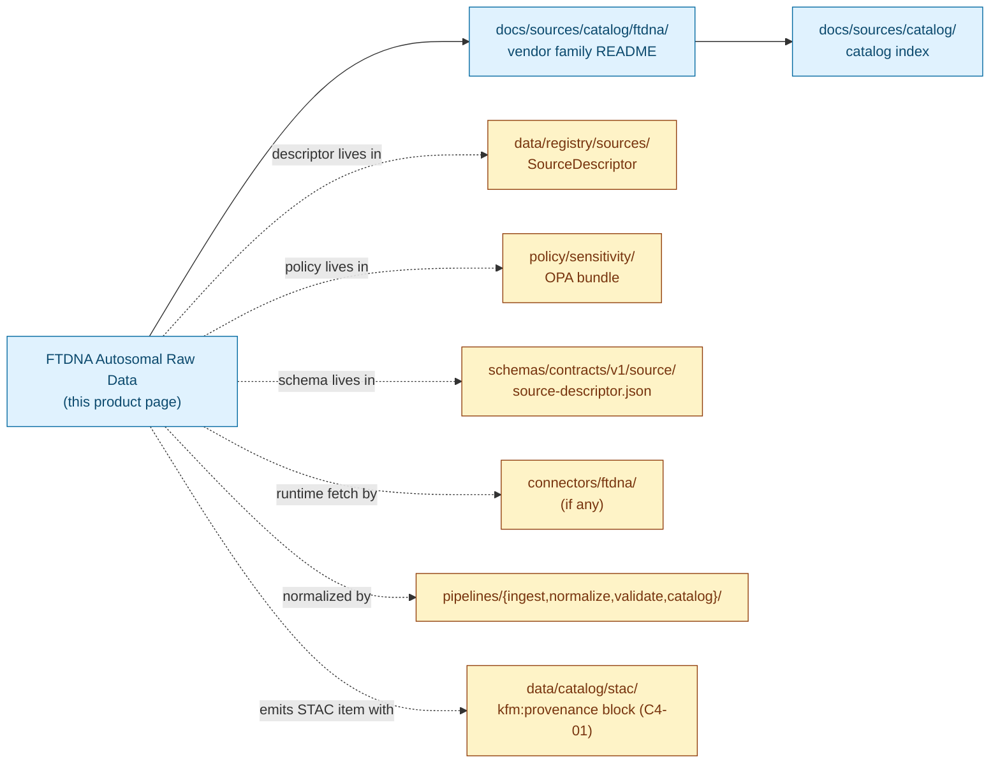

<!-- [KFM_META_BLOCK_V2]
doc_id: kfm://doc/docs-sources-catalog-ftdna-autosomal-raw-data
title: FTDNA Autosomal Raw Data
type: product-page
version: v0.2
status: draft
owners: <PLACEHOLDER — Docs steward + Source steward for ftdna + People/DNA/Land domain steward + Sensitivity reviewer>
created: 2026-05-20
updated: 2026-05-21
policy_label: public
related:
  - docs/sources/catalog/ftdna/README.md
  - docs/sources/catalog/ftdna/IDENTITY.md
  - docs/sources/catalog/ftdna/RIGHTS-AND-SENSITIVITY-MAP.md
  - docs/sources/catalog/ftdna/_examples/stac-item-example.json
  - docs/sources/catalog/README.md
  - docs/doctrine/directory-rules.md
  - docs/standards/SENSITIVITY_RUBRIC.md
  - docs/runbooks/revocation.md
tags: [kfm, docs, sources, catalog, ftdna, dtc, dna, autosomal, people-dna-land, t4]
notes:
  - "PROPOSED product-page scaffold; sibling-link presence verified in Claude Code session."
  - "FTDNA is not named in the KFM corpus (C9-03 names 23andMe, AncestryDNA, MyHeritage); FTDNA is treated as a structurally analogous DTC vendor."
  - "Autosomal raw data = tab-delimited genotype calls keyed by rsID per C9-03; HIGHEST-sensitivity DTC product (T4 default)."
  - "Product-specific facts (export-format version, file shape, cadence) are NEEDS VERIFICATION until inspected against a real export at admission."
  - "Type is `product-page` (not `standard`); this file does not carry full standard-doc obligations but does carry the full presentation standard."
[/KFM_META_BLOCK_V2] -->

# FTDNA Autosomal Raw Data

> Direct-to-consumer raw genotype / array call files; **denied by default at tier T4** per Atlas §24.5.2.

<p>
  
  
  
  
  
  
  
  
</p>

**Status:** PROPOSED — scaffold only · **Family:** [`ftdna`](./README.md) · **Catalog index:** [`../README.md`](../README.md) · **Last reviewed:** 2026-05-21

> [!CAUTION]
> **This product is T4 by default.** Per Atlas §24.5.2 (CONFIRMED), raw DNA segment / genotype data is **Denied** — no transform releases it to a public tier; T3 only under explicit named research agreement. Per `C9-03` (CONFIRMED), DTC raw files are tab-delimited genotype calls keyed by rsID and live only in encrypted storage with strict access scoping. **Nothing in this file authorizes ingestion or publication.**

---

## Quick Jump

- [Overview](#overview)
- [Catalog relationships](#catalog-relationships)
- [Source authority](#source-authority)
- [Catalog profiles used](#catalog-profiles-used)
- [Collection identity](#collection-identity)
- [Provenance fields](#provenance-fields)
- [Temporal handling](#temporal-handling)
- [Geometry and projection](#geometry-and-projection)
- [Rights and sensitivity](#rights-and-sensitivity)
- [Validation and catalog closure](#validation-and-catalog-closure)
- [Related contracts and schemas](#related-contracts-and-schemas)
- [Related connectors and pipelines](#related-connectors-and-pipelines)
- [Examples](#examples)
- [Open questions](#open-questions)

---

## Overview

This page describes the **FTDNA autosomal raw data product** as a *catalog target*: what it is, which catalog profiles it serves, what the STAC shape looks like, and which gates it crosses. It is a **scaffold**, not a steady-state product page; product-specific operational facts (export-format version, file shape, asset roles, cadence, current endpoint URL) are **NEEDS VERIFICATION** until inspected against a real export at admission time.

**What it is** (CONFIRMED doctrine, applied by analogy). Per `C9-03` (CONFIRMED for 23andMe / AncestryDNA / MyHeritage; **INFERRED** for FTDNA as a structurally analogous DTC vendor): the autosomal raw export is a **tab-delimited genotype-call file keyed by rsID**, representing array-level SNP calls across the autosomes. It is a **high-sensitivity asset** (Pass-10 sensitivity rubric 4 or 5 per `C6-01`).

**What this page is not.**

- **Not a SourceDescriptor.** See [`data/registry/sources/`](../../../../data/registry/sources/) for the authoritative descriptor.
- **Not a policy.** See [`policy/sensitivity/`](../../../../policy/sensitivity/) and [`RIGHTS-AND-SENSITIVITY-MAP.md`](./RIGHTS-AND-SENSITIVITY-MAP.md).
- **Not a schema.** See [`schemas/contracts/v1/source/`](../../../../schemas/contracts/v1/source/) per ADR-0001.
- **Not an admission decision.** Admission requires a completed SourceDescriptor, rights resolution, sensitivity tagging, consent stack, and reviewer sign-off.

> [!IMPORTANT]
> **PROPOSED scope.** *(NEEDS VERIFICATION at admission)*: scope, cadence, geographic coverage, current endpoint URL, rights status, license terms, retention window, export-format version pin.

[↑ Back to top](#ftdna-autosomal-raw-data)

---

## Catalog relationships



> [!NOTE]
> Diagram structure (solid edges = doc-to-doc; dashed edges = doc-to-non-doc reference) is grounded in Directory Rules §6 placement law (CONFIRMED). Paths inside the diagram are **PROPOSED** and **NEEDS VERIFICATION** against the mounted repo. Per Directory Rules §13, machine artifacts (`data/registry/`, `policy/`, `schemas/`, `connectors/`, `pipelines/`, `data/catalog/`) **never** live under `docs/`; this page only *references* them.

[↑ Back to top](#ftdna-autosomal-raw-data)

---

## Source authority

See [`data/registry/sources/`](../../../../data/registry/sources/) for the authoritative `SourceDescriptor`. **Do not duplicate descriptor fields here.**

| Cross-reference | Path *(PROPOSED unless stated)* | Authority |
|---|---|---|
| SourceDescriptor (machine) | `data/registry/sources/ftdna/...` | **Canonical** (Directory Rules §13.1) |
| SourceDescriptor schema | `schemas/contracts/v1/source/source-descriptor.json` | **Canonical** per ADR-0001 (Directory Rules §0, CONFIRMED authority) |
| Source steward register | `control_plane/source_authority_register.yaml` | **PROPOSED** (referenced by Encyclopedia §8) |
| Vendor README | [`./README.md`](./README.md) | Sibling — INFERRED present from prior session note |
| Catalog README | [`../README.md`](../README.md) | Parent — INFERRED present from prior session note |

> [!NOTE]
> **PROPOSED `source_role`** at admission: `candidate` (Atlas §24.1.3 enum). Promotion to `observation` requires gate clearance and a rights-holder review — `source_role` is **fixed at admission and never upgraded by promotion** (Doctrine Synthesis §29.3, CONFIRMED anti-pattern).

[↑ Back to top](#ftdna-autosomal-raw-data)

---

## Catalog profiles used

Per Pass-10 `C4` (CONFIRMED doctrine), every promoted dataset must have a STAC Item or Collection (spatiotemporal assets), a DCAT entry (catalog-level metadata), and a PROV record (lineage), with the evidence-bundle JSON-LD attached as a content-addressed asset.

| Profile | Lane *(PROPOSED paths per Directory Rules §13.1)* | Used by this product? | Truth label |
|---|---|---|---|
| **STAC** (with `kfm:provenance`, `C4-01`) | `data/catalog/stac/people-dna-land/ftdna/...` | **PROPOSED — Yes** | Item shape grounded in `C4-01` (CONFIRMED); per-product item presence NEEDS VERIFICATION |
| **DCAT** (`C4-05`) | `data/catalog/dcat/people-dna-land/...` | PROPOSED — Yes / No (NEEDS VERIFICATION) | Required for catalog-level discoverability |
| **PROV-O** | `data/catalog/prov/...` | PROPOSED — Yes / No (NEEDS VERIFICATION) | Required for lineage projection |
| **Domain projection** | `data/catalog/domain/people-dna-land/...` | PROPOSED — Yes / No (NEEDS VERIFICATION) | Per `KFM-P1-IDEA-0069` "domain lanes as proof-bearing slices" |
| **CARE extension** (`kfm:care`, `C15-02`) | (extension namespace in DCAT / STAC) | **PROPOSED — TBD** | Applicability depends on consent posture for the data subject; flag for review |

> [!WARNING]
> **No public STAC publication of raw genotype.** Per `C9-03` (CONFIRMED): "raw genotype data is never republished, only aggregate or k-anonymized derived data crosses the publication boundary." Any STAC Item for an FTDNA autosomal raw asset MUST point to a **non-public** catalog lane (reviewer-only) or be suppressed entirely — even style-only hiding fails the sensitivity test (Doctrine Synthesis §30, CONFIRMED).

[↑ Back to top](#ftdna-autosomal-raw-data)

---

## Collection identity

- **PROPOSED Collection id pattern:** `kfm-ftdna-autosomal-raw` (vendor-product slug; see [`./IDENTITY.md`](./IDENTITY.md) for the canonical pattern).
- **PROPOSED namespace:** `kfm:` *(see OPEN-DSC-03 — the `kfm:` vs `ks-kfm:` choice remains open per `C4-01` open question, CONFIRMED).*
- **Asset roles:** NEEDS VERIFICATION — confirm against [`schemas/contracts/v1/source/`](../../../../schemas/contracts/v1/source/). At minimum: `data` (the raw call file), `metadata` (any vendor-supplied sidecar), `checksum` (per-asset `file:checksum`).

[↑ Back to top](#ftdna-autosomal-raw-data)

---

## Provenance fields

STAC `properties.kfm:provenance` block (CONFIRMED shape per `C4-01`; PROPOSED for FTDNA scope):

| Field | Type | Purpose |
|---|---|---|
| `spec_hash` | string (sha256) | Canonical-record hash via JCS (RFC 8785); identity of this record |
| `evidence_bundle_ref` | `kfm://evidence/<digest>` | Resolves to the JSON-LD EvidenceBundle for this item (CONFIRMED `C4-04`) |
| `run_record_ref` | `kfm://run/<run-id>` | Points at the RunReceipt that produced this item |
| `audit_ref` | `kfm://audit/<attestation-id>` | SLSA / OPA attestation pointer |
| `policy_digest` | string (sha256) | Hash of the policy bundle in force at promotion |

**Per-asset integrity** (CONFIRMED `C4-01`): `file:checksum` on every asset (STAC file extension).

**Optional fields** for this product class *(PROPOSED)*:

- `kfm:source_role` — `candidate` at admission; `observation` only after gate clearance (Atlas §24.1.3).
- `kfm:export_format_version` — vendor export format version pinned per `C9-03` expansion direction ("the parser must be versioned and the receipt must record the export format version" — CONFIRMED).
- `kfm:consent_token_ref` — pointer to the GA4GH-DUO-coded consent receipt (`C6-07` + `C9-04`, CONFIRMED).

> [!IMPORTANT]
> **EvidenceRef must resolve.** A STAC item whose `evidence_bundle_ref` does not resolve to a complete EvidenceBundle is a **catalog-closure failure** per `KFM-P1-IDEA-0020` (CONFIRMED doctrine); promotion fails closed.

[↑ Back to top](#ftdna-autosomal-raw-data)

---

## Temporal handling

PROPOSED — distinct **source / observed / valid / retrieval / release / correction** times where material (Atlas §E temporal-handling rule, **CONFIRMED**: "source, observed, valid, retrieval, release, and correction times stay distinct where material").

| Time concept | Likely value for this product | Truth label |
|---|---|---|
| Source time | Vendor's reported genotyping run date | PROPOSED — vendor-dependent; NEEDS VERIFICATION |
| Observed time | n/a (genotype is a static array reading, not an event observation) | INFERRED |
| Valid time | Lifetime of the data subject's underlying genome (effectively indefinite) | INFERRED |
| Retrieval time | Timestamp of the user-initiated export | PROPOSED — must be recorded in run receipt |
| Release time | Timestamp of any derivative crossing a publication boundary | PROPOSED |
| Correction time | Timestamp of any post-release correction or revocation | PROPOSED |

[↑ Back to top](#ftdna-autosomal-raw-data)

---

## Geometry and projection

PROPOSED — autosomal raw genotype data has **no inherent geographic geometry**. Any spatial annotation (e.g., "data subject's reported residence") is a separate attribute that lives in a **different object family** (PersonAssertion, ResidenceEvent) and is subject to its own tier rules — never merged with the genotype payload.

| Concern | Default for this product | Truth label |
|---|---|---|
| CRS | n/a — no geometry on the raw asset | INFERRED |
| `proj:code` / `proj:bbox` / `proj:geometry` | Omitted, or set to a non-spatial sentinel per KFM front-matter convention | NEEDS VERIFICATION against `KFM-P27-FEAT-0003` STAC Projection lint and `KFM-P27-IDEA-0009` projection front-matter gate |
| Generalization rules | n/a for raw genotype | INFERRED |
| Living-person-residence join | **Denied by default** (Atlas §24.5.2 — "private person-parcel join" is T4) | CONFIRMED doctrine |

[↑ Back to top](#ftdna-autosomal-raw-data)

---

## Rights and sensitivity

NEEDS VERIFICATION — see [`policy/sensitivity/`](../../../../policy/sensitivity/) and [`./RIGHTS-AND-SENSITIVITY-MAP.md`](./RIGHTS-AND-SENSITIVITY-MAP.md). **Do not restate policy here.**

| Concern | Default for this product | Citation |
|---|---|---|
| Sensitivity tier | **T4 — Denied** | Atlas §24.5.2 (CONFIRMED) |
| Allowed transforms to T1 | Aggregate-only derivatives, after AggregationReceipt + k-anonymity (`C6-06`) + DP (`C6-05`) | CONFIRMED `C9-03` |
| Allowed transforms to T0 | None for the raw asset | CONFIRMED Atlas §24.5.2 |
| Consent model | User-controlled export + GA4GH DUO-coded consent receipt | CONFIRMED `C6-07` + `C9-04` |
| Revocation model | Tombstone (`C5-09`) + cache invalidation (`C6-08`) | CONFIRMED |
| Vendor-risk watchlist | Yes — FTDNA on watchlist by analogy with `C9-07` reference incident | INFERRED |
| CARE applicability | Open — see `RIGHTS-AND-SENSITIVITY-MAP.md` | NEEDS VERIFICATION (`C15-01` MetaBlock v2 fields) |

> [!CAUTION]
> **No tier upgrade without paired artifacts.** Atlas §24.5.3 (CONFIRMED): a tier upgrade toward more public always requires *both* a transform receipt **and** a ReviewRecord. Any FTDNA-autosomal-derived artifact lacking both MUST remain at its default tier.

[↑ Back to top](#ftdna-autosomal-raw-data)

---

## Validation and catalog closure

Catalog closure is the final discoverability and accountability gate before publication (`KFM-P1-IDEA-0020`, CONFIRMED). The checks below apply specifically to STAC items emitted for this product.

- **Catalog closure** before public release (`KFM-P1-IDEA-0020`). PROPOSED for FTDNA scope; requires EvidenceRef resolution, source-role check, policy-decision capture, ReleaseManifest pointer, and rollback target.
- **STAC Projection lint** (`KFM-P27-FEAT-0003`). PROPOSED — for this product the lint should expect *absent* projection fields (no geometry) rather than fail; see Geometry and projection above.
- **STAC checksum closure** against the ReleaseManifest digest (`KFM-P22-PROG-0037`). PROPOSED.
- **No-public-raw-path** gate (Master MapLibre §M, CONFIRMED anti-pattern catalog): the raw asset MUST NOT be reachable via the public CDN, governed API, or any MapLibre style.
- **No-style-only-hiding** check: any sensitive asset hidden only via MapLibre opacity / layer visibility fails sensitivity-test review (Doctrine Synthesis §30, CONFIRMED).
- **TOS-watcher freshness** (`KFM-P19-PROG-0024`, CONFIRMED carry-forward). PROPOSED — FTDNA's TOS / privacy / change-log / export pages SHOULD be polled with ETag / Last-Modified before any new admission.

[↑ Back to top](#ftdna-autosomal-raw-data)

---

## Related contracts and schemas

- [`contracts/source/`](../../../../contracts/source/) — semantic meaning for source-class objects (NEEDS VERIFICATION; Directory Rules §6.3, CONFIRMED authority).
- [`schemas/contracts/v1/source/source-descriptor.json`](../../../../schemas/contracts/v1/source/source-descriptor.json) — machine shape per ADR-0001 (NEEDS VERIFICATION).
- [`schemas/contracts/v1/receipts/`](../../../../schemas/contracts/v1/receipts/) — receipt schemas (RawCaptureReceipt, TransformReceipt, RedactionReceipt, AggregationReceipt, ReleaseManifest, etc.) — PROPOSED per Atlas §24.2.1; presence NEEDS VERIFICATION.
- [`schemas/contracts/v1/evidence/evidence_bundle.schema.json`](../../../../schemas/contracts/v1/evidence/evidence_bundle.schema.json) — PROPOSED per `KFM-P26-PROG-0004`.

[↑ Back to top](#ftdna-autosomal-raw-data)

---

## Related connectors and pipelines

- [`connectors/ftdna/`](../../../../connectors/ftdna/) — source-specific fetch / admission logic (Directory Rules §7.3, CONFIRMED).
  - **Posture:** PROPOSED quarantine-only intake — connectors MUST NOT pull DTC payloads on behalf of users without an attested per-user grant. NEEDS VERIFICATION at admission.
- [`pipelines/ingest/`](../../../../pipelines/ingest/), [`pipelines/normalize/`](../../../../pipelines/normalize/), [`pipelines/validate/`](../../../../pipelines/validate/), [`pipelines/catalog/`](../../../../pipelines/catalog/) — lifecycle phase pipelines (Directory Rules §7.4, CONFIRMED).
- [`pipeline_specs/people-dna-land/`](../../../../pipeline_specs/people-dna-land/) — declarative specs for the People/DNA/Land domain lane (Directory Rules §13.1, CONFIRMED domain-lane skeleton).

[↑ Back to top](#ftdna-autosomal-raw-data)

---

## Examples

*Illustrative only — do not treat as authoritative. Field values are placeholders.*

See [`./_examples/stac-item-example.json`](./_examples/stac-item-example.json) for the canonical minimal shape. The fragment below shows the key `properties` block grounded in `C4-01` (CONFIRMED).

<details>
<summary><strong>Minimal STAC Item <code>properties</code> fragment (illustrative, click to expand)</strong></summary>

```json
{
  "type": "Feature",
  "stac_version": "1.0.0",
  "id": "<TBD-item-id>",
  "collection": "kfm-ftdna-autosomal-raw",
  "properties": {
    "datetime": null,
    "start_datetime": "<retrieval_time>",
    "end_datetime": "<retrieval_time>",
    "kfm:source_role": "candidate",
    "kfm:export_format_version": "<NEEDS VERIFICATION at admission>",
    "kfm:provenance": {
      "spec_hash": "sha256:<TBD>",
      "evidence_bundle_ref": "kfm://evidence/<digest>",
      "run_record_ref": "kfm://run/<run-id>",
      "audit_ref": "kfm://audit/<attestation-id>",
      "policy_digest": "sha256:<TBD>"
    }
  },
  "assets": {
    "data": {
      "href": "<NON-PUBLIC reviewer-only URI>",
      "type": "text/tab-separated-values",
      "roles": ["data"],
      "file:checksum": "1220<sha256-bytes>"
    }
  },
  "links": [
    { "rel": "self",    "href": "./item.json" },
    { "rel": "parent",  "href": "../collection.json" },
    { "rel": "evidence", "href": "kfm://evidence/<digest>", "type": "application/ld+json" }
  ]
}
```

</details>

> [!NOTE]
> The example uses `null` for top-level `datetime` and a `start_datetime`/`end_datetime` pair set to the retrieval timestamp — the autosomal genotype has no event observation time. The `data` asset `href` is a placeholder for a **non-public** reviewer-only URI; the public catalog path MUST NOT expose the raw call file. Shape PROPOSED; NEEDS VERIFICATION against the mounted STAC linter.

[↑ Back to top](#ftdna-autosomal-raw-data)

---

## Open questions

- **OPEN-DSC-03** — `kfm:` vs `ks-kfm:` namespace choice. CONFIRMED open per `C4-01` corpus open question; resolution belongs in an ADR.
- **Cadence and current endpoint URL.** OPEN — vendor-dependent; record in SourceDescriptor at admission.
- **Rights status and CARE applicability.** OPEN — see `./RIGHTS-AND-SENSITIVITY-MAP.md`. CARE applicability is a curatorial judgment (`C15-01` expansion direction, CONFIRMED).
- **Collection scoping.** OPEN — does this product warrant its own STAC Collection, or share a Collection with sibling FTDNA products (Y-DNA, mtDNA, match list)? Recommend its own Collection because the tier and consent semantics are identical only within this product.
- **Retention window.** OPEN — solvent-vs-distressed retention is a `C9-03` open question; align with `docs/runbooks/revocation.md` *(PROPOSED)*.
- **Tombstone-vs-erasure boundary.** OPEN — `C5-09` open question; jurisdictional rules may require physical erasure rather than tombstoning for DTC raw genotype.
- **TOS-watcher coverage.** OPEN — confirm FTDNA is on the `KFM-P19-PROG-0024` watcher target list; cadence not yet specified by corpus.
- **Export-format compatibility matrix.** OPEN — `C9-03` expansion direction calls for a versioned DTC-format compatibility matrix; FTDNA's export format(s) MUST be pinned in the run receipt.

[↑ Back to top](#ftdna-autosomal-raw-data)

---

## Related docs

- [`./README.md`](./README.md) — FTDNA vendor family README
- [`./IDENTITY.md`](./IDENTITY.md) — collection-id pattern and namespace doctrine
- [`./RIGHTS-AND-SENSITIVITY-MAP.md`](./RIGHTS-AND-SENSITIVITY-MAP.md) — product-by-product rights and sensitivity map
- [`./_examples/stac-item-example.json`](./_examples/stac-item-example.json) — canonical minimal STAC shape
- [`../README.md`](../README.md) — catalog index
- [`../../../doctrine/directory-rules.md`](../../../doctrine/directory-rules.md) — placement and lifecycle invariants
- [`../../../standards/SENSITIVITY_RUBRIC.md`](../../../standards/SENSITIVITY_RUBRIC.md) — `C6-01` 0–5 rubric *(PROPOSED in corpus; not yet authored)*
- [`../../../runbooks/revocation.md`](../../../runbooks/revocation.md) — tombstone + embargo + cache-invalidation runbook *(PROPOSED — referenced in `C5-09` / `C6-08`)*

---

<sub>Last updated: 2026-05-21 *(Claude Code product-page scaffold session)* · Status: PROPOSED scaffold (v0.2) · Owners: <PLACEHOLDER — Docs steward + Source steward for ftdna + People/DNA/Land domain steward + Sensitivity reviewer></sub>

<p align="right"><a href="#ftdna-autosomal-raw-data">↑ Back to top</a></p>
