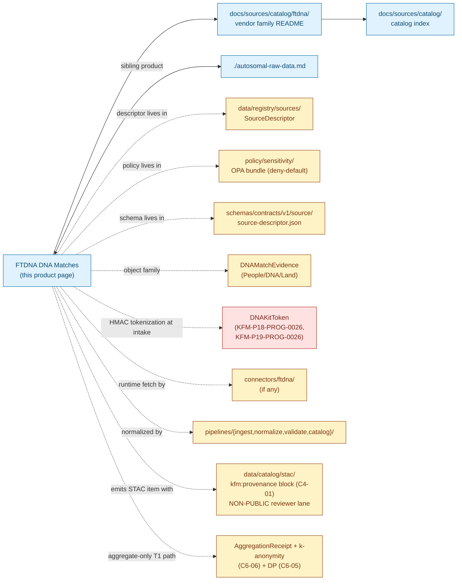

<!-- [KFM_META_BLOCK_V2]
doc_id: kfm://doc/docs-sources-catalog-ftdna-dna-matches
title: FTDNA DNA Matches
type: product-page
version: v0.2
status: draft
owners: <PLACEHOLDER — Docs steward + Source steward for ftdna + People/DNA/Land domain steward + Sensitivity reviewer + Rights-holder representative>
created: 2026-05-20
updated: 2026-05-21
policy_label: public
related:
  - docs/sources/catalog/ftdna/README.md
  - docs/sources/catalog/ftdna/autosomal-raw-data.md
  - docs/sources/catalog/ftdna/IDENTITY.md
  - docs/sources/catalog/ftdna/RIGHTS-AND-SENSITIVITY-MAP.md
  - docs/sources/catalog/ftdna/_examples/stac-item-example.json
  - docs/sources/catalog/README.md
  - docs/doctrine/directory-rules.md
  - docs/standards/SENSITIVITY_RUBRIC.md
  - docs/runbooks/revocation.md
tags: [kfm, docs, sources, catalog, ftdna, dtc, dna, matches, kit-to-kit, people-dna-land, t4, third-party]
notes:
  - "PROPOSED product-page scaffold; sibling-link presence verified in Claude Code session."
  - "FTDNA is not named in the KFM corpus (C9-03 names 23andMe, AncestryDNA, MyHeritage); FTDNA is treated as a structurally analogous DTC vendor."
  - "Maps to the DNAMatchEvidence object family (Atlas §B; CONFIRMED term in Atlas §24.5.2 / People-DNA-Land domain glossary)."
  - "CRITICAL: match-list records implicate THIRD PARTIES (people the uploader matches), not just the uploader. KFM cannot collect upstream consent from those third parties; HMAC tokenization at intake is therefore mandatory (PROPOSED, per KFM-P18-PROG-0026 + KFM-P19-PROG-0026)."
  - "Type is `product-page` (not `standard`); this file carries the full presentation standard but is intentionally a scaffold, not steady-state."
[/KFM_META_BLOCK_V2] -->

# FTDNA DNA Matches

> Kit-to-kit DNA match lists; **denied by default at tier T4** per Atlas §24.5.2. Match-list records implicate third parties — read §[Third-party data exposure](#third-party-data-exposure) before any admission planning.

<p>
  
  
  
  
  
  
  
  
  
  
</p>

**Status:** PROPOSED — scaffold only · **Family:** [`ftdna`](./README.md) · **Catalog index:** [`../README.md`](../README.md) · **Sibling product:** [Autosomal Raw Data](./autosomal-raw-data.md) · **Last reviewed:** 2026-05-21

> [!CAUTION]
> **Third-party data exposure is the defining sensitivity issue for this product.** A match list is *not* a record about the uploader alone; each row identifies **another person** (kit ID, possibly displayed name, predicted relationship, shared centimorgans, longest segment). KFM cannot obtain upstream consent from those third parties — they consented to the vendor's match service, not to KFM ingestion. Per Atlas §24.5.2 (CONFIRMED) the default tier is **T4 — Denied**. Aggregate-only derivatives may move to T1 *after* AggregationReceipt + k-anonymity (`C6-06`); identifiable joins to living persons remain T4.

---

## Quick Jump

- [Overview](#overview)
- [Third-party data exposure](#third-party-data-exposure)
- [Catalog relationships](#catalog-relationships)
- [Source authority](#source-authority)
- [Catalog profiles used](#catalog-profiles-used)
- [Collection identity](#collection-identity)
- [Provenance fields](#provenance-fields)
- [Temporal handling](#temporal-handling)
- [Geometry and projection](#geometry-and-projection)
- [Rights and sensitivity](#rights-and-sensitivity)
- [Validation and catalog closure](#validation-and-catalog-closure)
- [Related contracts and schemas](#related-contracts-and-schemas)
- [Related connectors and pipelines](#related-connectors-and-pipelines)
- [Examples](#examples)
- [Open questions](#open-questions)

---

## Overview

This page describes the **FTDNA DNA Matches product** — the kit-to-kit similarity list a user receives from their FTDNA account — as a *catalog target*: what it is, which catalog profiles it serves, what the STAC shape looks like, and which gates it crosses. It is a **scaffold**, not a steady-state product page; product-specific operational facts (export-format version, file shape, asset roles, cadence, current endpoint URL, retention window) are **NEEDS VERIFICATION** until inspected against a real export at admission.

**What it is** (CONFIRMED doctrine, applied by analogy). The match-list product maps to the **`DNAMatchEvidence`** object family (Atlas §B, CONFIRMED term inside People/DNA/Land). Per `C9-03` (CONFIRMED for 23andMe / AncestryDNA / MyHeritage; **INFERRED** for FTDNA as a structurally analogous DTC vendor), derived data from DTC inputs — including relatedness coefficients and IBD-segment-count summaries — can be released only when k-anonymity is satisfied for living individuals (`C6-06`, CONFIRMED) and only under a documented consent scope. Differential privacy (`C6-05`, CONFIRMED) applies to aggregate statistics that cross the publication boundary.

**What this page is not.**

- **Not a SourceDescriptor.** See [`data/registry/sources/`](../../../../data/registry/sources/) for the authoritative descriptor.
- **Not a policy.** See [`policy/sensitivity/`](../../../../policy/sensitivity/) and [`RIGHTS-AND-SENSITIVITY-MAP.md`](./RIGHTS-AND-SENSITIVITY-MAP.md).
- **Not a schema.** See [`schemas/contracts/v1/source/`](../../../../schemas/contracts/v1/source/) per ADR-0001.
- **Not an admission decision.** Admission requires a completed SourceDescriptor, rights resolution, sensitivity tagging, consent stack (including third-party considerations), HMAC-tokenization of kit identifiers, and reviewer sign-off.

> [!IMPORTANT]
> **PROPOSED scope** *(NEEDS VERIFICATION at admission)*: export format version, file shape, asset roles, cadence (per-user on-demand vs vendor-pushed updates), geographic coverage (the matches themselves are global), current endpoint URL, rights status, license terms, retention window.

[↑ Back to top](#ftdna-dna-matches)

---

## Third-party data exposure

The defining feature of a DNA match list — and the reason it requires a **separate** product page from the uploader's own autosomal raw data — is that **each match-list row identifies a third party**. This is not a privacy edge case; it is the central feature of the product.

| Field typically present on a match row *(PROPOSED — vendor schema NEEDS VERIFICATION)* | Third-party implication |
|---|---|
| Match kit ID | Vendor's stable identifier for another data subject |
| Match displayed name | Often a real or partial real name of another person |
| Predicted relationship | An identifying inference about the relation between two living persons |
| Total shared centimorgans (cM) | A quantitative relatedness signal sufficient to re-identify in many cases |
| Longest shared segment (cM) | Additional re-identification signal |
| Shared matches / in-common-with | Network expansion — names *third* parties via their relationships with the match |
| Contact information *(if surfaced by vendor)* | Direct PII for another person |

> [!WARNING]
> **KFM has no upstream consent path for these third parties.** They consented to the vendor's match service, not to KFM ingestion. The corpus is unambiguous (`C9-03`, CONFIRMED) that raw DTC data lives only in encrypted storage with strict access scoping. For DNA Matches the **HMAC-tokenization rule** applies before any internal processing:
>
> - Per **`KFM-P18-PROG-0026`** (Client-side DNA salt and token model, CONFIRMED carry-forward) — *PROPOSED*: DNA-adjacent matching should use tenant-scoped client salt, HMAC person tokens, match tokens, detached signatures, and **no raw genotype at rest**.
> - Per **`KFM-P19-PROG-0026`** (Consent manifest HMAC kit token model, CONFIRMED carry-forward) — *PROPOSED*: kit identifiers should be HMAC-SHA256 over tenant salt, allowed export scopes, redistribution flag, issue/expiry times, and issuer signature.

**Operational consequence.** Plaintext match-kit IDs and plaintext display names from the FTDNA payload MUST NOT survive past the WORK phase — the normalization step replaces them with `DNAKitToken` (CONFIRMED term in Atlas §People/DNA/Land glossary) HMAC values keyed by tenant salt. Downstream, only the token is carried; reversal requires the salt, which lives under access control distinct from the catalog reader path.

[↑ Back to top](#ftdna-dna-matches)

---

## Catalog relationships



> [!NOTE]
> Diagram structure (solid edges = doc-to-doc; dashed edges = doc-to-non-doc reference) is grounded in Directory Rules §6 placement law (CONFIRMED). The red **HMAC tokenization** node is highlighted because, unlike autosomal raw data, the match-list product carries third-party identifiers that MUST be tokenized at intake. Paths inside the diagram are **PROPOSED** and **NEEDS VERIFICATION** against the mounted repo.

[↑ Back to top](#ftdna-dna-matches)

---

## Source authority

See [`data/registry/sources/`](../../../../data/registry/sources/) for the authoritative `SourceDescriptor`. **Do not duplicate descriptor fields here.**

| Cross-reference | Path *(PROPOSED unless stated)* | Authority |
|---|---|---|
| SourceDescriptor (machine) | `data/registry/sources/ftdna/...` | **Canonical** (Directory Rules §13.1) |
| SourceDescriptor schema | `schemas/contracts/v1/source/source-descriptor.json` | **Canonical** per ADR-0001 (Directory Rules §0, CONFIRMED authority) |
| Source steward register | `control_plane/source_authority_register.yaml` | **PROPOSED** (referenced by Encyclopedia §8) |
| Vendor README | [`./README.md`](./README.md) | Sibling — INFERRED present from prior session note |
| Sibling product page | [`./autosomal-raw-data.md`](./autosomal-raw-data.md) | Sibling — INFERRED present from prior session note |
| Catalog README | [`../README.md`](../README.md) | Parent — INFERRED present from prior session note |

> [!NOTE]
> **PROPOSED `source_role`** at admission: `candidate` (Atlas §24.1.3 enum). Match-list data should **never** be admitted at role `observed` — the matches are vendor-computed similarity inferences, not observed events. Per Doctrine Synthesis §29.3 (CONFIRMED anti-pattern): "Promotion that 'upgrades' a source role (modeled → observed)" is forbidden — `source_role` is **fixed at admission and never upgraded by promotion**.

[↑ Back to top](#ftdna-dna-matches)

---

## Catalog profiles used

Per Pass-10 `C4` (CONFIRMED doctrine), every promoted dataset must have a STAC Item or Collection (spatiotemporal assets), a DCAT entry (catalog-level metadata), and a PROV record (lineage), with the evidence-bundle JSON-LD attached as a content-addressed asset.

| Profile | Lane *(PROPOSED paths per Directory Rules §13.1)* | Used by this product? | Truth label |
|---|---|---|---|
| **STAC** (with `kfm:provenance`, `C4-01`) | `data/catalog/stac/people-dna-land/ftdna/matches/...` | **PROPOSED — Yes (reviewer-only lane)** | Item shape grounded in `C4-01` (CONFIRMED); per-product item presence NEEDS VERIFICATION |
| **DCAT** (`C4-05`) | `data/catalog/dcat/people-dna-land/...` | PROPOSED — Yes / No (NEEDS VERIFICATION) | Required for catalog-level discoverability |
| **PROV-O** | `data/catalog/prov/...` | PROPOSED — Yes / No (NEEDS VERIFICATION) | Required for lineage projection |
| **Domain projection** | `data/catalog/domain/people-dna-land/...` | PROPOSED — Yes / No (NEEDS VERIFICATION) | Per `KFM-P1-IDEA-0069` "domain lanes as proof-bearing slices" |
| **Aggregate-derivative STAC** (separate Item / Collection) | `data/catalog/stac/people-dna-land/aggregates/...` | **PROPOSED — Yes (T1 path only after gates)** | The *only* public-facing STAC route for this product class; requires AggregationReceipt + k-anonymity + DP |
| **CARE extension** (`kfm:care`, `C15-02`) | (extension namespace in DCAT / STAC) | **PROPOSED — TBD** | Applicability depends on consent posture; flag for review |

> [!WARNING]
> **No public STAC publication of the kit-list payload.** Per `C9-03` (CONFIRMED): "raw genotype data is never republished, only aggregate or k-anonymized derived data crosses the publication boundary." The same rule applies to **named match data** — only aggregate, k-anonymous derivatives may appear on a public path. The raw match-list STAC Item MUST point to a **non-public reviewer-only lane**, and style-only hiding fails the sensitivity test (Doctrine Synthesis §30, CONFIRMED).

[↑ Back to top](#ftdna-dna-matches)

---

## Collection identity

- **PROPOSED Collection id pattern:** `kfm-ftdna-dna-matches` (vendor-product slug; see [`./IDENTITY.md`](./IDENTITY.md) for the canonical pattern).
- **PROPOSED namespace:** `kfm:` *(see OPEN-DSC-03 — the `kfm:` vs `ks-kfm:` choice remains open per `C4-01` open question, CONFIRMED).*
- **PROPOSED aggregate-derivative Collection id pattern:** `kfm-ftdna-dna-matches-agg` *(separate Collection because the tier, consent semantics, and target audience differ — reviewer-only T4 vs aggregate-only T1).*
- **Asset roles:** NEEDS VERIFICATION — confirm against [`schemas/contracts/v1/source/`](../../../../schemas/contracts/v1/source/). At minimum: `data` (the tokenized match table), `metadata` (any vendor-supplied sidecar), `checksum` (per-asset `file:checksum`). **The plaintext match table MUST NOT appear as a STAC asset.**

[↑ Back to top](#ftdna-dna-matches)

---

## Provenance fields

STAC `properties.kfm:provenance` block (CONFIRMED shape per `C4-01`; PROPOSED for FTDNA DNA Matches scope):

| Field | Type | Purpose |
|---|---|---|
| `spec_hash` | string (sha256) | Canonical-record hash via JCS (RFC 8785); identity of this record |
| `evidence_bundle_ref` | `kfm://evidence/<digest>` | Resolves to the JSON-LD EvidenceBundle for this item (CONFIRMED `C4-04`) |
| `run_record_ref` | `kfm://run/<run-id>` | Points at the RunReceipt that produced this item |
| `audit_ref` | `kfm://audit/<attestation-id>` | SLSA / OPA attestation pointer |
| `policy_digest` | string (sha256) | Hash of the policy bundle in force at promotion |

**Per-asset integrity** (CONFIRMED `C4-01`): `file:checksum` on every asset (STAC file extension).

**Match-list-specific optional fields** *(PROPOSED)*:

- `kfm:source_role` — `candidate` at admission (Atlas §24.1.3); never `observed`.
- `kfm:object_family` — `DNAMatchEvidence` (Atlas §B, CONFIRMED term).
- `kfm:export_format_version` — vendor export format version pinned per `C9-03` expansion direction (CONFIRMED).
- `kfm:consent_token_ref` — pointer to the GA4GH-DUO-coded consent receipt of the **uploader** (`C6-07` + `C9-04`, CONFIRMED). Does not represent third-party consent.
- `kfm:third_party_token_scheme` — identifier of the HMAC scheme used to tokenize match kit identifiers (`KFM-P19-PROG-0026`, CONFIRMED carry-forward).
- `kfm:kit_token_salt_ref` — opaque reference to the salt used; the salt itself MUST NOT appear in the STAC item.
- `kfm:k_anonymity_k` *(aggregate items only)* — `k` value satisfied for the aggregate derivative (per `C6-06`, CONFIRMED).
- `kfm:dp_epsilon` *(aggregate items only)* — differential-privacy epsilon used (per `C6-05`, CONFIRMED).

> [!IMPORTANT]
> **EvidenceRef must resolve and the policy_digest must match the bundle in force.** A STAC item whose `evidence_bundle_ref` does not resolve, or whose `policy_digest` does not match a registered policy bundle, is a **catalog-closure failure** per `KFM-P1-IDEA-0020` (CONFIRMED doctrine); promotion fails closed.

[↑ Back to top](#ftdna-dna-matches)

---

## Temporal handling

PROPOSED — distinct **source / observed / valid / retrieval / release / correction** times where material (Atlas §E temporal-handling rule, **CONFIRMED**: "source, observed, valid, retrieval, release, and correction times stay distinct where material").

| Time concept | Likely value for this product | Truth label |
|---|---|---|
| Source time | Vendor's match-table computation timestamp (each refresh changes the match set) | PROPOSED — vendor-dependent; NEEDS VERIFICATION |
| Observed time | n/a (matches are vendor-computed similarity inferences, not observed events) | INFERRED |
| Valid time | Bounded by the vendor's match recomputation cadence — a match-table snapshot is point-in-time, not durable | INFERRED |
| Retrieval time | Timestamp of the user-initiated export | PROPOSED — must be recorded in run receipt |
| Release time | Timestamp of any aggregate derivative crossing a publication boundary | PROPOSED |
| Correction time | Timestamp of any post-release correction or revocation (including consent revocation or vendor data-breach response) | PROPOSED |

> [!NOTE]
> **A match-list snapshot ages.** New users joining the vendor's database expand each existing user's match list; a snapshot taken at `t0` does not represent the match set at `t1`. The catalog MUST record the snapshot timestamp and SHOULD record the vendor's most recent recomputation event when surfaced in the export.

[↑ Back to top](#ftdna-dna-matches)

---

## Geometry and projection

PROPOSED — DNA match data has **no inherent geographic geometry**. Any spatial annotation (e.g., a match's reported ancestral location, the uploader's reported residence) lives in a **different object family** (PersonAssertion, ResidenceEvent) and is subject to its own tier rules — never merged with the match payload.

| Concern | Default for this product | Truth label |
|---|---|---|
| CRS | n/a — no geometry on the raw asset | INFERRED |
| `proj:code` / `proj:bbox` / `proj:geometry` | Omitted, or set to a non-spatial sentinel per KFM front-matter convention | NEEDS VERIFICATION against `KFM-P27-FEAT-0003` STAC Projection lint and `KFM-P27-IDEA-0009` projection front-matter gate |
| Generalization rules | n/a for raw match list | INFERRED |
| Living-person-residence join | **Denied by default** (Atlas §24.5.2 — "private person-parcel join" is T4; living-person fields are T4) | CONFIRMED doctrine |
| Aggregate-derivative geometry | Permitted only at coarse aggregation units (county / state / decade) per `C6-04` grid generalization | PROPOSED |

[↑ Back to top](#ftdna-dna-matches)

---

## Rights and sensitivity

NEEDS VERIFICATION — see [`policy/sensitivity/`](../../../../policy/sensitivity/) and [`./RIGHTS-AND-SENSITIVITY-MAP.md`](./RIGHTS-AND-SENSITIVITY-MAP.md). **Do not restate policy here.**

| Concern | Default for this product | Citation |
|---|---|---|
| Sensitivity tier | **T4 — Denied** (DNAMatchEvidence per Atlas §24.5.2) | CONFIRMED |
| Allowed transforms to T1 | **Aggregate-only** derivatives, after AggregationReceipt + k-anonymity (`C6-06`) + DP (`C6-05`) | CONFIRMED `C9-03` + Atlas §24.5.2 |
| Allowed transforms to T0 | None for the raw match list; aggregates may move T1 → T0 only with ReleaseManifest + ReviewRecord | CONFIRMED Atlas §24.5.2/3 |
| Consent model (uploader) | User-controlled export + GA4GH DUO-coded consent receipt | CONFIRMED `C6-07` + `C9-04` |
| Consent model (third parties / matches) | **No upstream consent path exists.** HMAC tokenization at intake is required; matches are never published as identifiable | INFERRED from `KFM-P18-PROG-0026` + `KFM-P19-PROG-0026` (CONFIRMED carry-forwards) |
| Revocation model | Tombstone (`C5-09`) + cache invalidation (`C6-08`); revocation by the uploader cascades to all derivatives | CONFIRMED |
| Vendor-risk watchlist | Yes — FTDNA on watchlist by analogy with `C9-07` reference incident | INFERRED |
| CARE applicability | Open — see `RIGHTS-AND-SENSITIVITY-MAP.md` | NEEDS VERIFICATION (`C15-01` MetaBlock v2 fields) |

> [!CAUTION]
> **No tier upgrade without paired artifacts.** Atlas §24.5.3 (CONFIRMED): a tier upgrade toward more public always requires *both* a transform receipt **and** a ReviewRecord. For aggregate derivatives, paired artifacts MUST be AggregationReceipt **+** ReviewRecord; for redactions, RedactionReceipt **+** ReviewRecord. Any FTDNA-match-derived artifact lacking both MUST remain at its default tier.

[↑ Back to top](#ftdna-dna-matches)

---

## Validation and catalog closure

Catalog closure is the final discoverability and accountability gate before publication (`KFM-P1-IDEA-0020`, CONFIRMED). The checks below apply specifically to STAC items emitted for this product.

- **Catalog closure** before public release (`KFM-P1-IDEA-0020`, CONFIRMED). PROPOSED for FTDNA scope; requires EvidenceRef resolution, source-role check, policy-decision capture, ReleaseManifest pointer, and rollback target.
- **HMAC-tokenization gate** *(PROPOSED, this product)*. The validator MUST reject any candidate item whose `data` asset contains plaintext kit identifiers, plaintext displayed names, or any other unredacted third-party PII (`KFM-P18-PROG-0026` + `KFM-P19-PROG-0026`, CONFIRMED carry-forwards). Failure routes to QUARANTINE.
- **k-anonymity / DP gate** *(PROPOSED, aggregate items only)*. For any T1 aggregate derivative, the AggregationReceipt MUST record the `k` value satisfied (`C6-06`) and the DP epsilon used (`C6-05`); both CONFIRMED doctrine.
- **STAC Projection lint** (`KFM-P27-FEAT-0003`, CONFIRMED). PROPOSED — for this product the lint should expect *absent* projection fields on the raw item, and *coarse-aggregation* projection fields on derivative items.
- **STAC checksum closure** against the ReleaseManifest digest (`KFM-P22-PROG-0037`, CONFIRMED). PROPOSED.
- **No-public-raw-path** gate (Master MapLibre §M, CONFIRMED anti-pattern): the raw match-list asset MUST NOT be reachable via the public CDN, governed API, or any MapLibre style.
- **No-style-only-hiding** check: any sensitive asset hidden only via MapLibre opacity / layer visibility fails sensitivity-test review (Doctrine Synthesis §30, CONFIRMED).
- **TOS-watcher freshness** (`KFM-P19-PROG-0024`, CONFIRMED carry-forward). PROPOSED — FTDNA's TOS / privacy / change-log / export pages SHOULD be polled with ETag / Last-Modified before any new admission.
- **Salt-handling check** *(PROPOSED, this product)*. The validator MUST confirm the `kfm:kit_token_salt_ref` is an opaque reference, not the salt itself, and that the salt's storage path lies outside the catalog reader's access scope.

[↑ Back to top](#ftdna-dna-matches)

---

## Related contracts and schemas

- [`contracts/source/`](../../../../contracts/source/) — semantic meaning for source-class objects (NEEDS VERIFICATION; Directory Rules §6.3, CONFIRMED authority).
- [`contracts/people-dna-land/`](../../../../contracts/people-dna-land/) — domain contracts including `DNAMatchEvidence`, `DNAKitToken`, `ConsentGrant`, `RevocationReceipt` (CONFIRMED terms per Atlas People/DNA/Land glossary; file presence NEEDS VERIFICATION).
- [`schemas/contracts/v1/source/source-descriptor.json`](../../../../schemas/contracts/v1/source/source-descriptor.json) — machine shape per ADR-0001 (NEEDS VERIFICATION).
- [`schemas/contracts/v1/people-dna-land/dna-match-evidence.schema.json`](../../../../schemas/contracts/v1/people-dna-land/dna-match-evidence.schema.json) — PROPOSED; presence NEEDS VERIFICATION.
- [`schemas/contracts/v1/receipts/`](../../../../schemas/contracts/v1/receipts/) — receipt schemas (RawCaptureReceipt, TransformReceipt, RedactionReceipt, AggregationReceipt, ReleaseManifest, etc.) — PROPOSED per Atlas §24.2.1.
- [`schemas/contracts/v1/evidence/evidence_bundle.schema.json`](../../../../schemas/contracts/v1/evidence/evidence_bundle.schema.json) — PROPOSED per `KFM-P26-PROG-0004`.

[↑ Back to top](#ftdna-dna-matches)

---

## Related connectors and pipelines

- [`connectors/ftdna/`](../../../../connectors/ftdna/) — source-specific fetch / admission logic (Directory Rules §7.3, CONFIRMED).
  - **Posture:** PROPOSED quarantine-only intake. Connectors MUST NOT pull DTC payloads on behalf of users without an attested per-user grant. Additionally, the FTDNA match-list connector MUST apply HMAC tokenization at intake before the payload reaches `data/work/`.
- [`pipelines/ingest/`](../../../../pipelines/ingest/), [`pipelines/normalize/`](../../../../pipelines/normalize/), [`pipelines/validate/`](../../../../pipelines/validate/), [`pipelines/catalog/`](../../../../pipelines/catalog/) — lifecycle phase pipelines (Directory Rules §7.4, CONFIRMED).
- [`pipeline_specs/people-dna-land/`](../../../../pipeline_specs/people-dna-land/) — declarative specs for the People/DNA/Land domain lane (Directory Rules §13.1, CONFIRMED domain-lane skeleton).

[↑ Back to top](#ftdna-dna-matches)

---

## Examples

*Illustrative only — do not treat as authoritative. Field values are placeholders.*

See [`./_examples/stac-item-example.json`](./_examples/stac-item-example.json) for the canonical minimal shape. The fragment below shows the key `properties` block for a **raw (reviewer-only)** match-list item grounded in `C4-01` (CONFIRMED).

<details>
<summary><strong>Minimal STAC Item <code>properties</code> fragment — raw match list (reviewer-only, click to expand)</strong></summary>

```json
{
  "type": "Feature",
  "stac_version": "1.0.0",
  "id": "<TBD-item-id>",
  "collection": "kfm-ftdna-dna-matches",
  "properties": {
    "datetime": "<source_time-or-retrieval_time>",
    "kfm:source_role": "candidate",
    "kfm:object_family": "DNAMatchEvidence",
    "kfm:export_format_version": "<NEEDS VERIFICATION at admission>",
    "kfm:third_party_token_scheme": "hmac-sha256-tenant-salt-v1",
    "kfm:kit_token_salt_ref": "kfm://salt/<opaque-ref>",
    "kfm:provenance": {
      "spec_hash": "sha256:<TBD>",
      "evidence_bundle_ref": "kfm://evidence/<digest>",
      "run_record_ref": "kfm://run/<run-id>",
      "audit_ref": "kfm://audit/<attestation-id>",
      "policy_digest": "sha256:<TBD>"
    }
  },
  "assets": {
    "data": {
      "href": "<NON-PUBLIC reviewer-only URI to tokenized match table>",
      "type": "application/x-ndjson",
      "roles": ["data"],
      "file:checksum": "1220<sha256-bytes>"
    }
  },
  "links": [
    { "rel": "self",     "href": "./item.json" },
    { "rel": "parent",   "href": "../collection.json" },
    { "rel": "evidence", "href": "kfm://evidence/<digest>", "type": "application/ld+json" }
  ]
}
```

</details>

<details>
<summary><strong>Aggregate-derivative STAC Item <code>properties</code> fragment — T1 candidate (click to expand)</strong></summary>

```json
{
  "type": "Feature",
  "stac_version": "1.0.0",
  "id": "<TBD-aggregate-item-id>",
  "collection": "kfm-ftdna-dna-matches-agg",
  "properties": {
    "datetime": "<aggregation_release_time>",
    "kfm:source_role": "aggregate",
    "kfm:object_family": "DNAMatchEvidence",
    "kfm:k_anonymity_k": "<k-value-as-integer; NEEDS VERIFICATION against C6-06 default>",
    "kfm:dp_epsilon": "<epsilon-as-float; NEEDS VERIFICATION against C6-05 default>",
    "kfm:aggregation_unit": "<county|state|decade>",
    "kfm:provenance": {
      "spec_hash": "sha256:<TBD>",
      "evidence_bundle_ref": "kfm://evidence/<digest>",
      "run_record_ref": "kfm://run/<run-id>",
      "audit_ref": "kfm://audit/<attestation-id>",
      "policy_digest": "sha256:<TBD>"
    }
  },
  "assets": {
    "data": {
      "href": "<governed-API-URI for the aggregate>",
      "type": "application/geo+json",
      "roles": ["data"],
      "file:checksum": "1220<sha256-bytes>"
    }
  }
}
```

</details>

> [!NOTE]
> The raw item uses an explicit `datetime` (snapshot timestamp) because the match table is a point-in-time computation, unlike the autosomal raw genotype which has no event observation time. The aggregate-item example uses `kfm:source_role: "aggregate"` per Atlas §24.1.3 (CONFIRMED enum), and adds required `role_aggregation_unit` semantics ("Prevents geometry-scope drift on join"). Shapes PROPOSED; NEEDS VERIFICATION against the mounted STAC linter.

[↑ Back to top](#ftdna-dna-matches)

---

## Open questions

- **OPEN-DSC-03** — `kfm:` vs `ks-kfm:` namespace choice. CONFIRMED open per `C4-01` corpus open question; resolution belongs in an ADR.
- **Cadence and current endpoint URL.** OPEN — vendor-dependent; record in SourceDescriptor at admission.
- **Match-table recomputation event surfacing.** OPEN — does FTDNA expose the timestamp of the vendor's last match recomputation in the export? If so, capture it as `source_time`; if not, treat `retrieval_time` as the upper bound.
- **Rights status and CARE applicability.** OPEN — see `./RIGHTS-AND-SENSITIVITY-MAP.md`. CARE applicability is a curatorial judgment (`C15-01` expansion direction, CONFIRMED).
- **Collection scoping.** OPEN — this scaffold proposes **two** Collections (`kfm-ftdna-dna-matches` for the reviewer-only raw item, `kfm-ftdna-dna-matches-agg` for the T1 aggregate path). Confirm in `./IDENTITY.md`.
- **k and epsilon defaults.** OPEN — `C6-06` expansion direction calls for *"per-class k thresholds"* and `C6-05` calls for a *"default epsilon table"*; neither is finalized in the corpus for DNAMatchEvidence specifically. Resolve before any T1 aggregate release.
- **Retention window.** OPEN — solvent-vs-distressed retention is a `C9-03` open question; align with `docs/runbooks/revocation.md` *(PROPOSED)*.
- **Tombstone-vs-erasure boundary.** OPEN — `C5-09` open question; jurisdictional rules may require physical erasure rather than tombstoning for DTC match data, especially given the third-party implications.
- **Third-party notification policy.** OPEN — when the uploader revokes consent, does KFM need to do anything for the third parties whose tokens were derived from that match list? The corpus does not address this directly; recommend ADR.
- **Salt rotation policy.** OPEN — when (if ever) does KFM rotate `kfm:kit_token_salt_ref`? Rotation invalidates downstream joins but limits long-tail re-identification risk.
- **TOS-watcher coverage.** OPEN — confirm FTDNA is on the `KFM-P19-PROG-0024` watcher target list.
- **Export-format compatibility matrix.** OPEN — `C9-03` expansion direction calls for a versioned DTC-format compatibility matrix; FTDNA's match-list export format MUST be pinned in the run receipt.

[↑ Back to top](#ftdna-dna-matches)

---

## Related docs

- [`./README.md`](./README.md) — FTDNA vendor family README
- [`./autosomal-raw-data.md`](./autosomal-raw-data.md) — sibling product page (autosomal raw genotype)
- [`./IDENTITY.md`](./IDENTITY.md) — collection-id pattern and namespace doctrine
- [`./RIGHTS-AND-SENSITIVITY-MAP.md`](./RIGHTS-AND-SENSITIVITY-MAP.md) — product-by-product rights and sensitivity map
- [`./_examples/stac-item-example.json`](./_examples/stac-item-example.json) — canonical minimal STAC shape
- [`../README.md`](../README.md) — catalog index
- [`../../../doctrine/directory-rules.md`](../../../doctrine/directory-rules.md) — placement and lifecycle invariants
- [`../../../standards/SENSITIVITY_RUBRIC.md`](../../../standards/SENSITIVITY_RUBRIC.md) — `C6-01` 0–5 rubric *(PROPOSED in corpus; not yet authored)*
- [`../../../runbooks/revocation.md`](../../../runbooks/revocation.md) — tombstone + embargo + cache-invalidation runbook *(PROPOSED — referenced in `C5-09` / `C6-08`)*

---

<sub>Last updated: 2026-05-21 *(Claude Code product-page scaffold session).* · Status: PROPOSED scaffold (v0.2) · Owners: <PLACEHOLDER — Docs steward + Source steward for ftdna + People/DNA/Land domain steward + Sensitivity reviewer + Rights-holder representative></sub>

<p align="right"><a href="#ftdna-dna-matches">↑ Back to top</a></p>
